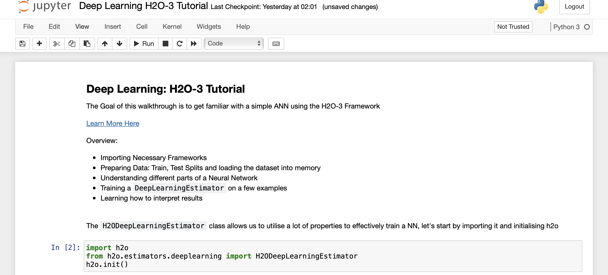

# Deep Learning Walkthrough Hands-On Assignment in H2O-3

## Deep Learning Walkthrough Hands-On Assignment in H2O-3

### Objective

This is the hands-on exercise wherein you will be doing a walkthrough to observe how to train a Deep Neural Network using H2O-3.

For this assignment, you will be using the [cars-mileage](https://s3.amazonaws.com/h2o-public-test-data/smalldata/junit/cars_20mpg.csv) dataset which contains information on various car models, their properties and mileage. 

Followed by a tutorial on [MNIST Dataset](http://yann.lecun.com/exdb/mnist/).

This tutorial follows an iterative process, where we introduce a ANN using the default parameters of the H2O-3 API and followed by that, add more details and dive into different concepts.

**Note: This tutorial has been built on Aquarium, which is H2O.ai's cloud environment providing software access for workshops, conferences, and training. The labs in Aquarium have datasets, experiments, projects, and other content preloaded. If you use your version of H2O-3 or Driverless AI, you will not see preloaded content.**
 
### Prerequisites

- Basic knowledge of Machine Learning and Statistics
- An [Aquarium](https://aquarium.h2o.ai/) Account to access H2O.ai’s software on the AWS Cloud. 
  - Need an [Aquarium](https://aquarium.h2o.ai/) account? Follow the instructions in the next section **Task 1 Create An Account & Log Into Aquarium** to create an account
  - Already have an Aquarium account? Log in and continue to **Task 2 Launch the H2O-3 & Sparkling Water Lab** to begin your exercise!
 
**Note: Aquarium's Driverless AI lab has a license key built-in, so you don't need to request one to use it. Each Driverless AI lab instance will be available to you for two hours, after which it will terminate. No work will be saved. If you need more time to further explore Driverless AI, you can always launch another lab instance or reach out to our sales team via the [contact us form](https://www.h2o.ai/company/contact/).**
 
### Task 1: Create An Account & Log Into Aquarium
 
Navigate to the following site: https://aquarium.h2o.ai/login and do the following: 
1) create a new account (if you don’t have one) 
2) log into the site with your credentials.
3) Navigate to the lab: *H2O-3 and Sparkling Water Test Drive*. Click on Start Lab and wait for your instance to be ready. Once your instance is ready, you will see the following screen.

Click on the Jupyter url to start a jupyter notebook or the H2O Flow instance( if required). You can create a new Jupyter notebook and follow the steps defined below.
 
 
### Task 2: Open a New Jupyter Notebook

Open a new Jupyter Python3 Notebook by clicking New and selecting Python 3

In this notebook, you will:

1. Startup an H2O Cluster
2. Import necessary packages
3. Import the Credit Card dataset
4. Train an isolation forest
5. Inspect the Predictions

#### Deeper Dive and Resources:

- [Jupyter Notebook Tutorial](https://www.dataquest.io/blog/jupyter-notebook-tutorial/)
 
### Task 3: Initialize the H2O-3 Cluster

In this section, you will use the `h2o.init()` method to initialize H2O. In the first cell of your notebook, you will:
 
1. Import the h2o python library 
2. Initialize the H2O cluster.  
3. Import the H2oDeepLearningEstimator Algorithm

You can enter the following in the first cell:

~~~python
import h2o
h2o.init()
from h2o.estimators.deeplearning import H2ODeepLearningEstimator
~~~

Your notebook should look like this:

 
#### Deeper Dive and Resources:

- [Starting H2O from Python](http://docs.h2o.ai/h2o/latest-stable/h2o-docs/starting-h2o.html#from-python)

### Task 4: Import the Cars Dataset 

For this assignment, you will be using the cars-mileage dataset which contains information on various car models, their properties and mileage. 

1. Import the dataset using the URL

~~~python
#Import the dataset
cars = h2o.import_file("https://s3.amazonaws.com/h2o-public-test-data/smalldata/junit/cars_20mpg.csv")
cars
 
Note: The line with the # is a code comment.  These can be useful to describe what you are doing in a given section of code.
~~~

#### Deeper Dive and Resources:

- [Importing Data in H2O-3](http://docs.h2o.ai/h2o/latest-stable/h2o-docs/data-munging/importing-data.html)

 
### Task 5: Training the Deep Learning Estimator Function

In the previous course, AI foundations we had learned about different parts of an ANN, namely:
- Single Neuron: Building block of a NN
- Layers: Consist of multiple Neurons
- Hidden Layers: Layers between input and output layer of an ANN
- Activation Functions: Non-Linearities introduced to train a model
- Training a Model
- Loss values and interpreting loss

Let’s explore these in H2O-3:

Here we are trying to predict the response variable, i.e. the number of cylinders based on other properties of the 

~~~python
cars["economy_20mpg"] = cars["economy_20mpg"].asfactor()
predictors = ["displacement","power","weight","acceleration","year"]
response = "cylinders"
cars_dl = H2ODeepLearningEstimator(activation=None)
#cars_dl = H2ODeepLearningEstimator(activation="tanh")
cars_dl.train(x=predictors,
              y=response,
              training_frame=cars)
cars_dl.mse()
~~~

We just trained our First Neural Network to predict the number of cylinders given: Displacement, Power, Weight, Acceleration and Year of a Car's make by using the defaults in H2O-3, let's see what adding a simple activation layer does:

~~~python
train, valid = cars.split_frame(ratios=[.8], seed=1234)
cars_dl = H2ODeepLearningEstimator(activation="tanh",
                                   epochs=15,
                                   seed=1234)
cars_dl.train(x=predictors,
              y=response,
              training_frame=train,
              validation_frame=valid)
cars_dl.mse()
~~~

#### Deeper Dive and Resources:
- [Deep Learning in H2O-3](http://docs.h2o.ai/h2o/latest-stable/h2o-py/docs/modeling.html#h2odeeplearningestimator)

### Task 6: Advanced section: Learning more about NNs

Let’s look at some more concepts:
- Epochs: are equivalent to the number of times the DeepLearningEstimator looks at the dataset
- Hidden: used to define the size of the hidden layers
- Dropout: Used for avoiding overfitting, by randomly deleting some "connections" in layers

~~~python 
cars_dl = H2ODeepLearningEstimator(activation='tanhwithdropout',
                                   epochs=20,
                                   hidden=[200,200],
                                   hidden_dropout_ratios=[0.5,0.5],
                                   seed=1234)
 
cars_dl.train(x=predictors,
              y=response,
              training_frame=train,
              validation_frame=valid)
cars_dl.mse()
~~~

 
 
- Mini-Batch Size: In reality, all of the dataset cannot be loaded into the memory, in such cases, we'd like to define batches (or mini-batches) that get processed in the memory
 
~~~python
cars_dl = H2ODeepLearningEstimator(activation='tanhwithdropout',
                                   epochs=20,
                                   hidden=[200,200],
                                   hidden_dropout_ratios=[0.5,0.5],
                                   seed=1234,
                                   mini_batch_size=32)
 
cars_dl.train(x=predictors,
              y=response,
              training_frame=train,
              validation_frame=valid)
cars_dl.mse()
~~~

- Learning Rate: As we know now, Neural Networks are trained by SGD, but we still need to define a rate at which we can update the weights, hence: learning rate

~~~python
cars_dl = H2ODeepLearningEstimator(activation='tanhwithdropout',
                                   epochs=20,
                                   hidden=[200,200],
                                   hidden_dropout_ratios=[0.5,0.5],
                                   seed=1234,
                                   mini_batch_size=32,
                                   rate=0.01)
 
cars_dl.train(x=predictors,
              y=response,
              training_frame=train,
              validation_frame=valid)
cars_dl.mse()
~~~
 
Regularisation are techniques to avoid overfitting, let's take a look at L1 and L2 regularisation:
- L1 regularization (can add stability and improve generalization, causes many weights to become 0).
- L2 regularization (can add stability and improve generalization, causes many weights to be small.

~~~python
cars_dl = H2ODeepLearningEstimator(activation='tanhwithdropout',
                                   epochs=20,
                                   hidden=[200,200],
                                   hidden_dropout_ratios=[0.5,0.5],
                                   seed=1234,
                                   mini_batch_size=32,
                                   rate=0.01,
                                   l1=1e-5)
 
cars_dl.train(x=predictors,
              y=response,
              training_frame=train,
              validation_frame=valid)
cars_dl.mse()
~~~
 
A few more advanced tricks that were discussed in the lecture are:
- Weight Initialisation: A NN consists of matrices and there are multiple ways to initialise them
- Cross Validation: Cross validation is a process used to create "folds" of data to evaluate model performance on.
- Adaptive Learning Rate: Specify whether to enable the adaptive learning rate (ADADELTA)
- Checkpointing: Ideally, when working with any form of models, you'd want to checkpoint the training at different parts to utilise these as continuum points

We leave this to you to explore utilising the documentations and move onto the final Task

### Task 7: Working with Digits: MNIST Dataset

In the extended task, we're looking at the [MNIST](http://yann.lecun.com/exdb/mnist/) Dataset dataset.

The goal of this task is to:
- Download and load train dataset
- Download and load test dataset
- setup num of classes
- setup a H2ODeepLearningEstimator and configure values of:
  - Activation Function
  - Adaptive Rate
  - Learning Rate
  - Learning Rate Decay
  - Learning Rate Annealing
  - Dropout Ratios
  - L1 & L2 Regularisation
The goal is to get a feel of how these parameters and these concepts affect model training, kindly toggle different values and see how it affects the model accuracies.

Import the Dataset:

~~~python
train = h2o.import_file("https://h2o-public-test-data.s3.amazonaws.com/bigdata/laptop/mnist/train.csv.gz")
test = h2o.import_file("https://h2o-public-test-data.s3.amazonaws.com/bigdata/laptop/mnist/test.csv.gz")
train.shape
~~~
 
Starting point, the following snippet should help you get started, as an experiment, try changing values and further datasets to see how the NN behaves:

~~~python
train = h2o.import_file("https://s3.amazonaws.com/h2o-public-test-data/bigdata/laptop/mnist/train.csv.gz")
test = h2o.import_file("https://s3.amazonaws.com/h2o-public-test-data/bigdata/laptop/mnist/test.csv.gz")
predictors = list(range(0,784))
resp = 784
train[resp] = train[resp].asfactor()
test[resp] = test[resp].asfactor()
nclasses = train[resp].nlevels()[0]
model = H2ODeepLearningEstimator(activation="RectifierWithDropout",
                                 adaptive_rate=False,
                                 rate=0.01,
                                 rate_decay=0.9,
                                 rate_annealing=1e-6,
                                 momentum_start=0.95,
                                 momentum_ramp=1e5,
                                 momentum_stable=0.99,
                                 nesterov_accelerated_gradient=False,
                                 input_dropout_ratio=0.2,
                                 train_samples_per_iteration=20000,
                                 classification_stop=-1,
                                 l1=1e-5)
model.train (x=predictors,y=resp, training_frame=train, validation_frame=test)
model.model_performance(valid=True)
~~~

### Task 8: Evaluation

Because the isolation forest is an unsupervised method, it makes sense to have a look at the classification metrics that are not dependent on the prediction threshold and give an estimate of the quality of scoring. Two such metrics are Area Under the Receiver Operating Characteristic Curve (AUC) and Area under the Precision-Recall Curve (AUCPR).

`AUC` is a metric evaluating how well a binary classification model distinguishes true positives from false positives. The perfect AUC score is 1; the baseline score of a random guessing is 0.5.

`AUCPR` is a metric evaluating the precision recall trade-off of a binary classification using different thresholds of the continuous prediction score. The perfect AUCPR score is 1; the baseline score is the relative count of the positive class.

For highly imbalanced data, AUCPR is recommended over AUC as the AUCPR is more sensitive to True positives, False positives and False negatives, while not caring about True negatives, which in large quantity usually overshadow the effect of other metrics.

~~~python
%matplotlib inline
from sklearn.metrics import roc_curve, precision_recall_curve, auc
import matplotlib.pyplot as plt
import numpy as np
 
 
def get_auc(labels, scores):
    fpr, tpr, thresholds = roc_curve(labels, scores)
    auc_score = auc(fpr, tpr)
    return fpr, tpr, auc_score
 
 
def get_aucpr(labels, scores):
    precision, recall, th = precision_recall_curve(labels, scores)
    aucpr_score = np.trapz(recall, precision)
    return precision, recall, aucpr_score
 
 
def plot_metric(ax, x, y, x_label, y_label, plot_label, style="-"):
    ax.plot(x, y, style, label=plot_label)
    ax.legend()
    
    ax.set_ylabel(x_label)
    ax.set_xlabel(y_label)
 
 
def prediction_summary(labels, predicted_score, predicted_class, info, plot_baseline=True, axes=None):
    if axes is None:
        axes = [plt.subplot(1, 2, 1), plt.subplot(1, 2, 2)]
 
    fpr, tpr, auc_score = get_auc(labels, predicted_score)
    plot_metric(axes[0], fpr, tpr, "False positive rate",
                "True positive rate", "{} AUC = {:.4f}".format(info, auc_score))
    if plot_baseline:
        plot_metric(axes[0], [0, 1], [0, 1], "False positive rate",
                "True positive rate", "baseline AUC = 0.5", "r--")
 
    precision, recall, aucpr_score = get_aucpr(labels, predicted_score)
    plot_metric(axes[1], recall, precision, "Recall",
                "Precision", "{} AUCPR = {:.4f}".format(info, aucpr_score))
    if plot_baseline:
        thr = sum(labels)/len(labels)
        plot_metric(axes[1], [0, 1], [thr, thr], "Recall",
                "Precision", "baseline AUCPR = {:.4f}".format(thr), "r--")
 
    plt.show()
    return axes
 
 
def figure():
    fig_size = 4.5
    f = plt.figure()
    f.set_figheight(fig_size)
    f.set_figwidth(fig_size*2)
 
 
h2o_predictions = predictions.as_data_frame()
 
figure()
axes = prediction_summary(
    h2o_predictions["class"], h2o_predictions["predict"], h2o_predictions["predicted_class"], "h2o")
~~~

Code link: https://gist.github.com/init27/2b3f1309024e3240046acdf49943a4f2

### Next Steps

In the above study, you learned above building Deep NNs, how to use them on Tabular Dataset and how to interpret their predictions.

You can now proceed on to attempt the **Quiz 1: DL Basics with H2O-3**

