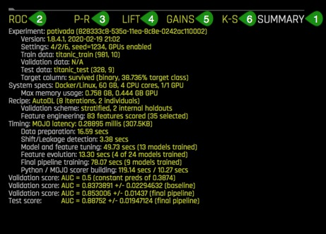
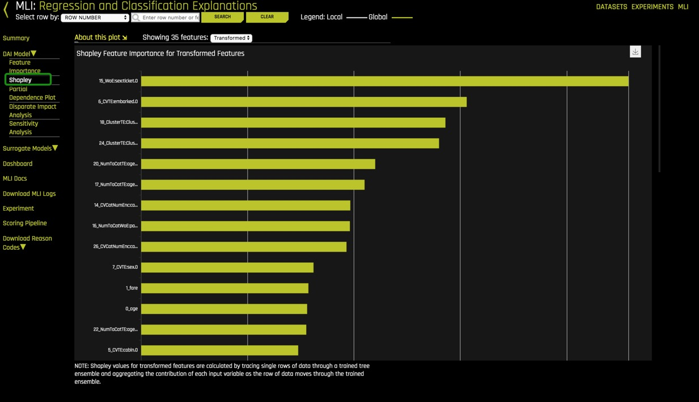

# Automatic Machine Learning Introduction with Driverless AI

## Outline

- [Objective](#objective)
- [Prerequisites](#prerequisites)
- [Task 1: Product Tour](#task-1-product-tour)
- [Task 2: Automatic Machine Learning Concepts](#task-2-automatic-machine-learning-concepts)
- [Task 3: Load Data](#task-3-load-data)
- [Task 4: Explore Data Details and AutoViz](#task-4-explore-data-details-and-autoviz)
- [Task 5: Launch First Experiment](#task-5-launch-first-experiment)
- [Task 6: Explore Feature Engineering](#task-6-explore-feature-engineering)
- [Task 7: Explore Experiment Results](#task-7-explore-experiment-results)
- [Task 8: MLI Report for Non-Time-Series](#task-8-mli-report-for-non-time-series)
- [Task 9: Experiment Summary and Autoreport](#task-9-experiment-summary-and-autoreport)
- [Next Steps](#next-steps)
- [Appendix: Project Workspace](#appendix-project-workspace)


## Objectivo

Para este tutorial, vamos a explorar el conjunto de datos sobre el Titanic desde la perspectiva de una compañía de aseguranza de vidas usando el producto de empresa de [H2O.ai](https://www.h2o.ai/), [Driverless AI](https://www.h2o.ai/products/h2o-driverless-ai/). Vamos a explorar posibles factores de riesgos derivados desde este conjunto de datos que la compañía podría haber considerado al momento de vender aseguranza de vida a estos pasajeros. Específicamente, crearemos un modelo de predicción para determinar cuales factores contribuyeron a la supervivencia de los pasajeros.

En este tutorial de Driverless AI, vamos a aprender a cargar datos, explorar detalles sobre los datos, generar auto-visualizaciones, lanzar un experimento, explorar feature engineering, desplegar los resultados del experimento, y daremos un pequeño tour del reporte de Machine Learning Interpretability.

**Nota**: Este tutorial ha sido creado en Aquarium, lo cual es parte de H2O cloud y provee acceso a varias herramientas para talleres, conferencias, y entrenamientos de enseñanza. Los laboratorios en Aquarium tienen conjuntos de datos, experimentos, proyectos, y otros contenidos precargados. Si usted usa su propia versión de Driverless AI, no podrá ver el contenido precargado.


## Prerequisites

A **Two Hour Test Drive session**: Test Drive is H2O's Driverless AI on the AWS Cloud. No need to download software. Explore all the features and benefits of the H2O Automatic Learning Platform. 

- Need a **Two Hour Test Drive** session? [Try it Now](https://www.h2o.ai/test-drive/). Follow the instructions [on this quick tutorial](https://h2oai.github.io/tutorials/getting-started-with-driverless-ai-test-drive/#0) to get a Test Drive session started. After the Driverless AI Test Drive session starts, continue reading the remaining prerequisites of this tutorial then start [Task 1: Product Tour](https://h2oai.github.io/tutorials/automatic-ml-intro-test-drive-tutorial/#2).

- Already have a **Two Hour Test Drive** session? Continue reading the remaining prerequisites of this tutorial then start [Task 1: Product Tour](https://h2oai.github.io/tutorials/automatic-ml-intro-test-drive-tutorial/#2). 

**Note: Each Test Drive instance will be available to you for two hours, after which it will terminate. No work will be saved. If you need more time to further explore Driverless AI, you can always launch another Test Drive instance or reach out to our sales team via the [contact us form](https://www.h2o.ai/company/contact/).**

- Basic knowledge of Machine Learning and Statistics


## Task 1: Product Tour

Welcome to the Driverless AI **Datasets** page! 


The Driverless UI is easy to navigate. The following features, as well as a few datasets, are found on the **Datasets** page. We will explore these features as we launch an experiment in the next tasks.

1. **Projects**: Projects Workspace for managing datasets and experiments menu option.

2. **Datasets**: View of current datasets. Other features for datasets include the options to add a dataset, get dataset details, visualize, split, predict, rename, download, and delete. 

3. **Autoviz**: Visualize a dataset with all available graphs.

4. **Experiments**: View of completed experiments. Experiments can be revised or deleted. 

5. **Diagnostics**: Diagnose a model and view model performance for multiple scorers based on the existing model and dataset.

6. **MLI**: View a list of interpreted models or interpret a model.

7. **Deployments**: Deploy the MOJO and Python scoring pipelines for you to test or to integrate into a final product. You can also deploy locally or in the cloud.

8. **Resources**: The Resources dropdown menu provides you with links to view System Information, the Driverless AI User Guide and Help. From this dropdown menu, you can also download the Python Client, R Client, and the MOJO2 runtime, MOJO2 Py runtime, and MOJO2 R runtime.

9. **Messages[ ]**: View news and upcoming Driverless AI events.

10. **Logout H2OAI**: Logs you out of your current session.

11. **<**: Go back to the previous page.

12. **H2OAI**: Takes you back to the H2OAI **Datasets** Page.

13. **Driverless AI 1.X.X**: Version of Driverless AI 

14. **Add a Dataset(or Drag and Drop)**: Upload or add a dataset.


### Deeper Dive and Resources

-  [Join the H2O community on Slack to Ask Questions](https://h2oai-community.slack.com/). Post your questions, discuss use cases, give feedback, stay informed about the latest H2O.ai updates, and more.

- Learn more are about H2O Driverless through the [H2O documentation](http://docs.h2o.ai/driverless-ai/latest-stable/docs/booklets/DriverlessAIBooklet.pdf).

- [Explore H2O Product Documentation](http://docs.h2o.ai/)

- [Learn more H2O Driverless by reviewing the FAQs](http://docs.h2o.ai/driverless-ai/latest-stable/docs/userguide/faq.html) 

## Task 2: Automatic Machine Learning Concepts

###  Artificial Intelligence and Machine Learning

The concepts found in this section are meant to provide a high-level overview of Machine Learning. At the end of this section, you can find links to resources that offer a more in-depth explanation of the concepts covered here.

 Machine learning is a subset of Artificial intelligence where the focus is to create machines that can simulate human intelligence. One critical distinction between artificial intelligence and machine learning is that machine learning models "learn" from the data the models get exposed to. Arthur Samuel, a machine learning pioneer back in 1959, defined machine learning as a " field of study that gives computers the ability to learn without being explicitly programmed" [1]. A machine learning algorithm trains on a dataset to make predictions. These predictions are, at times, used to optimize a system or assist with decision making.

### Machine Learning Training

Advances in technology have made it easier for data to be collected and made available.  The available type of data will determine the kind of training that the machine learning model can undergo. There are two types of machine learning training, supervised and unsupervised learning. Supervised learning is when the dataset contains the output that you are trying to predict. For those cases where the predicting variable is not present, it's called unsupervised learning. Both types of training define the relationship between input and output variables.

In machine learning, the input variables are called **features** and the output variables **labels**. The labels, in this case, are what we are trying to predict. The goal is to take the inputs/features and use them to come up with predictions on never-before-seen data. In linear regression, the features are the x-variables, and the labels are the y-variables. 

A machine learning model defines the relationship between features and labels. When models are trained, you can train a model by feeding it examples. Examples are a particular instance of data.  You can have two types of examples: labeled and unlabeled. Labeled examples are those where the x and y values (features, labels) are known. Unlabeled examples are those where we know the x value, but we don't know what the y value is (feature,?)[1]. Your dataset is like an example; the columns that will be used for training are the features; the rows are the instances of those features. The column that you want to predict is the label.

Supervised learning takes labeled examples and allows a model that is being trained to learn the relationship between features and labels. The trained model is then tested with unlabeled data, and it's allowed to predict the y value (label) for the unlabeled data. Testing a trained model with unlabeled data is called unsupervised training [1]. Note that H2O Driverless AI creates models with labeled examples.

### Data Preparation 

A machine learning model is as good as the data that is used to train it. If you use garbage data to train your model, you will get a garbage model. With this said, before uploading a dataset into tools that will assist you with building your machine learning model such as Driverless AI, ensure that the dataset has been cleaned and prepared for training. The process of transforming raw data into another format, which is more appropriate and valuable for analytics, is called data wrangling. 

Data wrangling, which can include extractions, parsing, joining, standardizing, augmenting, cleansing, consolidating, and filtering, is highly recommended to be done before uploading the dataset to Driverless AI.  Data preparation includes the dataset being in the correct format for what you are trying to do. Duplicates have been removed.  Missing data is fixed or removed, and finally, categorial values have been transformed or encoded to a numerical type. Finally, proper transformations have been done on the dataset, such as scaling, decomposition, and aggregation, otherwise known as feature engineering [2]. Tools like [Python datatable](https://datatable.readthedocs.io/en/latest/?badge=latest), [Pandas](https://pandas.pydata.org/) and [R](https://www.r-project.org/) are great assets for data wrangling. 

Driverless AI can do some data wrangling. Data wrangling can be done via a [data recipe](https://www.r-project.org/), the [JDBC connector](http://docs.h2o.ai/driverless-ai/1-8-lts/docs/userguide/connectors-nd/jdbc.html?highlight=jdbc) or through [live code](http://docs.h2o.ai/driverless-ai/1-8-lts/docs/userguide/datasets-describing.html?highlight=live%20code#modify-by-recipe) which will create a new dataset by modifying the existing one. 

 
### Data Transformation/Feature Engineering

Data transformation or feature engineering is the process of creating new features from the existing ones. Some data transformations include looking at all the features and identifying which features can be combined to make new ones that will be more useful to the performance of the model. For categorical features, the recommendation is for classes that have few observations to be grouped to reduce the likelihood of the model overfitting. Additionally, dummy variables are introduced for categorical features to facilitate machine learning since many algorithms cannot handle categorical features directly.  Last but not least, remove features that are not used or are redundant [3]. These are only a few suggestions when approaching feature engineering. Feature engineering is very time-consuming due to its repetitive nature; it can also be costly. The next step in creating a model is selecting an algorithm.

### Algorithm Selection

“Machine learning algorithms are described as learning a target function (f) that best maps input variables (x) to an output variable(y): Y= f(x)” [4]. In supervised learning, there are many algorithms to select from for training. The type of algorithm(s) will depend on the size of your data set, structure, and the type of problem you are trying to solve.  Through trial and error, the best performing algorithms can be found for your dataset. Some of those algorithms include linear regression, classification, regression trees, random forests, naive Bayes, and random forest, boosting, to name a few [5]. 

### Model Training

**Datasets** 

One good practice when training a machine learning model is to split up your dataset into subsets: training, validation, and testing sets. A good ratio for the entire dataset is 70-15-15, 70% of the whole dataset for training, 15% for validation, and the remaining 15% for testing. The **training set** is the data that will be used to train the model, and it needs to be big enough to get significant results from it. The **validation set** is the data that has been held back from the training and will be used to evaluate and adjust the hyperparameters of the trained model and hence adjust the performance. Finally, the **test set** is data that has also been held back and will be used to confirm the results of the final model [1].


Another part of model training is fitting and tuning the models. For fitting and tuning, hyperparameters need to be tuned, and cross-validation needs to take place using only the training data. Various hyperparameters values will need to be tested. Additionally, a cross-validation loop will be set to calculate the cross-validation score for each set of hyperparameters for each algorithm. Based on the cross-validation score and hyperparameter values, you can select the model for each algorithm that has been tuned with training data and test is it using your test set.  The performance of your regression model can be evaluated by performance metrics such as the Mean Square Error (MSE), ROC Curve, Prec-Recall, LIFT, and Gain, to name a few.

### What are the challenges in AI Model Development?

One of the significant challenges faced in developing a single production-ready model is that it can take weeks or months to build it. Developing a model involves feature engineering, model building, and model deployment. All tasks are very repetitive, time-consuming, require advanced knowledge of feature generation, algorithms, parameters, and model deployment. Finally, there needs to be in-depth knowledge and confidence in how the model was generated to explain and justify how the model made its decisions.


### What is Automated Machine Learning, and why is it important?

AutoML or Automated Machine Learning is the process of automating algorithm selection, feature generation, hyperparameter tuning, iterative modeling, and model assessment. AutoML tools such as H2O Driverless AI makes it easy to train and evaluate machine learning models. Automating the repetitive tasks of Machine Learning Development allows people in the industry to focus on the data and the business problems they are trying to solve. 

### References
[1] [Google’s Machine Learning Crash Course](https://developers.google.com/machine-learning/crash-course/training-and-test-sets/splitting-data)

[2] [About Train, Validation and Test Sets in Machine Learning](https://towardsdatascience.com/train-validation-and-test-sets-72cb40cba9e7)

[3] [Data Science Primer - Data Cleaning](https://elitedatascience.com/data-cleaning)

[4] [Feature Engineering](https://elitedatascience.com/feature-engineering) 

[5] [Towards Data Science- Supervised vs Unsupervised Learning](https://towardsdatascience.com/supervised-vs-unsupervised-learning-14f68e32ea8d) 

[6] [Selecting the best Machine Learning Algorithm for your regression problem](https://towardsdatascience.com/selecting-the-best-machine-learning-algorithm-for-your-regression-problem-20c330bad4ef)

### Deeper Dive and Resources

- [Explore the replays from H2O World around the world](
https://www.h2o.ai/h2oworldnewyork/) 
- [Explore the webinar replays](
https://www.brighttalk.com/search/?q=driverless+ai) 
- [Explore the various H2O Driverless AI playlists on YouTube](https://www.youtube.com/user/0xdata/playlists) 


## Task 3: Load Data

1\. Navigate back to the H2O Driverless AI  **Datasets** page.

### About the Dataset

The dataset used for this experiment is a version of the Titanic Kaggle dataset. This dataset contains the list of estimated passengers aboard the RMS Titanic.

The RMS Titanic was a British commercial passenger liner that sank after colliding with an iceberg in the North Atlantic Ocean on April 15, 1912. More than 1,500 people lost their lives from an estimated 2,224 passengers and crew members while on their way to New York City from Southampton. 

This tragedy shocked the international community and led to better safety regulations for ships. The lack of lifeboats, amongst other things, was one of the factors that resulted in a significant loss of life. Although there was some element of luck involved in surviving the sinking, some groups of people were more likely to survive than others.


[RMS Titanic-Wikipedia](https://en.wikipedia.org/wiki/RMS_Titanic#/media/File:RMS_Titanic_3.jpg)

**Titanic dataset**:

1309 rows, one row per passenger, and 16 columns representing attributes of each passenger:

|Attribute|Definition|Key|
|---|---|---|
|passenger Id|Id randomly generated| - |
|pclass|Passenger Class| 1= 1st, 2 =2nd, 3=3rd|
|survived|Survival| 0=No, 1=Yes|
|name_with_salutations|Passenger name| - |
|name_without_salutations|Passenger name without salutations| - |
|sex|Sex|Female, Male|
|age|Age in years| - |
|sibsp|Number of siblings/Spouse aboard| - |
|parch|Number of Parents/Children aboard| - |
|ticket|Ticket number| - |
|fare|Passenger fare| - |
|cabin|Cabin number| - |
|embarked|Port of Embarkment|C = Cherbourg, Q = Queenstown, S = Southampton|
|boat|Boat number| - |
|body|Body number| - |
|home.des|Home Destination| - |


### Add the Data 

1\. Click on **Add a Dataset(or Drag and Drop)**  

2\. Select **FILE SYSTEM**


3\. Enter the following */data/TestDrive/titanic.csv* into the search bar. Select *titanic.csv* then **Click to Import Selection**. 


4\. If the file loaded successfully, then you should see an  image similar to the one below:


*Things to Note:*

1. You can view:

  - Dataset filename
  - File size
  - Number of rows/columns 
  - File status

2. Option to go back to the previous page  

### Deeper Dive and Resources

- [Learn More About the Type of Dataset File formats that Can be Uploaded](http://docs.h2o.ai/driverless-ai/latest-stable/docs/userguide/datasets.html#adding-datasets) 

- For more datasets, check out [Kaggle Datasets](https://www.kaggle.com/datasets)

## Tarea 4: Explore los Detalles de Datos y AutoViz

### Detalles

Ahora vamos a explorar el conjunto de datos Titanic que acabamos de cargar.

1\. Continuando en **Dataset Overview page** (página de descripción general del conjunto de datos), haga clic en el conjunto de datos titanic.csv. Aparecerán las siguientes opciones:


 - Details (Detalles) - Vea un resumen del conjunto de datos o obtenga una vista previa del conjunto de datos
 - Visualize (Visualizar) - Visualice el conjunto de datos con gráficos disponibles
 - Split (Dividir) - Dividir el conjunto de datos
 - Predict (Predecir) - Ejecuta un experimento usando Driverless AI (IA sin conductor)
 - Rename (Cambiar Nombre) - Cambiar el nombre del conjunto de datos
 - Download (Descargar) - Descargar el conjunto de datos
 - Delete (Eliminar) - Eliminar el conjunto de datos

**Nota**: Un conjunto de datos solo se puede eliminar si no se está utilizando en un experimento. De lo contrario, primero debe eliminar el experimento y luego se puede eliminar el conjunto de datos.

2\. A continuación, confirmaremos que el conjunto de datos se cargó correctamente y que tiene el número correcto de filas y columnas haciendo clic en **Details**.

3\. Haga clic en **Details**. **Details** lo llevará a **Dataset Details Page** (Página de detalles del conjunto de datos)

 

*Cosas a tener en cuenta:*

1. **Dataset Details Page** proporciona un resumen del conjunto de datos. Este resumen enumera cada columna que se incluye en el conjunto de datos junto con:

    **Logical type (can be changed) (Tipo lógico (se puede cambiar))**

    

    **Formato para columnas de Date (Fecha) y Datetime (Fecha y Hora) (se puede cambiar)**

    

    - Storage type (Tipo de almacenamiento)
    - Count (Contar)
    - Number of missing values: Missing (Número de valores faltantes: Desaparecido)
    - Mean (Medio)
    - Minimum (Mínimo)
    - Maximum (Máximo)
    - Standard deviation: stdev (Desviación estándar: stdev)
    - Frequency: Freq (Frecuencia: Freq)
    - Number of unique values: Unique (Número de valores únicos: Único)
    - Ver las primeras 20 filas de una columna

    

    **Nota**: Driverless AI reconoce los siguientes tipos de columna: integer (entero), String (cuerda), real (real), boolean (booleano) y time (tiempo). Las columnas de Date (fecha) reciben un tipo de cuerda "str".

2. Puede ver la información de una columna específica ingresando el nombre de la columna en el campo sobre el gráfico.

3. **Modify by Recipe** (Modificar por receta) le permite crear un nuevo conjunto de datos modificando un conjunto de datos existente con recetas personalizadas.

4. **Dataset Rows** (Filas de conjunto de datos) le permite obtener una vista previa del conjunto de datos

5. Opción para salir y volver a la página H2O **Datasets** (Conjuntos de datos)

4\. Seleccione **Dataset Rows** (Filas de conjunto de datos)    


*Cosas a tener en cuenta:*
 1. Vista previa del conjunto de datos
 2. Ver las filas restantes
 3. **Modify by Recipe** - Modificar el conjunto de datos a través de una receta personalizada
 4. Regrese a **Dataset Overview** (Descripción general del conjunto de datos)
 5. Opción para salir y volver a la página H2O **Datasets** 

5\. Salga y regrese a la página **Datasets Overview**.

### Dividir el conjunto de datos

A partir del conjunto de datos Titanic.csv, vamos a crear dos conjuntos de datos, entrenamiento y prueba. El 75% de los datos se utilizarán para entrenar el modelo y el 25% para probar el modelo entrenado.

1\. Haga clic en el archivo titanic.csv y seleccione **Split**


2\. Divida los datos en dos conjuntos: titanic_train (titanic_entrenamiento) y titanic_test (titanic_prueba), luego guarde los cambios. Use la imagen a continuación como guía:


*Cosas a tener en cuenta:*

1. Para OUTPUT NAME 1: ingrese ``` titanic_train``` (esto servirá como conjunto de entrenamiento)
2. Para OUTPUT NAME 2: ingrese ``` titanic_test``` (esto servirá como el conjunto de prueba)
3. Puedes cambiar Random Seed (semilla aleatoria); esto generará la misma división cada vez
4. Cambie el valor de división a .75 ajustando el control deslizante a 75% o ingresando .75 en la sección que dice *Train/Valid Split Ratio* (Entrenamiento / Relación de división válida)
5. Guarda los cambios que hiciste

Se seleccionó la proporción de .75 para este conjunto de datos en particular para no generalizar el modelo dado el tamaño total del conjunto.

**The training set** (El conjunto de entrenamiento) contiene 981 filas, cada fila representa un pasajero y 16 columnas que representan los atributos de cada pasajero.

**The Test set** (El conjunto de prueba) contiene 328 filas, cada fila representa un pasajero y 16 columnas de atributos que representan los atributos de cada pasajero.

Verifique que los tres conjuntos de datos Titanic, titanic_test, titanic_train y titanic.csv estén allí:


### Autoviz

Ahora que el conjunto de datos titanic.csv se ha dividido, utilizaremos el conjunto ** titanic_train ** para el resto del tutorial.

Hay dos formas de visualizar el conjunto de entrenamiento:


**Método 1**: Al hacer clic en el archivo **titanic_train**, seleccione **Visualize**,luego haga clic en el archivo de visualización generado.

**Método 2**: haciendo clic en **Autoviz** ubicado en la parte superior de la página de la interfaz de usuario, donde se le pedirá el conjunto de datos que desea visualizar.

1\. Elija un método para visualizar el conjunto de datos ** titanic_train **. Debería aparecer una imagen similar:


Haga clic en la visualización **titanic_train** y aparecerá la siguiente pantalla.


¿Es posible visualizar cómo se correlacionan las variables en el conjunto de entrenamiento? ¿Podemos determinar qué otras variables están fuertemente correlacionadas con la supervivencia de un pasajero? ¡La respuesta a esas preguntas es sí! Uno de los gráficos que nos permite visualizar las correlaciones entre variables es el **Correlation Graph** (Gráfico de correlación).

Exploremos la correlación entre la variable 'survived' (sobrevivido) y otras variables en el conjunto de datos.

2\. Seleccione **Correlation Graph** y luego haga clic en **Help** (ayuda) ubicado en la esquina inferior izquierda del gráfico.

3\. Tómese un minuto para leer acerca de cómo se construyó el gráfico de correlación. Obtenga más información sobre cómo las variables están codificadas por colores para mostrar sus correlaciones. 

4\. Tome la variable 'survived' y arrástrela un poco para ver mejor las otras variables con las que Driverless AI descubrió que está correlacionada.

¿Qué variables están fuertemente correlacionadas con la variable 'survived'?


*Cosas a tener en cuenta:*

 - El botón **Help** explica el **Correlation Graph**. Esta característica está disponible para todos los gráficos.
- **Download** (Descargar) permite descargar una imagen a escala completa del gráfico

5\. Salga de la vista  **Correlation Graph** haciendo clic en **X** en la esquina superior derecha del gráfico.

6\. Una vez que haya terminado de explorar los otros gráficos, regrese a la **datasets page** (página de conjuntos de datos).

Driverless AI muestra los gráficos que son aspectos "relevant" (relevantes) de los datos. Los siguientes son los tipos de gráficos disponibles:

- Correlated Scatterplots (Diagramas de dispersión correlacionados)
- Spikey Histograms (Histogramas puntiagudos)
- Skewed Histograms (Histogramas sesgados)
- Varying Boxplots (Varias parcelas)
- Heteroscedastic Boxplots (Diagramas de caja heterocedasticos)
- Biplots (Biplots)
- Outliers (Valores atípicos)
- Correlation Graph (Gráfico de correlación)
- Parallel Coordinates Plot (Parcela de coordenadas paralelas)
- Radar Plot (Parcela de radar)
- Data Heatmap (Mapa de calor de datos)
- Missing Values Heatmap (Mapa de calor de valores perdidos)
- Gaps Histogram (Brechas Histograma)

### Inmersión más profunda y Recursos

- [Obtenga más información sobre la visualización automática de los documentos sin controlador](http://docs.h2o.ai/driverless-ai/latest-stable/docs/userguide/datasets.html#visualizing-datasets)

- [Obtenga más información sobre la visualización automática del arquitecto Leland Wilkinson, científico jefe de H2O.ai de la sesión en el video de YouTube de H2O World 2017](https://www.youtube.com/watch?v=bas3-Ue2qxc)

- [Visualización automática SlideShare](https://www.slideshare.net/0xdata/automatic-visualization)

## Tarea 5: Lanzar primer experimento

Vamos a lanzar nuestro primer experimento. Un experimento significa que vamos a generar una predicción utilizando un conjunto de datos de nuestra elección.

1\. Regrese a la página **Dataset Overview page**

2\. Haga clic en el conjunto de datos **titanic_train** y luego seleccione **Predict**


Si es la primera vez que inicia un experimento, aparecerá el siguiente mensaje que le preguntará si desea realizar un recorrido.


Si desea realizar un recorrido rápido por la página **Experiments** (Experimentos), seleccione **YES** (SI), el recorrido rápido cubrirá los siguientes elementos:

- Seleccione el conjunto de datos de entrenamiento
- Seleccione la columna de destino que desea que Driverless AI prediga de todas las columnas
- Seleccione si es un problema de serie temporal o no [Time Series ON or OFF] ([Serie temporal activada o desactivada])

3\. Seleccione **Not Now** (Ahora no) para regresar y hacer el recorrido en otro momento.

4\. Aparecerá la siguiente página **Experiment** (Experimento):


*Cosas a tener en cuenta:*

1. Assistant (Asistente): recorrido interactivo para usuarios nuevos.Haga clic en **assistant** (asistente) para habilitarlo. Aparecen círculos amarillos alrededor de las secciones seleccionadas de la página de configuración del experimento. Puede colocar cualquiera de ellos para obtener más información sobre cada sección.

Nota: Para inhabilitar **assistant**, haga clic en asistente nuevamente.


 
 
1. **Display Name** (Nombre para mostrar) - Escriba el nombre para su experimento `Titanic Classification Tutorial`.
2. **Dataset** (Conjunto de datos) - El nombre del conjunto de datos que se utiliza para crear un experimento
3. **Rows** (Filas) - Número total de filas
4. **Columns** (Columnas) - Número total de columnas
5. **Dropped Columns** (Columnas eliminadas) - Elimine las columnas de su conjunto de datos que no desea usar en el experimento
6. **Validation Dataset** (Conjunto de datos de validación) - Seleccione el conjunto de datos que desea validar. Este conjunto se usará para validar parámetros como modelos, características, etc.
7. **Test Dataset** (Conjunto de datos de prueba) - El conjunto de datos que se utilizará para probar el modelo generado a partir del conjunto de datos de entrenamiento. No se usa durante el entrenamiento del modelo, y los resultados están disponibles al final del experimento.
8. **Target column** (Columna objetivo) - ¿Qué quieres predecir?
9. **Fold column** (Columna de plegado) - La columna de plegado se utiliza para crear los conjuntos de datos de capacitación y validación para que todas las filas con el mismo valor de plegado estén en el mismo conjunto de datos
10. **Weight column** (Columna de peso) - Columna que indica el peso de observación (también conocido como peso de muestra o fila), si corresponde. 
11. **Time Column** (Columna de tiempo) (DESACTIVADO de forma predeterminada): proporciona un orden de tiempo (marcas de tiempo para las observaciones). Se usa cuando los datos tienen una alta dependencia del tiempo (como la estacionalidad o tendencia), y desea tratar este problema como un problema de serie temporal.

Continuando con nuestro experimento:

5\. Haga clic en **Dropped Columns**, suelte las siguientes columnas: Passenger_Id (Id. De pasajero), name_with_salutations (nombre_con_saludos), name_without_salutations (nombre_sin_saludos), boat (bote), body (cuerpo) y home.dest (destino de origen). Luego seleccione **Done** (Listo).


Estos atributos (columnas) se eliminaron para crear un conjunto de datos más limpio. Los atributos como el bote y el cuerpo están excluidos porque son indicadores claros de que un pasajero sobrevivió y pueden conducir a la fuga de datos. Para nuestro experimento, la columna sobrevivida será suficiente para crear un modelo.

Un conjunto de datos limpio es esencial para la creación de un buen modelo predictivo. El proceso de limpieza de datos debe hacerse con todos los conjuntos de datos para eliminar cualquier conjunto de observaciones no deseadas, errores estructurales, valores atípicos no deseados o datos faltantes. 

6\. Seleccione **Test Dataset** y luego haga clic en **titanic_test**


7\. Ahora seleccione la **Target Column**. En nuestro caso, la columna sera 'survived' (sobrevivirá).


El atributo sobrevivido fue seleccionado porque, como compañía de seguros, queremos saber qué otros atributos pueden contribuir a la supervivencia de los pasajeros a bordo de un barco e incorporarlo a nuestras tarifas de seguro.

8\. Su página de experimento debería ser similar a la siguiente; Estas son las sugerencias del sistema:


*Cosas a tener en cuenta:*

1. **Training Settings** (Configuración de entrenamiento) - Describe la precisión, el tiempo y la interpretabilidad de su experimento específico. Las perillas en la configuración del experimento son ajustables a medida que los valores cambian el significado de la configuración en el cambio de página inferior izquierdo.
    - **Accuracy** (Precisión) - (Precisión relativa) valores más altos, deberían conducir a una mayor confianza en el rendimiento del modelo (precisión).
    - **Time** (Tiempo) - Tiempo relativo para completar el experimento. Los valores más altos tardarán más en completarse.
    - **Interpretability** (Interpretabilidad) - El grado en que un humano puede entender la causa de la decisión. 
2. **Expert Settings** (Configuración experta)- Configuración experta disponible para personalizar su experimento.
3. **Scorer**  (Anotador) - Driverless AI selecciona al mejor anotador en función de su conjunto de datos. Se pueden seleccionar otros anotadores manualmente.
4. **Classification** (Clasificación) - Botón de clasificación o regresión. Driverless AI determina automáticamente el tipo de problema en función de la columna de respuesta. Aunque no se recomienda, puede anular esta configuración haciendo clic en este botón. 
5. **Reproducible** (Reproducible) - Este botón le permite construir un experimento con una semilla aleatoria y obtener resultados reproducibles. Si esto está deshabilitado (predeterminado), los resultados variarán entre ejecuciones.
6. **GPUs Enabled** (GPU habilitadas) - Especifique si desea habilitar las GPU. (Tenga en cuenta que esta opción se ignora en los sistemas solo con CPU)
7. **Launch Experiment** (Lanzar experimento) - Inicia el experimento


9\. Actualice la siguiente configuración del experimento para que coincida con la imagen a continuación, luego seleccione **Launch Experiment**.

- Accuracy  (Precisión): 4
- Time (Tiempo): 2
- Interpretability (Interpretabilidad): 6
- Scorer (Anotador): AUC
- Reproducible (Reproducible): habilitado (haga clic en Reproducible)


**Note** (Nota): Para iniciar un experimento: el conjunto de datos y la columna de destino son los elementos mínimos necesarios para iniciar un experimento.

10\. La página **Experiment** (Experimento) se verá similar a la siguiente después de completar el 45%:


*Cosas a tener en cuenta:*
1. **Experiment Name** (Nombre del experimento) - Nombre de tu experimento. Si no le asigna un nombre, se generará un nombre aleatorio. El nombre se puede cambiar en cualquier momento.
2. **Experiment Setup** (Configuración del experimento) - Resumen de la configuración del experimento y detalles del conjunto de datos.
3. **Running Status Display** (Visualización del estado de ejecución) - estado de ajuste de parámetros seguido de ingeniería de características y canalización de puntuación. Los experimentos se pueden detener haciendo clic en el botón ```Finish``` (Finalizar).
4. Descripción general de la configuración del entrenamiento (no se puede ajustar mientras el experimento se está ejecutando): **Training Settings**, **Experiment Settings**, **Scorer**, **Classification**, **Reproducible** y **GPU Enabled**. 
5. **CPU/Memory** (Información de CPU / Memoria) que incluye 
**Notifications** (Notificaciones), **Logs** (Registros) y **Trace** (Información de seguimiento). (Tenga en cuenta que Trace se usa para el desarrollo / depuración y para mostrar lo que el sistema está haciendo en ese momento). **Scorers** o los calificadores del modelo le permiten ver la información detallada sobre los puntajes del modelo después de completar un experimento. **Scorers** incluyen la tabla de clasificación de ajuste de modelo y características, las puntuaciones del pliegue de validación cruzada del modelo final único y las puntuaciones finales del conjunto.
6. **Iteration Data** (Datos de iteración) y **Variable Importance** (Importancia variable) - Los Datos de iteración son la validación interna para cada pliegue de validación cruzada con el valor de puntaje especificado. Puede pasar el mouse sobre cualquiera de los puntos de iteración en el gráfico de Datos de iteración y ver la importancia de la variable actualizada para esa iteración en **Variable Importance** (Importancia de la variable) 
7. **Classification Problem Graphs** (Gráficos de problemas de clasificación): alterna entre una curva ROC, un gráfico de recuperación de precisión, un gráfico de elevación, un gráfico de ganancias y la información de uso de GPU (si hay GPU disponibles). Para los problemas de regresión, la sección inferior derecha incluye una alternancia entre un gráfico de Residuos, un gráfico Real frente a un Gráfico predicho e información de uso de GPU (si las GPU están disponibles).
                                                            
Una vez que se complete el experimento, aparecerá un **Experiment Summary** (Resumen del experimento):


*Cosas a tener en cuenta:*
1. Opciones de estado completo 
    - Deploy (Local and Cloud) (Implementación (local y en la nube) )
    - Interpret This Model (Interpreta este modelo )
    - Diagnose Model On New Dataset (Diagnosticar modelo en un nuevo conjunto de datos )
    - Score on Another Dataset (Puntuación en otro conjunto de datos)
    - Transform Another Dataset (Transformar otro conjunto de datos)
    - Download Predictions (Descargar predicciones)
        - Training Predictions (Predicciones de entrenamiento)
        - Validation Set Predictions(available if a validation set was provided) (Predicciones del conjunto de validación (disponible si se proporcionó un conjunto de validación))
        - Test Set Predictions (Predicciones de conjuntos de pruebas)
    - Descargue Python Scoring Pipeline: una tubería de puntuación de Python independiente que descarga un paquete que contiene un modelo exportado y ejemplos de código fuente de Python 3.6 para la producción de modelos creados con  Driverless AI H2O.
    - Descargar MOJO Scoring Pipeline: un canal de puntuación independiente que convierte los experimentos en MOJO, que se pueden puntuar en tiempo real. Está disponible como tiempo de ejecución Java o tiempo de ejecución C ++ (con envoltorios Python y R).
    - Visualize Scoring Pipeline (Visualizar la tubería de puntuación) (experimental): hay disponible una visualización de la tubería de puntuación para cada experimento completado.

    

    - Descargar resumen del experimento -  Un archivo zip que proporciona explicaciones textuales de las representaciones gráficas que se muestran en la interfaz de usuario de Driverless AI UI.
        - Registros experimentales (regulares y anonimizados)
        - Un resumen del experimento.
        - Las características del experimento junto con su importancia relativae
        - Información del conjunto
        - Una vista previa del experimento
        - Versión de Word de un informe generado automáticamente para el experimento.
        - Tabla de clasificación de ajuste de transformaciones de destino
        - Una tabla de clasificación de ajuste
 
    - Descargar Autoreport - Este informe proporciona información sobre los datos de entrenamiento y los cambios detectados en la distribución, el esquema de validación seleccionado, el ajuste de parámetros del modelo, la evolución de las características y el conjunto final de características elegidas durante el experimento.

2. Iteration Data (Datos de iteración) - Validación / Importancia de variables - Resumen de las 20 principales - Variables de ingeniería de características

3. Experiment Graphs and Summary (Gráficos y resumen de experimentos): esta sección describe los gráficos del tablero que se muestran para ejecutar y completar experimentos. Estos gráficos son interactivos. Desplácese sobre un punto en el gráfico para obtener más detalles sobre el punto.

### Inmersión más profunda y Recursos

- [Obtenga más información sobre la ejecución de experimentos de Driverless AI documentos](http://docs.h2o.ai/driverless-ai/latest-stable/docs/userguide/running-experiment.html#)

- [Explore la documentación de los experimentos completados](http://docs.h2o.ai/driverless-ai/latest-stable/docs/userguide/experiment-completed.html)

- [Explore la documentación sobre la visualización de la tubería de puntuación](http://docs.h2o.ai/driverless-ai/1-8-lts/docs/userguide/scoring_pipeline_visualize.html?highlight=visualize%20scoring%20pipeline)

- [Explore la documentación en el resumen del experimento](http://docs.h2o.ai/driverless-ai/latest-stable/docs/userguide/experiment-summary.html) 

- [Revise el folleto Driverless AI para obtener más información sobre cómo ejecutar experimentos](http://docs.h2o.ai/driverless-ai/latest-stable/docs/booklets/DriverlessAIBooklet.pdf) 


## Task 6: Explore Feature Engineering

Driverless AI performs feature Engineering on the dataset to determine the optimal representation of the data. Various stages of the features appear throughout the iteration of the data. These can be viewed by hovering over points on the Iteration Data - Validation Graph and seeing the updates on the **Variable Importance** section.


Transformations in Driverless AI are applied to columns in the data. The transformers create engineered features in experiments. There are many types of transformers, below are just some of the transformers found in our dataset:

1\. Look at some of the variables in **Variable of Importance**. Note that some of the variables start with ```CVTE``` followed by a column from the dataset. Some other variables might also begin with ```_NumToCatTE```, ```Freq``` or ```_WoE``` depending on the experiment you run. These are the new, high-value features for our training dataset.

These transformations are created with the following transformers:

- Cross Validation Target Encoding Transformer: ```_CVTargetEncode```
- Weight of Evidence : ```WoE```
- Frequent Transformer: ```Freq```  
- Numeric to Categorical Target Encoding Transformer = ```_NumToCatTE```

You can also hover over any of the variables under variable importance to get a simple explanation of the transformer used as seen in the image below:


The complete list of features used in the final model is available in the Experiment Summary artifacts. The Experiment Summary also provides a list of the original features and their estimated feature importance. 

### Deeper Dive and Resources

- [Learn more about Driverless AI Transformations](http://docs.h2o.ai/driverless-ai/latest-stable/docs/userguide/transformations.html) 

- [Feature Engineering for Machine Learning by Dmitry Larko](https://www.youtube.com/playlist?list=PLrsf4weWJKynQBvh0i-YxDDVqCcIrF28o) 

- [H2O World London 2018 Feature Engineering session replay](https://www.youtube.com/watch?v=d6UMEmeXB6o ) and [slides  by Dmitry](https://www.slideshare.net/0xdata/feature-engineering-in-h2o-driverless-ai-dmitry-larko-h2o-ai-world-london-2018 ) 

## Task 7: Explore Experiment Results

Let’s explore the results of this classification experiment. You can find the results on the **Experiment Summary** at the left-bottom of **Experiment** page. The resulting plots are insights from the training and validation data resulting from the classification problem. Each plot will be given a brief overview. 

If you are interested in learning more about each plot and the metrics derived from those plots covered in this section, then check out our next tutorial [Machine Learning Experiment Scoring and Analysis Tutorial - Financial Focus](https://h2oai.github.io/tutorials/machine-learning-experiment-scoring-and-analysis-tutorial-financial-focus/#0).



1\. Summary

Once the experiment is done, a summary is generated at the bottom-right corner of the **Experiment** page.

The summary includes:

- **Experiment**: experiment name,
  - Version: the version of Driverless AI and the date it was launched
  - Settings: selected experiment settings, seed, and amount of GPU’s enabled
  - Train data: name of the training set, number of rows and columns
  - Validation data: name of  the validation set, number of rows and columns
  - Test data: name of the test set, number of rows and columns
  - Target column: name of the target column (the type of data and % target class)

- **System Specs**: machine specs including RAM, number of CPU cores and GPU’s
  - Max memory usage  

- **Recipe**: 
  - Validation scheme: type of sampling, number of internal holdouts
  - Feature Engineering: number of features scored and the final selection

- **Timing**
  - Data preparation 
  - Shift/Leakage detection
  - Model and feature tuning: total time for model and feature training and  number of models trained 
  - Feature evolution: total time for feature evolution and number of models trained 
  - Final pipeline training: total time for final pipeline training and the total models trained 
  - Python / MOJO scorer building 
- Validation Score: Log loss score +/- machine epsilon for the baseline
- Validation Score: Log loss score +/- machine epsilon for the final pipeline
- Test Score: Log loss score +/- machine epsilon score for the final pipeline 

Most of the information in the Experiment Summary tab, along with additional detail, can be found in the Experiment Summary Report (Yellow Button “Download Experiment Summary”).

1. Find the number of features that were scored for your model and the total features that were selected. 

2. Take a look at the validation Score for the final pipeline and compare that value to the test score. Based on those scores, would you consider this model a good or bad model? 

2\. ROC - Receiver Operating Characteristics

This type of graph is called a Receiver Operating Characteristic curve (or ROC curve.) It is a plot of the true positive rate against the false-positive rate for the different possible cutpoints of a diagnostic test.

An ROC curve is a useful tool because it only focuses on how well the model was able to distinguish between classes. “AUC’s can help represent the probability that the classifier will rank a randomly selected positive observation higher than a randomly selected negative observation”[1].  However, for models where the prediction happens rarely, a high AUC could provide a false sense that the model is correctly predicting the results.  This is where the notion of precision and recall become essential.

The ROC curve below shows Receiver-Operator Characteristics curve stats on validation data along with the best Accuracy, FCC, and F1 values[2].


This ROC gives an Area Under the Curve or AUC of .8530. The AUC tells us that the model is able to classify the survivors 85.30% of the time correctly.  

Learn more about the ROC Curve on [Machine Learning Experiment Scoring and Analysis Tutorial - Financial Focus: ROC](https://h2oai.github.io/tutorials/machine-learning-experiment-scoring-and-analysis-tutorial-financial-focus/#7).

3\. Prec-Recall - Precision-Recall graph

Prec-Recall is a complementary tool to ROC curves, especially when the dataset has a significant skew. The Prec-Recall curve plots the precision or positive predictive value (y-axis) versus sensitivity or true positive rate (x-axis) for every possible classification threshold. At a high level, we can think of precision as a measure of exactness or quality of the results while recall as a measure of completeness or quantity of the results obtained by the model. Prec-Recall measures the relevance of the results obtained by the model.

The Prec-Recall plot below shows the Precision-Recall curve on validation data along with the best Accuracy, FCC, and F1 values. The area under this curve is called AUCPR.


Similarly to the ROC curve, when we take a look at the area under the curve of the Prec-Recall Curve of AUCPR we get a value of .7960. This tells us that the model brings forth relevant results or those cases of the passengers that survived 79.60% of the time.

Learn more about the Prec-Curve Curve on [Machine Learning Experiment Scoring and Analysis Tutorial - Financial Focus: Prec-Recall](https://h2oai.github.io/tutorials/machine-learning-experiment-scoring-and-analysis-tutorial-financial-focus/#8).

4\. Cumulative Lift Chart 

Lift can help us answer the question of how much better one can expect to do with the predictive model compared to a random model(or no model). Lift is a measure of the effectiveness of a predictive model calculated as the ratio between the results obtained with a model and with a random model(or no model). In other words, the ratio of gain% to the random expectation % at a given quantile. The random expectation of the xth quantile is x%[4].

The Cumulative Lift chart shows lift stats on validation data. For example, “How many times more observations of the positive target class are in the top predicted 1%, 2%, 10%, etc. (cumulative) compared to selecting observations randomly?” By definition, the Lift at 100% is 1.0.


Learn more about the Cumulative Lift Chart on [Machine Learning Experiment Scoring and Analysis Tutorial - Financial Focus: Cumulative Lift](https://h2oai.github.io/tutorials/machine-learning-experiment-scoring-and-analysis-tutorial-financial-focus/#10).

5\. Cumulative Gains Chart

Gain and Lift charts measure the effectiveness of a classification model by looking at the ratio between the results obtained with a trained model versus a random model(or no model)[3]. The Gain and Lift charts help us evaluate the performance of the classifier as well as answer questions such as what percentage of the dataset captured has a positive response as a function of the selected percentage of a sample. Additionally, we can explore how much better we can expect to do with a model compared to a random model(or no model)[4].

For better visualization, the percentage of positive responses compared to a selected percentage sample, we use Cumulative Gains and Quantile. 

In the Gains Chart below, the x-axis shows the percentage of cases from the total number of cases in the test dataset, while the y-axis shows the percentage of positive outcomes or survivors in terms of quantiles.

The Cumulative Gains Chart below shows Gains stats on validation data. For example, “What fraction of all observations of the positive target class are in the top predicted 1%, 2%, 10%, etc. (cumulative)?” By definition, the Gains at 100% are 1.0.


The Gains chart above tells us that when looking at the 20% quantile, the model can positively identify ~45% of the survivors compared to a random model(or no model) which would be able to positively identify about ~20% of the survivors at the 20% quantile.

Learn more about the Cumulative Gains Chart on [Machine Learning Experiment Scoring and Analysis Tutorial - Financial Focus: Cumulative Gains](https://h2oai.github.io/tutorials/machine-learning-experiment-scoring-and-analysis-tutorial-financial-focus/#9).

6\. K-S

Kolmogorov-Smirnov or K-S measures the performance of classification models by measuring the degree of separation between positives and negatives for validation or test data[5]. “The K-S is 100 if the scores partition the population into two separate groups in which one group contains all the positives and the other all the negatives. On the other hand, If the model cannot differentiate between positives and negatives, then it is as if the model selects cases randomly from the population. The K-S would be 0. In most classification models, the K-S will fall between 0 and 100, and that the higher the value, the better the model is at separating the positive from negative cases.”[6].

K-S or the Kolmogorov-Smirnov chart measures the degree of separation between positives and negatives for validation or test data.

Hover over a point in the chart to view the quantile percentage and Kolmogorov-Smirnov value for that point.


For the K-S chart above, if we look at the top 60% of the data, the at-chance model (the dotted diagonal line) tells us that only 60% of the data was successfully separate between positives and negatives (survived and did not survived). However, with the model, it was able to do .499, or about 50% of the cases were successfully separated between positives and negatives.

Learn more about the Kolmogorov-Smirnov chart on [Machine Learning Experiment Scoring and Analysis Tutorial - Financial Focus: Kolmogorov-Smirnov chart](https://h2oai.github.io/tutorials/machine-learning-experiment-scoring-and-analysis-tutorial-financial-focus/#11).

### References
 
[1] [ROC Curves and Under the Curve (AUC) Explained](https://www.youtube.com/watch?v=OAl6eAyP-yo)

[2] [H2O Driverless AI - Experiment Graphs](http://docs.h2o.ai/driverless-ai/latest-stable/docs/userguide/experiment-graphs.html?highlight=roc%20curve)

[3] [Model Evaluation Classification](https://www.saedsayad.com/model_evaluation_c.htm)

[4] [Lift Analysis Data Scientist Secret Weapon](https://www.kdnuggets.com/2016/03/lift-analysis-data-scientist-secret-weapon.html)

[5] [H2O’s Kolmogorov-Smirnov](http://docs.h2o.ai/driverless-ai/latest-stable/docs/userguide/experiment-graphs.html?highlight=mcc)

[6] [Model Evaluation- Classification](https://www.saedsayad.com/model_evaluation_c.htm)


### Deeper Dive and Resources

- [The Best Metric to Measure Accuracy of Classification Models](https://clevertap.com/blog/the-best-metric-to-measure-accuracy-of-classification-models/)

## Task 8: MLI Report for Non-Time-Series

After the predictive model is finished, we can explore the interpretability of our model. In other words, what are the results and how did those results come to be?

Questions to consider before viewing the MLI Report:

- Which attributes from our Titanic Training Set are the most important in relation to surviving? Make a note of your top 2 attributes to compare it with the model's results

There are two ways to generate the MLI Report, selecting the **MLI** link on the upper-right corner of the UI or clicking **Interpret this Model** button on the **Experiment** page. 

**Generate the MLI report**:

1\. **On the Status: Complete** Options, select **Interpret this Model**


2\. Once the MLI model is complete, you should see an image similar to the one below:


3\. Once the **MLI Experiment is finished** a pop up comes up, go to MLI page by clicking **Yes**.

4\. The MLI Interpretability Page has the explanations to the model results in a human-readable format.  

This section describes MLI functionality and features for regular experiments. For non-time-series experiments, this page provides several visual explanations and reason codes for the trained Driverless AI  model, and it's results.  


*Things to Note:*
1. Summary -  Summary of MLI experiment. This page provides an overview of the interpretation, including the dataset and Driverless AI experiment (if available) that were used for the interpretation along with the feature space (original or transformed), target column, problem type, and k-Lime information.

2. Driverless AI Model: For binary classification and regression experiments, the Driverless AI Model menu provides the following plots for Driverless AI models:

    - **Feature Importance for transformed features**: This plot shows the Driverless AI feature importance. Driverless AI feature importance is a measure of the contribution of an input variable to the overall predictions of the Driverless AI model. Global feature importance is calculated by aggregating the improvement in splitting criterion caused by a single variable across all of the decision trees in the Driverless AI model.

    

    - **Shapley plots for transformed features**: Shapley explanations are a technique with credible theoretical support that presents consistent global and local variable contributions. Local numeric Shapley values are calculated by tracing single rows of data through a trained tree ensemble and aggregating the contribution of each input variable as the row of data moves through the trained ensemble. For regression tasks, Shapley values sum to the prediction of the Driverless AI model. For classification problems, Shapley values sum to the prediction of the Driverless AI model before applying the link function. Global Shapley values are the average of the absolute Shapley values over every row of a dataset.

    

    - **Partial Dependence/ICE Plot** :  
    
    Partial dependence is a measure of the average model prediction with respect to an input variable. Partial dependence plots display how machine-learned response functions change based on the values of an input variable of interest while considering nonlinearity and averaging out the effects of all other input variables. Partial dependence plots are well-known and described in the Elements of Statistical Learning (Hastie et al., 2001). Partial dependence plots enable increased transparency in Driverless AI models and the ability to validate and debug Driverless AI models by comparing a variable's average predictions across its domain to known standards, domain knowledge, and reasonable expectations. 
    
    Individual conditional expectation (ICE) plots, a newer and less well-known adaptation of partial dependence plots, can be used to create more localized explanations for a single individual using the same basic ideas as partial dependence plots. ICE Plots were described by Goldstein et al. (2015). ICE values are simply disaggregated partial dependence, but ICE is also a type of nonlinear sensitivity analysis in which the model predictions for a single row are measured. At the same time, a variable of interest is varied over its domain. ICE plots enable a user to determine whether the model's treatment of an individual row of data is outside one standard deviation from the average model behavior, whether the treatment of a specific row is valid in comparison to average model behavior, known standards, domain knowledge, and reasonable expectations, and how a model will behave in hypothetical situations where one variable in a selected row is varied across its domain.

    

    - **Disparate Impact Analysis(NEW)**: Disparate Impact Analysis is a technique that is used to evaluate fairness. Bias can be introduced to models during the process of collecting, processing, and labeling data—as a result, it is essential to determine whether a model is harming certain users by making a significant number of biased decisions. Learn more about [Disparate Impact Analysis](http://docs.h2o.ai/driverless-ai/1-8-lts/docs/userguide/interpret-non-ts.html#disparate-impact-analysis).

    

    

    

    - **Sensitivity Analysis(NEW)** : 
    
    Sensitivity Analysis (or "What if?") is a simple and powerful model debugging, explanation, fairness, and security tool. The idea behind Sensitivity Analysis is both direct and straightforward: Score your trained model on a single row, on multiple rows, or an entire dataset of potentially interesting simulated values and compare the model's new outcome to the predicted outcome on the original data.

    Sensitivity analysis investigates whether model behavior and outputs remain stable when data is intentionally perturbed, or other changes are simulated in the data. Machine learning models can make drastically differing predictions for only minor changes in input variable values. For example, when looking at predictions that determine financial decisions, SA can be used to help you understand the impact of changing the most important input variables and the impact of changing socially sensitive variables (such as Sex, Age, Race, etc.) in the model. If the model changes in reasonable and expected ways when important variable values are changed, this can enhance trust in the model. Similarly, if the model changes to sensitive variables have minimal impact on the model, then this is an indication of fairness in the model predictions.

    Learn more about [Sensitivity Analysis](http://docs.h2o.ai/driverless-ai/1-8-lts/docs/userguide/interpret-non-ts.html#sensitivity-analysis).

    

    - **NLP Tokens (for text experiments only)**: This plot shows both the global and local importance values of each token in a corpus (a large and structured set of texts). The corpus is automatically generated from text features used by Driverless AI models prior to the process of tokenization

    - **NLP LOCO (for text experiments)**: This plot applies a leave-one-covariate-out (LOCO) styled approach to NLP models by removing a specific token from all text features in a record and predicting local importance without that token. The difference between the resulting score and the original score (token included) is useful when trying to determine how specific changes to text features alter the predictions made by the model.

    - [See documentation for multiclass classification and time-series experiments](http://docs.h2o.ai/driverless-ai/1-8-lts/docs/userguide/interpret-non-ts.html#summary-page)

3. Surrogate Models - For classification and regression experiments

    - **KLIME**

    

    - **Decision Tree**

    

    - **Random Forest - Feature Importance**

    
    
    - **Random Forest - Partial Dependence**

    

    - **Random Forest - LOCO**

    

4. **Dashboard** - The Model Interpretation Page includes the following:
    - K-Lime: Global Interpretability Model Explanation Plot
    - Feature Importance: Surrogate RF Feature Importance
    - Decision Tree Surrogate model
    - Partial Dependence and Individual Conditional Expectation (ICE) plots

5. MLI Docs - Link to the "Machine Learning Interpretability with 
Driverless AI" booklet
6. Download MLI Logs 
7. Experiment - Link to return to the experiment that generated the current interpretation
8. Scoring Pipeline - Download the scoring pipeline for the current interpretation
9. Download Reason Codes - Download a CSV file of LIME or Shapley reason codes
10. Datasets - Takes you back to the Datasets page 
11. Experiments - Takes you back to the Experiments page
12. MLI - Takes you back to the MLI page 
13. Row selection - The row selection feature allows a user to search for a particular observation by row number or by an identifier column. Identifier columns cannot be specified by the user - MLI makes this choice automatically by choosing columns whose values are unique (dataset row count equals the number of unique values in a column).


### MLI Dashboard

Select the MLI **Dashboard** and explore the different types of insights and explanations regarding the model and its results. All plots are interactive.


1\. K-Lime - Global Interpretability model explanation plot: 
This plot shows Driverless AI model and LIME model predictions in sorted order by the Driverless AI model predictions. In white, is the global linear model of Driverless AI predictions (middle green).
1. Hover over any of the points of the plot and view the LIME reason codes for that value.
2. Select a point where *Actual value* is 1 and note the reason codes for that prediction value


Learn more about K-Lime with our [Machine Learning Interpretability Tutorial](https://h2oai.github.io/tutorials/machine-learning-interpretability-tutorial/#7).

2\. Feature Importance - 
This graph shows the essential features that drive the model behavior.
1. Which attribute/feature had the most importance?
2. Was this the same attribute that you hypothesized?
3. View the explanation of the **Variable Importance** plot by selecting **About this plot**


Learn more about Feature Importance with our [Machine Learning Interpretability TUtorial](https://h2oai.github.io/tutorials/machine-learning-interpretability-tutorial/#4).

3\. Decision Tree Surrogate model
The decision Tree Surrogate model displays the model's approximate flowchart of the complex Driverless AI model's decision making.                  
Higher and more frequent features are more important. Features above or below one-another can indicate an interaction. Finally, the thickest edges are the most common decision paths through the tree that lead to a predicted numerical outcome.

1. What is the most common decision path for the Titanic Training set?

Solution:


Learn more about Decision Trees with our [Machine Learning Interpretability Tutorial](https://h2oai.github.io/tutorials/machine-learning-interpretability-tutorial/#6).

4\. Partial Dependence and Individual Conditional Expectation (ICE) plot. This plot represents the model prediction for different values of the original variables. It shows the average model behavior for important original variables.

The grey bar represents the standard deviation of predictions. The yellow dot represents the average predictions.


1. Explore other average values for different variables and compare the results to your original observations. To change the variable, select **PDP Variable:** located at the top of the Partial Dependence plot.
 
Learn more about Partial Dependence Plots with our [Machine Learning Interpretability Tutorial](https://h2oai.github.io/tutorials/machine-learning-interpretability-tutorial/#5).

5\. Explanations 

Explanations provide a detailed, easy-to-read **Reason Codes** for the top Global/Local Attributions.
1. Click on Explanations


2. Determine the top 2 global attributions associated with 'survived.'

6\. Driverless AI offers other plots located under Driverless AI Model and Surrogate Models, take a few minutes to explore these plots; they are all interactive. **About this Plot** will provide an explanation of each plot.

Driverless AI Model
- Feature Importance
- Shapley
- Partial Dependence Plot
- Disparate Impact Analysis
- Sensitivity Analysis 

Surrogate Models
- KLime
- Random Forest
    - Feature Importance
    - Partial Dependency Plot
    - LOCO

7\. Click on the MLI link and learn more about "Machine Learning Interpretability with Driverless AI."

### Deeper Dive and Resources

- [Machine Learning, H2O.ai & Machine Learning  Interpretability | Interview with Patrick Hall](https://www.youtube.com/watch?v=TSmSBWnVSzc)

- [H2O Driverless AI Machine Learning Interpretability walkthrough]( 
https://www.youtube.com/watch?v=5jSU3CUReXY) (Oct 18)

- [Practical Tips for Interpreting Machine Learning Models - Patrick Hall, H2O.ai Youtube Video](https://www.youtube.com/watch?v=vUqC8UPw9SU) (June 18)

- [Practical Tips for Interpreting Machine Learning Models - Patrick Hall, H2O.ai Slideshare](https://www.slideshare.net/0xdata/practical-tips-for-interpreting-machine-learning-models-patrick-hall-h2oai)

- [Building Explainable Machine Learning Systems: The Good, the Bad, and the Ugly](https://www.youtube.com/watch?v=Q8rTrmqUQsU) (May 18)
 
- [An Introduction to Machine Learning Interpretability](https://www.oreilly.com/library/view/an-introduction-to/9781492033158/) 

- [Testing Machine Learning Explanation Techniques](https://www.oreilly.com/ideas/testing-machine-learning-interpretability-techniques)

- [Patrick Hall and H2O Github - Machine Learning with Python](https://github.com/jphall663/interpretable_machine_learning_with_python)

- [Patrick Hall and H2O Github - Machine Learning Interpretability](https://github.com/jphall663/awesome-machine-learning-interpretability) 

- [Download the Driverless AI MLI Cheat Sheet](http://docs.h2o.ai/driverless-ai/latest-stable/docs/userguide/_downloads/5cb84bc81a49817d5f490dde39bf42ee/cheatsheet.png) 

## Task 9: Experiment Summary and Autoreport

Driverless AI allows you to download auto-generated documents such as the Download Experiment Summary and the MLI Report, all at the click of a button. 

###  Experiment Summary

1\. Click on **Download Experiment Summary**


When you open the zip file, the following files should be included:

- Experiment logs (regular and anonymized)
- A Summary of the Experiment
- Experiment Features along with relevant importance
- Ensemble information
- Experiment preview 
- Word version of an auto-generated report for the experiment
- Target transformations tuning leaderboard
- Tuning Leaderboard

2\. Open the auto-generated .doc report and review the experiment results.

3\. Click on **Download Autoreport**


**Autoreport** is a Word version of an auto-generated report for the experiment. A report file (AutoDoc) is included in the experiment summary.

The zip file for the **Autoreport** provides insight into the following:

- Training data
- Any Detected Shifts in Distribution
- Validation Schema selected
- Model Parameter Tuning 
- Feature Evolution 
- Final set of Features chosen during the Experiment


### Deeper Dive and Resources

- [H2O.ai, Driverless AI Experiment Summary and Autoreport](http://docs.h2o.ai/driverless-ai/1-8-lts/docs/userguide/experiment-summary.html#autoreport)

- [Review this Webinar “Peek Under the Hood of H2O Driverless AI with Auto Doc”](https://www.brighttalk.com/webcast/16463/332693/peek-under-the-hood-of-h2o-driverless-ai-with-auto-doc) 

- [Try running an experiment without the Driverless AI UI using the Python Client](http://docs.h2o.ai/driverless-ai/latest-stable/docs/userguide/examples/h2oai_client_demo.html?highlight=experiment%20summary)

- [Toward AutoML for Regulated Industry with H2O Driverless AI](https://www.h2o.ai/blog/toward-automl-for-regulated-industry-with-h2o-driverless-ai/)

## Next Steps

Check out Driverless AI next tutorial [Machine Learning Experiment Scoring and Analysis Tutorial - Financial Focus](https://h2oai.github.io/tutorials/machine-learning-experiment-scoring-and-analysis-tutorial-financial-focus/#0)

Where you will learn how to:

- Evaluate a Driverless AI model through tools like:
	- ROC
	- Prec-Recall
	- Gain and Lift Charts
	- K-S Chart
	- Metrics such as:
	  - AUC
	  - F-Scores
	  - GINI
	  - MCC
	  - Log Loss
- Request a [21-Day Free Trial: H2O Driverless AI license Key](https://www.h2o.ai/products/h2o-driverless-ai/)

## Appendix: Project Workspace

Driverless AI provides a Project Workspace for managing datasets and experiments related to a specific business problem or use case. Whether you are trying to detect fraud or predict user retention, datasets, and experiments can be stored and saved in the individual projects. A Leaderboard on the Projects page allows you to easily compare performance and results and identify the best solution for your problem.

From the Projects page, you can link datasets and/or experiments, and you can run new experiments. When you link an existing experiment to a Project, the datasets used for the experiment will automatically be linked to this project (if not already linked).


### Explore an Existing Project Workspace


1\. Select **Projects** , an image similar to the one below will appear:


*Things to Note:*

1. **Projects**: Projects Workspace for managing datasets and expirments menu option
2. Pre-created **Project** which includes:
    - **Name** : Project name (Time Series Tutorial)
    - **Description**: Optional (N/A)
    - **Train Datasets**: Number of train datasets (1)
    - **Valid Datasets**: Number of validation datasets (0)
    - **Test Datasets**: Number of test datasets (1)
    - **Experiments**: Number of experiments (1)
3. Additional options for the created project:
    - **Open**
    - **Rename**
    - **Delete**
4. **+New Project**: Option to create a new project 

3\. Open the **Time Series Tutorial**, an image similar to the one below will appear:


*Things to Note:*

1. **Datasets** 
    - **Selected Datasets Type**: Training, Testing or Validation
    - Additional information on the dataset that was selected: Name, Rows, Columns

    
    
    - **+ Link dataset** : Link an additional dataset (Training, Testing or Validation) to the existing project

2. **Experiments** 
    - **Select Scoring Dataset**: Select a test dataset to score using selected experiment
    - **Select Experiments**: Select any experiment for this project
    - **Select Scorer for Test Score**: Select a valid scorer for this experiment
    - **Score Dataset on Experiments**: Once you have selected the data for scoring, the scorer, and the model or models, you can begin the scoring process by clicking **Score Items**.
    - **Compare**: You can compare two or three experiments and view side-by-side detailed information about each.
    - **Unlink Items**: Unlink datasets and/or experiments
    - **+ Link Dataset**: Link an additional dataset to the experiment
    - **New Experiment**: Create a new experiment
    - Current linked experiment(s) info :
        - **Name**
        - **A**: Accuracy
        - **T** : Time
        - **I**: Interpretability
        - **Scorer**: Scorer used 
        - **Status**: In progress, completed
        - **Train Time**: Total time to train experiment
        - **Val. Score** : Validation score for the experiment
        - **Test Score**: Test score for the experiment
        - **Test Time**: Total time to test experiment 
 
 ### Create a Project Workspace

To create a Project Workspace:

1. Click the **Projects** option on the top menu
2. Click **New Project**
3. Specify a name for the project and provide a description
4. Click **Create Project**. This creates an empty Project page

- Learn more about projects in Driverless AI; check out the [Project Workspace Documentation](http://docs.h2o.ai/driverless-ai/latest-stable/docs/userguide/projects.html?highlight=projects%20workspace).

- A more extensive application of **Project Workspace** can be explored in the [Time Series Tutorial - Retail Sales Forecasting](https://h2oai.github.io/tutorials/time-series-recipe-tutorial-retail-sales-forecasting/#0). 
 

 
