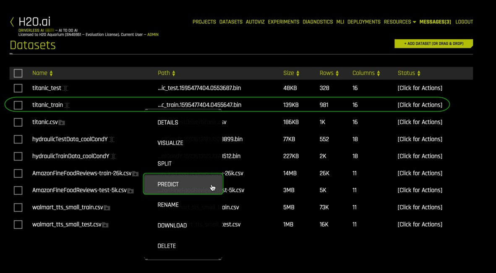
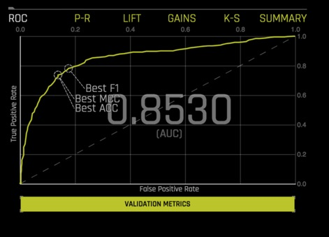
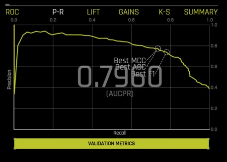
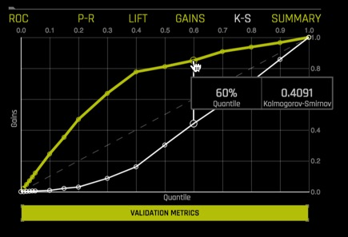
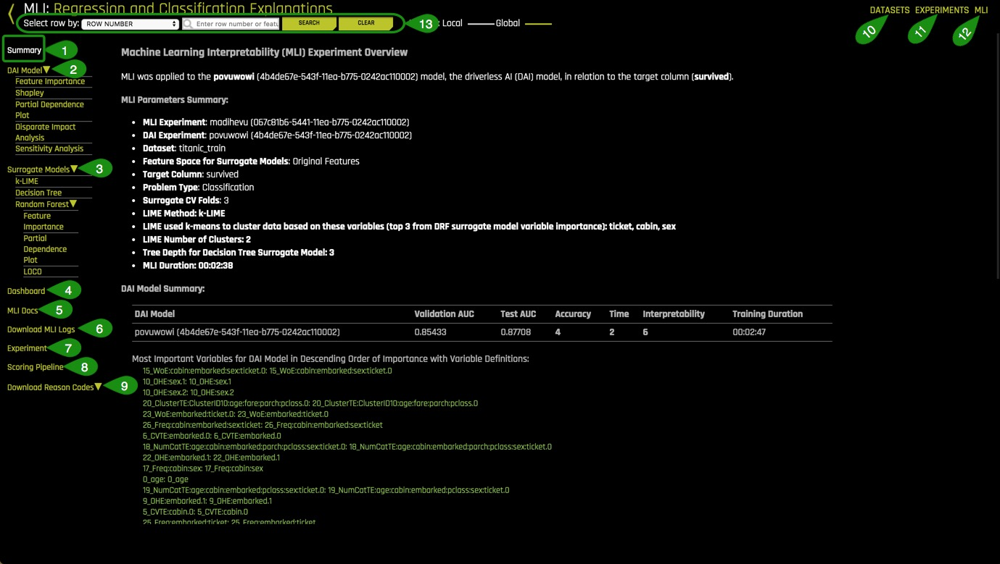
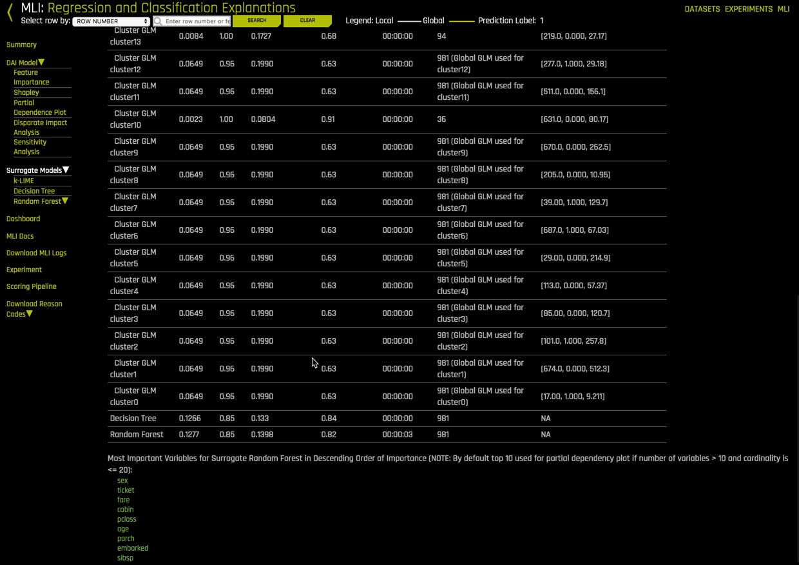
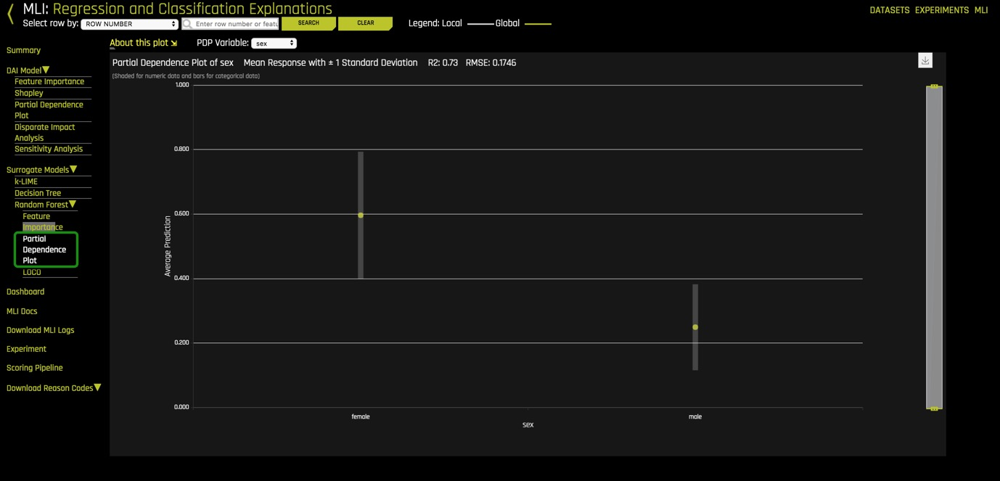
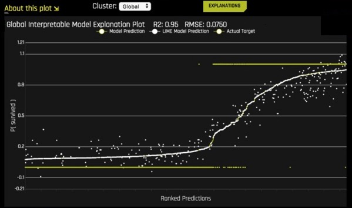
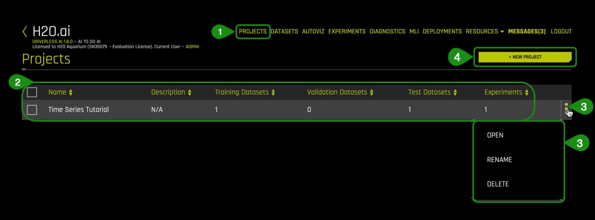

# Introducción automática al aprendizaje automático con Driverless AI

## Contorno

- [Objetivo](#objetivo)
- [Prerrequisitos](#Prerrequisitos)
- [Tarea 1: Tour del Producto](#Tarea-1-Tour-del-Producto)
- [Tarea 2: Conceptos de Machine Learning](#tarea-2-conceptos-de-machine-learning)
- [Tarea 3: Cargar datos](#tarea-3-cargar-datos)
- [Tarea 4: Explora los Detalles de Datos y AutoViz](#tarea-4-explora-los-detalles-de-datos-y-autoviz)
- [Tarea 5: Lanza el Primer Experimento](#tarea-5-lanza-el-primer-experimento)
- [Tarea 6: Explora Feature Engineering](#tarea-6-explora-feature-engineering)
- [Tarea 7: Explora Resultados del Experimento](#tarea-7-explora-resultados-del-experimento)
- [Tarea 8: Informe MLI Para Series no Cronológicas](#tarea-8-informe-mli-para-series-no-cronológicas)
- [Tarea 9: Resumen del Experimento y Autoreport](#tarea-9-resumen-del-experimento-y-autoreport)
- [Próximos Pasos](#proximos-pasos)
- [Apéndice: Proyecto Workspace](#apendice-proyecto-workspace)

## Objetivo

Para este tutorial, vamos a explorar el conjunto de datos sobre el accidente del Titanic desde la perspectiva de una compañía de aseguranza de vidas usando el producto empresarial [H2O.ai's](https://www.h2o.ai/), [Driverless AI](https://www.h2o.ai/products/h2o-driverless-ai/). Vamos a explorar posibles factores de riesgos derivados de este conjunto de datos que la compañía podría haber considerado al momento de vender aseguranza de vida a estos pasajeros. Específicamente, crearemos un modelo de predicción para determinar cuáles factores contribuyeron a la supervivencia de los pasajeros.

En esta descripción general de Driverless AI, aprenderá cómo cargar datos, explorar detalles de datos, generar visualizaciones automáticas, iniciar un experimento, explorar ingeniería de características, ver resultados de experimentos y obtener un recorrido rápido por el informe de Interpretabilidad de aprendizaje automático.

**Nota**: Este tutorial ha sido creado en Aquarium, lo cual es parte de H2O cloud y provee acceso a varias herramientas para talleres, conferencias, y entrenamientos de enseñanza. Los laboratorios en Aquarium tienen conjuntos de datos, experimentos, proyectos, y otros contenidos precargados. Si usted usa su propia versión de Driverless AI, no podrá ver el contenido precargado.

## Prerrequisitos

- Conocimiento básico de Machine Learning y Estadísticas

- **Sesión de Dos Horas de Test Drive**Test Drive es H2O.ai Driverless AI corriendo sobre la nube de AWS (Amazon Web Service Cloud). No es necesario descargar ningún software para utilizar Test Drive. Explora todas las características y beneficios de la plataforma de H2O Automatic Learning.


    - ¿Necesita una **Sesión de Dos Horas de Test Drive?** Siga las instrucciones [en este tutorial](https://training.h2o.ai/products/tutorial-0-getting-started-with-driverless-ai-test-drive) para comenzar su sesión. Después de comenzar la sesión de Driverless AI Test Drive, continue leyendo los requisitos restantes de este tutorial y proceda a comenzar Tarea 1: Tour del Producto

    - ¿Ya tienes una sesión de Test Drive? Continue leyendo los requisitos restantes de este tutorial y proceda a comenzar Tarea 1: Tour del Producto

**Nota:Test Drive de Driverless AI ya tiene la clave de licencia incorporada, así que no necesita solicitar una para usarlo. Cada sesión de Test Drive en Aquarium estará disponible por dos horas. Después que la sesión termine su trabajo no será guardado. Si necesita más tiempo para seguir explorando Driverless AI, puede lanzar una nueva sesión de Test Drive o puede contactar nuestro equipo de ventas por medio de nuestro [formulario de contacto](https://www.h2o.ai/company/contact/).** 


## Tarea 1: Tour del Producto

¡Bienvenido a la página **Datasets** (Conjunto de Datos) de Driverless AI!


La interfaz del usuario (UI) de Driverless AI es muy fácil de navegar. Las siguientes características, al igual que algunos conjuntos de datos se pueden encontrar en la página de **Datasets**. Vamos a explorar estas características al tiempo de lanzar nuestro experimento en los siguientes pasos.

1. **Projects** (Proyectos): El espacio de Projects es para administrar conjuntos de datos y experimentos relacionados a casos de usos particulares.
2. **Datasets** (Conjuntos de datos): Muestra los conjuntos de datos disponibles. Algunas otras opciones incluyen la habilidad de agregar nuevos conjuntos de datos, obtener detalles sobre los datos, visualizar, dividir, predecir, renombrar, descargar, y eliminar.
3. **Autoviz:** Ayuda a visualizar un conjunto de datos con todos los gráficos disponibles.
4. **Experiments** (Experimentos): Muestra todos los experimentos que han sido completados. Los experimentos pueden ser corregidos o borrados.
5. **Diagnostics** (Diagnósticos): Muestra diagnósticos acerca del modelo creado y puede ver los resultados de ese modelo usando diferentes formas de evaluación.
6. **MLI:** Muestra una lista de interpretaciones de los modelos y permite realizar una interpretación de un modelo nuevo.
7. **Deployments** (Implementaciones): Despliega los modos de evaluación de MOJO y Python para hacer pruebas e integrar a tu producto final, también se puede desplegar localmente o en cloud.
8. **Resources** (Recursos): El menú de Recursos permite ver enlaces relacionados con Información del Sistema, Guia de Uso de Driverless AI,y Ayuda. Desde este menú, también se puede descargar Python Client, R Client, MOJO2 Runtime, MOJO2 Py Runtime, y MOJO2 R Runtime.
9. **Messages[]** (Mensajes []): Muestra noticias y próximos eventos de Driverless AI.
10. **Logout H2OAI** (Cerrar sesión H2OAI): Permite salir de la sesión actual de Driverless AI.
11. <: Regresa a la página anterior
12. **H2OAI:** Regresa a las página de Datasets
13. **Driverless AI 1.X.X:** Versión de Driverless AI
14. **Add a Dataset(or Drag and Drop)** (Agregar un conjunto de datos (o arrastrar y soltar)): Carga o añade un nuevo conjunto de datos

### Exploración más Profunda y Recursos

- [Únete a la comunidad H2O.](https://www.h2o.ai/community/home) Haz preguntas, discute posibles usos, da recomendaciones, mantente informado sobre lo más nuevo de H2O.ai, y mucho más.
Aprende más sobre H2O.ai Driverless por medio de nuestra [Documentación de H2O Driverless AI.](http://docs.h2o.ai/driverless-ai/latest-stable/docs/booklets/DriverlessAIBooklet.pdf)
- [Explora la Documentación del Producto de H2O](http://docs.h2o.ai/) 
- [Aprende más sobre H2O Driverless al revisar nuestra lista de preguntas frecuentes](http://docs.h2o.ai/driverless-ai/latest-stable/docs/userguide/faq.html)

## Tarea 2: Conceptos de Machine Learning

### Inteligencia Artificial y Machine Learning (Aprendizaje de Máquina)

Los conceptos que se encuentran en esta sección están destinados a proporcionar una vista general de alto nivel de Machine Learning. Al final de esta sección, podrás encontrar ligas(links) a recursos que ofrecen una explicación más profunda de los conceptos cubiertos aquí.
Machine Learning es un subconjunto de Inteligencia Artificial donde el enfoque está en crear máquinas que puedan simular la inteligencia humana. Una distinción crítica entre Inteligencia Artificial y Machine learning es que los modelos de Aprendizaje de Máquina "aprenden" de los datos a los que los modelos son expuestos. Arthur Samuel, un pionero de Aprendizaje de Máquina en 1959, definió Aprendizaje de Máquina como un "campo de estudio que le da a las computadoras la habilidad de aprender sin ser explícitamente programadas". Un algoritmo de Aprendizaje de Máquina se entrena con un conjunto de datos para hacer predicciones. Estas predicciones son, a veces, utilizadas para optimizar un sistema o asistir a la toma de decisiones.

### Entrenamiento de Machine Learning

Avances en la tecnología han facilitado la recopilación y disponibilidad de los datos. Los tipos de datos disponibles determinarán el tipo de entrenamiento al que el modelo de Machine Learning puede someterse. Hay dos tipos de entrenamiento de Machine Learning, Aprendizaje supervisado y no-supervisado. Aprendizaje supervisado es cuando el conjunto de datos contiene la respuesta que estás tratando de predecir. Para esos casos donde la variable de predicción no está presente, se le llama aprendizaje no-supervisado. Ambos tipos de entrenamiento definen la relación entre variables de entrada y de salida.
En Machine Learning, las variables de entrada son llamadas **características(features)** y las variables de salida **etiquetas(labels).** Las etiquetas, en este caso, son las que intentamos predecir. El objetivo es tomar las entradas/características y usarlas para llegar a predicciones sobre datos nunca antes vistos. En regresión lineal, las características son las variables x, y las etiquetas son las variables y.

Un modelo de Machine Learning define la relación entre características y etiquetas. Cuando los modelos son entrenados, puedes entrenar el modelo alimentándose con ejemplos. Los ejemplos son una instancia particular de datos. Puedes tener dos tipos de ejemplos: etiquetados y no-etiquetados. Los ejemplos etiquetados son aquellos donde se conoce el valor de las variables x, y (características, etiquetas). Los ejemplos no-etiquetados son aquellos donde conocemos el valor de la variable x, pero no sabemos qué valor tiene la variable y(características,?)[1]. Tu conjunto de datos son como un ejemplo; las columnas que se usarán para el entrenamiento son las características; las filas son las instancias de esas características. Las columnas que quieres predecir son las etiquetas.

El aprendizaje supervisado toma los ejemplos etiquetados y permite a un modelo que está siendo entrenado aprender la relación entre características y etiquetas. El modelo entrenado es entonces probado con datos no-etiquetados, y eso permite predecir el valor de y(etiqueta) para los datos no-etiquetados. Probar un modelo entrenado con datos no-etiquetados se le llama entrenamiento no supervisado [1]. Note que H20 Driverless AI crea modelos con ejemplos etiquetados.

### Preparación de datos
Un modelo de Machine Learning es tan bueno como los datos que se usan para entrenarlo. Si usas datos malos para entrenar tu modelo, obtendrás un modelo malo. Dicho esto, antes de cargar un conjunto de datos dentro de la herramienta que te ayudará con la construcción de tu modelo de Machine Learning como Driverless AI, asegúrate de que el conjunto de datos ha sido limpiado y preparado para el entrenamiento. Al proceso de transformación de datos en bruto en otro formato, el cual es más apropiado y valioso para el análisis, se le llama data wrangling o disputa de datos.

La disputa de datos, que puede incluir extracciones, análisis, unión, estandarización, aumento, limpieza, consolidación, filtrado es altamente recomendado terminarlo antes de cargar el conjunto de datos a Driverless AI. La preparación de datos incluye el conjunto de datos en un correcto formato para lo que se intenta hacer. Los duplicados se han eliminado. Los datos perdidos se arreglan o se eliminan, y finalmente, los valores categoriales se han transformado o codificado a un tipo numérico. Finalmente, las transformaciones apropiadas en el conjunto de datos se han realizado, como el escalamiento, la descomposición y agregación, también conocido como ingeniería de características[3]. Herramientas como [Python datatable](https://datatable.readthedocs.io/en/latest/?badge=latest), [Pandas](https://pandas.pydata.org/) y [R](https://www.r-project.org/) son buenas para la disputa de datos.

Driverless AI puede hacer algunas disputas de datos. La disputa de datos se puede hacer a través de una [data recipe](https://www.r-project.org/), de el [JDBC connector](http://docs.h2o.ai/driverless-ai/1-8-lts/docs/userguide/connectors-nd/jdbc.html?highlight=jdbc) o a través de [live code](http://docs.h2o.ai/driverless-ai/1-8-lts/docs/userguide/datasets-describing.html?highlight=live%20code#modify-by-recipe) el cual creará un nuevo conjunto de datos modificando el existente.

### Transformación de datos/Feature Engineering

La transformación de datos o feature engineering (ingeniería de características) es el proceso de crear nuevas características a partir de las existentes. Algunas transformaciones incluyen observar todas las características e identificar cuáles características pueden ser combinadas para hacer nuevas que serán más útiles para el rendimiento del modelo. Para las características categóricas, la recomendación es que las clases que tengan pocas observaciones sean agrupadas para reducir la probabilidad de que el modelo se sobreajuste (overfitting). Adicionalmente, variables ficticias son introducidas a las características categóricas para facilitar el Machine Learning ya que muchos algoritmos no pueden manejar características categóricas directamente. Por último pero no menos importante, eliminar características que no son usadas o son redundantes [4]. Estas son solo algunas sugerencias al acercarse a Feature Engineering. Feature engineering consume mucho tiempo debido a que su naturaleza es repetitiva; también puede ser costoso. El siguiente paso en la creación de un modelo es seleccionar un algoritmo.

### Selección de algoritmo

“Los algoritmos del Aprendizaje de Máquina se describen como el aprendizaje de una función objetivo (f) que asigna mejor las variables de entrada (x) a una variable de salida (y): Y= f(x)”[5]. En aprendizaje supervisado, hay muchos algoritmos que seleccionar para el entrenamiento. El tipo de algoritmo(s) dependerá del tamaño de tu conjunto de datos, la estructura, y el tipo de problema que estás tratando de resolver. A través de prueba y error, se pueden encontrar los mejores algoritmos de rendimiento para tu conjunto de datos. Algunos de estos algoritmos incluyen regresión lineal, clasificación, árboles de regresión, bosques al azar, bayas ingenuas, aumentar, por nombrar algunos[6].

### Modelo de entrenamiento

**Conjunto de datos(datasets)**

Una buena práctica cuando entrenamos un modelo de Machine Learning es dividir tu conjunto de datos en subconjuntos: Conjuntos de entrenamiento, validación, y prueba. Una buena proporción para todo el conjunto de datos es 70-15-15, 70% de todo el conjunto de datos para el entrenamiento, 15% para la validación, y el 15% restante para la prueba. El **conjunto de entrenamiento** son los datos que se usarán para entrenar el modelo, y necesita ser suficientemente grande para obtener resultados. El **conjunto de validación** son los datos que se retuvieron del entrenamiento y se usarán para evaluar y ajustar los hiper parámetros del modelo entrenado y, por lo tanto, ajustar el rendimiento. Finalmente, El **conjunto de prueba** son datos que también se retuvieron y se usarán para confirmar los resultados del modelo final[1].


Otra parte del entrenamiento de modelos es ajustar y ajustar los modelos. Para el ajuste y el ajuste, los hiper parámetros deben ajustarse y la validación cruzada debe llevarse a cabo utilizando solo los datos de entrenamiento. Se deberán probar varios valores de hiper parámetros. "Un hiper parámetro es un parámetro que se establece antes de que comience el proceso de aprendizaje. Estos parámetros son ajustables y pueden afectar directamente qué tan bien entrena un modelo. Un ejemplo de hiper parámetro en el aprendizaje automático es la tasa de aprendizaje" [7]. Con la validación cruzada, se utiliza todo el conjunto de datos, y cada modelo se entrena en un subconjunto diferente de los datos de entrenamiento [8]. Además, se establecerá un bucle de validación cruzada para calcular la puntuación de validación cruzada para cada conjunto de hiper parámetros para cada algoritmo. Basado en la puntuación de validación cruzada y los valores de hiper parámetro, puede seleccionar el modelo (recuerde que "un modelo en ML es la salida de un algoritmo de aprendizaje automático ejecutado en datos. Representa lo que aprendió un algoritmo de aprendizaje automático" [9] ) para cada algoritmo que se haya ajustado con datos de entrenamiento y pruébelo usando su conjunto de prueba.

### ¿Cuáles son los desafíos al desarrollar un modelo de IA?

Uno de los desafíos importantes de cara a desarrollar un solo modelo listo para la producción es que puede llevar semanas o incluso meses construirlo. Desarrollar un modelo implica la Ingeniería de características, construcción del modelo, y la implementación del modelo. Todas las tareas son muy repetitivas, consume tiempo, requiere un conocimiento avanzado de generación de características, algoritmos, parámetros, y la implementación del modelo. Finalmente, necesita haber un profundo conocimiento y confianza en cómo el modelo se generó para explicar y justificar cómo el modelo tomó sus decisiones.

### ¿Qué es el Machine Learning automatizado (Aprendizaje de Máquina Automatizado), y por qué es tan importante?

AutoML o Aprendizaje de Máquina Automatizado es el proceso de automatización para la selección de algoritmos, generación de características, ajuste de hiperparametros, modelado iterativo, y la evaluación del modelo. Herramientas de AutoML como son H2O Driverless AI hace más fácil entrenar y evaluar los modelos de Machine Learning. La automatización de las tareas repetitivas del desarrollo de Machine Learning permite a las personas en la industria enfocarse en los datos y los problemas de negocios que están tratando resolver.

### Referencias Electrónicas

[1] [Google’s Machine Learning Crash Course](https://developers.google.com/machine-learning/crash-course/training-and-test-sets/splitting-data)

[2] [About Train, Validation and Test Sets in Machine Learning](https://towardsdatascience.com/train-validation-and-test-sets-72cb40cba9e7)

[3] [Data Science Primer - Data Cleaning](https://elitedatascience.com/data-cleaning)

[4] [Feature Engineering](https://elitedatascience.com/feature-engineering)

[5] [Towards Data Science- Supervised vs Unsupervised Learning](https://towardsdatascience.com/supervised-vs-unsupervised-learning-14f68e32ea8d)

[6] [Selecting the best Machine Learning Algorithm for your regression problem](https://towardsdatascience.com/selecting-the-best-machine-learning-algorithm-for-your-regression-problem-20c330bad4ef)

[7] [Deep AI - What is a hyperparameter?](https://deepai.org/machine-learning-glossary-and-terms/hyperparameter)

[8] [H2O.ai's Driverless AI - Internal Validation Technique](http://docs.h2o.ai/driverless-ai/1-8-lts/docs/userguide/internal-validation.html?highlight=cross%20validation)

[9] [Difference between Algorithm and Model in Machine Learning](https://machinelearningmastery.com/difference-between-algorithm-and-model-in-machine-learning/)

### Exploración más Profunda y Recursos

- [Explore las repeticiones de H2O World en todo el mundo](https://www.h2o.ai/h2oworldnewyork/)

- [Explore las repeticiones del seminario web](https://www.brighttalk.com/search/?q=driverless+ai)

- [Explore las diversas listas de reproducción de IA sin controlador H2O en YouTube](https://www.youtube.com/user/0xdata/playlists)

## Tarea 3: Cargar Datos

### ¿Cuál es el flujo de trabajo de Driverless AI?

El flujo de trabajo típico de Driverless AI es:

1. Cargar datos
2. Visualizar datos
3. Ejecute un experimento
4. Interpreta el modelo
5. Despliegue la tubería de puntuación

Además, puede diagnosticar un modelo, transformar otro conjunto de datos, calificar el modelo con respecto a otro conjunto de datos y administrar sus datos en Proyectos. El enfoque de este tutorial estará en los pasos 1 a 4. Los otros aspectos de Driverless AI se cubrirán en otros tutoriales que se encuentran en la ruta de aprendizaje de Driverless AI. Comenzaremos cargando los datos.


1\. Regresa a la página H2O Driverless AI **Datasets.**

### Información del conjunto de datos

El conjunto de datos usados en este experimento es una versión del conjunto del Titanic elaborado por Kaggle. Este conjunto de datos contiene una lista de los pasajeros a bordo del RMS Titanic.
El RMS Titanic fue un transatlántico britanico que se hundió tras colisionar con un iceberg al norte del océano Atlántico el 15 de Abril de 1912. De 2,224 pasajeros y miembros de la tripulación, perdieron la vida más de 1,500 personas en la ruta marítima de la Ciudad de Nueva York a Southampton.
Esta tragedia impactó a la comunidad internacional, lo que impulsó mejores medidas de seguridad para barcos. La falta de botes salvavidas entre otras cosas, fue uno de los factores determinantes en la pérdida de vidas. Sin embargo, hubo algunos elementos que influyeron para que hubiera sobrevivientes.


[RMS Titanic-Wikipedia](https://en.wikipedia.org/wiki/RMS_Titanic#/media/File:RMS_Titanic_3.jpg)

**Titanic dataset:**

Conjunto de datos del Titanic:
En el conjunto de datos encontrarás 1,309 filas, una fila por cada pasajero, y 16 columnas que representan los atributos de cada pasajero.
|Atributos |Definición | Código |
|---|---|---|
|passenger Id|Identificador generado aleatoriamente| - |
|pclass|Clase del pasajero| 1= Primera, 2 = Segunda, 3= Tercera|
|survived|Sobrevivió| 0=No, 1=Si|
|name_with_salutations|Nombre del pasajero| - |
|name_without_salutations|Nombre del pasajero sin título personal| - |
|sex|Sexo|Female=Mujer, Male=Hombre|
|age|Edad en años| - |
|sibsp|Number of siblings= Numero de parentesco/Spouse aboard| - |
|parch|Number of Parents/Children aboard=Número de padres/hijos abordo| - |
|ticket|Número de boleto| - |
|fare|Tarifa de pasajero| - |
|cabin|Número de cabina| - |
|embarked|Puerto de embarque|C = Cherbourg, Q = Queenstown, S = Southampton|
|boat|Número de bote| - |
|body|Numero de cuerpo| - |
|home.des|Destino| - |

### Agregar los datos

1\. Presiona en **Add a Dataset(or Drag and Drop) (Agregar un conjunto de datos (o arrastrar y soltar))**

2\. Selecciona **FILE SYSTEM (SISTEMA DE ARCHIVO)**


3\. Ingresa los siguiente 
1. /data/TestDrive/titanic.csv en la barra de búsqueda.
2. Selecciona titanic.csv y después titanic.csv 
3. Luego haga clic aquí: **Click to Import Selection.**


4\. Si el archivo se carga con éxito deberás ver lo siguiente:


**Notas**

1. Podrás ver en cada columna:

    - **File name:** Nombre del archivo del conjunto de datos 
    - **File Path:** Ruta del archivo 
    - **File Size:** Tamaño del archivo 
    - **Rows:** Número de filas Rows
    - **Columns:** Número de columnas 
    - **Status:** Estado del archivo Status

2. Opción para regresar a la página anterior

### Más información y recursos

[Aprende más sobre los tipo de formatos para archivos de conjunto de datos que se pueden cargar](http://docs.h2o.ai/driverless-ai/latest-stable/docs/userguide/datasets.html#adding-datasets)

Para descubrir más conjunto de datos, revisa [Conjunto de datos Kaggle](https://www.kaggle.com/datasets)

## Tarea 4: Explora los Detalles de Datos y AutoViz

### Detalles

Ahora vamos a explorar el conjunto de datos Titanic que acabamos de cargar.

1\. Continuando en la **Dataset Overview page** (página de descripción general del conjunto de datos), haga clic en el conjunto de datos titanic.csv. Aparecerán las siguientes opciones:


- Details (Detalles) - Vea un resumen del conjunto de datos o obtenga una vista previa del conjunto de datos
- Visualize (Visualizar) - Visualice el conjunto de datos con gráficos disponibles
- Split (Dividir) - Dividir el conjunto de datos
- Predict (Predecir) - Ejecuta un experimento usando Driverless AI (IA sin conductor)
- Rename (Cambiar Nombre) - Cambiar el nombre del conjunto de datos
- Download (Descargar) - Descargar el conjunto de datos
- Delete (Eliminar) - Eliminar el conjunto de datos

**Nota**: Un conjunto de datos solo se puede eliminar si no se está utilizando en un experimento. De lo contrario, primero debe eliminar el experimento y luego se puede eliminar el conjunto de datos.

2\. A continuación, confirmaremos que el conjunto de datos se cargó correctamente y que tiene el número correcto de filas y columnas haciendo clic en Details (detalles).

3\. Haga clic en **Details. Details** lo llevará a **Dataset Details Page** (Página de detalles del conjunto de datos)

 

*Cosas a tener en cuenta:*

**Dataset Details Page** proporciona un resumen del conjunto de datos. Este resumen enumera cada columna que se incluye en el conjunto de datos junto con:

**Logical type (can be changed)** (Tipo lógico (se puede cambiar))

  

**Formato para columnas de Date (Fecha) y Datetime (Fecha y Hora) (se puede cambiar)**

 

- Storage type (Tipo de almacenamiento)
- Count (Contar)
- Number of missing values: Missing (Número de valores faltantes: Desaparecido)
- Mean (Medio)
- Minimum (Mínimo)
- Maximum (Máximo)
- Standard deviation: stdev (Desviación estándar: stdev)
- Frequency: Freq (Frecuencia: Freq)
- Number of unique values: Unique (Número de valores únicos: Único)
- Ver las primeras 20 filas de una columna colocando el cursor sobre el nombre de la columna (ver imagen a continuación)

 

**Nota:** Driverless AI reconoce los siguientes tipos de columna: integer (entero), string (cuerda), real (real), boolean (booleano) y time (tiempo). Las columnas de Date (fecha) reciben un tipo de cuerda "str".

2. Puede ver la información de una columna específica ingresando el nombre de la columna en el campo sobre el gráfico.

3. **Modify by Recipe** (Modificar por receta) le permite crear un nuevo conjunto de datos modificando un conjunto de datos existente con recetas personalizadas.
4. **Dataset Rows** (Filas de conjunto de datos) le permite obtener una vista previa del conjunto de datos
5. Opción para salir y volver a la página “H2O **Datasets** (Conjuntos de datos)

4\. Seleccione **Dataset Rows** (Filas de conjunto de datos)


*Cosas a tener en cuenta:*

1. Vista previa del conjunto de datos
2. Ver las filas restantes
3. **Modify by Recipe** - Modificar el conjunto de datos a través de una receta personalizada
4. Regrese a **Dataset Overview** (Descripción general del conjunto de datos)
5. Opción para salir y volver a la página H2O **Datasets**

5\. Salga y regrese a la página **Datasets Overview.**

### Dividir el conjunto de datos

Al partir el conjunto de datos Titanic.csv, vamos a crear dos conjuntos de datos, uno de entrenamiento y uno de prueba. El 75% de los datos se utilizarán para entrenar el modelo y el 25% para probar el modelo entrenado.

1\. Haga clic en el archivo titanic.csv y seleccione **Split**


2\. Divida los datos en dos conjuntos: titanic_train (titanic_entrenamiento) y titanic_test (titanic_prueba), luego guarde los cambios. Use la imagen a continuación como guía:


*Cosas a tener en cuenta:*

1. Para OUTPUT NAME 1: ingrese ```titanic_train``` (esto servirá como conjunto de entrenamiento)
2. Para OUTPUT NAME 2: ingrese ```titanic_test``` (esto servirá como el conjunto de prueba)
3. Puede cambiar Random Seed (semilla aleatoria); esto generará la misma división cada vez
4. Cambie el valor de división a .75 ajustando el control deslizante a 75% o ingresando .75 en la sección que dice *Train/Valid Split Ratio*(Entrenamiento / Relación de división válida)
5. Guarde los cambios que hizo

Se seleccionó la proporción de .75 para este conjunto de datos en particular para no generalizar el modelo dado el tamaño total del conjunto.

**The training set** (El conjunto de entrenamiento) contiene 981 filas, cada fila representa un pasajero y las 16 columnas de atributos representan los atributos de cada pasajero.

**The Test set** (El conjunto de prueba) contiene 328 filas, cada fila representa un pasajero y las 16 columnas de atributos representan los atributos de cada pasajero.
Verifique que los tres conjuntos de datos Titanic, titanic_test, titanic_train y titanic.csv estén allí:


### Autoviz

Ahora que el conjunto de datos titanic.csv se ha dividido, utilizaremos el conjunto **titanic_train** para el resto del tutorial.

Hay dos formas de visualizar el conjunto de entrenamiento:


**Método 1:** haciendo clic en el archivo 
**titanic_train**, seleccione **Visualize**, luego haga clic en el archivo de visualización generado.

**Método 2:** haciendo clic en **Autoviz** ubicado en la parte superior de la página de la interfaz de usuario, donde se le pedirá el conjunto de datos que desea visualizar.

1\. Elija un método para visualizar el conjunto de datos **titanic_train.** Debería aparecer una imagen similar:


Haga clic en la visualización **titanic_train** y aparecerá la siguiente pantalla.


¿Es posible visualizar cómo se correlacionan las variables en el conjunto de entrenamiento? ¿Podemos determinar qué otras variables están fuertemente correlacionadas con la supervivencia de un pasajero? ¡La respuesta a esas preguntas es sí! Uno de los gráficos que nos permite visualizar las correlaciones entre variables es el **Correlation Graph** (Gráfico de correlación).

Exploremos la correlación entre la variable 'survived' (sobrevivido) y otras variables en el conjunto de datos.

2\. Seleccione **Correlation Graph** y luego haga clic en **Help** (ayuda) ubicado en la esquina inferior izquierda del gráfico.

3\. Tómese un minuto para leer acerca de cómo se construyó el gráfico de correlación. Obtenga más información sobre cómo las variables están codificadas por colores para mostrar sus correlaciones.

4\. Tome la variable 'survived' y arrastrela un poco para ver mejor las otras variables con las que Driverless AI descubrió que está correlacionada.

¿Qué variables están fuertemente correlacionadas con la variable 'survived'?


*Cosas a tener en cuenta:*

- El botón **Help** explica el **Correlation Graph**. Esta característica está disponible para todos los gráficos.

- **Download** (Descargar) permite descargar una imagen a escala completa del gráfico.

5\. Salga de la vista  **Correlation Graph** haciendo clic en X en la esquina superior derecha del gráfico.

6\. Una vez que haya terminado de explorar los otros gráficos, regrese a la **datasets page** (página de conjuntos de datos).

Driverless AI muestra los gráficos que son aspectos relevantes a los datos. Los siguientes son los tipos de gráficos disponibles:

- Correlated Scatterplots (Diagramas de dispersión correlacionados)
- Spikey Histograms (Histogramas puntiagudos)
- Skewed Histograms (Histogramas sesgados)
- Varying Boxplots (Varias parcelas)
- Heteroscedastic Boxplots (Diagramas de caja heterocedásticos)
- Biplots (Biplots)
- Outliers (Valores atípicos)
- Correlation Graph (Gráfico de correlación)
- Parallel Coordinates Plot (Parcela de coordenadas paralelas)
- Radar Plot (Parcela de radar)
- Data Heat Map (Mapa de calor de datos)
- Missing Values Heatmap (Mapa de calor de valores perdidos)
- Gaps Histogram (Brechas Histograma)

### Inmersión más Profunda y Recursos

[Obtenga más información sobre la visualización automática de los documentos sin controlador](http://docs.h2o.ai/driverless-ai/latest-stable/docs/userguide/datasets.html#visualizing-datasets)

[Obtenga más información sobre la visualización automática del arquitecto Leland Wilkinson, científico jefe de H2O.ai de la sesión en el video de YouTube de H2O World 2017](https://www.youtube.com/watch?v=bas3-Ue2qxc)

[Visualización automática SlideShare](https://www.slideshare.net/0xdata/automatic-visualization)

## Tarea 5: Lanza el Primer Experimento

Vamos a lanzar nuestro primer experimento. Lanzar un experimento significa que vamos a generar una predicción utilizando un conjunto de datos de nuestra elección.

1\. Regrese a la página **Dataset Overview page**

2\. Haga clic en el conjunto de datos **titanic_train** y luego seleccione **Predict**



Si es la primera vez que inicia un experimento, aparecerá el siguiente mensaje que le preguntará si desea realizar un recorrido.


Si desea realizar un recorrido rápido por la página **Experiments** (Experimentos), seleccione **YES** (Si). El recorrido rápido cubrirá los siguientes elementos:

- Seleccione el conjunto de datos de entrenamiento
- Seleccione la columna que desee que Driverless AI prediga entre todas las columnas
- Seleccione si es un problema de serie temporal o no [Time Series ON or OFF] ([Serie temporal activada o desactivada])

3\. Seleccione **Not Now** (ahora no) para regresar y hacer el recorrido en otro momento.

4\. Aparecerá la siguiente página **Experiment** (Experimento):


*Cosas a tener en cuenta:*

1. Assistant (Asistente): recorrido interactivo para usuarios nuevos. Haga clic en **assistant** (asistente) para habilitarlo. Apareceran círculos amarillos alrededor de las secciones seleccionadas de la página de configuración del experimento. Puede seleccionar cualquiera de ellos para obtener más información sobre cada sección.

*Nota:* Para inhabilitar **assistant**, haga clic en asistente nuevamente.


1. **Display Name** (Nombre para mostrar) - De un nombre a su experimento `Titanic Classification Tutorial`.
2. **Dataset** (Conjunto de datos) - El nombre del conjunto de datos que se utilizara para crear un experimento
3. **Rows** (Filas) - Número total de filas
4. **Columns** (Columnas) - Número total de columnas
5. [Dropped Columns](http://docs.h2o.ai/driverless-ai/1-8-lts/docs/userguide/experiment-settings.html?highlight=accuracy#dropped-columns) (Columnas eliminadas) - Elimine las columnas de su conjunto de datos que no desea usar en el experimento
6. [Validation Dataset](http://docs.h2o.ai/driverless-ai/1-8-lts/docs/userguide/experiment-settings.html?highlight=accuracy#validation-dataset) (Conjunto de datos de validación) - Seleccione el conjunto de datos que desea usar para validar. Este conjunto se usará para validar parámetros como modelos, características, etc.
7. [Test Dataset](http://docs.h2o.ai/driverless-ai/1-8-lts/docs/userguide/experiment-settings.html?highlight=accuracy#test-dataset) (Conjunto de datos de prueba) - El conjunto de datos que se utilizará para probar el modelo generado usando el conjunto de datos de entrenamiento. No se usa durante el entrenamiento del modelo, y los resultados están disponibles al final del experimento.
8. **Target Column** (Columna objetivo) - ¿Qué quieres predecir?
9. [Fold column](http://docs.h2o.ai/driverless-ai/1-8-lts/docs/userguide/experiment-settings.html?highlight=accuracy#fold-column)(Columna de plegado) - La columna de plegado se utiliza para crear los conjuntos de datos de capacitación y validación para que todas las filas con el mismo valor de plegado estén en el mismo conjunto de datos
10. [Weight column](http://docs.h2o.ai/driverless-ai/1-8-lts/docs/userguide/experiment-settings.html?highlight=accuracy#weight-column) (Columna de peso) - Columna que indica el peso de observación (también conocido como peso de muestra o fila), si corresponde.
11. [Time Column](http://docs.h2o.ai/driverless-ai/1-8-lts/docs/userguide/experiment-settings.html?highlight=accuracy#time-column) (Columna de tiempo) (DESACTIVADO de forma predeterminada): proporciona un orden de tiempo (marcas de tiempo para las observaciones). Se usa cuando los datos tienen una alta dependencia del tiempo (como la estacionalidad o tendencia), y desea tratar este problema como un problema de serie temporal.

Continuando con nuestro experimento:

Nombre su experimento de la siguiente manera: Tutorial de Clasificación Titanic

5\. Haga clic en **Dropped Columns**, retire las siguientes columnas: Passenger_Id (Id. De pasajero), name_with_salutations (nombre_con_saludos), name_without_salutations (nombre_sin_saludos), boat (bote), body (cuerpo) y home.dest (destino de origen). Luego seleccione **Done** (Listo).


Estos atributos (columnas) se eliminaron para crear un conjunto de datos más limpio. Los atributos como el bote y el cuerpo están excluidos porque son indicadores claros de que un pasajero sobrevivió y pueden conducir a la fuga de datos. Para nuestro experimento, la columna de sobrevivencia será suficiente para crear un modelo.

Un conjunto de datos limpios es esencial para la creación de un buen modelo de predicción. El proceso de limpieza de datos debe hacerse con todos los conjuntos de datos para eliminar cualquier conjunto de observaciones no deseadas, errores estructurales, valores atípicos no deseados o datos faltantes.

6\. Seleccione **Test Dataset** y luego haga clic en **titanic_test**


7\. Ahora seleccione la **Target Column**. En nuestro caso, la columna será 'survived' (sobrevivió).


El atributo "sobrevivió" fue seleccionado porque, como compañía de seguros, queremos saber qué otros atributos pueden contribuir a la supervivencia de los pasajeros a bordo de un barco e incorporarlo a nuestras tarifas de seguro.

8\. Su página de experimento debería ser similar a la siguiente; Estas son las sugerencias del sistema:


*Cosas a tener en cuenta:*

1. **Training Settings** (Configuración de entrenamiento) - Describe la precisión, el tiempo y la interpretabilidad de su experimento específico. Las perillas en la configuración del experimento son ajustables a medida que los valores cambian el significado de la configuración en el cambio de página inferior izquierdo.

    - [Accuracy](http://docs.h2o.ai/driverless-ai/latest-stable/docs/userguide/experiment-settings.html?highlight=accuracy%20setting#accuracy) (Precisión) - A medida que aumenta la precisión, la IA sin conductor ajusta gradualmente el método para realizar la evolución y el conjunto. Con baja precisión, la IA sin conductor varía características y modelos, pero todos compiten de manera uniforme entre sí. Con mayor precisión, cada modelo principal independiente evolucionará de forma independiente y será parte del conjunto final como un conjunto sobre diferentes modelos principales. Con precisiones más altas, la IA sin conductor evolucionará + tipos de funciones de conjunto, como la codificación de destino, dentro y fuera, que evolucionan independientemente. Finalmente, con las precisiones más altas, la IA sin conductor realiza el seguimiento de modelos y características y combina todas esas variaciones. Cambiar este valor afecta la evolución de la característica y la canalización final.
    - [Time](http://docs.h2o.ai/driverless-ai/1-8-lts/docs/userguide/experiment-settings.html?highlight=accuracy#time) (Tiempo) - Esto especifica el tiempo relativo para completar el experimento (es decir, las configuraciones más altas tardan más). La detección temprana tendrá lugar si el experimento no mejora la puntuación para la cantidad especificada de iteraciones.
    - [Interpretability](http://docs.h2o.ai/driverless-ai/1-8-lts/docs/userguide/experiment-settings.html?highlight=accuracy#time) (Interpretabilidad) - Especifique la interpretabilidad relativa de este experimento. Los valores más altos favorecen modelos más interpretables. Cambiar el nivel de interpretabilidad afecta la estrategia de poda previa de la función, las restricciones de monotonicidad y el espacio de búsqueda de ingeniería de características.
2. [Expert Settings](http://docs.h2o.ai/driverless-ai/1-8-lts/docs/userguide/expert-settings.html#expert-settings) (Configuración experta)- Configuración experta disponible para personalizar su experimento.
3. [Scorer](http://docs.h2o.ai/driverless-ai/1-8-lts/docs/userguide/scorers.html) (Anotador) - La IA sin conductor selecciona al mejor anotador en función de su conjunto de datos. Se pueden seleccionar otros anotadores manualmente. (Explore más sobre los puntajes en el próximo tutorial [Tutorial de puntaje y análisis de experimentos de aprendizaje automático - Enfoque financiero)](https://training.h2o.ai/products/tutorial-1b-machine-learning-experiment-scoring-and-analysis-tutorial-financial-focus)
4. [Clasificación / Regresión](http://docs.h2o.ai/driverless-ai/1-8-lts/docs/userguide/experiment-settings.html?highlight=accuracy#classification-regression-button) - Botón de clasificación o regresión. La IA sin conductor determina automáticamente el tipo de problema en función de la columna de destino. Aunque no se recomienda, puede anular esta configuración haciendo clic en este botón.
5. [Reproducible:](http://docs.h2o.ai/driverless-ai/1-8-lts/docs/userguide/experiment-settings.html?highlight=accuracy#reproducible) este botón le permite construir un experimento con una semilla aleatoria y obtener resultados reproducibles. Si esto está deshabilitado (predeterminado), los resultados variarán entre ejecuciones.
6. [GPU habilitadas:](http://docs.h2o.ai/driverless-ai/1-8-lts/docs/userguide/experiment-settings.html?highlight=accuracy#enable-gpus) especifique si desea habilitar las GPU. (Tenga en cuenta que esta opción se ignora en los sistemas solo con CPU)
7. **Launch Experiment** (Lanzar experimento) - Inicia el experimento

9\. Actualice la siguiente configuración del experimento para que coincida con la imagen a continuación, luego seleccione **Launch Experiment.**

- Accuracy (Precisión): 4
- Time (Tiempo): 2
- Interpretability (Interpretability): 6
- Scorer (Anotador): AUC


**Nota:** Para iniciar un experimento: el conjunto de datos y la columna de destino son los elementos mínimos necesarios para iniciar un experimento.

10\. La página **Experiment** (Experimento) se verá similar a la siguiente después de completar el 46%:


*Cosas a tener en cuenta:*

1. **Experiment Name** (Nombre del experimento) - Nombre de tu experimento. Si no le asigna un nombre, se generará un nombre aleatorio. El nombre se puede cambiar en cualquier momento.
2. **Experiment Setup** (Configuración del experimento) - Resumen de la configuración del experimento y detalles del conjunto de datos.
3. **Running Status Display** (Visualización del estado de ejecución) - Estado de ajuste de parámetros seguido de ingeniería de características y canalización de puntuación. Los experimentos se pueden detener haciendo clic en el botón ```Finish``` (Finalizar).
4. Descripción general de la configuración del entrenamiento (no se puede ajustar mientras el experimento se está ejecutando): **Training Settings, Experiment Settings, Scorer, Classification, Reproducible y GPU Enabled.**
5. **CPU/Memory** (Información de CPU / Memoria) incluye **Notifications** (Notificaciones), **Logs** (Registros), **Trace** (Información de seguimiento),  y **Scorer (puntuaciones)**. (Tenga en cuenta que Trace se usa para el desarrollo / depuración y para mostrar lo que el sistema está haciendo en ese momento). **Scorers**, o los calificadores del modelo, le permiten ver la información detallada sobre los puntajes del modelo después de completar un experimento. **Scorers** incluyen la tabla de clasificación de ajuste de modelo y características, las puntuaciones del pliegue de validación cruzada del modelo final único y las puntuaciones finales del conjunto.
6. **Iteration Data** (Datos de iteración) y **Variable Importance** (Importancia variable) - Los Datos de iteración son la validación interna para cada pliegue de validación cruzada con el valor de puntaje deseado. Puede pasar el mouse sobre cualquiera de los puntos de iteración en el gráfico de Datos de iteración y ver la importancia de la variable actualizada para esa iteración en Variable Importance(Importancia de la variable)
7. **Classification Problem Graphs** (Gráficos de problemas de clasificación): Alterna entre una curva ROC, un gráfico de recuperación de precisión, un gráfico de elevación, un gráfico de ganancias y la información de uso de GPU (si hay GPU disponibles). Para los problemas de regresión, la sección inferior derecha incluye una alternancia entre un gráfico de Residuos, un gráfico Real frente a un Gráfico predicho e información de uso de GPU (si las GPU están disponibles).

Una vez que se complete el experimento, aparecerá un **Experiment Summary** (Resumen del experimento):


*Cosas a tener en cuenta:*

1. Opciones de estado completo

    - Deploy (Local and Cloud) (Implementación (local y en la nube))
Interpret This Model (Interpreta este modelo)
    - Diagnose Model On New Dataset (Diagnosticar modelo en un nuevo conjunto de datos)
    - Score on Another Dataset (Puntuación en otro conjunto de datos)
    - Transform Another Dataset (Transformar otro conjunto de datos)
    - Download Predictions (Descargar predicciones)
        - Training Predictions (Predicciones de entrenamiento)
        - Validation Set Predictions(available if a validation set was provided) (Predicciones del conjunto de validación (disponible si se proporcionó un conjunto de validación))
        - Test Set Predictions (Predicciones de conjuntos de pruebas)
    - Descargar Python Scoring Pipeline: una tubería de puntuación de Python independiente que descarga un paquete que contiene un modelo exportado y ejemplos de código fuente de Python 3.6 para la producción de modelos creados con Driverless AI H2O.
    - Descargar MOJO Scoring Pipeline: un canal de puntuación independiente que convierte los experimentos en MOJO, que se pueden puntuar en tiempo real. Está disponible como tiempo de ejecución Java o tiempo de ejecución C ++ (con envoltorios Python y R).
    - Visualize Scoring Pipeline (Visualizar la tubería de puntuación) (experimental): hay disponible una visualización de la tubería de puntuación para cada experimento completado.

 

- Descargar resumen del experimento - Un archivo zip que proporciona explicaciones textuales de las representaciones gráficas que se muestran en la interfaz de usuario de Driverless AI UI.
    - Registros experimentales (regulares y anonimizados)
    - Un resumen del experimento
    - Las características del experimento junto con su importancia relativa
    - Información del conjunto
    - Una vista previa del experimento
    - Versión de Word de un informe generado automáticamente para el experimento
    - Tabla de clasificación de ajuste de transformaciones de destino
    - Una tabla de clasificación de ajuste

- Descargar Autoreport - Este informe proporciona información sobre los datos de entrenamiento y los cambios detectados en la distribución, el esquema de validación seleccionado, el ajuste de parámetros del modelo, la evolución de las características y el conjunto final de características elegidas durante el experimento.

2. Iteration Data (Datos de iteración) - Validación / Importancia de variables - Resumen de las 20 principales - Variables de ingeniería de características
3. Experiment Graphs and Summary (Gráficos y resumen de experimentos): esta sección describe los gráficos del tablero que se muestran para ejecutar y completar experimentos. Estos gráficos son interactivos. Desplácese sobre un punto en el gráfico para obtener más detalles sobre el punto.

### Inmersión más Profunda y Recursos

- [Obtenga más información sobre la ejecución de experimentos de Driverless AI documentos](http://docs.h2o.ai/driverless-ai/latest-stable/docs/userguide/running-experiment.html#)

- [Explore la documentación de los experimentos completados](http://docs.h2o.ai/driverless-ai/latest-stable/docs/userguide/experiment-completed.html)

- [Explore la documentación sobre la visualización de la tubería de puntuación](http://docs.h2o.ai/driverless-ai/1-8-lts/docs/userguide/scoring_pipeline_visualize.html?highlight=visualize%20scoring%20pipeline)

- [Explore la documentación en el resumen del experimento](http://docs.h2o.ai/driverless-ai/latest-stable/docs/userguide/experiment-summary.html)

- [Revise el folleto Driverless AI para obtener más información sobre cómo ejecutar experimentos](http://docs.h2o.ai/driverless-ai/latest-stable/docs/userguide/experiment-summary.html)

## Tarea 6: Explora Feature Engineering

Driverless AI realiza Ingeniería de características en el dataset(conjunto de datos) para determinar la representación óptima de los datos. Varias etapas de las características aparecen a lo largo de la iteración de los datos. Estas se pueden observar al pasar el cursor sobre los puntos de la Gráfica de validación de los datos de iteración y viendo las actualizaciones en la sección de la **Variable Importance** (importancia de variable).


Transformaciones en Driverless AI son aplicadas a las columnas de los datos. Los transformadores crean las características de ingeniería en los experimentos. Hay muchos tipos de transformadores, debajo están solo algunos de los transformadores que se encuentran en nuestro conjunto de datos (Dataset).

1\. Observa algunas de las variables en **Variable de importancia**. Nota que algunas de las variables empiezan con ```CVTE``` seguidas por una columna del conjunto de datos(dataset). Algunas variables también podrían empezar con ```_NumToCatTE, Freq``` o ```_WoE``` dependiendo del experimento que ejecutes. Estas son las nuevas, características de alto valor para nuestro conjunto de datos(dataset) de entrenamiento.

Estas transformaciones son creadas con los siguientes transformadores:

- Cross Validation Target Encoding Transformer(Transformador de codificación de objetivo de validación cruzada) : ```_CVTargetEncode```
- Weight of Evidence(Peso de la evidencia) : ```WoE```
- Frequent Transformer(Transformador frecuente): ```Freq```
- Numeric to Categorical Target Encoding Transformer(Transformador de codificación de objetivo numérico a categórico) : ```_NumToCatTE```

También puedes pasar el cursor en cualquiera de las variables bajo Variable Importance(Importancia de variables) para obtener una explicación simple del transformador usado como se ve en la imagen de abajo:


La lista completa de características usadas en el modelo final está disponible en los Experiment Summary Artifacts(Artefactos de resumen del experimento). El resumen del experimento también proporciona una lista de las característica originales y su característica de importancia estimada (Estimated Feature Importance”).

### Exploración más profunda y recursos

- [Obtenga más información sobre las transformaciones de IA sin controlador](http://docs.h2o.ai/driverless-ai/latest-stable/docs/userguide/transformations.html)

- [Ingeniería de características para el aprendizaje automático de Dmitry Larko](https://www.youtube.com/playlist?list=PLrsf4weWJKynQBvh0i-YxDDVqCcIrF28o)

- [Reproducción de la sesión de H2O World London 2018 Feature Engineering](https://www.youtube.com/watch?v=d6UMEmeXB6o) and [presentación por Dmitry](https://www.slideshare.net/0xdata/feature-engineering-in-h2o-driverless-ai-dmitry-larko-h2o-ai-world-london-2018)

## Tarea 7: Explora Resultados del Experimento

Vamos a explorar los resultados de este experimento de clasificación. Se pueden encontrar los resultados en la página **Experiment Summary** (Resumen del experimento) al final de la página de **Experiment** (Experimentar) de lado izquierdo. Los gráficos de los resultados nos dan más información sobre los datos de entrenamiento y validación que resultan del problema de clasificación. Para cada gráfico, daremos una breve explicación.

Si está interesado/a en aprender más sobre cada gráfico y las métricas derivadas en esta sección, haga favor de leer nuestro próximo tutorial [Machine Learning Experiment Scoring and Analysis Tutorial - Financial Focus.](https://training.h2o.ai/products/tutorial-1b-machine-learning-experiment-scoring-and-analysis-tutorial-financial-focus)


1\. Resumen

En cuanto termine el experimento, un resumen es generado en la parte baja en la esquina derecha de la página de **Experiment** (Experimentar).

El resumen incluye:

- **Experiment:** nombre del experimento,
    - Versión (Versión): la versión de Driverless AI y la fecha en que fue lanzada
    - Settings (Configuraciones): preferencias del experimento seleccionado, semilla, y la cantidad de unidades de procesamiento gráfico (GPU) utilizados
    - Train data (Datos del tren): el nombre del set de datos de entrenamiento, con número de hileras y columnas
    - Validation data (Datos de validación): el nombre del set de datos de validación, con número de hileras y columnas
    - Test data (Datos de prueba): el nombre del set de datos de examinación, con número de hileras y columnas
    - Target column (Columna de destino): el nombre de la columna usada como el objetivo del experimento (incluye el tipo de data y el % de cada clase)
- **System Specs** (Especificaciones del sistema): detalles de la sistema como memoria de acceso aleatorio (RAM), número de núcleos de CPU (Núcleos de Procesador) y GPU (unidad de procesamiento gráfico)
    - Uso máximo de memoria
- **Recipe** (Receta):
    - Validation scheme: esquema de validación que incluye el tipo de sampling y número interno de reservación
    - Feature Engineering: número de características que fueron evaluadas y la selección final
- **Timing** (Sincronización)
    - Preparación de datos
    - Detección de desplazamiento o fuga de datos
    - Model and feature tuning: tiempo total para entrenar el modelo y las características, y el número de modelos entrenados
    - Feature evolution (Evolución de características): tiempo total para la evolución de las características y el número de modelos entrenados
    - Final pipeline training (Entrenamiento final de tubería): tiempo total para el entrenamiento total y el número de modelos entrenados
    - Python / MOJO constructor de evaluación
- **Validation Score** (Puntuación de validación): valor de Pérdida Logarítmica +/- épsilon de la base de la máquina
- **Validation Score** (Puntaje de validación:) puntaje de pérdida de registro +/- maquina épsilon para la tubería final
- **Test Score** (Resultado de la prueba): puntaje de pérdida de registro +/- puntaje de máquina épsilon para la tubería final

La mayoría de la información en la página de Experiment Summary, junto con más detalles, puede ser encontrada en Experiment Summary Report (Informe resumido del experimento) (botón amarillo “Download Experiment Summary” el cual descarga la página)

1. Encuentra el número de características que fueron evaluadas para el modelo y el número de características que fueron seleccionadas
2. Encuentra el valor de validación de la pipa final y compara el valor con el valor de la examinación. ¿Basado en estos valores, consideras que el modelo es un buen modelo o no?

2\. ROC - Característica Operativa del Receptor

A este tipo de gráfico se le llama curva Característica Operativa del Receptor (curva ROC). El gráfico demuestra el porcentaje de predicciones positivas correctas contra el porcentaje de predicciones positivas incorrectas.

Una curva ROC es una herramienta muy útil porque solamente se enfoca en que bien el modelo pudo distinguir entre las dos clases. “El área debajo de la curva (AUC) ayuda en representar la probabilidad de que el clasificador organizará una observación positiva seleccionada al azar más arriba que una observación negativa seleccionada al azar”[1]. Tomando eso en cuenta, para modelos donde la predicción ocurre muy raramente, un valor alto de AUC puede proveer un sentido falso que el modelo está prediciendo los resultados correctamente. Aquí es donde la noción de precisión y recall se vuelven esenciales.

La curva ROC debajo demuestra estadísticas del ROC contra los datos de validación junto con la mejor Precisión, FCC, y valores de F1[2].



La curva ROC da un valor de área bajo la curva de .8472. Este valor nos deja saber que el modelo es capaz de clasificar el número de sobrevivientes 84.72% de las veces correctamente.

Puedes encontrar más información sobre la curva ROC en [Tutorial de análisis y puntuación de experimentos de aprendizaje automático - Enfoque financiero: ROC.](https://training.h2o.ai/products/tutorial-1b-machine-learning-experiment-scoring-and-analysis-tutorial-financial-focus)

3\. Prec-Recall - Gráfico de la Curva de Precisión-Recall

Prec-Recall es una herramienta complementaria a la curva ROC, especialmente cuando el conjunto de datos no está balanceado entre el número de casos positivos y negativos. La curva de PR demuestra la precisión contra la sensibilidad o porcentaje de predicciones positivas correctas para cada límite de clasificación posible. A gran nivel, podemos pensar en precisión como una medida de exactitud o calidad de los resultados, mientras que recall en una medida de que tan completo o cantidad de resultados obtenidos por el modelo. Prec-Recall mide la relevancia de los resultados obtenidos por el modelo.

El gráfico debajo demuestra Prec-Recall contra los datos de validación junto con la mejor Accuracy, FCC, y valores F1. A la área debajo de esta curva se la llama AUCPR.


 

Al igual que la curva ROC, cuando vemos el área debajo de la curva PR encontramos un valor de AUCPR de .8146. Esto nos deja saber que el modelo da resultados relevantes, o casos de pasajeros que sobrevivieron, 81.46% de las veces.

Aprende más sobre la curva PR en [Tutorial de análisis y puntuación de experimentos de aprendizaje automático - Enfoque financiero: retiro previo.](https://training.h2o.ai/products/tutorial-1b-machine-learning-experiment-scoring-and-analysis-tutorial-financial-focus)

4\. Gráfico de Elevación Acumulativa

El valor de elevación nos puede ayudar a contestar la pregunta de cuánto mejor podemos predecir con nuestro modelo al comparar los resultados con un modelo creado al azar (o sin ningún modelo). Elevación es una medida de la efectividad de un modelo de predicciones y es calculado como el porcentaje de los resultados obtenidos por nuestro modelo contra los resultados de un modelo creado al azar. En otras palabras, el porcentaje de ganancia dividido por el porcentaje de la expectativa al azar genera en cualquier cuantil. La expectativa al azar del cuantil x es x%.

El gráfico de elevación acumulativa demuestra estadísticas sobre el valor de elevación para los datos de validación. Por ejemplo, ¿cuántas veces más sucede que los puntos de la clase positiva terminan el la clase alta de predicciones 1%, 2%, 10%, etc (acumulativo) al comparar con seleccionar puntos al azar?” Por definición, la elevación al 100% es 1.0.


Aprende más sobre el gráfico de elevación acumulativa en [Tutorial de análisis y puntuación de experimentos de aprendizaje automático: enfoque financiero: elevación acumulativa.](https://training.h2o.ai/products/tutorial-1b-machine-learning-experiment-scoring-and-analysis-tutorial-financial-focus)

5\. Gráfico de Ganancia Acumulativa

Los gráficos de ganancia y elevación miden la eficacia de un modelo de clasificación al comparar el porcentaje entre los resultados obtenidos con un modelo entrenado contra los resultados obtenidos por un modelo creado al azar (o ningún modelo)[3]. Los gráficos nos ayudan a evaluar el rendimiento del modelo de clasificación al igual que contestar preguntas como “¿al seleccionar un cierto porcentaje del conjunto de datos como prueba, qué porcentaje del nuevo conjunto de datos tiene una respuesta positiva?” Adicionalmente, podemos explorar cual mejor podemos esperar ver con nuestro modelo que con un modelo creado al azar (o ningún modelo)[4].

Para mejores visualizaciones, el porcentaje de respuestas positivas al comparar con un porcentaje seleccionado de prueba, utilizamos Ganancia Acumulativa y Cuantiles.
En el gráfico debajo, el axis-x demuestra el porcentaje de casos del total número de casos en el conjunto de datos para prueba, mientras que el y-axis demuestra el porcentaje de casos positivos o sobrevivientes en término de cuantiles.

El gráfico de ganancias acumulativas debajo demuestra estadísticas sobre el conjunto de datos de validación. Por ejemplo, “¿qué fracción de todas las observaciones de la clase positiva están en el primer 1%, 2%, 10%, etc. de todas las predicciones” Por definición, la ganancia al 100% es 1.0.


El gráfico de arriba nos deja saber que al mirar el cuantil del 20%, el modelo puede positivamente identificar ~46% de los sobrevivientes al comparar con un modelo creado al azar (o ningún modelo), el cual podría positivamente identificar aproximadamente el 20% de los sobrevivientes en el cuantil de 20%.
Aprende más sobre el gráfico de ganancias acumulativas en [Tutorial de análisis y puntuación de experimentos de aprendizaje automático: enfoque financiero: ganancias acumulativas.](https://training.h2o.ai/products/tutorial-1b-machine-learning-experiment-scoring-and-analysis-tutorial-financial-focus)

6\. K-S

Kolmogorov-Smirnov o K-S es una forma de medir el rendimiento de modelos de clasificación por medio de medir el nivel de separación entre los positivos y negativos del conjunto de datos de validación o prueba[5]. “El K-S es 100 si los valores separan lo población en dos grupos distintos en cual un grupo contiene todos los valores positivos y el otro todos los negativos. Al contrario, si el modelo no puede diferenciar entre entre los positivos y negativos, entonces es como si el modelo seleccionara casos al azar de la población. El K-S en este caso sería 0. En la mayoría de modelos de clasificación, el K-S tendrá un valor entre 0 y 100, y entre más alto el valor, mejor será el modelo en separar los casos positivos de los negativos.”[6]

Los gráficos de K-S o Kolmogorov-Smirnov miden la separación entre los casos positivos y los negativos para el conjunto de datos de validación o de prueba.

Ponga su cursor sobre cualquier punto en el gráfico para ver el porcentaje del cuantil y el valor de K-S en ese punto.



Para el gráfico de K-S de arriba, si nos enfocamos en los datos que componen el 60% más alto de todos los datos, el modelo al azar (la línea punteada) nos deja saber que sólo 60% de los datos fueron separados exitosamente entre los positivos y negativos (sobrevivientes y no-sobrevivientes). Sin embargo, el modelo fue capaz de hacerlo con .4091 o ~41% de los casos fueron exitosamente separados en positivos y negativos.

Aprende más sobre el gráfico de K-S en [Tutorial de análisis y puntuación de experimentos de aprendizaje automático: enfoque financiero: gráfico de Kolmogorov-Smirnov.](https://training.h2o.ai/products/tutorial-1b-machine-learning-experiment-scoring-and-analysis-tutorial-financial-focus)

### Referencias

[1] [Curvas ROC y bajo la curva (AUC) explicadas](https://www.youtube.com/watch?v=OAl6eAyP-yo)

[2] [H2O Driverless AI - Gráficos de experimentos](https://www.youtube.com/watch?v=OAl6eAyP-yo)

[3] [Clasificación de evaluación del modelo](https://www.youtube.com/watch?v=OAl6eAyP-yo)

[4] [Levante el arma secreta del científico de datos de análisis](https://www.youtube.com/watch?v=OAl6eAyP-yo)

[5] [H2O’s Kolmogorov-Smirnov](https://www.youtube.com/watch?v=OAl6eAyP-yo)

[6] [Evaluación del modelo: clasificación](https://www.youtube.com/watch?v=OAl6eAyP-yo)

### Inmersión Más Profunda y Recursos

[La mejor métrica para medir la precisión de los modelos de clasificación](https://clevertap.com/blog/the-best-metric-to-measure-accuracy-of-classification-models/)

## Tarea 8: Informe MLI Para Series no Cronológicas

Una vez finalizado el modelo de predicción, podemos explorar la interpretabilidad de nuestro modelo. En otras palabras, ¿cuáles son los resultados y cómo llegaron a ser esos resultados?

Preguntas a considerar antes de ver el Informe MLI:

¿Qué atributos de nuestro Titanic Training Set son los más importantes en relación a la supervivencia de los pasajeros? Tome nota de sus 2 atributos principales para compararlo con los resultados del modelo.
Hay dos formas de generar el Informe MLI, seleccionando el enlace **MLI** en la esquina superior derecha de la IU o haciendo clic en el botón **Interpret this Model** (Interpretar este modelo) en la página **Experiment** (Experimento).

**Genere el informe MLI:**

1\. **On the Status: Complete** (En el estado: Completo) Opciones, seleccione **Interpret this Model** (Interpretar este modelo)


2\. Una vez que el modelo MLI esté completo, se debería de ver una imagen similar a la siguiente:


3\. Una vez que el **Experimento de MLI** haya terminado, aparecerá una ventana emergente, vaya a la página de MLI haciendo clic en **YES**.

4\. La página de interpretabilidad de MLI tiene las explicaciones de los resultados del modelo en un formato legible para humanos.

Esta sección describe la funcionalidad y características de MLI para experimentos regulares. Para experimentos que no son series de tiempo, esta página proporciona varias explicaciones visuales y códigos de razón para el modelo de Driverless AI entrenado, y sus resultados.






*Cosas a tener en cuenta:*

1. Resumen: resumen del experimento MLI. Esta página proporciona una visión general de la interpretación, además del conjunto de datos y el experimento de Driverless AI (si está disponible) que se utilizaron para la interpretación junto con el espacio de características (original o transformado), columna objetivo, tipo de problema e información de k-Lime.

2. Modelo de Driverless AI: Para los experimentos de regresión y clasificación binaria, el menú Modelo de Driverless AI proporciona los siguientes gráficos para los modelos de Driverless AI:

    - **Feature Importance for transformed features:**(Importancia de funciones para funciones transformadas:): Este gráfico muestra la importancia de la función Driverless AI. La importancia de la característica de Driverless AI es una medida de la contribución de una variable de entrada a las predicciones generales del modelo de Driverless AI. La importancia de la característica global se calcula agregando la mejora en el criterio de división causada por una sola variable en todos los árboles de decisión en el modelo de Driverless AI.

  

- **Shapley plots for transformed features:**(Gráficos de Shapley para características transformadas:) para características transformadas: Las explicaciones de Shapley son una técnica con apoyo teórico creíble que presenta contribuciones variables globales y locales consistentes. Los valores numéricos locales de Shapley se calculan rastreando filas individuales de datos a través de un conjunto de árbol entrenado y agregando la contribución de cada variable de entrada a medida que la fila de datos se mueve a través del conjunto entrenado. Para las tareas de regresión, los valores de Shapley suman la predicción del modelo de IA sin conductor. Para problemas de clasificación, los valores de Shapley suman la predicción del modelo de IA sin controlador antes de aplicar la función de enlace. Los valores globales de Shapley son el promedio de los valores absolutos de Shapley en cada fila de un conjunto de datos.


   

    - **Partial Dependence/ICE Plot:**(Parcela de dependencia parcial/ICE)La dependencia parcial es una medida de la predicción promedio del modelo con respecto a una variable de entrada. Las gráficas de dependencia parcial muestran cómo cambian las funciones de respuesta aprendidas por la máquina en función de los valores de una variable de entrada de interés mientras se considera la no linealidad y se promedian los efectos de todas las demás variables de entrada. Los gráficos de dependencia parcial son bien conocidos y se describen en los Elementos del Aprendizaje Estadístico (Hastie et al. 2001). Las gráficas de dependencia parcial permiten una mayor transparencia en los modelos de Driverless AI y la capacidad de validar y depurar modelos de Driverless AI al comparar las predicciones promedio de una variable en su dominio con los estándares conocidos, el conocimiento del dominio y las expectativas razonables.

        Individual Conditional Expectation (ICE) (Las gráficas de expectativa condicional individual (ICE)), una adaptación más nueva y menos conocida de las gráficas de dependencia parcial, se pueden usar para crear explicaciones más localizadas para un solo individuo usando las mismas ideas básicas que las gráficas de dependencia parcial. Las parcelas ICE fueron descritas por Goldstein et al. (2015) Los valores de ICE son simplemente dependencia parcial desagregada, pero ICE también es un tipo de análisis de sensibilidad no lineal en el que se miden las predicciones del modelo para una sola fila. Al mismo tiempo, una variable de interés varía según su dominio. Las gráficas ICE permiten a un usuario determinar si el tratamiento del modelo de una fila individual de datos está fuera de una desviación estándar del comportamiento promedio del modelo, si el tratamiento de una fila específica es válido en comparación con el comportamiento promedio del modelo, estándares conocidos, conocimiento del dominio, y expectativas razonables, y cómo se comportará un modelo en situaciones hipotéticas donde una variable en una fila seleccionada varía en su dominio.


- **Disparate Impact Analysis(NEW):**(Análisis de Impacto Disparado (NUEVO)): El Análisis de Impacto Disparado es una técnica que se utiliza para evaluar la equidad. El sesgo se puede introducir a los modelos durante el proceso de recopilación, procesamiento y etiquetado de datos; como resultado, es esencial determinar si un modelo está dañando a ciertos usuarios al tomar un número significativo de decisiones sesgadas. Aprender más sobre [Disparate Impact Analysis (Análisis de Impacto Disparado).](http://docs.h2o.ai/driverless-ai/1-8-lts/docs/userguide/interpret-non-ts.html#disparate-impact-analysis)


- **Sensitivity Analysis(NEW):**(Análisis de sensibilidad (NUEVO)): El Análisis de Sensibilidad (o "¿Qué pasaría si?") es una herramienta de depuración, explicación, equidad y seguridad de modelo simple y potente. La idea detrás del análisis de sensibilidad es directa: califique su modelo entrenado en una sola fila, en varias filas o en un conjunto de datos de valores simulados potencialmente interesantes y compare el nuevo resultado del modelo con el resultado predicho en los datos originales.

    El análisis de sensibilidad investiga si el comportamiento y los resultados del modelo permanecen estables cuando los datos se alteran intencionalmente o si se simulan otros cambios en los datos. Los modelos de aprendizaje automático pueden hacer predicciones drásticamente diferentes con sólo cambios menores en los valores de las variables de entrada. Por ejemplo, al observar las predicciones que determinan las decisiones financieras, el análisis de sensibilidad puede usarse para ayudar a comprender el impacto de cambiar las variables de entrada más importantes y el impacto de cambiar las variables socialmente sensibles (como Sex (Sexo),Age (Edad), Race (Raza), etc.) en el modelo. Si el modelo cambia de manera razonable y esperada cuando se cambian los valores de las variables importantes, esto puede mejorar la confianza en el modelo. Del mismo modo, si los cambios del modelo a variables sensibles tienen un impacto mínimo en el modelo, esto es una indicación de equidad en las predicciones del modelo.

Aprender más sobre la [Sensitivity Analysis.](http://docs.h2o.ai/driverless-ai/1-8-lts/docs/userguide/interpret-non-ts.html#sensitivity-analysis)


- **NLP Tokens** (Fichas de Procesamiento de Lenguaje Natural (PLN)) (solo para experimentos de texto): Esta gráfica muestra los valores de importancia global y local de cada ficha en un corpus (un conjunto de textos grande y estructurado). El corpus se genera automáticamente a partir de las características de texto utilizadas por los modelos AI sin controlador antes del proceso de tokenización

- **NLP LOCO** (para experimentos de texto): Este gráfico aplica un enfoque de estilo de dejar una covariable (LOCO) a los modelos NLP al eliminar un token específico de todas las características de texto en un registro y predecir la importancia local sin ese token . La diferencia entre el puntaje resultante y el puntaje original (token incluido) es útil cuando se trata de determinar cómo los cambios específicos en las características del texto alteran las predicciones hechas por el modelo.

    - [Ver documentación para clasificación multiclase y experimentos de series temporales](http://docs.h2o.ai/driverless-ai/1-8-lts/docs/userguide/interpret-non-ts.html#summary-page)

3. Surrogate Models (Modelos Sustitutos): para experimentos de clasificación y regresión

- **KLIME**


- **Decision Tree ( (Árbol de Decisión))**


- **Random Forest (Bosque Aleatorio) - Importancia de la característica**


- **Random Forest (Bosque Aleatorio) - Dependencia parcial**


   

- **Random Forest (Bosque al Azar) - LOCO**


4. **Dashboard** (Tablero): La página de interpretación del modelo incluye lo siguiente:

    - K-Lime: Gráfico de Explicación del Modelo de Interpretabilidad Global
    - Importancia de la característica: Importancia de la característica de RF sustituto
    - Modelo sustituto del árbol de decisión
    - Parcelas de dependencia parcial y expectativa condicional individual (ICE)
5. MLI Docs (Documentos de MLI): Enlace a la "Interpretabilidad del aprendizaje automático con Folleto Driverless AI"
6. Download MLI Logs (Descargar MLI Logs)
7. Experiment (Experimento): enlace para volver al experimento que generó la interpretación actual
8. Scoring Pipeline (Canalización de puntuación): Descargue la canalización de puntuación para la interpretación actual
9. Download Reason Codes (Descargar códigos de motivo): descargue un archivo CSV de LIME o códigos de motivo Shapley
10. Datasets (Conjuntos de datos): lo lleva de vuelta a la página Conjuntos de datos
11. Experiments (Experimentos): Lo lleva de vuelta a la página Experimentos
12. MLI: Te lleva de vuelta a la página de MLI
13. Row selection (Selección de fila): La función de selección de fila permite al usuario buscar una observación particular por número de fila o por una columna de identificador. El usuario no puede especificar las columnas de identificación: MLI elige automáticamente las columnas cuyos valores son únicos (el recuento de filas del conjunto de datos es igual al número de valores únicos en una columna).

### Tablero MLI

Seleccione el MLI **Dashboard** (Tablero) y explore los diferentes tipos de ideas y explicaciones sobre el modelo y sus resultados. Todas las parcelas son interactivas.


1\. K-Lime: diagrama de explicación del modelo de interpretación global: Este gráfico muestra las predicciones del modelo Driverless AI y del modelo LIME ordenado por las predicciones del modelo Driverless AI. En blanco, es el modelo lineal global de predicciones de Driverless AI (verde medio).

1. Pase el mouse sobre cualquiera de los puntos de la gráfica y vea los códigos de razón LIME para ese valor.
2. Seleccione un punto donde El valor real es 1 y observe los códigos de razón para ese valor de predicción



Aprenda más sobre K-Lime con nuestro [Tutorial de interpretación de aprendizaje automático.](https://training.h2o.ai/products/tutorial-1c-machine-learning-interpretability-tutorial)

2\. Importancia de la característica - Este gráfico muestra las características esenciales que impulsan el comportamiento del modelo.

1. ¿Qué atributo o característica tuvo más importancia?
2. ¿Era este el mismo atributo que hipotetizó?
3. Vea la explicación de la gráfica **Variable Importance** (Importancia variable) seleccionando **About this plot** (Acerca de esta gráfica)


Obtenga más información sobre la importancia de las funciones con nuestro [Tutorial de interpretación de aprendizaje automático.](https://training.h2o.ai/products/tutorial-1c-machine-learning-interpretability-tutorial)

3\. Decisión de Modelo sustituto del árbol de decisión(Tree Surrogate Model): El modelo de decisión Tree Surrogate (Árbol de Sustituto) muestra el diagrama de flujo aproximado del modelo de la toma de decisiones del modelo de Driverless AI complejo. Las características más altas y más frecuentes son más importantes. Las características superiores o inferiores entre sí pueden indicar una interacción. Finalmente, los bordes más gruesos son los caminos de decisión más comunes a través del árbol que conducen a un resultado numérico predicho.
1. ¿Cuál es el camino de decisión más común para el set Titanic Training?
Solución:


Obtenga más información sobre los árboles de decisión con nuestro [Tutorial de interpretación de aprendizaje automático.](https://training.h2o.ai/products/tutorial-1c-machine-learning-interpretability-tutorial)

4\. Gráfico de Dependencia Parcial y Expectativa Condicional Individual (ICE). Este gráfico representa la predicción del modelo para diferentes valores de las variables originales. Muestra el comportamiento promedio del modelo para variables originales importantes.

La barra gris representa la desviación estándar de las predicciones. El punto amarillo representa las predicciones promedio.


 

1. Explore otros valores promedio para diferentes variables y compare los resultados con sus observaciones originales. Para cambiar la variable, seleccione **PDP Variable (Variable PDP):** Ubicada en la parte superior del gráfico de dependencia parcial.
Obtenga más información sobre los gráficos de dependencia parcial con nuestro [Tutorial de interpretación de aprendizaje automático.](https://training.h2o.ai/products/tutorial-1c-machine-learning-interpretability-tutorial)

5\. Explicaciones

Las explicaciones proporcionan **Reason Codes** (códigos de motivo) detallados y fáciles de leer para las principales atribuciones globales y locales.

1. Haga clic en explicaciones


2. Determine las 2 principales atribuciones globales asociadas con 'survived' (sobrevivió).

6\. Driverless AI ofrece otras parcelas ubicadas bajo el Modelo de Driverless AI y los Modelos sustitutos (Surrogate Models), tómese unos minutos para explorar estas tramas - todos son interactivos. **About this Plot** (Acerca de esta trama) proporcionará una explicación de cada trama.

Modelo de Driverless AI

- Feature Importance (Importancia de la característica)
- Shapley (Shapley)
- Partial Dependence Plot (Parcela de dependencia parcial)
- Disparate Impact Analysis (Análisis de Impacto Disparado)
- Sensitivity Analysis (Análisis de sensibilidad)

Surrogate Models (Modelos sustitutos)
- KLime
- Random Forest (Bosque al Azar)
- Importancia de la característica
- Parcela de dependencia parcial
- LOCO

7\. Haga clic en el enlace MLI y obtenga más información sobre "Interpretabilidad del aprendizaje automático con Driverless AI".

### Inmersión más Profunda y Recursos

- [Aprendizaje automático, H2O.ai e interpretación del aprendizaje automático | Entrevista con Patrick Hall](https://www.youtube.com/watch?v=TSmSBWnVSzc)

- [Tutorial de interpretación de aprendizaje automático de Driverless AI H2O (Oct 18)](https://www.youtube.com/watch?v=5jSU3CUReXY)

- [Consejos prácticos para interpretar modelos de aprendizaje automático - Patrick Hall, H2O.ai Youtube Video](https://www.youtube.com/watch?v=vUqC8UPw9SU) (June 18)

- [Consejos prácticos para interpretar modelos de aprendizaje automático - Patrick Hall, H2O.ai Slideshare](https://www.slideshare.net/0xdata/practical-tips-for-interpreting-machine-learning-models-patrick-hall-h2oai)

- [Creación de sistemas de aprendizaje automático explicables: lo bueno, lo malo y lo feo](https://www.youtube.com/watch?v=Q8rTrmqUQsU) (May 18)

- [Una introducción a la interpretabilidad del aprendizaje automático](https://www.oreilly.com/library/view/an-introduction-to/9781492033158/)

- [Prueba de técnicas de explicación de aprendizaje automático](https://www.oreilly.com/ideas/testing-machine-learning-interpretability-techniques)

- [Patrick Hall y H2O Github - Aprendizaje automático con Python](https://github.com/jphall663/interpretable_machine_learning_with_python)

- [Patrick Hall y H2O Github - Interpretabilidad de aprendizaje automático](https://github.com/jphall663/awesome-machine-learning-interpretability)

## Tarea 9: Resumen del Experimento y Autoreport

Driverless AI permite descargar documentos generados automáticamente, como el resumen del experimento de descarga y el Informe MLI, todo con solo hacer clic en un botón.

### Resumen del experimento

1\. Haga clic en Download Experiment Summary (Descargar resumen del experimento)


Cuando abre el archivo zip, se deben incluir los siguientes archivos:

- Experiment logs (regular and anonymized) (Registros de experimentos (regulares y anonimizados))
- Un resumen del experimento
 - Características del experimento junto con importancia relevante
- Información del conjunto
- Vista previa del experimento
- Versión de Word de un informe generado automáticamente para el experimento
- Tabla de clasificación de ajuste de transformaciones de destino
- Tuning Leaderboard (Tabla de posiciones de ajuste)

2\. Abra el auto-generated.doc (informe.doc generado automáticamente) y revise los resultados del experimento.

3\. Haga clic en **Download Autoreport** (Descargar Autoreport)


**Autoreport:** Es una versión de Word de un informe generado automáticamente para el experimento. Se incluye un archivo de informe (AutoDoc) en el resumen del experimento.

El archivo zip del **Autoreport** proporciona información sobre lo siguiente:

- Datos de entrenamiento
- Cualquier cambio detectado en la distribución
- Esquema de validación seleccionado
- Ajuste de parámetros del modelo
- Evolución de funciones
- Conjunto final de características elegidas durante el experimento

### Inmersión más Profunda y Recursos

- [H2O.ai, Resumen del experimento de Driverless AI y Autoinforme](http://docs.h2o.ai/driverless-ai/1-8-lts/docs/userguide/experiment-summary.html#autoreport)

- [Revise este seminario web "Mire bajo el capó de la IA sin controlador H2O con Auto Doc"](https://www.brighttalk.com/webcast/16463/332693/peek-under-the-hood-of-h2o-driverless-ai-with-auto-doc)

- [Hacia AutoML para la industria regulada con Driverless AI H2](https://www.h2o.ai/blog/toward-automl-for-regulated-industry-with-h2o-driverless-ai/)

## Próximos Pasos

Echa un vistazo al siguiente tutorial de AI sin controlador [Tutorial de análisis y puntuación de experimentos de aprendizaje automático: enfoque financiero](https://training.h2o.ai/products/tutorial-1b-machine-learning-experiment-scoring-and-analysis-tutorial-financial-focus)

Donde aprenderás a:

- Evaluar un modelo de Driverless AI a través de herramientas como:
    - ROC
    - Prec-Recall
    - Gain and Lift Charts
    - K-S Chart
    - Métricas como:
        - AUC
        - F-Scores
        - GINI
        - MCC
        - Log Loss
- Solicite una [Prueba gratuita de 21 días: clave de licencia de AI sin controlador H2O](https://www.h2o.ai/products/h2o-driverless-ai/)

## Apéndice: Proyecto Workspace

Driverless AI proporciona un espacio de trabajo del proyecto para administrar conjuntos de datos y experimentos relacionados con un problema comercial específico o un caso de uso. Ya sea que esté tratando de detectar el fraude o predecir la retención de usuarios, los conjuntos de datos y los experimentos se pueden almacenar y guardar en los proyectos individuales. Una tabla de clasificación en la página de Projects (Proyectos) le permite comparar fácilmente el rendimiento y los resultados e identificar la mejor solución para su problema.

Desde la página de Projects, puede vincular conjuntos de datos y / o experimentos, y puede ejecutar nuevos experimentos. Cuando vincula un experimento existente a un proyecto, los conjuntos de datos utilizados para el experimento se vinculan automáticamente a este proyecto (si no está vinculado).

### Explore un espacio de trabajo de proyecto existente

1\. Seleccione **Projects** (Proyectos), aparecerá una imagen similar a la siguiente: 




*Cosas a tener en cuenta:*

1. **Projects** (Proyectos): Opción de menú Proyectos Workspace para gestionar conjuntos de datos y vencimientos
2. **Project** (Proyecto) **creado previamente** que incluye:
    - **Name** (Nombre): Nombre del proyecto (Tutorial de series temporales)
    - **Description** (Descripción): Opcional (N/A)
    - **Train Datasets** (Conjuntos de Datos Entrenamiento): Número de conjuntos de datos de entrenamiento (1)
    - **Valid Datasets** (Conjuntos de Datos Validación): Número de conjuntos de datos de validación (0)
    - **Test Datasets**(Conjuntos de Datos Prueba): Número de conjuntos de datos de prueba (1)
    - **Experiments** (Experimentos): Número de experimentos (1)
3. Opciones adicionales para el proyecto creado:
    - **Open** (Abrir)
    - **Rename** (Renombrar)
    - **Delete** (Eliminar)
4.  **+New Project** (Proyecto Nuevo): Opción para crear un nuevo proyecto

2\. Abra el **Time Series Tutorial** (Tutorial de series temporales), aparecerá una imagen similar a la siguiente: 


*Cosas a tener en cuenta:*

1. **Datasets** (Conjuntos de Datos)
    - **Selected Datasets Type** (Tipo de conjuntos de datos seleccionados): Entrenamiento, Pruebas o Validación
    - Additional information on the dataset that was selected: Name, Rows, Columns

    

    - +Link dataset (Conjunto de datos de enlace): Link an additional dataset (Training, Testing or Validation) to the existing project


**Experiments**


- **Select Scoring Dataset** (Seleccionar conjunto de datos de puntuación): Seleccione un conjunto de datos de prueba para calificar usando el experimento seleccionado
- **Select Experiments** (Seleccionar experimentos): Seleccione cualquier experimento para este proyecto.
- **Select Scorer for Test Score** (Seleccionar anotador para puntaje de prueba): Select a valid scorer for this experiment
- **Score Dataset on Experiments** (Conjunto de datos de puntaje en experimentos): Una vez que haya seleccionado los datos para la puntuación, el anotador y el modelo o modelos, puede comenzar el proceso de puntuación haciendo clic en Score Items(Elementos de puntuación).
- **Compare** (Comparar): Puede comparar dos o tres experimentos y ver información detallada lado a lado sobre cada uno.
- **Unlink Items** (Desvincular elementos): desvincular conjuntos de datos y / o experimentos
- **+ Link Dataset** (Enlace de conjunto de datos): Enlace un conjunto de datos adicional al experimento
- **New Experiment** (Experimento Nuevo): crea un nuevo experimento 
- Información de los experimentos vinculados actuales:
    - **Name** (Nombre)
    - **A**: Exactitud
    - **T** : Tiempo
    - **I**: Interpretabilidad
    - **Scorer:** Anotador utilizado
    - **Status:** En progreso, completado
    - **Train Time:** Tiempo total para entrenar experimento
    - **Val. Score:** Validation score for the experiment
    - **Test Score** (Resultado de la prueba): Puntaje de prueba para el experimento
    - **Test Time** (Tiempo de prueba): Tiempo total para probar el experimento.

### Crear un espacio de trabajo del proyecto

Para crear un espacio de trabajo del proyecto:

1. Haga clic en la opción **Projects** en el menú superior
2. Haga clic en **New Project**
3. Especifique un nombre para el proyecto y proporcione una descripción
4. Haga clic en **Create Project** (Crear Proyecto Nuevo). Esto crea una página de proyecto vacía

- Obtenga más información sobre proyectos en IA sin controlador; revisar la [Documentación del espacio de trabajo del proyecto.](http://docs.h2o.ai/driverless-ai/latest-stable/docs/userguide/projects.html?highlight=projects%20workspace)

- Se puede explorar una aplicación más amplia de **Project Workspace** en el [Tutorial de series temporales: pronóstico de ventas minoristas.](https://training.h2o.ai/products/tutorial-2a-time-series-recipe-tutorial-retail-sales-forecasting)

