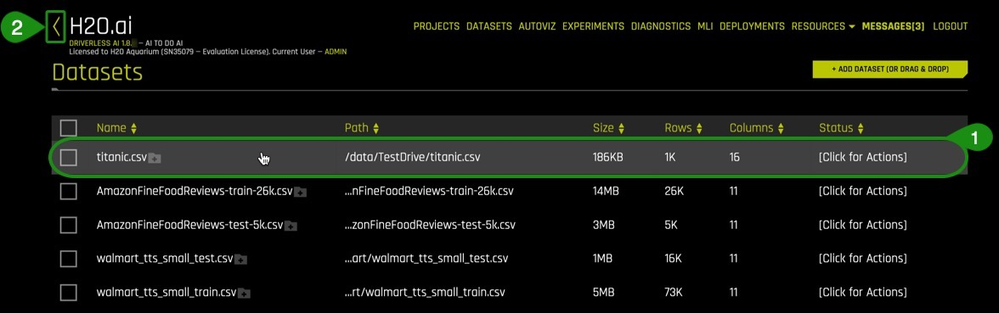

# Introdução ao Machine Learning Automático com o Test Drive do Driverless AI

## Outline

- [Objectivo](#objectivo)
- [Pré-requisitos](#pré-requisitos)
- [Tarefa 1 - Tour do Produto ](#tarefa-1-tour-do-produto)
- [Tarefa 2: Conceitos de Machine Learning Automático ](#tarefa-2-conceitos-de-machine-learning-uutomático )
- [Task 3: Load Data](#task-3-load-data)
- [Task 4: Explore Data Details and AutoViz](#task-4-explore-data-details-and-autoviz)
- [Task 5: Launch First Experiment](#task-5-launch-first-experiment)
- [Task 6: Explore Feature Engineering](#task-6-explore-feature-engineering)
- [Task 7: Explore Experiment Results](#task-7-explore-experiment-results)
- [Task 8: MLI Report for Non-Time-Series](#task-8-mli-report-for-non-time-series)
- [Task 9: Experiment Summary and Autoreport](#task-9-experiment-summary-and-autoreport)
- [Next Steps](#next-steps)
- [Appendix: Project Workspace](#appendix-project-workspace)


## Objectivo

Para este tutorial, vamos utilizar a plataforma comercial da [H2O.ai](https://www.h2o.ai/), [Driverless AI](https://www.h2o.ai/products/h2o-driverless-ai/), para explorar o dataset (conjunto de dados) do Titanic, transatlântico britânico que naufragou após colidir com um iceberg no norte do Oceano Atlântico em 15 de abril de 1912, pela perspectiva da seguradora de vida de um passageiro. Vamos explorar possíveis riscos presentes nesse dataset que poderiam ter sido considerados ao vender o seguro para o passageiro. Mais especificamente, vamos criar um modelo de previsão para determinar quais fatores contribuíram para a sobrevivência de um passageiro durante o acidente.

Nesta visão geral do Driverless AI, você aprenderá a carregar dados, explorar detalhes gerados por esses dados, gerar visualizações automáticas, lançar um experimento, explorar a função de feature engineering, obter acesso aos resultados do seu experimento e fazer um rápido tour pelo nosso relatório de machine learning interpretability (interpretabilidade dos seus modelos de machine learning). 

**Observação**: Este tutorial foi construído no Aquarium, o ambiente da H2O.ai na nuvem, que contém diversas ferramentas voltadas para workshops, conferências e treinamento da empresa. Os labs (ambientes de teste) no Aquarium possuem datasets (conjunto de dados), experimentos, projetos e outros conteúdos pré-carregados. Se você utilizar a sua versão do Driverless AI, você não terá acesso aos conteúdos pré-carregados.

## Pré-requisitos

A **Two Hour Test Drive session**: Test Drive is H2O's Driverless AI on the AWS Cloud. No need to download software. Explore all the features and benefits of the H2O Automatic Learning Platform. 

- Need a **Two Hour Test Drive** session? [Try it Now](https://www.h2o.ai/test-drive/). Follow the instructions [on this quick tutorial](https://h2oai.github.io/tutorials/getting-started-with-driverless-ai-test-drive/#0) to get a Test Drive session started. After the Driverless AI Test Drive session starts, continue reading the remaining prerequisites of this tutorial then start [Task 1: Product Tour](https://h2oai.github.io/tutorials/automatic-ml-intro-test-drive-tutorial/#2).

- Already have a **Two Hour Test Drive** session? Continue reading the remaining prerequisites of this tutorial then start [Task 1: Product Tour](https://h2oai.github.io/tutorials/automatic-ml-intro-test-drive-tutorial/#2). 

**Note: Each Test Drive instance will be available to you for two hours, after which it will terminate. No work will be saved. If you need more time to further explore Driverless AI, you can always launch another Test Drive instance or reach out to our sales team via the [contact us form](https://www.h2o.ai/company/contact/).**

- Basic knowledge of Machine Learning and Statistics


## Tarefa 1 - Tour do Produto

Seja bem-vindo à página de **datasets** (conjunto de dados) do Driverless AI!
 


A interface de usuário no Driverless AI é bem simples de navegar. Confira abaixo a lista de características e alguns conjuntos de dados, que podem ser encontrados na página **Datasets**. Vamos explorar os seguintes comandos ao executarmos o experimento nas próximas tarefas.

1. **Projects**: Espaço para gerenciar seu projeto com conjunto de dados e experimentos 

2. **Datasets**: Visualize seus conjuntos de dados. Outros features para datasets inclui as opções de adicionar um conjunto de dados, pegar os detalhes do dataset, visualizar, separar, prever, renomear, fazer o download e deletar.  

3. **Autoviz**: Visualize um dataset com todos seus gráficos disponíveis

4. **Experiments**:  Visualize seus experimentos que foram completados 

5. **Diagnostics**: Faça o diagnóstico e visualize um modelo de performance para múltiplos scorers baseado no modelo existente e no dataset

6. **MLI**: Veja a lista de modelos interpretados ou faça a interpretação um modelo.

7. **Deployments**: Deploy the MOJO and Python scoring pipelines for you to test or to integrate into a final product. You can also deploy locally or in the cloud.

8. **Resources**: O menu dentro de “resources” oferece links para que você possa visualizar informações do sistema, link para o guia de usuario do Driverless AI e ajuda. A partir desse menu, você também pode fazer o download do Python Client, R Client, MOJO2 runtime, MOJO2 Py runtime, e MOJO2 R runtime.

9. **Messages[ ]**: Visualize novidades no Driverless AI

10. **Logout H2OAI**: Faca o logout da sua sessao.

11. **<**: Volte para a pagina anterior.

12. **H2OAI**: Volte para a pagina de **datasets** da H2O.ai.

13. **Driverless AI 1.X.X**: Versao do Driverless AI 

14. **Add a Dataset(or Drag and Drop)**: Faça o upload ou adicione um conjunto de dados. 


### Mais recursos e detalhes

-  [Join the H2O community on Slack to Ask Questions](https://h2oai-community.slack.com/). Post your questions, discuss use cases, give feedback, stay informed about the latest H2O.ai updates, and more.

- Learn more are about H2O Driverless through the [H2O documentation](http://docs.h2o.ai/driverless-ai/latest-stable/docs/booklets/DriverlessAIBooklet.pdf).

- [Explore H2O Product Documentation](http://docs.h2o.ai/)

- [Learn more H2O Driverless by reviewing the FAQs](http://docs.h2o.ai/driverless-ai/latest-stable/docs/userguide/faq.html) 

## Tarefa 2: Conceitos de Machine Learning Automático 

###  Inteligência Artificial e Machine Learning

Os conceitos apresentados nesta seção visam a fornecer um resumo de alto nível sobre machine learning, também conhecido em português como aprendizagem de máquina. Ao final desta seção, você encontrará uma lista de links com recursos que oferecem explicações mais detalhadas sobre os conceitos abordados aqui.

Machine Learning é uma subcategoria da Inteligência Artificial, cujo foco é criar máquinas que possam aprimorar a inteligência humana. Uma diferença crítica entre inteligência artificial e machine learning é que os modelos de machine learning aprendem com os dados aos quais são expostos. Arthur Samuel, pioneiro do machine learning, definiu, em 1959, machine learning como “um campo de estudo que fornece aos computadores a habilidade de aprender sem que sejam programados. Algoritmos de machine learning treinam o dataset (conjunto de dados) para fazer previsões. Tais previsões são, muitas vezes, utilizadas para otimizar um sistema ou contribuir para a tomada de decisōes.

### Treinamento de Machine Learning

Os avanços na tecnologia tornaram mais fácil a coleta e fornecimento de dados. O tipo de dado disponível irá determinar o tipo de treinamento ao qual o modelo de machine learning deverá ser submetido. Há dois tipos de treinamentos de machine learning: o supervisionado e o não-supervisionado. Treinamento supervisionado é quando um
dataset contém o resultado que você deseja prever. Para os casos em que as variáveis de previsão não estão presentes, estes são chamados de aprendizado sem supervisão. Ambos os tipos de treinamento definem a relação entre a entrada (input) e saída (output) das variáveis.
 
Em machine learning, as variáveis introduzidas (input) são chamadas de **features** e os resultados (output) são labels. Os **labels**, neste caso, é o que estamos tentando prever. O objetivo é utilizar as variáveis introduzidas, ou features e utilizá-las para criar previsões em dados nunca antes vistos. Em uma regressão linear, as features são as variáveis x e os labels são as variáveis y.
Um modelo de machine learning define a relação entre features e labels. Quando modelos são treinados, você pode fazê-lo ao alimentá-lo com exemplos. Exemplos são dados específicos. Você tem dois tipos de exemplos: os rotulados e os não rotulados. Os rotulados são os casos em que sabemos o valor do x, mas não sabemos o valor do y. Seu conjunto de dados é como um exemplo; as colunas utilizadas para o treinamento são os features; as linhas são as instâncias desses features. A coluna que você deseja prever é o label.
 
A aprendizagem supervisionada utiliza exemplos rotulados e permite que um modelo que esteja sendo treinado a aprender a relação entre features e labels. O modelo treinado então é testado com o dado não rotulado e recebe a oportunidade de prever o valor do y (“label”) para o dado não rotulado. Testar um modelo treinado com dado não rotulado é chamado de treinamento não supervisionado. Observe que o Driverless AI cria modelos com exemplos rotulados.

### Preparação dos dados

Um modelo de machine learning é tão importante quanto os dados utilizados para treiná-lo. Se você utilizar um conjunto de dados ruins para treinar seu modelo, isso refletirá em um modelo ruim e vice-versa. Por isso, antes de fazer o upload do seu dataset em ferramentas que irão assisti-lo com a construção do seu modelo, como o Driverless AI, tenha certeza que o seu dataset esteja limpo e pronto para ser treinado.

O processo de transformar dados não tratados em outro formato mais apropriado e útil para a análise é chamado de data wrangling (organização de dados) . Data wrangling, que pode incluir extrações, análise, junção, padronização, aumento, limpeza, consolidação e filtragem dos seus dados, é altamente recomendado antes de carregar o dataset para o Driverless AI.
 
A preparação dos dados garante que o seu dataset esteja no formato correto para o que você está tentando fazer. Duplicatas são removidas e dados que estavam faltando são adicionados, corrigidos e valores categóricos são transformados ou codificados. Por fim, transformações adequadas são realizadas no dataset, tais quais escalabilidade, decomposição e agregação de dados, também conhecido como feature engineering[2].
 
Ferramentas como [Python datatable](https://datatable.readthedocs.io/en/latest/?badge=latest), [Pandas](https://pandas.pydata.org/) e [R](https://www.r-project.org/) são recursos excelentes para data wrangling.

O Driverless AI também pode realizar data wrangling. Isso pode ser feito por meio de uma [recipe (receita)](https://www.r-project.org/), conector [JDBC](http://docs.h2o.ai/driverless-ai/1-8-lts/docs/userguide/connectors-nd/jdbc.html?highlight=jdbc) ou [códigos](http://docs.h2o.ai/driverless-ai/1-8-lts/docs/userguide/datasets-describing.html?highlight=live%20code#modify-by-recipe) que irão criar um novo conjunto de dados ao modificar o existente.

 
### Feature Engineering

A transformação de dados ou feature engineering é o processo de criar novos features (características) com base naqueles já existentes.
 
Algumas transformações de dados incluem olhar para todos os features e identificar quais podem ser combinados para criar novos, que por sua vez serão mais úteis para a performance do modelo.
 
Para features categóricos, a recomendação é para agrupar classes que obtém poucas observações para reduzir a probabilidade de sobreajuste do modelo. Além disso, variáveis fictícias são introduzidas para features categóricos com o intuito de facilitar o machine learning, já que vários algoritmos não suportam features categóricos diretamente. Por fim, remove os features que não são utilizados ou são redundantes.
 
Essas são apenas algumas sugestões quando se trata de feature engineering, algo que pode consumir muito tempo e, devido à sua natureza repetitiva, pode também se tornar algo caro. O próximo passo na construção de um modelo é a seleção do algoritmo.


### Algorithm Selection

Algoritmos de Machine Learning são definidos através de uma função de aprendizagem (f) que associa o melhor valor de x (variável de entrada) para um y (variável de saída): Y=f(x) [4]."
Na aprendizagem supervisionada, há múltiplos algoritmos a serem selecionados para o treinamento. O tipo de algoritmo irá depender no tamanho do seu dataset, estrutura do mesmo e o tipo de problema que está tentando solucionar. Por meio de tentativa e erro, os algoritmos que tiverem uma melhor performance podem ser encontrados para o seu “dataset”. Alguns desses algoritmos incluem regressão linear, classificação, árvores de regressão, naïve Bayes e random forest para citar alguns [5].
 
### Treinamento de Modelos

**Datasets** 

Uma boa prática ao treinar um modelo de machine learning é separar o seu dataset em subgrupos: treinamento, validação e teste de conjuntos. Uma boa proporção para todo o seu dataset é 70-15-15, 70% para treinamento, 15% para validação e os 15% restantes para testes. O conjunto voltado para treinamento é composto pelos dados que serão utilizados para treinar o modelo e precisa ser extenso o suficiente para reunir resultados significativos. O conjunto de validação é composto pelos dados que foram separados para avaliar e ajustar os hiperparâmetros dos modelos treinados e, assim, ajustar a performance. Finalmente, o conjunto de teste é composto pelos dados que foram reservados para confirmar os resultados do modelo final. [1].


Uma outra parte que compōe o treinamento de modelos é a adaptação e ajuste dos modelos. Para isso, os hiperparâmetros precisam ser adaptados e a validação cruzada precisam acontecer somente com os dados de treinamento. Diversos valores de hiperparâmetros precisarão ser testados. Além disso, uma validação cruzada será utilizada para calcular a nota para cada conjunto de hiperparâmetro para cada algoritmo. Com base na validação cruzada e nos valores dos hiperparâmetros, você poderá selecionar o modelo para cada algoritmo que foi ajustado com o treinamento dos dados usando o seu conjunto de dados para teste. A performance do seu modelo de regressão poderá ser avaliado por métricas de performance, como “Mean Square Error (MSE)”, “ROC Curve”, “Prec-Recall”, “LIFT” and “Gain” para citar alguns exemplos.

### Quais são os desafios no desenvolvimento de um modelo de inteligência artificial?
Um dos maiores desafios encontrados no desenvolvimento de um modelo pronto para produção é que isso pode levar semanas ou meses para ser desenvolvido. Desenvolver um modelo envolve feature engineering, construção de modelos e implantação de modelos. Todas as tarefas são bem repetitivas, demoradas e requerem um conhecimento avançado de geração de features, algoritmos, parâmetros e implantação de modelos. Por fim, existe a necessidade de um conhecimento profundo e confiança em como o modelo foi gerado para explicar e justificar como o modelo tomou determinadas decisões. 


### O que é machine learning automático e por que isso é importante?
AutoML or Machine Learning Automático é o processo de automatizar a seleção de algoritmos, geração de features, adaptação de hiperparâmetros, is the process of automating algorithm selection, feature generation, hyperparameter tuning, criação de modelos iterativos e avaliação de modelos. Ferramentas de AutoML como o H2O Driverless AI torna mais fácil o processo de treinamento e avaliação de modelos de machine learning. Automatizar tarefas repetitivas de machine learning permite que os profissionais possam focar nos dados e nos desafios do negócio que eles estão tentando solucionar. 

### References
[1] [Google’s Machine Learning Crash Course](https://developers.google.com/machine-learning/crash-course/training-and-test-sets/splitting-data)

[2] [About Train, Validation and Test Sets in Machine Learning](https://towardsdatascience.com/train-validation-and-test-sets-72cb40cba9e7)

[3] [Data Science Primer - Data Cleaning](https://elitedatascience.com/data-cleaning)

[4] [Feature Engineering](https://elitedatascience.com/feature-engineering) 

[5] [Towards Data Science- Supervised vs Unsupervised Learning](https://towardsdatascience.com/supervised-vs-unsupervised-learning-14f68e32ea8d) 

[6] [Selecting the best Machine Learning Algorithm for your regression problem](https://towardsdatascience.com/selecting-the-best-machine-learning-algorithm-for-your-regression-problem-20c330bad4ef)

### Mais recursos e detalhes

- [Explore the replays from H2O World around the world](
https://www.h2o.ai/h2oworldnewyork/) 
- [Explore the webinar replays](
https://www.brighttalk.com/search/?q=driverless+ai) 
- [Explore the various H2O Driverless AI playlists on YouTube](https://www.youtube.com/user/0xdata/playlists) 


## Tarefa 3: Carregar os Dados

1\. Navegue de volta para a página de Datasets do Driverless AI.

### Sobre o dataset

TO dataset utilizado para esse experimento é o do Titanic. Nós vamos criar um modelo de previsão para determinar quais fatores contribuíram para a sobrevivência de um passageiro. Esse conjunto de dados possui uma lista estimada de passageiros a bordo do RMS Titanic.


[RMS Titanic-Wikipedia](https://en.wikipedia.org/wiki/RMS_Titanic#/media/File:RMS_Titanic_3.jpg)

**Dataset do Titanic**:

1309 linhas, uma linha por passageiro e 16 colunas que representam os atributos de cada passageiro.Para manter os códigos originais do experimento, estes permanecerão em inglês:

|Attribute|Definition|Key|
|---|---|---|
|passenger Id|Id randomly generated| - |
|pclass|Passenger Class| 1= 1st, 2 =2nd, 3=3rd|
|survived|Survival| 0=No, 1=Yes|
|name_with_salutations|Passenger name| - |
|name_without_salutations|Passenger name without salutations| - |
|sex|Sex|Female, Male|
|age|Age in years| - |
|sibsp|Number of siblings/Spouse aboard| - |
|parch|Number of Parents/Children aboard| - |
|ticket|Ticket number| - |
|fare|Passenger fare| - |
|cabin|Cabin number| - |
|embarked|Port of Embarkment|C = Cherbourg, Q = Queenstown, S = Southampton|
|boat|Boat number| - |
|body|Body number| - |
|home.des|Home Destination| - |


### Adicione os dados

1\. Clique em **Add a Dataset (adicionar um conjunto de dados)**  

2\. Selecione **FILE SYSTEM**


3\. Digite /data/TestDrive/titanic.csv na barra de buscas. Selecione titanic.csv e então **Click to Import Selection** (clique para importar seleção)


4\. Se o arquivo for carregado com êxito, você deverá ver uma imagem como a abaixo:



*Observações:*

1. Você pode visualizar:

- O nome de arquivo do seu dataset
- O tamanho do arquivo
- Número de linhas/colunas
- O status do arquivo

2. Opção de voltar para a página anterior
 
### Recursos mais detalhados:

- [Learn More About the Type of Dataset File formats that Can be Uploaded](http://docs.h2o.ai/driverless-ai/latest-stable/docs/userguide/datasets.html#adding-datasets) 

- For more datasets, check out [Kaggle Datasets](https://www.kaggle.com/datasets)

## Task 4: Explore Detalhes dos Dados e AutoViz

### Detalhes


We are now going to explore the Titanic dataset that we just loaded.
Vamos agora explorar o dataset titanic, que acabamos de carregar.


1\. Continuing on the **Dataset Overview page**, click on the titanic.csv dataset. The following options will appear:
1\. Continuando na pagina **Dataset Overview**, clique em titanic.csv dataset. As seguintes opções vão aparecer:


 - Details - View a summary of the dataset or preview the dataset
 - Details - Veja um sumário do dataset ou pré-visualize o dataset
 - Visualize - Visualize the dataset with available graphs
 - Visualize - Visualize o dataset com gráficos disponíveis.
 - Split - Split the dataset
 - Split - Divida o dataset
 - Predict - Run an experiment using Driverless AI
 - Predict - Rode um experimento usando Driverless AI
 - Rename - Rename the dataset
 - Rename - Renomeie o dataset
 - Download - Download the dataset
 - Download - Download do dataset
 - Delete - Delete the dataset 
 - Delete - Remova o dataset

**Note**: A dataset can only be deleted if it's not being used in an experiment. Otherwise, you must delete the experiment first, and then the dataset can be deleted.
**Nota**: O Dataset somente poderá ser deletado se não estiver sendo usado em um experimento. Caso contrário, você deve remover o experimento primeiro, depois disso o dataset poderá ser deletado.

2\. Next, we are going to confirm that the dataset loaded correctly and that it has the correct number of rows and columns by clicking on **Details**.
2\. Agora, nós vamos confirmar que o dataset foi carregado corretamente, e que contêm o número correto de linhas e colunas. Clique em **Details**

3\. Click on **Details**.  **Details** will take you to the **Dataset Details Page**
3\. Clique em **Details**. **Details** te levará a página **Dataset Details**
 
 

*Things to Note:* 
*Atenção nos seguintes:*

1. The **Dataset Details Page** provides a summary of the dataset. This summary lists each column that is included in the dataset along with:
1. A Página **Dataset Details* dará um sumário do dataset. Esse sumário lista cada coluna que é incluida no dataset juntamente com:


    **Logical type (can be changed)**
    

    

    **Format for Date and Datetime columns(can be changed)**
    **Formato para colunas Date e Datetime(poderá ser modificado)**

    

    - Storage type
    - Count
    - Number of missing values
    - Mean
    - Minimum
    - Maximum
    - Standard deviation
    - Frequency
    - Number of unique values
    - Numero de valores únicos
    - View the first 20 rows of a column
    - Veja as primeiras 20 linhas de uma coluna.
    [comment]: <> (The last visualization on the h20 page as shown in the picture above contains only the field Unique. When describing the Unique field the tutorial is refering to "number of unique values"+"View first 20 rows of a colum". Either the page picture above is not showing all options or the information on the tutorial could be confusing.)

    

    **Note**: Driverless AI recognizes the following column types: integer, string, real, boolean, and time. Date columns are given a string "str" type.
    **Nota:** Driverless AI reconhece os seguintes tipos de colunas: integer, string, real, boolean e time. Colunas de Data são atribuídas tipo "str" (String).

2. You can view information for a specific column by entering the name of the column in the field above the graph.
2. Você pode ver as informações de uma coluna específica digitando o nome da coluna no campo a cima do gráfico.

3. **Modify by Recipe** allows you to create a new dataset by modifying an existing dataset with custom recipes.
3. **Modify by Recipe** Permite que seja criado um novo dataset, modificando um dataset existente com receitas personalizadas.

4. **Dataset Rows** allows you to preview the dataset
4. **Dataset Rows** Permite pré-visualize o dataset

5. Option to exit and return to the H2O **Datasets** page
5. Opção para sair e retornar à página **Datasets** do H20 Web App.
[comment]: <> (on Item 5. above; I am refering to the program being ran as "H20 Web App" please let me know if this is the case.)

4\. Select  **Dataset Rows** 
4\. Seleção de **Dataset Rows**


*Things to Note:*
*Atenção nos Seguintes:*
 1. Preview the dataset
 1. Pré-Visualização do dataset
 2. View the remaining rows
 2. Ver as linhas remanecentes.
 3. **Modify by Recipe** - Modify the dataset through a custom recipe
 3. **Modify by Recipe** - Mofificar o dataset por meio de uma receita personalizada.
 3. Return to the **Dataset Overview** 
 3. Retornar ao **Dataset Overview**
 4. Option to Exit and return to the H2O **Datasets** page
 4. Opção para sair e retornar à página **Datasets** do H20 Web App.
 [comment]: <> (There is a possible error here. there are 2 itens numbered 3. They are "**Modify by Recipe**" and "Return to the **Dataset Overview**")
 [comment]: <> (on Item 4. above; I am refering to the program being ran as "H20 Web App" please let me know if this is the case.)
5\. Exit and return to **Datasets Overview** page.
5\. Sair e Retornar a página **Datasets Overview".

### Split the Dataset
### Dividir Dataset

From the Titanic.csv dataset, we are going to create two datasets, training and test. 75% of the data will be used for training the model, and 25% to test the trained model.
Do dataset Titanic.csv, vamos agora criar dois datasets, treinamento e teste. 75% dos dados vão ser usados para o modelo de treinamento, e 25% vão para testar o modelo após treinado.

1\. Click on the titanic.csv file and select **Split**
1\. Clique no arquivo Titanic.csv e selecione **Split** para iniciar a divisão dos datasets. 


2\. Split the data into two sets: titanic_train and titanic_test, then save the changes. Use the image below as a guide:
2\. Divida os dados em dois datasets: titanic_train e titanic_test. depois salve as modificações. Use a imagem seguinte como guia.


*Things to Note:*
*Atenção nos seguintes*

1. For OUTPUT NAME 1: enter ```titanic_train``` (this will serve as the training set)
1. Para OUTPUT NAME 1: Digite ```titanic_train``` (esse servirá como dataset de treinamento)
2. For OUTPUT NAME 2: enter ```titanic_test``` (this will serve as the test set)
2. Para OUTPUT NAME 2: Digite ```titanic_test``` (esse servirá como dataset de teste)
3. You can change the Random Seed; this will generate the same split every time
3. Você pode mudar o Random Seed; isso vai gerar a mesma divisão toda vez
4. Change the split value to .75 by adjusting the slider to 75% or entering .75 in the section that says *Train/Valid Split Ratio*
4. Mude o valor de divisão para .75 ajustando a barra de rolagem para 75% ou digitando .75 na sessão *Train/Valid Split Ratio*
5. Save the changes you made 
5. Salve as alterações.

The ratio of .75 was selected for this particular dataset to not generalize the model given the total size of the set.
A proporção de .75 foi selecionada para esse dataset específico para não generalizar o modelo, dado o tamanho total do dataset.

**The training set** contains 981 rows, each row representing a passenger, and 16 columns representing the attributes of each passenger.
**O Training Set** contém 981 linhas, cada uma representando um passageiro, e 16 colunas representando os atributos de cada passageiro. 

**The Test set** contains 328 rows, each row representing a passenger, and 16 attribute columns representing attributes of each passenger.
**O Test Set** contém 328 linhas, cada uma representando um passageiro, e 16 colunas representando os atributos de cada passageiro.

Verify that the three Titanic datasets, titanic_test, titanic_train and titanic.csv are there:
Verifique que os três Titanic datasets, titanic_test, titanic_train e titanic.csv existem:


### Autoviz

Now that the titanic.csv dataset has been split, we will use the **titanic_train** set for the remaining of the tutorial.
Agora que o titanic.csv dataset foi dividido, nos vamos usar o **titanic_train** dataset pelo restante do tutorial.

There are two ways to visualize the training set:
Existem duas formas de visualizar o training set(modelo de treinamento):


**Method 1** : Clicking on the **titanic_train** file, select **Visualize**, then click on the visualization file generated.
**Método 1** : Clicando no arquivo **titanic_train**, selecione **Visualize**, em seguida clique no arquivo de visualização gerado.


**Method 2**: Clicking on  **Autoviz** located at the top of the UI page, where you will be asked for the dataset you want to visualize.
**Método 2**: Clicando no **Autoviz** localizado no topo da página UI, onde você vai selecionar qual dataset deseja visualizar. 

1\. Pick a method to visualize the **titanic_train** dataset. A similar image should appear:
1\. Escolha um método para visualizar **titanic_train** dataset. Uma imagem similar á seguinte deve aparecer:


Click on the **titanic_train** visualization, and the following screen will appear.
Clique na visualização de **titanic_train** e a seguinte image vai parecer:


Is it possible to visualize how variables on the training set are correlated? Can we determine what other variables are strongly correlated to a passenger's survival? The answer to those questions is yes! One of the graphs that allow us to visualize the correlations between variables is the **Correlation Graph**.
É possível visualizar como variáveis no training set se correlacionam? Podemos determinar que outras variáveis são fortemente correlacionadas com a chance de sobrevivência de um passageiro? A resposta para essas perguntas é sim!
Um dos gráficos que nos permitem visualizar as correlações entre variáveis e o **Correlation Graph**.

Let's explore the correlation between the 'survived' variable and other variables in the dataset.
Vamos explorar a correlação entre a variável 'survived' e outras variáveis nesse dataset.

2\. Select the **Correlation Graph** and then click on **Help** located at the lower-left corner of the graph.
2\. Selecione **Correlation Graph** em seguida clique em **Help** localizado na parte inferior-esquerda do gráfico. 

3\. Take a minute to read about how the correlation graph was constructed.  Learn more about how variables are color-coded to show their correlations.
3\. Separe um tempo para ler sobre como o gráfico de correlação foi construído. Aprenda mais sobre como variáveis são codificadas com cores para mostrar as suas correlacões.

4\. Take the 'survived' variable and drag it slightly to have a better look at the other variables Driverless AI found it is correlated to.
4\. Clique na variável 'survived' e a arraste levemente para ver melhor as outras variáveis que Driverless AI acha que também se correlacionam com a mesma.


What variables are strongly correlated with the 'survived' variable?
Que variáveis são fortemente correlacionadas com a variável 'survived'?


*Things to Note:*
*Atenção nos Seguintes*

 - The **Help** button explains the **Correlation Graph**. This feature is available for all graphs.
 - O botão **Help** explica o **Correlation Graph**. Esta ferramenta está disponível em todos os gráficos.
 - **Download** allows for a full-scale image of the graph to be downloaded
 - **Download** Permite que uma imagem em tamanho real do gráfico esteja disponível para download. 

5\. Exit out of the **Correlation Graph** view by clicking on the **X** at the top-right corner of the graph.
5\. Saia do modo **Correlation Graph** clicando no **X** na parte superior-direita do gráfico.

6\. After you are done exploring the other graphs, go back to the **datasets page**.
6\. Depois que terminar de explorar os outros gráficos, volte para a página **datasets**.

Driverless AI  shows the graphs that are "relevant" aspects of the data. The following are the type of graphs available:
Driverless AI mostra os gráficos de aspectos "relevantes" dos dados. Os gráficos seguintes são os tipos de gráficos disponíveis:

- Correlated Scatterplots
- Gráficos de dispersão correlacionados
- Spikey Histograms
- 
- Skewed Histograms
- Varying Boxplots
- Heteroscedastic Boxplots
- Biplots
- Outliers
- Correlation Graph
- Parallel Coordinates Plot
- Radar Plot
- Data Heatmap
- Missing Values Heatmap
- Gaps Histogram
[comment]: <> (These are all technical names that should be revised by Alan in order to keep the translation accuracy of this tutorial. I was not able to find reliable sources for theses technical translations )


### Deeper Dive and Resources
### Para um Mergulho mais profundo aqui estão alguns Recursos.

- [Learn more about Automatic Visualization from the Driverless docs](http://docs.h2o.ai/driverless-ai/latest-stable/docs/userguide/datasets.html#visualizing-datasets)

- [Learn more about Automatic Visualization from the architect Leland Wilkinson, Chief Scientist, H2O.ai from session at H2O World 2017 Youtube Video](https://www.youtube.com/watch?v=bas3-Ue2qxc)

- [Automatic Visualization SlideShare](https://www.slideshare.net/0xdata/automatic-visualization)

## Task 5: Launch First Experiment

We are going to launch our first experiment. An experiment means that we are going to generate a prediction using a dataset of our choice.

1\. Return to  the **Dataset Overview page**

2\. Click on the **titanic_train** dataset then select **Predict**


If this is your first time launching an experiment, the following prompt will appear, asking if you want to take a tour.  


If you would like to take a quick tour of the **Experiments** page, select **YES**, the quick tour will cover the following items:

- Select the training dataset 
- Select the target column that you want Driverless AI to predict from all columns
- Select if it is a Time Series problem or not [Time Series ON or OFF]

3\. Select **Not Now** to come back and take the tour another time.

4\. The following  **Experiment** page will appear:


*Things to Note:*

0. Assistant - Interactive tour for first-time users. 
Click on  **assistant** to enable it. Yellow circles appear around selected sections of the experiment setup page. You can hover any of them to get more info on each section. 

Note: To disable **assistant**, click on assistant again.


 
 
1. **Display Name** - Type the name for your experiment `Titanic Classification Tutorial.`
2. **Dataset** - the name of the dataset being used to create an experiment
3. **Rows** - total number of rows 
4. **Columns** - total number of columns 
5. **Dropped Columns** - Drop column(s) from your dataset that you don't want to use in the experiment
6. **Validation Dataset** - Select the dataset you want to validate. This set will be used to validate parameters like models, features, etc.
7. **Test Dataset** - The dataset that will be used to test the model generated from the training dataset. It's not used during training of the model, and results are available at the end of the experiment.
8. **Target column** -  What do you want to predict? 
9. **Fold column** - The fold column is used to create the training and validation datasets so that all rows with the same Fold value will be in the same dataset
10. **Weight column** - Column that indicates the observation weight (a.k.a. sample or row weight), if applicable.  
11. **Time Column**(OFF by default) - Provides a time order(timestamps for observations). Used when data has a high dependency on time (such as seasonality or trend), and you want to treat this problem as a time series problem. 

Continuing with our experiment:

5\. Click **Dropped Columns**, drop the the following columns: Passenger_Id, name_with_salutations, name_without_salutations, boat, body and home.dest. Then select **Done**. 


These attributes (columns) were removed to create a cleaner dataset. Attributes such as boat and body are excluded because they are clear indicators that a passenger survived and can lead to data leakage. For our experiment, the survived column will suffice to create a model. 

A clean dataset is essential for the creation of a good predictive model. The process of data cleansing needs to be done with all datasets to rid the set of any unwanted observations, structural errors, unwanted outliers, or missing data. 

6\. Select **Test Dataset** and then click on **titanic_test**


7\. Now select the **Target Column**. In our case, the column will be 'survived.'


The survived attribute was selected because, as an insurance company, we want to know what other attributes can contribute to the survival of passengers aboard a ship and incorporate that into our insurance rates.

8\. Your experiment page should look similar to the one below; these are the system suggestions:


*Things to Note:*

1. **Training Settings** - Describes the Accuracy, Time, and Interpretability of your specific experiment.  The knobs on the experiment settings are adjustable as values change the meaning of the settings on the left-bottom page change.
    - **Accuracy** - (Relative accuracy) higher values, should lead to higher confidence in model performance (accuracy).
    - **Time** - Relative time for completing the experiment. Higher values will take longer for the experiment to complete.
    - **Interpretability** -  The degree to which a human can understand the cause of the decision.  
2. **Expert Settings** - Available expert settings to customize your experiment. 
3. **Scorer** - Driverless AI selects the best scorer based on your dataset. Other scorers can be manually selected.
4. **Classification** - Classification or Regression button. Driverless AI automatically determines the problem type based on the response column. Though not recommended, you can override this setting by clicking this button. 
5. **Reproducible** - This button allows you to build an experiment with a random seed and get reproducible results. If this is disabled (default), the results will vary between runs.
6. **GPUs Enabled** - Specify whether to enable GPUs. (Note that this option is ignored on CPU-only systems)
7. **Launch Experiment** - Launches the experiment


9\. Update the following experiment settings so that they match the image below, then select **Launch Experiment**.

- Accuracy: 4
- Time: 2
- Interpretability: 6
- Scorer: AUC
- Reproducible:  Enabled (Click on Reproducible)


**Note**: To Launch an Experiment: The dataset and the target column are the minimum elements required to launch an experiment.

10\. The **Experiment** page will look similar to the one below after 45% complete:


*Things to Note:*
1. **Experiment Name** - Name of your experiment. If you do not assign a name to it, a random name will be generated. The name can be changed at any time.
2. **Experiment Setup** - Summary of experiment setup and dataset details.
3. **Running Status Display** - Status of parameter tuning followed by feature engineering and scoring pipeline. Experiments can be stopped by clicking the ```Finish``` button.
4. Overview of training settings (unable to adjust the while experiment is running): **Training Settings**, **Experiment Settings**, **Scorer**, **Classification**, **Reproducible** and **GPU Enabled**. 
5. **CPU/Memory** information including **Notifications**, **Logs**, and **Trace** info. (Note that Trace is used for development/debugging and to show what the system is doing at that moment.) **Scorers** or model scorers allow you to view the detailed information about model scores after an experiment is complete. **Scorers** includes model and feature tuning leaderboard, single final model cross-validation fold scores, and final ensemble scores.
6. **Iteration Data** and **Variable Importance** - Iteration Data is the internal validation for each cross-validation fold with the specified scorer value. You can hover over any of the iteration points in the Iteration Data graph, and the see the updated variable importance for that iteration on the **Variable Importance**
7. **Classification Problem Graphs** - Toggle between a ROC curve, Precision-Recall graph, Lift chart, Gains chart, and GPU Usage information (if GPUs are available). For regression problems, the lower right section includes a toggle between a Residuals chart, an Actual vs. Predicted chart, and GPU Usage information (if GPUs are available). 
                                                            
Once the experiment is complete, an **Experiment Summary** will appear:


*Things to Note:*
1. Status Complete Options
    - Deploy (Local and Cloud)
    - Interpret This Model 
    - Diagnose Model On New Dataset 
    - Score on Another Dataset
    - Transform Another Dataset
    - Download Predictions
        - Training Predictions
        - Validation Set Predictions(available if a validation set was provided)
        - Test Set Predictions
    - Download Python Scoring Pipeline - A standalone Python Scoring pipeline that downloads a package containing an exported model and Python 3.6 source code examples for productionizing models built using H2O Driverless AI. 
    - Download MOJO Scoring Pipeline - A standalone scoring pipeline that converts experiments to MOJO's, which can be scored in realtime. It is available as either Java runtime or a C++ runtime(with Python and R wrappers).
    - Visualize Scoring Pipeline(Experimental): A visualization of the scoring pipeline is available for each completed experiment.

    

    - Download Experiment Summary - A zip file providing textual explanations of the graphical representations that are shown in the Driverless AI UI.
        - Experiment logs (regular and anonymized)
        - A summary of the experiment
        - The experiment features along with their relative importance
        - Ensemble information
        - An experiment preview
        - Word version of an auto-generated report for the experiment
        - Target transformations tuning leaderboard
        - A tuning leaderboard
 
    - Download Autoreport - This report provides insight into the training data and any detected shifts in distribution, the validation schema selected, model parameter tuning, feature evolution, and the final set of features chosen during the experiment.

2. Iteration Data - Validation/Variable Importance - Summary of top 20 - Feature Engineered variables

3. Experiment Graphs and Summary - This section describes the dashboard graphs that display for running and completed experiments. These graphs are interactive. Hover over a point on the graph for more details about the point.

### Deeper Dive and Resources

- [Learn more about running Experiments from H2O Driverless AI docs](http://docs.h2o.ai/driverless-ai/latest-stable/docs/userguide/running-experiment.html#)

- [Explore Documentation on Completed Experiments](http://docs.h2o.ai/driverless-ai/latest-stable/docs/userguide/experiment-completed.html)

- [Explore Documentation on Visualizing the Scoring Pipeline](http://docs.h2o.ai/driverless-ai/1-8-lts/docs/userguide/scoring_pipeline_visualize.html?highlight=visualize%20scoring%20pipeline)

- [Explore Documentation on Experiment Summary](http://docs.h2o.ai/driverless-ai/latest-stable/docs/userguide/experiment-summary.html) 

- [Review the Driverless AI Booklet to learn more about running experiments](http://docs.h2o.ai/driverless-ai/latest-stable/docs/booklets/DriverlessAIBooklet.pdf) 


## Task 6: Explore Feature Engineering

Driverless AI performs feature Engineering on the dataset to determine the optimal representation of the data. Various stages of the features appear throughout the iteration of the data. These can be viewed by hovering over points on the Iteration Data - Validation Graph and seeing the updates on the **Variable Importance** section.


Transformations in Driverless AI are applied to columns in the data. The transformers create engineered features in experiments. There are many types of transformers, below are just some of the transformers found in our dataset:

1\. Look at some of the variables in **Variable of Importance**. Note that some of the variables start with ```CVTE``` followed by a column from the dataset. Some other variables might also begin with ```_NumToCatTE```, ```Freq``` or ```_WoE``` depending on the experiment you run. These are the new, high-value features for our training dataset.

These transformations are created with the following transformers:

- Cross Validation Target Encoding Transformer: ```_CVTargetEncode```
- Weight of Evidence : ```WoE```
- Frequent Transformer: ```Freq```  
- Numeric to Categorical Target Encoding Transformer = ```_NumToCatTE```

You can also hover over any of the variables under variable importance to get a simple explanation of the transformer used as seen in the image below:


The complete list of features used in the final model is available in the Experiment Summary artifacts. The Experiment Summary also provides a list of the original features and their estimated feature importance. 

### Deeper Dive and Resources

- [Learn more about Driverless AI Transformations](http://docs.h2o.ai/driverless-ai/latest-stable/docs/userguide/transformations.html) 

- [Feature Engineering for Machine Learning by Dmitry Larko](https://www.youtube.com/playlist?list=PLrsf4weWJKynQBvh0i-YxDDVqCcIrF28o) 

- [H2O World London 2018 Feature Engineering session replay](https://www.youtube.com/watch?v=d6UMEmeXB6o ) and [slides  by Dmitry](https://www.slideshare.net/0xdata/feature-engineering-in-h2o-driverless-ai-dmitry-larko-h2o-ai-world-london-2018 ) 

## Task 7: Explore Experiment Results

Let’s explore the results of this classification experiment. You can find the results on the **Experiment Summary** at the left-bottom of **Experiment** page. The resulting plots are insights from the training and validation data resulting from the classification problem. Each plot will be given a brief overview. 

If you are interested in learning more about each plot and the metrics derived from those plots covered in this section, then check out our next tutorial [Machine Learning Experiment Scoring and Analysis Tutorial - Financial Focus](https://h2oai.github.io/tutorials/machine-learning-experiment-scoring-and-analysis-tutorial-financial-focus/#0).


1\. Summary

Once the experiment is done, a summary is generated at the bottom-right corner of the **Experiment** page.

The summary includes:

- **Experiment**: experiment name,
  - Version: the version of Driverless AI and the date it was launched
  - Settings: selected experiment settings, seed, and amount of GPU’s enabled
  - Train data: name of the training set, number of rows and columns
  - Validation data: name of  the validation set, number of rows and columns
  - Test data: name of the test set, number of rows and columns
  - Target column: name of the target column (the type of data and % target class)

- **System Specs**: machine specs including RAM, number of CPU cores and GPU’s
  - Max memory usage  

- **Recipe**: 
  - Validation scheme: type of sampling, number of internal holdouts
  - Feature Engineering: number of features scored and the final selection

- **Timing**
  - Data preparation 
  - Shift/Leakage detection
  - Model and feature tuning: total time for model and feature training and  number of models trained 
  - Feature evolution: total time for feature evolution and number of models trained 
  - Final pipeline training: total time for final pipeline training and the total models trained 
  - Python / MOJO scorer building 
- Validation Score: Log loss score +/- machine epsilon for the baseline
- Validation Score: Log loss score +/- machine epsilon for the final pipeline
- Test Score: Log loss score +/- machine epsilon score for the final pipeline 

Most of the information in the Experiment Summary tab, along with additional detail, can be found in the Experiment Summary Report (Yellow Button “Download Experiment Summary”).

1. Find the number of features that were scored for your model and the total features that were selected. 

2. Take a look at the validation Score for the final pipeline and compare that value to the test score. Based on those scores, would you consider this model a good or bad model? 

2\. ROC - Receiver Operating Characteristics

This type of graph is called a Receiver Operating Characteristic curve (or ROC curve.) It is a plot of the true positive rate against the false-positive rate for the different possible cutpoints of a diagnostic test.

An ROC curve is a useful tool because it only focuses on how well the model was able to distinguish between classes. “AUC’s can help represent the probability that the classifier will rank a randomly selected positive observation higher than a randomly selected negative observation”[1].  However, for models where the prediction happens rarely, a high AUC could provide a false sense that the model is correctly predicting the results.  This is where the notion of precision and recall become essential.

The ROC curve below shows Receiver-Operator Characteristics curve stats on validation data along with the best Accuracy, FCC, and F1 values[2].


This ROC gives an Area Under the Curve or AUC of .8530. The AUC tells us that the model is able to classify the survivors 85.30% of the time correctly.  

Learn more about the ROC Curve on [Machine Learning Experiment Scoring and Analysis Tutorial - Financial Focus: ROC](https://h2oai.github.io/tutorials/machine-learning-experiment-scoring-and-analysis-tutorial-financial-focus/#7).

3\. Prec-Recall - Precision-Recall graph

Prec-Recall is a complementary tool to ROC curves, especially when the dataset has a significant skew. The Prec-Recall curve plots the precision or positive predictive value (y-axis) versus sensitivity or true positive rate (x-axis) for every possible classification threshold. At a high level, we can think of precision as a measure of exactness or quality of the results while recall as a measure of completeness or quantity of the results obtained by the model. Prec-Recall measures the relevance of the results obtained by the model.

The Prec-Recall plot below shows the Precision-Recall curve on validation data along with the best Accuracy, FCC, and F1 values. The area under this curve is called AUCPR.


Similarly to the ROC curve, when we take a look at the area under the curve of the Prec-Recall Curve of AUCPR we get a value of .7960. This tells us that the model brings forth relevant results or those cases of the passengers that survived 79.60% of the time.

Learn more about the Prec-Curve Curve on [Machine Learning Experiment Scoring and Analysis Tutorial - Financial Focus: Prec-Recall](https://h2oai.github.io/tutorials/machine-learning-experiment-scoring-and-analysis-tutorial-financial-focus/#8).

4\. Cumulative Lift Chart 

Lift can help us answer the question of how much better one can expect to do with the predictive model compared to a random model(or no model). Lift is a measure of the effectiveness of a predictive model calculated as the ratio between the results obtained with a model and with a random model(or no model). In other words, the ratio of gain% to the random expectation % at a given quantile. The random expectation of the xth quantile is x%[4].

The Cumulative Lift chart shows lift stats on validation data. For example, “How many times more observations of the positive target class are in the top predicted 1%, 2%, 10%, etc. (cumulative) compared to selecting observations randomly?” By definition, the Lift at 100% is 1.0.


Learn more about the Cumulative Lift Chart on [Machine Learning Experiment Scoring and Analysis Tutorial - Financial Focus: Cumulative Lift](https://h2oai.github.io/tutorials/machine-learning-experiment-scoring-and-analysis-tutorial-financial-focus/#10).

5\. Cumulative Gains Chart

Gain and Lift charts measure the effectiveness of a classification model by looking at the ratio between the results obtained with a trained model versus a random model(or no model)[3]. The Gain and Lift charts help us evaluate the performance of the classifier as well as answer questions such as what percentage of the dataset captured has a positive response as a function of the selected percentage of a sample. Additionally, we can explore how much better we can expect to do with a model compared to a random model(or no model)[4].

For better visualization, the percentage of positive responses compared to a selected percentage sample, we use Cumulative Gains and Quantile. 

In the Gains Chart below, the x-axis shows the percentage of cases from the total number of cases in the test dataset, while the y-axis shows the percentage of positive outcomes or survivors in terms of quantiles.

The Cumulative Gains Chart below shows Gains stats on validation data. For example, “What fraction of all observations of the positive target class are in the top predicted 1%, 2%, 10%, etc. (cumulative)?” By definition, the Gains at 100% are 1.0.


The Gains chart above tells us that when looking at the 20% quantile, the model can positively identify ~45% of the survivors compared to a random model(or no model) which would be able to positively identify about ~20% of the survivors at the 20% quantile.

Learn more about the Cumulative Gains Chart on [Machine Learning Experiment Scoring and Analysis Tutorial - Financial Focus: Cumulative Gains](https://h2oai.github.io/tutorials/machine-learning-experiment-scoring-and-analysis-tutorial-financial-focus/#9).

6\. K-S

Kolmogorov-Smirnov or K-S measures the performance of classification models by measuring the degree of separation between positives and negatives for validation or test data[5]. “The K-S is 100 if the scores partition the population into two separate groups in which one group contains all the positives and the other all the negatives. On the other hand, If the model cannot differentiate between positives and negatives, then it is as if the model selects cases randomly from the population. The K-S would be 0. In most classification models, the K-S will fall between 0 and 100, and that the higher the value, the better the model is at separating the positive from negative cases.”[6].

K-S or the Kolmogorov-Smirnov chart measures the degree of separation between positives and negatives for validation or test data.

Hover over a point in the chart to view the quantile percentage and Kolmogorov-Smirnov value for that point.


For the K-S chart above, if we look at the top 60% of the data, the at-chance model (the dotted diagonal line) tells us that only 60% of the data was successfully separate between positives and negatives (survived and did not survived). However, with the model, it was able to do .499, or about 50% of the cases were successfully separated between positives and negatives.

Learn more about the Kolmogorov-Smirnov chart on [Machine Learning Experiment Scoring and Analysis Tutorial - Financial Focus: Kolmogorov-Smirnov chart](https://h2oai.github.io/tutorials/machine-learning-experiment-scoring-and-analysis-tutorial-financial-focus/#11).

### References
 
[1] [ROC Curves and Under the Curve (AUC) Explained](https://www.youtube.com/watch?v=OAl6eAyP-yo)

[2] [H2O Driverless AI - Experiment Graphs](http://docs.h2o.ai/driverless-ai/latest-stable/docs/userguide/experiment-graphs.html?highlight=roc%20curve)

[3] [Model Evaluation Classification](https://www.saedsayad.com/model_evaluation_c.htm)

[4] [Lift Analysis Data Scientist Secret Weapon](https://www.kdnuggets.com/2016/03/lift-analysis-data-scientist-secret-weapon.html)

[5] [H2O’s Kolmogorov-Smirnov](http://docs.h2o.ai/driverless-ai/latest-stable/docs/userguide/experiment-graphs.html?highlight=mcc)

[6] [Model Evaluation- Classification](https://www.saedsayad.com/model_evaluation_c.htm)


### Deeper Dive and Resources

- [The Best Metric to Measure Accuracy of Classification Models](https://clevertap.com/blog/the-best-metric-to-measure-accuracy-of-classification-models/)

## Task 8: MLI Report for Non-Time-Series

After the predictive model is finished, we can explore the interpretability of our model. In other words, what are the results and how did those results come to be?

Questions to consider before viewing the MLI Report:

- Which attributes from our Titanic Training Set are the most important in relation to surviving? Make a note of your top 2 attributes to compare it with the model's results

There are two ways to generate the MLI Report, selecting the **MLI** link on the upper-right corner of the UI or clicking **Interpret this Model** button on the **Experiment** page. 

**Generate the MLI report**:

1\. **On the Status: Complete** Options, select **Interpret this Model**


2\. Once the MLI model is complete, you should see an image similar to the one below:


3\. Once the **MLI Experiment is finished** a pop up comes up, go to MLI page by clicking **Yes**.

4\. The MLI Interpretability Page has the explanations to the model results in a human-readable format.  

This section describes MLI functionality and features for regular experiments. For non-time-series experiments, this page provides several visual explanations and reason codes for the trained Driverless AI  model, and it's results.  


*Things to Note:*
1. Summary -  Summary of MLI experiment. This page provides an overview of the interpretation, including the dataset and Driverless AI experiment (if available) that were used for the interpretation along with the feature space (original or transformed), target column, problem type, and k-Lime information.

2. Driverless AI Model: For binary classification and regression experiments, the Driverless AI Model menu provides the following plots for Driverless AI models:

    - **Feature Importance for transformed features**: This plot shows the Driverless AI feature importance. Driverless AI feature importance is a measure of the contribution of an input variable to the overall predictions of the Driverless AI model. Global feature importance is calculated by aggregating the improvement in splitting criterion caused by a single variable across all of the decision trees in the Driverless AI model.

    

    - **Shapley plots for transformed features**: Shapley explanations are a technique with credible theoretical support that presents consistent global and local variable contributions. Local numeric Shapley values are calculated by tracing single rows of data through a trained tree ensemble and aggregating the contribution of each input variable as the row of data moves through the trained ensemble. For regression tasks, Shapley values sum to the prediction of the Driverless AI model. For classification problems, Shapley values sum to the prediction of the Driverless AI model before applying the link function. Global Shapley values are the average of the absolute Shapley values over every row of a dataset.

    

    - **Partial Dependence/ICE Plot** :  
    
    Partial dependence is a measure of the average model prediction with respect to an input variable. Partial dependence plots display how machine-learned response functions change based on the values of an input variable of interest while considering nonlinearity and averaging out the effects of all other input variables. Partial dependence plots are well-known and described in the Elements of Statistical Learning (Hastie et al., 2001). Partial dependence plots enable increased transparency in Driverless AI models and the ability to validate and debug Driverless AI models by comparing a variable's average predictions across its domain to known standards, domain knowledge, and reasonable expectations. 
    
    Individual conditional expectation (ICE) plots, a newer and less well-known adaptation of partial dependence plots, can be used to create more localized explanations for a single individual using the same basic ideas as partial dependence plots. ICE Plots were described by Goldstein et al. (2015). ICE values are simply disaggregated partial dependence, but ICE is also a type of nonlinear sensitivity analysis in which the model predictions for a single row are measured. At the same time, a variable of interest is varied over its domain. ICE plots enable a user to determine whether the model's treatment of an individual row of data is outside one standard deviation from the average model behavior, whether the treatment of a specific row is valid in comparison to average model behavior, known standards, domain knowledge, and reasonable expectations, and how a model will behave in hypothetical situations where one variable in a selected row is varied across its domain.

    

    - **Disparate Impact Analysis(NEW)**: Disparate Impact Analysis is a technique that is used to evaluate fairness. Bias can be introduced to models during the process of collecting, processing, and labeling data—as a result, it is essential to determine whether a model is harming certain users by making a significant number of biased decisions. Learn more about [Disparate Impact Analysis](http://docs.h2o.ai/driverless-ai/1-8-lts/docs/userguide/interpret-non-ts.html#disparate-impact-analysis).

    

    

    

    - **Sensitivity Analysis(NEW)** : 
    
    Sensitivity Analysis (or "What if?") is a simple and powerful model debugging, explanation, fairness, and security tool. The idea behind Sensitivity Analysis is both direct and straightforward: Score your trained model on a single row, on multiple rows, or an entire dataset of potentially interesting simulated values and compare the model's new outcome to the predicted outcome on the original data.

    Sensitivity analysis investigates whether model behavior and outputs remain stable when data is intentionally perturbed, or other changes are simulated in the data. Machine learning models can make drastically differing predictions for only minor changes in input variable values. For example, when looking at predictions that determine financial decisions, SA can be used to help you understand the impact of changing the most important input variables and the impact of changing socially sensitive variables (such as Sex, Age, Race, etc.) in the model. If the model changes in reasonable and expected ways when important variable values are changed, this can enhance trust in the model. Similarly, if the model changes to sensitive variables have minimal impact on the model, then this is an indication of fairness in the model predictions.

    Learn more about [Sensitivity Analysis](http://docs.h2o.ai/driverless-ai/1-8-lts/docs/userguide/interpret-non-ts.html#sensitivity-analysis).

    

    - **NLP Tokens (for text experiments only)**: This plot shows both the global and local importance values of each token in a corpus (a large and structured set of texts). The corpus is automatically generated from text features used by Driverless AI models prior to the process of tokenization

    - **NLP LOCO (for text experiments)**: This plot applies a leave-one-covariate-out (LOCO) styled approach to NLP models by removing a specific token from all text features in a record and predicting local importance without that token. The difference between the resulting score and the original score (token included) is useful when trying to determine how specific changes to text features alter the predictions made by the model.

    - [See documentation for multiclass classification and time-series experiments](http://docs.h2o.ai/driverless-ai/1-8-lts/docs/userguide/interpret-non-ts.html#summary-page)

3. Surrogate Models - For classification and regression experiments

    - **KLIME**

    

    - **Decision Tree**

    

    - **Random Forest - Feature Importance**

    
    
    - **Random Forest - Partial Dependence**

    

    - **Random Forest - LOCO**

    

4. **Dashboard** - The Model Interpretation Page includes the following:
    - K-Lime: Global Interpretability Model Explanation Plot
    - Feature Importance: Surrogate RF Feature Importance
    - Decision Tree Surrogate model
    - Partial Dependence and Individual Conditional Expectation (ICE) plots

5. MLI Docs - Link to the "Machine Learning Interpretability with 
Driverless AI" booklet
6. Download MLI Logs 
7. Experiment - Link to return to the experiment that generated the current interpretation
8. Scoring Pipeline - Download the scoring pipeline for the current interpretation
9. Download Reason Codes - Download a CSV file of LIME or Shapley reason codes
10. Datasets - Takes you back to the Datasets page 
11. Experiments - Takes you back to the Experiments page
12. MLI - Takes you back to the MLI page 
13. Row selection - The row selection feature allows a user to search for a particular observation by row number or by an identifier column. Identifier columns cannot be specified by the user - MLI makes this choice automatically by choosing columns whose values are unique (dataset row count equals the number of unique values in a column).


### MLI Dashboard

Select the MLI **Dashboard** and explore the different types of insights and explanations regarding the model and its results. All plots are interactive.


1\. K-Lime - Global Interpretability model explanation plot: 
This plot shows Driverless AI model and LIME model predictions in sorted order by the Driverless AI model predictions. In white, is the global linear model of Driverless AI predictions (middle green).
1. Hover over any of the points of the plot and view the LIME reason codes for that value.
2. Select a point where *Actual value* is 1 and note the reason codes for that prediction value


Learn more about K-Lime with our [Machine Learning Interpretability Tutorial](https://h2oai.github.io/tutorials/machine-learning-interpretability-tutorial/#7).

2\. Feature Importance - 
This graph shows the essential features that drive the model behavior.
1. Which attribute/feature had the most importance?
2. Was this the same attribute that you hypothesized?
3. View the explanation of the **Variable Importance** plot by selecting **About this plot**


Learn more about Feature Importance with our [Machine Learning Interpretability TUtorial](https://h2oai.github.io/tutorials/machine-learning-interpretability-tutorial/#4).

3\. Decision Tree Surrogate model
The decision Tree Surrogate model displays the model's approximate flowchart of the complex Driverless AI model's decision making.                  
Higher and more frequent features are more important. Features above or below one-another can indicate an interaction. Finally, the thickest edges are the most common decision paths through the tree that lead to a predicted numerical outcome.

1. What is the most common decision path for the Titanic Training set?

Solution:


Learn more about Decision Trees with our [Machine Learning Interpretability Tutorial](https://h2oai.github.io/tutorials/machine-learning-interpretability-tutorial/#6).

4\. Partial Dependence and Individual Conditional Expectation (ICE) plot. This plot represents the model prediction for different values of the original variables. It shows the average model behavior for important original variables.

The grey bar represents the standard deviation of predictions. The yellow dot represents the average predictions.


1. Explore other average values for different variables and compare the results to your original observations. To change the variable, select **PDP Variable:** located at the top of the Partial Dependence plot.
 
Learn more about Partial Dependence Plots with our [Machine Learning Interpretability Tutorial](https://h2oai.github.io/tutorials/machine-learning-interpretability-tutorial/#5).

5\. Explanations 

Explanations provide a detailed, easy-to-read **Reason Codes** for the top Global/Local Attributions.
1. Click on Explanations


2. Determine the top 2 global attributions associated with 'survived.'

6\. Driverless AI offers other plots located under Driverless AI Model and Surrogate Models, take a few minutes to explore these plots; they are all interactive. **About this Plot** will provide an explanation of each plot.

Driverless AI Model
- Feature Importance
- Shapley
- Partial Dependence Plot
- Disparate Impact Analysis
- Sensitivity Analysis 

Surrogate Models
- KLime
- Random Forest
    - Feature Importance
    - Partial Dependency Plot
    - LOCO

7\. Click on the MLI link and learn more about "Machine Learning Interpretability with Driverless AI."

### Deeper Dive and Resources

- [Machine Learning, H2O.ai & Machine Learning  Interpretability | Interview with Patrick Hall](https://www.youtube.com/watch?v=TSmSBWnVSzc)

- [H2O Driverless AI Machine Learning Interpretability walkthrough]( 
https://www.youtube.com/watch?v=5jSU3CUReXY) (Oct 18)

- [Practical Tips for Interpreting Machine Learning Models - Patrick Hall, H2O.ai Youtube Video](https://www.youtube.com/watch?v=vUqC8UPw9SU) (June 18)

- [Practical Tips for Interpreting Machine Learning Models - Patrick Hall, H2O.ai Slideshare](https://www.slideshare.net/0xdata/practical-tips-for-interpreting-machine-learning-models-patrick-hall-h2oai)

- [Building Explainable Machine Learning Systems: The Good, the Bad, and the Ugly](https://www.youtube.com/watch?v=Q8rTrmqUQsU) (May 18)
 
- [An Introduction to Machine Learning Interpretability](https://www.oreilly.com/library/view/an-introduction-to/9781492033158/) 

- [Testing Machine Learning Explanation Techniques](https://www.oreilly.com/ideas/testing-machine-learning-interpretability-techniques)

- [Patrick Hall and H2O Github - Machine Learning with Python](https://github.com/jphall663/interpretable_machine_learning_with_python)

- [Patrick Hall and H2O Github - Machine Learning Interpretability](https://github.com/jphall663/awesome-machine-learning-interpretability) 

- [Download the Driverless AI MLI Cheat Sheet](http://docs.h2o.ai/driverless-ai/latest-stable/docs/userguide/_downloads/5cb84bc81a49817d5f490dde39bf42ee/cheatsheet.png) 

## Task 9: Experiment Summary and Autoreport

Driverless AI allows you to download auto-generated documents such as the Download Experiment Summary and the MLI Report, all at the click of a button. 

###  Experiment Summary

1\. Click on **Download Experiment Summary**


When you open the zip file, the following files should be included:

- Experiment logs (regular and anonymized)
- A Summary of the Experiment
- Experiment Features along with relevant importance
- Ensemble information
- Experiment preview 
- Word version of an auto-generated report for the experiment
- Target transformations tuning leaderboard
- Tuning Leaderboard

2\. Open the auto-generated .doc report and review the experiment results.

3\. Click on **Download Autoreport**


**Autoreport** is a Word version of an auto-generated report for the experiment. A report file (AutoDoc) is included in the experiment summary.

The zip file for the **Autoreport** provides insight into the following:

- Training data
- Any Detected Shifts in Distribution
- Validation Schema selected
- Model Parameter Tuning 
- Feature Evolution 
- Final set of Features chosen during the Experiment


### Deeper Dive and Resources

- [H2O.ai, Driverless AI Experiment Summary and Autoreport](http://docs.h2o.ai/driverless-ai/1-8-lts/docs/userguide/experiment-summary.html#autoreport)

- [Review this Webinar “Peek Under the Hood of H2O Driverless AI with Auto Doc”](https://www.brighttalk.com/webcast/16463/332693/peek-under-the-hood-of-h2o-driverless-ai-with-auto-doc) 

- [Try running an experiment without the Driverless AI UI using the Python Client](http://docs.h2o.ai/driverless-ai/latest-stable/docs/userguide/examples/h2oai_client_demo.html?highlight=experiment%20summary)

- [Toward AutoML for Regulated Industry with H2O Driverless AI](https://www.h2o.ai/blog/toward-automl-for-regulated-industry-with-h2o-driverless-ai/)

## Next Steps

Check out Driverless AI next tutorial [Machine Learning Experiment Scoring and Analysis Tutorial - Financial Focus](https://h2oai.github.io/tutorials/machine-learning-experiment-scoring-and-analysis-tutorial-financial-focus/#0)

Where you will learn how to:

- Evaluate a Driverless AI model through tools like:
	- ROC
	- Prec-Recall
	- Gain and Lift Charts
	- K-S Chart
	- Metrics such as:
	  - AUC
	  - F-Scores
	  - GINI
	  - MCC
	  - Log Loss
- Request a [21-Day Free Trial: H2O Driverless AI license Key](https://www.h2o.ai/products/h2o-driverless-ai/)

## Appendix: Project Workspace

Driverless AI provides a Project Workspace for managing datasets and experiments related to a specific business problem or use case. Whether you are trying to detect fraud or predict user retention, datasets, and experiments can be stored and saved in the individual projects. A Leaderboard on the Projects page allows you to easily compare performance and results and identify the best solution for your problem.

From the Projects page, you can link datasets and/or experiments, and you can run new experiments. When you link an existing experiment to a Project, the datasets used for the experiment will automatically be linked to this project (if not already linked).


### Explore an Existing Project Workspace


1\. Select **Projects** , an image similar to the one below will appear:


*Things to Note:*

1. **Projects**: Projects Workspace for managing datasets and expirments menu option
2. Pre-created **Project** which includes:
    - **Name** : Project name (Time Series Tutorial)
    - **Description**: Optional (N/A)
    - **Train Datasets**: Number of train datasets (1)
    - **Valid Datasets**: Number of validation datasets (0)
    - **Test Datasets**: Number of test datasets (1)
    - **Experiments**: Number of experiments (1)
3. Additional options for the created project:
    - **Open**
    - **Rename**
    - **Delete**
4. **+New Project**: Option to create a new project 

3\. Open the **Time Series Tutorial**, an image similar to the one below will appear:


*Things to Note:*

1. **Datasets** 
    - **Selected Datasets Type**: Training, Testing or Validation
    - Additional information on the dataset that was selected: Name, Rows, Columns

    
    
    - **+ Link dataset** : Link an additional dataset (Training, Testing or Validation) to the existing project

2. **Experiments** 
    - **Select Scoring Dataset**: Select a test dataset to score using selected experiment
    - **Select Experiments**: Select any experiment for this project
    - **Select Scorer for Test Score**: Select a valid scorer for this experiment
    - **Score Dataset on Experiments**: Once you have selected the data for scoring, the scorer, and the model or models, you can begin the scoring process by clicking **Score Items**.
    - **Compare**: You can compare two or three experiments and view side-by-side detailed information about each.
    - **Unlink Items**: Unlink datasets and/or experiments
    - **+ Link Dataset**: Link an additional dataset to the experiment
    - **New Experiment**: Create a new experiment
    - Current linked experiment(s) info :
        - **Name**
        - **A**: Accuracy
        - **T** : Time
        - **I**: Interpretability
        - **Scorer**: Scorer used 
        - **Status**: In progress, completed
        - **Train Time**: Total time to train experiment
        - **Val. Score** : Validation score for the experiment
        - **Test Score**: Test score for the experiment
        - **Test Time**: Total time to test experiment 
 
 ### Create a Project Workspace

To create a Project Workspace:

1. Click the **Projects** option on the top menu
2. Click **New Project**
3. Specify a name for the project and provide a description
4. Click **Create Project**. This creates an empty Project page

- Learn more about projects in Driverless AI; check out the [Project Workspace Documentation](http://docs.h2o.ai/driverless-ai/latest-stable/docs/userguide/projects.html?highlight=projects%20workspace).

- A more extensive application of **Project Workspace** can be explored in the [Time Series Tutorial - Retail Sales Forecasting](https://h2oai.github.io/tutorials/time-series-recipe-tutorial-retail-sales-forecasting/#0). 
 

 
