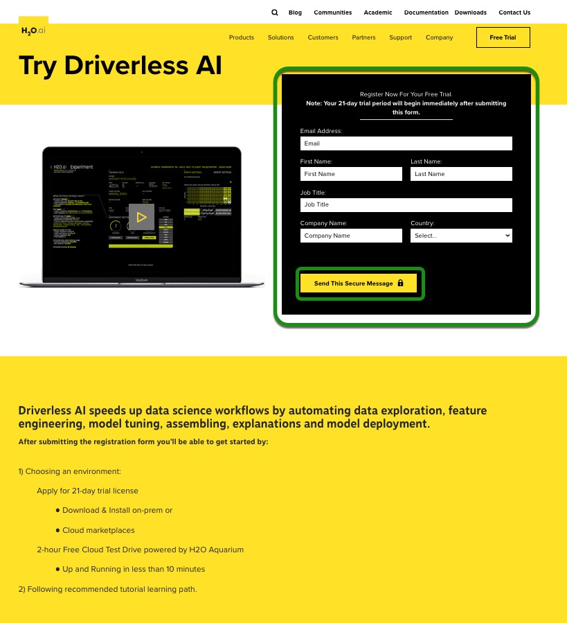
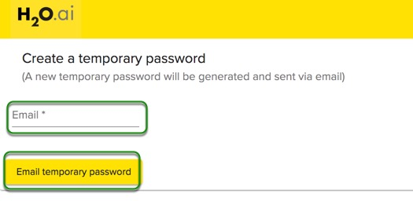

# Comecando com Driverless AI Test Drive

## Outline

- [Test Drive do Driverless AI ](#test-drive-do-driverless-ai)
- [Como obter acesso à sessão de duas horas do Test Drive](#como-obtener-accesso-a-sessao-de-duas-horas-do-test-drive)
- [Como criar uma conta no Aquarium ](#como-criar-uma-conta-no-aquarium)
- [Como fazer o seu login](#como-fazer-o-seu-login)
- [Reconfigurar senha](#reconfigurar-senha)
- [Como iniciar e finalizar uma sessão no Test Drive](#como-iniciar-e-finalizar-uma-sessão-no-test-drive)
- [Logout](#logout)
- [Perguntas](#perguntas)

## Test Drive do Driverless AI 

O Test Drive é uma sessão de duas horas, disponível em um ambiente de teste na nuvem da H2O.ai (Aquarium), que fornece acesso à diversas ferramentas para workshops, conferências e treinamentos.  

**Cada um dos “labs” possui uma duração específica para ser completado e todos serão encerrados após duas horas**. Nenhum trabalho será salvo. No entanto, você pode refazer o laboratório várias vezes.. 

Depois de ser registrar na [Try Driverless AI pagina](https://www.h2o.ai/try-driverless-ai/) você terá duas opções:

- **21 Day Free Trial**: Se você deseja continuar explorando a IA sem driver do H2O e executando seus experimentos em um ambiente controlado, onde seus dados serão salvos, você pode aproveitar um ambiente no local ou na nuvem com uma licença de período de avaliação de 21 dias.

-  **2 Hour Test Drive**: Explore Driverless AI em intervalos de duas horas com os tutoriais guiados da Driverless AI.

## Como obter acesso à sessão de duas horas do Test Drive 

1\. Selecione **Free trial** no canto superior direito da homepage da [H2O.ai](https://www.h2o.ai/) ou [Tente Driveless AI aqui](https://www.h2o.ai/try-driverless-ai/).
 
2\. Um formulário como o abaixo irá aparecer. Preencha o formulário de solicitação para os **21 dias de free trial** e selecione **Send this secure messag**.

3\. Após enviar o formulário, algumas opçōes irão aparecer. Pairar sobre **2-Hour Interval Test Drive**:

 
Selecione **Test Drive**:

4\. Essa etapa ira levá-lo para a página de login, onde você deverá criar uma conta.

## Como criar uma conta no Aquarium 

1\. Seja bem-vindo à página de login do Aquarium! 

2\. Selecione **Create a new account** (Criar uma nova conta)

3\. Preencha as seguintes informações:

 - First Name (Primeiro nome)
 - Last Name (Sobrenombre)
 - Organization (Organização)
 - Country (Pais)
 - Email

4\. Clique em **Create account and email temporary password** (crie uma conta e senha de email temporária) no rodapé da página.

**Note**: Uma senha será enviada para o seu email em alguns minutos.

5\. Confira o seu email para recebimento da senha. 

## Como fazer o seu login

1\. Insira o email que utilizou para criar a sua senha no Aquarium.

2\. Insira a senha que recebeu por email do Aquarium.

3\. Clique em **Login**.

## Reconfigurar senha 

1\. Se você esquecer a sua senha, selecione **I forgot my password** (esqueci minha senha).

2\. Preencha o seu endereço de email e uma nova senha será enviada para o seu email. 

## Como iniciar e finalizar uma sessão no Test Drive 

Após realizar o seu login, o ambiente de teste do Driverless AI (lab) irá aparecer:

**A nota**: 

- A sessão tem duração de 120 minutos. Após esse período, a mesma será finalizada.
- Confira o conjunto completo de [Driverless AI Tutorials](https://h2oai.github.io/tutorials/) (Tutoriais de Driverless AI)
- Poste preguntas na [Driverless AI Community](https://www.h2o.ai/community/home) (Comunidade do Driverless AI).
- Clique **Start** para iniciar a sessão.

1\. Para iniciar a sessão, clique em **Start Lab**. Você verá uma imagem parecida com a abaixo: 

2\.  O Aquarium irá iniciar a sua sessão (isso poderá levar alguns minutos). Após iniciada, uma imagem parecida com a abaixo deverá aparecer: 

**A nota**:

 - O tempo restante para o uso da instância
 - URL de Driverless AI
 - End Lab (Laboratorio final)

3\. Após o início do laboratório, um URL de AI sem driver será exibido na parte da página. Clique nesse URL. Isso o levará à página de conjuntos de dados de AI sem driver H2O.ai.

## Logout

1\. Para deslogar, clique no topo do canto direito da página e selecione "Logout"

 

## Perguntas

Tem perguntas sobre o Aquarium? Cadastre-se na comunidade do Slack da H2O.ai e mande as suas perguntas no canal #cloud. Integrantes da comunidade da H2O irão respondê-lo assim que estiverem disponíveis. 

- [Faça parte da nossa comunidade do Slack e envie perguntas para o canal #cloud](https://h2oai-community.slack.com/)

