# Automatic Machine Learning Introduction with Driverless AI

## Outline

- [Objective](#objective)
- [Prerequisites](#prerequisites)
- [Task 1: Product Tour](#task-1-product-tour)
- [Task 2: Automatic Machine Learning Concepts](#task-2-automatic-machine-learning-concepts)
- [Task 3: Load Data](#task-3-load-data)
- [Task 4: Explore Data Details and AutoViz](#task-4-explore-data-details-and-autoviz)
- [Task 5: Launch First Experiment](#task-5-launch-first-experiment)
- [Task 6: Explore Feature Engineering](#task-6-explore-feature-engineering)
- [Task 7: Explore Experiment Results](#task-7-explore-experiment-results)
- [Task 8: MLI Report for Non-Time-Series](#task-8-mli-report-for-non-time-series)
- [Task 9: Experiment Summary and Autoreport](#task-9-experiment-summary-and-autoreport)
- [Next Steps](#next-steps)
- [Appendix: Project Workspace](#appendix-project-workspace)

## Objective

For this tutorial, we will explore the Titanic dataset from the perspective of a passenger life insurance company while using and learning about [H2O.ai's](https://www.h2o.ai/) enterprise product, [Driverless AI](https://www.h2o.ai/products/h2o-driverless-ai/). We will explore possible risk factors derived from this dataset that could have been considered when selling passenger insurances. More specifically, we will create a predictive model to determine what factors contributed to a passenger surviving.

In part, this tutorial will also be an overview of Driverless AI. You will learn how to load data, explore data details, generate Auto visualizations, launch an experiment, explore feature engineering, view experiment results. As well, we will go through a quick tour of the Machine Learning Interpretability report that you can generate right after an experiment is complete. 

**Note**: This tutorial has been built on Aquarium, which is H2O.ai's cloud environment providing software access for workshops, conferences, and training. The labs in Aquarium have datasets, experiments, projects, and other content preloaded. If you use your version of Driverless AI, you will not see the preloaded content.

## Prerequisites

- Basic knowledge of Machine Learning and Statistics

- A **Two-Hour Test Drive session**: Test Drive is H2O.ai's Driverless AI on the AWS Cloud. No need to download software. Explore all the features and benefits of the H2O Automatic Learning Platform.

  - Need a **Two-Hour Test Drive** session? Follow the instructions [on this quick tutorial](https://training.h2o.ai/products/tutorial-0-getting-started-with-driverless-ai-test-drive) to get a Test Drive session started. After the Driverless AI Test Drive session starts, continue reading the remaining prerequisites of this tutorial, then start **Task 1: Product Tour**.

  - Already have a **Two-Hour Test Drive** session? Proceed to **Task 1: Product Tour**.

**Note:  Aquarium’s Driverless AI Test Drive lab has a license key built-in, so you don’t need to request one to use it. Each Driverless AI Test Drive instance will be available to you for two hours, after which it will terminate. No work will be saved. If you need more time to further explore Driverless AI, you can always launch another Test Drive instance or reach out to our sales team via the [contact us form](https://www.h2o.ai/company/contact/).**


## Task 1: Product Tour

Welcome to the Driverless AI **Datasets** page(this will be the first thing you will see when you click your **Driverless AI URL**): 


On the **Datasets** page, the following options and features can be found. Now, we will quickly review them, but we will further explore these options and features before and after we launch an experiment in the upcoming tasks. 

1. In the **Projects** section, you can manage your datasets and experiments related to a specific business problem or use case.

2. In the **Datasets** section, you can view current datasets that have been added. Other dataset features include the option to get dataset details, visualize, split, predict, rename, download, and delete. 

3. **Autoviz** shows graphs explaining the selected dataset to visualize. Note that the graphs on the visualization page can vary based on the information in your dataset. You can also view and download logs that Driverless AI generated during the visualization.

4. In the **Experiments** section, you can view completed experiments. Experiments can be revised or deleted.

5. In the **Diagnostics** section, you can diagnose a model and view model performance for multiple scorers based on the existing model and dataset.

6. In the **MLI (Machine Learning Interpretability)** section, you can interpret a model and view a list of already interpreted models.

7. The **Deployments** section allows you to access the MOJO and Python scoring pipelines for you to test or integrate into a final product. You can also deploy locally or in the cloud.

8. The **Resources** dropdown menu provides you with the following options to view or download: 

    - System Info
    - Python Client 
    - R Client 
    - MOJO2 Java Runtime
    - MOJO2 Py Runtime 
    - MOJO 2 R Runtime
    - Tutorials 
    - Help
    - About 

9. The **User** option offers the following options:

    - **Messages[ ]**: View upcoming events regardinging Driverless AI.
    -  **Logout**: Logs you out of your current session.

10. **<**: Takes you back to the previous page.

11. **H2O.ai**: Takes you back to the H2OAI **Datasets** page.

12. **Driverless AI 1.X.X**: Version of Driverless AI 

13. The **+ Add a Dataset(or Drag and Drop)** button provides the following options: 

    - *File System*: Search for datasets in our repository 
    - *Upload File*: Upload a dataset from your computer 
    - *Amazon S3*: Upload a dataset by using S3 buckets
    - *Hadoop File System*: Upload a dataset from Hadoop 
    - *Data Recipe URL*: Upload a dataset with a customize data recipe reachable through a URL
    - *Upload Data Recipe*: Upload a dataset with a customize data recipe located on your computer 

14. **Type value to search for or date, e,g, 15/09:** Search for a given dataset by inputting its creation date.


Before we load the dataset for our experiment, let us review some introductory concepts around Machine Learning. 

### Deeper Dive and Resources

-  [Join the H2O community](https://www.h2o.ai/community/home). Post your questions, discuss use cases, give feedback, stay informed about the latest H2O.ai updates, and more.
- Learn more are about H2O Driverless through the [H2O documentation](http://docs.h2o.ai/driverless-ai/latest-stable/docs/booklets/DriverlessAIBooklet.pdf).
- [Explore H2O Product Documentation](http://docs.h2o.ai/)
- [Learn more H2O Driverless by reviewing the FAQs](http://docs.h2o.ai/driverless-ai/latest-stable/docs/userguide/faq.html) 

## Task 2: Automatic Machine Learning Concepts

###  Artificial Intelligence and Machine Learning

The concepts found in this section are meant to provide a high-level overview of Machine Learning. At the end of this section, you can find links to resources that offer a more in-depth explanation of the concepts covered here.

Machine learning is a subset of Artificial intelligence where the focus is to create machines that can simulate human intelligence. One critical distinction between artificial intelligence and machine learning is that machine learning models "learn" from the data the models get exposed to. Arthur Samuel, a machine learning pioneer back in 1959, defined machine learning as a " field of study that gives computers the ability to learn without being explicitly programmed" [1]. A machine learning algorithm trains on a dataset to make predictions. These predictions are, at times, used to optimize a system or assist with decision-making.

### Machine Learning Training

Advances in technology have made it easier for data to be collected and made available. The available type of data will determine the kind of training that the machine learning model can undergo. There are two types of machine learning training, supervised and unsupervised learning. Supervised learning is when the dataset contains the output that you are trying to predict. For those cases where the predicting variable is not present, it's called unsupervised learning. Both types of training define the relationship between input and output variables.

In machine learning, the input variables are called **features** and the output variables **labels**. The labels, in this case, are what we are trying to predict. The goal is to take the inputs/variables/features and use them to come up with predictions on never-before-seen data. In linear regression, the features are the x-variables, and the labels are the y-variables. An example of a label could be the future price of avocados. In terms of feature examples regarding this tutorial, in Task 3, we will see the following features when creating our survival prediction model: passenger class, sex, age, passenger fare, cabin number, etc. 

A machine learning model defines the relationship between features and labels. Anyone can train a model by feeding it examples of particular instances of data. You can have two types of examples: labeled and unlabeled. Labeled examples are those where the X and Y values (features, labels) are known. Unlabeled examples are those where we know the X value, but we don't know the Y value[1]. Your dataset is similar to an example; the columns that will be used for training are the features; the rows are the instances of those features. The column that you want to predict is the label.

Supervised learning takes labeled examples and allows a model that is being trained to learn the relationship between features and labels. The trained model can then be used on unlabelled data to predict the missing Y value. The model can be tested with either labeled or unlabeled data. Note that H2O Driverless AI creates models with labeled examples.

### Data Preparation 

A machine learning model is as good as the data that is used to train it. If you use garbage data to train your model, you will get a garbage model. With that said, before uploading a dataset into tools that will assist you with building your machine learning model, such as Driverless AI, ensure that the dataset has been cleaned and prepared for training. Transforming raw data into another format, which is more appropriate and valuable for analytics, is called data wrangling. 

Data wrangling can include extractions, parsing, joining, standardizing, augmenting, cleansing, and consolidating until the missing data is fixed or removed. Data preparation includes the dataset being in the correct format for what you are trying to do; accordingly, duplicates are removed, missing data is fixed or removed, and finally, categorial values are transformed or encoded to a numerical type. Tools like [Python datatable](https://datatable.readthedocs.io/en/latest/?badge=latest), [Pandas](https://pandas.pydata.org/) and [R](https://www.r-project.org/) are great assets for data wrangling. 

 Data wrangling can be done in Driverless AI via a [data recipe](https://www.r-project.org/), the [JDBC connector](http://docs.h2o.ai/driverless-ai/1-8-lts/docs/userguide/connectors-nd/jdbc.html?highlight=jdbc) or through [live code](http://docs.h2o.ai/driverless-ai/1-8-lts/docs/userguide/datasets-describing.html?highlight=live%20code#modify-by-recipe) which will create a new dataset by modifying the existing one. 

 
### Data Transformation/Feature Engineering

Data transformation or feature engineering is the process of creating new features from the existing ones. Proper data transformations on a dataset can include scaling, decomposition, and aggregation [2]. Some data transformations include looking at all the features and identifying which features can be combined to make new ones that will be more useful to the model's performance. For categorical features, the recommendation is for classes that have few observations to be grouped to reduce the likelihood of the model overfitting. Categorical features may be converted to numerical representations since many algorithms cannot handle categorical features directly. Besides, data transformation removes features that are not used or are redundant[3]. These are only a few suggestions when approaching feature engineering. Feature engineering is very time-consuming due to its repetitive nature; it can also be costly. After successfully or having a notion of well-done data transformation, the next step in creating a model is selecting an algorithm.

### Algorithm Selection

“Machine learning algorithms are described as learning a target function (f) that best maps input variables (x) to an output variable(y): Y= f(x)” [4]. In supervised learning, there are many algorithms to select from for training. The type of algorithm(s) will depend on the size of your data set, structure, and the type of problem you are trying to solve.  Through trial and error, the best performing algorithms can be found for your dataset. Some of those algorithms include linear regression, regression trees, random forests, Naive Bayes, and boosting, to name a few [5]. 

### Model Training

**Datasets** 

When training a machine learning model, one good practice is to split up your dataset into subsets: training, validation, and testing sets. A good ratio for the entire dataset is 70-15-15, 70% of the whole dataset for training, 15% for validation, and the remaining 15% for testing. The **training set** is the data used to train the model, and it needs to be big enough to get significant results from it. The **validation set** is the data held back from the training and will be used to evaluate and adjust the trained model's hyperparameters and, hence, adjust the performance. Finally, the **test set** is data that has also been held back and will be used to confirm the final model's results [1].

**Note**: The validation dataset is used for tuning the modeling pipeline. If provided, the entire training data will be used for training, and validation of the modeling pipeline is performed with only this validation dataset. When you do not include a validation dataset, Driverless AI will do K-fold cross-validation for I.I.D. (identically and independently distributed)  experiments and multiple rolling window validation splits for time series experiments. For this reason, it is not generally recommended to include a validation dataset as you are then validating on only a single dataset. Please note that time series experiments cannot be used with a validation dataset: including a validation dataset will disable the ability to select a time column and vice versa.

This dataset must have the same number of columns (and column types) as the training dataset. Also, note that if provided, the validation set is not sampled down, so it can lead to large memory usage, even if accuracy=1 (which reduces the train size). In a moment, we will learn more about **accuracy** when preparing an experiment.[10] 


Another part of model training is fitting and tuning the models. For fitting and tuning, hyperparameters need to be tuned, and cross-validation needs to take place using only the training data. Various hyperparameter values will need to be tested. "A hyperparameter is a parameter that is set before the learning process begins. These parameters are tunable and can directly affect how well a model trains. [In Machine Learning, a hyperparameter is the learning rate]" [7]. In other words, the hyperparameter value is used to determine the rate at which the model learns.  

With cross-validation, the whole dataset is utilized, and each model is trained on a different subset of the training data [8]. Additionally, a cross-validation loop will be set to calculate the cross-validation score for each set of hyperparameters for each algorithm. Based on the cross-validation score and hyperparameter values, you can select the model for each algorithm that has been tuned with training data and tested with your test set. Remember that "a model in [Machine Learning(ML)] is the output of an ML algorithm run on data. It represents what was learned by a machine learning algorithm." [9] 

### What are the challenges in AI Model Development?

One of the significant challenges in developing a single production-ready model is that it can take weeks or months to build it. Developing a model involves feature engineering, model building, and model deployment. All tasks are very repetitive, time-consuming, require advanced knowledge of feature generation, algorithms, parameters, and model deployment. Finally, there needs to be in-depth knowledge and confidence in how the model was generated to justify how it made its decisions.


### What is Automated Machine Learning, and why is it important?

AutoML or Automated Machine Learning is the process of automating algorithm selection, feature generation, hyperparameter tuning, iterative modeling, and model assessment. AutoML tools such as H2O Driverless AI makes it easy to train and evaluate machine learning models. Automating the repetitive tasks around Machine Learning development allow individuals to focus on the data and the business problems they are trying to solve. 

With this task in mind, let's explore and load the data that we will be using when predicting whether a passenger will survive the titanic accident. 

### References
- [1] [Google’s Machine Learning Crash Course](https://developers.google.com/machine-learning/crash-course/training-and-test-sets/splitting-data)
- [2] [About Train, Validation and Test Sets in Machine Learning](https://towardsdatascience.com/train-validation-and-test-sets-72cb40cba9e7)
- [3] [Data Science Primer - Data Cleaning](https://elitedatascience.com/data-cleaning)
- [4] [Feature Engineering](https://elitedatascience.com/feature-engineering) 
- [5] [Towards Data Science- Supervised vs Unsupervised Learning](https://towardsdatascience.com/supervised-vs-unsupervised-learning-14f68e32ea8d) 
- [6] [Selecting the best Machine Learning Algorithm for your regression problem](https://towardsdatascience.com/selecting-the-best-machine-learning-algorithm-for-your-regression-problem-20c330bad4ef)
- [7] [Deep AI - What is a hyperparameter?](https://deepai.org/machine-learning-glossary-and-terms/hyperparameter)
- [8] [H2O.ai's Driverless AI - Internal Validation Technique](http://docs.h2o.ai/driverless-ai/1-8-lts/docs/userguide/internal-validation.html?highlight=cross%20validation)
- [10][Validation Dataset](http://docs.h2o.ai/driverless-ai/latest-stable/docs/userguide/experiment-settings.html#validation-dataset)

### Deeper Dive and Resources

- [Explore the replays from H2O World Around the World](
https://www.h2o.ai/h2oworldnewyork/) 
- [Explore the Webinar Replays](
https://www.brighttalk.com/search/?q=driverless+ai) 
- [Explore the various H2O Driverless AI playlists on YouTube](https://www.youtube.com/user/0xdata/playlists) 


## Task 3: Load Data

### What is the Driverless AI Workflow?

The typical Driverless AI workflow is to:

1. Load data
2. Visualize data
3. Run an experiment
4. Interpret the model
5. Deploy the scoring pipeline

Besides, you can diagnose a model, transform another dataset, score the model against another dataset and manage your data in Projects. This tutorial's focus will be on steps 1 - 4. We will cover Driverless AI's other aspects in other tutorials found in the Driverless AI learning path. We will start with loading the data. 


### About the Dataset

The dataset used for this experiment is a version of the Titanic Kaggle dataset. This dataset contains the list of estimated passengers aboard the RMS Titanic.

The RMS Titanic was a British commercial passenger liner that sank after colliding with an iceberg in the North Atlantic Ocean on April 15, 1912. More than 1,500 people lost their lives from an estimated 2,224 passengers and crew members while on their way to New York City from Southampton. 

This tragedy shocked the international community and led to better safety regulations for ships. The lack of lifeboats, amongst other things, was one of the factors that resulted in a significant loss of life. Although there was some element of luck involved in surviving the sinking, some groups of people were more likely to survive than others.

<p align="center"> 
    </img>    
    <p align="center">Figure 1. RMS Titanic</p>
</p>

To further understand the data, please consider the table below:

|Attribute|Definition|Key|
|---|---|---|
|passenger Id|Id randomly generated| - |
|pclass|Passenger Class| 1= 1st, 2 =2nd, 3=3rd|
|survived|Survival| 0=No, 1=Yes|
|name_with_salutations|Passenger name| - |
|name_without_salutations|Passenger name without salutations| - |
|sex|Sex|Female, Male|
|age|Age in years| - |
|sibsp|Number of siblings/Spouse aboard| - |
|parch|Number of Parents/Children aboard| - |
|ticket|Ticket number| - |
|fare|Passenger fare| - |
|cabin|Cabin number| - |
|embarked|Port of Embarkment|C = Cherbourg, Q = Queenstown, S = Southampton|
|boat|Boat number| - |
|body|Body number| - |
|home.des|Home Destination| - |

Now, navigate back to the H2O Driverless AI **Datasets** page. To add the dataset:

1\. Click on **Add a Dataset(or Drag and Drop)**  

2\. Select **FILE SYSTEM**:

<p align="center">

</p>


3\. Inside the **FILE SYSTEM**:

1. Enter the following in the search bar:```/data/TestDrive/titanic.csv``` 
2. Select the ```titanic.csv``` 
3. **Click to Import Selection**:

    

4\. The following will appear after the dataset is successfully imported:

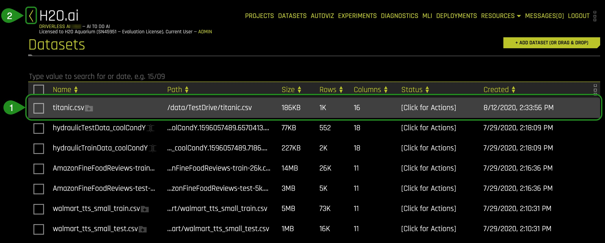

1. You can view:
    - File name
    - File path
    - File size
    - Number of rows/columns 
    - File status
    - Date created

Now that the dataset has been imported let's discover on the next task how Driverless AI allows users to further understand a selected dataset. 

### Deeper Dive and Resources

- [Learn More About the Type of Dataset File Formats that can be Uploaded](http://docs.h2o.ai/driverless-ai/latest-stable/docs/userguide/datasets.html#adding-datasets) 
- For more datasets, check out [Kaggle Datasets](https://www.kaggle.com/datasets)

## Task 4: Explore Data Details and AutoViz

### Details

We are now going to explore the Titanic dataset that we just loaded. 

1\. On the **Dataset Overview page**, click on the *titanic.csv*. The following options will appear:


1. The dataset we imported in task 3

2. Options:
    - **Details** - View a summary of the dataset or preview the dataset
    - **Visualize** - Visualize the dataset with available graphs
    - **Split** - Split the dataset
    - **Predict** - Run an experiment using Driverless AI
    - **Rename** - Rename the dataset
    - **Download** - Download the dataset
    - **Display Logs** - Dataset logs
    - **Delete** - Delete the dataset 

**Note**: A dataset can only be deleted if it's not being used in an experiment. Otherwise, you must delete the experiment first, and then the dataset.

2\. Next, we are going to confirm that the dataset loaded correctly and that it has the correct number of rows and columns.

3\. Click the **Details** option, and it will take you to the **Dataset Details Page**:
 


1. The **Dataset Details Page** provides a summary of the dataset. 

    - View the first 20 rows of a column by hovering over the column name (see image below)


<p align="center">

</p>

- **Note**: Driverless AI recognizes the following column types: integer, string, real, boolean, and time. Date columns are given a string "str" type.

2. You can view information for a specific column by entering the column's name in the field above the graph.

3. The **Dataset Actions** button provides the following options: 

    - Visualize 
    - Split
    - Predict
    - Rename
    - Download 
    - Display Logs
    - Delete

4. **Modify by Recipe** allows you to create a new dataset by modifying an existing dataset with custom recipes. 

5. **Dataset Rows** allows you to preview the dataset.

6. Option to exit and return to the H2O **Datasets** page.

7. **Feature Props:** Allows you to change the column's logical type. If you were to change a given column, you could do so by following these steps:

    * Click **Auto-detect**:

        

    
    * Select **Feature Engineering Type(s):** 

        

    * Select column feature engineering types (then click **done** at the bottom of page):

        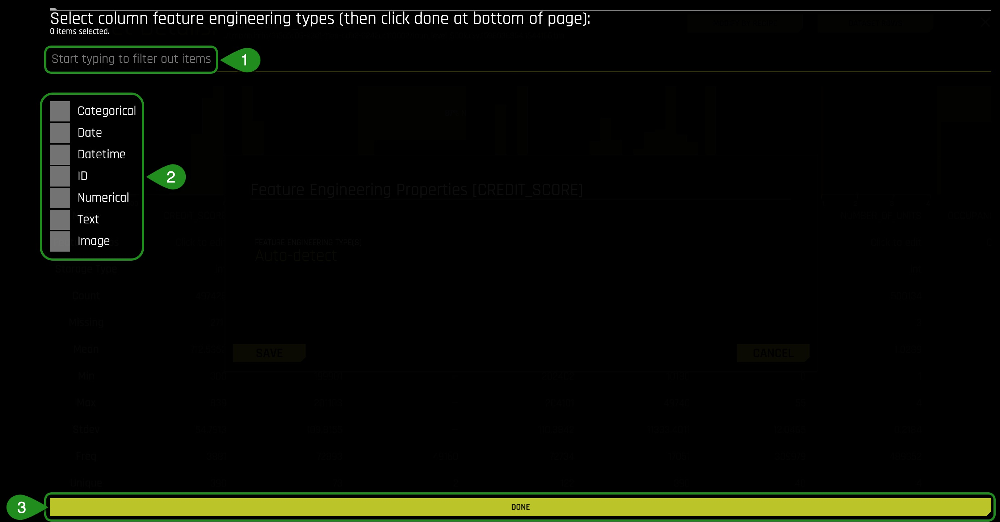

        1. Start typing to filter out items

        2. Available feature engineering types
        
        3. **Done** button

4\. To continue learning about what details are available, click on the following button: **Dataset Rows**. The following will appear: 


1. Preview the dataset 
2. View the remaining rows
3. Dataset actions (same options as discuss earlier)
4. **Modify by Recipe** - Modify the dataset through a custom recipe or live code (manually enter custom recipe code to use to modify the dataset)
5. Return to the **Dataset Overview** 
6. Option to Exit and return to the H2O **Datasets** page

5\. Exit and return to **Datasets** page.

### Split the Dataset

From the Titanic.csv dataset, we are going to create two datasets, *training* and *test*. 75% of the data will be used to train the model, and the other 25% will be used to test the trained model.

1\. Click on the *titanic.csv* file and select **Split** 


2\. Split the data into two sets: ```titanic_train``` and ```titanic_test```, then save the changes. Use the image below as a guide: 


*Things to Note:*

1. For OUTPUT NAME 1: enter ```titanic_train``` (this will serve as the training set)
2. For OUTPUT NAME 2: enter ```titanic_test``` (this will serve as the test set)
3. You can change the Random Seed; this will generate the same split every time
4. Change the split value to .75 by adjusting the slider to 75% or entering .75 in the section that says *Train/Valid Split Ratio*
5. Save the changes you made 

The split ratio of .75 (75% for the training set and 25% fo the test set) was selected for this particular dataset to not generalize the model given the total size of the set.

**The training set** contains 981 rows, each row representing a passenger, and 16 columns representing the attributes of each passenger.

**The Test set** contains 328 rows, each row representing a passenger, and 16 attribute columns representing attributes of each passenger. 

Verify that the three Titanic datasets, titanic_test, titanic_train and titanic.csv are there:


### Autoviz

Now that the titanic.csv dataset has been split, we will use the **titanic_train** set for the remaining of the tutorial.

There are two ways to visualize the training set:

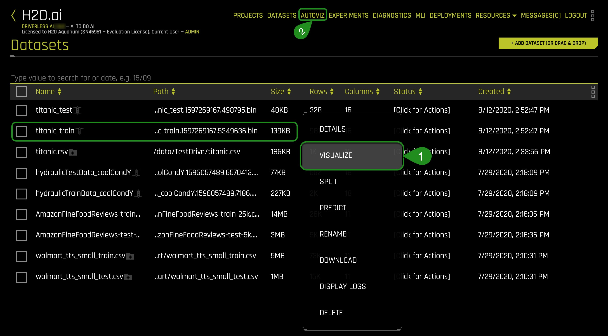

**Method 1** : Clicking on the **titanic_train** file, select **Visualize**, then click on the visualization file generated.

**Method 2**: Clicking on  **Autoviz** located at the top of the UI page, where you will be asked for the dataset you want to visualize.

1\. Pick a method to visualize the **titanic_train** dataset. A similar image should appear:


Click on the **titanic_train** visualization, and the following screen will appear.


Is it possible to visualize how variables on the training set are correlated? Can we determine what other variables are strongly correlated to a passenger's survival? The answer to those questions is yes! One of the graphs that allow us to visualize the correlations between variables is the **Correlation Graph**.

Let's explore the correlation between the 'survived' variable and other variables in the dataset.

2\. Select the **Correlation Graph** and then click on **Help** located at the lower-left corner of the graph. 

3\. Take a minute to read about how the correlation graph was constructed.  Learn more about how variables are color-coded to show their correlations. 

4\. Take the 'survived' variable and drag it slightly to have a better look at the other variables Driverless AI found it is correlated to. 

What variables are strongly correlated with the 'survived' variable?


*Things to Note:*

 - The **Help** button explains the **Correlation Graph**. This feature is available for all graphs.
 - **Download** allows for a full-scale image of the graph to be downloaded

5\. Exit out of the **Correlation Graph** view by clicking on the **X** at the top-right corner of the graph.

6\. After you are done exploring the other graphs, go back to the **datasets page**.

Driverless AI  shows the graphs that are "relevant" aspects of the data. The following are the type of graphs available:

- Correlated Scatterplots
- Spikey Histograms
- Skewed Histograms
- Varying Boxplots
- Heteroscedastic Boxplots
- Biplots
- Outliers
- Correlation Graph
- Parallel Coordinates Plot
- Radar Plot
- Data Heatmap
- Missing Values Heatmap
- Gaps Histogram


### Refeences 

- [Figure 1. RMS Titanic](https://en.wikipedia.org/wiki/RMS_Titanic#/media/File:RMS_Titanic_3.jpg)
### Deeper Dive and Resources

- [Learn more about Automatic Visualization from the H2O Driverless AIdocs](http://docs.h2o.ai/driverless-ai/latest-stable/docs/userguide/datasets.html#visualizing-datasets)

- [Learn more about Automatic Visualization from the architect Leland Wilkinson, Chief Scientist, H2O.ai from session at H2O World 2017 Youtube Video](https://www.youtube.com/watch?v=bas3-Ue2qxc)

- [H2O.ai Automatic Visualization by Leland Wikinson (SlideShare)](https://www.slideshare.net/0xdata/automatic-visualization)

## Task 5: Launch First Experiment

We are going to launch our first experiment. An experiment means that we are going to generate a prediction using a dataset of our choice.

1\. Return to  the **Dataset Overview page**

2\. Click on the **titanic_train** dataset then select **Predict**


If this is your first time launching an experiment, the following prompt will appear, asking if you want to take a tour.  


If you would like to take a quick tour of the **Experiments** page, select **YES**, the quick tour will cover the following items:

- Select the training dataset 
- Select the target column that you want Driverless AI to predict from all columns
- Select if it is a Time Series problem or not [Time Series ON or OFF]

3\. Select **Not Now** to come back and take the tour at another time.

4\. The following  **Experiment** page will appear:

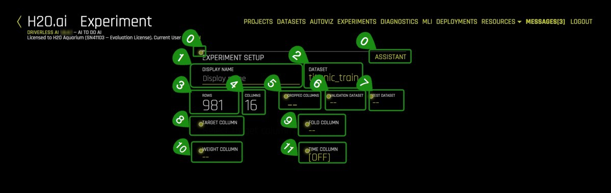

*Things to Note:*

0. Assistant - Interactive tour for first-time users. 
Click on  **assistant** to enable it. Yellow circles appear around selected sections of the experiment setup page. You can hover any of them to get more info on each section. 

Note: To disable **assistant**, click on assistant again.


 
1. **Display Name** - Optional: Specify a display name for the new experiment. There are no character or length restrictions for naming. If this field is left blank, Driverless AI will automatically generate a name for the experiment.
2. **Dataset** - The name of the dataset being used to create an experiment
3. **Rows** - Total number of rows 
4. **Columns** - Total number of columns 
5. **Dropped Columns** - Drop column(s) from your dataset that you don't want to use in the experiment. For more information see the H2O.ai documentation [here](http://docs.h2o.ai/driverless-ai/1-8-lts/docs/userguide/experiment-settings.html?highlight=accuracy#dropped-columns).
6. **Validation Dataset** - Select the dataset you want to validate. This set will be used to validate parameters like models, features, etc. For more information see the H2O.ai documentation [here](http://docs.h2o.ai/driverless-ai/1-8-lts/docs/userguide/experiment-settings.html?highlight=accuracy#validation-dataset).
7. **Test Dataset** - The dataset that will be used to test the model generated from the training dataset. It's not used during training of the model, and results are available at the end of the experiment.For more information see the H2O.ai documentation [here](http://docs.h2o.ai/driverless-ai/1-8-lts/docs/userguide/experiment-settings.html?highlight=accuracy#test-dataset).
8. **Target column** -  What do you want to predict? 
9. **Fold column** - The fold column is used to create the training and validation datasets so that all rows with the same Fold value will be in the same dataset. This column will be used if no validation dataset is provided and the model is trained using cross validation. For more information see the H2O.ai documentation [here](http://docs.h2o.ai/driverless-ai/1-8-lts/docs/userguide/experiment-settings.html?highlight=accuracy#fold-column).
10. **Weight column** - Column that indicates the observation/isntance weight (a.k.a. sample or row weight), if applicable. For more information see the H2O.ai documentation [here](http://docs.h2o.ai/driverless-ai/1-8-lts/docs/userguide/experiment-settings.html?highlight=accuracy#weight-column).
11. **Time Column**(OFF by default) - Provides a time order(timestamps for observations). Used when data has a high dependency on time (such as seasonality or trend), and you want to treat this problem as a time series problem. For more information see the H2O.ai documentation [here](http://docs.h2o.ai/driverless-ai/1-8-lts/docs/userguide/experiment-settings.html?highlight=accuracy#time-column).

Continuing with our experiment:

Name your experiment as follows : `Titanic Classification Tutorial`

5\. Click **Dropped Columns**, drop the the following columns: Passenger_Id, name_with_salutations, name_without_salutations, boat, body and home.dest. Then select **Done**. 


These attributes (columns) were removed to create a cleaner dataset. Attributes such as boat and body are excluded because they are clear indicators that a passenger survived and can lead to data leakage. For our experiment, the survived column will suffice to create a model. 

A clean dataset is essential for the creation of a good predictive model. The process of data cleansing needs to be done with all datasets to rid the set of any unwanted observations, structural errors, unwanted outliers, or missing data. 

6\. Select **Test Dataset** and then click on ```titanic_test```

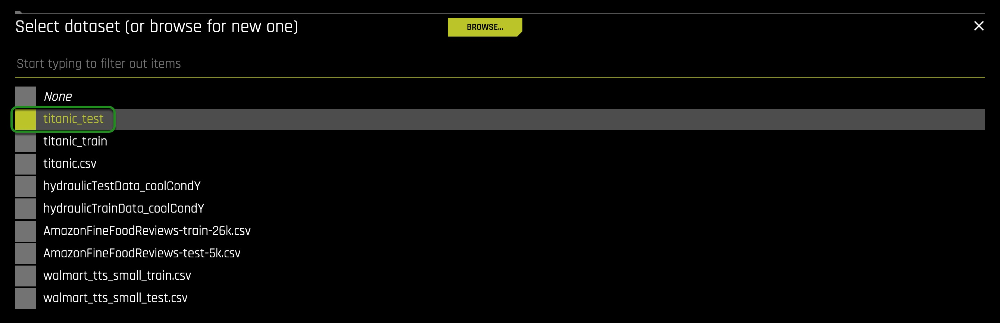

7\. Now select the **Target Column**. In our case, the column will be 'survived.'

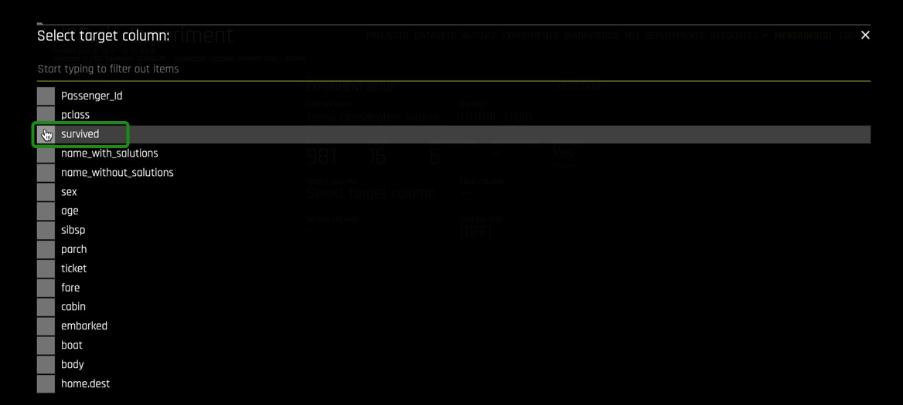

The survived attribute was selected because, as an insurance company, we want to know what other attributes can contribute to the survival of passengers aboard a ship and incorporate that into our insurance rates.

8\. Your experiment page should look similar to the one below; these are the system suggestions:


*Things to Note:*

1. **Training Settings** - Describes the Accuracy, Time, and Interpretability of your specific experiment.  The knobs on the experiment settings are adjustable as values change the meaning of the settings on the left-bottom page change.
    - **Accuracy** - As accuracy increases, Driverless AI gradually adjusts the method for performing the evolution and ensemble. At low accuracy, Driverless AI varies features and models, but they all compete evenly against each other. At higher accuracy, each independent main model will evolve independently and be part of the final ensemble as an ensemble over different main models. At higher accuracies, Driverless AI will evolve+ensemble feature types like Target Encoding on and off that evolve independently. Finally, at highest accuracies, Driverless AI performs both model and feature tracking and ensembles all those variations. Changing this value affects the feature evolution and final pipeline. For more information see the H2O.ai documentation [here](http://docs.h2o.ai/driverless-ai/latest-stable/docs/userguide/experiment-settings.html?highlight=accuracy%20setting#accuracy).

    - **Time** - This specifies the relative time for completing the experiment (i.e., higher settings take longer). Early stopping will take place if the experiment doesn’t improve the score for the specified amount of iterations. For more information see the H2O.ai documentation [here](http://docs.h2o.ai/driverless-ai/1-8-lts/docs/userguide/experiment-settings.html?highlight=accuracy#time).

    - **Interpretability** -  Specify the relative interpretability for this experiment. Higher values favor more interpretable models. Changing the interpretability level affects the feature pre-pruning strategy, monotonicity constraints, and the feature engineering search space. For more information see the H2O.ai documentation [here](http://docs.h2o.ai/driverless-ai/1-8-lts/docs/userguide/experiment-settings.html?highlight=accuracy#interpretability).

2. **Expert Settings** - Available expert settings to customize your experiment. For more information see the H2O.ai documentation [here](http://docs.h2o.ai/driverless-ai/1-8-lts/docs/userguide/expert-settings.html#expert-settings).
3. **Scorer** - Driverless AI selects the best scorer based on your dataset. Other scorers can be manually selected. For more information see the H2O.ai documentation [here](http://docs.h2o.ai/driverless-ai/1-8-lts/docs/userguide/scorers.html). (Explore more about scores in the next tutorial [Machine Learning Experiment Scoring and Analysis Tutorial - Financial Focus](https://training.h2o.ai/products/tutorial-1b-machine-learning-experiment-scoring-and-analysis-tutorial-financial-focus))
4. **Classification/Regression** - Classification or Regression button. Driverless AI automatically determines the problem type based on the target column. Though not recommended, you can override this setting by clicking this button. For more information see the H2O.ai documentation [here](http://docs.h2o.ai/driverless-ai/1-8-lts/docs/userguide/experiment-settings.html?highlight=accuracy#classification-regression-button).
6. **GPUs Enabled** - Specify whether to enable GPUs. (Note that this option is ignored on CPU-only systems). For more information see the H2O.ai documentation [here](http://docs.h2o.ai/driverless-ai/1-8-lts/docs/userguide/experiment-settings.html?highlight=accuracy#enable-gpus).
5. **Reproducible** - This button allows you to build an experiment with a random seed and get reproducible results. If this is disabled (default), the results will vary between runs. For more information see the H2O.ai documentation [here](http://docs.h2o.ai/driverless-ai/1-8-lts/docs/userguide/experiment-settings.html?highlight=accuracy#reproducible).
7. **Launch Experiment** - Launches the experiment
8. **Create Leaderboard:** The Create Leaderboard feature runs multiple diverse experiments that provide an overview of the dataset. This feature also provides you with relevant information for deciding on complexity, accuracy, size, and time tradeoffs when putting models into production. Refer to the Expert Settings topic for information on expert settings that can be used to control this feature. For more information on the default models built for a leaderboard, see [Leaderboard Models](http://docs.h2o.ai/driverless-ai/latest-stable/docs/userguide/leaderboard.html?highlight=create%20leaderboard#leaderboard-models).


9\. Update the following experiment settings so that they match the image below, then select **Launch Experiment**.

- Accuracy: 4
- Time: 2
- Interpretability: 6
- Scorer: AUC


1. Here you can update the experiment settings

2. Click on Launch Experiment; We will be using "Create Leaderboard in other tutorials."

**Note**: To Launch an Experiment: The dataset and the target column are the minimum elements required to launch an experiment.

10\. The **Experiment** page will look similar to the one below after 46% complete:


*Things to Note:*
1. **Experiment Name** - Name of your experiment. If you do not assign a name to it, a random name will be generated. The name can be changed at any time.
2. **Experiment Setup** - Summary of experiment setup and dataset details.
3. **Running Status Display** -Status of the model training process. Experiments can be stopped by clicking the ```Finish``` button.
4. Overview of training settings (unable to adjust while experiment is running): **Training Settings**, **Experiment Settings**, **Scorer**, **Classification**, **Reproducible** and **GPU Enabled**. 
5. **CPU/Memory** information including **Notifications**, **Logs**, **Trace**  and **Scores** info. (Note that Trace is used for development/debugging and to show what the system is doing at that moment.) **Scores** or model scores allow you to view the detailed information about model scores after an experiment is complete. **Scores** includes model and feature tuning leaderboard, single final model cross-validation fold scores, and final ensemble scores.
6. **Iteration Data** and **Variable Importance** - Iteration Data is the internal validation for each cross-validation fold with the specified scorer value. You can hover over any of the iteration points in the Iteration Data graph, and the see the updated variable importance for that iteration on the **Variable Importance**
7. **Classification Problem Graphs** - Toggle between a ROC curve, Precision-Recall graph, Lift chart, Gains chart, and GPU Usage information (if GPUs are available). For regression problems, the lower right section includes a toggle between a Residuals chart, an Actual vs. Predicted chart, and GPU Usage information (if GPUs are available). 
                                                            
Once the experiment is complete, an **Experiment Summary** will appear:

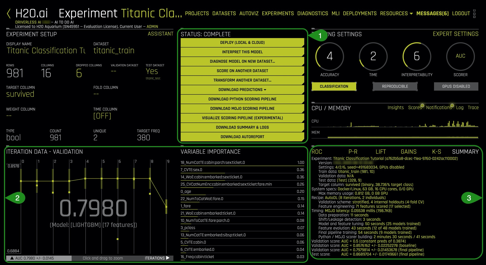

*Things to Note:*
1. **Status Complete Options:**
    - Deploy (Local and Cloud)
    - Interpret This Model 
    - Diagnose Model On New Dataset 
    - Score on Another Dataset
    - Transform Another Dataset
    - Download Predictions
        - Training Predictions
        - Validation Set Predictions (available if a validation set was provided)
        - Test Set Predictions
    - Download Python Scoring Pipeline - A standalone Python Scoring pipeline that downloads a package containing an exported model and Python 3.6 source code examples for productionizing models built using H2O Driverless AI. 
    - Download MOJO Scoring Pipeline - A standalone scoring pipeline that converts experiments to MOJO's, which can be scored in realtime. It is available as either Java runtime or a C++ runtime (with Python and R wrappers).
    - Visualize Scoring Pipeline (Experimental): A visualization of the scoring pipeline is available for each completed experiment.

    

    - Download Experiment Summary - A zip file providing textual explanations of the graphical representations that are shown in the Driverless AI UI.
        - Experiment logs (regular and anonymized)
        - A summary of the experiment
        - The experiment features along with their relative importance
        - Ensemble information
        - An experiment preview
        - Word version of an auto-generated report for the experiment
        - Target transformations tuning leaderboard
        - A tuning leaderboard
 
    - Download Autoreport - This report provides insight into the training data and any detected shifts in distribution, the validation schema selected, model parameter tuning, feature evolution, and the final set of features chosen during the experiment.

2. **Iteration Data** - Validation/Variable Importance - Summary of top 20 - Feature Engineered variables

3. **Experiment Graphs and Summary** - This section describes the dashboard graphs that display for running and completed experiments. These graphs are interactive. Hover over a point on the graph for more details about the point.

### Deeper Dive and Resources

- [Learn more about running Experiments from H2O Driverless AI docs](http://docs.h2o.ai/driverless-ai/latest-stable/docs/userguide/running-experiment.html#)

- [H2O Driverless AI - Explore Documentation on Completed Experiments](http://docs.h2o.ai/driverless-ai/latest-stable/docs/userguide/experiment-completed.html)

- [H2O Driverless AI - Explore Documentation on Visualizing the Scoring Pipeline](http://docs.h2o.ai/driverless-ai/1-8-lts/docs/userguide/scoring_pipeline_visualize.html?highlight=visualize%20scoring%20pipeline)

- [H2O Driverless AI - Explore Documentation on Experiment Summary](http://docs.h2o.ai/driverless-ai/latest-stable/docs/userguide/experiment-summary.html) 

- [Review the Driverless AI Booklet to learn more about running experiments](http://docs.h2o.ai/driverless-ai/latest-stable/docs/booklets/DriverlessAIBooklet.pdf) 


## Task 6: Explore Feature Engineering

Driverless AI performs feature Engineering on the dataset to determine the optimal representation of the data. Various stages of the features appear throughout the iteration of the data. These can be viewed by hovering over points on the "Iteration Data - Validation" Graph and seeing the updates on the **Variable Importance** section.


Transformations in Driverless AI are applied to columns in the data. The transformers create engineered features in experiments. There are many types of transformers, below are just some of the transformers found in our dataset:

1\. Look at some of the variables in **Variable of Importance**. Note that some of the variables start with ```_CVTE``` followed by a column from the dataset. Some other variables might also begin with ```_NumToCatTE```, ```_Freq``` or ```_WoE``` depending on the experiment you run. These are the new, high-value features for our training dataset.

These transformations are created with the following transformers:

- Cross Validation Target Encoding Transformer: ```_CVTargetEncode```
- Weight of Evidence : ```_WoE```
- Frequent Transformer: ```_Freq```  
- Numeric to Categorical Target Encoding Transformer = ```_NumToCatTE```

You can also hover over any of the variables under variable importance to get a simple explanation of the transformer used as seen in the image below:


The complete list of features used in the final model is available in the Experiment Summary artifacts. The Experiment Summary also provides a list of the original features and their estimated feature importance. 

### Deeper Dive and Resources

- [Learn more about H2O Driverless AI Transformations](http://docs.h2o.ai/driverless-ai/latest-stable/docs/userguide/transformations.html) 

- [Feature Engineering for Machine Learning by H2O.ai's Dmitry Larko](https://www.youtube.com/playlist?list=PLrsf4weWJKynQBvh0i-YxDDVqCcIrF28o) 

- [H2O World London 2018 Feature Engineering session replay](https://www.youtube.com/watch?v=d6UMEmeXB6o ) and [slides  by Dmitry](https://www.slideshare.net/0xdata/feature-engineering-in-h2o-driverless-ai-dmitry-larko-h2o-ai-world-london-2018 ) 

## Task 7: Explore Experiment Results

Let’s explore the results of this classification experiment. You can find the results on the **Experiment Summary** at the left-bottom of the **Experiment** page. The resulting plots are insights from the training and validation data resulting from the classification problem. Each plot will be given a brief overview. 

If you are interested in learning more about each plot and the metrics derived from those plots covered in this section, then check out our next tutorial [Machine Learning Experiment Scoring and Analysis Tutorial - Financial Focus](https://training.h2o.ai/products/tutorial-1b-machine-learning-experiment-scoring-and-analysis-tutorial-financial-focus).

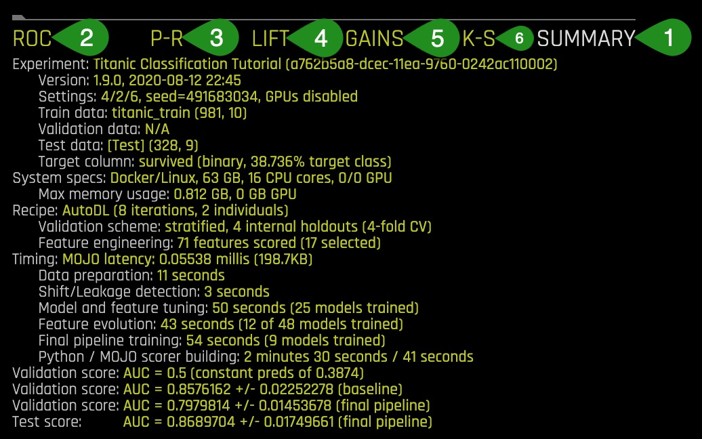

1\. **Summary**

Once the experiment is done, a summary is generated at the bottom-right corner of the **Experiment** page.

The summary includes:

- **Experiment**: experiment name,
  - Version: the version of Driverless AI and the date it was launched
  - Settings: selected experiment settings, seed, whether or not GPU’s are enabled
  - Train data: name of the training set, number of rows and columns
  - Validation data: name of  the validation set, number of rows and columns
  - Test data: name of the test set, number of rows and columns
  - Target column: name of the target column (the type of data and % target class)

- **System Specs**: machine specs including RAM, number of CPU cores and GPU’s
  - Max memory usage  

- **Recipe**: 
  - Validation scheme: type of sampling, number of internal holdouts
  - Feature Engineering: number of features scored and the final selection

- **Timing**
  - Data preparation 
  - Shift/Leakage detection
  - Model and feature tuning: total time for model and feature training and  number of models trained 
  - Feature evolution: total time for feature evolution and number of models trained 
  - Final pipeline training: total time for final pipeline training and the total models trained 
  - Python / MOJO scorer building 
- Validation Score: Log loss score +/- machine epsilon for the baseline
- Validation Score: Log loss score +/- machine epsilon for the final pipeline
- Test Score: Log loss score +/- machine epsilon score for the final pipeline 

Most of the information in the Experiment Summary tab, along with additional details, can be found in the Experiment Summary Report (Yellow Button “Download Experiment Summary”).

1. Find the number of features that were scored for your model and the total features that were selected. 

2. Take a look at the validation Score for the final pipeline and compare that value to the test score. Based on those scores, would you consider this model a good or bad model? 

2\. **ROC - Receiver Operating Characteristics**

This type of graph is called a Receiver Operating Characteristic curve (or ROC curve.) It is a plot of the true positive rate against the false-positive rate for the different possible cutpoints of a diagnostic test.

An ROC curve is a useful tool because it only focuses on how well the model was able to distinguish between classes with the help of the Area Under the Cure or AUC. “AUC’s can help represent the probability that the classifier will rank a randomly selected positive observation higher than a randomly selected negative observation”[1].  However, for models where one of the classes occurs rarely, a high AUC could provide a false sense that the model is correctly predicting the results.  This is where the notion of precision and recall become essential.

The ROC curve below shows Receiver-Operator Characteristics curve stats on validation data along with the best Accuracy, MCC, and F1 values[2].


This ROC gives an Area Under the Curve or AUC of .7980. The AUC tells us that the model is able to separate the survivor class with an accuracy of 79.80%.

Learn more about the ROC Curve on [Machine Learning Experiment Scoring and Analysis Tutorial - Financial Focus: ROC](https://training.h2o.ai/products/tutorial-1b-machine-learning-experiment-scoring-and-analysis-tutorial-financial-focus).

3\. **Prec-Recall: Precision-Recall Graph**

Prec-Recall is a complementary tool to ROC curves, especially when the dataset has a significant skew. The Prec-Recall curve plots the precision or positive predictive value (y-axis) versus sensitivity or true positive rate (x-axis) for every possible classification threshold. At a high level, we can think of precision as a measure of exactness or quality of the results while recall as a measure of completeness or quantity of the results obtained by the model. Prec-Recall measures the relevance of the results obtained by the model.

The Prec-Recall plot below shows the Precision-Recall curve on validation data along with the best Accuracy, MCC, and F1 values. The area under this curve is called AUCPR.


Similarly to the ROC curve, when we take a look at the area under the curve of the Prec-Recall Curve of AUCPR we get a value of .7614. This tells us that the model brings forth relevant results or those cases of the passengers that survived with an accuracy of 76.14%.

Learn more about the Prec-Curve Curve on [Machine Learning Experiment Scoring and Analysis Tutorial - Financial Focus: Prec-Recall](https://training.h2o.ai/products/tutorial-1b-machine-learning-experiment-scoring-and-analysis-tutorial-financial-focus).

4\. **Cumulative Lift Chart** 

Lift can help us answer the question of how much better one can expect to do with the predictive model compared to a random model(or no model). Lift is a measure of the effectiveness of a predictive model calculated as the ratio between the results obtained with a model and with a random model (or no model). In other words, the ratio of gain % to the random expectation % at a given quantile. The random expectation of the xth quantile is x% [4].

The Cumulative Lift chart shows lift stats on validation data. For example, “How many times more observations of the positive target class are in the top predicted 1%, 2%, 10%, etc. (cumulative) compared to selecting observations randomly?” By definition, the Lift at 100% is 1.0.


Learn more about the Cumulative Lift Chart on [Machine Learning Experiment Scoring and Analysis Tutorial - Financial Focus: Cumulative Lift](https://training.h2o.ai/products/tutorial-1b-machine-learning-experiment-scoring-and-analysis-tutorial-financial-focus).

5\. **Cumulative Gains Chart**

Gain and Lift charts measure the effectiveness of a classification model by looking at the ratio between the results obtained with a trained model versus a random model(or no model)[3]. The Gain and Lift charts help us evaluate the performance of the classifier as well as answer questions such as what percentage of the dataset captured has a positive response as a function of the selected percentage of a sample. Additionally, we can explore how much better we can expect to do with a model compared to a random model(or no model)[4].

For better visualization, the percentage of positive responses compared to a selected percentage sample, we use Cumulative Gains and Quantile. 

In the Gains Chart below, the x-axis shows the percentage of cases from the total number of cases in the test dataset, while the y-axis shows the percentage of positive outcomes or survivors in terms of quantiles.

The Cumulative Gains Chart below shows Gains stats on validation data. For example, “What fraction of all observations of the positive target class are in the top predicted 1%, 2%, 10%, etc. (cumulative)?” By definition, the Gains at 100% are 1.0.


The Gains chart above tells us that when looking at the 20% quantile, the model can positively identify ~45% of the survivors compared to a random model(or no model) which would be able to positively identify about ~20% of the survivors at the 20% quantile.

Learn more about the Cumulative Gains Chart on [Machine Learning Experiment Scoring and Analysis Tutorial - Financial Focus: Cumulative Gains](https://training.h2o.ai/products/tutorial-1b-machine-learning-experiment-scoring-and-analysis-tutorial-financial-focus).

6\. **Kolmogorov-Smirnov**

Kolmogorov-Smirnov or K-S measures the performance of classification models by measuring the degree of separation between positives and negatives for validation or test data[5]. “The K-S is 100 if the scores partition the population into two separate groups in which one group contains all the positives and the other all the negatives. On the other hand, If the model cannot differentiate between positives and negatives, then it is as if the model selects cases randomly from the population. The K-S would be 0. In most classification models, the K-S will fall between 0 and 100, and that the higher the value, the better the model is at separating the positive from negative cases.”[6].

K-S or the Kolmogorov-Smirnov chart measures the degree of separation between positives and negatives for validation or test data.

Hover over a point in the chart to view the quantile percentage and Kolmogorov-Smirnov value for that point.


For the K-S chart above, if we look at the top 60% of the data, the at-chance model (the dotted diagonal line) tells us that only 60% of the data was successfully separate between positives and negatives (survived and did not survived). However, with the model, it was able to do .4005, or about ~40% of the cases were successfully separated between positives and negatives.

Learn more about the Kolmogorov-Smirnov chart on [Machine Learning Experiment Scoring and Analysis Tutorial - Financial Focus: Kolmogorov-Smirnov chart](https://training.h2o.ai/products/tutorial-1b-machine-learning-experiment-scoring-and-analysis-tutorial-financial-focus).

### References
 
[1] [ROC Curves and Under the Curve (AUC) Explained](https://www.youtube.com/watch?v=OAl6eAyP-yo)

[2] [H2O Driverless AI - Experiment Graphs](http://docs.h2o.ai/driverless-ai/latest-stable/docs/userguide/experiment-graphs.html?highlight=roc%20curve)

[3] [Model Evaluation Classification](https://www.saedsayad.com/model_evaluation_c.htm)

[4] [Lift Analysis Data Scientist Secret Weapon](https://www.kdnuggets.com/2016/03/lift-analysis-data-scientist-secret-weapon.html)

[5] [H2O Driverless AI - Kolmogorov-Smirnov](http://docs.h2o.ai/driverless-ai/latest-stable/docs/userguide/experiment-graphs.html?highlight=mcc)

[6] [Model Evaluation- Classification](https://www.saedsayad.com/model_evaluation_c.htm)


### Deeper Dive and Resources

- [The Best Metric to Measure Accuracy of Classification Models](https://clevertap.com/blog/the-best-metric-to-measure-accuracy-of-classification-models/)

## Task 8: MLI Report for Non-Time-Series

After the predictive model is finished, we can explore the interpretability of our model. In other words, what are the results and how did those results came to be?

Questions to consider before viewing the MLI Report:

- Which attributes from our Titanic Training Set are the most important in relation to surviving? Make a note of your top 2 attributes to compare it with the model's results

There are two ways to generate the MLI Report, selecting the **MLI** link on the upper-right corner of the UI or clicking **Interpret this Model** button on the **Experiment** page. 

**Generate the MLI report**:

1\. **On the Status: Complete** Options, select **Interpret this Model**


2\. The MLI Interpretability Page has the explanations to the model results in a human-readable format. Once the **MLI Experiment is finished** the following should appear:

This section describes MLI functionality and features for regular experiments. For non-time-series experiments, this page provides several visual explanations and reason codes for the trained Driverless AI  model, and it's results.  

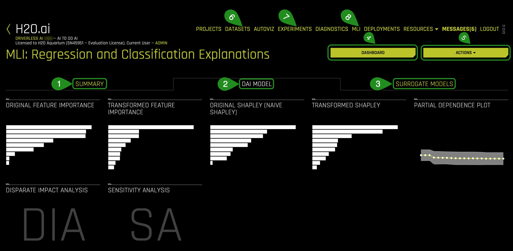

*Things to Note:*

1. Summary -  Summary of MLI experiment. This page provides an overview of the interpretation, including the dataset and Driverless AI experiment (if available) that were used for the interpretation along with the feature space (original or transformed), target column, problem type, and k-Lime information.

    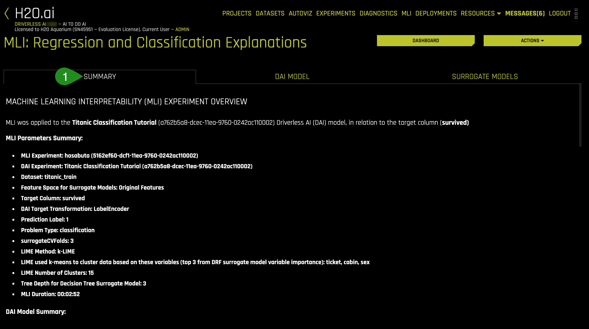
    
    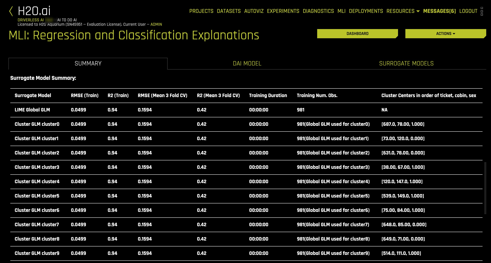
    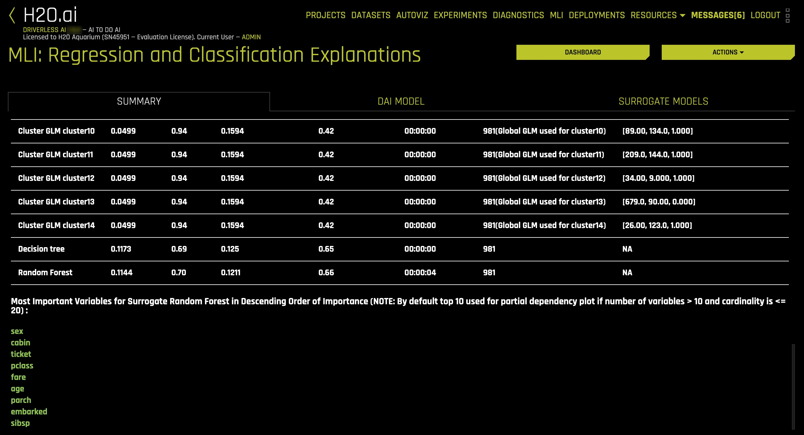


2. Driverless AI Model: For binary classification and regression experiments, the Driverless AI Model menu provides the following plots for Driverless AI models:

    - **Original Feature Importance:** This plot shows the original feature importance and to access it consider the following steps: 

    

    
    1: Click on the **DAI MODEL** text

    2: Click on the **Original Feature Importance** visual

    


    - **Transformed Feature Importance:** This plot shows the Driverless AI feature importance. Driverless AI feature importance is a measure of the contribution of an input variable to the overall predictions of the Driverless AI model. Global feature importance is calculated by aggregating the improvement in splitting criterion caused by a single variable across all of the decision trees in the Driverless AI model. To access it consider the following steps: 

    

    1: Click on the **Transformed Feature Importance** visual

    

    *Note:*

    Feature Importance (Original and Transformed Features)

    This plot is available for all models for binary classification, multiclass classification, and regression experiments.

    This plot shows the Driverless AI feature importance. Driverless AI feature importance is a measure of the contribution of an input variable to the overall predictions of the Driverless AI model.

    - **Original Shapley (Naive Shapley):** This plot shows the original Shapley (Naive Shapley) and to access it consider the following steps: 

    .jpg)

    1: Click on the **Original Shapley (Naive Shapley)** visual

    .jpg)

    - **Transformed Shapley:** Shapley explanations are a technique with credible theoretical support that presents consistent global and local variable contributions. Local numeric Shapley values are calculated by tracing single rows of data through a trained tree ensemble and aggregating the contribution of each input variable as the row of data moves through the trained ensemble. For regression tasks, Shapley values sum to the prediction of the Driverless AI model. For classification problems, Shapley values sum to the prediction of the Driverless AI model before applying the link function. Global Shapley values are the average of the absolute Shapley values over every row of a dataset. To access it consider the following steps: 

    

    1: Click on the **Transformed Shapley** visual

    

    *Note:*

    This plot is not available for RuleFit or TensorFlow models. For all other models, this plot is available for binary classification, multiclass classification, and regression experiments.

    - **Partial Dependence/ICE Plot:** Partial dependence is a measure of the average model prediction with respect to an input variable. Partial dependence plots display how machine-learned response functions change based on the values of an input variable of interest while considering nonlinearity and averaging out the effects of all other input variables. Partial dependence plots are well-known and described in the Elements of Statistical Learning (Hastie et al., 2001). Partial dependence plots enable increased transparency in Driverless AI models and the ability to validate and debug Driverless AI models by comparing a variable's average predictions across its domain to known standards, domain knowledge, and reasonable expectations. 
    
      Individual conditional expectation (ICE) plots, a newer and less well-known adaptation of partial dependence plots, can be used to create more localized explanations for a single individual using the same basic ideas as partial dependence plots. ICE Plots were described by Goldstein et al. (2015). ICE values are simply disaggregated partial dependence, but ICE is also a type of nonlinear sensitivity analysis in which the model predictions for a single row are measured. At the same time, a variable of interest is varied over its domain. ICE plots enable a user to determine whether the model's treatment of an individual row of data is outside one standard deviation from the average model behavior, whether the treatment of a specific row is valid in comparison to average model behavior, known standards, domain knowledge, and reasonable expectations, and how a model will behave in hypothetical situations where one variable in a selected row is varied across its domain. To access it consider the following steps: 

    

    1: Click on the **Partial Dependence Plot** visual

    

    *Note:*

    This plot is available for binary classification and regression models.

    Overlaying ICE plots onto partial dependence plots allow the comparison of the Driverless AI model’s treatment of certain examples or individuals to the model’s average predictions over the domain of an input variable of interest.

    This plot shows the partial dependence when a variable is selected and the ICE values when a specific row is selected. Users may select a point on the graph to see the specific value at that point. Partial dependence (yellow) portrays the average prediction behavior of the Driverless AI model across the domain of an input variable along with +/- 1 standard deviation bands. ICE (grey) displays the prediction behavior for an individual row of data when an input variable is toggled across its domain. Currently, partial dependence and ICE plots are only available for the top ten most important original input variables. Categorical variables with 20 or more unique values are never included in these plots.

    - **Disparate Impact Analysis (NEW):** Disparate Impact Analysis is a technique that is used to evaluate fairness. Bias can be introduced to models during the process of collecting, processing, and labeling data—as a result, it is essential to determine whether a model is harming certain users by making a significant number of biased decisions. Learn more about [Disparate Impact Analysis](http://docs.h2o.ai/driverless-ai/1-8-lts/docs/userguide/interpret-non-ts.html#disparate-impact-analysis).To access it consider the following steps: 

    

    1: Click on the **Disparate Impact Analysis** visual

    
    
    


    - **Sensitivity Analysis (NEW)** : Sensitivity Analysis (or "What if?") is a simple and powerful model debugging, explanation, fairness, and security tool. The idea behind Sensitivity Analysis is both direct and straightforward: Score your trained model on a single row, on multiple rows, or an entire dataset of potentially interesting simulated values and compare the model's new outcome to the predicted outcome on the original data.

      Sensitivity analysis investigates whether model behavior and outputs remain stable when data is intentionally perturbed, or other changes are simulated in the data. Machine learning models can make drastically differing predictions for only minor changes in input variable values. For example, when looking at predictions that determine financial decisions, SA can be used to help you understand the impact of changing the most important input variables and the impact of changing socially sensitive variables (such as Sex, Age, Race, etc.) in the model. If the model changes in reasonable and expected ways when important variable values are changed, this can enhance trust in the model. Similarly, if the model changes to sensitive variables have minimal impact on the model, then this is an indication of fairness in the model predictions.  Learn more about [Sensitivity Analysis](http://docs.h2o.ai/driverless-ai/1-8-lts/docs/userguide/interpret-non-ts.html#sensitivity-analysis). To access it consider the following steps: 

    

    1: Click on the **Sensitivity Analysis** visual

    

    - **NLP Tokens (for text experiments only)**: This plot shows both the global and local importance values of each token in a corpus (a large and structured set of texts). The corpus is automatically generated from text features used by Driverless AI models prior to the process of tokenization

    - **NLP LOCO (for text experiments)**: This plot applies a leave-one-covariate-out (LOCO) styled approach to NLP models by removing a specific token from all text features in a record and predicting local importance without that token. The difference between the resulting score and the original score (token included) is useful when trying to determine how specific changes to text features alter the predictions made by the model.

    - [See documentation for multiclass classification and time-series experiments](http://docs.h2o.ai/driverless-ai/1-8-lts/docs/userguide/interpret-non-ts.html#summary-page)

3. Surrogate Models - For classification and regression experiments

    1: Click on the **Surrogate Models** text 

    

    - **K-LIME**

    To access the Surrogate K-Lime Model consider the following steps:

    

    1: Click on the **K-LIME** visual

    
  

    - **Decision Tree**

    To access the Surrogate Decision Tree Model consider the following steps:

    

    1: Click on the **Decision Tree** visual

    

    - **RF(Random Forest) Feature Importance**

    To access the Surrogate RF(Random Forest)Feature Importance Model consider the following steps:

    

    1: Click on the **RF Feature Importance** visual

    
  
    
    - **RF(Random Forest) Partial Dependence Plot**

    To access the Surrogate RF(Random Forest) Partial Dependence Plot Model consider the following steps:

   

    1: Click on the **RF Partial Dependence Plot** visual

    

    - **RF(Random Forest) LOCO**

    To access the Surrogate RF(Random Forest) LOCO Model consider the following steps:

    

    1: Click on the **RF LOCO** visual

    

4. **Dashboard** - The Model Interpretation Page includes the following:
    - K-Lime: Global Interpretability Model Explanation Plot
    - Feature Importance: Surrogate RF Feature Importance
    - Decision Tree Surrogate model
    - Partial Dependence and Individual Conditional Expectation (ICE) plots

5. **Actions:** 

   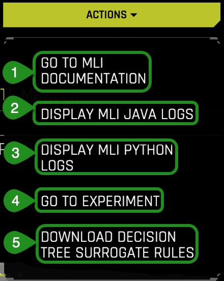

    *Note:*

   1\. Go to ML documentation
   - MLI Docs - Link to the "Machine Learning Interpretability with Driverless AI" booklet

   2\.Display MLI Java Logs

   3\. Display MLI Python Logs

   4\. Go to Experiment

   5\. Download Decision Tree Surrogate Rules
    
6. Datasets - Takes you back to the Datasets page 

7. Experiments - Takes you back to the Experiments page

8. MLI - Takes you back to the MLI page 

### MLI Dashboard

Select the MLI **Dashboard** and explore the different types of insights and explanations regarding the model and its results. All plots are interactive.

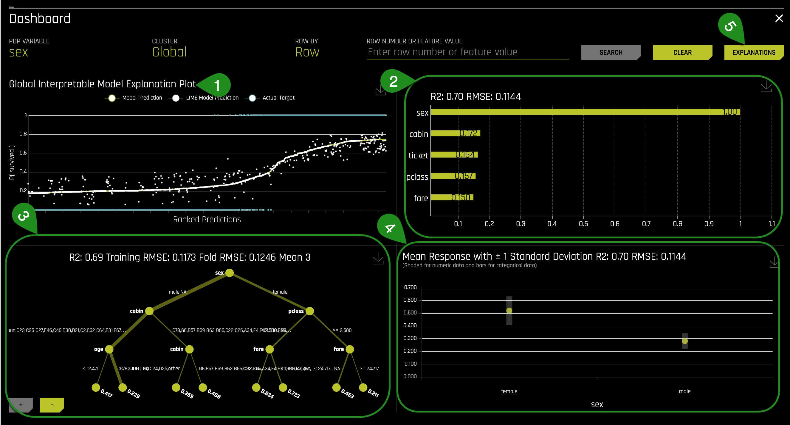

*NOTE:* On the top right corner where it says "Row Number or Feature Value," you are allow the following actions: The row selection feature allows a user to search for a particular observation by row number or by an identifier column. Identifier columns cannot be specified by the user - MLI makes this choice automatically by choosing columns whose values are unique (dataset row count equals the number of unique values in a column).

1\. K-Lime - Global Interpretability model explanation plot: 
This plot shows Driverless AI model and LIME model predictions in sorted order by the Driverless AI model predictions. In white, is the global linear model of Driverless AI predictions.

1. Hover over any of the points of the plot and view the LIME reason codes for that value.

2. Select a point where *Actual value* is 1 and note the reason codes for that prediction value


Learn more about K-Lime with our [Machine Learning Interpretability Tutorial](https://training.h2o.ai/products/tutorial-1c-machine-learning-interpretability-tutorial).

2\. Feature Importance - 
This graph shows the essential features that drive the model behavior.
1. Which attribute/feature had the most importance?
2. Was this the same attribute that you hypothesized?


Learn more about Feature Importance with our [Machine Learning Interpretability Tutorial](https://training.h2o.ai/products/tutorial-1c-machine-learning-interpretability-tutorial).

3\. Decision Tree Surrogate model

The decision Tree Surrogate model displays the model's approximate flowchart of the complex Driverless AI model's decision making.Higher and more frequent features are more important. Features above or below one-another can indicate an interaction. Finally, the thickest edges are the most common decision paths through the tree that lead to a predicted numerical outcome.

1. What is the most common decision path for the Titanic Training set?

Solution:


Learn more about Decision Trees with our [Machine Learning Interpretability Tutorial](https://training.h2o.ai/products/tutorial-1c-machine-learning-interpretability-tutorial).

4\. Partial Dependence and Individual Conditional Expectation (ICE) plot. This plot represents the model prediction for different values of the original variables. It shows the average model behavior for important original variables.

The grey bar represents the standard deviation of predictions. The yellow dot represents the average predictions.


1. Explore other average values for different variables and compare the results to your original observations. To change the variable, select **PDP Variable:** located at the top of the Partial Dependence plot.
 
Learn more about Partial Dependence Plots with our [Machine Learning Interpretability Tutorial](https://training.h2o.ai/products/tutorial-1c-machine-learning-interpretability-tutorial).

5\. Explanations 

Explanations provide a detailed, easy-to-read **Reason Codes** for the top Global/Local Attributions.
1. Click on Explanations


2. Determine the top 2 global attributions associated with 'survived.'

*Note:* 

Driverless AI offers other plots located under Driverless AI Model and Surrogate Models, take a few minutes to explore these plots; they are all interactive. The **?** mark will provide an explanation of each plot.

Driverless AI Model
- Original Feature Importance
- Transformed Feature Importance 
- Original Shapley (Naive shapley)
- Transformed shapley
- Partial Dependence Plot
- Disparate Impact Analysis
- Sensitivity Analysis 


Surrogate Models
- KLime
- Decision Tree
- Random Forest
    - Feature Importance
    - Partial Dependency Plot
    - LOCO


### Deeper Dive and Resources

- [Machine Learning, H2O.ai & Machine Learning  Interpretability | Interview with Patrick Hall](https://www.youtube.com/watch?v=TSmSBWnVSzc)

- [H2O Driverless AI Machine Learning Interpretability walkthrough]( 
https://www.youtube.com/watch?v=5jSU3CUReXY) (Oct 18)

- [Practical Tips for Interpreting Machine Learning Models - Patrick Hall, H2O.ai Youtube Video](https://www.youtube.com/watch?v=vUqC8UPw9SU) (June 18)

- [Practical Tips for Interpreting Machine Learning Models - Patrick Hall, H2O.ai Slideshare](https://www.slideshare.net/0xdata/practical-tips-for-interpreting-machine-learning-models-patrick-hall-h2oai)

- [Building Explainable Machine Learning Systems: The Good, the Bad, and the Ugly](https://www.youtube.com/watch?v=Q8rTrmqUQsU) (May 18)
 
- [An Introduction to Machine Learning Interpretability Second Edition by Patrick Hall & Navdeep Gill](https://www.h2o.ai/wp-content/uploads/2019/08/An-Introduction-to-Machine-Learning-Interpretability-Second-Edition.pdf) 

- [Testing Machine Learning Explanation Techniques by Patrick Hall, Navdeep Gill and Lingyao Meng](https://www.oreilly.com/ideas/testing-machine-learning-interpretability-techniques)

- [Patrick Hall and H2O Github - Machine Learning with Python](https://github.com/jphall663/interpretable_machine_learning_with_python)

- [Patrick Hall and H2O Github - Machine Learning Interpretability](https://github.com/jphall663/awesome-machine-learning-interpretability) 


## Task 9: Experiment Summary and Autoreport

Driverless AI allows you to download auto-generated documents such as the Download Experiment Summary and the MLI Report, all at the click of a button. 

###  Experiment Summary & Logs

1\. Click on **Download Summary & Logs**

 

When you open the zip file, the following files should be included:

- Experiment logs (regular and anonymized)
- A Summary of the experiment
- Experiment features along with relevant importance
- Ensemble information
- Experiment preview 
- Word version of an auto-generated report for the experiment
- Target transformations tuning leaderboard
- Tuning leaderboard

2\. Open the auto-generated .doc report and review the experiment results.

3\. Click on **Download Autoreport**

 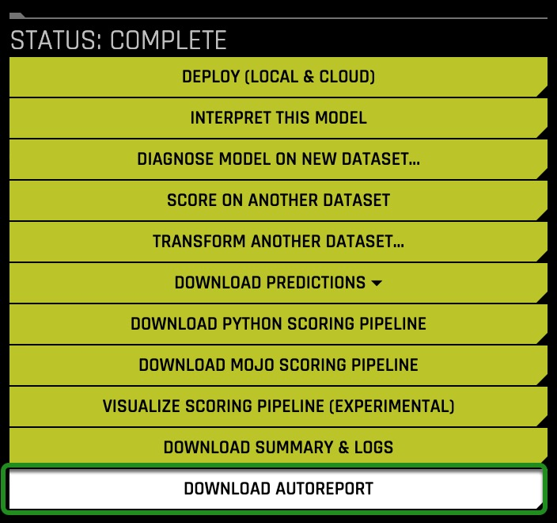

**Autoreport** is a Word version of an auto-generated report for the experiment. A report file (AutoDoc) is included in the experiment summary.

The zip file for the **Autoreport** provides insight into the following:

- Training data
- Any Detected Shifts in Distribution
- Validation Schema selected
- Model Parameter Tuning 
- Feature Evolution 
- Final set of Features chosen during the Experiment


### Deeper Dive and Resources

- [H2O Driverless AI - Experiment Summary and Autoreport](http://docs.h2o.ai/driverless-ai/1-8-lts/docs/userguide/experiment-summary.html#autoreport)

- [Review this Webinar “Peek Under the Hood of H2O Driverless AI with Auto Doc”](https://www.brighttalk.com/webcast/16463/332693/peek-under-the-hood-of-h2o-driverless-ai-with-auto-doc) 

- [Toward AutoML for Regulated Industry with H2O Driverless AI](https://www.h2o.ai/blog/toward-automl-for-regulated-industry-with-h2o-driverless-ai/)

## Next Steps

Check out Driverless AI next tutorial [Machine Learning Experiment Scoring and Analysis Tutorial - Financial Focus](https://training.h2o.ai/products/tutorial-1b-machine-learning-experiment-scoring-and-analysis-tutorial-financial-focus) where you will learn how to:

- Evaluate a Driverless AI model through tools like:
	- ROC
	- Prec-Recall
	- Gain and Lift Charts
	- K-S Chart
	- Metrics such as:
	  - AUC
	  - F-Scores
	  - GINI
	  - MCC
	  - Log Loss

- Request a [21-Day Free Trial: H2O Driverless AI license Key](https://www.h2o.ai/try-driverless-ai/)

## Appendix: Project Workspace

Driverless AI provides a Project Workspace for managing datasets and experiments related to a specific business problem or use case. Whether you are trying to detect fraud or predict user retention, datasets, and experiments can be stored and saved in the individual projects. A Leaderboard on the Projects page allows you to easily compare performance and results and identify the best solution for your problem.

From the Projects page, you can link datasets and/or experiments, and you can run new experiments. When you link an existing experiment to a Project, the datasets used for the experiment will automatically be linked to this project (if not already linked).

### Explore an Existing Project Workspace

1\. Select **Projects** , an image similar to the one below will appear:


*Things to Note:*

1. **Projects**: Projects Workspace for managing datasets and expirments menu option
2. Pre-created **Project** which includes:
    - **Name** : Project name (Time Series Tutorial)
    - **Description**: Optional (N/A)
    - **Train Datasets**: Number of train datasets (1)
    - **Valid Datasets**: Number of validation datasets (0)
    - **Test Datasets**: Number of test datasets (1)
    - **Experiments**: Number of experiments (1)
3. Additional options for the created project:
    - **Open**
    - **Rename**
    - **Delete**
4. **+New Project**: Option to create a new project 
5. **Type value to search for or date e.g. 15/09**

3\. Open the **Time Series Tutorial**, an image similar to the one below will appear:


*Things to Note:*

1. **Datasets** 
    - **Selected Datasets Type**: Training, Testing or Validation
    - Additional information on the dataset that was selected: Name, Rows, Columns

    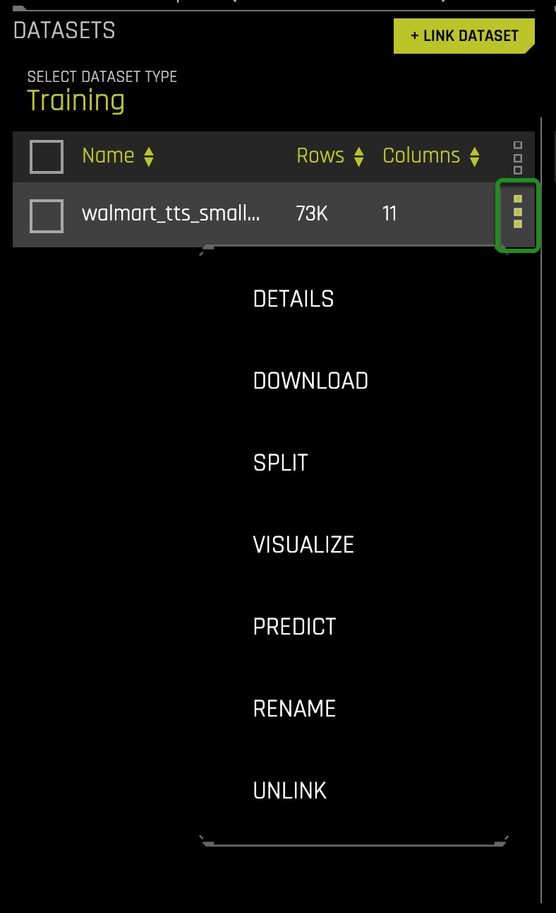
        
    - **+ Link dataset** : Link an additional dataset (Training, Testing or Validation) to the existing project

2. **Experiments** 

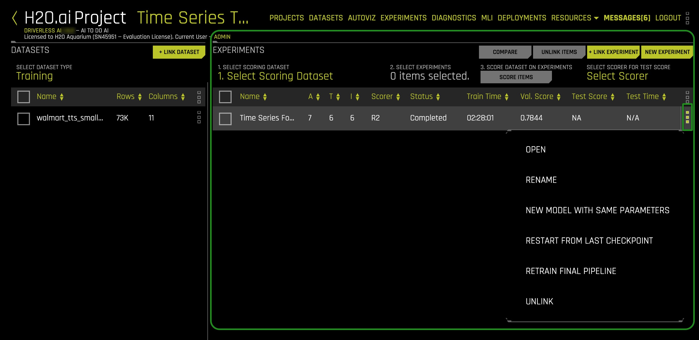

- **Select Scoring Dataset**: Select a test dataset to score using selected experiment
- **Select Experiments**: Select any experiment for this project
- **Select Scorer for Test Score**: Select a valid scorer for this experiment
- **Score Dataset on Experiments**: Once you have selected the data for scoring, the scorer, and the model or models, you can begin the scoring process by clicking **Score Items**.
- **Compare**: You can compare two or three experiments and view side-by-side detailed information about each.
- **Unlink Items**: Unlink datasets and/or experiments
- **New Experiment**: Create a new experiment
- Current linked experiment(s) info :
    - **Name**
    - **A**: Accuracy
    - **T** : Time
    - **I**: Interpretability
    - **Scorer**: Scorer used 
    - **Status**: In progress, completed
    - **Train Time**: Total time to train experiment
    - **Val. Score** : Validation score for the experiment
    - **Test Score**: Test score for the experiment
    - **Test Time**: Total time to test experiment 
 
### Create a Project Workspace

To create a Project Workspace:

1. Click the **Projects** option on the top menu
2. Click **New Project**
3. Specify a name for the project and provide a description
4. Click **Create Project**. This creates an empty Project page

- Learn more about projects in Driverless AI; check out the [Project Workspace Documentation](http://docs.h2o.ai/driverless-ai/latest-stable/docs/userguide/projects.html?highlight=projects%20workspace).

- A more extensive application of **Project Workspace** can be explored in the [Time Series Tutorial - Retail Sales Forecasting](https://training.h2o.ai/products/tutorial-2a-time-series-recipe-tutorial-retail-sales-forecasting). 
 

 
