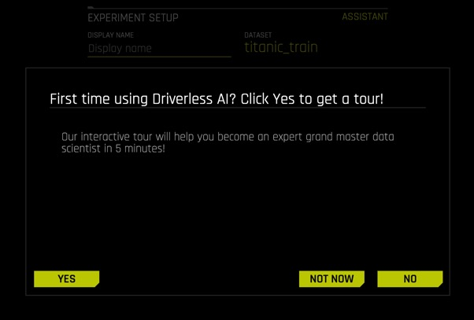
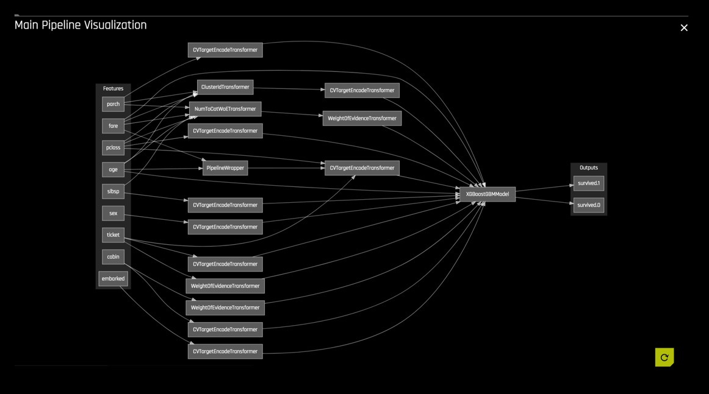
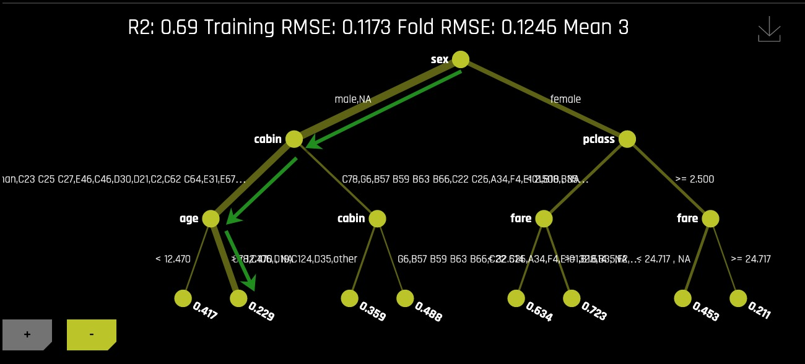

# Automatic Machine Learning Introduction with Driverless AI

## Outline

- [Objective](#objective)
- [Prerequisites](#prerequisites)
- [Task 1: Product Tour](#task-1-product-tour)
- [Task 2: Automatic Machine Learning Concepts](#task-2-automatic-machine-learning-concepts)
- [Task 3: Load Data](#task-3-load-data)
- [Task 4: Explore Data Details and AutoViz](#task-4-explore-data-details-and-autoviz)
- [Task 5: Launch First Experiment](#task-5-launch-first-experiment)
- [Task 6: Explore Feature Engineering](#task-6-explore-feature-engineering)
- [Task 7: Explore Experiment Results](#task-7-explore-experiment-results)
- [Task 8: Machine Learning Interpretability Report for Non-Time-Series Experiments](#task-8-machine-learning-interpretability-report-for-non-time-series-experiments)
- [Task 9: Experiment Summary and Autoreport](#task-9-experiment-summary-and-autoreport)
- [Next Steps](#next-steps)
- [Appendix: Project Workspace](#appendix-project-workspace)

## Objective

For this self-paced course, we will explore the Titanic dataset from the perspective of a passenger life insurance company while using and learning about [H2O.ai's](https://www.h2o.ai/) enterprise product, [Driverless AI](https://www.h2o.ai/products/h2o-driverless-ai/). We will explore possible risk factors derived from this dataset that could have been considered when selling passenger insurances. More specifically, we will create a predictive model to determine what factors contributed to a passenger surviving.

In part, this self-paced course will also be an overview of Driverless AI. You will learn how to load data, explore data details, generate Auto visualizations, launch an experiment, explore feature engineering, view experiment results. As well, we will go through a quick tour of the Machine Learning Interpretability report that you can generate right after an experiment is complete. 

**Note**: This self-paced course has been built on Aquarium, which is H2O.ai's cloud environment providing software access for workshops, conferences, and training. The labs in Aquarium have datasets, experiments, projects, and other content preloaded. If you use your version of Driverless AI, you will not see the preloaded content.

## Prerequisites

- Basic knowledge of Machine Learning and Statistics
- A **Two-Hour Test Drive session**: Test Drive is H2O.ai's Driverless AI on the AWS Cloud. No need to download software. Explore all the features and benefits of the H2O Automatic Learning Platform.
  - Need a **Two-Hour Test Drive** session? Follow the instructions [on this quick self-paced course](https://training.h2o.ai/products/self-paced-course-0-getting-started-with-driverless-ai-test-drive) to get a Test Drive session started. After the Driverless AI Test Drive session starts, continue reading the remaining prerequisites of this self-paced course, then start **Task 1: Product Tour**.
  - Already have a **Two-Hour Test Drive** session? Proceed to **Task 1: Product Tour**.

**Note:  Aquarium’s Driverless AI Test Drive lab has a license key built-in, so you don’t need to request one to use it. Each Driverless AI Test Drive instance will be available to you for two hours, after which it will terminate. No work will be saved. If you need more time to further explore Driverless AI, you can always launch another Test Drive instance or reach out to our sales team via the [contact us form](https://www.h2o.ai/company/contact/).**


## Task 1: Product Tour

### Overview 

H2O Driverless AI is an artificial intelligence(AI) platform for automatic machine learning. Driverless AI automates some of the most difficult data science and machine learning workflows such as feature engineering, model validation, model tuning, model selection, and model deployment. It aims to achieve highest predictive accuracy, comparable to expert data scientists, but in much shorter time thanks to end-to-end automation. Driverless AI also offers automatic visualizations and machine learning interpretability(MLI). Especially in regulated industries, model transparency and explanation are just as important as predictive performance. Modeling pipelines (feature engineering and models) are exported (in full fidelity, without approximations) both as Python modules and as pure Java standalone scoring artifacts. 


### Why Driverless AI? 

Over the last several years, machine learning has become an integral part of many organizations’ decision-making process at various levels. With not enough data scientists to fill the increasing demand for data-driven business processes, H2O.ai offers Driverless AI, which automates several time consuming aspects of a typical data science workflow, including data visualization, feature engineering, predictive modeling, and model explanation. 

H2O Driverless AI is a high-performance, GPU-enabled computing platform for automatic development and rapid deployment of state-of-the-art predictive analytics models. It reads tabular data from plain text sources, Hadoop, or S3 buckets and automates data visualization and building predictive models. Driverless AI targets business applications such as loss-given-default, probability of default, customer churn, campaign response, fraud detection, anti-money-laundering, demand forecasting, and predictive asset maintenance models. (Or in machine learning parlance: common regression, binomial classification, and multinomial classification problems). 

### Tour

Welcome to the Driverless AI **Datasets** page(this will be the first thing you will see when you click your **Driverless AI URL**): 


On the **Datasets** page, the following options and features can be found. Now, we will quickly review them, but we will further explore these options and features before and after we launch an experiment in the upcoming tasks. 

- *Things to Note:*</br>
    **a.** In the **Projects** section, you can manage your datasets and experiments related to a specific business problem or use case.</br>
    **b.** In the **Datasets** section, you can view current datasets that have been added. Other dataset features include the option to get dataset details, visualize, split, predict, rename, download, and delete.</br>
    **c.** **Autoviz** shows graphs explaining the selected dataset to visualize. Note that the graphs on the visualization page can vary based on the information in your dataset. You can also view and download logs that Driverless AI generated during the visualization.</br>
    **d.** In the **Experiments** section, you can view completed experiments. Experiments can be revised or deleted.</br>
    **e.** In the **Diagnostics** section, you can diagnose a model and view model performance for multiple scorers based on the existing model and dataset.</br>
    **f.** In the **MLI (Machine Learning Interpretability)** section, you can interpret a model and view a list of already interpreted models.</br>
    **g.** The **Deployments** section allows you to access the MOJO and Python scoring pipelines for you to test or integrate into a final product. You can also deploy locally or in the cloud.</br>
    **h.** The **Resources** dropdown menu provides you with the following options to view or download: 
    - System Info
    - Python Client 
    - R Client 
    - MOJO2 Java Runtime
    - MOJO2 Py Runtime 
    - MOJO 2 R Runtime
    - Tutorials 
    - Help
    - About</br>
    
    **i.** The **User** option offers the following options:
    - **Messages[ ]**: View upcoming events regardinging Driverless AI.
    -  **Logout**: Logs you out of your current session.</br>

    **j.** **<**: Takes you back to the previous page.</br>
    **k.** **H2O.ai**: Takes you back to the H2OAI **Datasets** page.</br>
    **l.** **Driverless AI 1.X.X**: Version of Driverless AI </br>
    **m.** The **+ Add a Dataset(or Drag and Drop)** button provides the following options: 
    - *File System*: Search for datasets in our repository 
    - *Upload File*: Upload a dataset from your computer 
    - *Amazon S3*: Upload a dataset by using S3 buckets
    - *Hadoop File System*: Upload a dataset from Hadoop 
    - *Data Recipe URL*: Upload a dataset with a customize data recipe reachable through a URL
    - *Upload Data Recipe*: Upload a dataset with a customize data recipe located on your computer</br>
    
    **n.** **Type value to search for or date, e,g, 15/09:** Search for a given dataset by inputting its creation date.


Before we load the dataset for our experiment, let us review some introductory concepts around Machine Learning. 

### Deeper Dive and Resources

-  [Join the H2O community](https://www.h2o.ai/community/home). Post your questions, discuss use cases, give feedback, stay informed about the latest H2O.ai updates, and more.
- Learn more about H2O Driverless through the [H2O documentation](http://docs.h2o.ai/driverless-ai/latest-stable/docs/booklets/DriverlessAIBooklet.pdf).
- [Explore H2O Product Documentation](http://docs.h2o.ai/)
- [Learn more H2O Driverless by reviewing the FAQs](http://docs.h2o.ai/driverless-ai/latest-stable/docs/userguide/faq.html) 

## Task 2: Automatic Machine Learning Concepts

###  Artificial Intelligence and Machine Learning

The concepts found in this task are meant to provide a high-level overview of Machine Learning. At the end of this task, you can find links to resources that offer a more in-depth explanation of the concepts covered here.

Machine learning is a subset of Artificial intelligence where the focus is to create machines that can simulate human intelligence. One critical distinction between artificial intelligence and machine learning is that machine learning models "learn" from the data the models get exposed to. Arthur Samuel, a machine learning pioneer back in 1959, defined machine learning as a " field of study that gives computers the ability to learn without being explicitly programmed" [1]. A machine learning algorithm trains on a dataset to make predictions. These predictions are, at times, used to optimize a system or assist with decision-making.


### Machine Learning Training

Advances in technology have made it easier for data to be collected and made available. The available type of data will determine the kind of training that the machine learning model can undergo. There are two types of machine learning training, supervised and unsupervised learning. Supervised learning is when the dataset contains the output that you are trying to predict. For those cases where the predicting variable is not present, it's called unsupervised learning. Both types of training define the relationship between input and output variables.

In machine learning, the input variables are called **features** and the output variables **labels**. The labels, in this case, are what we are trying to predict. The goal is to take the inputs/variables/features and use them to come up with predictions on never-before-seen data. In linear regression, the features are the x-variables, and the labels are the y-variables. An example of a label could be the future price of avocados. In terms of feature examples regarding this self-paced course, in Task 3, we will see the following features when creating our survival prediction model: passenger class, sex, age, passenger fare, cabin number, etc. 

A machine learning model defines the relationship between features and labels. Anyone can train a model by feeding it examples of particular instances of data. You can have two types of examples: labeled and unlabeled. Labeled examples are those where the X and Y values (features, labels) are known. Unlabeled examples are those where we know the X value, but we don't know the Y value[1]. Your dataset is similar to an example; the columns that will be used for training are the features; the rows are the instances of those features. The column that you want to predict is the label.

Supervised learning takes labeled examples and allows a model that is being trained to learn the relationship between features and labels. The trained model can then be used on unlabelled data to predict the missing Y value. The model can be tested with either labeled or unlabeled data. Note that H2O Driverless AI creates models with labeled examples.

### Data Preparation 

A machine learning model is as good as the data that is used to train it. If you use garbage data to train your model, you will get a garbage model. With that said, before uploading a dataset into tools that will assist you with building your machine learning model, such as Driverless AI, ensure that the dataset has been cleaned and prepared for training. Transforming raw data into another format, which is more appropriate and valuable for analytics, is called data wrangling. 

Data wrangling can include extractions, parsing, joining, standardizing, augmenting, cleansing, and consolidating until the missing data is fixed or removed. Data preparation includes the dataset being in the correct format for what you are trying to do; accordingly, duplicates are removed, missing data is fixed or removed, and finally, categorical values are transformed or encoded to a numerical type. Tools like [Python datatable](https://datatable.readthedocs.io/en/latest/?badge=latest), [Pandas](https://pandas.pydata.org/) and [R](https://www.r-project.org/) are great assets for data wrangling. 

 Data wrangling can be done in Driverless AI via a [data recipe](https://www.r-project.org/), the [JDBC connector](http://docs.h2o.ai/driverless-ai/1-8-lts/docs/userguide/connectors-nd/jdbc.html?highlight=jdbc) or through [live code](http://docs.h2o.ai/driverless-ai/1-8-lts/docs/userguide/datasets-describing.html?highlight=live%20code#modify-by-recipe) which will create a new dataset by modifying the existing one. 

 
### Data Transformation/Feature Engineering

Data transformation or feature engineering is the process of creating new features from the existing ones. Proper data transformations on a dataset can include scaling, decomposition, and aggregation [2]. Some data transformations include looking at all the features and identifying which features can be combined to make new ones that will be more useful to the model's performance. For categorical features, the recommendation is for classes that have few observations to be grouped to reduce the likelihood of the model overfitting. Categorical features may be converted to numerical representations since many algorithms cannot handle categorical features directly. Besides, data transformation removes features that are not used or are redundant[3]. These are only a few suggestions when approaching feature engineering. Feature engineering is very time-consuming due to its repetitive nature; it can also be costly. After successfully or having a notion of well-done data transformation, the next step in creating a model is selecting an algorithm.

### Algorithm Selection

“Machine learning algorithms are described as learning a target function (f) that best maps input variables (x) to an output variable(y): Y= f(x)” [4]. In supervised learning, there are many algorithms to select from for training. The type of algorithm(s) will depend on the size of your data set, structure, and the type of problem you are trying to solve.  Through trial and error, the best performing algorithms can be found for your dataset. Some of those algorithms include linear regression, regression trees, random forests, Naive Bayes, and boosting, to name a few [5]. 

### Model Training

**Datasets** 

When training a machine learning model, one good practice is to split up your dataset into subsets: training, validation, and testing sets. A good ratio for the entire dataset is 70-15-15, 70% of the whole dataset for training, 15% for validation, and the remaining 15% for testing. The **training set** is the data used to train the model, and it needs to be big enough to get significant results from it. The **validation set** is the data held back from the training and will be used to evaluate and adjust the trained model's hyperparameters and, hence, adjust the performance. Finally, the **test set** is data that has also been held back and will be used to confirm the final model's results [1].

**Note**: The validation dataset is used for tuning the modeling pipeline. If provided, the entire training data will be used for training, and validation of the modeling pipeline is performed with only this validation dataset. When you do not include a validation dataset, Driverless AI will do K-fold cross-validation for I.I.D. (identically and independently distributed)  experiments and multiple rolling window validation splits for time series experiments. For this reason, it is not generally recommended to include a validation dataset as you are then validating on only a single dataset. Please note that time series experiments cannot be used with a validation dataset: including a validation dataset will disable the ability to select a time column and vice versa.

This dataset must have the same number of columns (and column types) as the training dataset. Also, note that if provided, the validation set is not sampled down, so it can lead to large memory usage, even if accuracy=1 (which reduces the train size). In a moment, we will learn more about **accuracy** when preparing an experiment.[10] 

<p align="center"> 
    </img>    
</p>

Another part of model training is fitting and tuning the models. For fitting and tuning, hyperparameters need to be tuned, and cross-validation needs to take place using only the training data. Various hyperparameter values will need to be tested. "A hyperparameter is a parameter that is set before the learning process begins. These parameters are tunable and can directly affect how well a model trains. [In Machine Learning, a hyperparameter is the learning rate]" [7]. In other words, the hyperparameter value is used to determine the rate at which the model learns.  

With cross-validation, the whole dataset is utilized, and each model is trained on a different subset of the training data [8]. Additionally, a cross-validation loop will be set to calculate the cross-validation score for each set of hyperparameters for each algorithm. Based on the cross-validation score and hyperparameter values, you can select the model for each algorithm that has been tuned with training data and tested with your test set. Remember that "a model in [Machine Learning(ML)] is the output of an ML algorithm run on data. It represents what was learned by a machine learning algorithm." [9] 

### What are the challenges in AI Model Development?

One of the significant challenges in developing a single production-ready model is that it can take weeks or months to build it. Developing a model involves feature engineering, model building, and model deployment. All tasks are very repetitive, time-consuming, require advanced knowledge of feature generation, algorithms, parameters, and model deployment. Finally, there needs to be in-depth knowledge and confidence in how the model was generated to justify how it made its decisions.


### What is Automated Machine Learning, and why is it important?

AutoML or Automated Machine Learning is the process of automating algorithm selection, feature generation, hyperparameter tuning, iterative modeling, and model assessment. AutoML tools such as H2O Driverless AI makes it easy to train and evaluate machine learning models. Automating the repetitive tasks around Machine Learning development allows individuals to focus on the data and the business problems they are trying to solve. 

With this task in mind, let's explore and load the data that we will be using when predicting whether a passenger would've survived the titanic accident. 

### References
- [1] [Google’s Machine Learning Crash Course](https://developers.google.com/machine-learning/crash-course/training-and-test-sets/splitting-data)
- [2] [About Train, Validation and Test Sets in Machine Learning](https://towardsdatascience.com/train-validation-and-test-sets-72cb40cba9e7)
- [3] [Data Science Primer - Data Cleaning](https://elitedatascience.com/data-cleaning)
- [4] [Feature Engineering](https://elitedatascience.com/feature-engineering) 
- [5] [Towards Data Science- Supervised vs Unsupervised Learning](https://towardsdatascience.com/supervised-vs-unsupervised-learning-14f68e32ea8d) 
- [6] [Selecting the best Machine Learning Algorithm for your regression problem](https://towardsdatascience.com/selecting-the-best-machine-learning-algorithm-for-your-regression-problem-20c330bad4ef)
- [7] [Deep AI - What is a hyperparameter?](https://deepai.org/machine-learning-glossary-and-terms/hyperparameter)
- [8] [H2O.ai's Driverless AI - Internal Validation Technique](http://docs.h2o.ai/driverless-ai/1-8-lts/docs/userguide/internal-validation.html?highlight=cross%20validation)
- [10] [Validation Dataset](http://docs.h2o.ai/driverless-ai/latest-stable/docs/userguide/experiment-settings.html#validation-dataset)

### Deeper Dive and Resources

- [Explore the replays from H2O World Around the World](
https://www.h2o.ai/h2oworldnewyork/) 
- [Explore the Webinar Replays](
https://www.brighttalk.com/search/?q=driverless+ai) 
- [Explore the various H2O Driverless AI playlists on YouTube](https://www.youtube.com/user/0xdata/playlists) 


## Task 3: Load Data

### What is the Driverless AI Workflow?

The typical Driverless AI workflow is to:

1. Load data
2. Visualize data
3. Run an experiment
4. Interpret the model
5. Deploy the scoring pipeline

Besides, you can diagnose a model, transform another dataset, score the model against another dataset and manage your data in Projects. This self-paced course's focus will be on steps 1 - 4. We will cover Driverless AI's other aspects in other self-paced courses found in the Driverless AI learning path. We will start with step 1: load data.

<p align="center"> 
    </img>      
</p>


### About the Dataset

The dataset used for this experiment is a version of the Titanic Kaggle dataset. This dataset contains the list of estimated passengers aboard the RMS Titanic.

The RMS Titanic was a British commercial passenger liner that sank after colliding with an iceberg in the North Atlantic Ocean on April 15, 1912. More than 1,500 people lost their lives from an estimated 2,224 passengers and crew members while on their way to New York City from Southampton. 

This tragedy shocked the international community and led to better safety regulations for ships. The lack of lifeboats, amongst other things, was one of the factors that resulted in a significant loss of life. Although there was some element of luck involved in surviving the sinking, some groups of people were more likely to survive than others.

<p align="center"> 
    </img>    
    <p align="center">Figure 1. RMS Titanic</p>
</p>

To further understand the data, please consider the table below:

|Attribute|Definition|Key|
|---|---|---|
|passenger Id|Id randomly generated| - |
|pclass|Passenger Class| 1= 1st, 2 =2nd, 3=3rd|
|survived|Survival| 0=No, 1=Yes|
|name_with_salutations|Passenger name| - |
|name_without_salutations|Passenger name without salutations| - |
|sex|Sex|Female, Male|
|age|Age in years| - |
|sibsp|Number of siblings/Spouse aboard| - |
|parch|Number of Parents/Children aboard| - |
|ticket|Ticket number| - |
|fare|Passenger fare| - |
|cabin|Cabin number| - |
|embarked|Port of Embarkment|C = Cherbourg, Q = Queenstown, S = Southampton|
|boat|Boat number| - |
|body|Body number| - |
|home.des|Home Destination| - |

### Add the Dataset

1\. Navigate back to the H2O Driverless AI **Datasets** page. To add the dataset:

<p align="center">

</p>

**a.** Click on **Add a Dataset(or Drag and Drop)**  
**b.** Select **FILE SYSTEM**:


2\. Inside the **FILE SYSTEM**:


**a.** Enter the following in the search bar:`/data/TestDrive/titanic.csv`</br>
**b.** Select the `titanic.csv` </br>
**c.** **Click to Import Selection**:

3\. The following will appear after you have successfully imported the dataset:


- *Things to Note*</br>
**a.** You can view:
    - File name
    - File path
    - File size
    - Number of rows/columns 
    - File status
    - Date created

Now that the dataset has been imported let's discover on the next task how Driverless AI allows users to further understand a selected dataset. Doing so will allow us to further explore the second step of the Driverless AI workflow: visualize data. 

### Deeper Dive and Resources

- [Learn More About the Type of Dataset File Formats that can be Uploaded](http://docs.h2o.ai/driverless-ai/latest-stable/docs/userguide/datasets.html#adding-datasets) 
- For more datasets, check out [Kaggle Datasets](https://www.kaggle.com/datasets)

## Task 4: Explore Data Details and AutoViz

### Details

We are now going to explore the Titanic dataset that we just loaded. 

1\. On the **Dataset Overview page**, click on the *titanic.csv*. The following options will appear:


- *Things to Note:*</br>
**a.** The dataset we imported in task 3</br>
**b.** Options:</br>
    - **Details** - View a summary of the dataset or preview the dataset
    - **Visualize** - Visualize the dataset with available graphs
    - **Split** - Split the dataset
    - **Predict** - Run an experiment using Driverless AI
    - **Rename** - Rename the dataset
    - **Download** - Download the dataset
    - **Display Logs** - Dataset logs
    - **Delete** - Delete the dataset</br>

**Note**: A dataset can only be deleted if it's not being used in an experiment. Otherwise, you must delete the experiment first, and then the dataset.

Next, we are going to confirm that the dataset loaded correctly and that it has the correct number of rows and columns. 

2\. Click the **Details** option, and it will take you to the **Dataset Details Page**:

<p align="center">

</p>

- *Things to Note:*</br>
    **a.** The **Dataset Details Page** provides a summary of the dataset.
    - View the first 20 rows of a column by hovering over the column name (see image below):
            <p align="center">
            
            </p></br>
        **Note**: Driverless AI recognizes the following column types: integer, string, real, boolean, and time. Date columns are given a string "str" type.</br>

    **b.** You can view information for a specific column by entering the column's name in the field above the graph.</br>
    **c.** The **Dataset Actions** button provides the following options:</br>
    - Visualize 
    - Split
    - Predict
    - Rename
    - Download 
    - Display Logs
    - Delete</br>

    **d.** **Modify by Recipe** allows you to create a new dataset by modifying an existing dataset with custom recipes.</br>
    **e.** **Dataset Rows** allows you to preview the dataset.</br>
    **f.** Option to exit and return to the H2O **Datasets** page.</br>
    **g.** **Feature Props:** Allows you to change the column's logical type. If you were to change a given column, you could do so by following these steps:
    - Click **Auto-detect**:
            
    - Click **Feature Engineering Type(s):** 
            
    - Select column feature engineering types(b) (then click **done** at the bottom of page(c)) or start typing to filter out items(a):
            

3\. To continue learning about what details are available, click on the following button: **Dataset Rows**. The following will appear: 


- *Things to Note:*</br>
    **a.** Preview the dataset</br>
    **b.** View the remaining rows</br>
    **c.** Dataset actions (same options as discussed earlier)</br>
    **d.** **Modify by Recipe** - Modify the dataset through a custom recipe or live code (manually enter custom recipe code to use to modify the dataset)</br>
    **e.** Return to the **Dataset Overview**</br>
    **f.** Option to Exit and return to the H2O **Datasets** page

4\. Exit and return to the **Datasets** page.

### Split the Dataset

From the *Titanic.csv* dataset, we are going to create two datasets, *training* and *test*. 75% of the data will be used to train the model, and the other 25% will be used to test the trained model.

1\. Click on the *titanic.csv* file and select **Split**:


2\. Split the data into two sets: ```titanic_train``` and ```titanic_test```, then save the changes. Use the image below as a guide: 


- *Things to Note:*</br>

    **a.** For **OUTPUT NAME 1**: enter ```titanic_train``` (this will serve as the training set)</br>
    **b.** For **OUTPUT NAME 2**: enter ```titanic_test``` (this will serve as the test set)</br>
    **c.** You can change the Random Seed; this will generate the same split every time</br>
    **d.** Change the split value to .75 by adjusting the slider to 75% or entering .75 in the section that says *SELECT SPLIT RATIO(BY ROWS)*</br>
    **e.** Save the changes you made 

The split ratio of .75 (75% for the training set and 25% for the test set) was selected for this particular dataset, not to generalize the model given the set's total size.

- **The training set** contains 981 rows, each row representing a passenger and 16 columns representing each passenger's attributes.
- **The Test set** contains 328 rows, each row representing a passenger and 16 attribute columns representing attributes of each passenger. 

3\. Verify that the three Titanic datasets, *titanic_test*, *titanic_train*, and *titanic.csv*, are there:


### Autoviz

Now that the *titanic.csv* dataset has been split, we will now use the **titanic_train** dataset. Before we begin our experiment, let's begin by visualizing our dataset while further understanding what features and labels will play a crucial role in our Machine learning model. 

There are two ways to visualize the training set:


- *Things to Note:*</br>
    **a.** **Method One**: Clicking on the **titanic_train** file, select **Visualize**, then click on the visualization file generated.</br>
    **b.** **Method Two**: Clicking on the **Autoviz** section(button) inside the section, you will need to click on the **+ NEW VISUALIZATION** button. It will ask you to pick the dataset you want to visualize. 

1\. Pick a method to visualize the **titanic_train** dataset. Right after, the following will appear: 


2\. Click on the **titanic_train** visualization, and the following graphs will appear:


Is it possible to visualize how variables on the training set are correlated? Can we determine what other variables are strongly correlated to a passenger's survival? The answer to those questions is **yes!** One of the graphs that allow us to visualize the correlations between variables is the **Correlation Graph**.

3\. Let's explore the correlation between the **survived** variable and other variables in the dataset:

- Select the **Correlation Graph** and then click on **Help** located at the graph's lower-left corner. 
- Take a minute to read about how Driverless AI constructed the correlation graph. Learn more about how variables are color-coded to show their correlations. 
- Take the 'survived' variable and drag it slightly to look at the other variables correlated to the **survived** attribute. 

What variables are strongly correlated with the 'survived' variable? Based on the correlation graph, we can see that no correlations were inferred to the **survived** attribute based on the *titanic_train* dataset. Although the graph inferred no correlation, that is not to say that we will not be able to predict whether someone will survive the titanic accident. Visualizing the dataset only gives us an idea/preview of what data will be used to train our model. As well, visualizing can allow for a deeper understanding while highlighting outliers. 


- *Things to Note:*</br>
    **a.** **Download** allows for a full-scale image of the Graph to be downloaded.</br>
    **b.** The **Help** button explains the **Correlation Graph**. This feature is available for all graphs.

4\. Exit out of the **Correlation Graph** view by clicking on the **X** at the graph's top-right corner. 

5\. After you are done exploring the other graphs, go back to the **Datasets page**. While exploring, keep in mind that Driverless AI shows graphs that represent "relevant" aspects of the data. The following are the type of graphs available:

- Correlated Scatterplots
- Spikey Histograms
- Skewed Histograms
- Varying Boxplots
- Heteroscedastic Boxplots
- Biplots
- Outliers
- Correlation Graph
- Parallel Coordinates Plot
- Radar Plot
- Data Heatmap
- Missing Values Heatmap
- Gaps Histogram

In the next task, we will proceed to step 3 of our Driverless AI workflow: run an experiment. 

### References 

- [Figure 1. RMS Titanic](https://en.wikipedia.org/wiki/RMS_Titanic#/media/File:RMS_Titanic_3.jpg)

### Deeper Dive and Resources

- [Learn more about Automatic Visualization from the H2O Driverless AIdocs](http://docs.h2o.ai/driverless-ai/latest-stable/docs/userguide/datasets.html#visualizing-datasets)
- [Learn more about Automatic Visualization from the architect Leland Wilkinson, Chief Scientist, H2O.ai from session at H2O World 2017 Youtube Video](https://www.youtube.com/watch?v=bas3-Ue2qxc)
- [H2O.ai Automatic Visualization by Leland Wikinson (SlideShare)](https://www.slideshare.net/0xdata/automatic-visualization)

## Task 5: Launch First Experiment

We are going to launch our first experiment. An experiment means that we are going to generate a prediction using a dataset of our choice. In this case, we will use the **titanic_train** dataset. 

1\. Return to the **Datasets Overview** page and click on the **titanic_train** dataset, then select **Predict**:


If this is your first time launching an experiment, the following prompt will appear, asking if you want to take a tour: 



If you would like to take a quick tour of the **Experiments** page, select **YES**; the short tour will cover the following items:

- Selecting a training dataset 
- Selecting a target column that you want Driverless AI to predict 
- Selecting if it is a Time Series problem or not [Time Series ON or OFF]

2\. For the time being, select **Not Now** you can go back later and take a tour. For the most part, this self-paced course will cover what's mentioned during the tour.

3\. The **Experiment preview page** will appear; this preview page displays all settings that Driverless AI  will use before launching an experiment:


- *Things to Note:*</br>
    **a.** **Assistant** - Interactive tour for first-time users. 
    - Click on **ASSISTANT** to enable it. Yellow circles will appear around sections of the experiment setup page; you can hover over any of them to get more information on each section:
        
    **Note:** To disable **ASSISTANT**, click on assistant again.</br>

    **b.** **Display Name** - Optional: Specify a display name for the new experiment. There are no character or length restrictions for naming. If this field is left blank, Driverless AI will automatically generate a name for the experiment.</br>
    **c.** **Training Dataset** - The name of the Dataset being used to create an experiment</br>
    **d.** **Rows** - Total number of rows</br>
    **e.** **Columns** - Total number of columns</br>
    **f.** **Dropped Columns** - Drop column(s) from your Dataset that you don't want to use in the experiment. For more information, see the H2O.ai documentation [here](http://docs.h2o.ai/driverless-ai/1-8-lts/docs/userguide/experiment-settings.html?highlight=accuracy#dropped-columns)</br>
    **g.** **Validation Dataset** - Select the Dataset you want to validate. This set will be used to validate parameters like models, features, etc. For more information, see the H2O.ai documentation [here](http://docs.h2o.ai/driverless-ai/1-8-lts/docs/userguide/experiment-settings.html?highlight=accuracy#validation-dataset)</br>
    **h.** **Test Dataset** - The Dataset will test the model generated from the training dataset. It's not used during the model's training, and results are available at the end of the experiment. For more information, see the H2O.ai documentation [here](http://docs.h2o.ai/driverless-ai/1-8-lts/docs/userguide/experiment-settings.html?highlight=accuracy#test-dataset)</br>
    **i.** **Target Column** - The column that will be used to predict furthermore is the piece of data you want to understand. When selecting a target column, ask yourself what you want to predict</br> 
    **j.** **Fold Column** - The fold column is used to create the training and validation datasets so that all rows with the same fold value will be in the same Dataset. This column will be used if no validation dataset is provided and the model is trained using cross-validation. For more information, see the H2O.ai documentation [here](http://docs.h2o.ai/driverless-ai/1-8-lts/docs/userguide/experiment-settings.html?highlight=accuracy#fold-column)</br>
    **k.** **Weight Column** - Column that indicates the observation/instance weight (a.k.a. sample or row weight), if applicable. For more information see the H2O.ai documentation [here](http://docs.h2o.ai/driverless-ai/1-8-lts/docs/userguide/experiment-settings.html?highlight=accuracy#weight-column)</br>
    **l.** **Time Column**(OFF by default) - Provides a time order(timestamps for observations). When data has a high dependency on time (such as seasonality or trend), you want to treat this problem as a time series problem. For more information, see the H2O.ai documentation [here](http://docs.h2o.ai/driverless-ai/1-8-lts/docs/userguide/experiment-settings.html?highlight=accuracy#time-column)

4\. Continuing with our experiment, name your experiment as follows: `Titanic Classification Tutorial`

5\. Click **Dropped Columns**, drop the following columns, then select **Done**: 

- **Passenger_Id**
- **name_with_salutations** 
- **name_without_salutations** 
- **boat**
- **body**
- **home.dest**


We removed these attributes (columns) to create a cleaner dataset. Attributes such as **boa**t and **body** are excluded because they are clear indicators that a passenger survived and can lead to data leakage. 
A clean dataset is essential for the creation of a good predictive model. The process of data cleansing needs to be done with all datasets to rid the set of any unwanted observations, structural errors, unwanted outliers, or missing data. 

6\. For our experiment, we will be using a test dataset. To select the test dataset, select **TEST DATASET** and select the **titanic_test**:


7\. Now, select the **TARGET COLUMN**. In our case, the column will be **survived**. We want to know who will be *surviving* base on the information the model will be trained on (e.g., age):


The *survived* attribute was selected because, as an insurance company, we want to know what attributes can contribute to passengers' survival. Knowing these attributes from the perspective of an insurance company can be beneficial because it can give the insurance company a good idea of how to manage the rate of insurances. 

8\. Your experiment page should look similar to the one below; these are the system suggestions based on the data selected to train this model:


- *Things to Note:*</br>
    **a.** **Training Settings** - Describes your specific experiment's Accuracy, Time, and Interpretability. The knobs on the experiment settings are adjustable as values change the settings' meaning on the left-bottom page change.</br>
    - **Accuracy** - As accuracy increases, Driverless AI gradually adjusts the method for performing the evolution and ensemble. At low accuracy, Driverless AI varies features and models, but they all compete evenly against each other. At higher accuracy, each independent main model will evolve independently and be part of the final ensemble as an ensemble over different main models. At higher accuracies, Driverless AI will evolve+ensemble feature types like Target Encoding on and off that evolve independently. Finally, at highest accuracies, Driverless AI performs both model and feature tracking and ensembles all those variations. Changing this value affects the feature evolution and final pipeline.</br>
        **Note:** A check for a shift in the distribution between train and test is done for accuracy >= 5.
        * **Feature evolution:** This represents the algorithms used to create the experiment. If a test set is provided without a validation set, then Driverless AI will perform a 1/3 validation split during the experiment. If a validation set is provided, then the experiment will perform external validation.
        * **Final pipeline:** This represents the number of models and the validation method used in the final pipeline. For ensemble modeling, information about how models are combined is also shown here.
        * For more information about **Accuracy** see the H2O.ai documentation [here](http://docs.h2o.ai/driverless-ai/latest-stable/docs/userguide/experiment-settings.html?highlight=accuracy%20setting#accuracy).
    - **Time** - This specifies the relative Time for completing the experiment (i.e., higher settings take longer). Early stopping will occur if the experiment doesn't improve the score for the specified amount of iterations. 
        * For more information about **Time** see the H2O.ai documentation [here](http://docs.h2o.ai/driverless-ai/1-8-lts/docs/userguide/experiment-settings.html?highlight=accuracy#time).
    - **Interpretability** -  Specify the relative Interpretability for this experiment. Higher values favor more interpretable models. Changing the interpretability level affects the feature pre-pruning strategy, monotonicity constraints, and the feature engineering search space.  
        * For more information about **Interpretability** see the H2O.ai documentation [here](http://docs.h2o.ai/driverless-ai/1-8-lts/docs/userguide/experiment-settings.html?highlight=accuracy#interpretability).</br>

    **b.** **Expert Settings** - Available expert settings to customize your experiment.
    - For more information about **Expert Settings** see the H2O.ai documentation [here](http://docs.h2o.ai/driverless-ai/1-8-lts/docs/userguide/expert-settings.html#expert-settings).</br>

    **c.** **Scorer** - Driverless AI selects the best scorer based on your dataset. Other scorers can be manually selected. 
    - For more information about **Scorers** see the H2O.ai documentation [here](http://docs.h2o.ai/driverless-ai/1-8-lts/docs/userguide/scorers.html). 
    - Explore more about scores in the next self-paced course: [Machine Learning Experiment Scoring and Analysis - Financial Focus](https://training.h2o.ai/products/self-paced-course-1b-machine-learning-experiment-scoring-and-analysis-financial-focus)</br>
    
    **d.** **Classification/Regression** - Classification or Regression button; Driverless AI automatically determines the problem type based on the target column. Though not recommended, you can override this setting by clicking this button. 
    - For more information about **Classification/Regression** see the H2O.ai documentation [here](http://docs.h2o.ai/driverless-ai/1-8-lts/docs/userguide/experiment-settings.html?highlight=accuracy#classification-regression-button).</br>

    **e.** **GPUs Enabled** - Specify whether to enable GPUs. (Note that this option is ignored on CPU-only systems). 
    - For more information about **GPUs Enabled** see the H2O.ai documentation [here](http://docs.h2o.ai/driverless-ai/1-8-lts/docs/userguide/experiment-settings.html?highlight=accuracy#enable-gpus).</br>

    **f.** **Reproducible** - This button allows you to build an experiment with a random seed and get reproducible results. If this is disabled (default), the results will vary between runs. 
    - For more information about **Reproducible** see the H2O.ai documentation [here](http://docs.h2o.ai/driverless-ai/1-8-lts/docs/userguide/experiment-settings.html?highlight=accuracy#reproducible).</br>

    **g.** **Launch Experiment** - Launches the experiment</br>

    **h.** **Create Leaderboard** - The create leaderboard feature runs multiple diverse experiments that provide an overview of the dataset. This feature also provides you with relevant information to be used when deciding which models to place into production. Such information can be around complexity, accuracy, size, and time tradeoffs. 
    - Refer to the **Expert Settings** topic for information on **Expert Settings** that can be used to control this feature. For more details of the default models built for a leaderboard, see [Leaderboard Models](http://docs.h2o.ai/driverless-ai/latest-stable/docs/userguide/leaderboard.html?highlight=create%20leaderboard#leaderboard-models).

9\. Update the following experiment settings, so they match the image below, then select **Launch Experiment** (use the **+ (increase)** or **-(decrease)** icons t located in each training setting):

- **Accuracy:** 4
- **Time:** 2
- **Interpretability:** 6
- **Scorer:** AUC (if the scorer is not AUC, you can click on the Scorer circle, and you can choose the AUC option)


- *Things to Note:*</br>
**a.** Here, you can update the experiment settings</br>
**b.** Click on **LAUNCH EXPERIMENT**; we will be using the **CREATE LEADERBOARD** in other self-paced courses.

**Note**: To Launch an Experiment: The dataset and the target column are the minimum elements required to launch an experiment.

10\. The **Experiment** page will look similar to the one below after **95%** of the experiment is complete:


- *Things to Note:*</br>
    **a.** The **Experiment Name** section displays the name of your experiment. If you do not assign a name to it, Driverless AI will generate a random name. The name can be changed at any time. You can click on the title and change it.</br>

    **b.** The **Experiment Setup** section displays a summary of the experiment setup. As well, it displays information about which datasets are currently used for the running experiment.</br>
    
    **c.** The **Running Status** section provides a status on the training process of the model. Note that you can stop an experiment by clicking the **Finish** button.</br>
    
    **d.** The **Training settings** section provides a general overview of the training settings used for a given experiment. These settings can't be changed while an experiment is running.</br>
    
    **e.** The **CPU/Memory** section provides information around **Notifications**, **Logs**, **Trace**, and **Scores**.  
    - **Trace** is used for development/debugging and to show what the system is doing at that moment.
    - **Scores** or model scores allow you to view the detailed information about model scores after an experiment is complete. 
    - While the experiment is running, you can access the logs by clicking on the **Log** button on the experiment screen. The **Log** button can be found in the CPU/Memory section.
    - **Notifications** inform you of different aspects of the experiment running(e.g., Shift in variable importance detected). Clicking on the Log button will present the experiment logs in real-time. You can download these logs by clicking on the Download Logs button in the upper right corner.</br>

    **f.** **Iteration Data** and **Variable Importance**: 
    - The iteration data (internal validation) for each cross validation fold along with the specified scorer value. Click on a specific iteration or drag to view a range of iterations. Double click in the graph to reset the view. In this graph, each “column” represents one iteration of the experiment. During the iteration, Driverless AI will train 𝑛 models. (This is called individuals in the experiment preview). So for any column, you may see the score value for those 𝑛 models for each iteration on the graph.
    - Driverless AI performs automatic feature engineering as part of an experiment’s model building process. New features are created by doing transformations and/or interactions on the dataset columns. Feature creation and selection is evolutionary (based on variable importance of previous iteration) in nature and uses genetic algorithms to find the best set of feature transformations and model parameters for an experiment/dataset.
    - The variable importance values. To view variable importance for a specific iteration, just select that iteration in the Iteration Data graph. The Variable Importance list will automatically update to show variable importance information for that iteration. Hover over an entry to view more info.
    
    **g.** This section provides different graphs depending on the machine learning algorithm being used. The dashboard graphs are displayed for running and completed experiments. These graphs are interactive. Hover over a point on the graph for more details about the point. For example: 
    - For **Binary Classification experiments**, Driverless AI shows a ROC Curve, a Precision-Recall graph, a Lift chart, a Kolmogorov-Smirnov chart, and a Gains chart.
    - For **multiclass classification experiments**, a Confusion Matrix is available in addition to the ROC Curve, Precision-Recall graph, Lift chart, Kolmogorov-Smirnov chart, and Gains chart. Driverless AI generates these graphs by considering the multiclass problem as multiple one-vs-all problems. These graphs and charts (Confusion Matrix excepted) are based on a method known as micro-averaging.
    - For **Regression Experiments**, Driverless AI shows a Residuals graphs and an Actual vs. Predicted graph. 
                                                            
11\. Once the experiment is complete, an **Experiment Summary** will appear:


- *Things to Note:*</br>
    **a.** **Status Complete Options:**
    - Deploy (Local and Cloud)
    - Interpret This Model 
    - Diagnose Model On New Dataset 
    - Model Actions
        - Predict - make predictions on another dataset
        - Get Shapley Values for original features
        - Get Shapley Values for transformed features
        - Get Shapley Values for original features (fast approximation)
        - Get Shapley Values for transformed features (fast approximation)
    - Download Predictions 
        - Training Predictions
        - Validation Set Predictions (available if a validation set was provided)
        - Test Set Predictions
    - Download Python Scoring Pipeline - A standalone Python Scoring pipeline that downloads a package containing an exported model and Python 3.6 source code examples for productionizing models built using H2O Driverless AI.
    - Download MOJO Scoring Pipeline - A standalone scoring pipeline that converts experiments to MOJO's, which can be scored in real time. It is available as either Java runtime or a C++ runtime (with Python and R wrappers).
    - Visualize Scoring Pipeline (Experimental) - A visualization of the scoring pipeline is available for each completed experiment.    
        
    - Download Summary & Logs 
        - The files within the experiment summary zip provide textual explanations of the graphical representations that are shown on the Driverless AI UI. To learn more click [here](http://docs.h2o.ai/driverless-ai/latest-stable/docs/userguide/experiment-summary.html?highlight=download%20summary%20logs#experiment-summary).
    - Download Autodoc 
        - The AutoDoc feature is used to generate automated machine learning documentation for individual Driverless AI experiments. This editable document contains an overview of the experiment and includes other significant details like feature engineering and final model performance.

    **b.** **Iteration Data** - Validation/Variable Importance: summary of the top variables (for the final model)</br>

    **c.** **Experiment Graphs and Summary** - This section generates a summary section about the experiment results after the experiment is fully completed. As well, the different graphs are better tuned once the experiment is done. As mentioned above, these graphs are interactive; therefore, hover over a point in a given graph for more details about that point.

### Deeper Dive and Resources

- [Learn more about running Experiments from H2O Driverless AI docs](http://docs.h2o.ai/driverless-ai/latest-stable/docs/userguide/running-experiment.html#)
- [H2O Driverless AI - Explore Documentation on Completed Experiments](http://docs.h2o.ai/driverless-ai/latest-stable/docs/userguide/experiment-completed.html)
- [H2O Driverless AI - Explore Documentation on Visualizing the Scoring Pipeline](http://docs.h2o.ai/driverless-ai/1-8-lts/docs/userguide/scoring_pipeline_visualize.html?highlight=visualize%20scoring%20pipeline)
- [H2O Driverless AI - Explore Documentation on Experiment Summary](http://docs.h2o.ai/driverless-ai/latest-stable/docs/userguide/experiment-summary.html) 
- [Review the Driverless AI Booklet to learn more about running experiments](http://docs.h2o.ai/driverless-ai/latest-stable/docs/booklets/DriverlessAIBooklet.pdf) 


## Task 6: Explore Feature Engineering

Again, Driverless AI performs feature engineering on the dataset to determine the optimal representation of the data being used to train the models  (experiment): 


Transformations in Driverless AI are applied to columns in the data. The transformers create the engineered features in experiments.
Driverless AI provides a number of transformers. The following transformers are available for regression and classification (multiclass and binary) experiments:

- Numeric Transformers
- Categorical Transformers
- Time and Date Transformers
- Time Series Transformers
- NLP (text) Transformers
- Image Transformers

Below are just some of the transformers found in our experiment:

1\. Look at some of the variables in the following section: **Variable Importance**. Note that some of the variables start with ```_CVTE```(_CVTargetEncode) followed by the dataset's column name. Other variables might also begin with ```_NumToCatTE``` or ```_WoE``` depending on the experiment you run. These are the new, high-value features for our training dataset.

These transformations are created with the following transformers:

- Cross Validation Target Encoding Transformer: ```_CVTE```
    - The Cross Validation Target Encoding Transformer calculates the mean of the response column for each value in a categorical column and uses this as a new feature. Cross Validation is used to calculate mean response to prevent overfitting.
- Weight of Evidence : ```_WoE```
    - The Weight of Evidence Transformer calculates Weight of Evidence for each value in categorical column(s). The Weight of Evidence is used as a new feature. Weight of Evidence measures the “strength” of a grouping for separating good and bad risk and is calculated by taking the log of the ratio of distributions for a binary response column. This only works with a binary target variable. The likelihood needs to be created within a stratified kfold if a fit_transform method is used.
- Numeric to Categorical Target Encoding Transformer: ```_NumToCatTE```
    - The Numeric to Categorical Target Encoding Transformer converts numeric columns to categoricals by binning and then calculates the mean of the response column for each group. The mean of the response for the bin is used as a new feature. Cross Validation is used to calculate mean response to prevent overfitting.


To learn more about **Driverless AI Transformations** please refer to the Driverless AI documentation [here](http://docs.h2o.ai/driverless-ai/latest-stable/docs/userguide/transformations.html?highlight=transformers#driverless-ai-transformations). 

2\. Hover over any of the variables under **Variable Importance** to get a simple explanation of the transformer used, as seen in the image below:

<p align="center"> 
    </img>    
</p>

The complete list of features used in the final model is available in the **Experiment Summary and Logs**. The experiment summary also provides a list of the original features and their estimated feature importance. In other words, the experiment summary and logs include the transformations that Driverless AI applied to our titanic experiment.
- To access this summary and logs, don't forget that you can click on the following option located in the **Status Complete** section: **DOWNLOAD SUMMARY & LOGS**

### Deeper Dive and Resources

- [Learn more about H2O Driverless AI Transformations](http://docs.h2o.ai/driverless-ai/latest-stable/docs/userguide/transformations.html) 
- [Feature Engineering for Machine Learning by H2O.ai's Dmitry Larko](https://www.youtube.com/playlist?list=PLrsf4weWJKynQBvh0i-YxDDVqCcIrF28o) 
- [H2O World London 2018 Feature Engineering session replay](https://www.youtube.com/watch?v=d6UMEmeXB6o ) and [slides  by Dmitry](https://www.slideshare.net/0xdata/feature-engineering-in-h2o-driverless-ai-dmitry-larko-h2o-ai-world-london-2018 ) 

## Task 7: Explore Experiment Results

Let's explore the results of this classification experiment. You can find useful metrics in the experiment **Summary** at the right-bottom of the **Experiment Summary** page. Next to the **Summary** section, you can observe graphs that reflect insights from the training and validation data resulting from the classification problem. Now, let us observe and learn about these graphs and the summary generated by Driverless AI. Feel free to follow along as we explore each subsection of the summary section(you can access each discussed graph below by clicking on the name of each graph):  

<p align="center"> 
    </img>    
</p>

- *Things to Note*</br>

    **a.** **Summary**</br>
    Once the experiment is complete, a **Summary** is generated at the bottom-right corner of the experiment page. The summary includes:</br>
    - **Experiment**: experiment name 
        - *Version*: the version of Driverless AI and the date it was launched
        - *Settings*: selected experiment settings, seed, whether or not GPU’s were enabled
        - *Train data*: name of the training set, number of rows and columns
        - *Validation data*: name of the validation set, number of rows and columns
        - *Test data*: name of the test set, number of rows and columns
        - *Target column*: name of the target column (the type of data and % target class)
    - **System Specs**: machine specs including RAM, number of CPU cores and GPU’s
        - *Max memory usage*  
    - **Recipe**: 
        - *Validation scheme*: type of sampling, number of internal holdouts
        - *Feature Engineering*: number of features scored and the final selection
    - **Timing**
        - *Data preparation* 
        - *Shift/Leakage detection*
        - *Model and feature tuning*: total time for model and feature training and number of models trained 
        - *Feature evolution*: total time for feature evolution and number of models trained 
        - *Final pipeline training*: total time for final pipeline training and the total models trained 
        - *Python/MOJO scorer building* 
    - **Validation Score**: Log loss score +/- machine epsilon for the baseline
    - **Validation Score**: Log loss score +/- machine epsilon for the final pipeline
    - **Test Score**: Log loss score +/- machine epsilon score for the final pipeline 

        Most of the above information, along with additional details, can be found in the experiment **summary** zip. (Click the **Download Summary & Logs** button to download the **h2oai_experiment_summary_<experiment>.zip** file).

        Some questions to consider when exploring this section:

        - What are the number of features that Driverless AI scored for your model and the total features that Driverless AI selected? 
        - Take a look at the validation Score for the final pipeline and compare that value to the test score. Based on those scores, would you consider this model a good or bad model?</br>
    
    **b.** **ROC - Receiver Operating Characteristics** </br>
    This type of graph is called a **Receiver Operating Characteristic** curve (or ROC curve). It is a plot of the true positive rate against the false-positive rate for the different possible cut points of a diagnostic test.

    A ROC curve is a useful tool because it only focuses on how well the model was able to distinguish between classes with the help of the Area Under the Curve or AUC. “AUC’s can help represent the probability that the classifier will rank a randomly selected positive observation higher than a randomly selected negative observation”[1]. However, for models where one of the classes occurs rarely, a high AUC could provide a false sense that the model is correctly predicting the results. This is where the notion of precision and recall become essential.

    The ROC curve below shows the stats on validation data and the best Accuracy, MCC, and F1 values[2]:</br>
    <p align="center"> 
    </img>    
    </p></br>

    If a test set was provided for the experiment, then click on the **Validation Metrics** button below the graph to view these stats on test data.

    This ROC gives an Area Under the Curve or AUC of **.8535**. The AUC tells us that the model can separate the survivor class with an accuracy of **85.35**%.

    Learn more about the ROC Curve on the next self-paced course:[ Machine Learning Experiment Scoring and Analysis - Financial Focus](https://training.h2o.ai/products/self-paced-course-1b-machine-learning-experiment-scoring-and-analysis-financial-focus).</br>
    </br>
    
    **c.** **Prec-Recall: Precision-Recall Graph**</br>
    Prec-Recall is a complementary tool to ROC curves, especially when the dataset has a significant skew. The Prec-Recall curve plots the precision or positive predictive value (y-axis) versus sensitivity or true positive rate (x-axis) for every possible classification threshold. At a high level, we can think of precision as a measure of exactness or quality of the results while recall as a measure of completeness or quantity of the results obtained by the model. Prec-Recall measures the relevance of the results obtained by the model.

    The Prec-Recall plot below shows the Precision-Recall curve on validation data along with the best Accuracy, MCC, and F1 values. The area under this curve is called AUCPR.</br>
    <p align="center"> 
    </img>    
    </p></br>
    If a test set was provided for the experiment, then click on the **Validation Metrics** button below the graph to view these stats on test data.

    Similarly to the ROC curve, when we look at the area under the curve of the Prec-Recall Curve of AUCPR, we get a value of **.8230(accuracy of 82.30%)**. 

    Learn more about the Precision-Recall Graph on the next self-paced course: [ Machine Learning Experiment Scoring and Analysis - Financial Focus](https://training.h2o.ai/products/self-paced-course-1b-machine-learning-experiment-scoring-and-analysis-financial-focus).</br>

    </br>
    **d.** **Cumulative Lift Chart** </br>
    This chart shows lift stats on validation data. For example, “How many times more observations of the positive target class are in the top predicted 1%, 2%, 10%, etc. (cumulative) compared to selecting observations randomly?” By definition, the Lift at 100% is 1.0. Lift can help answer the question of how much better you can expect to do with the predictive model compared to a random model (or no model). Lift is a measure of the effectiveness of a predictive model calculated as the ratio between the results obtained with a model and with a random model(or no model). In other words, the ratio of gain % to the random expectation % at a given quantile. The random expectation of the xth quantile is x%. Hover over a point in the Lift chart to view the quantile percentage and cumulative lift value for that point.</br>
    <p align="center"> 
    </img>    
    </p></br>
    If a test set was provided for the experiment, then click on the Validation Metrics button below the graph to view these stats on test data.

    Learn more about the Cumulative Lift Chart on the next self-paced course: [Machine Learning Experiment Scoring and Analysis - Financial Focus](https://training.h2o.ai/products/self-paced-course-1b-machine-learning-experiment-scoring-and-analysis-financial-focus).</br>

    </br>
    **e.** **Cumulative Gains Chart**</br>
    Gain and Lift charts measure a classification model's effectiveness by looking at the ratio between the results obtained with a trained model versus a random model(or no model)[3]. The Gain and Lift charts help us evaluate the performance of the classifier as well as answer questions such as what percentage of the dataset captured has a positive response as a function of the selected percentage of a sample. Additionally, we can explore how much better we can expect to do with a built model than a random model(or no model)[4].

    For better visualization, the percentage of positive responses compared to a selected percentage sample uses Cumulative Gains and Quantile. 

    In the Gains Chart below, the x-axis shows the percentage of cases from the total number of cases in the test dataset, while the y-axis shows the percentage of positive outcomes or survivors in terms of quantiles.

    The Cumulative Gains Chart below shows Gains stats on validation data. For example, "What fraction of all observations of the positive target class are in the top predicted 1%, 2%, 10%, etc. (cumulative)?" By definition, the Gains at 100% are 1.0.</br>
    <p align="center"> 
    </img>    
    </p></br>
    If a test set was provided for the experiment, then click on the **Validation Metrics** button below the graph to view these stats on test data.

    The Gains chart above tells us that when looking at the **20%** quantile, the model can positively identify **~45%** of the survivors compared to a random model(or no model), which would be able to positively identify about **~20%** of the survivors at the **20%** quantile.

    Learn more about the Cumulative Gains Chart on the next self-paced course: [Machine Learning Experiment Scoring and Analysis - Financial Focus](https://training.h2o.ai/products/self-paced-course-1b-machine-learning-experiment-scoring-and-analysis-financial-focus).</br>

    </br>
    **f.** **Kolmogorov-Smirnov**</br>
    Kolmogorov-Smirnov or K-S measures classification models' performance by measuring the degree of separation between positives and negatives for validation or test data[5]. "The K-S is 100 if the scores partition the population into two separate groups in which one group contains all the positives and the other all the negatives. On the other hand, If the model cannot differentiate between positives and negatives, then it is as if the model selects cases randomly from the population. The K-S would be 0. In most classification models, the K-S will fall between 0 and 100, and the higher the value, the better the model is at separating the positive from negative cases." [6].

    K-S or the Kolmogorov-Smirnov chart measures the degree of separation between positives and negatives for validation or test data.

    Hover over a point in the chart to view the quantile percentage and Kolmogorov-Smirnov value for that point:</br>
    <p align="center"> 
    </img>    
    </p></br>
    If a test set was provided for the experiment, then click on the **Validation Metrics** button below the graph to view these stats on test data.

    For the K-S chart above, if we look at the top **60%** of the data, the at-chance model (the dotted diagonal line) tells us that only **60%** of the data was successfully separated between positives and negatives (survived and did not survive). However, with the model, it was able to do **.452**, or about **~45.2%** of the cases were successfully separated between positives and negatives.

    Learn more about the Kolmogorov-Smirnov graph on the next self-paced course: [Machine Learning Experiment Scoring and Analysis - Financial Focus](https://training.h2o.ai/products/self-paced-course-1b-machine-learning-experiment-scoring-and-analysis-financial-focus).

### References
 
- [1][ROC Curves and Under the Curve (AUC) Explained](https://www.youtube.com/watch?v=OAl6eAyP-yo)
- [2][H2O Driverless AI - Experiment Graphs](http://docs.h2o.ai/driverless-ai/latest-stable/docs/userguide/experiment-graphs.html?highlight=roc%20curve)
- [3][Model Evaluation Classification](https://www.saedsayad.com/model_evaluation_c.htm)
- [4][Lift Analysis Data Scientist Secret Weapon](https://www.kdnuggets.com/2016/03/lift-analysis-data-scientist-secret-weapon.html)
- [5][H2O Driverless AI - Kolmogorov-Smirnov](http://docs.h2o.ai/driverless-ai/latest-stable/docs/userguide/experiment-graphs.html?highlight=mcc)
- [6][Model Evaluation- Classification](https://www.saedsayad.com/model_evaluation_c.htm)


### Deeper Dive and Resources

- [The Best Metric to Measure Accuracy of Classification Models](https://clevertap.com/blog/the-best-metric-to-measure-accuracy-of-classification-models/)

## Task 8: Machine Learning Interpretability Report for Non-Time-Series Experiments

For non-time-series experiments, Driverless AI  provides several visual explanations and reason codes for the trained Driverless AI model and its results. After the predictive model is finished, we can have access to this reason codes and visuals by generating an **MLI Report**. With that in mind, let us focus on the fourth step of the Driverless AI workflow: **Interpret the model**. 

1\. **Generate MLI Report**: In the **Status Complete** section, click **Interpret this Model**:

<p align="center"> 
</img>    
</p>

The Model Interpretation page is organized into three tabs:
- Summary
- Interpretations using DAI Model (The DAI Model tab)
- Interpretations using Surrogate Models (Surrogate Model Tab)
- Interpretations using NLP Dataset (Dataset Tab) 

Once the **MLI Experiment is finished** the following should appear:


- *Things to Note:*

**a.** **Summary** of MLI experiment. This page provides an overview of the interpretation, including the dataset and Driverless AI experiment (if available) that were used for the interpretation along with the feature space (original or transformed), target column, problem type, and k-Lime information:


**b.** The DAI Model tab is organized into tiles for each interpretation method. To view a specific plot, click the tile for the plot that you want to view.

For binary classification and regression experiments, this tab includes Feature Importance and Shapley (not supported for RuleFit and TensorFlow models) plots for original and transformed features as well as Partial Dependence/ICE, Disparate Impact Analysis (DIA), Sensitivity Analysis, NLP Tokens and NLP LOCO (for text experiments), and Permutation Feature Importance (if the ```autodoc_include_permutation_feature_importance``` configuration option is enabled) plots. 

For multiclass classification experiments, this tab includes Feature Importance and Shapley plots for original and transformed features:


- *Things to Note*</br>

    **a.** **Sensitivity Analysis** (or "What if?") is a simple and powerful model debugging, explanation, fairness, and security tool. The idea behind Sensitivity Analysis is both direct and straightforward: Score your trained model on a single row, on multiple rows, or an entire dataset of potentially interesting simulated values and compare the model's new outcome to the predicted outcome on the original data.

    Sensitivity analysis investigates whether model behavior and outputs remain stable when data is intentionally perturbed, or other changes are simulated in the data. Machine learning models can make dramatically different predictions for only minor changes in input variable values. For example, when looking at predictions that determine financial decisions, SA can help you understand the impact of changing the most important input variables and the impact of changing socially sensitive variables (such as Sex, Age, Race, etc.) in the model. If the model changes in reasonable and expected ways when important variable values are changed, this can enhance trust in the model. Similarly, if the model changes to sensitive variables have minimal impact on the model, this indicates fairness in the model predictions. Learn more about [Sensitivity Analysis](http://docs.h2o.ai/driverless-ai/1-8-lts/docs/userguide/interpret-non-ts.html#sensitivity-analysis). 
        
    To access it consider the following steps: click on the **SA** (Sensitivity Analysis) tile: 

    </br>
    </br>
    **b.** **Disparate Impact Analysis:** Disparate Impact Analysis is a technique that is used to evaluate fairness. Bias can be introduced to models during the process of collecting, processing, and labeling data—as a result, it is essential to determine whether a model is harming certain users by making a significant number of biased decisions. Learn more about [Disparate Impact Analysis](http://docs.h2o.ai/driverless-ai/1-8-lts/docs/userguide/interpret-non-ts.html#disparate-impact-analysis). 

    To access it consider the following steps: click on the **DIA** (Disparate Impact Analysis) tile:

    
    </br>
    </br>
    **c.** The **Original Feature Importance** chart is available for all models for binary classification, multiclass classification, and regression experiments.

    This plot shows the Driverless AI **original** feature importance. Driverless AI feature importance is a measure of the contribution of an input variable to the overall predictions of the Driverless AI model. 
        
    To access it consider the following steps: click on the **Original Feature Importance** tile:

    </br>
    </br>
    **d.** The **Transformed Feature Importance** chart is available for all models for binary classification, multiclass classification, and regression experiments.

    This plot shows the Driverless AI **transformed** feature importance. Driverless AI feature importance is a measure of the contribution of an input variable to the overall predictions of the Driverless AI model. 
        
    To access it consider the following steps: click on the **Transformed Feature Importance** tile:

    </br>
    </br>
    **e.** **Transformed Shapley**

    This plot is not available for RuleFit or TensorFlow models. For all other models, this plot is available for binary classification, multiclass classification, and regression experiments.

    Shapley explanations are a technique with credible theoretical support that presents consistent global and local variable contributions. Local numeric Shapley values are calculated by tracing single rows of data through a trained tree ensemble and aggregating the contribution of each input variable as the row of data moves through the trained ensemble. For regression tasks, Shapley values sum to the prediction of the Driverless AI model. For classification problems, Shapley values sum to the prediction of the Driverless AI model before applying the link function. Global Shapley values are the average of the absolute Shapley values over every row of a dataset.</br>

    **Notes**:

    - Shapley values for transformed features are calculated by tracing individual rows of data through a trained tree ensemble and then aggregating the contribution of each input variable as the row of data moves through the trained ensemble. More information about Shapley for tree-based models is available at https://arxiv.org/abs/1706.06060.

    To access it consider the following steps: click on the **Transformed Shapley** tile:

    </br>
    </br>
    **f.** **DAI Data Zip Archive** - dia-explainer.zip</br>
    </br>
    **g.** **DAI PD/ICE**

    This plot is available for binary classification and regression models.

    Overlaying ICE plots onto partial dependence plots allow the comparison of the Driverless AI model’s treatment of certain examples or individuals to the model’s average predictions over the domain of an input variable of interest.

    This plot shows the partial dependence when a variable is selected and the ICE values when a specific row is selected. Users may select a point on the graph to see the specific value at that point. Partial dependence (yellow) portrays the average prediction behavior of the Driverless AI model across the domain of an input variable along with +/- 1 standard deviation bands. ICE (grey) displays the prediction behavior for an individual row of data when an input variable is toggled across its domain. Currently, partial dependence and ICE plots are only available for the top ten most important original input variables. Categorical variables with 20 or more unique values are never included in these plots.

    To learn about the **Partial Dependence and ICE Technique** go [here](http://docs.h2o.ai/driverless-ai/latest-stable/docs/userguide/interpret-understanding.html#partial-dependence-pdp-and-individual-conditional-expectation-ice). 

    To access it consider the following steps: click on the **DAI PD/ICE** tile:

    </br>
    </br>
    **h.** **Naive Shapley**

    This plot is not available for RuleFit or TensorFlow models. For all other models, this plot is available for binary classification, multiclass classification, and regression experiments.

    Shapley values for original features are approximated from the accompanying Shapley values for transformed features with the Naive Shapley method. For example, if the transformed feature 𝑓𝑒𝑎𝑡𝑢𝑟𝑒1_𝑓𝑒𝑎𝑡𝑢𝑟𝑒2 has a Shapley value of 0.5, then the Shapley value of the original features 𝑓𝑒𝑎𝑡𝑢𝑟𝑒1 and 𝑓𝑒𝑎𝑡𝑢𝑟𝑒2 will be 0.25 each. Shapley values for original features can also be calculated with the Kernel Explainer method, which uses a special weighted linear regression to compute the importance of each feature. This can be enabled by using the recipe Original Kernel Shap explainer. More information about Kernel SHAP is available [here](http://papers.nips.cc/paper/7062-a-unified-approach-to-interpreting-model-predictions.pdf).

    To access it consider the following steps: click on the **Naive Shapley** tile:

    

A **surrogate model** is a data mining and engineering technique in which a generally simpler model is used to explain another, usually more complex, model or phenomenon. For example, the decision tree surrogate model is trained to predict the predictions of the more complex Driverless AI model using the original model inputs. The trained surrogate model enables a heuristic understanding (i.e., not a mathematically precise understanding) of the mechanisms of the highly complex and nonlinear Driverless AI model.

**c.** The Surrogate Model tab is organized into tiles for each interpretation method. To view a specific plot, click the tile for the plot that you want to view. For binary classification and regression experiments, this tab includes K-LIME/LIME-SUP and Decision Tree plots as well as Feature Importance, Partial Dependence, and LOCO plots for the Random Forest surrogate model. For more information on these plots, see [Surrogate Model Plots](http://docs.h2o.ai/driverless-ai/latest-stable/docs/userguide/interpret-understanding.html#surrogate-model-plots).


-  *Things to Note*</br>

    **a.** **K-Lime**(to access this, click on the plot tile): 

    </br>
    </br>
    **b.** **RF Feature Importance**(to access this, click on the chart tile): 

    </br>
    </br>
    **c.** **RF LOCO**(to access this, click on the chart tile):

    </br>
    </br>
    **d.** **RF Partial Dependence Plot**(to access this, click on the plot tile):

    </br>
    </br>
    **e.** **Surrogate and Shapley Zip Archive** (to access this, click on the zip tile): surrogates-and-shapleys-explainer.zip</br>
    </br>
    **f.** **Decision Tree**(to access this, click on the graph tile):

    </br>
    </br>
    **g.** **Decision Tree Surrogate Rules Zip**(to access this, click on the zip tile): dt-surrogate-explainer.zip


**d.** **Dashboard** - The Dashboard button contains a dashboard with an overview of the interpretations (built using surrogate models).


**e.** The **Action** button on the MLI page can be used to download the reason codes, scoring pipelines for productionization and MLI logs: 

<p align="center"> 
</img>   
</p>

- *Things to Note:*</br>
**a.** **Go to MLI Documentation**: View the Machine Learning Interpretability section of the Driverless AI documentation.</br>
**b.** **Download MLI Logs**: Download a ZIP file of the logs that were generated during the interpretation.</br>
**c.** **Download Scoring Pipeline**: For binomial and regression experiments, download the Python scoring pipeline for the interpretation. This option is not available for multinomial experiments.</br>
**d.** **Download k-LIME MOJO Reason Code Pipeline**: Download the k-LIME MOJO Reason Code Pipeline. For more info, see Driverless AI k-LIME MOJO Reason Code Pipeline - Java Runtime.</br>
**e.** **Download Formatted LIME Reason Codes**: For binomial experiments, download a CSV file of formatted LIME reason codes.</br>
**f.** **Download LIME Reason Codes**: For binomial experiments, download a CSV file of LIME reason codes.</br>
**g.** **Download Formatted Transformed Shapley Reason Codes**: For regression, binary, and multinomial experiments, download a CSV file of formatted Shapley reason codes on transformed data.</br>
**h.** **Download Formatted Original Shapley Reason Codes**: For regression, binary, and multinomial experiments, download a CSV file of formatted Shapley reason codes for original data.</br>
**i.** **Display MLI Java Logs**: View MLI Java logs for the interpretation.
Display MLI Python Logs: View MLI Python logs for the interpretation.</br>
**j.** **Download Reason Codes Original Shapley (Kernel Shapley)**: For regression, binary, and multinomial experiments, download a CSV file of Original Shapley reason codes.</br>
**k.** **Go to Experiment**: View the experiment that was used to generate the interpretation.


**f.** ***n* Running | *n* Failed | *n* Done** - This option gives you access to a status log that displays the build status of the charts, graphs, plots, and metrics being generated by Driverless AI.

**g.** **DATASETS** - It takes you to the Datasets page.

**h.** **EXPERIMENTS** - Takes you to the Experiments page. 

**i.** **MLI** - It takes you to the MLI page to generate or find already developed various interpretations for experiments.

### MLI Dashboard

1\. Select the MLI **Dashboard** and explore the different types of insights and explanations regarding the model and its results. All plots are interactive.


**Note**: On the top right corner, where it says "Row Number or Column Value," you are allowed the following actions: This option allows a user to search for a particular observation by row number or the column value.  The user cannot specify column values - MLI automatically chooses columns whose values are unique (dataset row count equals the number of unique values in a column).

- *Things to Note*</br>
    **a.** **K-Lime** -  This plot shows the Driverless AI model and LIME model predictions in sorted order by the Driverless AI model predictions. In white is the global linear model of Driverless AI predictions.
    - Hover over any of the plot points and view the LIME reason codes for that value.
    - Select a point where *Actual value* is **1** and note the reason codes for that prediction value.
        
        - Learn more about the **K-Lime** graph on the next self-paced course: [Machine Learning Experiment Scoring and Analysis - Financial Focus](https://training.h2o.ai/products/self-paced-course-1b-machine-learning-experiment-scoring-and-analysis-financial-focus).

    **b.** Feature Importance - 
    This graph shows the essential features that drive the model behavior.
    - Which attribute/feature had the most importance?
        
        - Learn more about the **Feature Importance** graph on the next self-paced course:[ Machine Learning Interpretability - Financial Focus](https://training.h2o.ai/products/self-paced-course-1c-machine-learning-interpretability).


    **c.** Decision Tree Surrogate model

    The decision Tree Surrogate model displays the model's approximate flowchart of the complex Driverless AI model's decision-making. Higher and more frequent features are more important. Features above or below one-another can indicate an interaction. Finally, the thick yellow line is the most common decision path through the decision.

    - What is the most common decision path for the Titanic Training set?
        
        - Learn more about the **Decision Tree** graph on the next self-paced course: [Machine Learning Interpretability](https://training.h2o.ai/products/self-paced-course-1c-machine-learning-interpretability).

    **d.** Partial Dependence and Individual Conditional Expectation (ICE) plots represent the model prediction for different original variables' values. It shows the average model behavior for important original variables.

    The grey bar represents the standard deviation of predictions. The yellow dot represents the average predictions.

    

    - Explore other average values for different variables and compare the results to your original observations. To change the variable, select use the search bar on top of the **Feature Importance** chart. 
            
        Learn more about the **Partial Dependence** plot on the next self-paced course: [Machine Learning Interpretability](https://training.h2o.ai/products/self-paced-course-1c-machine-learning-interpretability).

    **e.** **Explanations** provide detailed, easy-to-read **Reason Codes** for the top Global/Local Attributions. To access the explanations, click on the EXPLANATIONS button located on the screen's top right corner(a).

    
    

**Every single graph, plot, or chart we have observed has a `?` icon, and this provides further information about the visual. It can be located at the top right corner of each visual.** 

With the above in mind, we can say that the top three factors that contributed to a passenger surviving are as follows: sex, cabin, and class. From the perspective of an insurance company, knowing this information can drastically determine certain groups' insurance rates. 

### Deeper Dive and Resources

- [Machine Learning, H2O.ai & Machine Learning  Interpretability | Interview with Patrick Hall](https://www.youtube.com/watch?v=TSmSBWnVSzc)
- [H2O Driverless AI Machine Learning Interpretability walkthrough]( 
https://www.youtube.com/watch?v=5jSU3CUReXY) (Oct 18)
- [Practical Tips for Interpreting Machine Learning Models - Patrick Hall, H2O.ai Youtube Video](https://www.youtube.com/watch?v=vUqC8UPw9SU) (June 18)
- [Practical Tips for Interpreting Machine Learning Models - Patrick Hall, H2O.ai Slideshare](https://www.slideshare.net/0xdata/practical-tips-for-interpreting-machine-learning-models-patrick-hall-h2oai)
- [Building Explainable Machine Learning Systems: The Good, the Bad, and the Ugly](https://www.youtube.com/watch?v=Q8rTrmqUQsU) (May 18)
- [An Introduction to Machine Learning Interpretability Second Edition by Patrick Hall & Navdeep Gill](https://www.h2o.ai/wp-content/uploads/2019/08/An-Introduction-to-Machine-Learning-Interpretability-Second-Edition.pdf) 
- [Testing Machine Learning Explanation Techniques by Patrick Hall, Navdeep Gill and Lingyao Meng](https://www.oreilly.com/ideas/testing-machine-learning-interpretability-techniques)
- [Patrick Hall and H2O Github - Machine Learning with Python](https://github.com/jphall663/interpretable_machine_learning_with_python)
- [Patrick Hall and H2O Github - Machine Learning Interpretability](https://github.com/jphall663/awesome-machine-learning-interpretability) 


## Task 9: Experiment Summary and Autoreport

To emphasize, Driverless AI allows you to download auto-generated documents such as the **Experiment Summary & Logs** and the **MLI** Report, all at the click of a button. 

###  Experiment Summary & Logs

Click on **Download Summary & Logs**: Driverless AI will download a zip file:


When you open the zip file, Driverless AI will include the following files:

- **preview.txt**: provides a preview of the experiment. (This is the same information that was included on the UI before starting the experiment).
- **summary**: provides the same summary that appears in the lower-right portion of the UI for the experiment. (Available in txt or json).
- **config.json**: provides a list of the settings used in the experiment.
- **config_overrides_toml_string.txt**: provides any overrides for this experiment that were made to the config.toml file.
- **args_do_auto_dl.json**: the internal arguments used in the Driverless AI experiment based on the dataset and accuracy, time and interpretability settings.
- **experiment_column_types.json**: provides the column types for each column included in the experiment.
- **experiment_original_column.json**: a list of all columns available in the dataset that was used in the experiment.
- **experiment_pipeline_original_required_columns.json**: for columns used in the experiment, this includes the column name and type.
- **experiment_sampling_description.json**: a description of the sampling performed on the dataset.
- **timing.json**: the timing and number of models generated in each part of the Driverless AI pipeline.

Besides the **DOWNLOAD SUMMARY & LOGS**, you can click the **DOWNLOAD AUTODOC** option to gain insights about the experiment further: 

The **AutoDoc** feature is used to generate automated machine learning documentation for individual Driverless AI experiments. This editable document contains an overview of the experiment and includes other significant details like feature engineering and final model performance. To generate an AutoDoc click on the **DOWNLOAD AUTODOC** option located in the **STATUS: COMPLETE** section. 


### Deeper Dive and Resources

- [H2O Driverless AI - Experiment Summary and Autoreport](http://docs.h2o.ai/driverless-ai/1-8-lts/docs/userguide/experiment-summary.html#autoreport)
- [Review this Webinar “Peek Under the Hood of H2O Driverless AI with Auto Doc”](https://www.brighttalk.com/webcast/16463/332693/peek-under-the-hood-of-h2o-driverless-ai-with-auto-doc) 
- [Toward AutoML for Regulated Industry with H2O Driverless AI](https://www.h2o.ai/blog/toward-automl-for-regulated-industry-with-h2o-driverless-ai/)

## Next Steps

Before we conclude this self-paced course, note that we haven't focused on the fifth step of our Driverless AI workflow: deploy the scoring pipeline. Given the complexity of the step, we will be exploring the final step in the following self-paced course: 

- [Introduction to Machine Learning Model Deployment and Management](https://training.h2o.ai/products/self-paced-course-1a-intro-to-ml-model-deployment-and-management)

Before moving forward to the above self-paced course, it is recommended to proceed to the next self-paced course in the learning path before exploring the final step of the Driverless AI workflow. The second self-paced course in the learning path will provide a deeper understanding of Driverless AI's UI and its functionalities. Once again, the second self-paced course is as follows: 

- [Machine Learning Experiment Scoring and Analysis - Financial Focus](https://training.h2o.ai/products/self-paced-course-1b-machine-learning-experiment-scoring-and-analysis-financial-focus) 

    > This self-paced course will be working with a subset of the Freddie Mac Single-Family Loan-Level Dataset to build a classification model. We will be exploring how to evaluate a DAI model through tools like ROC, Prec-Recall, Gain, Lift Charts, K-S Chart, and metrics such as AUC, F-Scores, GINI, MCC, and Log Loss.

If you want to test Driverless AI without the constraints the Aquarium lab holds, such as the two-hour mark and no save work, you can request a [**21-day trial license key**](https://www.h2o.ai/try-driverless-ai/) for your own Driverless AI environment. 

## Appendix: Project Workspace

Driverless AI provides a Project Workspace for managing datasets and experiments related to a specific business problem or use case. Whether you are trying to detect fraud or predict user retention, datasets and experiments can be stored and saved in individual projects. A **Leaderboard** on the Projects page allows you to quickly compare performance and results and identify the best solution for your problem.

You can link datasets and experiments from the Projects page, and you can run new experiments. When you link an existing experiment to a Project, Driverless AI will automatically link the experiment's datasets to this project (if not already linked).

### Explore an Existing Project Workspace

1\. Select **Projects**, an image similar to the one below will appear(the projects section is located on the top of the Driverless AI UI next to the datasets section):


- *Things to Note:*</br>
    **a.** **Projects**: Projects Workspace for managing datasets and experiments</br>
    **b.** Pre-created **Project** which includes:
    - **Name** : project name 
    - **Description**: description of the project 
    - **Train Datasets**: number of train datasets 
    - **Valid Datasets**: number of validation datasets 
    - **Test Datasets**: number of test datasets 
    - **Experiments**: number of experiments 
    - **Created**: date and time project was created</br>

    **c.**  Options for a project created:
    - **Open**
    - **Rename**
    - **Edit Description**
    - **Delete**
    
    **d.** **+New Project**: Option to create a new project</br>
    **e.** **Type value to search for or date e.g. 15/09**: allows you to search for a particular project base on a data value

2\. Let's explore what each project can contain: open the project  **Time Series Tutorial**, and the following will appear: 


- *Things to Note:*</br>
    **a.** **Datasets**:
    - **Selected Datasets Type**: Training, Testing or Validation
    - Additional information on the dataset that was selected: Name, Rows, Columns:
         
    - **+ Link dataset** : Link an additional dataset (Training, Testing, or Validation) to the existing project

    **b.** **Experiments**:
    
    - **Select Scoring Dataset**: select a test dataset to score using the selected experiment
    - **Select Experiments**: select any experiment for this project
    - **Select Scorer for Test Score**: select a valid scorer for this experiment
    - **Score Dataset on Experiments**: once you have selected the data for scoring, the scorer, and the model or models, you can begin the scoring process by clicking **Score Items**.
    - **Compare**: You can compare two or three experiments and view detailed side-by-side information about each.
    - **Unlink Items**: Unlink datasets and experiments
    - **+ Link Experiment**: allows you to link experiments to the open project 
    - **New Experiment**: create a new experiment
    - Current linked experiment(s) info :
        - **Name**: experiment name
        - **A**: accuracy
        - **T**: time
        - **I**: interpretability
        - **Scorer**: scorer used 
        - **Status**: in progress, completed
        - **Train Time**: total time to train experiment
        - **Val. Score**: validation score for the experiment
        - **Test Score**: test score for the experiment
        - **Test Time**: total time to test experiment 
 
### Create a Project Workspace

3\. To create a Project Workspace:

**a.** Click the **Projects** option on the top menu</br>
**b.** Click **New Project**</br>
**d.** Specify a name for the project and provide a description</br>
**e.** Click **Create Project**. This creates an empty Project page</br>

- Learn more about projects in Driverless AI; check out the [Project Workspace Documentation](http://docs.h2o.ai/driverless-ai/latest-stable/docs/userguide/projects.html?highlight=projects%20workspace).
- A more extensive application of **Project Workspace** can be explored in the following self-paced course: [Time Series - Retail Sales Forecasting](https://training.h2o.ai/products/tutorial-2a-time-series-recipe-retail-sales-forecasting). 