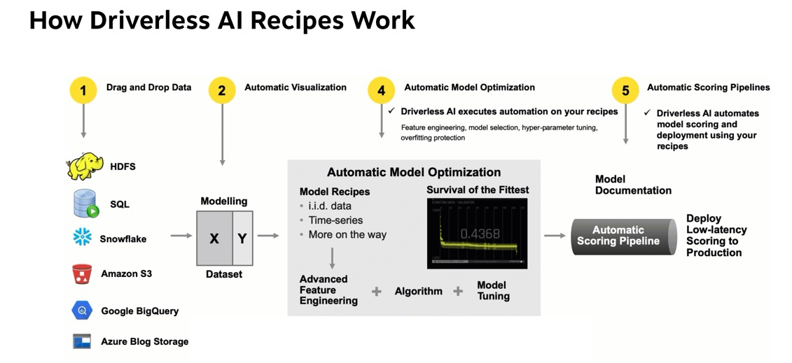
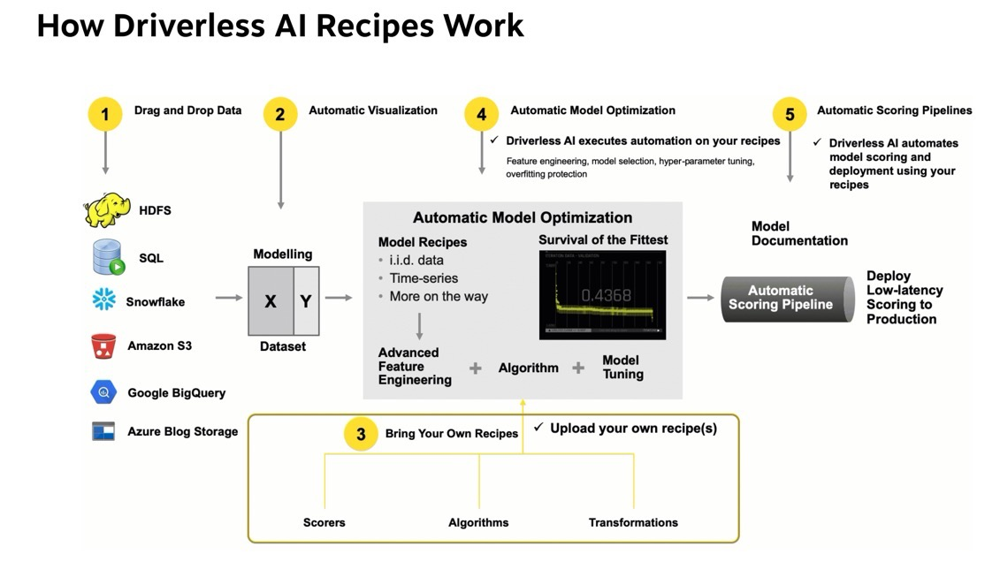
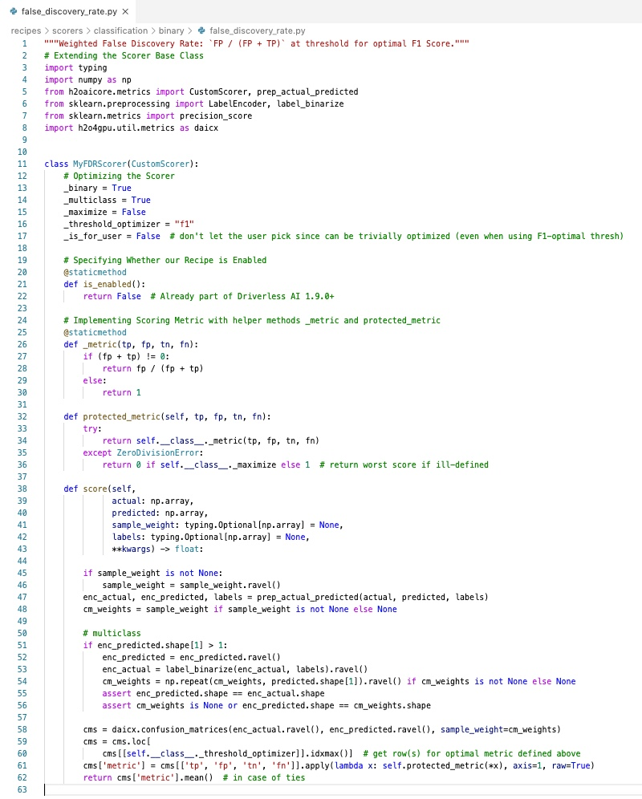
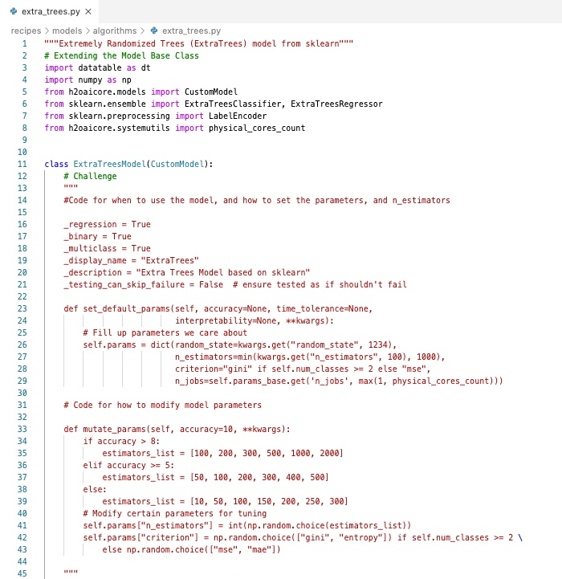
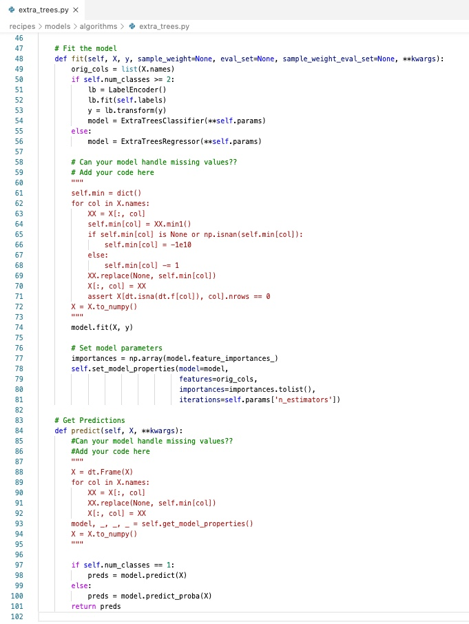

# Build Your Own Custom Recipe Tutorial

## Outline

- [Objective](#objective)
- [Prerequisites](#prerequisites) 
- [Task 1: Driverless AI Bring Your Own Recipes](#task-1-driverless-ai-bring-your-own-recipes)
- [Task 2: Build a Recipe: Transformer](#task-2-build-a-recipe-transformer)
- [Task 3: Build a Recipe: Scorer](#task-3-build-a-recipe-scorer)
- [Task 4: Build a Recipe: Model](#task-4-build-a-recipe-model)
- [Task 5: Troubleshooting](#task-5-troubleshooting)
- [Task 6: Challenge: Write Your Own Recipe](#task-6-challenge-write-your-own-recipe)
- [Next Steps](#next-steps)
- [Appendix A: Download Driverless AI Custom Recipes](#appendix-a-download-driverless-ai-custom-recipes)
- [Appendix B: AI Glossary](#appendix-b-ai-glossary)

## Objective

In this tutorial, we will take a deeper dive into the process of custom recipe building to enhance Driverless AI. We will build three recipes using Visual Studio Code text editor. Each recipe will then be uploaded and tested using Driverless AI.  

Recipes:
- Transformer
- Model
- Scorer 


## Prerequisites

- Basic knowledge of Machine Learning and Statistics

- Ability to write Python Code

- A Two-Hour Test Drive session: Test Drive is H2O.ai's Driverless AI on the AWS Cloud. No need to download software. Explore all the features and benefits of the H2O Automatic Learning Platform.

  - Need a Two-Hour Test Drive session? Follow the instructions on [this quick tutorial](https://training.h2o.ai/products/tutorial-0-getting-started-with-driverless-ai-test-drive) to get a Test Drive session started.


- Basic knowledge of Driverless AI or doing the following tutorials:

  - [Automatic Machine Learning Introduction with Drivereless AI](https://training.h2o.ai/products/tutorial-1a-automatic-machine-learning-introduction-with-driverless-ai)
  - [Get Started with Open Source Custom Recipes Tutorial](https://training.h2o.ai/products/tutorial-3a-get-started-with-open-source-custom-recipes-tutorial) 

- A text editor or developer environment to create .py text files containing source code (Examples: PyCharm, Jupyter, Spider or a Text Editor like Atom or Visual Studio Code)

**Note: Aquarium’s Driverless AI Test Drive lab has a license key built-in, so you don’t need to request one to use it. Each Driverless AI Test Drive instance will be available to you for two hours, after which it will terminate. No work will be saved. If you need more time to further explore Driverless AI, you can always launch another Test Drive instance or reach out to our sales team via the [contact us form](https://www.h2o.ai/company/contact/).**


## Task 1: Driverless AI Bring Your Own Recipes

In the **Get Started and Consume Existing Recipes** Tutorial we covered the following:

- Bring Your Own Recipe (BYOR) for Driverless AI 1.9.0
- What is a recipe?
- Types of Driverless AI open-source recipes available (Transformers, Scorers, and Models)
- How to upload the recipes into Driverless AI using URL’s and .py files
- Compare the final models of the experiments that were run with custom recipes to Driverless AI’s default settings experiment. 

**Note:** If you have not done so, complete the [Get Started with Open Source Custom Recipes Tutorial](https://training.h2o.ai/products/tutorial-3a-get-started-with-open-source-custom-recipes-tutorial), the material covered will be needed for the successful completion of this tutorial.

Just to recap, H2O Driverless AI is an artificial intelligence (AI) platform for automatic machine learning. Driverless AI automates some of the most difficult and tedious data science and machine learning tasks such as feature engineering, algorithm selection, model validation, model tuning, model selection, model explanation, model documentation, and model deployment. It aims to achieve the highest predictive accuracy, comparable to expert data scientists, but in a much shorter time thanks to end-to-end automation.

Driverless AI, version 1.7.0 and newer, allows Domain Scientists to combine their subject matter expertise with the broadness of Driverless by giving Data Scientists the option to upload their own transformers, scorers, and custom datasets. Driverless AI’s Bring Your Own Recipe (BYOR) lets you apply your domain expertise and optimize your specific Driverless AI model(s) with just a few clicks. Driverless AI treats customer recipes as first-class citizens in the automatic machine learning workflow. 

### Driverless AI’s Automatic Machine Learning Workflow

Driverless AI’s Automatic Machine Learning workflow is represented in the image below:



The workflow is as follows; first, we start with tabular data in the format of  X and Y, where X are the predictors and Y the value we want to predict. The data can be brought in from various connectors such as: 

- **HDFS**
- **SQL**
- **Snowflake**
- **Amazon S3**
- **GoogleBigQuery**
- **Google Cloud Storage**
- **Azure Blog Storage**
- **BlueData DataTap**
- **kdp+**
- **Minio**

See **Deeper Dive and Resources** at the end of this task for more information about Enabling Data Connectors.

Once the data has been loaded to Driverless AI, Driverless AI performs Automatic Visualizations of the data and outputs the available graphs for the dataset that is being used. This allows you to have a better understanding of your data. 

The data is then sent through Driverless AI’s Automatic Model Optimization. The Automatic Model Optimization is a generic algorithm that learns over time what is working and what is not to make the best model for your data. This includes model recipes, advanced feature engineering, algorithms (such as Xgboost, TensorFlow, LightGBM), and model tuning. 

After the model has been finalized, Driverless AI then auto-generates model documentation that provides an explanation of everything that happened in the experiment. This model documentation also provides an explanation on how the model that was generated/created makes decisions. Additionally, there is Machine Learning Interpretability of the models generated to explain modeling results in a human-readable format. Once experiments have been completed, Driverless AI automatically generates both Python and Java scoring pipelines so that the model is ready to go for production.

### BYOR

**Bring Your Own Recipe** (BYOR) is part of the Automatic Model Optimization process. It is here that Data scientists, through their subject matter expertise and domain knowledge that they get to augment the Automatic Model Optimization by creating and uploading their own transformations, scorers, and algorithms. Driverless AI allows the uploaded scorers, algorithms, and transformations to compete with the existing Driverless AI recipes and allows the best recipe to be used.



### Recipes

Custom recipes are Python code snippets that can be uploaded into Driverless AI at runtime, like plugins. No need to restart Driverless AI. Custom recipes can be provided for transformers, models, and scorers. During the training of a supervised machine learning modeling pipeline (aka experiment), Driverless AI can then use these code snippets as building blocks, in combination with all built-in code pieces (or instead of). By providing your own custom recipes, you can gain control over the optimization choices that Driverless AI makes to best solve your machine learning problems.

### Python API 

Driverless AI custom recipes allow for full customization of the entire ML pipeline through the scikit learn Python API. The Python API allows for custom feature engineering, custom loss functions, and custom ML Algorithms. This API is based off on how scikit learn works.

When building our custom recipes:

For custom feature engineering or a transformer, you will have two main parts:

**Fit_transform** - takes the X and Y data and changes the X variables(pulls out the year from a date, does arithmetic in multiple columns, target encoding). It can also add new data such as the zip code with the zip code package and bring in population or cities. Custom statistical Transformation Embeddings for numbers, categories, text, date/time, time-series, image audio, zip, latitude/longitude, ICD.

**Transform** - the transform gets called when you run the model and get predictions. The transform will be inside the scoring pipeline. When used in production, the transform will be present and be used in the validation and test sets. The transform does not have access to Y, and it alters the data based on what happened on the fit_transform.

For custom optimization functions or scorers, you can bring loss or gain functions. We can look further into precision and recall of a model through variations of the F metric. Driverless AI comes with F1, F2, and F0.5 scorers, where F1 is the harmonic mean of precision and recall, and the F2 score gives more weight to recall than precision. If you wanted to give precision higher weight, you could incorporate and F4 or F6 function as recipes for scorers.   

Other things that can be done using scorers:
- f(id, actual, predicted, weight)
    - Ranking 
    - Pricing 
    - Yield Scoring
    - Cost/Reward
    - Any Business Metric


For custom ML Algorithms, there are two functions that are needed:

- `fit` - fits the model; this function will give you access to the ML ecosystem: H2O-3 sklearn, Keras, PyTorch, CatBoost, etc. 

- `predict` - makes predictions

### Best Practices for Recipes

Recipes are meant to be built by people you trust, and each recipe should be code-reviewed before going to production. If you decide to make your custom recipes, you can keep them internal or shared them with the Driverless AI team by making a pull request to the Open Source Driverless AI Recipes GitHub Repo. This repo was built and is currently maintained by H2O.ai's Kaggle Grand Masters. All custom recipes will be put through various acceptance tests that include missing values, various examples for binary, and regression to see if your recipe can handle all different types. 

**Take a few minutes to review the recommended best practices for building recipes in terms of:**

- [Security](https://github.com/h2oai/driverlessai-recipes?source=post_page---------------------------#security) 
- [Safety](https://github.com/h2oai/driverlessai-recipes?source=post_page---------------------------#safety) 
- [Performance](https://github.com/h2oai/driverlessai-recipes?source=post_page---------------------------#performance)

**The Writing Recipes Process**

1\. First, write and test your idea on sample data before wrapping as a recipe.

2\. Download the Driverless AI Recipes Repository for easy access to examples.

3\. Use the Recipe Templates to ensure you have all the required components. 

In the next three tasks, we will be building three simple recipes, a transformer, a scorer, and a model. It is assumed that you have downloaded the [Driverless AI Recipes Repository rel-1.9.0](https://github.com/h2oai/driverlessai-recipes/tree/rel-1.9.0) and that you have access to the examples and recipe templates.

**Note**: The recipes that you will find in the "Driverless AI Recipes Repository rel 1.9.0," may  be slightly different to the ones being referenced in this tutorial. If you decide to build the recipes using the code from this tutorial or the code found on the repository you should be able to still run the various experiments.

### Deeper Dive and Resources

- [H2O’s Enabling Data Connectors ](http://docs.h2o.ai/driverless-ai/latest-stable/docs/userguide/connectors.html?highlight=connectors) 

- [H2O’s The Driverless AI Scoring Pipelines](http://docs.h2o.ai/driverless-ai/latest-stable/docs/userguide/python-mojo-pipelines.html#scoring-pipeline) 

## Task 2: Build a Recipe: Transformer

A **transformer** (or feature) recipe is a collection of programmatic steps, the same steps that a data scientist would write a code to build a column transformation. The recipe makes it possible to engineer the transformer in training and in production. The transformer recipe and recipes, in general, provides a data scientist the power to enhance the strengths of DriverlessAI with custom recipes. These custom recipes would bring in nuanced knowledge about certain domains - i.e. financial crimes, cybersecurity, anomaly detection. etc. It also provides the ability to extend DriverlessAI to solve custom solutions for time-series[1].

### Where can Driverless AI Transformers be Used? 

- **A retailer** could forecast annual sales based on seasonality, weather, and Ramadan holidays for its stores in Saudi Arabia. 

- **A network analytics company** can improve its anti-IP-spoofing functionality by parsing IP addresses and checking if any of the properties look like a spam or a DoD attack.

- **A financial services company** could calculate the historical volatility of markets in a configurable rolling time-window on time-series financial data.

- Suppose you have a string column that has values like "A:B:10:5", "A:C:4:10", ... It might make sense to split these values by ":" and create four output columns, potentially all numeric, such as [0,1,10,5], [0,2,4,10], ... to encode the information more clearly for the algorithm to learn better from.
 
- Flair Embedding transformer powered by PyTorch for [text similarity analysis](https://github.com/h2oai/driverlessai-recipes/blob/rel-1.9.0/transformers/nlp/text_embedding_similarity_transformers.py), computes a similarity score for any given two text input columns using Sklearn metrics pairwise cosine similarity.
 
- ARIMA transformer that does [time-series forecasting](https://github.com/h2oai/driverlessai-recipes/blob/rel-1.9.0/transformers/timeseries/auto_arima_forecast.py) by predicting target using ARIMA models
 
- Data augmentation, such as replacing a zip code with demographic information, or replacing a date column with a [National holiday flag](https://github.com/h2oai/driverlessai-recipes/blob/rel-1.9.0/transformers/augmentation/singapore_public_holidays.py).
 
**Driverless AI has transformer recipes for the following categories:**

- Augmentation 
- DateTime
- Executables
- Generic
- Geospatial
- Hierarchical
- Image
- NLP
- Numeric
- Outliers
- Recommendations
- Signal Processing
- Speech
- String
- Survival
- TargetCoding
- TimeSeries

See the **Deeper Dive and Resources** at the end of this task to learn more about the Driverless AI Transformers GitHub Repo and more.

### Custom Transformer Recipe

The custom transformer that we will build is the **Summation of multiple Columns**. Driverless AI comes with mathematical interactions between two columns. Mathematical interactions such as addition, subtraction, multiplication, and division. What if you wanted to do a mathematical interaction of 3 or more columns?

This transformer recipe will add three or more numeric columns and give the sum. For instance, it would take the values of X1, X2, and X3 to add them and give the Sum which might be predictive in our model.

| ID | X1| X2| X3| SUM|
| --- | --- | --- | --- | --- |
| 1 | 10 | 5| 3 | 18 |
| 2 | 1 | 2 | 3 | 6 |
| 3 | 0 | 9 | 0 | 9 |
| 4 | 1.3 | 7 | 2 |10.3 |

### Essentials to building a Transformer

These are the main steps in building our transformer:

1. Extending the Transformer Base Class
2. Specifying whether our recipe is enabled
3. Specifying whether to do acceptance tests 
4. Select which columns can be used
5. Transform the training data
6. Transform the validation or testing data
7. When to use the transformer

If you want to see the **overall Sum Transformer code** for some guidance, look at the end of this task to verify your code is aligned correctly.

### Extending the Transformer Base Class

Let's start by creating a transformer recipe class in Python called **SumTransformer** that inherits from the **CustomTransformer** Base Class. This transformer will be responsible for computing the **Summation of multiple Columns**.

1\. Open your text editor and create a new file.

2\. Save the new file as **sum.py**

3\. Copy and paste the following code into your .py file.

The python code for **Extending the Transformer Base Class** is as follows:

~~~python
"""Adds together 3 or more numeric features"""				
from h2oaicore.transformer_utils import CustomTransformer 
import datatable as dt
import numpy as np

class SumTransformer(CustomTransformer):
~~~

The `SumTransformer` class inherits from the `CustomTransformer` Base Class. Prior to creating the `SumTransformer` class, we import the necessary modules:

- CustomTransformer Class - which is part of Driverless AI transformer_utils
- numpy
- datatable

There are two types of Base Classes for a transformer the genetic custom transformer and the more specialized custom TimeSeries Transformer.

- In the generic **CustomTransformer** function, the base class is used for most data transformations, including augmentation, like special holidays. The **CustomTransformer** function is the transformer that will be used the majority of the time. 
- The **CustomTimeSeriesTransformer** function extends the **CustomTransformer** and allows for updating of historical values. This function is very specific to Time Series, such as Facebook Prophet or ARIMA.

### Specifying Whether our Recipe is Enabled

We will let Driverless AI know our recipe is enabled.

4\. Copy and paste the following code below the `Extending the Transformer Base Class` section of code in your .py file.

The python code for **Specifying Whether our Recipe is Enabled** is as follows:

~~~python
@staticmethod
def is_enabled():
    return True
~~~

The `is_enabled` method returns that our recipe is enabled. If this method returns False, our recipe is disabled and the recipe will be completely ignored.

### Specifying Whether to do Acceptance Tests

We will let Driverless AI know to do acceptance tests during the upload of our recipe.

5\. Copy and paste the following code below the `Specifying Whether our Recipe is Enabled` section of code in your .py file.

The python code for **Specifying Whether to do Acceptance Tests** is as follows:

~~~python
@staticmethod
def do_acceptance_test():
    return True
~~~

The `do_acceptance_test` method returns that acceptance tests should be performed during the upload of our recipe. Acceptance tests perform a number of sanity checks on small data, and attempt to provide helpful instructions for how to fix any potential issues. If our recipe required specific data or did not work on random data, then this method should return False, so acceptance tests are not performed.

### Select Which Columns to Use 

We will let Driverless AI know which columns can be used with this transformer. 

6\. Copy and paste the following code below the `Specifying Whether to do Acceptance Tests` section of code in your .py file.

The python code for **Selecting Which Columns to Use** is as follows:

~~~python
@staticmethod
def get_default_properties():
	  return dict(col_type="numeric", min_cols=3, max_cols="all", relative_importance=1)
~~~

The `get_default_properties` method returns a dictionary that states this transformer accepts **numeric** int/float column(s) with a minimum number of **3** columns accepted to a maximum number of **all** columns accepted as input and has a relative importance of **1** in terms of priority in the generic algorithm.

The table below shows the type of original column(s) that a transformer can accept:

| Column Type (str) | Description |
|:-----------------|:-----------|
| "all" | all column types |
| "any" | any column types |
| "numeric" | numeric int/float column |
| "categorical" | string/int/float column considered a categorical for feature engineering |
| "numcat" | allow both numeric or categorical |
| "datetime" | string or int column with raw datetime such as `%Y/%m/%d %H:%M:%S` or `%Y%m%d%H%M` |
| "date" | string or int column with raw date such as `%Y/%m/%d` or `%Y%m%d` |
| "text" | string column containing text (and hence not treated as categorical) |
| "time_column" | the time column specified at the start of the experiment (unmodified) |

After selecting the column type, we will select the minimum and the maximum number of columns. Since Driverless AI comes with a transformer that is able to sum two columns, we will set the minimum number of columns to `3` and the maximum number of columns to all for our transformer. This means that when Driverless AI runs our transformer, it will always choose between `3` and all columns. 

The relative importance will be set to 1 for the most part; however, if you want your custom transformer to have higher importance, you can always increase the value of importance which will let Driverless AI know that your custom transformer should have a higher priority in the generic algorithm through `relative_importance`.

### Transforming the Training Data

We are going to fit the transformer on the training data and return a transformed frame with new features that have the same number of rows and any number of columns greater than or equal to 1.

7\. Copy and paste the following code below the `Select Which Columns to Use` section of code in your .py file.

The python code for **Transforming Training Data** is as follows:

~~~python
def fit_transform(self, X: dt.Frame, y: np.array = None):
    return self.transform(X)					
~~~

The `fit_transform` method fits the transformer on the training data `X`, which is a datatable of n rows and m columns between min_cols and max_cols specified in `get_default_properties` method, defaults the target column `y` parameter to None for API compatiblity and returns a transformed datatable frame with new features. This transformed frame will be passed onto the predictors.

- training data `X` is by default a datatable, but can be converted to pandas via `X.to_pandas()` or numpy via `X.to_numpy()`
- the function can return datatable, pandas or numpy transformed frame because Driverless AI can automatically manage any of them.

**Note:** 

The `fit_transform` method is always called before the `transform` method is called. The output can be different based on whether the `fit_transform` method is called on the entire frame or on a subset of rows. The output must be in the same order as the input data. 

### Transforming the Validation or Testing Data

We are going to transform the validation or testing data on a row-by-row basis.

8\. Copy and paste the following code below the `Transforming the Training Data` section of code in your .py file.

The python code for **Transforming Testing Data** is the following method:

~~~python										
def transform(self, X: dt.Frame):
	return X[:, dt.sum([dt.f[x] for x in range(X.ncols)])]
~~~

The `transform` method selects all columns using [datatable f-expression](https://datatable.readthedocs.io/en/latest/manual/f-expressions.html) single-column selector in each row, performs the summation on each column in that row, performs this computation until the summation of all columns on each row has finished and returns the same number of rows as the original frame, but with one column in each row equalling the summation. The transformed frame will be passed onto the predictors.

- training data `X` is by default a datatable, but can be converted to pandas via `X.to_pandas()` or numpy via `X.to_numpy()`
- the function can return datatable, pandas or numpy transformed frame because Driverless AI can automatically manage any of them.

**Note:** In a lot of cases, the `fit_transform` and `transform` function will be doing the exact same thing, they will not be using the y-value. If the “y” is needed, then the code for both functions might differ (ie. time series).

### When to Use the Transformer

The last part of the code that will be added will determine when this transformer should be used. 

9\. Copy and paste the following code below the `class SumTransformer(CustomTransformer):` section of code in your .py file.

The python code for **When to Use the Transformer** is as follows:

~~~python
_regression = True
_binary = True
_multiclass = True
_numeric_output = True
_is_reproducible = True
_included_model_classes = None  # List[str]
_excluded_model_classes = None  # List[str]
_testing_can_skip_failure = False  # ensure tested as if shouldn't fail
~~~

When writing transformers, we need to ask ourselves the following types of questions:

- What types of ML supervised problems are allowed for my custom transformer? There will be situations where it will not be appropriate to use this transformer, so we need to specify what types of ML problems are allowed for this transformer? For our Sum Transformer, the ML cases below are always applicable; therefore, we set the following variable values to True. 

  - `_regression = True`
  - `_binary = True`
  - `_multiclass = True`

- Does the transformer return a number? There are some models that can’t take strings as values, for example, GLM, so we need to be explicit about whether or not the output will be numeric or not. In our case, the output is always numeric; therefore, we set **Numeric Output** variable value to True.

  - `_numeric_output = True`

- Is this function reproducible, Driverless AI has the ability to recreate models which you can run on the same hardware and get the exact same features, scores, etc. If the transformer is not reproducible, then we need to let Driverless AI know that the transformer is not reproducible so that users know not to expect that for this particular transformer is used in a model. In our case, this transformer is reproducible, and we set the **is_reproducible** variable to True.

  - ```is_reproducible= True```

- Are there models that need to be included or excluded? Maybe the transformer will not be able to work with TensorFlow, or it only works with TensorFlow. If there are models that are to be included or excluded, then we write the list as strings.
In our case there are no models that we need to exclude so we set the value to None to the two variables below:
  - ```_included_model_classes = None```
  - ```_excluded _model_classes = None```

- Can testing skip failure for this transformer? If you set this variable to True, then you are saying it is okay for the test to skip failure for when a transformer failed. For the case of our transformer, we set th **_testing_can_skip_failure** to False because we want to ensure that our tested transformer should not fail.

- `_testing_can_skip_failure = False`

### All the Custom Transformer Recipe Code

Your text editor should look similar to the page below:


In case you want to copy and paste all the code to test it out:

~~~python
"""Adds together 3 or more numeric features"""
# Extending the Transformer Base Class
from h2oaicore.transformer_utils import CustomTransformer
import datatable as dt
import numpy as np


class SumTransformer(CustomTransformer):
    # When to Use the Transformer
    _regression = True
    _binary = True
    _multiclass = True
    _numeric_output = True
    _is_reproducible = True
    _included_model_classes = None  # List[str]
    _excluded_model_classes = None  # List[str]
    _testing_can_skip_failure = False  # ensure tested as if shouldn't fail

    # Specifying Whether our Recipe is Enabled
    @staticmethod
    def is_enabled():
        return True

    # Specifying Whether to do Acceptance Tests
    @staticmethod
    def do_acceptance_test():
        return True

    # Select Which Columns to Use 
    @staticmethod
    def get_default_properties():
        return dict(col_type="numeric", min_cols=3, max_cols="all", relative_importance=1)

    # Transforming the Training Data
    def fit_transform(self, X: dt.Frame, y: np.array = None):
        return self.transform(X)

    # Transforming the Validation or Testing Data
    def transform(self, X: dt.Frame):
        return X[:, dt.sum([dt.f[x] for x in range(X.ncols)])]

~~~

### Challenge

The final step in building the custom transformer recipe is to upload the custom recipe to Driverless AI and check that it passes the **acceptance test**. If your recipe is not passing the Driverless AI’s acceptance test, see  [Task 5: Troubleshooting](https://training.h2o.ai/products/tutorial-3b-build-your-own-custom-recipe-tutorial).

Take the new custom **SumTransformer** and test it in a dataset of your choice.

**Note:** The dataset needs to have more than three quantitative columns that can be added together


If you have questions on how to upload the transformer recipe to Driverless AI, see  [“Get Started with Open Source Custom Recipes Tutorial - Task 3: Recipe: Transformer”](https://training.h2o.ai/products/tutorial-3a-get-started-with-open-source-custom-recipes-tutorial).


### References

[1] [How to write a Transformer Recipe for Driverless AI by Ashrith Barthur](https://github.com/h2oai/driverlessai-recipes/tree/rel-1.9.0/how_to_write_a_recipe)


### Deeper Dive and Resources

- [Driverless AI Transformers Repo](https://github.com/h2oai/driverlessai-recipes/tree/rel-1.9.0/transformers) 

- [BYOR Transformer Template](https://github.com/h2oai/driverlessai-recipes/blob/rel-1.9.0/transformers/transformer_template.py) 

- [How to Debug a Transformer](https://github.com/h2oai/driverlessai-recipes/blob/rel-1.9.0/transformers/how_to_debug_transformer.py)

- [How to Test a Transformer from the PyClient](https://github.com/h2oai/driverlessai-recipes/blob/rel-1.9.0/transformers/how_to_test_from_py_client.py) 

- [Driverless AI Expert Settings - Transformers PDF](assets/PDF_Transformers.pdf)

- [Flair NLP Framework](https://github.com/flairNLP/flair)

- [PyTorch](https://pytorch.org/)

- [Sklearn Metrics Pairwise Cosine Similarity](https://scikit-learn.org/stable/modules/generated/sklearn.metrics.pairwise.cosine_similarity.html)

## Task 3: Build a Recipe: Scorer

A scorer recipe helps evaluate the performance of your model. There are many methods of evaluating performance and Driverless AI has many scorers available by default; however, if you want to test a different scorer for your particular model then **BYOR** is an excellent way of testing a particular scorer and then compare the model results through Driverless AI’s [Project Workspace](http://docs.h2o.ai/driverless-ai/latest-stable/docs/userguide/projects.html?highlight=projects) feature.

**Note**: Driverless AI will compare the scorer you uploaded with the existing scorers and will select the best scorer fit for your dataset. If your scorer was not selected as the default scorer by Driverless AI in your experiment and you still would like to see how your dataset would perform with your scorer recipe, you can manually select your scorer in the **Experiments Page** under **Scorers**.

### Where can scorers be used?

- **An oil and gas company** could predict oil-well output by developing a time-series regression model and use the Mean Absolute Scaled Error recipe to measure the accuracy of the forecasted output.

- **A transportation and logistics company** could use the precision-recall classification recipe to accurately predict the on-time delivery of perishable products by tweaking the threshold depending upon weather conditions.

- **A marketing and lead-gen company** could improve the effectiveness of its products by accurately predicting its ROI for its customers, using the marketing campaign scorer recipe.

- Maybe you want to use Median Absolute Error to optimize your predictions for the [top decile](https://github.com/h2oai/driverlessai-recipes/blob/rel-1.9.0/scorers/regression/top_decile.py) for a regression problem.
 
- Maybe you care about the weighted [false discovery rate](https://github.com/h2oai/driverlessai-recipes/blob/rel-1.9.0/scorers/classification/binary/false_discovery_rate.py) at threshold for optimal F1 score for a binary classification problem.

Driverless AI has Scorer recipes for the following categories:

- Classification
- Regression 

### Custom Scorer Recipe

The custom **scorer** that will be built in this section is a **"False Discovery Rate"** scorer. This scorer works in binary classification problems where a model will predict what two categories(classes) the elements of a given set belong to. The results of the model can be classified as **True** or **False**. However, there will be elements that will be classified as **True** even though they are actually **False**. Those elements are called Type I Errors (reverse precision) or **False Positives**.  Our **False Discovery Rate** scorer will use the **False Positive Rate** equation to obtain the percentage of False Positives out of all the elements that were classified as **Positive**:

**False Positive Rate (FPR)** = False Positives/(False Positives + True Negatives) = FP/(FP + TN)
            
The **False Positive Rate** is the algorithm where all the elements that were incorrectly classified (False Positives) will be divided by the sum of all the elements that were correctly classified (True Positives) and incorrectly classified (False Positives).

If you would like to review or learn more about binary classification in Driverless AI, view our [Machine Learning Experiment Scoring and Analysis Tutorial - Financial Focus](https://training.h2o.ai/products/tutorial-1b-machine-learning-experiment-scoring-and-analysis-tutorial-financial-focus). 

### Essentials to Building a Scorer

1. Extending the Scorer Base Class
2. Specifying whether our recipe is enabled
3. Implementing the Scoring Metric
4. Optimizing a Scorer

If you want to see the **overall False Discovery Rate Scorer code** for some guidance, look at the end of this task to verify your code is aligned correctly.

### Extending the Scorer Base Class

Let's start by creating a scorer recipe class in Python called **MyFDRScorer** that inherits from the **CustomScorer** base class. This scorer will be responsible for computing the **False Discovery Rate**.

1\. Open your text editor and create a new file.

2\. Save  the new file as `false_discovery_rate.py`

3\. Copy and paste the code above into your .py file.

The python code for **Extending the Scorer Base Class** is a follows:

~~~python	
"""Weighted False Discovery Rate: `FP / (FP + TP)` at threshold for optimal F1 Score."""
import typing
import numpy as np
from h2oaicore.metrics import CustomScorer, prep_actual_predicted
from sklearn.preprocessing import LabelEncoder, label_binarize
from sklearn.metrics import precision_score
import h2o4gpu.util.metrics as daicx

class MyFDRScorer(CustomScorer):
~~~

The `MyFDRScorer` class inherits from the `CustomScorer` Base Class. Unlike transformers, there is only a single base class for scorers, and it’s called **CustomScorer**. Prior to creating the `MyFDRScorer` class, we import the necessary modules:

- typing
- numpy
- CustomScorer Class - which is part of Driverless AI metrics
- LabelEncoder Class - which is part of Sklearn preprocessing
- prep_actual_predicted method - which is part of Driverless AI metrics
    - encodes predicted data and behind the scenes it uses `LabelEncoder` to encode the actual values from target column and labeled data
- label_binarize method - which is part of Sklearn preprocessing
    - only used in multiclass classification to extend Sklearn regression and binary classification algorithms to  multi-class classification
- precision_score method - which is part of Sklearn metrics
- h2o4gpu util metrics
    - uses `confusion_matrices` method to compute confusion matrices for ROC analysis for all possible prediction thresholds. We use it to assist us with calculating the number of True Positives, False Positives, True Negatives, and False Negatives.

### Specifying Whether our Recipe is Enabled

We will let Driverless AI know our recipe is enabled.

5\. Copy and paste the following code below the `Extending the Scorer Base Class` section of code in your .py file.

The python code for **Specifying Whether our Recipe is Enabled** is as follows:

~~~python
@staticmethod
def is_enabled():
    return False  # Already part of Driverless AI 1.9.0+
~~~

The `is_enabled` method returns when our recipe is enabled. If this method returns False, our recipe is disabled and the recipe will be completely ignored.

### Implementing Scoring Metric

We are going to compute a score from the actual and predicted values by implementing the scoring function.

6\. Copy and paste the following code below the `Specifying Whether our Recipe is Enabled` section of code in your .py file.

The code for **Implementing Scoring Metric** is below:

~~~python
@staticmethod
def _metric(tp, fp, tn, fn):
    if (fp + tp) != 0:
        return fp / (fp + tp)
    else:
        return 1

def protected_metric(self, tp, fp, tn, fn):
    try:
        return self.__class__._metric(tp, fp, tn, fn)
    except ZeroDivisionError:
        return 0 if self.__class__._maximize else 1  # return worst score if ill-defined

def score(self,
          actual: np.array,
          predicted: np.array,
          sample_weight: typing.Optional[np.array] = None,
          labels: typing.Optional[np.array] = None,
          **kwargs) -> float:

    if sample_weight is not None:
        sample_weight = sample_weight.ravel()
    enc_actual, enc_predicted, labels = prep_actual_predicted(actual, predicted, labels)
    cm_weights = sample_weight if sample_weight is not None else None

    # multiclass
    if enc_predicted.shape[1] > 1:
        enc_predicted = enc_predicted.ravel()
        enc_actual = label_binarize(enc_actual, labels).ravel()
        cm_weights = np.repeat(cm_weights, predicted.shape[1]).ravel() if cm_weights is not None else None
        assert enc_predicted.shape == enc_actual.shape
        assert cm_weights is None or enc_predicted.shape == cm_weights.shape

    cms = daicx.confusion_matrices(enc_actual.ravel(), enc_predicted.ravel(), sample_weight=cm_weights)
    cms = cms.loc[
        cms[[self.__class__._threshold_optimizer]].idxmax()]  # get row(s) for optimal metric defined above
    cms['metric'] = cms[['tp', 'fp', 'tn', 'fn']].apply(lambda x: self.protected_metric(*x), axis=1, raw=True)
    return cms['metric'].mean()  # in case of ties
~~~

The `score` method has four input arguments:

1. **actual**: an array of actual values from the target column.
    - If the raw data is text, then the array will be an array of text.
2. **predicted**: an array of predicted numeric values.
    - For regression problems, then the **predicted** value will be a value that is appropriate for your feature space.
    - For binary classification problems, the **predicted** value would be a numeric column with values between 0 and 1.  The **predicted** value represents how likely it is for an object to belong to one class. 
    - For multi-classification problems, the **predicted** value would be multiple numeric values that represent the probabilities for every class. 
3. **sample_weight**: allows for some rows to be given higher importance than other rows.
    - The sample_weight column is usually assigned by the user when setting up the Driverless AI experiment.
4. **label**: a list of class labels that help with labeling data for classification problems .

The `score` method starts by overwriting the `sample_weight` multidimensional array with a contiguous flattened 1D array if the sample_weight is not none. Then `prep_actual_predicted` method encodes the predicted data and behind the scenes it uses the `LabelEncoder` to encode the actual values from target column and the labeled data. The `LabelEncoder` helps label the data so that the values are 0 or 1 instead of being between 0 and 1. The False Discovery Rate needs values of 0 or 1; therefore, all the **actual**  and **predicted** values will be labeled 0 or 1. The `cm_weights` are assigned the sample_weight if the sample_weight is not none, else the `cm_weights` are assigned none.

Then there is a check to account for if we are dealing with a multiclass classification problem. But since we are dealing with binary classification, we will skip explaining what happens if the check on `enc_predicted` array's column number is greater than 1 is true.

Next h2o4gpu's confusion matrices will be called `cms = daicx.confusion_matrices(enc_actual.ravel(), enc_predicted.ravel(), sample_weight=cm_weights)` to compute the confusion matrices for ROC analysis for all possible prediction thresholds. We will then get the rows for the optimal metric `f1`, which you will see in the next section is the optimizer defined by variable `_threshold_optimizer = f1`. Then we will use cms to get the true negatives(tn), false positives(fp), false negative(fn) and true positives(tp) from those rows.

Afterward the prediction thresholds for `tp`, `fp`, `tn` and `fn` are passed from the `cms` confusion matrices to the `protected_metric` method inside the lambda function, which is then passed to the `_metric` method where the **False Positive Rate** of `fp/(fp + tp)` is computed as long as the sum of `fp + tp` does not equal `0`. If that sum does equal zero (meaning division by zero) then the `_metric` method returns a `1`.Thus, the `_metric` method returns the **False Positive Rate** to the `protected_metric` method, which returns it to the lambda function, which assigns it to `cms['metric']`.  

Finally, this `score` method will return the mean float score via `return cms['metric'].mean()`. This is the number we are trying to optimize, which can be a high or low value.

### Optimizing the Scorer

Let's define for Driverless AI what makes a good scorer and when to use it. 

7\. Copy and paste the following code below the `class MyFDRScorer(CustomScorer):` section of code in your .py file

The python code for **optimizing the scorer**

~~~python
_binary = True
_multiclass = True
_maximize = False
_threshold_optimizer = "f1"
_is_for_user = False  # don't let the user pick since can be trivially optimized (even when using F1-optimal thresh)
~~~

Here are some questions we are going answer based on our optimization variable values, so Driverless AI will know what is appropriate for this scorer.

**What is the problem type this scorer applies to?**

We set `_binary` to True, so that this scorer applies to binary classification problem types. Also, `_multiclass` is set to True, so this scorer can also handle multiclass classification problem types. We will be using scorer to work with binary classification problems.

**Is a higher or smaller score value better?**

The perfect model for binary classification would have no false positives; for this reason, `_maximize` is set to False since we want the scorer to get as close as possible to zero. This will tell Driverless AI to stop working after it found a model that had a score of zero. Meaning that if Driverless AI was supposed to create 200 models, and on the 100th model, the score is zero, there is no need for Driverless AI to keep working to searching for more perfect models. This optimization helps save the CPU.

**What is threshold optimizer for binary classification?**

We set `_threshold_optimizer` to `f1` scorer metric. This means that our False Discovery Rate scorer uses `f1` optimal metric to get rows from the confusion matrices.

**Is the scorer for the user?**

The `_is_for_user` variable is set to False, so users won't have to pick since the scorer can be optimized even when using F1 optimal threshold.

### All the Custom Scorer Recipe Code

Your text editor should look similar to the page below:



In case you want to copy and paste all the code to test it out:

~~~python
"""Weighted False Discovery Rate: `FP / (FP + TP)` at threshold for optimal F1 Score."""
# Extending the Scorer Base Class
import typing
import numpy as np
from h2oaicore.metrics import CustomScorer, prep_actual_predicted
from sklearn.preprocessing import LabelEncoder, label_binarize
from sklearn.metrics import precision_score
import h2o4gpu.util.metrics as daicx


class MyFDRScorer(CustomScorer):
    # Optimizing the Scorer
    _binary = True
    _multiclass = True
    _maximize = False
    _threshold_optimizer = "f1"
    _is_for_user = False  # don't let the user pick since can be trivially optimized (even when using F1-optimal thresh)

    # Specifying Whether our Recipe is Enabled
    @staticmethod
    def is_enabled():
        return False  # Already part of Driverless AI 1.9.0+

    # Implementing Scoring Metric with helper methods _metric and protected_metric
    @staticmethod
    def _metric(tp, fp, tn, fn):
        if (fp + tp) != 0:
            return fp / (fp + tp)
        else:
            return 1

    def protected_metric(self, tp, fp, tn, fn):
        try:
            return self.__class__._metric(tp, fp, tn, fn)
        except ZeroDivisionError:
            return 0 if self.__class__._maximize else 1  # return worst score if ill-defined

    def score(self,
              actual: np.array,
              predicted: np.array,
              sample_weight: typing.Optional[np.array] = None,
              labels: typing.Optional[np.array] = None,
              **kwargs) -> float:

        if sample_weight is not None:
            sample_weight = sample_weight.ravel()
        enc_actual, enc_predicted, labels = prep_actual_predicted(actual, predicted, labels)
        cm_weights = sample_weight if sample_weight is not None else None

        # multiclass
        if enc_predicted.shape[1] > 1:
            enc_predicted = enc_predicted.ravel()
            enc_actual = label_binarize(enc_actual, labels).ravel()
            cm_weights = np.repeat(cm_weights, predicted.shape[1]).ravel() if cm_weights is not None else None
            assert enc_predicted.shape == enc_actual.shape
            assert cm_weights is None or enc_predicted.shape == cm_weights.shape

        cms = daicx.confusion_matrices(enc_actual.ravel(), enc_predicted.ravel(), sample_weight=cm_weights)
        cms = cms.loc[
            cms[[self.__class__._threshold_optimizer]].idxmax()]  # get row(s) for optimal metric defined above
        cms['metric'] = cms[['tp', 'fp', 'tn', 'fn']].apply(lambda x: self.protected_metric(*x), axis=1, raw=True)
        return cms['metric'].mean()  # in case of ties

~~~

### Challenge

The final step in building the custom scorer recipe is to upload the custom recipe to Driverless and check that it passes the **acceptance test**. If your recipe is not passing the Driverless AI’s acceptance test, see  [Task 5: Troubleshooting](https://training.h2o.ai/products/tutorial-3b-build-your-own-custom-recipe-tutorial).

Take the false_discovery_rate scorer and test it in a dataset of your choice.

**Note:** The dataset needs to be for a binary classification problem

If you have questions on how to upload the scorer recipe to Driverless AI, see  [“Get Started with Open Source Custom Recipes Tutorial - Task 4: Recipe: Scorer”](https://training.h2o.ai/products/tutorial-3a-get-started-with-open-source-custom-recipes-tutorial).

### Deeper Dive and Resources

- [Driverless AI Scorers Repo](https://github.com/h2oai/driverlessai-recipes/tree/rel-1.9.0/scorers)

- [BYOR Scorer Template](https://github.com/h2oai/driverlessai-recipes/tree/rel-1.9.0/scorers)

- [Driverless AI Project Workspace](http://docs.h2o.ai/driverless-ai/latest-stable/docs/userguide/projects.html?highlight=projects)

- [Sklearn Preprocessing label_binarize](https://scikit-learn.org/stable/modules/generated/sklearn.preprocessing.label_binarize.html)


## Task 4: Build a Recipe: Model 

A model recipe is a recipe for a machine learning technique that can be used to build prediction models. Driverless AI has an extensive list of models by default; however, a new model can be loaded and be used to compare the Driverless AI models. Current Driverless models can be enhanced or slightly modified. Just like with the scorer’s recipes, you can compare the results of the model recipe you created with the model that Driverless AI selected for your dataset through  Driverless AI’s [Project Workspace](http://docs.h2o.ai/driverless-ai/latest-stable/docs/userguide/projects.html?highlight=projects) feature.

**Note**: Driverless AI will compare the model you uploaded with the existing models and will select the best model fit for your dataset. If the model was not selected as the top model by Driverless AI and you still would like to see how your dataset would perform with your model recipe, you can turn off all default models in Driverless AI and only select your model. 


Where can models be used? 

- An insurance provider could recommend the right insurance product to its customers by building a gradient boost model based on the CatBoost algorithm recipe.

 - A media television company could use the historic mean time-series recipe to smooth out the distribution graph of the number of viewers throughout a busy sports tournament by breaking the entire season in discrete time windows.

- A sports and entertainment event broadcast company could do NLP for specific Twitter handles and hashtags, and classify sentiments of every event using the Intel DAAL models, enabling them to be smart about targeting demographics.

- All H2O-3 Algorithms including H2O AutoML

- Yandex CatBoost gradient boosting
 
- A custom loss function for LightGBM or XGBoost


Driverless AI has Model recipes for the following categories:

- Algorithms
- Custom Loss
- NLP
- Time Series

### Custom Model Recipe 

Models are complex and harder to build; therefore, in this tutorial, we will build a high-level model to understand the general mechanics of building a model. <!--There will be additional information at the end of this task to help you learn more about custom model making and how to get started.--> 

The custom model that we will build is sklearn’s **Extra Trees** or extremely randomized trees model from Sklearn. There is Extra Trees for classification `ExtraTreeClassifier`[1] and regression `ExtraTreeRegressor` [2].

From scikit learn:

“An extra-trees classifier.
This class implements a meta estimator that fits a number of randomized decision trees (a.k.a. extra-trees) on various sub-samples of the dataset and uses averaging to improve the predictive accuracy and control over-fitting.”[1]

“An extra-trees regressor.
This class implements a meta estimator that fits a number of randomized decision trees (a.k.a. extra-trees) on various sub-samples of the dataset and uses averaging to improve the predictive accuracy and control over-fitting.”[2]

This algorithm might give a slightly different prediction compared to other models such as XGboost, or Random Forest and it might be worth trying to see the results.


### Essentials to building a Model

1. Extending the Model Base Class
2. Fit the model 
3. Set details on fit model(set model parameters)
4. Get predictions

If you want to see the **overall ExtraTrees Model code** for some guidance, look at the end of this task to verify your code is aligned correctly.

### Extending the Model Base Class

Let's start by creating a model recipe class in Python called **ExtraTreesModel** that inherits from the **CustomModel** base class.

1\. Open your text editor and create a new file

2\. Save  the new file as `extra_trees.py`

3\. Copy and paste the following code into your .py file.

The python code for **Extending the Model Base Class** is as  follows:

~~~Python
"""Extremely Randomized Trees (ExtraTrees) model from sklearn"""
import datatable as dt
import numpy as np
from h2oaicore.models import CustomModel
from sklearn.ensemble import ExtraTreesClassifier, ExtraTreesRegressor
from sklearn.preprocessing import LabelEncoder
from h2oaicore.systemutils import physical_cores_count
 
class ExtraTreesModel(CustomModel):
~~~

The `ExtraTreesModel` class inherits from the `CustomModel` Base Class. Prior to creating the `ExtraTreesModel` class, we import the necessary modules:

- CustomModel Class - which is part of Driverless AI models
- numpy
- datatable
- ExtraTreesClassifier, ExtraTreesRegressor - which is part of Sklearn ensemble
- LabelEncoder Class - which is part of Sklearn preprocessing
- physical_cores_count - which is part of Driverless AI systemutils

There are four types of Base Classes for a model:

1. CustomModel(Genetic Model)
2. CustomTimeSeriesModel
3. CustomTensorFlowModel
4. CustomTimeSeriesTensorFlowModel

As you can see in the code above, we will focus on the Genetic model (CustomModel). Just to note, CustomTimeSeriesModel’s have everything that will be covered in this task plus an update function because Time Series Model needs to know how to look at past data, especially when scoring takes place, and there is new data that needs to be used. If the model that you are working on requires TensorFlow or both TensorFlow and time-series, then the following models are available: CustomTensorFlowModel or CustomTimeSeriesTensorFlowMode. Both models will require their base class to be extended, and there will be additional options for each. 

### Fit the model

4\. Copy and paste the following code below the `Extending the Model Base Class` section of code in your .py file.

The python code for **Fitting the model** is as follows:

~~~Python
def fit(self, X, y, sample_weight=None, eval_set=None, sample_weight_eval_set=None, **kwargs):

        orig_cols = list(X.names)
 
        if self.num_classes >= 2:
           lb = LabelEncoder()
           lb.fit(self.labels)
           y = lb.transform(y)
           model = ExtraTreesClassifier(**self.params)
        else:
           model = ExtraTreesRegressor(**self.params)
           
        # Can your model handle missing values??
        # Add your code here to handle missing values 
        """
        """
        model.fit(X, y)
~~~

The next part of the custom model is to fit the model. This is where the `X` and `y` values will be brought in. If there are rows that have higher importance than others, then a weight column can be added and flagged through the `sample_weight`. Other items that can be incorporated and flagged are: evaluation sets and evaluation set with sample weights.

**The first part of this function is to save the names of all the predictors that came in `orig_cols`.**

An **if-else** statement is then used to tell the function to work with both classification and regression problems; in other words, the extra tree’s model needs to work for every ML problem. The if-else statement states that if there are two or more classes (binary or multiclass), then use the `LabelEncoder` and call the `ExtraTreesClassifier`. If there are less than two classes, then the problem is a regression problem, and the  `ExtraTreesRegressor` is called. At this point, an object model has been created, sklearn’s extra trees, which is appropriate for this particular custom model.

After any algorithm-specific prep work has been done, the model can be fitted via `model.fit(X,y)`.

 **Things to note:**

If the model you are working with is a model that can’t handle missing values, then that needs to be accounted for on your code. Suggestions include printing an error message, removing rows with missing values, or imputing missing values(replace missing values with the median or mode). **Driverless AI only accepts custom models that can handle missing values; therefore, for this task, you need to write your own section to handle missing values or see our recommendation at the end of the section**. 

Here is a some code that you could use to replace missing values with a value smaller than all observed values:

```python
        self.min = dict()
        for col in X.names:
            XX = X[:, col]
            self.min[col] = XX.min1()
            if self.min[col] is None or np.isnan(self.min[col]):
                self.min[col] = -1e10
            else:
                self.min[col] -= 1
            XX.replace(None, self.min[col])
            X[:, col] = XX
            assert X[dt.isna(dt.f[col]), col].nrows == 0
        X = X.to_numpy()
```

### Set details on fit model(set model parameters)

5\. Copy and paste the following code below the `Fitting the model` section of code in your .py file.

The code for **set model parameters** is below:

~~~Python
#Set model parameters
importances = np.array(model.feature_importances_)
 
self.set_model_properties(model=model,
                          features=orig_cols,
                          importances=importances.tolist(),
                          iterations=self.params['n_estimators'])
~~~

After the model has been fit, the next part is to set the model properties. There are four model properties that Driverless AI needs to know:

- **model**: a model object that contains all large fitted objects related to the model, need it to make predictions later.

- **features**: What features were used to create the model? In other words, the list of feature names fitted on. This is the reason that all the features were saved for `orig_cols = list(X.names)`.

- **importance**: list of associated numerical importance of features. Driverless AI uses this list when building the model. See Driverless AI UI for feature importance where the most important features are highlighted. Extra Trees comes with a function feature_importances which takes care of populating this list for Driverless AI by returning that value. Driverless AI needs the list of importances populated, so keep that in mind ff the function that you are using does not return feature importances.

- **iterations**: number of iterations used to predict on or re-use for fitting on full training data(number of models build)

### Get Predictions

The final part is to get the predictions.

6\. Copy and paste the following code below the `#Set model parameters` section of code in your .py file.

The python code for **get predictions** is as follows:

~~~python
#Get predictions
    def predict(self, X, **kwargs):

        #Can your model handle missing values??
        #Add your code here
        """
        """
        if self.num_classes == 1:
           preds = model.predict(X)
        else:
           preds = model.predict_proba(X)
        return preds
~~~

To get the predictions, the `predict()` function is called. The only thing needed to predict at this point is the model. If the predictions can’t handle null values, as is in our case, there needs to be additional code that must be added under `#Can your model handle missing values??`.

Since the model needs to handle both classification and regression scenarios, the if-then statement in the code is used to identify each case. For classification, when the number of classes is 1 then the `model.predict(x)` gets called. Then for regression, the function `model.predict_proba(x)` gets called.

**Things to note:**

If the model you are working with is a model that can’t handle missing values, then that needs to be accounted for on your code. Suggestions include printing an error message, removing rows with missing values, or imputing missing values(replace missing values with the median or mode). **Driverless AI only accepts custom models that can handle missing values**. 

Here is a sample code for handling the missing values in the prediction section:

~~~python
        X = dt.Frame(X)
        for col in X.names:
            XX = X[:, col]
            XX.replace(None, self.min[col])
            X[:, col] = XX
        model, _, _, _ = self.get_model_properties()
        X = X.to_numpy()
~~~

### The Custom Scorer Recipe Code That was Covered So Far

Your text editor should look similar to the page below:





In case you want to copy and paste all the code we have covered so far to test it out:

~~~python
"""Extremely Randomized Trees (ExtraTrees) model from sklearn"""
# Extending the Model Base Class
import datatable as dt
import numpy as np
from h2oaicore.models import CustomModel
from sklearn.ensemble import ExtraTreesClassifier, ExtraTreesRegressor
from sklearn.preprocessing import LabelEncoder
from h2oaicore.systemutils import physical_cores_count


class ExtraTreesModel(CustomModel):
    # Challenge
    """
    #Code for when to use the model, and how to set the parameters, and n_estimators

    _regression = True
    _binary = True
    _multiclass = True
    _display_name = "ExtraTrees"
    _description = "Extra Trees Model based on sklearn"
    _testing_can_skip_failure = False  # ensure tested as if shouldn't fail

    def set_default_params(self, accuracy=None, time_tolerance=None,
                           interpretability=None, **kwargs):
        # Fill up parameters we care about
        self.params = dict(random_state=kwargs.get("random_state", 1234),
                           n_estimators=min(kwargs.get("n_estimators", 100), 1000),
                           criterion="gini" if self.num_classes >= 2 else "mse",
                           n_jobs=self.params_base.get('n_jobs', max(1, physical_cores_count)))

    # Code for how to modify model parameters

    def mutate_params(self, accuracy=10, **kwargs):
        if accuracy > 8:
            estimators_list = [100, 200, 300, 500, 1000, 2000]
        elif accuracy >= 5:
            estimators_list = [50, 100, 200, 300, 400, 500]
        else:
            estimators_list = [10, 50, 100, 150, 200, 250, 300]
        # Modify certain parameters for tuning
        self.params["n_estimators"] = int(np.random.choice(estimators_list))
        self.params["criterion"] = np.random.choice(["gini", "entropy"]) if self.num_classes >= 2 \
            else np.random.choice(["mse", "mae"])

    """

    # Fit the model
    def fit(self, X, y, sample_weight=None, eval_set=None, sample_weight_eval_set=None, **kwargs):
        orig_cols = list(X.names)
        if self.num_classes >= 2:
            lb = LabelEncoder()
            lb.fit(self.labels)
            y = lb.transform(y)
            model = ExtraTreesClassifier(**self.params)
        else:
            model = ExtraTreesRegressor(**self.params)

        # Can your model handle missing values??
        # Add your code here
        """
        self.min = dict()
        for col in X.names:
            XX = X[:, col]
            self.min[col] = XX.min1()
            if self.min[col] is None or np.isnan(self.min[col]):
                self.min[col] = -1e10
            else:
                self.min[col] -= 1
            XX.replace(None, self.min[col])
            X[:, col] = XX
            assert X[dt.isna(dt.f[col]), col].nrows == 0
        X = X.to_numpy()
        """
        model.fit(X, y)

        # Set model parameters
        importances = np.array(model.feature_importances_)
        self.set_model_properties(model=model,
                                  features=orig_cols,
                                  importances=importances.tolist(),
                                  iterations=self.params['n_estimators'])

    # Get Predictions
    def predict(self, X, **kwargs):
        #Can your model handle missing values??
        #Add your code here
        """
        X = dt.Frame(X)
        for col in X.names:
            XX = X[:, col]
            XX.replace(None, self.min[col])
            X[:, col] = XX
        model, _, _, _ = self.get_model_properties()
        X = X.to_numpy()
        """
        
        if self.num_classes == 1:
            preds = model.predict(X)
        else:
            preds = model.predict_proba(X)
        return preds

~~~

### Challenge

The final step in building the custom model recipe is to complete the parts that were left uncompleted. You will need to write a code to determine when to use the model. First, you need to specify if the model should work with a classification or regression case. You can also set a name and description for the model. Second, you need to determine the "n_estimators" and lastly, set up test code for testing for null values or handling missing values, like the examples that were given in each section. Once those are set, then you can upload the custom recipe to Driverless and check that it passes the acceptance test. If your recipe is not passing the Driverless AI's acceptance test, see [Task 5: Troubleshooting](https://training.h2o.ai/products/tutorial-3b-build-your-own-custom-recipe-tutorial).

Here is a sample code that could be used to complete the first task of the challenge:

~~~python
    _regression = True
    _binary = True
    _multiclass = True
    _display_name = "ExtraTrees"
    _description = "Extra Trees Model based on sklearn"
    _testing_can_skip_failure = False  # ensure tested as if shouldn't fail

    def set_default_params(self, accuracy=None, time_tolerance=None,
                           interpretability=None, **kwargs):
                           
     #Fill up parameters we care about
        self.params = dict(random_state=kwargs.get("random_state", 1234),
                           n_estimators=min(kwargs.get("n_estimators", 100), 1000),
                           criterion="gini" if self.num_classes >= 2 else "mse",
                           n_jobs=self.params_base.get('n_jobs', max(1, physical_cores_count)))
~~~

If you need to do parameter tuning after setting your default parameters, here is some code for modifying model parameters. Feel free to try it as is or tune it more:

~~~python
    def mutate_params(self, accuracy=10, **kwargs):
        if accuracy > 8:
            estimators_list = [100, 200, 300, 500, 1000, 2000]
        elif accuracy >= 5:
            estimators_list = [50, 100, 200, 300, 400, 500]
        else:
            estimators_list = [10, 50, 100, 150, 200, 250, 300]
        # Modify certain parameters for tuning
        self.params["n_estimators"] = int(np.random.choice(estimators_list))
        self.params["criterion"] = np.random.choice(["gini", "entropy"]) if self.num_classes >= 2 \
            else np.random.choice(["mse", "mae"])
~~~

Take the extra_tress_model and test it using a dataset of your choice.

If you have questions on how to upload the transformer recipe to Driverless AI, see  [“Get Started with Open Source Custom Recipes Tutorial - Task 5: Recipe: Model”](https://training.h2o.ai/products/tutorial-3a-get-started-with-open-source-custom-recipes-tutorial).

### References

[1] [sklearn Extra Trees Classifier](https://scikit-learn.org/stable/modules/generated/sklearn.ensemble.ExtraTreesClassifier.html)

[2] [sklearn Extra Trees Regressor](https://scikit-learn.org/stable/modules/generated/sklearn.ensemble.ExtraTreesRegressor.html)

### Deeper Dive and Resources

- [Driverless AI Models Repo](https://github.com/h2oai/driverlessai-recipes/tree/rel-1.9.0/models) 
- [BYOR Model Template](https://github.com/h2oai/driverlessai-recipes/blob/rel-1.9.0/models/model_template.py)  

## Task 5: Troubleshooting

When uploading a new recipe to Driverless AI, there are multiple things that can happen:

- The recipe did not make the cut (recipe was not loaded into Driverless AI )
- The recipe made the cut but Driverless did not end up using it for the experiment

###  Recipe did not Make the Cut 

One of the biggest advantages when loading a recipe to Driverless AI is that Driverless AI will subject your recipe to its acceptance tests. If your recipe did not pass the acceptance, Driverless AI will let you know right away if your recipe made the cut. If your recipe did not make the cut you, then you will receive feedback from Driverless AI on how to improve it.  

Other tips:

- Read the entire error message; it most likely contains the stack trace and helpful information on how to fix the problem.
- If you can't figure out how to fix the recipe, we suggest you post your questions in the [Driverless AI community Slack channel](https://www.h2o.ai/slack-community/) 
- You can also send us your experiment logs zip file, which will contain the recipe source files.

How can I debug my recipe?

- The easiest way (for now) is to keep uploading it to the expert settings in Driverless AI until the recipe is accepted.
- Another way is to make minimal changes, as shown in [this debugging example](https://github.com/h2oai/driverlessai-recipes/blob/rel-1.9.0/transformers/how_to_debug_transformer.py) and use PyCharm or a similar Python debugger.


### Recipe Made the Cut to Driverless AI and was not Used in the Experiment

You were able to successfully load your recipe to Driverless AI; however, your recipe was not used by Driverless AI, now what? Driverless AI takes best-fit recipes for your dataset, so if you don’t see your recipe being used, you can manually select your recipe when setting up your Experiment. 

Other tips:

- Don't give up. You learned something.
- Check the logs for failures if unsure whether the recipe worked at all or not.
Driverless AI will ignore recipe failures unless this robustness feature is specifically disabled. Under Expert Settings, disable `skip_transformer_failures`, and `skip_model_failures` if you want to fail the experiment on any unexpected errors due to custom recipes.
- Inside the experiment logs zip file, there's a folder called details, and if it contains .stack files with stack traces referring to your custom code, then you know it bombed.

### The transformer recipe didn’t lead to the highest variable importance for the experiment

That's nothing to worry about. It's unlikely that your features have the strongest signal of all features. Even 'magic' Kaggle grandmaster features don't usually make a massive difference, but they still beat most of the competition.


### Deeper Dive and Resources

- [How do I collect logs? ](https://support.h2o.ai/support/solutions/articles/17000090847-how-do-i-collect-logs-)  
- [Driverless AI community Slack channel](https://www.h2o.ai/slack-community/) 
- [ Driverless AI Recipe Debugging Example](https://github.com/h2oai/driverlessai-recipes/blob/rel-1.9.0/transformers/how_to_debug_transformer.py) 
 

## Task 6: Challenge: Write Your Own Recipe

Try to build your own recipe. Driverless AI has many datasets that you can use to test your new custom recipe. 

## Next Steps

- Webinar : [How to Make a Recipe with H2O Driverless AI](https://www.h2o.ai/webinars/?commid=364997&utm_campaign=communication_reminder_starting_now_registrants&utm_medium=email&utm_source=brighttalk-transact&utm_content=button) 

- Check out the GitHub [Catalog of Open Source Custom Recipes](http://catalog.h2o.ai/)

## Appendix A: Download Driverless AI Custom Recipes

H2O custom recipes reside in the [H2O Driverless AI Recipes GitHub repo](https://github.com/h2oai/driverlessai-recipes/tree/rel-1.9.0). **There are multiple branches of Driverless AI recipes so make sure that you are using the same branch as the Driverless AI version you have.**

For this tutorial, we are using **Driverless AI 1.9.0** and we will download the relevant custom recipes from that branch using the following shell commands.

~~~bash
mkdir -p $HOME/recipes/{models/algorithms,scorers/classification/binary,transformers/numeric}
wget https://raw.githubusercontent.com/h2oai/driverlessai-recipes/rel-1.9.0/transformers/numeric/sum.py -P $HOME/recipes/transformers/numeric/
wget https://raw.githubusercontent.com/h2oai/driverlessai-recipes/rel-1.9.0/scorers/classification/binary/false_discovery_rate.py -P $HOME/recipes/scorers/classification/binary/
wget https://raw.githubusercontent.com/h2oai/driverlessai-recipes/rel-1.9.0/models/algorithms/extra_trees.py -P $HOME/recipes/models/algorithms
~~~

Feel free to open the custom recipes in your favorite text editor or IDE.

## Appendix B: AI Glossary

Refer to [H2O.ai Community AI Glossary](https://www.h2o.ai/community/browse/ai-glossary-search) for relevant Custom Recipe Terms.