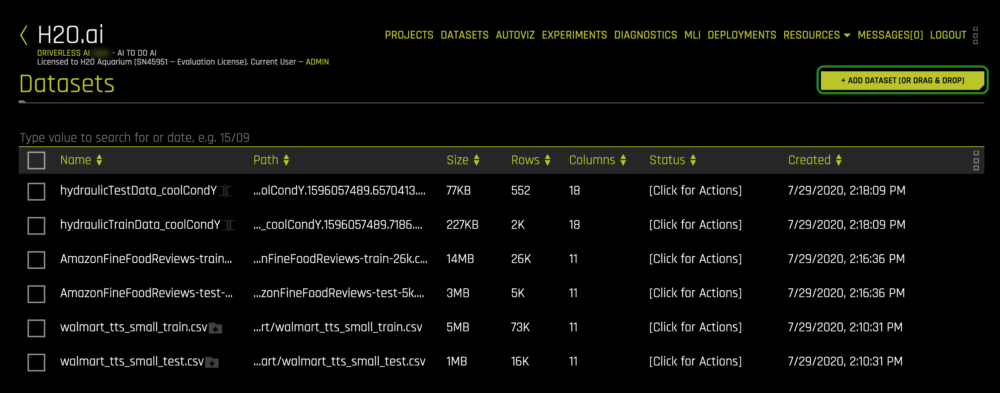
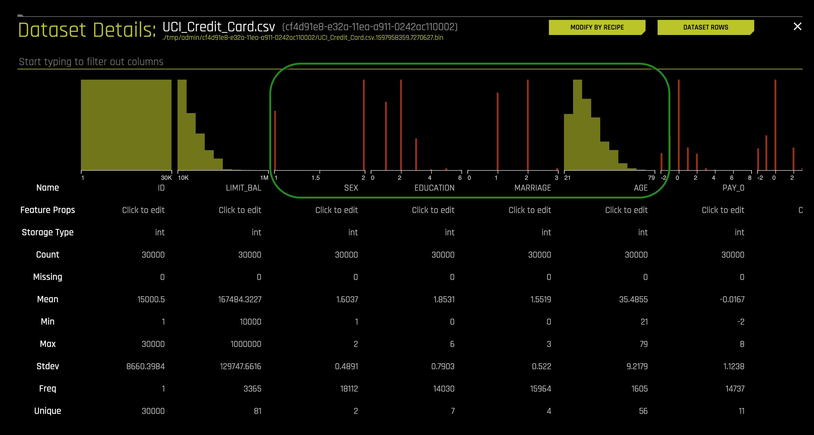
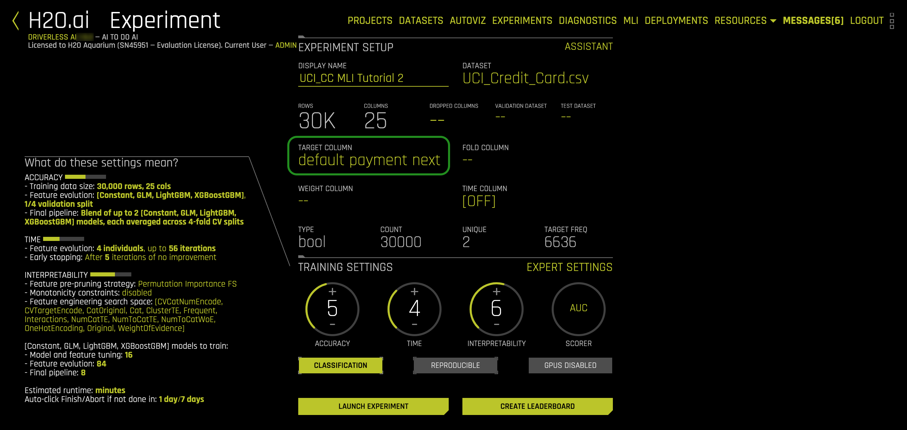
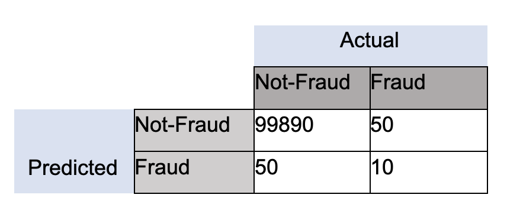
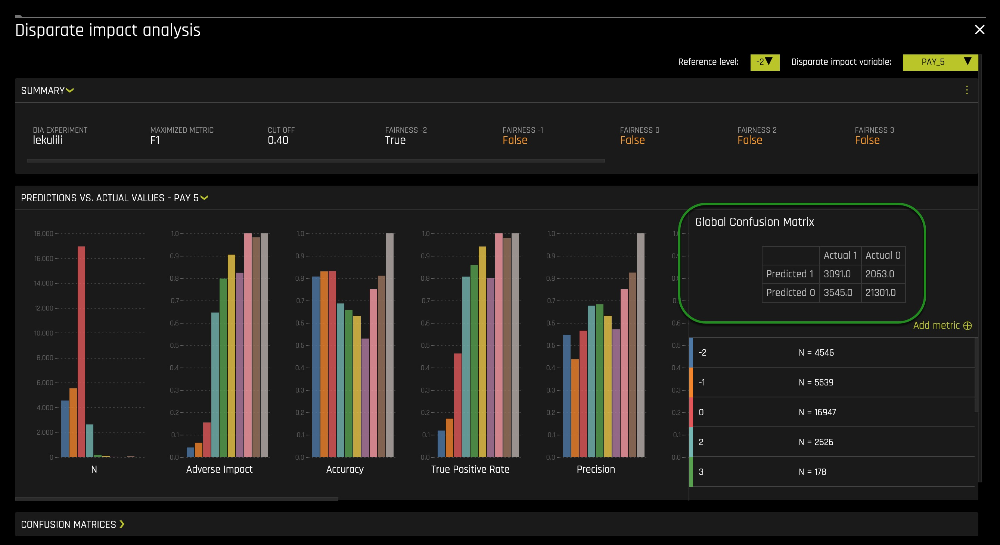
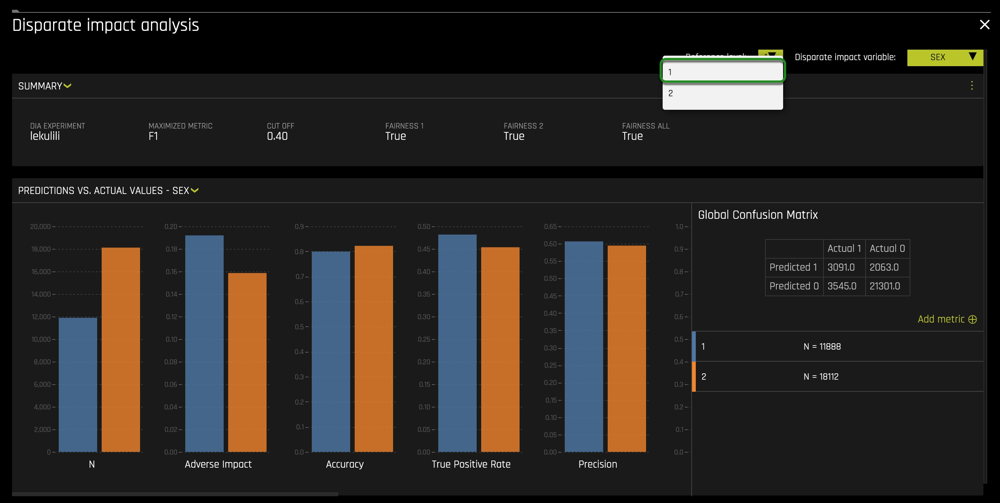
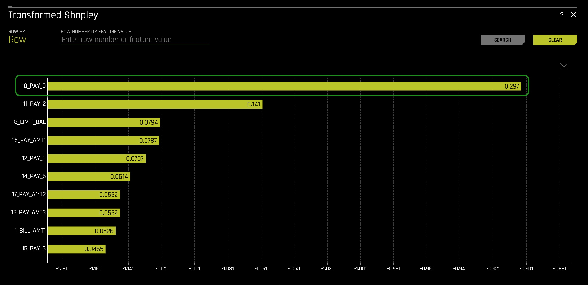
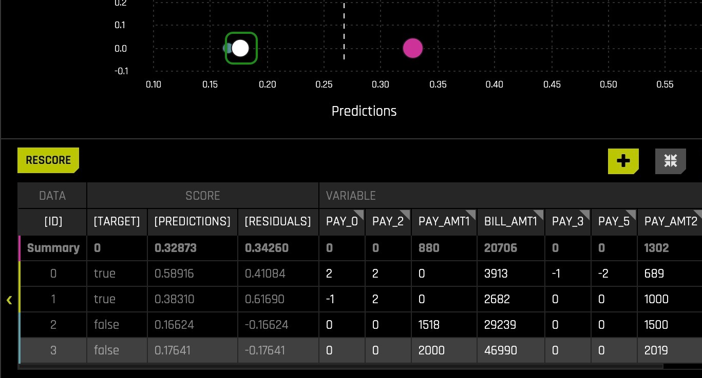

# Disparate Impact Analysis Tutorial 

## Outline
- [Objective](#objective)
- [Prerequisites](#prerequisites)
- [Task 1: Launch Machine Learning Interpretability Experiment](#task-1-launch-machine-learning-interpretability-experiment) 
- [Task 2: Concepts](#task-2-concepts)
- [Task 3: Confusion Matrix](#task-3-confusion-matrix)
- [Task 4: Disparate Impact Analysis](#task-4-disparate-impact-analysis)
- [Task 5: Sensitivity Analysis Part 1: Checking for Bias](#task-5-sensitivity-analysis-part-1-checking-for-bias)
- [Task 6: Sensitivity Analysis Part 2: Checking for Bias](#task-6-sensitivity-analysis-part-2-checking-for-bias)
- [Next Steps](#next-steps)

## Objective

This tutorial's goal is to start a set of tutorials that will explore the ins and outs of Driverless AI's newer two MLI functionalities. Such two new functionalities are as follows: 

 1. Disparate Impact Analysis Tool 
 2. Sensitivity/What-If Analysis Tool 

As firms use AI to help them around credit/loan-decisions, cross-sell promotions, and determine the next best action, they must be aware of how certain customer features are being weighting into the AI models in production. Further, they are also required to understand whether the AI models are not negatively impacting protected classes of customers or unfairly weighting for these types of classes. A lack of understanding of the ins of an AI Model in production can lead to legal and financial risks when discovering that the AI model in production is discriminating (bias) against certain ethnicities, genders, etc.

Therefore, AI practitioners must have tools that will aid them in trying to understand the ins and outs of their AI models. In this case, Driverless AI allows you to check your built AI model's ins and outs by using the Disparate Impact and Sensitivity/What-If Analysis tool. In particular, Disparate Impact is one of the most commonly discussed methodologies in responsible AI today to check for fairness. 

Additionally, as firms have looked to leverage AI to make more and more decisions for the company, the discussion of Human-Centered Machine learning has become increasingly important. Data science practitioners and firms deploying AI in production want to 'get under the hood' of their models to see what impacts decisions. 

Hence, in this tutorial, we will build an AI model predicting whether someone will be defaulting on their credit card. Right after, we will use the two tools, as mentioned earlier, to analyze and check for fairness. 

## Prerequisites

You will need the following to be able to do this tutorial:

- Basic knowledge of Machine Learning and Statistics
- Basic knowledge of Driverless AI or doing the [Automatic Machine Learning Introduction with Driverless AI](https://training.h2o.ai/products/tutorial-1a-automatic-machine-learning-introduction-with-driverless-ai) 
- Completion of the [Machine Learning Interpretability Tutorial](https://training.h2o.ai/products/tutorial-1c-machine-learning-interpretability-tutorial)

- A **Two-Hour Test Drive session** : Test Drive is H2O.ai's Driverless AI on the AWS Cloud. No need to download software. Explore all the features and benefits of the H2O Automatic Learning Platform.

  - Need a **Two-Hour Test Drive** session?Follow the instructions on [this quick tutorial](https://training.h2o.ai/products/tutorial-0-getting-started-with-driverless-ai-test-drive) to get a Test Drive session started. 

**Note:  Aquarium’s Driverless AI Test Drive lab has a license key built-in, so you don’t need to request one to use it. Each Driverless AI Test Drive instance will be available to you for two hours, after which it will terminate. No work will be saved. If you need more time to further explore Driverless AI, you can always launch another Test Drive instance or reach out to our sales team via the [contact us form](https://www.h2o.ai/company/contact/).**

## Task 1: Launch Machine Learning Interpretability Experiment

### About the Dataset

For this exercise, we will use the same credit card default prediction data set that we used in the first MLI tutorial.

This dataset contains information about credit card clients in Taiwan from April 2005 to September 2005. Features include demographic factors, repayment statuses, history of payment, bill statements, and default payments.

The data set comes from the [UCI Machine Learning Repository Irvine, CA: University of California, School of Information and Computer Science.](https://archive.ics.uci.edu/ml/datasets/default+of+credit+card+clients#)

This dataset has a total 25 Features(columns) and 30,000 Clients(rows).

### Download Dataset

1\. Go to our S3 link [UCI_Credit_Card.csv](https://s3.amazonaws.com/data.h2o.ai/DAI-Tutorials/TestDrive-Datasets/UCI_Credit_Card.csv) and download the file to your local drive.

2\. Load the ``UCI_Credit_Card.csv`` to Driverless AI by clicking **Add Dataset (or Drag and Drop)** on the Datasets overview page.

3\. Click on the ``UCI_Credit_Card.csv`` file then select Details.

Review the columns in the data set and pay attention to the specific attributes we will want to keep an eye on, such as **SEX**, **EDUCATION**, **MARRIAGE**, and **AGE**. Note that these demographic factors in credit lending should not play any role in deciding whether someone will be approved for a credit. 

*Note:* When we think about disparate impact, we want to analyze whether specific classes are being treated unfairly.

4\. Return to the Datasets page.

5\. Click on the ``UCI_Credit_Card.csv`` file then select **Predict**.

6\. Select Not Now on the "First time Driverless AI" box, a similar image should appear:

- Name your experiment *UCI_CC MLI Tutorial 2*

7\. Select Target Column, then **Select default.payment.next.month** as the target.

8\. Before we launch the experiment, let’s take a moment to drop some columns as we would in the real business case of fair lending. Navigate to the dropped columns section here:

9\.  Let’s drop the following columns since, under fair lending regulations, we should not consider these demographic factors in how we treat and analyze a customer. Additionally, **Limit_Bal** has some adverse action considerations, and this variable is usually dictated internally, and therefore, we will also drop it. Click **Done**.

10\. When you return, update the training settings as shown below:it is essential to make sure the **Interpretability** setting is at **7**. On the left-hand side, verify that **Monotonicity Constraints** is enabled. Enabling **Monotonicity Constraints** is important to Disparate Impact Analysis. If we use an unconstrained model and group fairness metrics, we risk creating group fairness metrics that appear to be reasonable. The consequence of creating group fairness metrics that appear to be reasonable is the illusion that individuals within that group may be treated differently or unfairly. The local (individual) discrimination would likely not appear or be visible in that group metric.

11\. Let's also jump to **EXPERT SETTINGS**, select the model tab, and adjust the settings to create a single *XGBoost GBM Model*. 

 1. Turn off all the models besides the **XGBoost GBM Models** setting.

 2. Then scroll down and adjust the *Ensemble level for final modeling pipeline* setting to 0 for this exercise's interpretability purposes. 

 3. Click **Save** and return.

12\. The last step here is to click **REPRODUCIBLE**, then run the experiment!

13\. Since we are already familiar with this page let’s dive in. Select *INTERPRET THIS MODEL*. 

## Task 2: Concepts

### Fairness & Bias

Fairness in Machine Learning & AI has been a critical focus for many practitioners and industries. The goal at its core is quite simple: ensure your models are not treating one population or group worse than another. However, upon further review, this task becomes more complicated to verify because fairness is not a term with an agreed upon legal definition. Any data science practitioner should strive for their models to be as ‘fair’ as possible, not just from an ethics perspective, but from a risk and regulatory perspective. If the theory of fairness and ethics in AI interests you, we have listed some of our favorite resources below on the topic that dives much deeper.

One critically important note is the concept of “Bias”. In conversational terms, bias tends to imply that a person has a slightly incorrect or exaggerated opinion on a subject matter based on their own personal experience, whether or not that is representative of the truth. Oftentimes the term will be used this way in Machine Learning as well. However, it is important to understand bias in a statistical term with a different meaning as well. 

‘In statistics, the **bias** (or **bias function**) of an estimator is the difference between this estimator's expected value and the true value of the parameter being estimated. An estimator or decision rule with zero bias is called **unbiased**. In statistics, "bias" is an **objective** property of an estimator.’[1]

More specifically, to Machine Learning, there is a concept called bias-variance tradeoff that appears often:

The more you overfit your model, statistically, the less biased the model is. 

### Disparate Impact Analysis

'Disparate impact in the United States labor law refers to practices in employment, housing, and other areas that adversely affect one group of people of a protected characteristic more than another, even though rules applied by employers or landlords are formally neutral. Although the protected classes vary by statute, most federal civil rights laws protect based on race, color, religion, national origin, and sex as protected traits, and some laws include disability status and other traits as well.'[2] 

When the discussion of ‘fairness’ or ‘ethical AI’ comes up, one of the best possible methodologies for vetting fairness is Disparate Impact Analysis. Disparate Impact Analysis or DIA, which is sometimes called Adverse Impact Analysis, is a way to measure quantitatively the adverse treatment of protected classes, which leads to discrimination in hiring, housing, etc., or in general, any public policy decisions. The regulatory agencies will generally regard a selection rate for any group with less than four-fifths (4/5) or eighty percent of the rate for the group with the highest selection rate as constituting evidence of adverse impact.

### Sensitivity Analysis/What-If Analysis

Sensitivity analysis, sometimes called what-if analysis is a mainstay of model debugging. It’s a very simple and powerful idea: simulate data that you find interesting and see what a model predicts for that data. Because ML models can react in very surprising ways to data they’ve never seen before, it’s safest to test all of your ML models with sensitivity analysis.

**Sensitivity analysis** is the study of how the [uncertainty](https://en.wikipedia.org/wiki/Uncertainty) in the output of a [mathematical model](https://en.wikipedia.org/wiki/Mathematical_model) or system (numerical or otherwise) can be divided and allocated to different sources of uncertainty in its inputs.[3] [4] 

A related practice is [uncertainty analysis](https://en.wikipedia.org/wiki/Uncertainty_analysis), which has a greater focus on [uncertainty quantification](https://en.wikipedia.org/wiki/Uncertainty_quantification) and [propagation of uncertainty](https://en.wikipedia.org/wiki/Propagation_of_uncertainty); ideally, uncertainty and sensitivity analysis should be run in tandem.

One of the simplest and most common approaches is that of changing one-factor-at-a-time (OAT), to see what effect this produces on the output.[5] [6] [7] OAT customarily involves

- Moving one input variable, keeping others at their baseline (nominal) values, then,
- Returning the variable to its nominal value, then repeating for each of the other inputs in the same way.

Sensitivity may then be measured by monitoring changes in the output, e.g. by [partial derivatives](https://en.wikipedia.org/wiki/Partial_derivatives) or [linear regression](https://en.wikipedia.org/wiki/Linear_regression). 

### References

[1] [Bias of an estimator](https://en.wikipedia.org/wiki/Bias_of_an_estimator)

[2] [Disparate impact](https://en.wikipedia.org/wiki/Disparate_impact)

[3]  Saltelli, A. (2002). ["Sensitivity Analysis for Importance Assessment"](https://en.wikipedia.org/wiki/Sensitivity_analysis#cite_note-Risk_Analysis-1). Risk Analysis. 22 (3): 1–12. CiteSeerX 10.1.1.194.7359. doi:10.1111/0272-4332.00040. PMID 12088235.

[4]  Saltelli, A.; Ratto, M.; Andres, T.; Campolongo, F.; Cariboni, J.; Gatelli, D.; Saisana, M.; Tarantola, S. (2008). [Global Sensitivity Analysis: The Primer. John Wiley & Sons](https://en.wikipedia.org/wiki/Sensitivity_analysis#cite_note-Primer-2).

[5] [Sensitivity analysis](https://en.wikipedia.org/wiki/Sensitivity_analysis#cite_note-15)

[6]  Leamer, Edward E. (1983). ["Let's Take the Con Out of Econometrics"](https://en.wikipedia.org/wiki/Sensitivity_analysis#cite_note-16). American Economic Review. 73 (1): 31–43. JSTOR 1803924.

[7]  Leamer, Edward E. (1985). ["Sensitivity Analyses Would Help". American Economic Review](https://en.wikipedia.org/wiki/Sensitivity_analysis#cite_note-17). 75 (3): 308–313. JSTOR 1814801.

### Deeper Dive and Resources

- [Mitigating Bias in AI/ML Models with Disparate Impact Analysis …](https://medium.com/@kguruswamy_37814/mitigating-bias-in-ai-ml-models-with-disparate-impact-analysis-9920212ee01c)

- [In Fair Housing Act Case, Supreme Court Backs 'Disparate Impact' Claims](https://www.npr.org/sections/thetwo-way/2015/06/25/417433460/in-fair-housing-act-case-supreme-court-backs-disparate-impact-claims)

- [Fairness and machine learning](https://fairmlbook.org/)

- [50 Years of Test (Un)fairness: Lessons for Machine Learning](https://arxiv.org/pdf/1811.10104.pdf)

- [Biased Algorithms Are Easier to Fix Than Biased People](https://www.nytimes.com/2019/12/06/business/algorithm-bias-fix.html)

- [Discrimination in the Age of Algorithms](https://arxiv.org/abs/1902.03731)

- [Understanding and Reducing Bias in Machine Learning](https://towardsdatascience.com/understanding-and-reducing-bias-in-machine-learning-6565e23900ac)

## Task 3: Confusion Matrix

After the model is interpreted, you will be taken to the "MLI: Regression and Classification Explanations" page. The *DAI Model* tab should already be selected for you thereafter, click on *Disparate Impact Analysis* located at the bottom left corner of the page. The following page should appear: 

Before we continue with the experiment, we need to cover one more  important concept: Confusion Matrices. 

It is effortless to assume that the goal is accuracy when using machine learning: the percentage of your predictions being correct. While accuracy can be a useful metric of success, it is often dubious. Let’s build on a very relevant industry example: 

Fraud (Anomaly Detection): Let’s assume we are dealing with a 100,000-row data set where we know there is some small amount of fraud; let’s say 10. If accuracy is our benchmark, then your model will predict “Not-Fraud” every time, and the accuracy will be 99.99%, but you have failed to identify any instances of fraud. These cases focus on what in a confusion matrix is defined as True Positives (TP).

In the case of identifying fraud, you would almost always prefer a prediction table like this, to make sure you can correctly identify fraud instances as they occur:

Now every case is different, and often in business environments, there exist certain cost functions associated with false negatives and false positives, so it is essential to be aware that every case has many considerations. We want to provide a few of the key metrics associated with confusion matrices that come up in the industry, depending on the problem you are trying to solve.

Sensitivity, Recall, Hit Rate, True Positive Rate:

 - True Positive Rate = True Positive / (True Positive + False Negative)

Specificity, Selectivity, True Negative Rate:

- True Negative Rate = True Negative / (True Negative + False Positive)

Precision, Positive Predictive Value:

- Precision = True Positives / (True Positive + False Positive)

With this context in mind, let’s move forward and dive into the experiment!

1\. Observe the Global Confusion Matrix for our experiment:

2\. With the above in mind, you can look at the Global Confusion Metrix of our experiment and identify and calculate the *True Positive Rate* and *True Negative Rate*. In the following task we will see how *True Positive Rate* and *True Negative Rate* can be effective. 

*Note:* In the next tutorial (COMING SOON), we will be exploring how we can use  *True Positive Rate* and *True Negative Rate* to determine the fairness of an AI model. Therefore, let us explore the two new MLI tools: 

 1. Disparate Impact Analysis Tool 

 2. Sensitivity/What-If Analysis Tool 

 ## Task 4: Disparate Impact Analysis

1\. Continuing with the experiment on the top right corner, click on the *Disparate Impact Variable* button. Select the **SEX** variable. 

2\. Click on the *Reference Level* button and change the value from 2 to 1. 

3\. The following should appear: 

Make sure the Reference level is toggled to 1(Male). With DIA the reference level is somewhat ambiguous, but generally, we want to set it to the category or population we believe may be receiving better treatment compared to other classes. 

After setting the reference level to *1* and the *Disparate impact* variable to **SEX** the following arises: 

The model seems to be performing fairly across all categories, which is good. And such categories are *Adverse Impact*, *Accuracy*, *True Positive Rate*, and *Precision*. 

A reminder *Adverse Impact* refers to the following definition: 

 - Adverse impact is the negative effect an unfair and biased selection procedure has on a protected class. It occurs when a protected group is discriminated against during a selection process, like a hiring or promotion decision.[8]  

  In the US, protected classes include race, sex, age (40 and over), religion, disability status, and veteran status.

Further, *True Positive Rate* refers to the following definition: 

 - In machine learning, the true positive rate, also referred to sensitivity or recall, is used to measure the percentage of actual positives which are correctly identified.[9]

Further we also see a slight population imbalance but not at a worrisome level yet. It will be a problem when the imbalance is huge because it will mean that the model will be learning (through examples) from a particular population or group. 

4\. Scroll down and let's take a look at *Group Disparity*.

You will notice that your benchmark (1/Male) should be one as it provides the level to compare. In financial services, there is an ‘accepted’ rule of thumb that, as a benchmark, one class should not be treated 80% less favorably than another, as a starting point. This benchmark is up for debate, and therefore, we will see how this will develop going forward, but for now, we have set the low (unfairness) threshold to *.8** (it should already be set to .8). As a result, with a .8 low threshold, we can see that none of the group disparity metrics are less than point 8, which is a good sign.

5\. Now let’s adjust the *low threshold* to .9 and see what happens: 

We can see that if we adjust the low threshold, the group disparity metrics will become highlighted and begin to flag, saying that if .9 is the cutoff,  this class (2/Women) will be treated unfairly by the model. Note: the *True Positive Rate Disparity* and *False Negative Rate Disparity* are not affected.

6\. Let’s scroll down and investigate *Group Parity* and check if all classes are being treated fairly by the model under the benchmark thresholds.

Here we can see *True* across all classes and metrics, which is what we want to see.

### References

[8] [WHAT IS ADVERSE IMPACT? AND WHY MEASURING IT MATTERS](https://www.hirevue.com/blog/what-is-adverse-impact-and-why-measuring-it-matters)

[9] [Encyclopedia of Systems Biology](https://link.springer.com/referenceworkentry/10.1007%2F978-1-4419-9863-7_255)

## Task 5: Sensitivity Analysis Part 1: Checking for Bias

1\. Let’s start up a new experiment with the same dataset as before. Keep the settings & target variable the same; however, this time, let’s keep all the columns in the dataset. 

After the experiment is over:

 - Click on *INTERPRET THIS MODEL*

 - After, in the *DAI Models* tab you should click on the Sensitivity Analysis option 

After that, you should land on our Sensitivity Analysis Dashboard: 

Some things to notice:

 1. In our *Summary* information for the dataset located on the left side of the dashboard, we, in particular, can see our chosen cutoff metric, and the number for that metric. 

 - In our *Summary* information for the dataset located on the left side of the dashboard, we, in particular, can see our chosen cutoff metric, and the number for that metric. Our *CUTOFF* is 0.2676... Anything below the *CUTOFF* will mean the model predicts a customer will not default, while anyone greater than or equal to the *CUTOFF* will default. 

2\. This pink summary locator represents the “Average” customer in the dataset, i.e., the average of all computable variables.  

- The *Current Working Set Score* indicates that the mean score prediction is .24060 and that the most common prediction is False, which makes sense.

3\. Here we can choose to filter down on various portions of the confusion matrix and review each row and prediction.

4\.  Now that we have familiarized ourselves with the UI let’s experiment! Reminder *Sensitivity Analysis* enables us to tinker with various settings in the data to see if certain features affect the outcome when we know that they should not. Let’s start by adjusting an entire feature.

 - If you remember from the previous exercise, the feature PAY_0 was extremely important; if not, you can jump back to *Transformed Shapley* and double-check. You can find the *Transformed Shapley*  in the *DAI MODEL* tab. 

5\. You can also check the *Partial Dependence Plot* and see the probability of defaulting increases when PAY_0 is two months late. 

Now that we know that being two months late on PAY_0 is terrible and knowing that the average mean score prediction is *0.24060*, what will occur if we were to set all customers to have PAY_0=2? Will the average mean score prediction increase or decrease? 

To set all customers PAY_0 to 2, please consider the following steps: 

 1. Click on top of the PAY_0 variable. 

 2. A box will appear to make sure the absolute radio button is selected. Set the *Absolute* to 2. After, click *Set*.

 3. Click the *RESCORE* button. 

6\. We can check “Current Working Set Score” on the right to see a summation of what occurred. In this run, we see that by switching all to PAY_0=2 that we over doubled the average mean, implying that our model would reject significantly more of the credits because the perceived probability of default was much higher. Our current score is now *0.46028* from a prior score of *0.24060*. Consequently, the absolute change is of *0.21968* an increase of *91.31%* change.

7\. Let's take this one step further and try another adjustment. Let's adjust PAY_AMT2 to 80% of what it originally was i.e., Let's see what happens to the model when we make our entire population only pay 80% of what they did. As you may notice, the variable *PAY_AMT2* is not on the table, but don't worry, we can add it by following these quick steps: 

 1. Click on the *Plus* icon, and a box will appear. 

  

 2. Check the *PAY_AMT2* variable and click *SET*

 3. Right after, similar to how we change the value of *PAY_0*, we will click on the *PAY_AMT2* variable. 

 4. Select the *Percentage* radio button and set the *Percentage* to 80. Click *SET*. 

 

 5. Click the *RESCORE* button. 

    Interestingly enough, when we finish rescoring and review results, we discover that this adjustment had virtually no effect whatsoever. In this case, the absolute change when modifying *PAY_AMT2* is a *0.00074* increase. It is a crucial consideration in Machine Learning to be aware that there will be many situations where you might think a variable would be important where it is not and vice versa.

6. Let's inspect this from a different angle, but before, let's restore the original *Sensitivity Analysis* results. Click the reset button located on the bottom right corner of the *Sensitivity Analysis* graph.  

## Task 6: Sensitivity Analysis Part 2: Checking for Bias

 For this subsequent analysis, we will tinker with an individual user and see what attribute changes might push them over or under the default/approval threshold. There are a few ways to do this, but since we know the cutoff is *0.26765209436416626*, we will try to find  a particular customer (blue or yellow circle) very close to the cutoff. Note, there are several ways we can filter to get close to a person close to the cutoff. In this case, I was able to find someone close to the cutoff line by filtering as follows: 

On the left side of the table (at the bottom of the page), you will be able to locate the filter options. In my case, I selected the **ID** variable and filter by *ID < 4*. 

 Once you get a narrow range, you should see up close which customers are the closest predictions to the cutoff line, as shown above. In this case, we will experiment with a customer holding the *ID* number 3. 

Now let’s see if we can independently adjust some of the demographic features and push customer three over the threshold from negative(not predicted as defaulting) to positive(predicted to default). Since we are discussing fairness and regulatory considerations, let’s select just the demographic variables to learn more. To choose the demographic variables such as **AGE**, **SEX**, **EDUCATION**, and **MARRIAGE** please follow the following steps: 

 1. Click the plus icon 

 2. Check the radio buttons for **AGE**, **SEX**, **EDUCATION**, and **MARRIAGE** 

 3. Click *SET*

After following the above steps, scroll to the right to see the newly added columns name: **AGE**, **SEX**, **EDUCATION**, and **MARRIAGE**. 

Based on what our data dictionary tells us: this is a married college-educated female who was predicted to not default on this loan (got approved for the loan). Let’s try adjusting her education down and changing marital status to *single*. The assumption here is that in credit lending, single people without a college degree should not be denied credit or be predicted to default just because of this idea of being single and having an advanced education. 

*Note:* 

- Gender (1 = male; 2 = female)
 - Education (1 = graduate school; 2 = university; 3 = high school; 4 = others)
- Marital status (1 = married; 2 = single; 3 = others) 

To change the **Education** and **Marital Status**, we will follow the same steps when we change *PAY_0* and *PAY_AMT2*.

After lowering the **Education** and setting the **Marital Status** to *Single (2)* and *rescoring* the table you should see something similar: 

After changing the values, what do you discover?

As you will see, the prediction is not flipped, and this is good because a model in production should not have its prediction change because certain sensitive demographic variables have been modified. If it were the case that a prediction would change as a result of manipulating a specific demographic variable, this would tell us that bias has been introduced in our AI model that will result in legal consequences and penalties for your company or entity. As a result, if bias is present, developers of the AI model should use their technologies or common sense intuition to understand the ins of their model and fix the bias and as questions around; "does this seem ethical? Does this seem logical? These two questions are fundamental questions to ask yourself to provide fairness and avoid legal, ethical, and moral consequences. As well, these questions will guide you to decide on the definition of what is fair in your respective use case of the AI model.  

You might be asking yourself now why then the prediction was not flipped; well, recall the *Partial Dependence Plot* as discussed above the *Partial Dependence Plot* concluded that *PAY_0* was the variable that most determine whether someone will default or not. In particular, we also discuss that someone increases its probability of defaulting when *PAY_0 = 2*.

*Note:* 

This AI model that we develop at the start of task 5 made use of all columns and, therefore, took into consideration the demographic variables. In contrast, the first experiment we ran didn't use the demographic columns, so now the question is why we kept them? Isn't it illegal to make use of such demographic columns in production? And the answer to that question is yes, it's illegal. We kept them because we wanted to make use of sensitive columns and demonstrate how we would make use of DAI to check for sensitivity around certain variables if we were to use such demographic variables in our AI model in production. Note one should never make use of such columns in production. Furthermore,  if it were the case that we dropped the demographic columns at the start of task 5, we wouldn't have been able to see a potential bias in the model originating from the following columns: **AGE**, **SEX**, **EDUCATION**, and **MARRIAGE**.  Hence, a way to analyze for bias while dropping the demographic columns is by doing a residual analysis and looking at the constant global matrix. We would not cover this in this tutorial, but on the next one (COMING SOON), we will see how we can make use of a residual analysis and a constant global matrix to detect for unfair bias. 

A way we can flip the prediction for customer 3 is by changing *PAY_0 = 2*. If it's the case that the prediction changes, we will, at the same time, be confirming that being two months late on *PAY_0* will increase your chances of being predicted as *default*.  

We see that adjusting *PAY_0 = 2* sends the customer very deep into the rejection zone, showing pretty clear how this one feature can dramatically impact that model for a single customer!

*Note:*

For this particular dataset, the one variable that, for the most part, determines whether someone will default or not is *PAY_0*. In these cases, developing an AI Model is not necessary given that by just looking at *PAY_0* one can predict in a manner of speaking, whether someone will default or not. 

### Conclusion

As mentioned at the beginning of this tutorial, the disparate impact analysis, and sensitivity analysis tool can help you understand your model's inner workings. Due to regulatory pressures and the aggressive adoption of AI in the enterprise, you are now more often required to be able to review and explain the ins of your model. It is worth noting that being able to explain a model after being built is just one component of responsible AI practices. 

## Next Steps

Check out the next tutorial: Analyzing a Criminal Risk Scorer with DAI MLI (COMING SOON), where you will learn more about:

 - Disparate Impact Analysis 
 - Sensitivity Analysis 
 - Confusion Matrix
 - Residual Analysis 
 - False Positive Rate
 - True Positive Rate