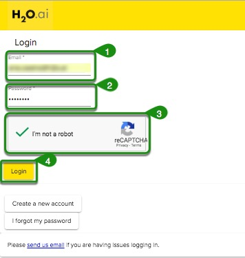
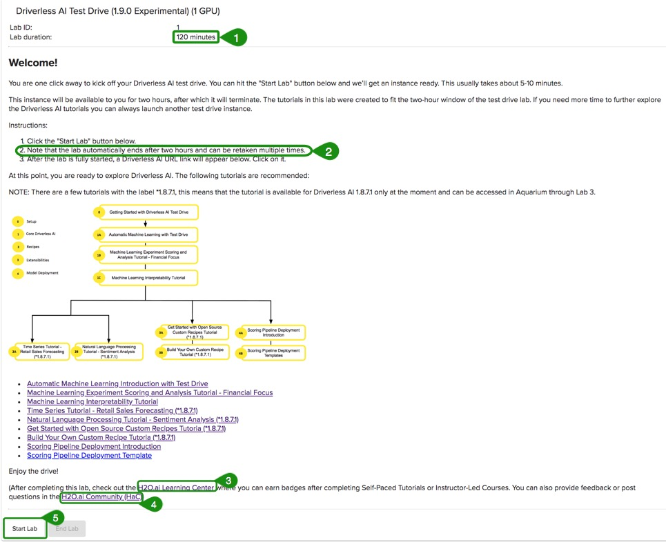
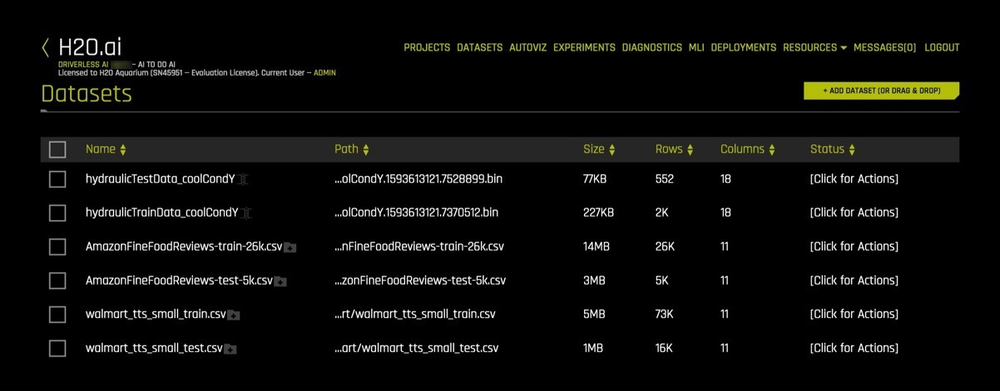
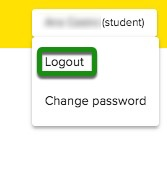

# Getting Started with Driverless AI Test Drive

## Outline

- [Driverless AI Test Drive](#driverless-ai-test-drive)
- [How to Obtain a Two Hour Test Drive Session](#how-to-obtain-a-two-hour-test-drive-session)
- [How to Create an Aquarium Account](#how-to-create-an-aquarium-account)
- [How to Login](#how-to-login)
- [Reset Password ](#reset-password)
- [How to Start and End the Test Drive Lab Session](#how-to-start-and-end-the-test-drive-lab-session)
- [Logout](#logout)
- [Questions](#questions)

## Driverless AI Test Drive 

**Driverless AI Test Drive** is a two-hour lab session that exists in H2O's Aquarium. Aquarium is the H2O cloud environment providing software access for workshops, conferences, and training.

All Aquarium labs have a specific **Lab Duration*** to complete the lab. **All Driverless AI Test Drive Lab sessions will terminate after two-hours. No work will be saved!**. However, you can retake the lab multiple times.

If you are new to Driverless AI we highly recommend you start with the **Test Drive**!

**Note**: **Aquarium’s Driverless AI Test Drive lab has a license key built-in, so you don’t need to request one to use it**.


## How to Obtain a Two Hour Test Drive Session

1\. Go to the Aquarium site by copying and pasting the URL below to a browser of your choice or simply click on [Aquarium](http://aquarium.h2o.ai/login).

```http://aquarium.h2o.ai/login```

2\. This will take you to the Aquarium login page where you need to create an account.

## How to Create an Aquarium Account

1\. Welcome to the Aquarium Login page!


2\. Select **Create a new account**


3\. Enter:

 - First Name
 - Last Name
 - Organization
 - Country
 - Email

4\. Click on **Create account and email temporary password** at the bottom of the page.

**Note**: A password will be sent to your email within minutes.

5\. Check your email for the password.

## How to Login

1\. Enter the email you used to create the Aquarium password.

2\. Enter the password you received over email from Aquarium.

3\. Click on **Login**.



## Reset Password 

1\. If you forgot your password, select **I forgot my password**.


2\. Enter your email, and another password will be emailed to you.


## How to Start and End the Test Drive Lab Session

After a successful login, select the "View Details" button on lab one, as shown in the image below. Ignore other labs as we will only be working on lab one. 


After the Driverless AI Test Drive Lab will appear:



**Note**: 

 1. Lab duration is 120 minutes, after that the session will terminate

 2. Note that the lab automatically ends after two hours and can be taken multiple times

3. [H2O.ai Learning Center](https://training.h2o.ai/): Build your Knowledge Base and Skills at your pace. Enter a place for knowledge-sharing, skills-enhancements, idea-sharing and more!

 4. [H2O.ai Community(HaC)](https://www.h2o.ai/community/home)  HaC is a community to share, learn, network, ask questions, provide answers, take the next step, and explore Artificial Intelligence, Machine Learning, and Data Science.  We are here to democratize AI. It will take a village to democratize AI.

5. **Start** button starts the lab session

1\. To start a Lab click on **Start Lab**. You will see an image similar to the one below:


2\. Aquarium will then start the Lab session for you (this will take a few minutes). After the lab session starts a similar image should appear:


**Note**:

 - The time remaining for the instance use
 - Driverless AI URL
 - End Lab 

3\. Once the Lab has started, a Driverless AI URL will appear at the of the page. Click on that URL. This will take you to the H2O.ai Driverless AI Datasets Page.




## Logout

1\. To logout, click on the box on the top-right corner of the page and select logout.

 

## Questions

Have any questions about Aquarium? Sign up for H2O.ai's Slack Community and post your questions under the **#cloud** channel. Members of the H2O.ai community will respond as soon as they are available.

- [Chat and ask questions with H2O.ai makers and data scientist users in the H2O.ai Slack workspace](https://www.h2o.ai/community/home)


