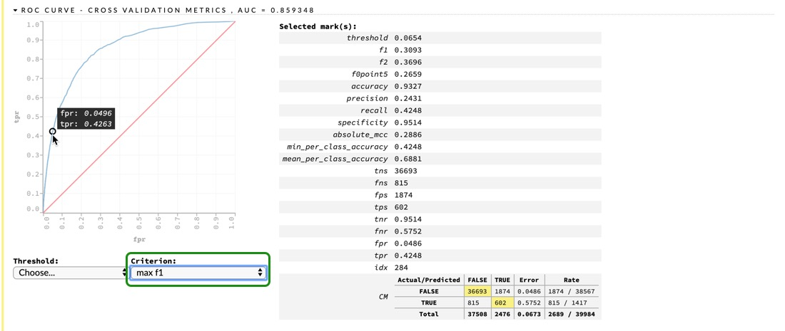

## Objective
In this tutorial, we will use the subset of the loan-level dataset from Fannie Mae and Freddie Mac. Firstly, we will solve a binary classification problem (predicting if a loan is delinquent or not). Then, we will explore a regression use-case (predicting interest rates on the same dataset). We will try to do both use-cases using Automatic Machine Learning (AutoML), and we will do so using the H2O-3 Python module in a Jupyter Notebook and also in Flow. 

## Prerequisites 
- Completion of tutorials [Introduction to Machine Learning with H2O-3 - Part 1](https://training.h2o.ai/products/introduction-to-machine-learning-with-h2o-part-1) and [Introduction to Machine Learning with H2O-3 - Part 2.](https://training.h2o.ai/products/introduction-to-machine-learning-with-h2o-part-2)
- Some basic knowledge of machine learning. 
- Familiarity with Python. 
- An Aquarium account. If you do not have an Aquarium account, please refer to [Appendix A of Introduction to Machine Learning with H2O-3 - Part 1](https://training.h2o.ai/products/introduction-to-machine-learning-with-h2o-part-1)

**Note:** This tutorial was completed in a cloud environment. If you want to get the same results in a similar time manner, please follow this tutorial in Aquarium. Otherwise, you can use your own machine but you will get different results, for example, it might take you longer to train the models for the classification part, or for the regression part, you might not get the same nunmber of models. 

**Please Note:** the H2O-3 Lab ID #2, ***H2O-3 and Sparkling Water Test Drive*** in Aquarium, is currently under maintenance and will be available soon. Thank you for your patience. 

## Task 1: Initial Setup
In this tutorial, we are using a smaller subset of the Freddie Mac Single-Family dataset that we used for the past two tutorials. If you have not done so, complete [Introduction to Machine Learning with H2O-3 - Part 1](https://training.h2o.ai/products/introduction-to-machine-learning-with-h2o-part-1) and [Introduction to Machine Learning with H2O-3 - Part 2](https://training.h2o.ai/products/introduction-to-machine-learning-with-h2o-part-2) as this tutorial is a continuation of both of them. 

We will use H2O AutoML to make the same predictions as in the previous two tutorials:
- Predict whether a mortgage loan will be delinquent or not 
- Predict the interest rate for each loan 

Complete this tutorial to see how we achieved those results. 

We will start by importing the libraries that we will use, as well as the algorithm that we will be using.
``` python
import h2o
import matplotlib as plt
%matplotlib inline
from h2o.automl import H2OAutoML
```

Next, initialize your H2O instance.

``` python
import os
import h2o

startup  = '/home/h2o/bin/aquarium_startup'
shutdown = '/home/h2o/bin/aquarium_stop'

if os.path.exists(startup):
    os.system(startup)
    local_url = 'http://localhost:54321/h2o'
    aquarium = True
else:
    local_url = 'http://localhost:54321'
    aquarium = False
```
```
h2o.init(url=local_url)
```
If your instance was successfully initialized, you will see a table with a description of it as shown below. 


If you are working on your machine, if you click on the link above the cluster information, it will take you to your **Flow instance**, where you can see your models, data frames, plots, and much more. If you are working on Aquarium, go to your lab and click on the **Flow URL**, and it will take you to your Flow instance. Keep it open on a separate tab, as we will come back to it for Tasks 6 and 7.

Let’s import the dataset. 

``` python
loan_level = h2o.import_file("https://s3.amazonaws.com/data.h2o.ai/H2O-3-Tutorials/loan_level_50k.csv")
```

You will notice that instead of using a subset of the dataset with 500k rows, we are using a subset with 50k rows. We decided to use a smaller dataset to run AutoML for a shorter amount of time. If you would like, you can repeat this tutorial after you have completed it, and use the same subset that we used in the previous two tutorials; just keep in mind that you will need to run AutoML for a much longer time. 
Before we continue, let’s explore some concepts about AutoML that will be useful in this tutorial.

## Task 2: AutoML Concepts

### AutoML
Choosing the best machine learning models and tuning them can be time consuming and exhaustive. Often, it requires levels of expertise to know what parameters to tune. The field of AutoML focuses on solving this issue. AutoML is useful both for experts, by automating the process of choosing and tuning a model; and for non-experts as well, by helping them to create high performing models in a short time frame. Some of the aspects of machine learning that can be automated include data preparation, which can include imputation, one-hot encoding, feature selection/extraction, and also feature engineering. Another aspect that can be automated is the model generation, which includes training a model and tuning it with cartesian or random grid search. Lastly, a third aspect that could be using ensembles, as they usually outperform individual models.

H2O AutoML is an automated algorithm for automating the machine learning workflow, which includes some light data preparation such as imputing missing data, standardization of numeric features, and one-hot encoding categorical features. It also provides automatic training, hyper-parameter optimization, model search, and selection under time, space, and resource constraints. H2O's AutoML further optimizes model performance by stacking an ensemble of models. H2O AutoML trains one stacked ensemble based on all previously trained models and another one on the best model of each family. 

The current version of AutoML trains and cross-validates the following model: GLMs, a Random Forest, an Extremely-Randomized Forest, a random grid of Gradient Boosting Machines (GBMs), XGBoosts, a random grid of Deep Neural Nets, and a Stacked Ensemble of all the models. If you would like to know more details about the models trained by AutoML, please visit [Which models are trained in the AutoML process?](http://docs.h2o.ai/h2o/latest-stable/h2o-docs/automl.html#faq) under the FAQ of the AutoML Documentation section. 
To see how H2O AutoML performs compared to other AutoML algorithms, please look at [An Open Source AutoML Benchmark](https://arxiv.org/pdf/1907.00909.pdf)

### Stacked Ensembles 
Ensemble machine learning methods use multiple learning algorithms to obtain better predictive performance than the ones that could be obtained from any of the constituent learning algorithms. Many of the popular modern machine learning algorithms are actually ensembles. For example, Random Forest and Gradient Boosting Machine (GBM) are both ensemble learners. Both bagging (e.g., Random Forest) and boosting (e.g., GBM) are methods for ensembling that take a collection of weak learners (e.g., decision tree) and form a single, strong learner.

H2O’s Stacked Ensemble method is a supervised ensemble machine learning algorithm that finds the optimal combination of a collection of prediction algorithms using a process called stacking. Like all supervised models in H2O, Stacked Ensemble supports regression, binary classification, and multiclass classification. If you would like to know more, make sure to check the [Stacked Ensemble Section](http://docs.h2o.ai/h2o/latest-stable/h2o-docs/data-science/stacked-ensembles.html#stacked-ensembles) in the [H2O-3 Documentation.](http://docs.h2o.ai/h2o/latest-stable/h2o-docs/index.html#overview)

## Task 3: Start Experiment
You can make sure that your dataset was properly imported by printing the first ten rows of your dataset (output not shown here)

```python
loan_level.head()
```
And also, you can look at the statistical summary of it by printing a description of it (output not shown here)

```python
loan_level.describe()
```
We will not focus on the visualization of the dataset as a whole, as we have already worked with this dataset. But, we are going to take a look at the distribution of our response variables. 

Let’s take a look at the `DELINQUENT,` which is the response of our classification problem.
```python
loan_level["DELINQUENT"].table()
```


As we saw in the classification tutorial, the dataset is highly imbalanced, which is the same scenario in this case. 

Now, let’s take a quick look at the response for our regression use-case.

```python
loan_level["ORIGINAL_INTEREST_RATE"].hist()
```


Again, we see that the average interest rate ranges from 7% to 8%, similar to what we saw in the previous tutorial.

Now that we have an idea of the distribution of the responses let’s split the dataset. For this tutorial, we will take a slightly different approach. Instead of splitting the dataset into three sets, we are just going to do 2, a train and test set. We will be using cross-validation to validate our models, as we need to use the k-fold cross-validation in order to get the stacked ensembles from the AutoML. 

```python
train, test = loan_level.split_frame([0.8], seed=42)
```

Now, check that the split is what we expected.

```python
print("train:%d test:%d" % (train.nrows, test.nrows))
```
**Output:**
```python
train:39984 test:9946
```
Since we will need two different responses and predictors, we will do that in each of the corresponding tasks. 

## Task 4: H2O AutoML Classification

We already have our train and test sets, so we just need to choose our response variable, as well as the predictors. We will do the same thing that we did for the first tutorial.

```python
y = "DELINQUENT"
ignore = ["DELINQUENT", "PREPAID", "PREPAYMENT_PENALTY_MORTGAGE_FLAG", "PRODUCT_TYPE"] 
x = list(set(train.names) - set(ignore))
```
Now we are ready to run AutoML. Below you can see some of the default parameters that we could change for AutoML

```markdown
H2OAutoML(nfolds=5, max_runtime_secs=3600, max_models=None, stopping_metric='AUTO', stopping_tolerance=None, stopping_rounds=3, seed=None, project_name=None)
```
As you can see, H2O AutoML is designed to have as few parameters as possible, which makes it very easy to use. For this experiment, we could’ve just changed the maximum runtime, the seed, and the project name; however, from our first tutorial, we learned that our dataset is highly imbalanced and that models have a hard time classifying the minority class. For that reason, we are setting `balance_classes=True`, and we are setting the sampling factors to [0.5,1.25], which means that we will undersample the majority class, and oversample the minority class. Also, we will set `max_models = 25` and to make sure that AutoML trains all 25 models in less than 20 min, we will also set `max_runtime_secs_per_model=30` which will make sure no model takes more than 30 seconds to be trained. 

```python
aml = H2OAutoML(max_models=25, max_runtime_secs_per_model=30, seed=42, project_name='classification', 
                balance_classes=True, class_sampling_factors=[0.5,1.25])
%time aml.train(x=x, y=y, training_frame=train)
```

The only required parameters for H2O's AutoML are, `y` `training_frame,` and `max_runtime_secs,` which let us train AutoML for ‘x’ amount of seconds and/or `max_models,` which would train a maximum number of models. Please note that  `max_runtime_secs` has a default value, while `max_models` does not. For this task, we will set a number of models constraint. The seed is the usual parameter that we set for reproducibility purposes. We also need a project name because we will do both classification and regression with AutoML. Lastly, we are setting `balance_classes=True` because we have a very imbalanced dataset, and we are using the default number of folds for cross-validation.

The second line of code has the parameters that we need in order to train our model. For now, we will just pass x, y, and the training frame. Please note that the parameter `x` is optional because if you were using all the columns in your dataset, you would not need to declare this parameter. The `leaderboard frame` can be used to score and rank models on the leaderboard, but we will use the validation scores to do so because we will check the performance of our models with the test set. 

Below is a list of optional parameters that the user could set for H2O’s AutoML
- validation_frame
- leaderboard_frame
- blending_frame
- fold_column
- weights_column
- ignored_columns
- class_sampling_factors
- max_after_balance_size
- max_runtime_secs_per_model
- sort_metric
- exclude_algos
- include_algos
- keep_cross_validation_predictions
- keep_cross_validation_models
- keep_cross_validation_fold_assignment
- verbosity
- export_checkpoints_dir

To learn more about each of them, make sure to check the [AutoML Section](http://docs.h2o.ai/h2o/latest-stable/h2o-docs/automl.html#optional-parameters) in the Documentation. We will be using some of them in the regression part of this tutorial. 

Once AutoML is finished, print the leaderboard, and check out the results.

```python
lb = aml.leaderboard
lb.head(rows=lb.nrows)
```


**Note:** We could’ve just printed the leaderboard with `aml.leaderboard`, but we have added an extra line of code just so that we make sure that we print all the models that were scored. 

We can also print a leaderboard with the training time, in milliseconds, of each model and the time it takes each model to predict each row, in milliseconds:

```python
from h2o.automl import get_leaderboard
lb2 = get_leaderboard(aml, extra_columns='ALL')
lb2.head(rows=lb2.nrows)
```


By looking at the leaderboard, we can see that the best model is the Stacked Ensemble with the best model from each family, meaning that this model was built using the best model of each of the trained algorithms. This Ensemble will usually have a GLM, a Distributed Random Forest, Extremely-Randomized Forest, a GBM, and XGBoost, and Deep Learning model if you give it enough time to train all those models. Let’s explore the coefficients of the metalearner to see the models in the Stacked Ensemble with their relative importance.

First, let's retrieve the metalearner, and we can do it as follow:

``` python
# Get model ids for all models in the AutoML Leaderboard
model_ids = list(aml.leaderboard['model_id'].as_data_frame().iloc[:,0])

# Get the "All Models" Stacked Ensemble model
se = h2o.get_model([mid for mid in model_ids if "StackedEnsemble_BestOfFamily" in mid][0])

# Get the Stacked Ensemble metalearner model
metalearner = h2o.get_model(se.metalearner()['name'])
metalearner.coef()
```
**Output:**
``` python
{'Intercept': -4.163158893916475,
 'GLM_1_AutoML_20200624_224336': 1.7792606607674282,
 'GBM_grid__1_AutoML_20200624_224336_model_3': 0.27345402509523253,
 'XGBoost_3_AutoML_20200624_224336': 1.7331622245284657,
 'DeepLearning_1_AutoML_20200624_224336': 2.129448067858176,
 'DRF_1_AutoML_20200624_224336': 3.9428536283073945,
 'XRT_1_AutoML_20200624_224336': 4.968106163200721}
```
If you wanted to check this for the Ensemble with all the models, you will just simply change the name `StackedEnsemble_BestOfFamily` to `StackedEnsemble_AllModels` when saving the `se` variable in the code above. 

From the list above, we can see that the most important model used in our Stacked Ensemble is an XRT(Extremely Randomized Tree model, which is a variation of random forest). We can also plot the standardized coefficients with the following code (assuming you retrieved the metalearner from the step above):

```python
metalearner.std_coef_plot()
```


Now, let’s see how the best model performs on our test set.

``` python
aml.leader.model_performance(test_data=test)
```


By looking at the results, we can see that in fifteen minutes, and with less data, AutoML obtained scores somewhat close to what we obtained in the first tutorial. The AUC that we obtained was **0.828.** Although this is a good AUC, because we have a very imbalanced dataset, we must also look at the misclassification errors for both classes. As you can see, our model is having a hard time classifying bad loans; this is mainly due because only about 3.6% of loans are labeled as bad loans. However, the model is doing very well when classifying good loans; although it is still far from being the best model, this gives us a solid starting point. Even though we set `balance _lasses=True`, we just tried a quick under-over sampling ratio. If we were to find the right value and gave AutoML more time, we could potentially improve the misclassification error for the **bad_loan** or predicted TRUE class. 

We can also take a quick look at the ROC curve:

``` python
%matplotlib inline
aml.leader.model_performance(test_data=test).plot()
```


As you can see, it’s the same AUC value that we obtained in the model summary, but the plot helps us visualize it better.

Lastly, let’s make some predictions on our test set.

``` python
aml.predict(test)
```


As we mentioned in the first tutorial, the predictions we get are based on a probability. In the frame above, we have a probability for **FALSE,**, and another one for **TRUE**. The prediction, **predict**, is based on the threshold that maximizes the F1 score. For example, the threshold that maximizes the F1 is about `0.1061`, meaning that if the probability of **TRUE** is greater than the threshold, the predicted label would be **TRUE.**

After exploring the results for our classification problem, let’s use AutoML to explore a regression use-case.

## Task 5: H2O AutoML Regression
For our regression use-case, we are using the same dataset and the same training and test sets. But we do need to choose our predictors and response columns, and we will do it as follow:

``` python
y_reg = "ORIGINAL_INTEREST_RATE"

ignore_reg = ["ORIGINAL_INTEREST_RATE", "FIRST_PAYMENT_DATE", "MATURITY_DATE", "MORTGAGE_INSURANCE_PERCENTAGE", "PREPAYMENT_PENALTY_MORTGAGE_FLAG", "LOAN_SEQUENCE_NUMBER", "PREPAID", "DELINQUENT", "PRODUCT_TYPE"] 

x_reg = list(set(train.names) - set(ignore_reg))
```
 You can print both your y and x variables

``` python
print("y:", y_reg, "\nx:", x_reg)
```
Now we are ready to start our second AutoML model and train it. This time we will use a time constrain, and set `max_runtime_secs` to 900 seconds, or 15 minutes. Again, we set `max_runtime_secs_per_model` to 30 seconds. You will notice that we are specifying the stopping metric and also the sort metric. In the second tutorial, we focused on RMSE and MAE to check the performance of our model, and we noticed that the two values seemed very correlated. For that reason, we could use any of those metrics. We will use the RMSE for early stopping because it penalizes the error more than the MAE, and we will also use it to sort the leaderboard based on the best value.

``` python
aml = H2OAutoML(max_runtime_secs=900, max_runtime_secs_per_model=30, seed=42, project_name='regression', 
                stopping_metric="RMSE", sort_metric="RMSE")

%time aml.train(x=x_reg, y=y_reg, training_frame=train)
```
Once it’s done, print the leaderboard.

``` python
lb = aml.leaderboard
lb.head(rows=lb.nrows)
```


The leaderboard shows that the GBM models clearly dominated this task. We can retrieve the best model with the `model.leader` command; but, what if we wanted to get another model from our leaderboard? One way to do so is shown below:

``` python
# Get model ids for all models in the AutoML Leaderboard
model_ids = list(aml.leaderboard['model_id'].as_data_frame().iloc[:,0])

# Get the top GBM model
gbm = h2o.get_model([mid for mid in model_ids if "GBM_3" in mid][0])
```
Note that you would need to change the name `GBM_3`, in the code above, to the name of the model that you want, and that should retrieve the desired model. For example, if you wanted to get the best XGBoost in the leaderboard, you would need to make the following change (you do not need to run the following line of code, this is just an example)

```python
xgb = h2o.get_model([mid for mid in model_ids if "XGBoost_2" in mid][0])
```
Now that we have retrieved the best model, we can take a look at some of the parameters

```python
print("ntrees = ", gbm.params['ntrees'])
print("max depth = ", gbm.params['max_depth'])
print("learn rate = ", gbm.params['learn_rate'])
print("sample rate = ", gbm.params['sample_rate'])
```
**Output:**

```python
ntrees =  {'default': 50, 'actual': 63}
max depth =  {'default': 5, 'actual': 8}
learn rate =  {'default': 0.1, 'actual': 0.1}
sample rate =  {'default': 1.0, 'actual': 0.8}
```
If you want to see a complete list with all the parameters you can use the following command (output not shown here)

```python
gbm.params
```
This is useful because we can see the parameters that were changed and the ones that were kept as default. After exploring those parameters, we could try to tune a GBM with parameters close to the ones from the AutoML model and see if we can get a better score. 

Now let’s take a quick look at the model summary.

```python
gbm
```


In the model summary above, we can see some of the parameters of our model, the metrics on the training data, and also the metrics from the cross-validation, as well as a detailed cross-validation metrics summary. We can also look at scoring history. However, by looking at the RMSE and MAE in the picture above for both training and validation, we can see that the model was starting to overfit because the training error is much lower than the validation error. Lastly, we can see the variable importance table, which shows both relative_importance, as well as scaled_importance, and also the percentage. For this model, the most important variable is `SELLER_NAME`, meaning that for our model, knowing which bank is providing the loan is very important.  

Now, let’s see how the leader from our AutoML performs on our test set.

```python
gbm.model_performance(test_data=test)
```


In case you had retrieved a different model other than the leader, and you actually wanted to check the performance of the best model in the leaderboard, you can do the following:

```python
aml.leader.model_performance(test_data=test)
```
If you do that right now, you will see the same results because the gbm that we retrieved was the leader. 

We can see that the test RMSE and MAE, **0.4289** and **0.3132** respectively, are very close to the validation RMSE and MAE, **0.4309** and **0.3127,** which shows us that doing 5-fold cross-validation gives us a good estimation of the error on unseen data. 

Now, let’s make some predictions on our test set.

```python
pred = gbm.predict(test)
pred = pred.cbind(test['ORIGINAL_INTEREST_RATE'])
pred.head()
```


Please note that we just combined the response column from our test frame to our predictions to see how the predictions compare to the actual value. 

Out of the first ten predictions, most of them are very close to the actual values, with the exception of some predictions, such as the seventh prediction, which is **6.89,** compared to the actual value which is **8.75.** Because the RMSE is higher than the MAE, we can deduce that we have a couple of instances similar to the one mentioned above, because the larger errors are penalized more. 

Now, let’s try to do what we just did one more time, but this time in Flow.

## Task 6: H2O AutoML Classification in Flow
Our dataset should already be in our Flow instance; go to your Flow instance, by either clicking the link we mentioned at the beginning of the tutorial or switching to the tab that you opened earlier. 

Your Flow instance should look similar to the one below: 


Click on `getFrames` in the **Assistance** panel on the left side. This will show you a list of all the frames currently stored in your instance. 


Here you will be able to see all the “tables” that we have printed in our Jupyter Notebook, for example, you will see the outputs of the `.head()` function that we used earlier. Also, you will see a frame with the predictions and all the frames which we have worked with. Look for the `loan_level_50k.hex` frame, this is the dataset that we imported at the beginning of the tutorial. In the picture below, you will see three frames highlighted, the first one is the dataset we imported, and the other two are the train and test sets. 


To import a file into Flow, you would just need to run the following command in a new cell
```
importFiles ["https://s3.amazonaws.com/data.h2o.ai/DAI-Tutorials/loan_level_50k.csv"]
```

**Note:** For a more detailed guide on how to import a file into Flow, check out [Task 3 of Introduction to Machine Learning with H2O-3 - Part 1](https://training.h2o.ai/products/introduction-to-machine-learning-with-h2o-part-1)

Even though we already have the train and test set, let’s split the loan_level_50k.hex file, that way we can give a specific name to the train and test sets. Use the ratio 0.8 for train and 0.2 for test.


Now that we can easily find our train and test set, scroll up again to the **Assistance** panel and click on `runAutoML`.


You can name your model `flow-automl.` For *Training Frame* choose `train.` For the *Response Column* select `DELINQUENT.` For the *Leaderboard Frame* select `test.` 


Click on the *balance_classes* box. Now, For *Ignored Columns* Select 
- `PREPAYMENT_PENALTY_MORTGAGE_FLAG`, 
- `PRODUCT_TYPE,` 
- `PREPAID.`

Also, change the *sort metric* to `AUC.` 


Since the Deep Learning models take longer to train, let’s exclude it from this AutoML, just check the box next to *DeepLearning* as shown below. Change the *Seed* to `42` and *Max Run Time (sec)* to `900.`


Leave the Expert settings as they are, and click on **Build Model.** Make sure your AutoML settings look similar to the ones shown in the images above. 


Once your model is building, you will see a cell with a dialog similar to the image below:


Once AutoMl finishes running, click on **View**, and you will see a new cell that will have the **leaderboard** and an **Event Log** tab as shown below:


In Flow, we can access any of the models in the leaderboard just by clicking on it. Click on the `StackedEnsemble_BestOfFamily` model, and you will get all the details about it. Below you can see all the outputs that Flow shows you from that model. Some of the outputs are the model parameters, the training ROC Curve, the cross-validation ROC curve, and much more. 


Go to the `ROC CURVE - CROSS VALIDATION METRIC` and on the criterion dropdown menu, choose `f1` and you will see something like the image below:




You can see all the metrics at the specified threshold, which gives us the max F1 score. You can also see the confusion matrix, and how the misclassification error for the TRUE class seems lower than what we got in the Jupyter Notebook. Now, let’s try to make some predictions on our test set. At the top of the cell, click on `Predict`.


You will see another cell that will ask for a name and frame. You can name it `automl-cl-predictions` (cl referring to classifier). And for the *Frame* click on the dropdown menu, and look for the `test` frame. Once you have updated those two fields, click on **Predict**.  


Again, now we have several outputs, but now they are the performance on the test set. So we can take a look at the ROC Curve and AUC on the test set, confusion matrix, the maximum metrics at their specific thresholds, the maximum metrics, and the gains/lift table. 


Go over the results by yourself, and see how they compare to the results from the cross-validation. Are the results what you expected? Do the scores make sense to you? How are the results from Flow similar to the ones from our Jupyter Notebook? How are they different?

After you are done exploring the results, move on to the next task, where we will do a last run of AutoML for the regression use case.

## Task 7: H2O AutoML Regression in Flow

Scroll up to the **Assistance** panel once again, and click on **runAutoML**. We will do something similar to what we just did in the previous task. 
In the AutoML settings, change *Project Name* to `flow-automl-regression`, for *Training Frame* choose `train`, for *Response Column* choose `ORIGINAL_INTEREST_RATE`, and choose `test` for the *Leaderboard Frame*. 


for ignore columns select the following:
- `FIRST_PAYMENT_DATE,` 
- `MATURITY_DATE,` 
- `MORTGAGE_INSURANCE_PERCENTAGE,` 
- `PREPAYMENT_PENALTY_MORTGAGE_FLAG,`
- `PRODUCT_TYPE,`
- `LOAN_SEQUENCE_NUMBER, `
- `PREPAID, `
- `DELINQUENT`

Please note that in the figure below, only three columns are selected, but we are ignoring all the above columns, just not showing them in the figure below.

Change the *sort metric* to `RMSE.` Let’s use all the models, so make sure all the models are unchecked, or click **None** in the *exclude_algos* menu. 


Set the *Seed* to `42,` change the number of *max_runtime_secs* to `900,` and change the *stopping_metric* to `RMSE.` 


Lastly, leave the expert settings as default, and click on **Build Model**


 

Once it’s done, click on **View** and you should be able to see the **Leaderboard** and the **Event Log** 


In the leaderboard, we can see that the best model from AutoML is an XGBoost, which is different from our AutoML in the Jupyter Notebook; however, the best model from our notebook is still in the top five models. 

Click on the best model and explore the results. Take a look at the parameters and their descriptions. If we were trying to explore different models, we could use this model as a baseline and do a local grid search based on the parameters found by the AutoML. 


You can also look at the scoring history and the variable importance plot (not shown here), and all the outputs related to a regression use case. 

Let’s make some predictions and explore the results. At the top of the **Model** panel, click on **Predict**. 


Name it `flow-xgb-predictions` and choose `test` for *Frame* and click on **Predict**.


Once you’re done, you will see a summary of the scores on the test set.


If you click on predictions, you will get a summary of another frame. Click on **View Data** you will get the actual predictions for each sample of the data frame.


Feel free to explore the results on your own. Are the first ten predictions similar to what we got in our Jupyter Notebook? Are the metrics from the test set close to those of the cross-validation? 

Now that you can run AutoML in Flow and in the Jupyter Notebook, you can focus on a task and run it for a longer time; you can even run AutoML on the 500k subset of the dataset and see how the results compare to the results in this tutorial. 

If you do not want to attempt the challenge, you can shut down your cluster; otherwise, check out the next task.

```python
h2o.cluster().shutdown()
``` 

## Task 8: Challenge
AutoML can help us find the best models faster, and narrow down our search for the parameters for those models. Since you learned to tune some of the most common models in H2O, try to further tune the GBM that we found when we did the regression use-case in our Jupyter Notebook and see how much you can improve the scores. Can you tune the GBM so that it performs better than the XGBoost that we tuned in the previous tutorial, using a smaller dataset? Give it a try and put your knowledge to practice. 

## Next Steps
Introduction to machine learning with H2O-3 - Part 4 (Unsupervised Learning) coming soon.  
