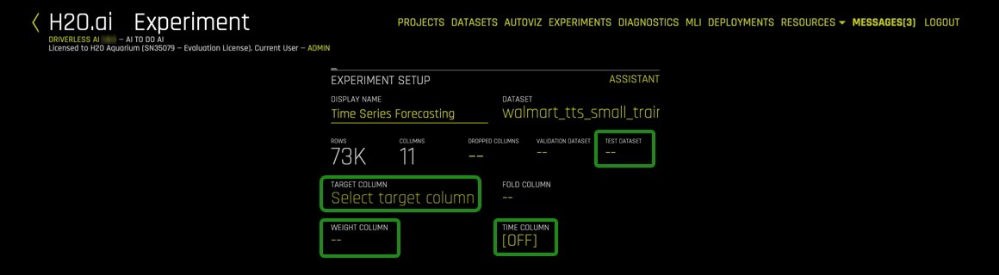
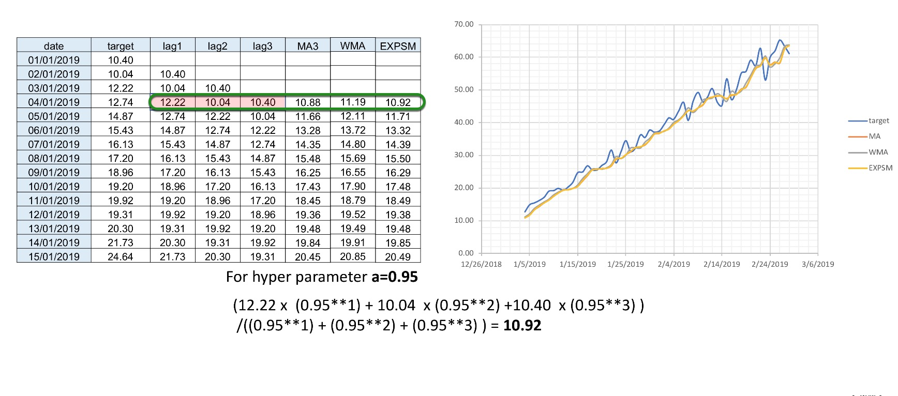
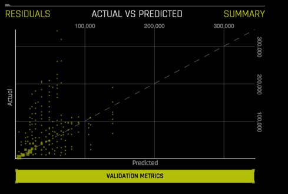
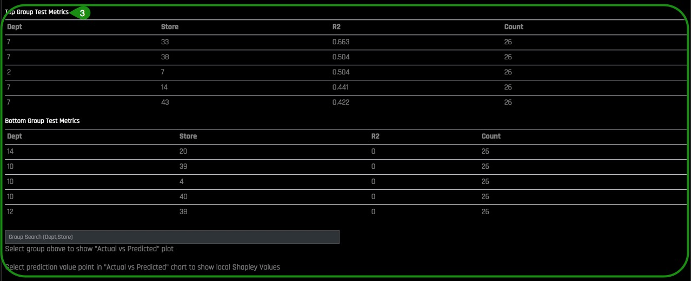
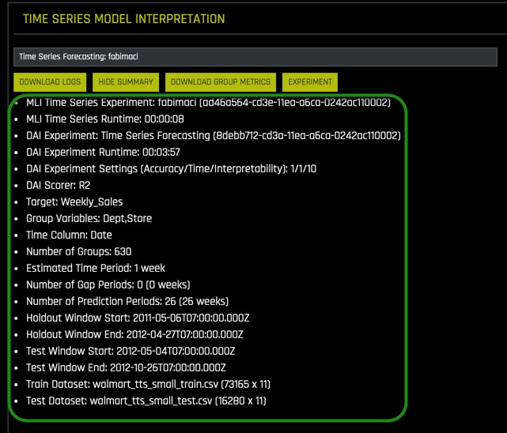

# Time Series Recipe Tutorial - Retail Sales Forecasting

## Objective

Time-series forecasting is one of the most common and important tasks in business analytics. The goal of time-series forecasting is to forecast the future values of that series using historical data. Time-series forecasting uses models to predict future values based on previously observed values, also known as extrapolation.

Driverless AI has its own recipes for time-series forecasting that combines advanced time-series analysis and H2O’s own Kaggle Grand Masters’ time-series recipes. In this tutorial we will walk through the process of creating a time series experiment and compare the results to a pre-loaded time series experiment based on the same dataset just higher experiment settings.

**Note:** We recommend that you go over the entire tutorial first to review all the concepts, that way, once you start the experiment, you will be more familiar with the content.

## Prerequisites

You will need the following to be able to do this tutorial:

- Basic knowledge of Machine Learning and Statistics
- Basic knowledge of Driverless AI or doing the [Automatic Machine Learning Introduction with Drivereless AI Test Drive](https://h2oai.github.io/tutorials/automatic-ml-intro-test-drive-tutorial/#0) 

- A **Two-Hour Test Drive session** : Test Drive is H2O.ai's Driverless AI on the AWS Cloud. No need to download software. Explore all the features and benefits of the H2O Automatic Learning Platform.

    - Need a **Two-Hour Test Drive** session? Follow the instructions on [this quick tutorial](https://training.h2o.ai/products/tutorial-0-getting-started-with-driverless-ai-test-drive) to get a Test Drive session started.  

**Note:  Aquarium’s Driverless AI Test Drive lab has a license key built-in, so you don’t need to request one to use it. Each Driverless AI Test Drive instance will be available to you for two hours, after which it will terminate. No work will be saved. If you need more time to further explore Driverless AI, you can always launch another Test Drive instance or reach out to our sales team via the [contact us form](https://www.h2o.ai/company/contact/).**


## Task 1: Launch Time Series Experiment

### About the Dataset 

This dataset contains information about a global retail store. It includes historical data for 45 of its stores located in different regions of the United States from 02-05-2010 to 11-01-2012. Each numbered store contains a number of departments, stores specific markdowns (promotional) events they have throughout the year, which typically happens before prominent holidays such as the Superbowl, Labor Day, Thanksgiving, and Christmas. Additional information included are weekly sales, dates of those sales, the fuel price in the region, consumer price index, and unemployment rate. The dataset was used in a Kaggle in 2014 competition with the goal of helping this retail store forecast sales of its stores[1]. 

Our training dataset is a synthesis of the csv data sources provided for the Kaggle Store Sales Forecasting competition. The three datasets were:

- train.csv
- stores.csv
- features.csv. 

The train.csv has the store number, department, date, weekly sales, and whether or not that day was a holiday. The stores.csv had the types of stores and their size while the features.csv, which had additional demographic information about the specific region the store was located.

The training dataset in this tutorial contains 73,165 rows and a total of 11 features (columns) and is about 5 MB. The test dataset contains about 16,000 rows and a total of 11 features (columns) and is about 1 MB.

### Datasets Overview

If you are using Aquarium as your environment, then the lab **Driverless AI Test Drive (x.x.x.x.)(LTS)** will have this tutorial training and test subsets of the Retail Store Forecasting dataset preloaded for you. The datasets will be located on the **Datasets Overview** page. You will also see two extra data sets, which you can ignore for now as they are used for another tutorial. 

**NOTE:** To learn how to add the two datasets from the Driverless AI file system see [Appendix A: Add the Datasets](#appendix-a-add-the-datasets).

1\. Verify that both dataset are on the **Datasets Overview**, your screen should look similar to the  page below:


2\. Click on the  **walmart_tts_small_train.csv** file, then on **Details**.


3\. Let’s take a quick look at the columns of the training set. 


4\. Once on the **Dataset Details** page click on **Dataset Rows**.


*Things to Note:* 

1. **Store** - the store number
2. **Dept** - the department number
3. **Date** - the week
4. **Weekly_Sales** - sales for the given department in the given store, what we are trying to predict
MarkDown1-5 - anonymized data related to promotional markdowns that this global retail store is running. MarkDown data is only available after Nov 2011 and is not available for all stores all the time. Any missing value is marked with an NA. 
5. **MarkDown1** 
6. **MarkDown2**
7. **MarkDown3**
8. **MarkDown4**
9. **MarkDown5**
10. **IsHoliday** - whether the week is a holiday week
11. **sample_weight** 

5\. Return to the **Datasets** Page by clicking on the **X** at the top-right corner of the page.

### Launch Experiment 

As mentioned in the objectives, this tutorial includes a pre-ran experiment that has been linked to the **Projects Workspace**. 

**Projects** is a feature introduced in Driverless AI 1.7.0, and it is a workspace for managing datasets and experiments related to a specific business problem or use case. The **Projects** page allows for easy comparisons of performance and results and identifies the best solution for your problem. 

See [Deeper Dive and Resources](#deeper-dive-and-resources) at the end of this task for additional information on the **Projects Workspace**.

1\. Select **Projects** , an image similar to the one below will appear:


*Things to Note:*

1. **Projects**: Projects menu option
2. Pre-created **Projects** which includes the Time Series Tutorial:
      - **Name** : Project name (Time Series Tutorial)
    - **Description**: Optional (N/A)
    - **Train Datasets**: Number of train datasets (1)
    - **Valid Datasets**: Number of validation datasets (0)
    - **Test Datasets**: Number of test datasets (1)
    - **Experiments**: Number of experiments (1)
3. Additional options for the created project:
    - **Open**
    - **Rename**
    - **Delete**
4. **+New Project**: Option to create a new project 

2\. Click on the **Time Series Tutorial** project, an image similar to the one below will appear:


The project “Time Series Tutorial” has the pre-ran time series experiment linked, this includes: 

- All the datasets used in the pre-ran experiment
- Completed Experiment 

3\. Select **New Experiment** , located on the top-right corner of the page.


4\.  Select **Not Now** on the **First time Driverless AI, Click Yes to get a tour!**. A similar image should appear, then under **Dataset** select **Click to select or import a dataset...**


5\. Select the ```walmart_tts_small_train.csv``` dataset:


Name your experiment: `Time Series Forecasting`

6\. A similar experiment page will appear:


On task 2, we will explore and update the **Time Series Experiment Settings**.

### References
[1] [Walmart Recruiting - Stores Sales Forecasting](https://www.kaggle.com/c/walmart-recruiting-store-sales-forecasting/data)

### Deeper Dive and Resources

- [H2O Driverless AI - Projects Workspace ](http://docs.h2o.ai/driverless-ai/latest-stable/docs/userguide/projects.html?highlight=projects%20workspace)

## Task 2: Time Series Experiment Settings

In this task, we are going to update the experiment settings. Unlike the other experiments covered in this tutorial series, the experiment settings layout for time series are slightly different, and there is an additional component, **time**. The following experiment settings will be adjusted to run through the mechanics of running a time series experiment.

**Experiment settings** that will need to be adjusted:

  - **Test Dataset**
  - **Target Column**
  - **Weight Column** 
  - **Time Column**
  - **Time Groups** 
  - **Forecast Horizon**
  - **Scorer** 
  - **Accuracy**
  - **Time**
  - **Interpretability**

Below are high-level descriptions of the Driverless AI settings that will be updated for this time series tutorial. To learn more about each scorer, see the **Deeper Dive and Resources** at the end of this task.

**Test Dataset**

The test dataset is used for testing the modeling pipeline and creating test predictions. The test set is never used during the training of the modeling pipeline. (Results are the same whether a test set is provided or not.) If a test dataset is provided, then test set predictions will be available at the end of the experiment. Adding the test dataset will also hint Driverless AI of the expected horizon and gap. Driverless AI measures the length of the Test dataset as well as the timing of when it commences (compared to the end of the training data) to decide on these values.  

**Target Column**

Column that represents the target values you are trying to predict.

**Weight Column**

Column that indicates the observation weight (a.k.a. sample or row weight), if applicable. This column must be numeric with values >= 0. Rows with higher weights have higher importance. The weight affects model training through a weighted loss function and affects model scoring through weighted metrics. The weight column is not used when making test set predictions, but a weight column (if specified) is used when computing the test score.

**Time Column**

Column that provides a time order (time stamps for observations), if applicable. Can improve model performance and model validation accuracy for problems where the target values are auto-correlated with respect to the ordering (per time-series group).

The values in this column must be a datetime format understood by pandas.to_datetime(), like “2017-11-29 00:30:35” or “2017/11/29”, or integer values. If [AUTO] is selected, all string columns are tested for potential date/datetime content and considered as potential time columns. If a time column is found, feature engineering and model validation will respect the causality of time. If [OFF] is selected, no time order is used for modeling and data may be shuffled randomly (any potential temporal causality will be ignored).

**Time Groups**

Time Groups are categorical columns in the data that can significantly help predict the target variable in time series problems. Examples of time groups would be a combination of customer and product (assuming each has its own history), where you might want to see if a customer wants to buy one of your specific products. You can look into the direct time series and view how many times a customer has bought that particular product in the past time points. The two-time groups (customer and product) or multiple time series can be blended together in Driverless AI.

**Forecast Horizon**

Amount of time periods to predict

It is important to note that the following settings are essential for the development of a good model. For best model results, it is recommended to use the default settings given by Driverless AI. Please keep in mind that using an environment like Test Drive will limit you to a two-hour lab session. The default settings can lead to a run time of more than two hours. 

**Scorer**

A scorer is a function that takes actual and predicted values for a dataset and returns a number. Looking at this single number is the most common way to estimate the generalization performance of a predictive model on unseen data by comparing the model’s predictions on the dataset with its actual values. For a given **scorer**, Driverless AI optimizes the pipeline to end up with the best possible score for this scorer. We highly suggest experimenting with different **scorers** and to study their impact on the resulting models[1].
 
The scores available in Driverless AI are:

- GINI : Gini Coefficient
- MAE : Mean Absolute Error
- MAPE : Mean Absolute Percentage Error 
- MER : Median Error Rate 
- MSE : Mean Squared Error
- R2 : R Squared
- RMSE : Root Mean Square Error
- RMSLE : Root Mean Squared Logarithmic Error
- RMSPE : Root Mean Square Percentage Error
- SMAPE : Symmetric Mean Absolute Percentage Error 

**Accuracy** 

Accuracy in time series forecasting determines the number of time-based validation splits. It also controls whether sampling will be used, the types of main machine learning models as well as the type of features included.

**Time**

It controls how long (as in how many iterations) Driverless AI will spend on trying to find:

1. The best time series  features
2. Best models
3. Best hyper parameters for these models

**Interpretability**

Controls the complexity of the models and features allowed within the experiments (e.g. higher interpretability will generally block complicated features and models). 

### Updating Experiment Settings

Now we will update the experiment settings for our retail sales dataset. 




1\. Select **Test Dataset**, then select **walmart_tts_small_test.csv**


2\.  To start the time series experiment you need to select **Time Column**, then select **Date**. 


**Note:** The date will be defined in the time field, when this is done then Time Series will be enabled, then the  **Time Series Settings** will appear on the right side of the page. 


3\. Select the **Weight Column**, then select **sample_weight**


4\. Select **Target Column**, then select **Weekly_Sales**


Under **Time Series Settings** located on the top-right side:

5\. Click on **Time Groups Columns**. 


Then select the columns below, followed by: **Done**.
- **Store**
- **Dept**
- **Date**

 

6\. Select **Forecast Horizon**, make sure the **Forecast Horizon** is `26 weeks` and the gap between Train/Test Period is `0 weeks`. 


7\. Under **Experiment Settings**, click on **Scorer**,
 


then select **R2** as the scorer:


8\. Under **Experiment Settings**, update Accuracy, Time and Interpretability to values below, then click on **Launch Experiment**:

**Note:** These settings were selected to conform to the Aquarium/Test Drive Environment. The goal is to walk-through the mechanics of setting up a time series experiment. Having an interpretability of 10 means that we want a simple model that will be easy to interpret.

- **Accuracy** : 1
- **Time** : 1
- **Interpretability** : 10


9\. Now review your experiment settings page and make sure it looks similar to the image below, after, select **Launch Experiment**.


### References

[1] [H2O Driverless AI - Scorer Tips](http://docs.h2o.ai/driverless-ai/latest-stable/docs/userguide/tips-n-tricks.html?highlight=scorer#scorer-tips)


### Deeper Dive and Resources

-  [H2O Driverless AI -  More on Scores](http://docs.h2o.ai/driverless-ai/latest-stable/docs/userguide/scorers.html?highlight=scorer#scorers) 
- [H2O  Driverless AI - Time Series in Driverless AI](http://docs.h2o.ai/driverless-ai/latest-stable/docs/userguide/time-series.html?highlight=time%20groups)

## Task 3: Time Series Experiment Concepts

### Time Series

Time series is a collection of observations generated sequentially through time. In time series, data is ordered with respect to time, and it is expected that successive observations are dependent. An example is ocean tides[1].

Characteristics of time series data:
- Natural temporal ordering
- Natural one-way ordering of time 
- Order of time
- Stationary: do not have trend or seasonal effects
- Non-stationary: contain trends and seasonality
- Observations close together in time will be more closely related than that data further apart
- Predictions for a given period are made on the natural one-way order rather than future events
- Time Series is different from cross-section studies where a group of people from a particular point of time are studied, this does not follow a natural order
- Time series is different to data collected with time differences due to geographical locations

The plots below are examples of non-stationary time series where the time series dataset shows seasonality and trends. 


### Time Series Analysis

Time series analysis helps answer questions such as, what is the causal effect on a variable Y of a change in X overtime? The goal is to understand the dataset to build mathematical models that provide plausible interpretations of the problem domain. In time-series analysis, you are trying to determine the components of the dataset in terms of seasonal patterns, trends, relation to external factors. Models are developed to best capture or describe an observed time series to understand the underlying causes[1]. 

### Time Series Forecasting

Time-series forecasting is one of the most common and important tasks in business analytics. The goal of time-series forecasting is to forecast the future values of that series using historical data. Time-series forecasting uses models to predict future values based on previously observed values, also known as extrapolation.

Here is a shortlist of the many real-world applications of time-series:
- Sales
- Weather
- Stock market 
- Energy demand

### Time Series Forecasting in Driverless AI

Driverless AI has recipes for time-series forecasting that combines advanced time-series analysis and H2O’s own Kaggle Grand Masters’ time-series recipes.

These are the key features/recipes that make the automation possible: 

- Automatic handling of time groups (e.g., different stores and departments)
- Robust time-series validation
  - Accounts for gaps and forecast horizon
  - Uses past information only (i.e., no data leakage)
- Time-series-specific feature engineering recipes
  - Date features like day of week, day of month, etc.
  - AutoRegressive features, like optimal lag and lag-features interaction
  - Different types of exponentially weighted moving averages
  - Aggregation of past information (different time groups and time intervals)
  - Target transformations and differentiation
- Integration with existing feature engineering functions (recipes and optimization)
- Rolling-window based predictions for time series experiments with test-time augmentation or re-fit
- Automatic pipeline generation

### Driverless AI Modeling Approach

Driverless AI uses GBMs, GLMs and neural networks with a focus on time-series-specific feature engineering. The feature engineering includes:

- Autoregressive elements: creating lag variables
- Aggregated features on lagged variables: moving averages, exponential smoothing descriptive statistics, correlations
- Date-specific features: week number, day of week, month, year
- Target transformations: Integration/Differentiation, univariate transforms (like logs, square roots). This approach is combined with AutoDL features as part of the genetic algorithm. The selection is still based on validation accuracy. In other words, the same transformations/genes apply; plus there are new transformations that come from time series. Some transformations (like target encoding) are deactivated.

When running a time-series experiment, Driverless AI builds multiple models by rolling the validation window back in time (and potentially using less and less training data).

### Gap and Horizon 

The guiding principle for properly modeling a time series forecasting problem is to use the historical data in the model training dataset such that it mimics the data/information environment at scoring time (i.e. deployed predictions). Specifically, you want to partition the training set to account for: 

1. The information available to the model when making predictions 
2. The length of predictions to make

Given a training dataset, the gap and prediction length are parameters that determine how to split the training dataset into training samples and validation samples.

**Gap**: is the amount of missing time bins between the end of a training set and the start of test set (with regards to time). For example:

- Assume there are daily data with days 1/1/2020, 2/1/2020, 3/1/2020, 4/1/2020 in train. There are 4 days in total for training .
- In addition, the test data will start from 6/1/2020. There is only 1 day in the test data.
- The previous day (5/1/2020) does not belong to the train data. It is a day that cannot be used for training (i.e because information from that day may not be available at scoring time). This day cannot be used to derive information (such as historical lags) for the test data either.
- Here the time bin (or time unit) is 1 day. This is the time interval that separates the different samples/rows in the data.
- In summary there are 4 time bins/units for the train data and 1 time bin/unit for the test data plus the Gap.
- In order to estimate the Gap between the end of the train data and the beginning of the test data, the following formula is applied.
- Gap = *min(time bin test) - max(time bin train) - 1*.
- In this case *min(time bin test)* is 6 (or 6/1/2020). This is the earliest (and only) day in the test data.
- *max(time bin train)* is 4 (or 4/1/2020). This is the latest (or the most recent) day in the train data.
- Thefore the GAP is 1 time bin (or 1 day in this case), because Gap = 6 - 4 - 1 or Gap = 1


### Forecast Horizon

Quite often, it is not possible to have the most recent data available when applying a model (or it is costly to update the data table too often); hence models need to be built accounting for a “future gap”. For example if it takes a week to update a certain data table, ideally we would like to predict “7 days ahead” with the data as it is “today”; hence a gap of 7 days would be sensible. Not specifying a gap and predicting 7 days ahead with the data as it is 7 days ahead is unrealistic (and cannot happen as we update the data on a weekly basis in this example).

Similarly, gap can be used for those who want to forecast further in advance. For example, users want to know what will happen in 7 days in the future, they will set the gap to 7 days.

**Forecast Horizon**  (or prediction length) is the period that the test data spans for (for example, one day, one week, etc.). In other words it is the future period that the model can make predictions for (or the number of units out that the model should be optimized to predict). Forecast horizon is used in feature selection and engineering and in model selection. Note that forecast horizon might not equal the number of predictions. The actual predictions are determined by the test dataset.


The periodicity of updating the data may require model predictions to account for significant time in the future. In an ideal world where data can be updated very quickly, predictions can always be made having the most recent data available. In this scenario there is no need for a model to be able to predict cases that are well into the future, but rather focus on maximizing its ability to predict short term. However this is not always the case, and a model needs to be able to make predictions that span deep into the future because it may be too costly to make predictions every single day after the data gets updated.

In addition, each future data point is not the same. For example, predicting tomorrow with today’s data is easier than predicting 2 days ahead with today’s data. Hence specifying the forecast **horizon** can facilitate building models that optimize prediction accuracy for these future time intervals.

### Groups

Time-series has multiple groups, which combines multiple time-series together. Groups are categorical columns in the data that can significantly help predict the target variable in time series problems. For example, one may need to predict sales, given information about stores and products or just stores or just products. Being able to identify that the combination of store and products can lead to very different sales is key for predicting the target variable, as a big store or a popular product will have higher sales than a small store and/or with unpopular products.
 
For example, if we don’t know that the store is available in the data, and we try to see the distribution of sales along time (with all stores mixed together), it may look like the chart below:


Note the format **Date(Time)**, **Group(Groups)** and **Target(Sales)** plus other independent features. This is the ideal format the data needs to be in or order for Driverless AI Time-Series to work. 

### Lag

The primary generated time series features are lag features, which are a variable’s past values. At a given sample with time stamp *t*, features at some time difference *T*(lag) in the past are considered. For example, if the sales today are 300, and sales of yesterday are 250, then the lag of one day for sales is 250. Lags can be created on any feature as well as on the target.


**Note:** The top section is the original dataset with training data, the gap and the period we want to predict is also known as the test. 

- The training data expands a certain number of time units. The time units can be anything, it can be years, months, weeks, seconds or just an integer value that increments over time. When the training data stops, then the test data period begins, these are the periods we want to make predictions for. 
- Another item to note is the gap, which Driverless AI accounts for. The gap is when you don’t have the most recent information available when you want to make predictions. For instance, when we want to make a prediction for tomorrow but we only have data from yesterday because our dataset was not updated today. This means that the only data available to make the predictions are all the data up to yesterday.
The second section of the image is what happens behind the scenes in Driverless AI to optimize for the top dataset. Here a window which includes test and gap are taken and Driverless AI tries to replicate them internally. We go to the most recent part of the training data and form a validation dataset. This new validation dataset will be of the same size as the test dataset with an artificially added gap so that it matches the original window. Then Driverless AI uses any remaining periods to generate periods to form a training dataset.

As previously noted, the training dataset is appropriately split such that the amount of validation data samples equals that of the testing dataset samples. If we want to determine valid lags, we must consider what happens when we will evaluate our model on the testing dataset. Essentially, the minimum lag size must be greater than the gap size.

 Aside from the minimum useable lag, Driverless AI attempts to discover predictive lag sizes based on auto-correlation. “Lagging” variables are important in time series because knowing what happened in different time periods in the past can greatly facilitate predictions for the future.

### Validation Schemas 

Driverless AI uses the most recent training data as the validation data. Data can be validated by the following validation schemas:

- **Time split**
  - Single Time
- **Multi window** 
  - Rolling Window with adjusting traninging size
  - Rolling window with constant training size 
- **Random K intervals** 

Below is an example of a time series dataset, we will use it to showcase some of the validation schemas:


**Time Split**

The number of time splits is highly dependent on the value of accuracy set on the experiment page. If the accuracy is set low when setting up the experiment, then Driverless AI selects a single time split which in turn will only generate one model for validation. A single time split takes the most recent data and makes it the validation data. The validation data will be the same size as the forecast horizon and it will include a gap if there was a gap. 

Single Time Split


When accuracy is set to higher values, then the number of time splits increases and Driverless AI does a more thorough cross validation and we start generating multiple folds with a **rolling window**. A **rolling window** means that we keep shifting the validation set to the past and we use again any data before that for a training dataset, this process will be done multiple times. For example when Accuracy is set to 10, then the number of time splits increases to 6, this means there will be more rolling windows.  The number of rolling windows is a factor of accuracy.

**Multi window** 


**Rolling-Window-Based Predictions**

Driverless AI supports rolling-window-based predictions for time-series experiments with two options: Test Time Augmentation (TTA) or re-fit.

This process is automated when the test set spans for a longer period than the forecast horizon. If the user does not provide a test set, but then scores one after the experiment is finished, rolling predictions will still be applied as long as the selected horizon is shorter than the test set.

When using Rolling Windows and TTA, Driverless AI takes into account the Prediction Duration and the Rolling Duration.

- Prediction Duration (PD): This is the duration configured as forecaset horizon while training the Driverless AI experiment. If you don’t want to predict beyond the horizon configured during experiment training using the experiment’s scoring pipeline, then in that case, PD may be the same as Test Data Duration/Horizon and the situation is shown in the previous Horizon image (above).

- Rolling Duration (RD): This is the amount of duration by which we move ahead (roll) in time before we score again for the next prediction duration data.


For example, if you have a forecast of 7 days but you provide a test dataset with 28 days, Driverless AI will automatically score all 28 days. First it will score the first 7, then based on these time series options **TTA** or **re-fit** located in the expert settings. Driverless will either "add" the first 7 days of the test data when creating lags in order to score days 8-14 (if TTA is selected). Or, it will just re-fit the final pipeline after adding the 7 days to the training data (e.g it will re-run the best model with more data) in order to score days 8-14 of the test data. It will repeat the same process to score days 14-21 and then 21-28.

TTA is the default option and can be changed with the Method to Create Rolling Test Set Predictions expert setting.


### Time Series Feature Engineering

The following are the types of time series families that Driverless AI creates:

**Date Decomposition** extracts:
- Year
- Quarter
- Month
- Day
- Day of Year
- Week 
- Week day
- Hour
- Minute 
- Second 
- Holidays: Includes Holidays based on calendars from different countries 


**Lags** : If you wanted to predict **target** we can use the values of yesterday(lag1), two days ago(lag2), three days ago(lag3) as features.


**Windows**: Another family of features are windows, windows are combinations of different lags. For example we can take an average or a moving average of three lags together such as  lag1, lag2 and lag3. It is good to be able to see the difference between a standard average and a weighted moving average where the highest observation has the highest weight than the other one, the idea being that what happened most recently will have a bigger impact on the target compared to events that happened further away in the past. We can also do this by applying exponential smoothing, where we apply an exponential decay of .95 (hyper parameter a), where we give the most recent observation higher importance than the one that is further in the past. 

Windows can be also used to obtain other descriptive statistics such as:
- Max
- Min
- Median
- Standard Deviation
- Kurtosis
- Skewness



**Exponential Weighting**

Exponential weighting is a form of weighted moving average where more recent values have higher weight than less recent values. That weight is exponentially decreased over time based on an alpha (a) (hyper) parameter (0,1), which is normally within the range of [0.9 - 0.99]. For example:

- Exponential Weight = a**(time)
- If sales 1 day ago = 3.0 and 2 days ago =4.5 and a=0.95:
- xp. smooth = 3.0*(0.95**1) + 4.5*(0.95**2) / ((0.95**1) + (0.95**2)) =3.73 approx.

**Interactions** : Interactions are interactions between lag values, these are also features that are created in order to deseasonalize the data to focus more on the differences between the data points than then trend. For example, calculating the difference between lag1 and lag2 ( Diff1 = lag1 - lag2) or looking proportionally how the target is changing in the past (Div1= lag1/lag2).


**Trends**: Trends or correlation is used as another feature where we take the lag values and plot them against time and observe the trend created(R2 value). Linear regression can also be used where the coefficient or slope is taken and then it is used as a feature to solve the trend/tendency of the time series to go up or down.


**Target transformations**:  Driverless AI also does target transformation so that instead of modeling on the target(label), we can model on the square root of the target. For example when using RMSLE as the scorer, Driverless AI converts the target to the log of the target. 
Other transformations include:
Square Root 
Log 


### References
[1] [Applied Time Series and Box-Jenkins Models by Walter Vandaele pages 3-5](https://www.goodreads.com/book/show/1827184.Applied_Time_Series_and_Box_Jenkins_Models)

### Deeper Dive and Resources

- [H2O Driverless AI - Transformations](http://docs.h2o.ai/driverless-ai/latest-stable/docs/userguide/transformations.html?highlight=interactions)
- [H2O Driverless AI - Time Series in Driverless AI](http://docs.h2o.ai/driverless-ai/latest-stable/docs/userguide/time-series.html?highlight=time%20groups) 
- [Time Series with Driverless AI - Marios Michailidis and Mathias Müller - H2O AI World London 2018](https://www.youtube.com/watch?v=EGVY7-Spv8E) 
- [Time Series in Driverless AI - GitHub Docs ](https://github.com/h2oai/h2oai/blob/dev/docs/time-series.rst#gap-and-horizon)


## Task 4: Experiment Results Summary

At the end of the experiment, a similar page will appear:


*Things to Note:*

1. Status: Complete
    - **Deploy To Cloud**
    - **Interpret this Mode**l - Launches Model Interpretation on time series data for multiple groups
    - **Diagnose Model on New Dataset…** -  allows you to view model performance for multiple scorers based on existing model and dataset
    - **Score on another Dataset** - After you generate a model, you can use that model to make predictions on another dataset
    - **Transform Another Dataset..** - Not available for Time Series experiments
    - **Download Predictions**
      - Training Predictions - In csv format, available if a validation set was NOT provided 
      - Test Set Predictions - In csv format, available if a validation set was provided
    - **Download Python Scoring Pipeline** - A standalone Python scoring pipeline for H2O Driverless AI
    - **Download MOJO Scoring Pipeline** - A standalone Model Object, Optimized scoring pipeline
    - **Visualize Scoring Pipeline(Experimental)**
    - **Download Experiment Summary & Logs** - An experiment summary is available for each completed experiment as zip file
    - **Download Autoreport**

2. Iteration Data - Validation
    - Validation Score - 0.7604 
    - Model Type: LigthGBM
    - Variable Importance
3. Summary:
    - Summary: See image below:

    

    - Actual vs Predicted: See image below:

    

    - Residuals : See image below:

    


### Deeper Dive and Resources

- [H2O Driverless AI - Interpreting this Model Button: Time Series](http://docs.h2o.ai/driverless-ai/latest-stable/docs/userguide/interpreting.html#interpret-this-model-button-time-series) 

## Task 5: Model Interpretability

1\. On the **Status: Complete** Options: select **Interpret this Model**

 

2\. While the model is being interpreted an image similar to the one below will appear:


3\. Once the “MLI Experiment is Finished” page comes up, select **Yes**, and an image similar to the one below will appear: 

 



*Things to Note:*

1. **MLI TS HELP** 

    - **Help Panel** : This panel describes how to read and use the Time Series MLI page.
    - **Hide Panel** : To hide Help Panel, click on Hide Panel
    - **Add Panel** :  add a new MLI Time Series panel. This allows you to compare different groups in the same model and also provides the flexibility to do a “side-by-side” comparison between different models.
    - **MLI TS Docs** : A link to the “Machine Learning Interpretability with Driverless AI” booklet.

2. **Time Series Model Interpretation**

    - **Download Logs** : Download a zip file of the logs that were generated during this interpretation
    - **Show Summary** : Button provides details about the experiment settings that were used
    - **Download Group Metrics** : Retrieve the averages of each group’s scorer, as well as each group’s sample size.
    - **Experiment** : Return to Experiments page
    - **Input Box** : this box lists the ID of the current model. The ID value can be changed to view other models. This can be done by adding a panel and searching in the input box for the new ID.
    - **Time Series Plot** : If the test set includes actual results, then a time series plot will be displayed

3. **Groups Test Metrics** 

    - **Top Group Test Metrics** : Top group matrix based on the scorer that was used in the experiment 
    - **Bottom Group Test Metrics** : Bottom group matrix based on  the scorer that was used in the experiment 
    - **Group Search** : Entry field for selecting the groups to view. A chart of "Actual vs Predicted" Shapley values for the group will appear. This chart can be downloaded to your local machine.

4\. Read the MLI TS Help panel to get a better idea on how to run the MLI on Time Series data for multiple groups, then click on **Hide Help Panel**.

5\. Under **Time Series Model** click **Show Summary**, an image similar to the one below will appear:



**Note:** This is a summary of the experiment settings, it comes in handy when you want to compare the MLI settings/results to the MLI settings/results of another model for dataset side by side. 

6\. Select **Hide Summary**

7\. Hover over the **Forecast Horizon** of the **R2 Time Series Plot**. 
**Note:** R2 or the coefficient of determination is mainly used to analyze how well a variable can predict another one. In other words,  it is a statistical measure of how well the regression line approximates the real values. It represents the strength of the relationship between two time series or variables. The values observed in that range are the percentage of change of variable **x** that can be explained by changes in variable **y**. The values of R2 range between 0 and 1, where 1 indicates that the values in this range can be entirely explained by pre-existing values. 


8\. Under **Top Groups Test Metrics** and **Bottom Group Test Metrics**,  which Department(s) and Store(s) had the top R2 values? How about the Department(s) and Store(s) with the lowest  R2?  
 
**Note:** Count is the number of unique cases in that time series composed of department and store appear of test data.


9\. On the **Group Search** box:

1. Enter the following Dept and Store numbers: ``3,12``
2. (Dept, Store) options will appear below the **Group Search** box, select ``3,12`` 
3. A plot similar to the one below will appear with the actual and predicted values plotted for Department 3, Store 12:

    

4. Hover over to the  **Forecast Horizon** and note the **Actual** plot in yellow and the **Predicted** plot in white.  While there hover over the peak point of the plot then compare the  actual vs predicted values generated by the model for store ``3,12``. 

5. There are 3 options here from left to right, **Enable Zoom**, **Disable Zoom**, and the option to **Download** the plot 

6. From the **Actual vs Predicted** chart find the peak point and double click on it, a local Shapley value will appear right below the plot:

    

    Hover over the first Shapley Value. The value should be something similar to 

    

    At exactly the peak, it is clear that the lag of 52 weeks is the most important feature that drives this prediction that high.

7. While at the **Actual vs Predicted** chart find a point somewhere at the plateau and double click on it, a local Shapley value will appear right below the plot:

    


8. Explore other Departments and Stores **Actual vs Predicted** charts by clearing the “3, 12” value and entering another Department and Store in the Group Search box.

10\. Go to the top of the page and:

1. Select **Add Panel**
2. On the new panel, click on the **Select a model interpretation**, then select the Time Series Model named: ``Time Series Forecasting: walirivi``. This will bring in the pre-ran experiment’s MLI results. Click on **Show Summary** for both experiments to compare experiment settings:

    - **Note:** the **Driverless AI Experiment Runtime** for both experiments. The pre-ran experiment took about five hours to run. 

    

3. For the pre-ran experiment, enter Department 3, Store 12 and find the peak point as well as the Shapley values associated with the peak point. Compare the values of the experiment you ran to the pre-ran experiment:

    

    Note that the most importan Shapley Value in the new experiment was :

    

    When looking at both MLI results, we can see that for the pre-ran experiment the Shapley value that had the most importance for the peak value was the lag of 52 weeks, however, it was not as clear in the new experiment. Since the pre-ran experiment ran with higher Driverless AI settings it was able accurately associate the lag of 52 weeks to the peak point which makes sense given how seasonal sales are it makes sense that the 52 weeks is the most important feature.

4. Find the shapley values for a point on the plateau for the pre-ran experiment and compare the values between the pre-ran experiment and the new experiment MLI results.


### Deeper Dive and Resources

- [H2O Driverless AI - Multi Group Time Series MLI](http://docs.h2o.ai/driverless-ai/latest-stable/docs/userguide/interpret-ts.html?highlight=top%20group%20test%20metrics#multi-group-time-series-mli)

## Task 6: Analysis

Now we are going to take a look at the pre-ran Time-Series experiment and compare the results of the new experiment through the **Projects Workspace**: 

1\. Click on ``<`` located at the top-left side of the MLI page, this will take you back to the **MLI** page.

2\. Select **Projects**, then click on the **Time Series Tutorial** Project.

3\. On the experiments section of the Projects page click on the pre-ran time-series experiment with name **Time Series Forecasting - Experiment 2**. The following image should appear:


This experiment was run in another environment with similar parameters except for the following settings:

- **Accuracy** : 10
- **Time** : 6
- **Interpretability** : 6 

The above settings are recommended settings for time series problems, notice the high accuracy, time, and lower interpretability compared to the settings from task 2. Time-series experiments are very special cases. As a result, it is highly encouraged that the experiments are run with the default settings given by Driverless AI.

For a time-series experiment the Driverless AI **Accuracy** default value is highly encouraged because it forces many time splits (time splits are critical for stability and prevents overfitting) and allows for multiple window validation. If you must run a time-series experiment with anything lower than the default, the lowest recommended setting for accuracy is a 5.

 **Time** is more flexible and can be ran with the Driverless AI default value, or the lowest time value being 3. Regarding **interpretability**, use default results, for good results use interpretability values of either 5 or 6, anything less than 5 will tend to overfit. 

Summary of suggested settings for Time-Series Experiments:

| Setting |  Recommended Value | Lowest  Value|
|---|---|---|
| Setting |  Recommended Value | Lowest  Value|
| Accuracy |  Default | 5 |
| Time | Default | 3 |
| Interpretability | Default | 5|

One important thing to note is why we changed the **Scorer**  that Driverless AI suggested initially from **RMSE** to **R2** .  Even though Driverless AI suggested RMSE as the scorer, we updated the scorer to R2 because for this particular dataset it’s easier to generate similar results across different experiments since we can expect less fluctuation and more stability in terms of the results. 

4\. Click on **<** located at the top-left side of the Experiments page, this will take you back to the **Project Time Series Tutorial**  page.

5\. On the experiments section of the **Projects** page:

1. Click on the pre-ran time-series experiment with name **Time Series Forecasting** and the name of the time-series experiment you ran for task 2

2. Then select **Compare 2 Items**


6\. A page with your experiment results and the results for the pre-ran experiment will show. An image similar to the one below will appear:


*Things to Note:*

1. The experiment with the lower settings had less features scored compared to the pre-ran experiment. This means that Driverless AI tested 117 features from which only 6 were found useful compared to the pre-ran experiment which tested 3504 features and found 55 features useful for feature engineering. At higher settings, Driverless AI does a more thorough evaluation. 

2. The lower settings experiment had an R2 value of .7856 compared to .9530 for the pre-ran experiment.

3. The variables under variable importance for the low settings are very simple lags compared to the pre-ran experiment that has very sophisticated variables. 

When looking at both variable importance results, we can see that for the pre-ran experiment the variable importance that had the most importance was `106 EWMA Lag` or the Exponentially Weighted Moving Average, which calculates the exponentially moving average of a target or feature lag, compared to the lag of 52 weeks for the new experiment. The feature that we see in the pre-ran experiment is a weighted moving average of what happened in various weeks over a course of 2 years; this is a more complex feature than the 52 weeks lag, and that is expected because we built a more complex model from the pre-ran experiment. Although the 52 weeks lag would help make the prediction for a peak value more accurate, our more complex model is trained to be able to predict any point in time, compared to our simple model which would make predictions based on the 1 year lag. Note that the 52 lag is indeed, one of the important variables in the complex model, but is not the most important one.

4. On the **Actual vs Predicted** plots, the pre-ran experiment shows the points less dispersed compared to the low settings experiment. This translates to higher accuracy on the predictions.

7\. We have two models, a complex model, and a simple model. The complex model performed better than the simple model, but yielded some features that are not very easy to interpret, thus making the model less interpretable. On the other hand, we have a simple model that produced intuitive features but had a lower score than the complex model. Choosing the "best" or most accurate model depends on the specific application, and one has to decide if they want:

- The most accurate or best possible model 

Or

- The most interpretable model

This decision needs to be made according to each particular case. 

8\. You have a finished model that you are satisfied with, what is next? 

What if you wanted to make predictions outside of the 26 week forecast horizon? 

Some of the options are:

- Retrain entire pipeline with the most recent data
- Build a new model with most recent data
- Use recent model using [Driverless AI’s Test Augmentation](http://docs.h2o.ai/driverless-ai/latest-stable/docs/userguide/time-series.html#using-a-driverless-ai-time-series-model-to-forecast)

Learn more about Driverless AI’s Test Augmentation by visiting H2O’s documentation site. 

### Deeper Dive and Resources

- [Driverless AI’s Test Augmentation](http://docs.h2o.ai/driverless-ai/latest-stable/docs/userguide/time-series.html#using-a-driverless-ai-time-series-model-to-forecast) 


## Next Steps

Check out Driverless AI next tutorial [Natural Language Processing Tutorial - Sentiment Analysis](https://training.h2o.ai/products/tutorial-2b-natural-language-processing-tutorial-sentiment-analysis)

Where you will learn:

- How to launch a sentiment analysis experirement
- Sentiment Analysis Experiment settings 
- NLP Concepts
- Driverless AI NLP Recipe 
- and more....


## Appendix A: Add the Datasets

### Add the Datasets

Import H2O’s training and test subsets of the Retail Store Forecasting dataset to the Datasets **Overview Page**.

1\. Select **+Add Dataset(or Drag and Drop)** then click on **File System**


2\. Type the following path into the search bar: ```/data/TimeSeries/walmart/```

3\. Select the following sets from the list:

- walmart_tts_small_test.csv
- walmart_tts_small_train.csv


4\.  **Click to Import Selection**

5\. Verify that both dataset were added to the **Datasets Overview**, your screen should look similar to the  page below:


## Appendix B: Time Series FAQ

**What if my data has a time dependency?**

If you know that your data has a strong time dependency, select a time column before starting the experiment. The time column must be in a Datetime format that can be parsed by pandas, such as “2017-11-06 14:32:21”, “Monday, June 18, 2012” or “Jun 18 2018 14:34:00” etc., or contain only integers.

If you are unsure about the strength of the time dependency, run two experiments: One with time column set to “[OFF]” and one with time column set to “[AUTO]” (or pick a time column yourself).

**What is a lag, and why does it help?**

A lag is a feature value from a previous point in time. Lags are useful to take advantage of the fact that the current (unknown) target value is often correlated with previous (known) target values. Hence, they can better capture target patterns along the time axis.

Why can’t I specify a validation data set for time-series problems? Why do you look at the test set for time-series problems

The problem with validation vs test in the time series setting is that there is only one valid way to define the split. If a test set is given, its length in time defines the validation split and the validation data has to be part of train. Otherwise the time-series validation won’t be useful.

For instance: Let’s assume we have train = [1,2,3,4,5,6,7,8,9,10] and test = [12,13], where integers define time periods (e.g., weeks). For this example, the most natural train/valid split that mimics the test scenario would be train = [1,2,3,4,5,6,7] and valid = [9,10], and month 8 is not included in the training set to allow for a gap. Note that we will look at the start time and the duration of the test set only (if provided), and not at the contents of the test data (neither features nor target). If the user provides validation = [8,9,10] instead of test data, then this could lead to inferior validation strategy and worse generalization. Hence, we use the user-given test set only to create the optimal internal train/validation splits. If no test set is provided, the user can provide the length of the test set (in periods), the length of the train/test gap (in periods) and the length of the period itself (in seconds).

**Why does the gap between train and test matter? Is it because of creating the lag features on the test set?**

Taking the gap into account is necessary in order to avoid too optimistic estimates of the true error and to avoid creating history-based features like lags for the training and validation data (which cannot be created for the test data due to the missing information).

**In regard to applying the target lags to different subsets of the time group columns, are you saying Driverless AI perform autocorrelation at “levels” of the time series? For example, consider the Walmart dataset where I have Store and Dept (and my target is Weekly Sales). Are you saying that Driverless AI checks for auto-correlation in Weekly Sales based on just Store, just Dept, and both Store and Dept?**

Currently, auto-correlation is only applied on the detected superkey (entire TGC) of the training dataset relation at the very beginning. It’s used to rank potential lag-sizes, with the goal to prune the search space for the GA optimization process, which is responsible for selecting the lag features.

**How does Driverless AI detect the time period?**

Driverless AI treats each time series as a function with some frequency 1/ns. The actual value is estimated by the median of time deltas across maximal length TGC subgroups. The chosen SI unit minimizes the distance to all available SI units.

**What is the logic behind the selectable numbers for forecast horizon length?**

The shown forecast horizon options are based on quantiles of valid splits. This is necessary because Driverless AI cannot display all possible options in general.

**Assume that in my Walmart dataset, all stores provided data at the week level, but one store provided data at the day level. What would Driverless AI do?**

Driverless AI would still assume “weekly data” in this case because the majority of stores are yielding this property. The “daily” store would be resampled to the detected overall frequency.

Assume that in my Walmart dataset, all stores and departments provided data at the weekly level, but one department in a specific store provided weekly sales on a bi-weekly basis (every two weeks). What would Driverless AI do?

That’s similar to having missing data. Due to proper resampling, Driverless AI can handle this without any issues.

**Why does the number of weeks that you want to start predicting matter?**

That’s an option to provide a train-test gap if there is no test data is available. That is to say, “I don’t have my test data yet, but I know it will have a gap to train of x.”

**Are the scoring components of time series sensitive to the order in which new pieces of data arrive? I.e., is each row independent at scoring time, or is there a real-time windowing effect in the scoring pieces?**

Each row is independent at scoring time.

**What happens if the user, at predict time, gives a row with a time value that is too small or too large?**

Internally, “out-of bounds” time values are encoded with special values. The samples will still be scored, but the predictions won’t be trustworthy.

**What’s the minimum data size for a time series recipe?**

We recommended that you have around 10,000 validation samples in order to get a reliable estimate of the true error. The time series recipe can still be applied for smaller data, but the validation error might be inaccurate.

**How long must the training data be compared to the test data?**

At a minimum, the training data has to be at least twice as long as the test data along the time axis. However, we recommended that the training data is at least three times as long as the test data.

**How does the time series recipe deal with missing values?**

Missing values will be converted to a special value, which is different from any non-missing feature value. Explicit imputation techniques won’t be applied.

**Can the time information be distributed across multiple columns in the input data (such as [year, day, month]?**

Currently Driverless AI requires the data to have the time stamps given in a single column. Driverless AI will create additional time features like [year, day, month] on its own, if they turn out to be useful.

**What type of modeling approach does Driverless AI use for time series?**

Driverless AI combines the creation of history-based features like lags, moving averages etc. with the modeling techniques, which are also applied for i.i.d. data. The primary model of choice is XGBoost.

**What’s the idea behind exponential weighting of moving averages?**

Exponential weighting accounts for the possibility that more recent observations are better suited to explain the present than older observations.

For more information please visit [H2O Driverless AI - Time Series FAQ](http://docs.h2o.ai/driverless-ai/1-8-lts/docs/userguide/faq.html?highlight=time%20series#time-series)