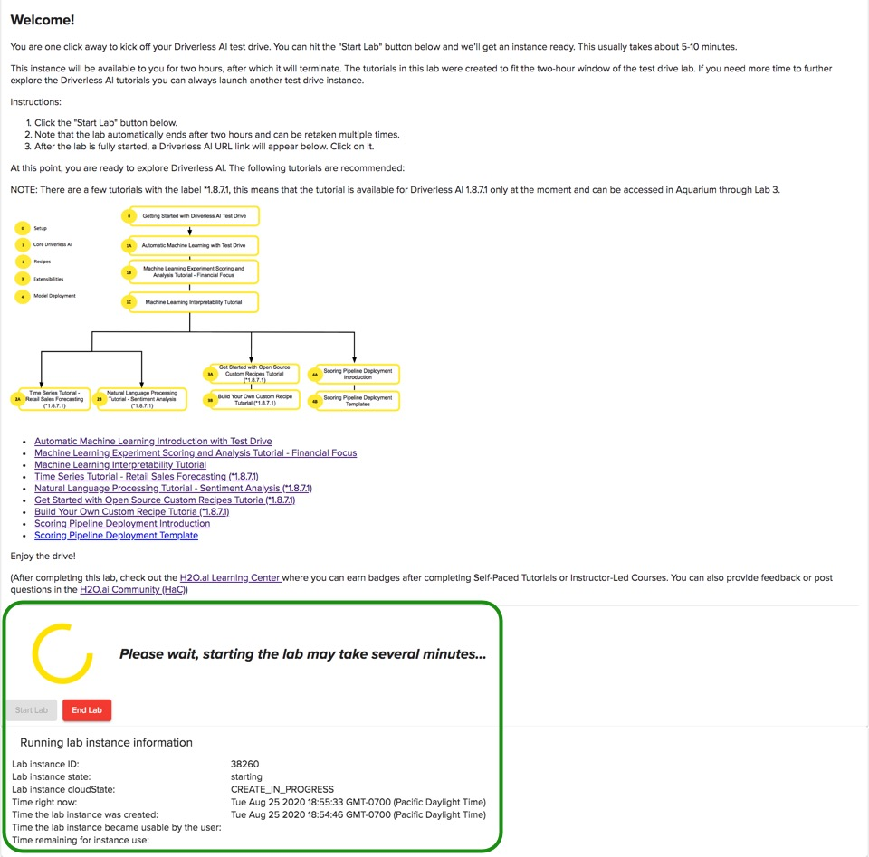

## Test Drive de Driverless AI 

Test Drive es una sesión de laboratorio de dos horas que existe en Aquarium de H2O.ai. Aquarium es el entorno de nube de H2O.ai que proporciona acceso a varias herramientas para talleres, conferencias y capacitación.

Todos los laboratorios tienen un **Lab Duration*** (Duración de laboratorio) específica para completar el laboratorio. **Todas las sesiones de Laboratorio de Driverless AI Test Drive finalizarán después de dos horas. ¡No se guardará ningún trabajo!**. Sin embargo, puedes volver a iniciar el laboratorio varias veces.

Si eres nuevo en Driverless AI, te recomendamos que comiences con **Test Drive!** (la prueba de manejo).

**Nota: El laboratorio Driverless AI Test Drive (de prueba de IA sin conductor del acuario) tiene una clave de licencia incorporada, por lo que no necesita solicitar una para usarla.**

## Como obtener una sesión de Test Drive de dos horas

1\. Vaya al sitio del [Aquarium](http://aquarium.h2o.ai/login) copiando y pegando la URL a continuación en el navegador que elija o simplemente haga clic en Aquarium.

```http://aquarium.h2o.ai/login```

2\. Esto lo llevará a la página de inicio de sesión de Aquarium donde necesita crear una cuenta.

## Como crear una cuenta de Aquarium 

1\. ¡Bienvenido a la página de inicio de sesión de Aquarium!


2\. Selecciona **Create a new account** (Crear una cuenta nueva)


3\. Ingresa la siguiente informacion:

 - First Name (Primer Nombre)
 - Last Name  (Apellido)
 - Organization (Nombre de su orgarnizacion)
 - Country (País)
 - Email (correo electrónico)

4\. Verifica que no eres un robot marcando la casilla "No soy un robot".

5\. Haz clic en **Create account and email temporary password** (Crear cuenta y enviar contraseña temporal por correo electrónico) al final de la página.

**Nota**: La contraseña será enviada a tu correo electrónico en cuestion de minutos.

6\. Revisa tu correo electrónico para obtener la contraseña

## Cómo iniciar sesión

1\. Ingresa el correo electrónico que utilizaste para crear la cuenta de Aquarium.

2\. Ingresa la contraseña que recibiste por correo electrónico de Aquarium.

3\. Verifica que no eres un robot marcando la casilla "No soy un robot".

4\. Haz clic en **Login** (Iniciar Sesión).

**Nota:** Si tiene problemas para iniciar sesión, haga clic en enviarnos un correo electrónico


## Restablecer la contraseña 

1\. Si olvidaste tu contraseña, selecciona  **I forgot my password** (Olvidé mi contraseña)


2\. Ingrese su correo electrónico, verifique que no es un robot marcando la casilla "No soy un robot", luego haga clic en Correo electrónico contraseña temporal, se le enviará otra contraseña por correo electrónico.


## Cómo iniciar y finalizar la sesión de laboratorio de Test Drive
 
Después de un inicio de sesión exitoso, seleccione "Examinar laboratorios" ubicado en la esquina superior izquierda de la página, luego seleccione "Lab 1- Driverless AI Test Drive (x.x.x.x LTS) (1GPU)".

Haga clic en el botón "Ver detalles" en el laboratorio uno, como se muestra en la imagen a continuación.


Después el Laboratorio de prueba de Driverless AI aparecerá: 


**Nota**: 

1. La duración del laboratorio es de 120 minutos, luego de eso la sesión terminará

2. Tenga en cuenta que el laboratorio finaliza automáticamente después de dos horas y puede tomarse varias veces

3. [Centro de aprendizaje H2O.ai](https://training.h2o.ai): construya su base de conocimientos y habilidades a su ritmo. ¡Ingrese a un lugar para compartir conocimientos, mejorar habilidades, compartir ideas y más!

4. [Comunidad H2O.ai (HaC)](https://www.h2o.ai/community/home): HaC es una comunidad para compartir, aprender, establecer redes, hacer preguntas, proporcionar respuestas, dar el siguiente paso y explorar la Inteligencia Artificial , Aprendizaje automático y ciencia de datos. Estamos aquí para democratizar la IA. Se necesitará una aldea para democratizar la IA.

5. El botón de **Start (comienza)** inicia la sesión de laboratorio

1\. Para iniciar un laboratorio, haz clic en **Start Lab** (Iniciar laboratorio). Verás una imagen similar a la siguiente:



2\. Aquarium comenzará una sesión de laboratorio (esto tomará unos minutos). Después de que comience la sesión de laboratorio, verás una imagen similar a ésta:


**Nota**:

 - El tiempo restante para el uso de la instancia
 - URL de Driverless AI 
 - Finalizar el laboratorio

3\. Una vez que el Laboratorio ha comenzado, aparecerá un URL de Driverless AI en la parte inferiorr de la página. Haz clic en ese URL. Esto te llevará a la página de Datasets de H2O.ai Driverless AI.


## Cerrar Sesión

1\. Para cerrar sesión, haz clic en el cuadro en la esquina superior derecha de la página y selecciona cerrar sesión

 

## Preguntas

¿Tiene alguna pregunta sobre el acuario? Regístrese en la Comunidad Slack de H2O.ai y publique sus preguntas en el canal **#cloud**. Los miembros de la comunidad H2O.ai responderán tan pronto como estén disponibles.

Chatee y haga preguntas con los fabricantes de H2O.ai y los usuarios científicos de datos en el espacio de trabajo de H2O.ai Slack

- [Chatee y haga preguntas con los fabricantes de H2O.ai y los usuarios científicos de datos en el espacio de trabajo de H2O.ai Slack](https://www.h2o.ai/community/home)