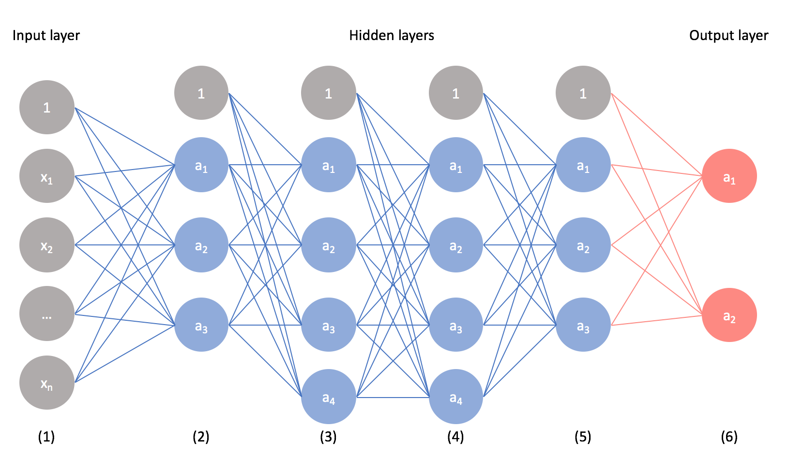

# Image Processing in Driverless AI 

## Outline

- [Objective](#objective)
- [Prerequisites](#prerequisites)
- [Task 1: Launch Experiment One: Predict a Car's Price](#task-1-launch-experiment-one-predict-a-car's-price)
- [Task 2: Transfer learning from pre-trained models](#task-2-transfer-learning-from-pre-trained-models)
- [Task 3: First Approach: Embeddings Transformer (Image Vectorizer)](#task-3-first-approach-embeddings-transformer-image-vectorizer)
- [Task 4: Second Approach: Automatic Image Model](#task-4-second-approach-automatic-image-model)
- [Task 5: Understand Experiment One ](#task-5-understand-experiment-one)
- [Task 6: ](#task-6-)
- [Task 7: ](#task-7-)
- [Task 8: ](#Task-8-)
- [Next Steps](#next-steps)
- [Special Thanks](#special-thanks)

## Objective 

Image processing techniques have become crucial for a diverse range of companies despite their operations in the course of time. In other words, to compete in this global economy, image processing is becoming a requirement for any company hoping to become a credible competitor. Everyone can now see image processing in Agricultural Landscape, Disaster Management, and Biomedical and Other Healthcare Applications. 

With this in mind, and with the hopes to democratize AI, H2O.ai has automated the processes of obtaining high-quality models capable of image processing. 

This tutorial will explore the two different approaches to modeling images in Driverless AI: Embeddings Transformer(Image Vectorizer) and Automatic Image Model. To lay down the foundations for this tutorial, we will review transfer learning from pre-trained models. Right after, we will illustrate the first image modeling approach by building an image model capable of predicting car prices. Directly after, we will better understand the second approach by building an image model capable of predicting a true case of metastatic cancer. In the final analysis, we will compare and contrast each image modeling approach, and we will discuss several scenarios when a given approach will be better. In particular, and as a point of distinction,  we will discuss how the Embeddings Transformer approach only supports a MOJO Scoring Pipeline. Correspondingly, we will discuss how a user can only obtain details about the current best individual model through the Automatic Image Model approach. 

All things consider, let us start. 

## Prerequisites 

You will need the following to be able to do this tutorial:

- Basic knowledge of Driverless AI 
- Completion of the 
- Understanding of Convolutional Neural Networks (CNNs)

- A **Two-Hour Test Drive session**: Test Drive is [H2O.ai's](https://www.h2o.ai) Driverless AI on the AWS Cloud. No need to download software. Explore all the features and benefits of the H2O Automatic Learning Platform.
  - Need a **Two-Hour Test Drive** session? Follow the instructions on this quick tutorial to get a Test Drive session started.

**Note: Aquarium’s Driverless AI Test Drive lab has a license key built-in, so you don’t need to request one to use it. Each Driverless AI Test Drive instance will be available to you for two hours, after which it will terminate. No work will be saved. If you need more time to explore Driverless AI further, you can always launch another Test Drive instance or reach out to our sales team via the contact us form.**

## Task 1: Launch Experiment One: Predict a Car's Price 

As mentioned in this tutorial's objective section, we will use three image models, but running each experiment takes time to run. For this reason, 
the experiment that takes the longest to complete has already been built for you and can be found in Driverless AI's Experiments section. We will use that experiment when exploring the second approach to image processing in Driverless AI. For now, we will follow to build the other two image models that will help us better understand the first approach.

We will start the first experiment so that it can run in the background while we explore the two current approaches to image processing in Driverless AI. Right after, we will follow to understand the dataset and settings used in the first image model. 

Our first image model will predict a car's price (again, we will explore the dataset and all settings for this model in a moment).  

On the *Datasets page*, import the *Kaggle-MyAutoData-dataset*:

1. Click **+ ADD DATASET (OR DRAG & DROP)**

2. Click **AMAZON S3**

3. In the search bar, paste the following s3 URL: *s3://h2o-public-test-data/bigdata/server/ImageData/car_deals.zip*

    - Before pasting clear anything that might be in the search bar

4. Select the following option: **car_deals.zip [776.5MB]**

5. **CLICK TO IMPORT SELECTION**

    - After the dataset is imported successfully, the new dataset will be under the following name: *car_deals.zip*

On the *Datasets page*: 

6. Click the following dataset:  **car_deals.zip** 

7. Click **SPLIT**

Split the dataset into two sets:

8. Name *OUTPUT NAME 1* as follows:  **car_deals_train**

9. Name *OUTPUT NAME 2* as follows:  **car_deals_test**

10. Change the split value to `.75` by adjusting the slider to 
    `75%` or entering `.75` in the section that says *SELECT SPLIT RATIO(BY ROWS)*

11. **SAVE**

Now, you should see the following two new datasets in the *Datasets Page*: 
    
- *car_deals_train*

- *car_deals_test*

On the *Datasets page*: 

12. Click the following dataset: **car_deals_train**

13. Click **PREDICT**

14. First time using Driverless AI? Click **Yes** to get a tour! Otherwise, click **No**

15. Name you experiment `Embeddings-Transformer-A`

16. For the *TEST DATASET* select the following dataset: **car_deals_tes**

18. As a target column, select **Price**

20. **LAUNCH EXPERIMENT**

While our experiment runs in the background, let's discuss the two current approaches to modeling images. 

## Task 2: Transfer learning from pre-trained models

In image classification, the goal is to classify an image based on a set of possible categories. In general, classifying images is a bit hard, but such a difficulty can find ease in **transfer learning**. 

Transfer learning allows anyone to build accurate models that make building image models less painful. Transfer Learning allows you to avoid relearning certain patterns again because you can use patterns others learned when solving a similar and different problem. In general, Transfer Learning prevents many from starting from scratch. 

> ''In computer vision, transfer learning is usually expressed through the use of pre-trained models. A pre-trained model is a model that was trained on a large benchmark dataset to solve a problem similar to the one that we want to solve. Accordingly, due to the computational cost of training such models, it is common practice to import and use models from published literature (e.g. VGG, Inception, MobileNet)" (Pedro Marcelino).

For the most part, pre-trained models used in transfer learning are based on large Convolutional Neural Networks (CNNs). Why? Because CNN's have express high performance and easiness in training. In neural networks, CNNs have become essential to the process of face recognition and object detection. In layman's terms, a CNN can take an input image, process it, and classify it under certain categories (Eg., Snake, Cat, Dog, Monkey).

  general neural network setup

  CNN Overview

    CNN Overview

A typical CNN has two parts:

1. A **Convilitonal Base** is structured by a stack of convolutional and pooling layers, and the goal of this stack is to generate features from the image (input). 

2. A **Classifier** is formed by fully connected layers. The Classifier's goal is to classify the image based on the detected features. 

The following image shows the architecture of a model based on CNNs. It is important to note that this illustration is a simplified version that fits this text's purposes (the illustration doesn't capture the complexity of the model's architecture).  

    Architecture of a model based on CNN.
      </img>    

Therefore, when you are remodeling a pre-trained model for your tasks, you begin by removing the original Classifier, then you add a new classifier that fits your purposes, and lastly, you fine-tune your model according to one of three strategies: 

- **Stradegy 1**: *Train the entire model*

- **Stradegy 2**: *Train some layers and leave the others frozen* 

- **Stradegy 3**: *Freeze the convolutional base*

Accordingly and from a practical perspective, the process of **transfer learning** can be summed up as follows: 

***Select a pre-trained model*** -> ***Classify your problem according to the Size-Similarity Matrix*** -> ***Fine-tune your model***

**Select a pre-trained model**: 

When it comes to selecting a pre-trained model - you pick one that looks suitable for your problem. Note, in Driverless AI; you have access to the following set of models: 

- densenet121
- efficientnetb0
- efficientnetb2
- inception_v3
- mobilenetv2
- resnet34
- resnet50
- seresnet50
- seresnext50
- xception (Selected by default)

Note: You can specify the supported ImageNet pre-trained architectures for image transformer (approach one). 

**Classify your problem according to the Size-Similariy Matrix**

> Classify your problem according to the Size-Similarity Matrix. In [the following image] you have ‘The Matrix’ that controls your choices. This matrix classifies your computer vision problem considering the size of your dataset and its similarity to the dataset in which your pre-trained model was trained. As a rule of thumb, consider that your dataset is small if it has less than 1000 images per class. Regarding dataset similarity, let common sense prevail. For example, if your task is to identify cats and dogs, ImageNet would be a similar dataset because it has images of cats and dogs. However, if your task is to identify cancer cells, ImageNet can’t be considered a similar dataset.

**Fine-tune your model**

Here you can use the Size-Similarity Matrix to oversee your selection and then refer to the three alternatives we mentioned before about remodeling a pre-trained model. The following image provides a visual summary of the text that follows.

> **Quadrant 1**. "Large dataset, but different from the pre-trained model’s dataset. This situation will lead you to Strategy 1. Since you have a large dataset, you’re able to train a model from scratch and do whatever you want. Despite the dataset dissimilarity, in practice, it can still be useful to initialise your model from a pre-trained model, using its architecture and weights"(Pedro Marcelino).

> **Quadrant 2**. "Large dataset and similar to the pre-trained model’s dataset. Here you’re in la-la land. Any option works. Probably, the most efficient option is Strategy 2. Since we have a large dataset, overfitting shouldn’t be an issue, so we can learn as much as we want. However, since the datasets are similar, we can save ourselves from a huge training effort by leveraging previous knowledge. Therefore, it should be enough to train the classifier and the top layers of the convolutional base"(Pedro Marcelino).

> **Quadrant 3**. "Small dataset and different from the pre-trained model’s dataset. This is the 2–7 off-suit hand of computer vision problems. Everything is against you. If complaining is not an option, the only hope you have is Strategy 2. It will be hard to find a balance between the number of layers to train and freeze. If you go to deep your model can overfit, if you stay in the shallow end of your model you won’t learn anything useful. Probably, you’ll need to go deeper than in Quadrant 2 and you’ll need to consider data augmentation techniques (a nice summary on data augmentation techniques is provided here)"(Pedro Marcelino).

> **Quadrant 4**. "Small dataset, but similar to the pre-trained model’s dataset. I asked Master Yoda about this one he told me that ‘be the best option, Strategy 3 should’. I don’t know about you, but I don’t underestimate the Force. Accordingly, go for Strategy 3. You just need to remove the last fully-connected layer (output layer), run the pre-trained model as a fixed feature extractor, and then use the resulting features to train a new classifier"(Pedro Marcelino).

As noted above, models for image classification that result from a transfer learning approach based on pre-trained convolutional neural networks are usually composed of two parts: 

1. **Convolutional base**, which performs feature extraction from an input (image). 

2. **Classifier**, which classifies the input image based on the convolutional base's features. 

*Note*, one can follow several approaches when building the Classifier. For example:

> **Global Average Pooling**: In this approach, instead of adding fully connected layers on top of the convolutional base, we add a global average pooling layer and feed its output directly into the softmax activated layer. Lin et al. (2013) provides a detailed discussion on the advantages and disadvantages of this approach.

Other approaches include Fully-connected layers and Linear support vector machines. 

## Task 3: First Approach: Embeddings Transformer (Image Vectorizer)

The Image Vectorizer transformer utilizes pre-trained ImageNet models to convert a column with an image path or URI ((Uniform Resource Identifier)) to an embeddings (vector) representation that is derived from the last global average pooling layer of the model. The resulting vector is then used for modeling in Driverless AI.

There are several options in the Expert Settings panel that allow you to configure the Image Vectorizer transformer. This panel is available from within the experiment page above the Scorer knob. Refer to Image Settings for more information on these options.

Notes:

This modeling approach supports classification and regression experiments.

This modeling approach supports the use of mixed data types (any number of image columns, text columns, numeric or categorical columns)

## Task 4: Second Approach: Automatic Image Model

Automatic Image Model is an AutoML model that accepts only an image and a label as input features. This model automatically selects hyperparameters such as learning rate, optimizer, batch size, and image input size. It also automates the training process by selecting the number of epochs, cropping strategy, augmentations, and learning rate scheduler.

Automatic Image Model uses pre-trained ImageNet models and starts the training process from them. The possible architectures list includes all the well-known models: (SE)-ResNe(X)ts; DenseNets; EfficientNets; Inceptions; etc.

Notes:

This modeling approach only supports a single image column as an input.

This modeling approach does not support any transformers.

This modeling approach supports classification and regression experiments.

This modeling approach does not support the use of mixed data types because of its limitation on input features.

This modeling approach does not use Genetic Algorithm (GA).

The use of one or more GPUs is strongly recommended for this modeling approach.

If an internet connection is available, ImageNet pretrained weights are downloaded automatically. If an internet connection is not available, weights must be downloaded from http://s3.amazonaws.com/artifacts.h2o.ai/releases/ai/h2o/pretrained/autoimage_weights.zip and extracted into ./tmp or tensorflow_image_pretrained_models_dir (specified in the config.toml file).

## Task 5: Understand Experiment One

## Task 6:

 

## Task 7: 

## Task 8: 

## Next Steps: 

## Special Thanks: 

