# Machine Learning Experiment Scoring and Analysis - Financial Focus

## Outline
- [Objective](#objective)
- [Prerequisites](#prerequisites)
- [Task 1:  Launch Experiment](#task-1-launch-experiment)
- [Task 2: Explore Experiment Settings and Expert Settings](#task-2-explore-experiment-settings-and-expert-settings)
- [Task 3: Experiment Scoring and Analysis Concepts](#task-3-experiment-scoring-and-analysis-concepts)
- [Task 4: Experiment Results Summary and Diagnostics](#task-4-experiment-results-summary)
- [Task 5: Diagnostics Scores and Confusion Matrix](#task-5-diagnostics-scores-and-confusion-matrix)
- [Task 6: ER: ROC](#task-6-er-roc)
- [Task 7: ER: Prec-Recall](#task-7-er-prec-recall)
- [Task 8: ER: Gains](#task-8-er-gains)
- [Task 9: ER: LIFT](#task-9-er-lift)
- [Task 10: Kolmogorov-Smirnov Chart](#task-10-kolmogorov-smirnov-chart)
- [Task 11: Experiment AutoDocs](#task-11-experiment-autodocs)
- [Next Steps](#next-steps)


## Objective

Many tools, such as ROC and Precision-Recall Curves, are available to evaluate how good or bad a classification model predicts outcomes. In this self-paced course, we will use a subset of the Freddie Mac Single-Family Loan-Level dataset to build a classification model and use it to predict if a loan will become delinquent. Through H2O's Driverless AI Diagnostic tool, we will explore the financial impacts the false positive and false negative predictions have while exploring tools like ROC Curve, Prec-Recall, Gain Charts, Lift Charts, and K-S Chart. Finally, we will explore a few metrics such as AUC, F-Scores, GINI, MCC, and Log Loss to evaluate the generated model's performance.

**Note:** We recommend that you go over the entire self-paced course first to review all the concepts; that way, you will be more familiar with the content once you start the experiment.
  
## Prerequisites

You will need the following to be able to do this self-paced course:

- Basic knowledge of Machine Learning and Statistics
- A Driverless AI environment
- Basic knowledge of Driverless AI or doing the [Automatic Machine Learning Introduction with Driverless AI](https://training.h2o.ai/products/self-paced-course-1a-automatic-machine-learning-introduction-with-driverless-ai)
- A **Two-Hour Test Drive session**: Test Drive is H2O.ai's Driverless AI on the AWS Cloud. No need to download software. Explore all the features and benefits of the H2O Automatic Learning Platform.
  - Need a **Two-Hour Test Drive** session? Follow the instructions on [this quick self-paced course](https://training.h2o.ai/products/self-paced-course-0-getting-started-with-driverless-ai-test-drive) to get a Test Drive session started.

**Note: Aquarium’s Driverless AI Test Drive lab has a license key built-in, so you don’t need to request one to use it. Each Driverless AI Test Drive instance will be available to you for two hours, after which it will terminate. No work will be saved. If you need more time to further explore Driverless AI, you can always launch another Test Drive instance or reach out to our sales team via the [contact us form](https://www.h2o.ai/company/contact/).**

## Task 1: Launch Experiment

### About the Dataset

This dataset contains information about “loan-level credit performance data on a portion of fully amortizing fixed-rate mortgages that Freddie Mac bought between 1999 to 2017. Features include demographic factors, monthly loan performance, credit performance including property disposition, voluntary prepayments, MI Recoveries, non-MI recoveries, expenses, current deferred UPB and due date of last paid installment.”[1]

### Download the Dataset

For our experiment, we will be using a subset of the Freddie Mac Single-Family loan-level dataset which contains 27 columns and 500,137 rows. Please download the H2O's subset [here.](https://s3.amazonaws.com/data.h2o.ai/DAI-Tutorials/loan_level_500k.csv)

### Launch Experiment

Load the **loan_level_500K.csv** to Driverless AI:

1\. Click **+Add Dataset (or Drag and Drop)** on the **Datasets overview** page.

2\. Click on **Upload File**, then select the **loan_level_500K.csv** file that you previously downloaded.

3\. Once the file is uploaded, select **Details**.


4\. Let’s take a quick look at the columns:


- *Things to Note:*</br>
 **a.** CREDIT_SCORE</br>
 **b.** FIRST_PAYMENT_DATE</br>
 **c.** FIRST_TIME_HOMEBUYER_FLAG</br>
 **d.** MATURITY_DATE</br>
 **e.** METROPOLITAN_STATISTICAL_AREA</br>
 **f.** MORTGAGE_INSURANCE_PERCENTAGE</br>
 **g.** NUMBER_OF_UNITS</br>
 **h.** OCCUPANCY_STATUS</br>

5\. Continue scrolling through the current page if you want to see all the other columns.

6\. Return to the **Datasets** overview page.

7\. Click on the **loan_level_500k.csv** file then split.

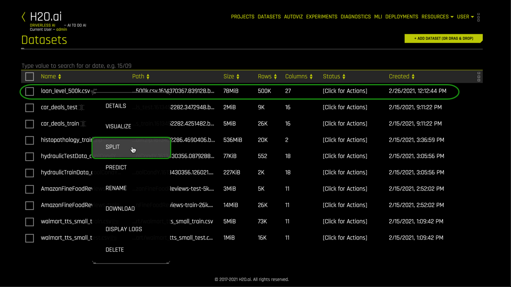

8\.  Split the data into two sets: **freddie_mac_500_train** and **freddie_mac_500_test**. Use the image below as a guide:

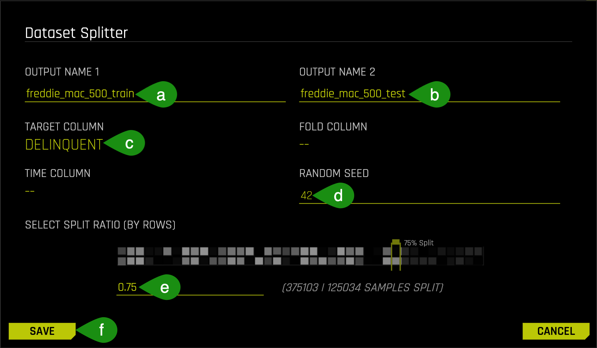

- *Things to Note:*</br>
  **a.** Type ```freddie_mac_500_train``` for OUTPUT NAME 1, this will serve as the training set</br>
  **b.** Type ```freddie_mac_500_test``` for OUTPUT NAME 2, this will serve as the test set</br>
  **c.** For Target Column select **Delinquent**</br>
  **d.** You can set the Random Seed to any number you'd like. We chose **42**; by choosing a random seed we will obtain a consistent split</br>
  **e.** Change the split value to **.75** by adjusting the slider to **75%** or entering **.75** in the section that says Train/Valid Split Ratio</br>
  **f.** **Save**

The training set contains 375k rows, each row representing a loan, and 27 columns representing the attributes of each loan including the column that has the label we are trying to predict. 

 **Note:** the actual data in training and test split vary by user, as the data is split randomly. The Test set contains 125k rows, each row representing a loan, and 27 attribute columns representing attributes of each loan.

9\. Verify that there are three datasets, **freddie_mac_500_test**, **freddie_mac_500_train**, and **loan_level_500k.csv**:

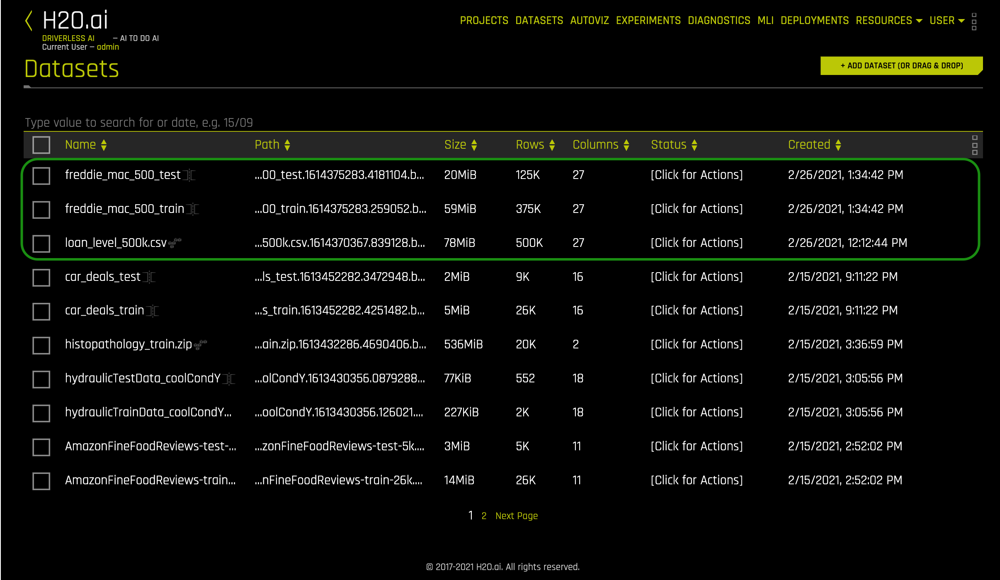

10\. Click on the **freddie_mac_500_train** file then select **Predict**.

11\. Select **Not Now** on the **First time Driverless AI, Click Yes to get a tour!**. A similar image should appear:

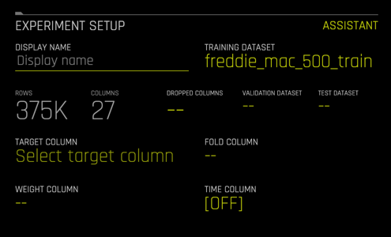</br>

Name your experiment `Freddie Mac Classification Tutorial`

12\. Select **Dropped Columns**, drop the following 2 columns: 

- **Prepayment_Penalty_Mortgage_Flag**
- **PREPAID**
- Select **Done**

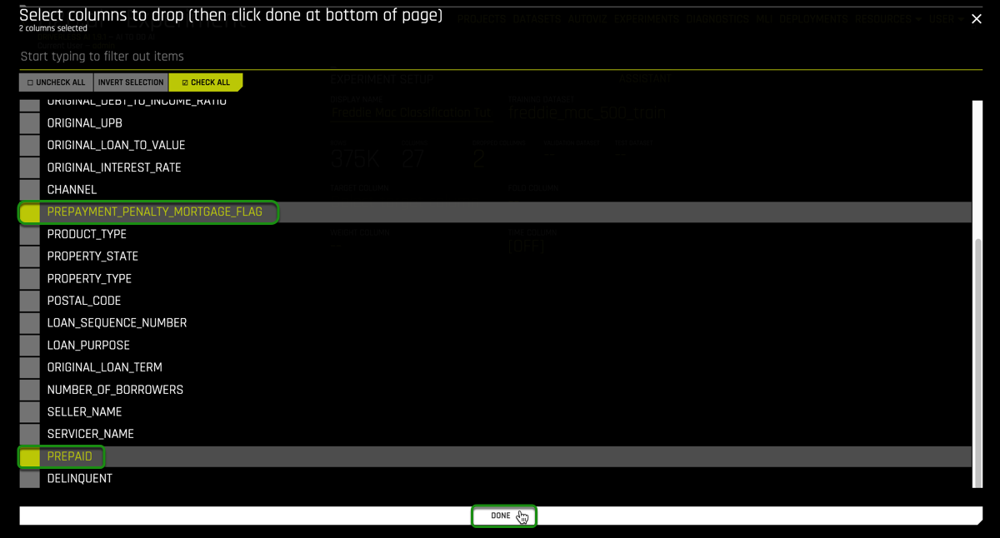

**Note:** These two columns are dropped because they are both clear indicators that a loan will become delinquent and will cause data leakage.

13\. Select **Target Column**, then select **Delinquent**:


14\. Select **Test Dataset**, then **freddie_mac_500_test**:

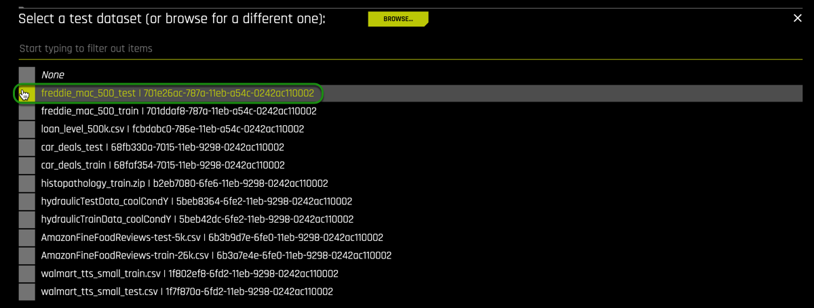

15\. A similar Experiment page should appear:   

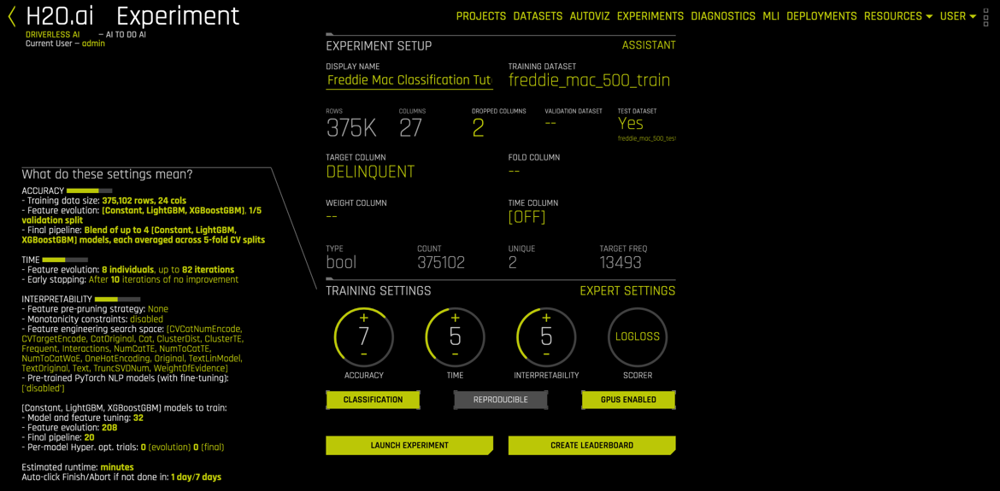    

On task 2, we will explore and update the **Experiment Settings**.

### References

[1] [Freddie Mac Single-Family Loan-Level Dataset.](http://www.freddiemac.com/research/datasets/sf_loanlevel_dataset.html)

## Task 2: Explore Experiment Settings and Expert Settings

1\. Hover over to **Experiment Settings** and note the three knobs, **Accuracy**, **Time** and **Interpretability**.

The **Experiment Settings** describe the Accuracy, Time, and Interpretability of your specific experiment. The knobs on the experiment settings are adjustable, as the values change the meaning of the settings on the left-bottom page.

Here is an overview of the Experiments settings: 

- **Accuracy** - relative accuracy – higher values, should lead to higher confidence in model performance (accuracy).
- **Time** - relative time for completing the experiment. Higher values will take longer for the experiment to complete.
- **Interpretability** - the ability to explain or to present in understandable terms to a human. The higher the interpretability the simpler the features that will be extracted.  


### Accuracy

By increasing the accuracy setting, Driverless AI gradually adjusts the method for performing the evolution and ensemble. A machine learning ensemble consists of multiple learning algorithms to obtain a better predictive performance than could be obtained from any single learning algorithm[1]. With a low accuracy setting, Driverless AI varies features(from feature engineering) and models, but they all compete evenly against each other. At higher accuracy, each independent main model will evolve independently and be part of the final ensemble as an ensemble over different main models. Driverless AI will evolve+ensemble feature types like Target Encoding on and off that evolve independently at higher accuracy. Finally, at the highest accuracies, Driverless AI performs both model and feature tracking and ensembles all those variations.

### Time

Time specifies the relative time for completing the experiment (i.e., higher settings take longer). Early stopping will take place if the experiment doesn’t improve the score for the specified amount of iterations. The higher the time value, the more time will be allotted for further iterations, which means that the recipe will have more time to investigate new transformations in feature engineering and hyperparameter tuning.

### Interpretability 

The interpretability knob is adjustable. The higher the interpretability, the simpler the features the main modeling routine will extract from the dataset. If the interpretability is high enough, then a monotonically constrained model will be generated.

2\.  For this self-paced course update the following experiment settings so that they match the image below: 
- **Accuracy : 4**
- **Time: 3**
- **Interpretability: 4**
- **Scorer: Logloss** 

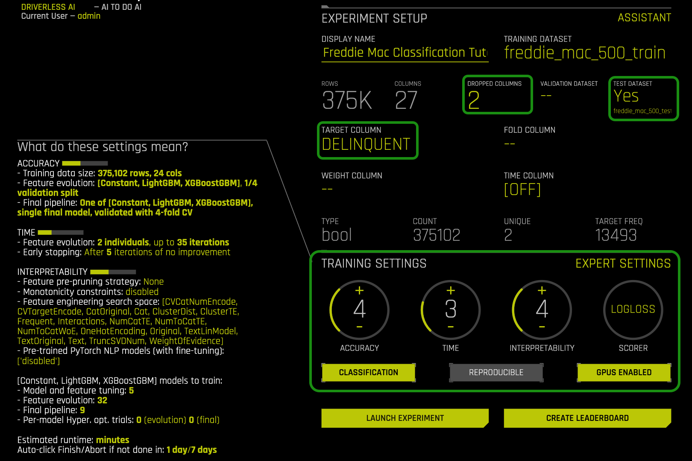

This configuration was selected to generate a model quickly with a sufficient level of accuracy in the H2O Driverless Test Drive environment.

### Expert Settings

**Expert Settings** are options that are available for those who would like to set their settings manually. We will explore some of these settings below.

3\. Hover over to **Expert Settings** and click on it:

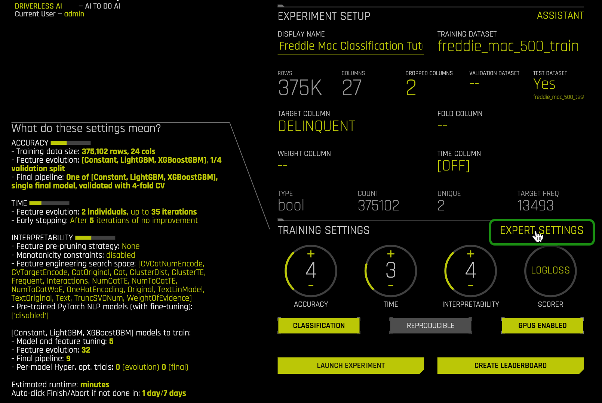

An image similar to the one below will appear:

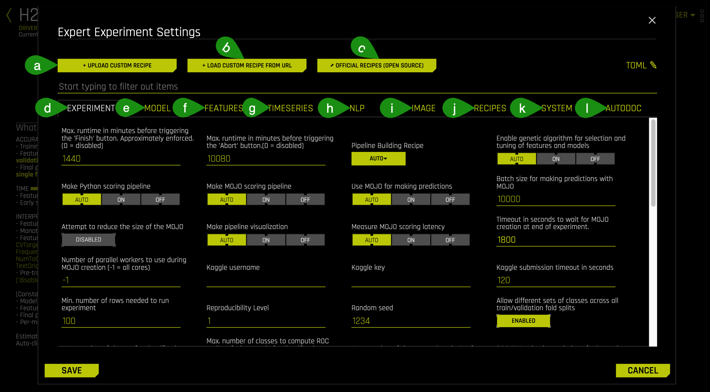

- *Things to Note:*</br>
**a.** **+ Upload Custom Recipe**: Option to upload a custom recipe from personal environment</br>
**b.** **+ Load Custom Recipe From URL**: Option to add a custom recipe using a URL</br> 
**c.** **Official Recipes (Open Source)**: Link to the Official Recipes page on GitHub</br>
**d.** **Experiment**: This section includes settings that can be used to customize the experiment like total runtime, reproducibility level, pipeline building, feature brain control, adding config.toml settings and more. Please check out the [Experiment Settings](http://docs.h2o.ai/driverless-ai/latest-stable/docs/userguide/expert_settings/experiment_settings.html#experiment-settings) section in our Documentation to learn more and to get a complete list of these settings.</br>
**e.** **Model**: This section includes settings that can be changed to control the models you want to train and specific settings for models. Please check out the [Model Settings](http://docs.h2o.ai/driverless-ai/latest-stable/docs/userguide/expert_settings/model_settings.html#model-settings) section in our Documentation to learn more and to get a complete list of these settings.</br>
**f.** **Features**: This section includes settings that can be changed to customize the way Driverless AI performs feature engineering. Please check out the [Feature Settings](http://docs.h2o.ai/driverless-ai/latest-stable/docs/userguide/expert_settings/features_settings.html#features-settings) section in our Documentation to learn more and to get a complete list of these settings.</br>
**g.** **Timeseries**: This section includes settings that can be used to customize Time Series experiments. Please check out the [Time Series Settings](http://docs.h2o.ai/driverless-ai/latest-stable/docs/userguide/expert_settings/timeseries_settings.html#time-series-settings) section in our Documentation to learn more and to get a complete list of these settings.</br>
**h.** **NLP**: This section includes settings that can be used to customize NLP experiments. Please check out the [NLP Settings](http://docs.h2o.ai/driverless-ai/latest-stable/docs/userguide/expert_settings/nlp_settings.html#nlp-settings) section in our Documentation to learn more and to get a complete list of these settings.</br>
**i.** **Image**: This section includes settings that allow you to customize an image processing experiment. Please check out the [Image Settings](http://docs.h2o.ai/driverless-ai/latest-stable/docs/userguide/expert_settings/image_settings.html#image-settings) section in our documentation to learn more and to get a complete list of these settings.</br>
**j.** **Recipes**: This section includes settings that allow you to specify different options for your custom transformers, models, and scorers. Please check out the [Recipes Settings](http://docs.h2o.ai/driverless-ai/latest-stable/docs/userguide/expert_settings/recipes_settings.html#recipes-settings) section in our Documentation to learn more and to get a complete list of these settings.</br>
**k.** **System**: This section allows you to customize your environment and how you want to use your resources for your experiments. Please check out the [System Settings](http://docs.h2o.ai/driverless-ai/latest-stable/docs/userguide/expert_settings/system_settings.html) section in our Documentation to learn more and to get a complete list of these settings.</br>
**l.** **AutoDoc**: This section includes settings that can be used to configure AutoDoc. Please check out the [AutoDoc Settings](http://docs.h2o.ai/driverless-ai/latest-stable/docs/userguide/expert_settings/autodoc_settings.html) section in our Documentation to learn more and to get a complete list of these settings.</br>

4\. For this experiment turn **ON RuleFit models**, under **Model** tab the select **Save**. 

The RuleFit[2] algorithm creates an optimal set of decision rules by first fitting a tree model and then fitting a Lasso (L1-regularized) GLM model to create a linear model consisting of the most important tree leaves (rules). The RuleFit model helps with exceeding the accuracy of Random Forests while retaining explainability of decision trees.


Turning on the RuleFit model will be added to the list of algorithms that Driverless AI will consider for the experiment. The selection of the algorithm depends on the data and the configuration selected.

5\. Before selecting **Launch**, make sure your **Experiment** page looks similar to the one below; once ready, click on **Launch**. 


Learn more about what each setting means and how it can be updated from its default values by visiting H2O’s Documentation- [Expert Settings](http://docs.h2o.ai/driverless-ai/latest-stable/docs/userguide/expert-settings.html?highlight=expert%20settings)

### Resources

[1] [Ensemble Learning](https://en.wikipedia.org/wiki/Ensemble_learning)</br>
[2] [J. Friedman, B. Popescu. “Predictive Learning via Rule Ensembles”. 2005](http://statweb.stanford.edu/~jhf/ftp/RuleFit.pdf)

### Deeper Dive 
- [To better understand the impact of setting the Accuracy, Time and Interpretability Knobs between 1 and 10 in H2O Driverless AI](http://docs.h2o.ai/driverless-ai/latest-stable/docs/userguide/experiment-settings.html?highlight=interpretability#accuracy-time-and-interpretability-knobs)
- For more information about additional setting in [Expert Settings for H2O Driverless AI](http://docs.h2o.ai/driverless-ai/latest-stable/docs/userguide/expert-settings.html?highlight=expert%20settings)

## Task 3: Experiment Scoring and Analysis Concepts

As we learned in the [Automatic Machine Learning Introduction with Driverless AI,](https://training.h2o.ai/products/self-paced-course-1a-automatic-machine-learning-introduction-with-driverless-ai) it is essential to evaluate a model's performance when it is complete, especially before production. These metrics are used to evaluate the quality of the model that was built and what model score threshold should be used to make predictions. There are multiple metrics for assessing a binary classification machine learning models such as Receiver Operating Characteristics or ROC curve, Precision and Recall or Prec-Recall, Lift, Gain and K-S Charts, to name a few. Each metric evaluates different aspects of the machine learning model. The concepts below are for metrics used in H2O’s Driverless AI to assess the performance of classification models that it generated. The concepts are covered at a very high level. To learn more in-depth about each metric covered here, we have included additional resources at the end of this task. 


### Binary Classifier

Let’s take a look at a binary classification model. A binary classification model predicts in what two categories (classes) the elements of a given set belong to. In the case of our example, the two categories (classes) are **defaulting** on your home loan and **not defaulting**. The generated model should be able to predict under which category each customer falls.

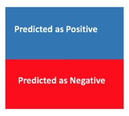

- **Note:** Our target column is `DELINQUENT`, which describes the state of a loan. However, we will be doing the analysis of a person **defaulting** on their loans. In other words, a **delinquent loan is equivalent to someone defaulting on their loans**.

Two other possible outcomes need to be considered, the false negative and false positives. These are the cases when the model predicted that someone did not default on their bank loan and did. The other case is when the model predicted that someone defaulted on their mortgage, but in reality, they did not. The total outcomes are visualized through a confusion matrix, which is the  two by two table seen below:

Binary classifications produce four outcomes: 

**Predicticted as Positive**:</br>
True Positive = TP</br>
False Positive = FP

**Predicted as Negative**:</br>
True Negative = TN </br>
False Negative = FN 


**Confusion Matrix**:


From the confusion matrix, we can measure error-rate, accuracy, specificity, sensitivity, and precision, all useful metrics to test how good our model is at classifying or predicting. These metrics will be defined and explained in the next sections.

On a fun side note, you might be wondering why the name "Confusion Matrix"? Some might say that it's because a confusion matrix can be very confusing. Jokes aside, the confusion matrix is also known as the **error matrix** since it makes it easy to visualize the classification rate of the model, including the error rate. The term "confusion matrix" is also used in psychology; the Oxford dictionary defines it as "A matrix representing the relative frequencies with which **each of a number of stimuli is mistaken for each of the others** by a person in a task requiring recognition or identification of stimuli. Analysis of these data allows a researcher to extract factors (2) indicating the underlying dimensions of similarity in the respondent's perception. For example, in color-identification tasks, relatively frequent **confusion** of reds with greens would tend to suggest daltonism." [1] In other words, how frequently does a person performing a classification task confuse one item for another? In the case of ML, the model implements the classification and evaluates the frequency in which it confuses one label from another instead of a human.

### ROC

An essential tool for classification problems is the ROC Curve or Receiver Operating Characteristics Curve. The ROC Curve visually shows the performance of a binary classifier; in other words, it  “tells how much a model is capable of distinguishing between classes” [2] and the corresponding threshold. Continuing with the Freddie Mac example, the output variable or the label is whether or not the customer will default on their loan and at what threshold.

Once the model has been built and trained using the training dataset, it gets passed through a classification method (Logistic Regression, Naive Bayes Classifier, support vector machines, decision trees, random forest, etc.), which will give the probability of each customer defaulting.

The ROC curve plots the Sensitivity or true positive rate (y-axis) versus 1-Specificity or false positive rate (x-axis) for every possible classification threshold. A classification threshold or decision threshold is the probability value that the model will use to determine where a class belongs to. The threshold acts as a boundary between classes to determine one class from another. Since we are dealing with probabilities of values between 0 and 1, an example of a threshold can be 0.5. This means that the model will assign anything below 0.5 to one class and anything above 0.5 to another class. The threshold can be selected to maximize the true positives while minimizing false positives. A threshold depends on the scenario the ROC curve is applied to and the type of output we look to maximize. Learn more about the application of threshold and its implications on [Task 6: ER: ROC](#task-6-er-roc).

Given our example of use case of predicting loans, the following provides a description for the values in the confusion matrix:

 - TP = 1 = Prediction matches result that someone did default on a loan
 - TN = 0 = Prediction matches result that someone did not default on a loan
 - FP = 1 = Predicting that someone will default but in actuality they did not default
 - FN = 0 = Predicting that someone did not default on their bank loan but actually did.


To better understand sensitivity and specificity, we need to look at the true positive rate and the true negative rate. The true positive rate is the ratio of true positive predictions divided by all positive actuals and is also known as **recall** or **sensitivity.** Sensitivity is measured from 0.0 to 1.0, where 0 is the worst and 1.0 is the best sensitivity. Sensitivity is a measure of how well the model is predicting for the positive case.

The true negative rate is the ratio of the number of true negative predictions divided by the sum of true negatives and false positives. True negative ratio, known as **specificity,** is measured from 0.0 to 1.0, where 0 is the worst and 1.0 is the best specificity. Specificity is a measure of how well the model is predicting for the negative case correctly. 

The false negative rate is *1 - Sensitivity*, or the ratio of false negatives divided by the sum of the true positives and false negatives [3]. 

The following image provides an illustration of the ratios for sensitivity, specificity and false negative rate. 

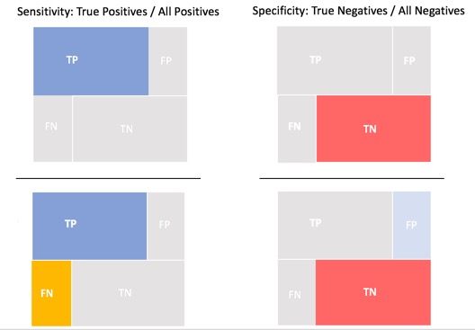

**Recall** = **Sensitivity** = True Positive Rate = TP / (TP + FN)</br>
**Specificity** = True Negative Rate = TN / (FP + TN)

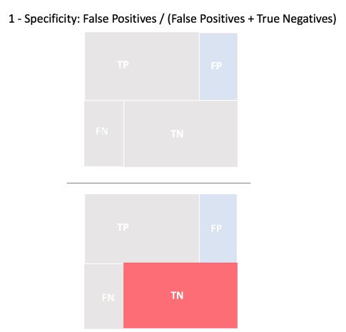

**1 - Specificity** =  False Positive Rate = 1 - True Negative Rate = FP / (FP + TN )

A ROC Curve is also able to tell you how well your model did by quantifying its performance. The scoring is determined by the percent of the area that is under the ROC curve otherwise known as Area Under the Curve or AUC. 

Below are four types of ROC Curves with its AUC:

**Note:** The closer the ROC Curve is to the left ( the bigger the AUC percentage), the better the model is at separating between classes. 

The Perfect ROC Curve (in red) below can separate classes with 100% accuracy and has an AUC of 1.0  (in blue):

  			

The ROC Curve below is very close to the left corner, and therefore it does a good job in separating classes with an AUC of 0.7 or 70%:

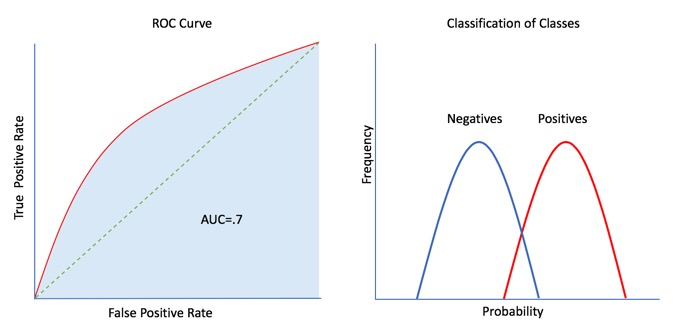

In the case above, 70% of the cases the model correctly predicted the positive and negative outcome and 30% of the cases it did some mix of FP or FN.

This ROC Curve lies on the diagonal line that splits the graph in half. Since it is further away from the left corner, it does a very poor job at distinguishing between classes, this is the worst-case scenario, and it has an AUC of .05 or 50%:

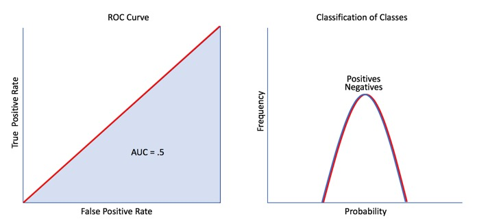

An AUC of 0.5 tells us that our model is as good as a random model with a 50% chance of predicting the outcome. Our model is not better than flipping a coin; 50% of the time, the model can correctly predict the outcome. 

Finally, the ROC Curve below represents another perfect scenario! When the ROC curve lies below the 50% model or the random chance model, the model must be reviewed carefully. This is because there could have been potential mislabeling of the negatives and positives that caused the values to be reversed, and hence the ROC curve is below the random chance model. Although this ROC Curve looks like it has an AUC of 0.0 or 0%, we get an AUC of 1 or 100% when we flip it.

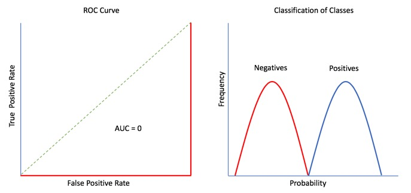

A ROC curve is a useful tool because it only focuses on how well the model can distinguish between classes. “AUC’s can help represent the probability that the classifier will rank a randomly selected positive observation higher than a randomly selected negative observation” [4]. However, for models where the prediction happens rarely, a high AUC could provide a false sense that the model is correctly predicting the results. This is where the notion of precision and recall become important.

### Applicability of ROC Curves in the Real World

ROC and AUC curves are important evaluation metrics for calculating the performance of any classification model. In hopes of understanding the applicability of ROC curves, consider the next ROC curves with their AUC and smooth histograms from a binary classifier model trying to make the following point: 

**Task**: Identify the most effective ROC Curve that will distinguish between green and red apples. 

Below are three types of ROC Curves in correlation to finding the perfect ROC that will distinguish between red and green apples. 

As noted above, the closer the ROC curve is to the left (the more significant the AUC percentage), the better the model is at separating classes. 

**Note**: Before moving forward, it's essential to clarify that the smooth histograms plots resulted from a given dataset. Such data has determined that apples with more than 50% (threshold) of their body being red will be considered red apples. Therefore, anything below 50% will be a green apple.


#### ROC One: 


In this case, the above smooth Histogram (1A) is telling us that the distribution will be as follows: 

The green bell curve represents green apples while the red bell curve represents the red apples, and the threshold will be at 50%. The x-axis represents the predicted probabilities, while the y-axis represents the count of observations.

From general observations, we can see that the smooth Histogram shows that the current classifier can distinguish between red and green apples 100% of the time.

When we draw the ROC Curve (1B) for the smooth Histogram above, we will get the following results: 

The ROC Curve tells us how good the model is at distinguishing between two classes: in this case, we refer to red and green apples as the two classes. When looking at the ROC Curve, it will have an AUC of 1 (in blue). Hence, as discussed earlier, an AUC of one will tell us that the model performs at 100% (perfect performance). Although, not always the case. We can have a ROC Curve of zero, and if we flip the curve, it can give us a ROC of one; that is why we always need to review the model carefully. 

Accordingly, this ROC Curve tells us that the classifier model can distinguish between red and green apples 100% of all cases when it has to identify. Consequently, the random model becomes absolute. For reference, the random model (dash line) essentially represents a classifier that does not do better than random guessing. 

Therefore, the ROC Curve for this smooth Histogram will be perfect because it can separate red and green apples. 

#### ROC Two: 


When we draw the ROC curve (2B) for the smooth Histogram (2A) above, we will get the following results: 

When looking at the ROC Curve, it will have an AUC of .7 (in blue). 

Accordingly, this ROC curve tells us that the classifier model can't adequately distinguish between red and green apples 100% of all cases. And in a way, this classifier gets closer to the random model that does not do better than random guessing. 

Therefore, this ROC curve is not perfect at classifying red and green apples. That is not to say that the ROC curve is entirely wrong; it just has a 30% margin of error. 

#### ROC Three: 

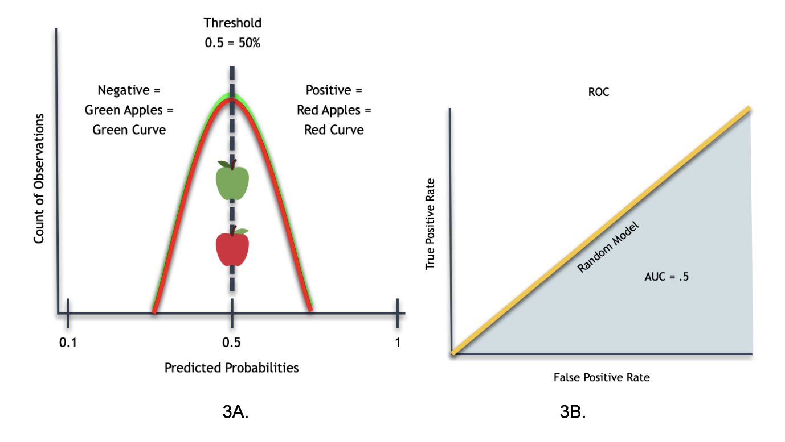

When we draw the ROC curve (3B) for the smooth Histogram (3A) above, we will get the following results: 

When looking at the ROC Curve, it will have an AUC of .5 (in blue). 

Accordingly, this ROC curve tells us that the classifier model can't adequately distinguish between red and green apples 100% of all cases. In a way, this classifier becomes similar to the random model that does not do better than random guessing. 

Therefore, this ROC curve is not perfect at classifying red and green apples. That is not to say that the ROC curve is entirely wrong; it has a 50% margin of error. 

#### Conclusion

In this case, we will choose the first ROC Curve (with a great classifier) because it leads to an AUC of 1.0 (can separate the green apple class and red apple class (the two classes) with 100% accuracy). As you can see, the ROC curve greatly help us to evaluate our model. Next, we will be looking at another plot that can be a compliment to the ROC curve.

### Prec-Recall

The Precision-Recall Curve or Prec-Recall or **P-R** is another tool for evaluating classification models derived from the confusion matrix. Prec-Recall is a complementary tool to ROC curves, especially when the dataset has a significant skew. The Prec-Recall curve plots the precision or positive predictive value (y-axis) versus sensitivity or true positive rate (x-axis) for every possible classification threshold. At a high level, we can think of precision as a measure of exactness or quality of the results. On the other hand, recall is a measure of completeness or quantity of the model's results. Prec-Recall measures the relevance of the results obtained by the model.

**Precision** is the ratio of correct positive predictions divided by the total number of positive predictions. Precision, also known as **positive predictive value,** is measured from 0.0 to 1.0, where 0.0 is the worst and 1.0 is the best precision. Precision is more focused on the positive class than in the negative class; it measures the probability of correct detection of positive values (TP and FP).
 
**Precision** = True positive predictions / Total number of positive predictions = TP  / (TP + FP)

As mentioned in the ROC section, **Recall** is the true positive rate: the ratio of the number of true positive predictions divided by all positive actuals. Recall is a metric of the actual positive predictions. It tells us how many correct positive results occurred from all the positive samples available during the model test.

**Recall** = **Sensitivity** = True Positive Rate = TP / (TP + FN)


Below is another way of visualizing Precision and Recall, this image was borrowed from [https://commons.wikimedia.org/wiki/File:Precisionrecall.svg](https://commons.wikimedia.org/wiki/File:Precisionrecall.svg).


A Prec-Recall Curve is created by connecting all precision-recall points through non-linear interpolation [5]. The Pre-Recall plot is broken down into two sections, “Good” and “Poor” performance. “Good” performance can be found on the upper right corner of the plot and “Poor” performance on the lower-left corner; see the image below to view the perfect Pre-Recall plot. The baseline generates this division. The baseline for Prec-Recall is determined by the ratio of Positives(P) and Negatives(N), where y = P/(P+N), this function represents a classifier with a random performance level[6]. When the dataset is balanced, the value of the baseline is y = 0.5. If the dataset is imbalanced where the number of P’s is higher than N’s, then the baseline will be adjusted accordingly and vice versa.

The Perfect Prec-Recall Curve is a combination of two straight lines (in red). The plot tells us that the model made no prediction errors! In other words, no false positives (perfect precision) and no false negatives (perfect recall), assuming a baseline of 0.5.


Similarly to the ROC curve, we can use the area under the curve or AUC to compare the model's performance with other models.

**Note:** The closer the Prec-Recall Curve is to the upper-right corner (the bigger the AUC percentage), the better the model predicts the true positives. 

This Prec-Recall Curve in red below has an AUC of approximately 0.7 (in blue) with a baseline of 0.5:


Finally, this Prec-Recall Curve represents the worst-case scenario where the model generates 100% false positives and false negatives. This Prec-Recall Curve has an AUC of 0.0 or 0%:


From the Prec-Recall plot, some metrics are derived to assess the model’s performance, such as accuracy and Fᵦ scores. These metrics will be explained in more depth in the next section of the concepts. Just note that accuracy or ACC is the ratio number of correct predictions divided by the total number of predictions, and Fᵦ is the harmonic mean of recall and precision.

When looking at ACC in Prec-Recall precision is the positive observations imperative to note that ACC does not perform well-imbalanced datasets. This is why the **F-scores** can be used to account for the skewed dataset in Prec-Recall. 

As you consider the accuracy of a model for the positive cases, you want to know a couple of things:

- How often is it correct?
- When is it wrong? Why?
- Is it because you have too many false positives? (Precision)
- Or is it because you have too many false negatives?  (Recall)

Various Fᵦ scores can be considered, such as F1, F2, and F0.5.  The 1, 2, and 0.5 are the weights given to recall and precision. F1, for instance, means that both precision and recall have equal weight, while F2 gives recall higher weight than precision and F0.5 gives precision higher weight than recall.

Prec-Recall is a good tool to consider for classifiers because it is a great alternative for large skews in the class distribution. Use precision and recall to focus on small positive class — When the positive class is smaller, and the ability to detect correctly positive samples is our main focus (correct detection of negatives examples is less important to the problem), we should use precision and recall.

If you are using a model metric of Accuracy and you see issues with Prec-Recall, you might consider using a model metric of logloss.

#### Applicability of Precision-Recall Curves in the Real World 

To understand the applicability of Precision-Recall Curves in the real world, let us see how we can make use of Precision-Recall curves as a metric to check the performance of the binary classification model used above to distinguish between green and red apples.

As mentioned above, Positive Predictive Value refers to Precision. Let us reimagine again that we are in an apple factory trying to build a model that will distinguish between red and green apples. Therefore, this model's purpose will be not to have red apple boxes containing green apples and vice versa. Accordingly, this will be a binary classification problem in which the dependent variable is 0 or 1—either a green apple, 0, or 1, a red apple. In this circumstance, Precision will be the proportion of our predictive model noted as red apples.

With that in mind, we will follow to calculate precision as follows: 

Precision = True Positive / (True Positive + False Positive) 

* True Positive = Number of apples which were red that we correctly predicted as red. 
* False Positive = Number of apples that were green that we incorrectly predicted as red. 

Recall (sensitivity) will specify the proportion of red apples that were predicted by us as red apples. 

The recall will be calculated as follows: 

Recall = True Positive / (True Positive + False Negative) 

* True Positive: Number of apples that were red that we correctly predicted as red.
* False Negative: Number of apples that were red that we incorrectly predicted as green apples.

Hence, the main difference between Precision and Recall is the denominator in the Precision and Recall fraction. In Re-call, false negatives are included, whereas, in Precision, false positives are considered.

#### Difference between Precision and Recall

Let's assume there is a total of 1000 apples. Out of 1000, 500 apples are red. Out of 500, we correctly predicted 400 of them as red. 

* Recall would be 80% 
* 400/500 = 0.8

For Precision, the following will be true: out of 1000 apples, we predicted 800 as red apples. Out of 800, we correctly predicted 400 of them as red apples. 

* Precision would be 50%. 
* 400/800 = 0.5 

To further understand these two ideas of Recall and Precision, imagine for a moment one of your high school teachers asking you about the dates of four main holidays - Halloween, Christmas, New Year, and Memorial Day. You manage to recall all these four dates but with twenty attempts in total. Your Recall score will be 100%, but your Precision score will be 20% or four divided by twenty. 

It is important to note that after you calculate Recall and Precision values from various confusion matrices for different thresholds and you plot the results on a Precision-Recall curve, take into consideration the following: 

- As mentioned above, the closer the Precision-Recall curve is to the upper right corner (the bigger the AUC percentage), the better the model is at correctly predicting the true positives. 
- The x-axis will show Recall while the y-axis will represent the Precision.
- Therefore, Precision_Recall curves can clearly show the relationship and tradeoff of having a higher or lower threshold. 

In conclusion, Precision-Recall curves allow for a more in-depth analysis of binary classification models. And when trying to distinguish between red and green apples. However, what if we do not have a balanced dataset? In the case of an imbalance dataset, we could use the metrics discussed next to evaluate our model.

### GINI, ACC, F1 F0.5, F2, MCC and Log Loss

ROC and Prec-Recall curves are extremely useful to test a binary classifier because they provide visualization for every possible classification threshold. From those plots, we can derive single model metrics (e.g., ACC, F1, F0.5, F2, and MCC). Other single metrics can be used concurrently to evaluate models such as GINI and Log Loss. The following will discuss the model scores,  ACC, F1, F0.5, F2, MCC, GINI, and Log Loss. The model scores are what the ML model optimizes on.

#### GINI

The Gini index is a well-established method to quantify the inequality among values of frequency distribution and can be used to measure the quality of a binary classifier. A Gini index of zero expresses perfect equality (or a totally useless classifier), while a Gini index of one expresses maximal inequality (or a perfect classifier).

**GINI index formula**

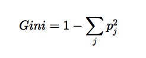

where p<sub>j</sub> is the probability of class j [18]. 

The Gini index is based on the Lorenz curve. The Lorenz curve plots the true positive rate (y-axis) as a function of percentiles of the population (x-axis).

The Lorenz curve represents a collective of models represented by the classifier. The location on the curve is given by the probability threshold of a particular model. (i.e., Lower probability thresholds for classification typically lead to more true positives, but also to more false positives.)[12]

#### Accuracy

Accuracy or  ACC (not to be confused with AUC or area under the curve) is a single metric in binary classification problems. ACC is the ratio number of correct predictions divided by the total number of predictions. In other words, how well the model can correctly identify both the true positives and true negatives. Accuracy is measured in the range of 0 to 1, where 1 is perfect accuracy or perfect classification, and 0 is poor accuracy or poor classification[8].   

Using the confusion matrix table, ACC can be calculated in the following manner:

**Accuracy** equation = (TP + TN) / (TP + TN + FP + FN)

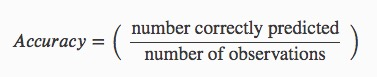

#### F-Score: F1, F0.5 and F2

A Driverless AI model will return probabilities, not predicted classes. To convert probabilities to predicted classes, a threshold needs to be defined. Driverless AI iterates over possible thresholds to calculate a confusion matrix for each threshold. It does this to find the maximum F metric value. Driverless AI’s goal is to continue increasing this maximum F metric.

The F1 Score is another measurement of classification accuracy which provides a measure for how well a binary classifier can classify positive cases (given a threshold value). It represents the harmonic average of the precision and recall. The F1 score is measured in the range of 0 to 1; an F1 score of 1 means both precision and recall are perfect and the model correctly identified all the positive cases and didn’t mark a negative case as a positive case. If either precision or recall are very low it will be reflected with a F1 score closer to 0. [9].

Using the confusion matrix table, the F1 score can be calculated in the following manner:

**F1** = 2TP /( 2TP + FN + FP)

**F1** equation: 


The F0.5 score is the weighted harmonic mean of the precision and recall (given a threshold value). Unlike the F1 score, which gives equal weight to precision and recall, the F0.5 score gives more weight to precision than to recall. More weight should be given to precision for cases where False Positives are considered worse than False Negatives. For example, if your use case is to predict which products you will run out of, you may consider False Positives worse than False Negatives. In this case, you want your predictions to be very precise and only capture the products that will definitely run out. If you predict a product will need to be restocked when it actually doesn’t, you incur cost by having purchased more inventory than you actually need.

**F0.5** equation:


Where:
Precision is the positive observations (true positives) the model correctly identified from all the observations it labeled as positive (the true positives + the false positives). Recall is the positive observations (true positives) the model correctly identified from all the actual positive cases (true positives + false negatives)[15].

**DISPLAY F2 score equation**

The **F2 score** is the weighted harmonic mean of the precision and recall (given a threshold value). Unlike the F1 score, which gives equal weight to precision and recall, the F2 score gives more weight to recall than precision. More weight should be given to recall for cases where False Negatives are considered to have a stronger negative business impact than False Positives. For example, if your use case is to predict which customers will churn, you may consider False Negatives worse than False Positives. In this case, you want your predictions to capture all of the customers that will churn. Some of these customers may not be at risk for churning, but the extra attention they receive is not harmful. More importantly, no customers actually at risk of churning have been missed [15].

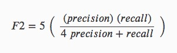

Where: Precision is the positive observations (true positives) the model correctly identified from all the observations it labeled as positive (the true positives + the false positives). Recall is the positive observations (true positives) the model correctly identified from all the actual positive cases (the true positives + the false negatives).

#### MCC

MCC or Matthews Correlation Coefficient is used to measure the quality of binary classifications [1]. The MCC is the correlation coefficient between the observed and predicted binary classifications. MCC is measured in the range between -1 and +1 where +1 is the perfect prediction, 0 no better than a random prediction, and -1 all incorrect predictions [9].

Using the confusion matrix table MCC can be calculated in the following manner:

**MCC** equation:

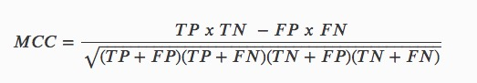

Unlike metrics like Accuracy, MCC is a good scorer to use when the target variable is imbalanced. In the case of imbalanced data, high Accuracy can be found by predicting the majority class. Metrics like Accuracy and F1 can be misleading, especially in the case of imbalanced data, because they do not consider the relative size of the four confusion matrix categories. MCC, on the other hand, takes the proportion of each class into account.

#### Log Loss (Logloss)
 
The logarithmic loss metric can be used to evaluate the performance of a binomial or multinomial classifier. Unlike AUC, which looks at how well a model can classify a binary target, logloss evaluates how close a model’s predicted values (uncalibrated probability estimates) are to the actual target value. For example, does a model assign a high predicted value like 0.80 for the positive class, or does it show poor ability to recognize the positive class and assign a lower predicted value like 0.50? A model with a log loss of 0 would be the perfect classifier. When the model cannot make correct predictions, the log loss increases, making the model a poor model[11].

**Binary classification equation:**


**Multiclass classification equation:**

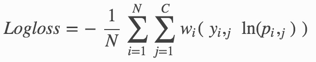

Where:

- N is the total number of rows (observations) of your corresponding dataframe.
- w is the per row user-defined weight (default is 1).
- C is the total number of classes (C=2 for binary classification).
- p is the predicted value (uncalibrated probability) assigned to a given row (observation).
- y is the actual target value.

The Diagnostics section in Driverless AI calculates the ACC, F1, MCC values and plots those values in each ROC and Pre-Recall curves making it easier to identify the best threshold for the model generated. Additionally, it also calculates the log loss score for your model, allowing you to quickly assess whether the model you generated is good or not.

Let’s get back to evaluating metrics results for models.


### Gain and Lift Charts

Gain and Lift charts measure a classification model’s effectiveness by looking at the ratio between the results obtained with a trained model versus a random model (or no model) [7]. The Gain and Lift charts help us evaluate the classifier’s performance and answer questions such as what percentage of the dataset captured has a positive response as a function of the selected percentage of a sample. Additionally, we can explore how much better we can expect to do with a model than a random model (or no model) [7].

One way we can think of gain is “for every step that is taken to predict an outcome, the level of uncertainty decreases. A drop of uncertainty is the loss of entropy which leads to knowledge gain” [15]. The Gain Chart plots the true positive rate (sensitivity) versus the predictive positive rate(**support**) where: 

**Sensitivity** = **Recall** = True Positive Rate = TP / (TP + FN)

**Support** = **Predictive Positive Rate**  = TP + FP / (TP + FP + FN+TN) 


To better visualize the percentage of positive responses than a selected percentage sample, we use **Cumulative Gains** and **Quantile**. Cumulative gains are obtained by taking the predictive model and applying it to the test dataset, a subset of the original dataset. The predictive model will score each case with a probability. The scores are then sorted in ascending order by the predictive score. The quantile takes the total number of cases(a finite number) and partitions the finite set into subsets of nearly equal sizes. The percentile is plotted from the 0th and 100th percentile. We then plot the cumulative number of cases up to each quantile, starting with the positive cases at 0%  with the highest probabilities until we reach 100% with the positive cases that scored the lowest probabilities. 

The x-axis shows the percentage of cases from the total number of cases in the test dataset in the cumulative gains chart. In contrast, the y-axis shows the percentage of positive responses in terms of quantiles. As mentioned, since the probabilities have been ordered in ascending order, we can look at the percent of predictive positive cases found in the 10% or 20% as a way to narrow down the number of positive cases that we are interested in. Visually the performance of the predictive model can be compared to that of a random model(or no model). The random model is represented below in red as the worst-case scenario of random sampling.


How can we identify the best-case scenario in relation to the random model? To do this, we need to identify a Base Rate first. The Base Rate sets the limits of the optimal curve. The Base Rate always controls the best gains. An example of a Base Rate can be seen on the chart below (dashed green). 

- **Base Rate** is defined as:

- **Base Rate** = (TP+FN) /Sample Size


The above chart represents the best-case scenario of a cumulative gains chart assuming a base rate of 20%. In this scenario, all the positive cases were identified before reaching the base rate.

The chart below represents an example of a predictive model (solid green curve). We can see how well the predictive model compared the random model (dotted red line). Now, we can pick a quantile and determine the percentage of positive cases up that quartile in relation to the entire test dataset.  

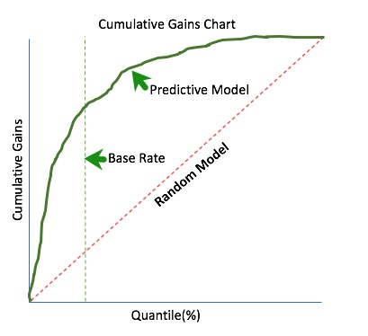

Lift can help us answer the question of how much better one can expect to do with the predictive model compared to a random model (or no model). Lift is a measure of a predictive model's effectiveness calculated as the ratio between the results obtained with a model and with a random model (or no model). In other words, the ratio of gain % to the random expectation % at a given quantile. The random expectation of the xth quantile is x %[16].

**Lift** = Predictive rate/ Actual rate

When plotting lift, we also plot it against quantiles to visualize how likely it is that a positive case will occur since the Lift chart is derived from the cumulative gains chart. The lift curve points are calculated by determining the ratio between the result predicted by our model and the result using a random model (or no model). For instance, assuming a base rate (or hypothetical threshold) of 20% from a random model, we would take the cumulative gain percent at the 20% quantile, X, and divide it by 20. We do this for all the quantiles until we get the full lift curve. 

We can start the lift chart with the base rate as seen below; recall that the base rate is the target threshold.


When looking at the cumulative lift for the top quantiles, X, and we select let's say 20% from the quantile from the total test cases based on the mode, we can expect X/20 times the total of the number of positive cases found by randomly selecting 20% from the random model.


### Kolmogorov-Smirnov Chart 

Kolmogorov-Smirnov or K-S measures the classification models' performance by measuring the degree of separation between positives and negatives for validation or test data [13]. 

The KS statistic is the maximum difference between the cumulative percentage of responders or 1's (cumulative true positive rate) and cumulative percentage of non-responders or 0's (cumulative false positive rate). The KS statistic's significance is that it helps to understand what portion of the population should be targeted to get the highest response rate (1's) [17].


### References

[1] [Confusion Matrix definition“ A Dictionary of Psychology“](http://www.oxfordreference.com/view/10.1093/acref/9780199534067.001.0001/acref-9780199534067-e-1778)</br>
[2] [Towards Data Science - Understanding AUC- ROC Curve](https://towardsdatascience.com/understanding-auc-curve-68b2303cc9c5)</br>
[3] [Introduction to ROC](https://classeval.wordpress.com/introduction/introduction-to-the-roc-receiver-operating-characteristics-plot/)</br>
[4] [ROC Curves and Under the Curve (AUC) Explained](https://www.youtube.com/watch?v=OAl6eAyP-yo)</br>
[5] [Introduction to Precision-Recall](https://classeval.wordpress.com/introduction/introduction-to-the-precision-recall-plot/)</br>
[6] [Tharwat, Applied Computing and Informatics (2018)](https://doi.org/10.1016/j.aci.2018.08.003)</br>
[7] [Model Evaluation Classification](https://www.saedsayad.com/model_evaluation_c.htm)</br>
[8] [Wiki Accuracy](https://en.wikipedia.org/wiki/Accuracy_and_precision)</br>
[9] [Wiki F1 Score](https://en.wikipedia.org/wiki/F1_score)</br>
[10] [Wiki Matthew’s Correlation Coefficient](https://en.wikipedia.org/wiki/Matthews_correlation_coefficient)</br>
[11] [Wiki Log Loss](http://wiki.fast.ai/index.php/Log_Loss)</br>
[12] [H2O’s GINI Index](http://docs.h2o.ai/driverless-ai/latest-stable/docs/userguide/scorers/scorers_gini.html?highlight=gini) </br>
[13] [H2O’s Kolmogorov-Smirnov](http://docs.h2o.ai/driverless-ai/latest-stable/docs/userguide/experiment-graphs.html?highlight=mcc)</br>
[14] [Model Evaluation- Classification](https://www.saedsayad.com/model_evaluation_c.htm)</br>
[15] [What is Information Gain in Machine Learning](https://www.quora.com/What-is-Information-gain-in-Machine-Learning)</br>
[16] [Lift Analysis Data Scientist Secret Weapon](https://www.kdnuggets.com/2016/03/lift-analysis-data-scientist-secret-weapon.html)</br>
[17] [Machine Learning Evaluation Metrics Classification Models](https://www.machinelearningplus.com/machine-learning/evaluation-metrics-classification-models-r/) </br>
[18] [Scikit-Learn: Decision Tree Learning I - Entropy, GINI, and Information Gain](https://www.bogotobogo.com/python/scikit-learn/scikt_machine_learning_Decision_Tree_Learning_Informatioin_Gain_IG_Impurity_Entropy_Gini_Classification_Error.php)

### Deeper Dive and Resources

- [How and when to use ROC Curves and Precision-Recall Curves for Classification in Python](https://machinelearningmastery.com/roc-curves-and-precision-recall-curves-for-classification-in-python/)
- [ROC Curves and AUC Explained](https://www.youtube.com/watch?time_continue=1&v=OAl6eAyP-yo)
- [Towards Data Science Precision vs Recall](https://towardsdatascience.com/precision-vs-recall-386cf9f89488)
- [ML Classification - Precision-Recall Curve](https://www.coursera.org/lecture/ml-classification/pecision-recall-curve-rENu8)
- [Towards Data Science - Understanding and Interpreting Gain and Lift Charts](https://www.datasciencecentral.com/profiles/blogs/understanding-and-interpreting-gain-and-lift-charts)
- [ROC and AUC, Clearly Explained Video](https://www.youtube.com/watch?v=xugjARegisk)
- [What is Information gain in Machine Learning](https://www.quora.com/What-is-Information-gain-in-Machine-Learning)


## Task 4: Experiment Results Summary

At the end of the experiment, a summary of the project will appear on the right-lower corner.  Also, note that the name of the experiment is at the top-left corner:

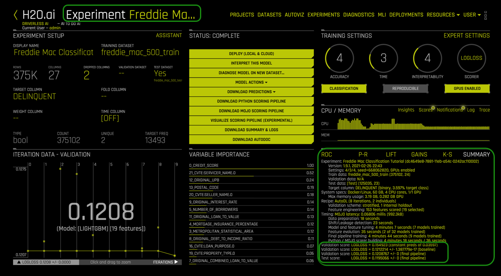

The summary includes the following:

- **Experiment**: experiment name,
  - Version: version of Driverless AI and the date it was launched
  - Settings: selected experiment settings, seed, and amount of GPU’s enabled
  - Train data: name of the training set, number of rows and columns
  - Validation data: name of  the validation set, number of rows and columns
  - Test data: name of the test set, number of rows and columns
  - Target column: name of the target column (type of data and % target class)

- **System Specs**: machine specs including RAM, number of CPU cores and GPU’s
  - Max memory usage  

- **Recipe**: 
  - Validation scheme: type of sampling, number of internal holdouts
  - Feature Engineering: number of features scored and the final selection

- **Timing**
  - Data preparation 
  - Shift/Leakage detection
  - Model and feature tuning: total time for model and feature training and  number of models trained 
  - Feature evolution: total time for feature evolution and number of models trained 
  - Final pipeline training: total time for final pipeline training and the total models trained 
  - Python / MOJO scorer building 
- Validation Score: Log loss score +/- machine epsilon for the baseline
- Validation Score: Log loss score +/- machine epsilon for the final pipeline
- Test Score: Log loss score +/- machine epsilon score for the final pipeline 

Most of the information in the Experiment Summary tab, along with additional detail, can be found in the Experiment Summary Report (Yellow Button “Download Experiment Summary”).

Below are three questions to test your understanding of the experiment summary and frame the motivation for the following section.

1\. Find the number of features that were scored for your model and the total features that were selected. 

2\.  Take a look at the validation Score for the final pipeline and compare that value to the test score. Based on those scores would you consider this model a good or bad model?
	
**Note:** If you are not sure what Log loss is, feel free to review the concepts section of this self-paced course.

3\. So what do the Log Loss values tell us?  The essential Log Loss value is the test score value. This value tells us how well the generated model performed against the freddie_mac_500_test set based on the error rate. In case of experiment **Freddie Mac Classification Tutorial**, the **test score LogLoss = 0.119566 +/- 0** which is the log of the misclassification rate. The greater the Log loss value the more significant the misclassification. For this experiment, the Log Loss was relatively small meaning the error rate for misclassification was not as substantial. But what would a score like this mean for an institution like Freddie Mac?

In the next few tasks we will explore the financial implications of misclassification by exploring the confusion matrix and plots derived from it. 


### Deeper Dive and Resources

- [H2O’s Experiment Summary](http://docs.h2o.ai/driverless-ai/latest-stable/docs/userguide/experiment-summary.html?highlight=experiment%20overview)
- [H2O’s Internal Validation](http://docs.h2o.ai/driverless-ai/latest-stable/docs/userguide/internal-validation.html) 


## Task 5: Diagnostics Scores and Confusion Matrix

Now, we are going to run a model diagnostics on the freddie_mac_500_test set. The diagnostics model allows you to view model performance for multiple scorers based on an existing model and dataset through the Python API.

1\. Select **Diagnostics:** 

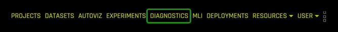

2\. Once in the **Diagnostics** page, select **+ Diagnose Model:**


3\. In the **Create new model diagnostics**:

**a.** Click on Diagnosed Experiment then select the experiment that you completed in Task 4: **Freddie Mac Classification Tutorial**</br>
**b.** Click on Dataset then select the freddie_mac_500_test dataset</br>
**c.**  Initiate the diagnostics model by clicking on **Launch Diagnostics**

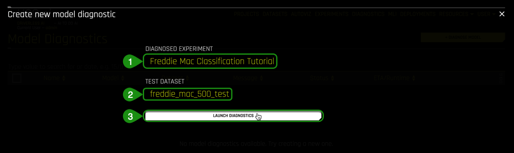

4\.After the model diagnostics is done running, a model similar to the one below will appear:

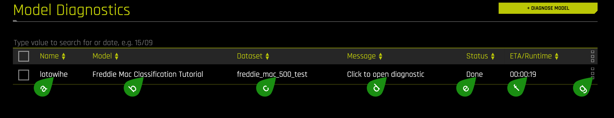 

- *Things to Note:*</br>
**a.** Name of new diagnostics model</br>
**b.** **Model**: Name of ML model used for diagnostics</br>
**c.** **Dataset**: name of the dataset used for diagnostic</br>
**d.** **Message** : Message regarding new diagnostics model</br>
**e.** **Status** : Status of new diagnostics model</br>
**f.** **Time** : Time it took for the  new diagnostics model to run</br>
**g.** Options for this model

5\. Click on the new diagnostics model and a page similar to the one below will appear:


- *Things to Note:*

a. **Info**: Information about the diagnostics model including the name of the test dataset, name of the experiment used and the target column used for the experiment</br>
b. **Scores**: Summary for the values for GINI, MCC, F05, F1, F2, Accuracy, Log loss, AUC and AUCPR in relation to how well the experiment model scored against a “new” dataset</br>
  - **Note:** The new dataset must be the same format and with the same number of columns as the training dataset

c. **Metric Plots**: Metrics used to score the experiment model including ROC Curve, Pre-Recall Curve, Cumulative Gains, Lift Chart, Kolmogorov-Smirnov Chart, and Confusion Matrix</br>
d. **Download Predictions**: Download the diagnostics predictions
 
**Note:** The scores will be different for the train dataset and the validation dataset used during  the training of the model.

#### Confusion Matrix 

As mentioned in the concepts section, the confusion matrix is the root from where most metrics used to test a model's performance originates. The confusion matrix provides an overview performance of a supervised model's ability to classify.

Click on the confusion matrix located on the **Metrics Plot** section of the Diagnostics page, bottom-right corner. An image similar to the one below will come up:


The confusion matrix lets you choose the desired threshold for your predictions. In this case, we will take a closer look at the confusion matrix generated by the Driverless AI model with the default threshold, which is **0.1445**.

The first part of the confusion matrix we will look at is the **Predicted labels** and **Actual labels**.  As shown on the image below the **Predicted label** values for **Predicted Condition Negative** or  **0** and **Predicted Condition Positive** or **1**  run vertically while the **Actual label** values for **Actual Condition Negative** or **0** and **Actual Condition Positive** or **1** run horizontally on the matrix.

Using this layout, we will determine how well the model predicted the people that defaulted and those that did not from our Freddie Mac test dataset. Additionally, we will be able to compare it to the actual labels from the test dataset.


Moving into the matrix's inner part, we find the number of cases for True Negatives, False Positives, False Negatives, and True Positive. The confusion matrix for this model generated tells us that:

- TP = 1,704 cases were predicted as **defaulting** and **defaulted** in actuality 
- TN = 115,390 cases were predicted as **not defaulting** and **did not default** 
- FP = 5,147 cases were predicted as **defaulting** when in actuality they **did not default**
- FN = 2,794 cases were predicted as **not defaulting** when in actuality they **defaulted**

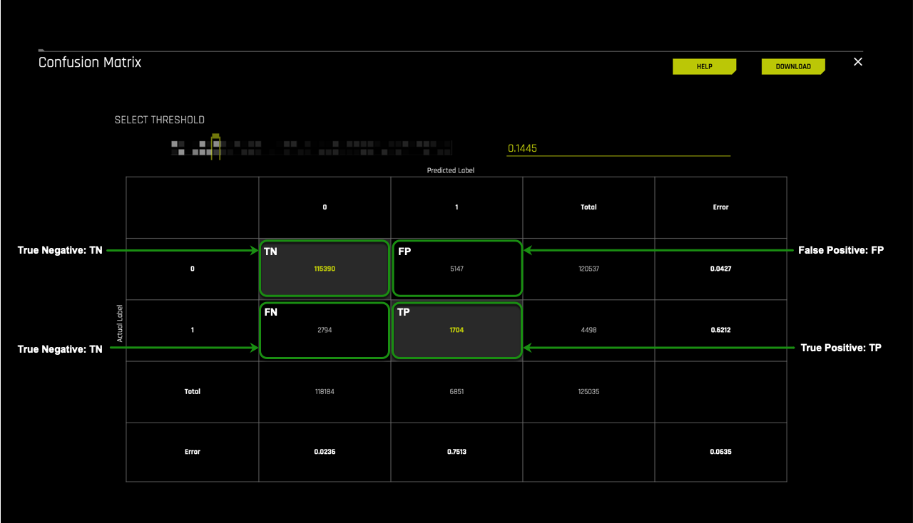

The next layer we will look at is the **Total** sections for **Predicted label** and **Actual label**. 

On the right side of the confusion matrix are the totals for the **Actual label**  and at the base of the confusion matrix, the totals for the **Predicted label**.

**Actual label**
- 120,537: the number of actual cases that did not default on the test dataset
- 4,498: the number of actual cases that defaulted on the test

**Predicted label**
- 118,184: the number of cases that were predicted to not default on the test dataset
- 6,851:  the number of cases that were predicted to default on the test dataset 


The final layer of the confusion matrix we will explore is the errors. The errors section is one of the first places where we can check how well the model performed. The better the model does at classifying labels on the test dataset, the lower the error rate. The **error rate,** also known as the **misclassification rate,** answers how often the model is wrong.

For this particular model these are the errors:
- 5147/120537 = **0.0427** or 4.3%  times the model classified actual cases that did not default as defaulting out of the actual non-defaulting group
- 2794/4498 = **0.6212** or 62.1% times the model classified actual cases that did default as not defaulting out of the actual defaulting group
- 2794/118184 = **0.0236**  or 2.36% times the model classified predicted cases that did default as not defaulting out of the total predicted not defaulting group
- 1704/6851 = **0.2487** or 24.87% times the model classified predicted cases that defaulted as defaulting out of the total predicted defaulting group
- (2794 + 5147) / 125035 = **0.0635**  This means that this model incorrectly classifies  0.0635 or 6.35% of the time.
 
What does the misclassification error of **0.0635** mean?

One of the best ways to understand the impact of this misclassification error is to look at the financial implications of the False Positives and False Negatives. As mentioned previously, the False Positives represent the loans predicted not to default but did.
Additionally, we can look at the mortgages that Freddie Mac missed out on by not granting loans because the model predicted that they would default when in reality, they did not default.

One way to look at the financial implications for Freddie Mac is to look at the total paid interest rate per loan. The mortgages on this dataset are traditional home equity loans which means that the loans are:

- A fixed borrowed amount
- Fixed interest rate
- Loan term and monthly payments are both fixed

For this self-paced course, we will assume a 6% Annual Percent Rate (APR) over 30 years. APR is the amount one pays to borrow the funds. Additionally, we are going to assume an average home loan of $167,473 (this average was calculated by taking the sum of all the loans on the freddie_mac_500.csv dataset and dividing it by 30,001 which is the total number of mortgages on this dataset). For a mortgage of $167,473 the total interest paid after 30 years would be $143,739.01 [1]. 

When looking at the **False Positives**, we can think about **5147** cases of people that the model predicted should not be granted a home loan because they were predicted to default on their mortgage. These **5147** loans translate to over **739 million dollars** in loss of potential income (**5147** * $143,739.01) in interest.

Looking at the **False Negatives**, we do the same and take the **2794** cases that were granted a loan because the model predicted that they would not default on their home loan. These **2794** cases translate to about over **401 million dollars** in interest losses since **2794** in actuality cases defaulted.

The **misclassification rate** provides a summary of the **sum of** the **False Positives** and **False Negatives** **divided by** the **total cases in the test dataset**. The misclassification rate for this model was **0.0635**.  If this model were used to determine home loan approvals, the mortgage institutions would need to consider approximately **401 million dollars** in losses for misclassified loans that got approved and shouldn’t have. Also, **739 million dollars** on loans that were not approved since they were classified as defaulting.

One way to look at these results is to ask the question: Is missing out on approximately **739 million dollars** from loans that were not approved better than losing about **401 million dollars** from loans that were approved and then defaulted? There is no definite answer to this question, and the answer depends on the mortgage institution. 


#### Scores 
Driverless AI conveniently provides a summary of the scores for the performance of the model given the test dataset.

The scores section provides a summary of the Best Scores found in the metrics plots:
- **ACCURACY**
- **AUC**
- **AUCPR**
- **F05**
- **F1**
- **F2**
- **FDR**
- **FNR**
- **FOR**
- **FPR**
- **GINI**
- **LOGLOSS**
- **MACROAUC**
- **MCC**
- **NPV**
- **PRECISION**
- **RECALL**
- **TNR**

The image below represents the scores for the **Freddie Mac Classification Tutorial** model using the freddie_mac_500_test dataset:


When we ran the experiment for this classification model, Driverless AI determined that the best scorer for it was the Logarithmic Loss or **LOGLOSS** due to the dataset's imbalanced nature. **LOGLOSS** focuses on getting the probabilities right (strongly penalizes wrong probabilities). The selection of Logarithmic Loss makes sense since we want a model that can correctly classify those who are most likely to default while ensuring that those who qualify for a loan can get one.

Recall that Log loss is the logarithmic loss metric that can be used to evaluate the performance of a binomial or multinomial classifier, where a model with a Log loss of 0 would be the perfect classifier. Our model  scored  a **LOGLOSS value = 0.1195+/- 0** after testing it with test dataset. From the confusion matrix, we saw that the model had issues classifying perfectly; however, it was able to classify with an **ACCURACY of 0.9645 +/- 0**. The financial implications of the misclassifications have been covered in the confusion matrix section above.

Driverless AI has the option to change the type of scorer used for the experiment. Recall that for this dataset, Driverless AI selected **LOGLOSS** as the scorer. An experiment can be re-run with another scorer. For general imbalanced classification problems, AUCPR and MCC scorers are good choices, while F05, F1, and F2 are designed to balance recall and precision.
The AUC is designed for ranking problems. Gini is similar to the AUC but measures the quality of ranking (inequality) for regression problems. 

In the next few tasks, we will explore the scorer further and the **Scores** values in relation to the residual plots.

### References

[1] [Amortization Schedule Calculator](https://investinganswers.com/calculators/loan/amortization-schedule-calculator-what-repayment-schedule-my-mortgage-2859) 

### Deeper Dive and Resources

- [Wiki Confusion Matrix](https://en.wikipedia.org/wiki/Confusion_matrix)
- [Simple guide to confusion matrix](https://www.dataschool.io/simple-guide-to-confusion-matrix-terminology/)
- [Diagnosing a model with Driverless AI](http://docs.h2o.ai/driverless-ai/latest-stable/docs/userguide/diagnosing.html)

## Task 6: ER: ROC

From the Diagnostics page, click on the **ROC Curve**. An image similar to the one below will appear:

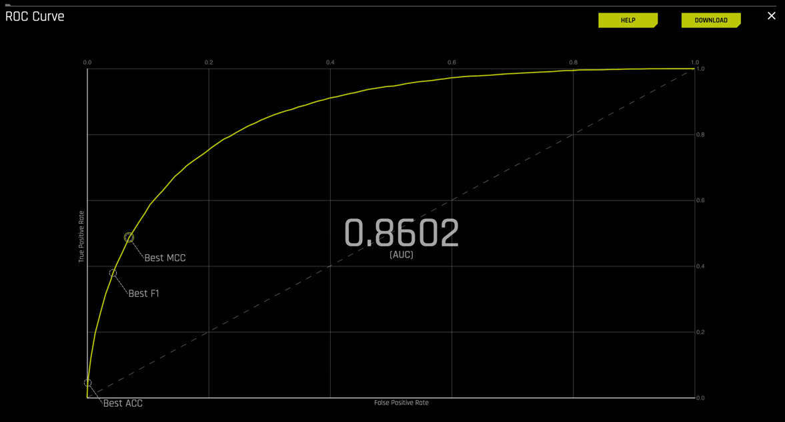

To review, an ROC curve demonstrates the following:

- It shows the tradeoff between sensitivity (True Positive Rate or TPR) and specificity (1-FPR or False Positive Rate). A decrease in specificity will accompany any increase in sensitivity.
- The closer the curve follows the upper-left-hand border of the ROC space, the more accurate the model.
- The closer the curve comes to the 45-degree diagonal of the ROC space, the less accurate the model.
- The slope of the tangent line at a cutpoint gives the likelihood ratio (LR) for the test's value. You can check this out on the graph above.
- The area under the curve is a measure of model accuracy.  

Going back to the Freddie Mac dataset, even though the model was scored with the Logarithmic Loss to penalize for error, we can still take a look at the ROC curve results and see if it supports our conclusions from the analysis of the confusion matrix and scores section of the diagnostics page.

1\. Based on the ROC curve that the Driverless AI model generated for your experiment, identify the AUC. Recall that a perfect classification model has an AUC of 1.

2\. For each of the following points on the curve, determine the True Positive Rate, False Positive Rate, and threshold by hovering over each point below as seen on the image below:
- Best Accuracy 
- Best F1
- Best MCC


Recall that for a binary classification problem, accuracy is the number of correct predictions made as a ratio of all predictions made.  Probabilities are converted to predicted classes to define a threshold. This model determined that the **best accuracy** is found at **threshold 0.4959**.

At this threshold, the model predicted:
- TP = 204 cases predicted as defaulting and defaulted
- TN = 120,394 cases predicted as not defaulting and did not default
- FP = 143 cases predicted as defaulting and did not default
- FN = 4,294 cases predicted to not default and defaulted


3\. From the AUC, Best MCC, F1, and Accuracy values from the ROC curve, how would you qualify your model? Is it a good or bad model? Use the key points below to help you assess the ROC Curve.

Remember that for the **ROC** curve: 
- The perfect classification model has an AUC of 1
- MCC is measured in the range between -1 and +1 where +1 is the perfect prediction, 0 no better than a random prediction and -1 all incorrect predictions.
- F1 is measured in the range of 0 to 1, where 0 means that there are no true positives, and 1 when there is neither false negatives nor false positives or perfect precision and recall.
- Accuracy is measured in the range of 0 to 1, where 1 is perfect accuracy or perfect classification, and 0 is poor accuracy or poor classification.

**Note:** If you are not sure what AUC, MCC, F1, and Accuracy are or how they are calculated review the concepts section of this self-paced course.

### New Experiment with Same Settings

In case you were curious and wanted to know if you could improve the accuracy of the model, you could try changing the scorer from Logloss to Accuracy. A question to keep in mind after making this change, **does changing the scorer from Logloss to Accuracy improve the model's accuracy?**

1\. To do this, click on the **Experiments** page.

2\. Click on the experiment you did for task 1 and select **New Experiment with Same Settings**:

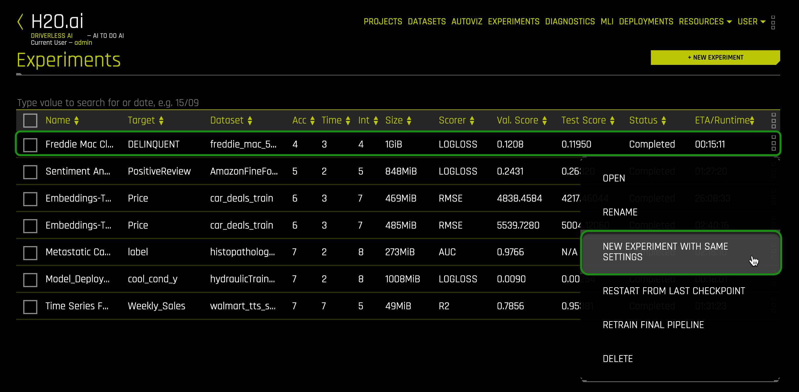

An image similar to the one below will appear. Note that this page has the same settings as the setting in Task 1. The only difference is that on the **Scorer** section, we updated **Logloss** to **Accuracy**. Everything else should remain the same.

3\. If you haven’t done so, select **Accuracy** on the scorer section then select **Launch Experiment**:

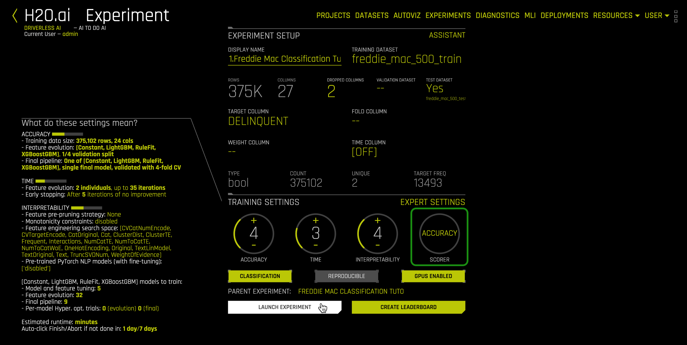

Similarly to the experiment in Task 1, wait for the experiment to run. After the experiment is done running, a similar page will appear. Note that on the summary located on the bottom right-side, both the validation and test scores are no longer being scored by **Logloss** instead by **Accuracy**. 

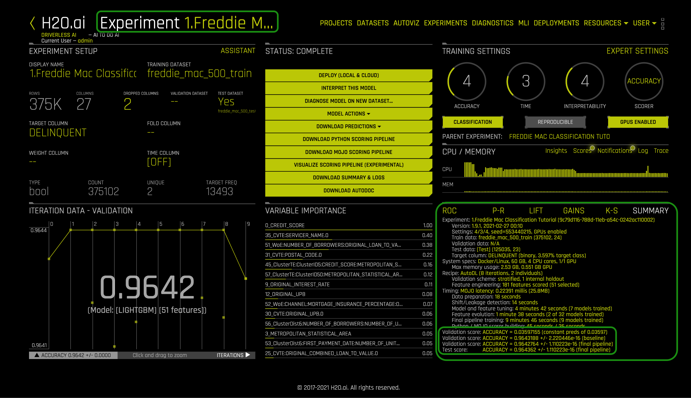

We are going to use this new experiment to run a new diagnostics test. You will need the name of the new experiment. In this case, the experiment name is **1.Freddie Mac Classification Tutorial**. 

4\. Go to the **Diagnostics** tab.

5\. Once in the **Diagnostics** page, select **+Diagnose Model**.

6\. In the **Create new model diagnostics**:

  **a.** Click on **Diagnosed Experiment**, then select the experiment that you completed in this Task. In this case, the experiment name is **1.Freddie Mac Classification Tutorial**</br>
  **b.** Click on **Test Dataset** then select the **freddie_mac_500_test** dataset</br>
  **c.** Initiate the diagnostics model by clicking on **Launch Diagnostics**:</br>

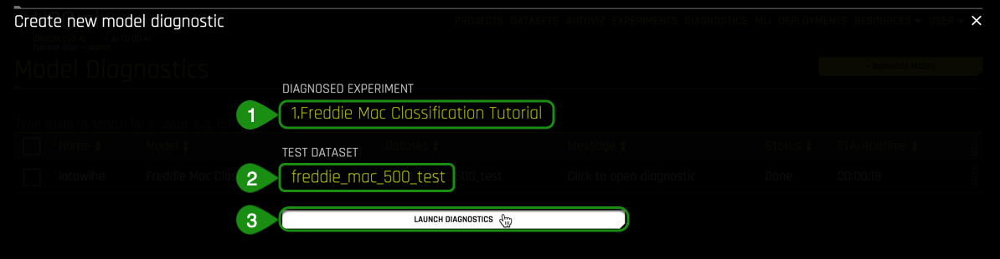

7\. After the model diagnostics is done running, a new diagnostic will appear.

8\. Click on the new diagnostics model. On the **Scores** section, observe the accuracy value. Compare this Accuracy value to the Accuracy value from task 6. 

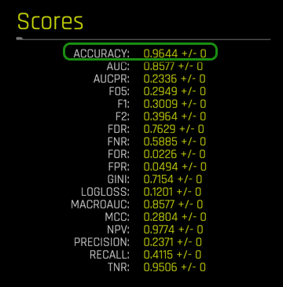

9\. Next, locate the new ROC curve and click on it. Hover over the **Best ACC** point on the curve. An image similar to the one below will appear:

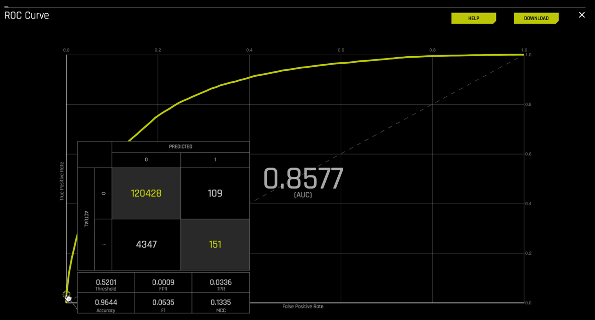

How much improvement did we get from optimizing the accuracy via the scorer? 

The first model predicted:
- Threshold = 0.4959
- TP = 209 cases predicted as defaulting and defaulted
- TN = 120,394 cases predicted as not defaulting and did not default
- FP = 143 cases predicted as defaulting and did not default
- FN = 4,294 cases predicted to not default and defaulted

The new model predicted:
- Threshold = 0.5201
- TP =  151 cases predicted as defaulting and defaulted
- TN = 120,428 cases predicted as not defaulting and did not default
- FP = 109 cases predicted as defaulting and did not default
- FN = 4,347 cases predicted not to default and defaulted

The **threshold for best accuracy** changed from **0.4959 for the first diagnostics model** to **0.5201 for the new model**. This decrease in threshold impaired the accuracy of the number of correct predictions made as a ratio of all predictions made. Note, however, that while the number of FP's decreased, the number of FN's increased. We were able to reduce the number of cases that were predicted to falsy default, but in doing so, we increased the number of FN or cases that were predicted not to default and did.

The takeaway is that there is no win-win; sacrifices need to be made. In the case of accuracy, we decreased the number of mortgage loans, especially for those who were denied a mortgage because they were predicted to default when, in reality, they did not. However, we also increased the number of cases that should not have been granted a loan and did.  As a mortgage lender, would you prefer to reduce the number of False Positives or False Negatives?

10\. Exit out of the ROC curve by clicking on the **x** located at the top-right corner of the plot, next to the **Download** option

### Deeper Dive and Resources

- [How and when to use ROC Curves and Precision-Recall Curves for Classification in Python](https://machinelearningmastery.com/roc-curves-and-precision-recall-curves-for-classification-in-python/)
- [ROC Curves and AUC Explained](https://www.youtube.com/watch?time_continue=1&v=OAl6eAyP-yo)
- [Towards Data Science - Understanding AUC- ROC Curve](https://towardsdatascience.com/understanding-auc-roc-curve-68b2303cc9c5)
- [ROC Curves and Under the Curve (AUC) Explained](https://www.youtube.com/watch?v=OAl6eAyP-yo)
- [Introduction to ROC](https://classeval.wordpress.com/introduction/introduction-to-the-roc-receiver-operating-characteristics-plot/)


## Task 7: ER: Prec-Recall

Continuing on the diagnostics page, select the **P-R** curve. The P-R curve should look similar to the one below:


Remember that for the **Prec-Recall**:

- The precision-recall plot uses recall on the x-axis and precision on the y-axis. 
- Recall is identical to sensitivity, and precision is identical to the positive predictive value.
- ROC curves should be used when there are roughly equal numbers of observations for each class.
- Precision-Recall curves should be used when there is a moderate to large class imbalance.
- Similar to ROC, the AUCPR (Area under the curve of Precision-recall curve) is a measure of model accuracy and higher the better. 
- In both the ROC and Prec-recall curve, Driverless AI will indicate points that are the best thresholds for Accuracy (ACC), F1 or MCC (Matthews correlation coefficient).

Looking at the P-R curve results, is this a good model to determine if a customer will default on their home loan? Let’s take a look at the values found on the P-R curve.

1\. Based on the P-R curve that Driverless AI model generated for you experiment identify the AUC.

2\. For each of the following points on the curve, determine the True Positive Rate, False Positive rate, and threshold by hovering over each point below as seen on the image below:
- Best Accuracy 
- Best F1
- Best MCC

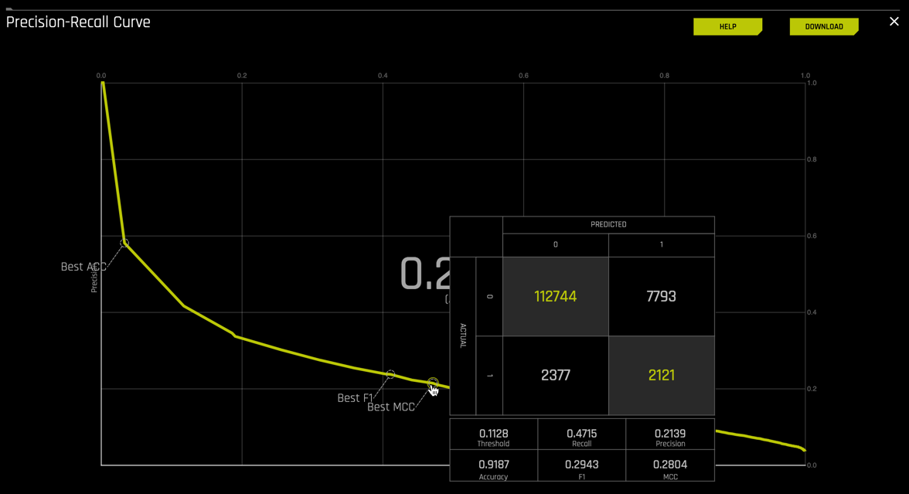

3\. From the observed AUC, Best MCC, F1 and Accuracy values for P-R, how would you qualify your model, is it a good or bad model? Use the key points below to help you asses the P-R curve.

Remember that for the **P-R** curve :

- The perfect classification model has an AUC of 1
- MCC is measured in the range between -1 and +1 where +1 is the perfect prediction, 0 no better than a random prediction and -1 all incorrect predictions.
- F1 is measured in the range of 0 to 1, where 0 means that there are no true positives, and 1 when there is neither false negatives nor false positives or perfect precision and recall.
- Accuracy is measured in the range of 0 to 1, where 1 is perfect accuracy or perfect classification, and 0 is poor accuracy or poor classification.

**Note:** If you are not sure what AUC, MCC, F1, and Accuracy are or how they are calculated review the concepts section of this self-paced course.

### New Experiment with Same Settings

Similarly to task 6, we can improve the area under the curve for precision-recall by creating a new model with the same parameters. Note that you need to change the Scorer from **Logloss** to **AUCPR**. You can try this on your own.

To review how to run a new experiment with the same parameters and a different scorer, follow the step on task 6, section **New Experiment with Same Settings**.

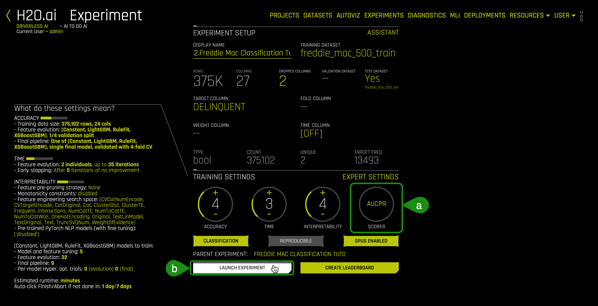

**Note:** If you ran the new experiment, go back to the diagnostic for the experiment we were working on.

### Deeper Dive and Resources

- [Towards Data Science Precision vs Recall](https://towardsdatascience.com/precision-vs-recall-386cf9f89488)
- [ML Classification - Precision-Recall Curve](https://www.coursera.org/lecture/ml-classification/precision-recall-curve-rENu8)
- [Introduction to Precision-Recall](https://classeval.wordpress.com/introduction/introduction-to-the-precision-recall-plot/)

## Task 8: ER: Gains

Continuing on the diagnostics page, select the **CUMULATIVE GAIN** curve. The Gains curve should look similar to the one below:

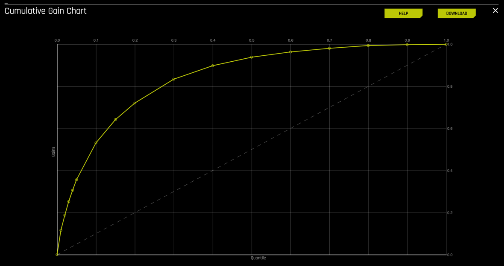

Remember that for the **Gains** curve:

- A cumulative gains chart is a visual aid for measuring model performance. 
- The y-axis shows the percentage of positive responses. This is a percentage of the total possible positive responses 
- The x-axis shows the percentage of all customers from the Freddie Mac dataset who did not default, which is a fraction of the total cases
- The dashed line is the baseline (overall response rate)
- It helps answer the question of  “What fraction of all observations of the positive target class are in the top predicted 1%, 2%, 10%, etc. (cumulative)?” By definition, the Gains at 100% are 1.0.

**Note:** The y-axis of the plot has been adjusted to represent quantiles; this allows for focus on the quantiles that have the most data and, therefore, the most impact.

1\. Hover over the various quantile points on the Gains chart to view the quantile percentage and cumulative gain values

2\. What is the cumulative gain at  1%, 2%, 10% quantiles?

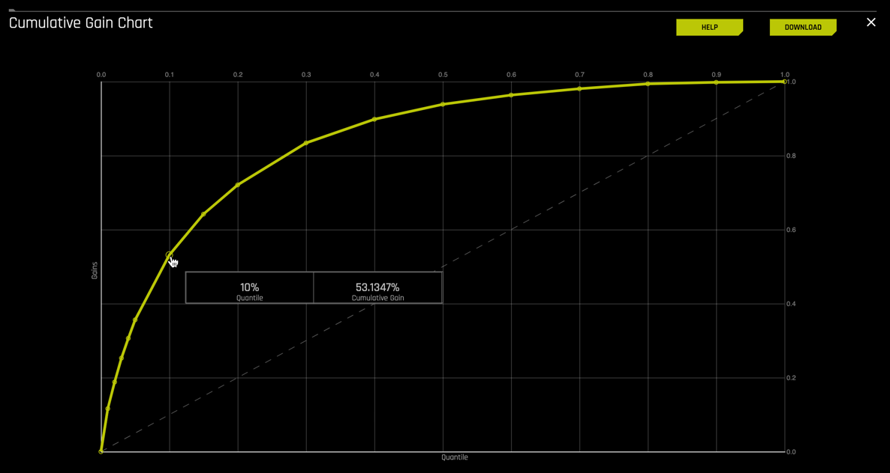

For this Gain Chart, if we look at the top 1% of the data, the at-chance model (the dotted diagonal line) tells us that we would have correctly identified 1% of the defaulted mortgage cases. The model generated (yellow curve) shows that it was able to identify about 12% of the defaulted mortgage cases. 

If we hover over to the top 10% of the data, the at-chance model (the dotted diagonal line) tells us that we would have correctly identified 10% of the defaulted mortgage cases. The model generated (yellow curve) says that it was able to identify about 53% of the defaulted mortgage cases. 

3\. Based on the shape of the gain curve and the baseline (white diagonal dashed line) would you consider this a good model? 

Remember that the perfect prediction model starts pretty steep, and as a rule of thumb, the steeper the curve, the higher the gain. The area between the baseline (white diagonal dashed line) and the gain curve (yellow curve), better known as the area under the curve, visually shows us how much better our model is than that of the random model. There is always room for improvement. The gain curve can be steeper.

**Note:** If you are not sure what AUC or what the gain chart is, feel free to review the concepts section of this self-paced course.

4\. Exit out of the Gains chart by clicking on the **x** located at the top-right corner of the plot, next to the **Download** option

### Deeper Dive and Resources
 
- [Towards Data Science - Understanding and Interpreting Gain and Lift Charts](https://www.datasciencecentral.com/profiles/blogs/understanding-and-interpreting-gain-and-lift-charts)

## Task 9: ER: LIFT

Continuing on the diagnostics page, select the **LIFT** curve. The Lift curve should look similar to the one below:

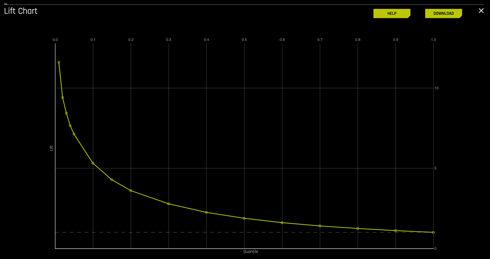

Remember that for the **Lift** curve:

A Lift chart is a visual aid for measuring model performance.

- Lift is a measure of the effectiveness of a predictive model calculated as the ratio between the results obtained with and without the predictive model.
- It is calculated by determining the ratio between the result predicted by our model and the result using no model.
- The greater the area between the lift curve and the baseline, the better the model.
- It helps answer the question of “How many times more observations of the positive target class are in the top predicted 1%, 2%, 10%, etc. (cumulative) compared to selecting observations randomly?” By definition, the Lift at 100% is 1.0.

**Note:**  The y-axis of the plot has been adjusted to represent quantiles; this allows for focus on the quantiles that have the most data and, therefore, the most impact.

1\. Hover over the various quantile points on the Lift chart to view the quantile percentage and cumulative lift values

2\. What is the cumulative lift at 1%, 2%, 10% quantiles?

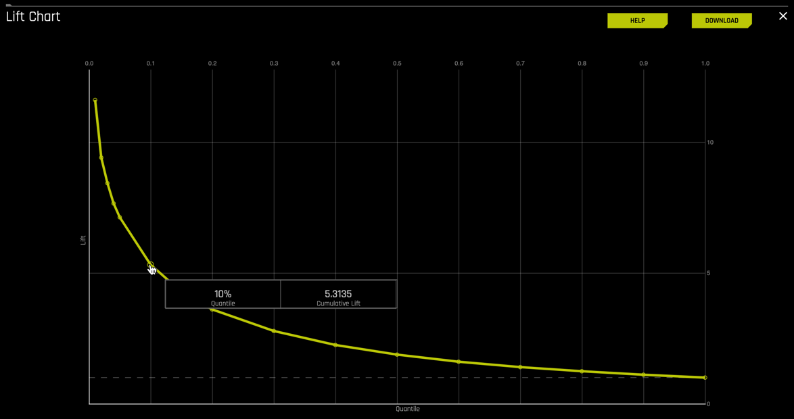

For this Lift Chart, all the predictions were sorted according to decreasing scores generated by the model. In other words, uncertainty increases as the quantile moves to the right. At the 10% quantile, our model predicted a cumulative lift of about 5.3%, meaning that there were five times more defaults among the top 10% of the cases.

3\. Based on the area between the lift curve and the baseline (white horizontal dashed line) is this a good model?

The area between the baseline (white horizontal dashed line) and the lift curve (yellow curve) better known as the area under the curve visually shows us how much better our model is than that of the random model. 

4\. Exit out of the Lift chart by clicking on the **x** located at the top-right corner of the plot, next to the **Download** option

### Deeper Dive and Resources

- [Towards Data Science - Understanding and Interpreting Gain and Lift Charts](https://www.datasciencecentral.com/profiles/blogs/understanding-and-interpreting-gain-and-lift-charts)


## Task 10: Kolmogorov-Smirnov Chart

Continuing on the diagnostics page, select the **KS** chart. The K-S chart should look similar to the one below:

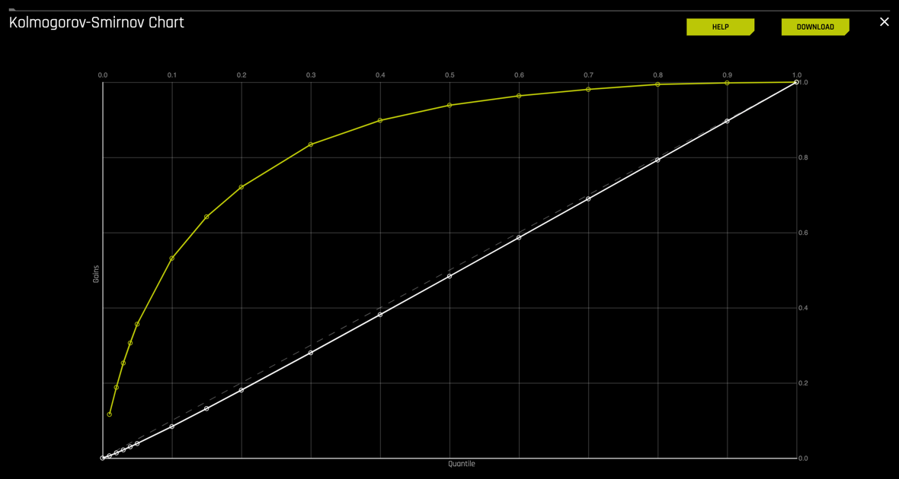

Remember that for the K-S chart:

- K-S measures the classification models' performance by measuring the degree of separation between positives and negatives for validation or test data.
- The K-S is 100 degrees of separation if the scores partition the population into two separate groups in which one group contains all the positives and the other all the negatives
- If the model cannot differentiate between positives and negatives, then it is as if the model selects cases randomly from the population, and the K-S would be 0 degrees of separation.
- The K-S range is between 0 and 1
- The higher the K-S value, the better the model is at separating the positive from negative cases

**Note:** The y-axis of the plot has been adjusted to represent quantiles; this allows for focus on the quantiles that have the most data and, therefore, the most impact.

1\. Hover over the various quantile points on the Lift chart to view the quantile percentage and cumulative lift values

2\. What is the cumulative lift at 1%, 2%, 10% quantiles?

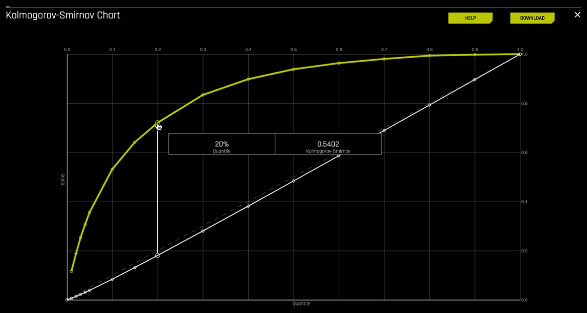

For this K-S chart, if we look at the top  20% of the data, the at-chance model (the dotted diagonal line) tells us that only 20% of the data was successfully separate between positives and negatives (defaulted and not defaulted). However, with the model, it was able to do 0.540, or about 54% of the cases were successfully separated between positives and negatives.

3\. Based on the K-S curve(yellow) and the baseline (white diagonal dashed line) is this a good model?

4\. Exit out of the K-S chart by clicking on the **x** located at the top-right corner of the plot, next to the **Download** option

### Deeper Dive and Resources

- [Kolmogorov-Smirnov Test](https://towardsdatascience.com/kolmogorov-smirnov-test-84c92fb4158d)
- [Kolmogorov-Smirnov Goodness of Fit Test](https://www.statisticshowto.datasciencecentral.com/kolmogorov-smirnov-test/)


## Task 11: Experiment AutoDocs

Driverless AI makes it easy to download the results of your experiments, all at the click of a button.  

1\. Let’s explore the auto generated documents for this experiment. On the **Experiment** page select **Download Autoreport**.

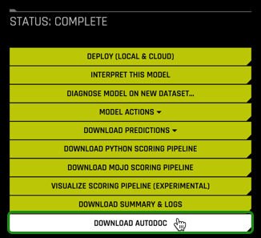

This report provides insight into the training data and any detected shifts in distribution, the validation schema selected, model parameter tuning, feature evolution and the final set of features chosen during the experiment.

2\. Open the report .docx file, this auto-generated report contains the following information:
- Experiment Overview
- Data Overview
- Methodology
- Data Sampling
- Validation Strategy
- Model Tuning
- Feature Evolution
- Feature Transformation
- Final Model
- Alternative Models
- Deployment
- Partial Dependence Plots
- Appendix

3\. Take a few minutes to explore the report

4\. Explore Feature Evolution and Feature Transformation, how is this summary different from the summary provided in the **Experiments Page**?
  
  - Answer: In the experiment page, you can set the name of your experiment, set up the dataset being used to create an experiment, view the total number of rows and columns of your dataset, drop columns, select a dataset to validate, etc.

    Different, the experiment summary report contains insight into the training data and any detected shifts in distribution, the validation schema, etc. In particular, when exploring the feature evolution and feature transformation in the summary report, we will encounter the following information:

    **Feature evolution:** This summary will detail the algorithms used to create the experiment.

    **Feature transformation:** The summary will provide information about automatically engineer new features with high-value features for a given dataset.

5\. Find the section titled **Final Model** on the report.docx and explore the following items:
- Table titled **Performance of Final Model** and determine the **logloss** final test score
- Validation Confusion Matrix
- Test Confusion Matrix
- Validation and Test ROC, Prec-Recall, lift, and gains plots

### Deeper Dive and Resources

- [H2O’s Summary Report](http://docs.h2o.ai/driverless-ai/latest-stable/docs/userguide/experiment-summary.html?highlight=experiment%20overview)


## Next Steps

Check out the next self-paced course: [Machine Learning Interpretability](https://training.h2o.ai/products/self-paced-course-1c-machine-learning-interpretability) where you will learn how to:
- Launch an experiment
- Create ML interpretability report
- Explore explainability concepts such as:
    - Global Shapley
    - Partial Dependence plot
    - Decision tree surrogate
    - K-Lime
    - Local Shapley
    - LOCO
    - Individual conditional Expectation