# Machine Learning Interpretability Tutorial

## Outline
- [Objective](#objective)
- [Prerequisites](#prerequisites)
- [Task 1: Launch Experiment and MLI](#task-1-launch-experiment-and-mli) 
- [Task 2: Industry Context and ML Explainability Concepts](#task-2-industry-context-and-ml-explainability-concepts)
- [Task 3: Global Shapley Values and Feature Importance](#task-3-global-shapley-values-and-feature-importance)
- [Task 4: Partial Dependence Plot](#task-4-partial-dependence-plot)
- [Task 5: Decision Tree Surrogate](#task-5-decision-tree-surrogate)
- [Task 6: K-LIME](#task-6-k-lime)
- [Task 7: Local Shapley and LOCO](#task-7-local-shapley-and-loco)
- [Task 8: Putting it All Together and ICE](#task-8-putting-it-all-together-and-ice) 
- [Next Steps](#next-steps)

## Objective 

As the field of machine learning continues to grow, more industries from healthcare to banking are adopting machine learning models to generate predictions. These predictions are being used to justify the cost of healthcare and for loan approvals or denials. For Regulated industries that are adopting machine learning, **interpretability** is a requirement. In [“Towards a rigorous science of interpretable machine learning”](https://arxiv.org/pdf/1702.08608.pdf) by Finale Doshi-Velez and Been Kim,“ interpretability is the “the ability to explain or to present in understandable terms to a human”. This is a straightforward definition of interpretability. See the Deeper Dive and Resource section to read more about other takes on interpretability. 

The motivations for interpretability are:

* Better human understanding of impactful technologies
* Regulation compliance and GDPR “Right to explanation” 
* Check and balance against accidental or intentional discrimination
* Hacking and adversarial attacks
* Alignment with US FTC and OMB guidance on transparency and explainability
* Prevent building excessive machine learning technical debt
* Deeper insight to understanding your data through better understanding of your AI models

In this tutorial, we will build a machine learning model using a financial dataset, and we will explore some of the most leading methods for explaining and interpreting AI models. We will also learn to interpret the results, graphs, scores, and reason code values of the model generated from the financial dataset. 

**Note:** We recommend that you go over the entire tutorial first to review all the concepts, that way, once you start the experiment, you will be more familiar with the content.

### Deeper Diver and Resources 

**Learn more about Interpretability**:
 
- [Brief Perspective on Key Terms and Ideas in Responsible AI](https://www.h2o.ai/blog/brief-perspective-on-key-terms-and-ideas-in-responsible-ai-2/)

- [“Towards a rigorous science of interpretable machine learning”](https://arxiv.org/pdf/1702.08608.pdf)

- [FAT/ML](http://www.fatml.org/resources/principles-for-accountable-algorithms)

- [XAI](https://www.darpa.mil/program/explainable-artificial-intelligence)

## Prerequisites

You will need the following to be able to do this tutorial:

- Basic knowledge of Machine Learning and Statistics
- Basic knowledge of Driverless AI or doing the [Automatic Machine Learning Introduction with Drivereless AI Test Drive](https://training.h2o.ai/products/tutorial-1a-automatic-machine-learning-introduction-with-driverless-ai) 

- A **Two-Hour Test Drive session** : Test Drive is H2O.ai's Driverless AI on the AWS Cloud. No need to download software. Explore all the features and benefits of the H2O Automatic Learning Platform.

  - Need a **Two-Hour Test Drive** session?Follow the instructions on [this quick tutorial](https://training.h2o.ai/products/tutorial-0-getting-started-with-driverless-ai-test-drive) to get a Test Drive session started. 

**Note:  Aquarium’s Driverless AI Test Drive lab has a license key built-in, so you don’t need to request one to use it. Each Driverless AI Test Drive instance will be available to you for two hours, after which it will terminate. No work will be saved. If you need more time to further explore Driverless AI, you can always launch another Test Drive instance or reach out to our sales team via the [contact us form](https://www.h2o.ai/company/contact/).**

##  Task 1: Launch Experiment and MLI

### About the Dataset

This dataset contains information about credit card clients in Taiwan from April 2005 to September 2005. Features include demographic factors, repayment statuses, history of payment, bill statements and default payments.

The data set comes from the [UCI Machine Learning Repository Irvine, CA: University of California, School of Information and Computer Science](https://archive.ics.uci.edu/ml/datasets/default+of+credit+card+clients#)

This dataset has a total 25 Features(columns) and 30,000 Clients(rows).

### Download Dataset

1\. Go to our S3 link [UCI_Credit_Card.csv](https://s3.amazonaws.com/data.h2o.ai/DAI-Tutorials/TestDrive-Datasets/UCI_Credit_Card.csv) and download the file to your local drive.

### Launch Experiment 

1. Load the UCI_Credit_Card.csv to Driverless AI by clicking **Add Dataset (or Drag and Drop)** on the **Datasets overview** page.  

2. Click on the **UCI_Credit_Card.csv** file then select **Details**.

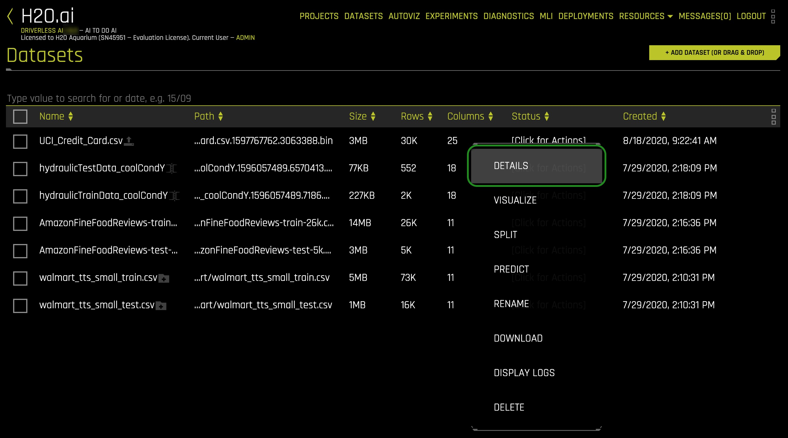
  
2. Let’s have a look at the columns:

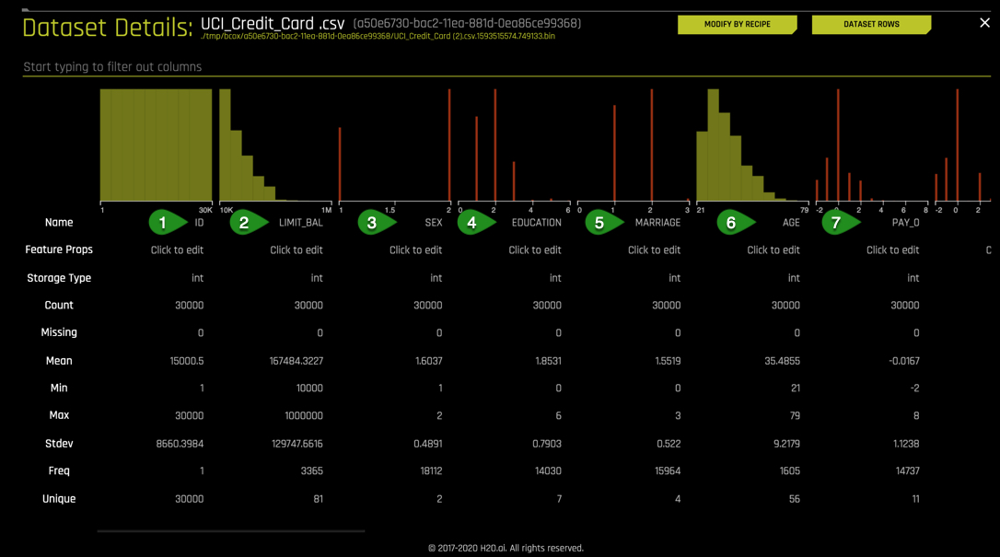

*Things to Note:*

1. **ID** - Row identifier (which will not be used for this experiment)
2. **LIMIT_BAL** - Credit Limit
3. **Sex**
4. **EDUCATION**- Education Level
5. **MARRIAGE** - Marital Status
6. **Age**
7. **PAY0-PAY6**: Payment Information including most recent repayment status values:

    - -2: Paid in full
    - -1: Paid with another line of credit
    - 0: No consumption
    - 1: 1 Month late
    - 2: 2 Months late
    - Up to 9 Months late

3\. Continue scrolling the current page to see more columns.

-  **BILL_AMT0-BILL_AMT6** - Recent credit card bills up to 6 months ago
-  **PAYAMT0-_PAY_AMT6** - Recent payment towards their bill up to 6 months ago
-  **default.payment.next.month**- Prediction of whether someone will default on the next month’s payment using given information.

4\. Return to the **Datasets** page.

5\. Click on the **UCI_Credit_Card.csv** file then select **Predict**.

6\. Select **Not Now** on the "First time Driverless AI" box, a similar image should appear:

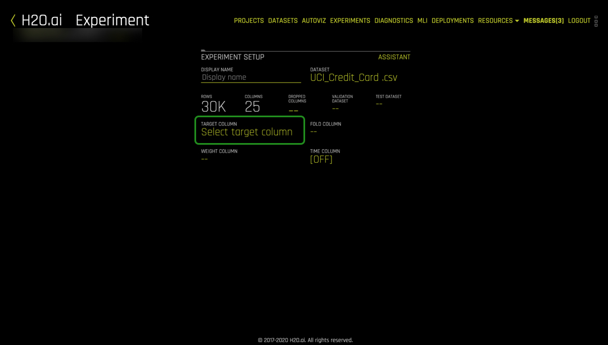

7\. Select **Target Column**, then Select **default.payment.next.month** as the target.

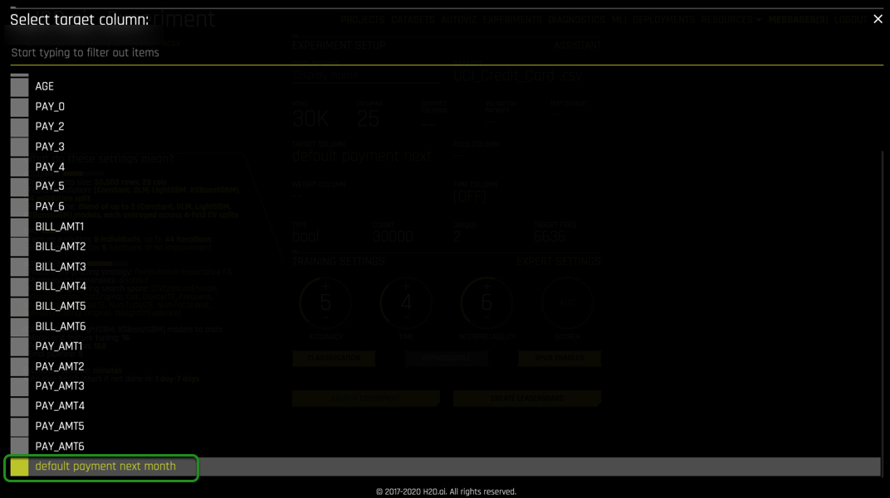

8\. Adjust the settings to:

-  **Accuracy:6**
- **Time:4**
- **Interpretability:6**

After click on **Launch Experiment** 

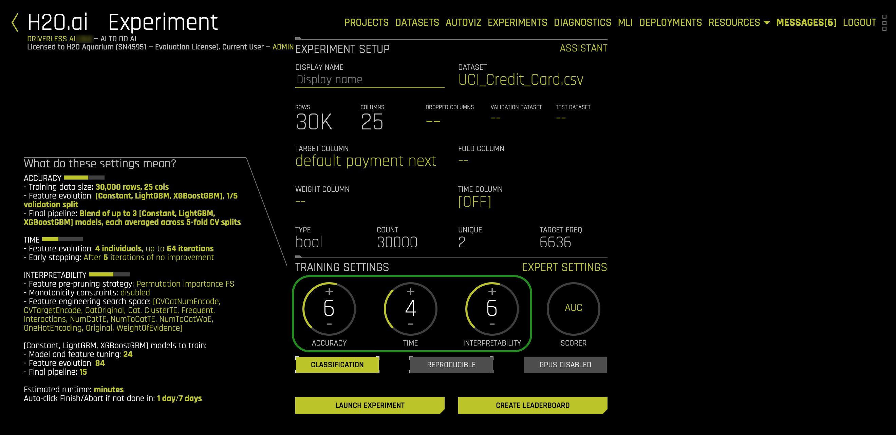

9\. When your experiment finishes building, you should see the following dashboard

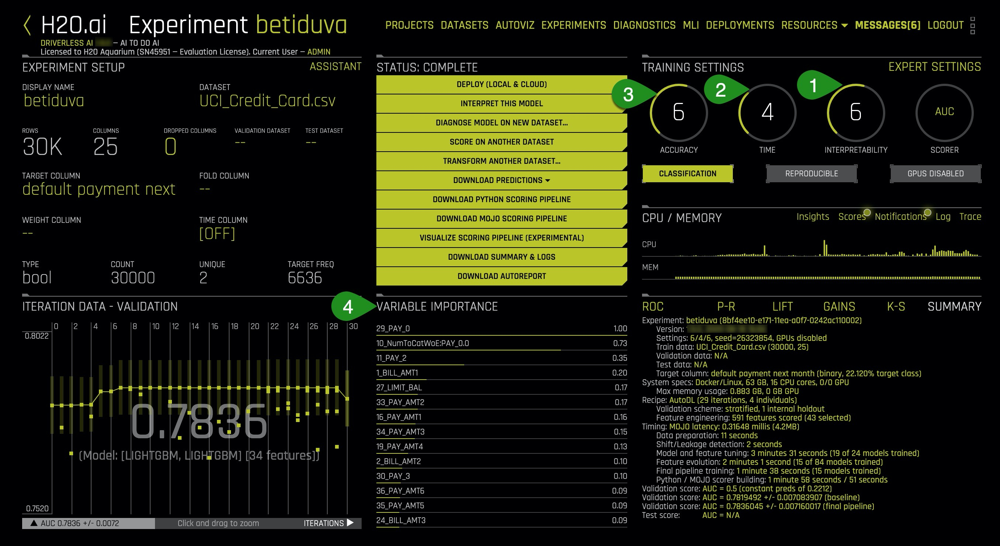

*Things to note:*

1. **Interpretability**  - The interpretability knob is adjustable. The higher the interpretability, the simpler the features the main modeling routine will extract from the dataset.
If the interpretability is high enough then a monotonically constrained model will be generated. Put simply, monotonicity constraint allows our features predictive weightings to get weighted in a single direction i.e. to prevent common sense feature importance like the higher your credit score, the most likely to be approved you are, versus facing random negative weightings for a higher credit score.

2. **Time** - The number of generations a genetic algorithm you can wait for. Higher the time the longer the wait since Driverless AI will work to engineer many features.

3. **Accuracy** -  The complexity of the underlying models. High accuracy will build complex underlying models. 

4. **Variable Importance** -  Here we can see a variety of automatically generated engineered features 

10\. Select **Interpret this Model** 

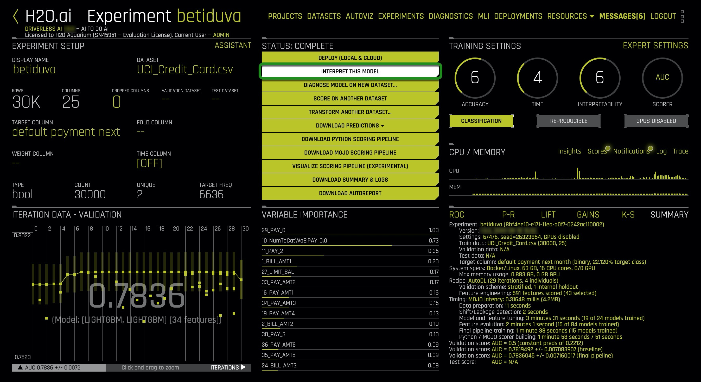

11\. Once the **MLI Experiment is Finished** something similar to the below image should appear

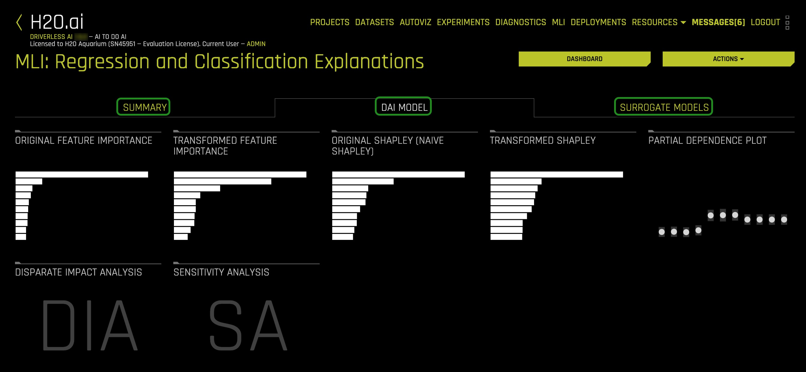

12. If we click into the summary section we can scroll through and learn the following

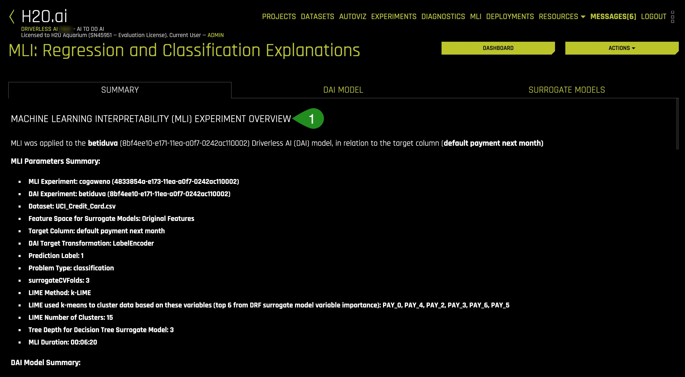

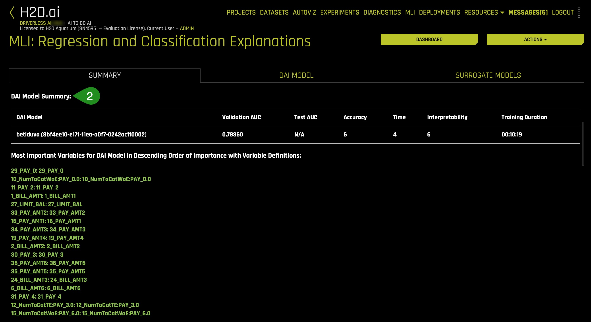

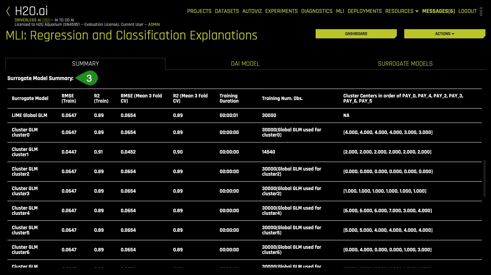

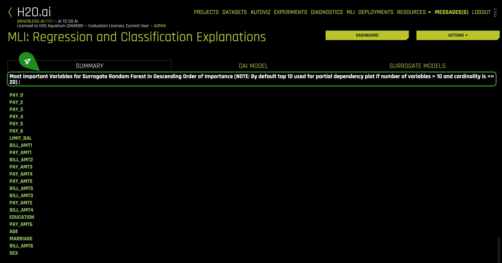

*Things to note:*

1. Summary of some basic facts about the model
2. Ranked variable importance in the space of the derived features (harder to understand)
3. Accuracy of surrogate models, or simple models of complex models 
4. Ranked variable importance in the space of the original features (easier to understand)

Notice that some of the highly ranked variables of the original features (4) show up also as highly ranked variables of the derived features (2). The ranked original variable importance (4) can be used to reason through the more complex features in (2).

## Task 2: Industry Context and ML Explainability Concepts

### Responsibility in AI and Machine Learning

The explainability and interpretability in the machine learning space has grown a tremendous amount since we first developed Driverless AI, with that in mind it is important to frame the larger context in which our interpretability toolkit falls within. It is also worth noting that since this first training was developed, the push toward regulation, oversight, and auditing of ML models and the companies who deploy them has moved rapidly, making these techniques critical requirements for firms looking to make artificial intelligence a part of their companies operations going forward. There have been many recent developments globally, which we have linked below, but the consistent themes seen are fairness, transparency, explainability, interpretability, privacy and security. We have defined a handful of these terms below.

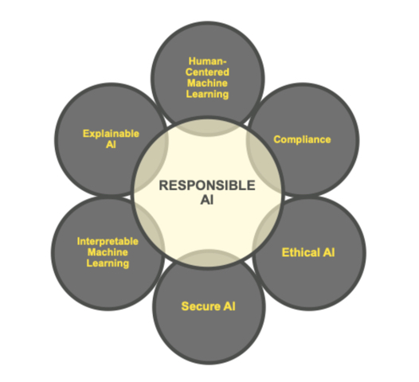

 - **Explainable AI (XAI)**:  The ability to explain a model after it has been developed

 - **Interpretable Machine Learning**:  Transparent model architectures and increasing how intuitive and understandable ML models can be

 - **Ethical AI**:  Sociological fairness in machine learning predictions (i.e., whether one category of person is being weighted unequally)

 - **Secure AI**:  Debugging and deploying ML models with similar counter-measures against insider and cyber threats as seen in traditional software

 - **Human-Centered AI**: User interactions with AI and ML systems

 - **Compliance**: Whether that’s with GDPR, CCPA, FCRA, ECOA, or other regulations, as an additional and crucial aspect of responsible AI.

### Machine Learning Interpretability Taxonomy

In the context of machine learning models and results, interpretability has been defined as the ability to explain or to present in understandable terms to a human [7]. Of course, interpretability and explanations are subjective and complicated subjects, and a previously defined taxonomy has proven useful for characterizing interpretability in greater detail for various explanatory techniques [1].

### Response Function Complexity 

The more complex a function, the more difficult it is to explain. Simple functions can be used to explain more complex functions, and not all explanatory techniques are a good match for all types of models. Hence, it’s convenient to have a classification system for response function complexity.

- **Linear, monotonic functions**: Response functions created by linear regression algorithms are probably the most popular, accountable, and transparent class of machine learning models. These models will be referred to here as linear and monotonic. They are transparent because changing any given input feature (or sometimes a combination or function of an input feature) changes the response function output at a defined rate, in only one direction. Monotonicity also enables accountability through intuitive, and even automatic, reasoning about predictions. 

- **Nonlinear, monotonic functions**: Although most machine learned response functions are nonlinear, some can be constrained to be monotonic with respect to any given input feature. 

- **Nonlinear, monotonic response functions** also enable accountability through the generation of both reason codes and feature importance measures. Moreover, nonlinear, monotonic response functions may even be suitable for use in regulated applications. Their output can change in a positive or negative direction and at a varying rate for any change in an input feature. 

### Scope 

Traditional linear models are globally interpretable because they exhibit the same functional behavior throughout their entire domain and range. Machine learning models learn local patterns in training data and represent these patterns through complex behavior in learned response functions. Therefore, machine-learned response functions may not be globally interpretable, or global interpretations of machine-learned functions may be approximate. In many cases, local explanations for complex functions may be more accurate or simply more desirable due to their ability to describe single predictions. 

**Global Interpretability**: Some of the presented techniques facilitate global transparency in machine learning algorithms, their results, or the machine-learned relationship between the inputs and the target feature. Global interpretations help us understand the entire relationship modeled by the trained response function, but global interpretations can be approximate or based on averages. 

**Local Interpretability**: Local interpretations promote understanding of small regions of the trained response function, such as clusters of input records and their corresponding predictions, deciles of predictions and their corresponding input observations, or even single predictions. 

**Global Versus Local Analysis Motif**: Driverless AI provides both global and local explanations for complex, nonlinear, non-monotonic machine learning models. Reasoning about the accountability and trustworthiness of such complex functions can be difficult, but comparing global versus local behavior is often a productive starting point. 

### Application Domain 

Another important way to classify interpretability techniques is to determine whether they are model-agnostic (meaning they can be applied to different types of machine learning algorithms) or model-specific (meaning techniques that are only applicable for a single type or class of algorithms). In Driverless AI, decision tree surrogate, ICE, K-LIME, and partial dependence are all model-agnostic techniques, whereas Shapley, LOCO, and random forest feature importance are model-specific techniques.

### Understanding and Trust 

Machine learning algorithms and the functions they create during training are sophisticated, intricate, and opaque. Humans who would like to use these models have basic, emotional needs to understand and trust them because we rely on them for our livelihoods or because we need them to make important decisions for us. The techniques in Driverless AI enhance understanding and transparency by providing specific insights into the mechanisms and results of the generated model and its predictions. The techniques described here enhance trust, accountability, and fairness by enabling users to compare model mechanisms and results to domain expertise or reasonable expectations and by allowing users to observe or ensure the stability of the Driverless AI model.

### The Multiplicity of Good Models 

It is well understood that for the same set of input features and prediction targets, complex machine learning algorithms can produce multiple accurate models with very similar, but not the same, internal architectures [6]. This alone is an obstacle to interpretation, but when using these types of algorithms as interpretation tools or with interpretation tools, it is important to remember that details of explanations can change across multiple accurate models. This instability of explanations is a driving factor behind the presentation of multiple explanatory results in Driverless AI, enabling users to find explanatory information that is consistent across multiple modeling and interpretation techniques.

### References 

[1] [Patrick Hall, Wen Phan, and Sri Satish Ambati. Ideas on interpreting machine learning. O’Reilly Ideas, 2017](https://www.oreilly.com/ideas/ideas-on-interpreting-machine-learning)

[6] [Leo Breiman. Statistical modeling: The two cultures (with comments and a rejoinder by the author). Statistical Science, 16(3), 2001.](https://projecteuclid.org/euclid.ss/1009213726)

[7] [Finale Doshi-Velez and Been Kim. Towards a rigorous science of interpretable machine learning. arXiV preprint, 2017](https://arxiv.org/abs/1702.08608)

### Deeper Dive and Resources

- [Hall, P., Gill, N., Kurka, M., Phan, W. (Jan 2019). Machine Learning Interpretability with H2O Driverless AI.](http://docs.h2o.ai/driverless-ai/latest-stable/docs/booklets/MLIBooklet.pdf)

- [On the Art and Science of Machine Learning Explanations](https://arxiv.org/abs/1810.02909)

- [An Introduction to Machine Learning Interpretability](https://www.oreilly.com/library/view/an-introduction-to/9781492033158/)

- [Testing machine learning explanation techniques](https://www.oreilly.com/ideas/testing-machine-learning-interpretability-techniques) 

- [Awesome Machine Learning Interpretability](https://github.com/jphall663/awesome-machine-learning-interpretability)

- [Concept References](https://www.h2o.ai/wp-content/uploads/2017/09/driverlessai/references.html)  

- [Using Artificial Intelligence and Algorithms](https://www.ftc.gov/news-events/blogs/business-blog/2020/04/using-artificial-intelligence-algorithms)

- [Artificial Intelligence (AI) in the Securities Industry1](https://www.finra.org/sites/default/files/2020-06/ai-report-061020.pdf)

- [MEMORANDUM FOR THE HEADS OF EXECUTIVE DEPARTMENTS AND AGENCIES:Guidance for Regulation of Artificial Intelligence Applications](https://www.whitehouse.gov/wp-content/uploads/2020/01/Draft-OMB-Memo-on-Regulation-of-AI-1-7-19.pdf)

- [MODEL ARTIFICIAL INTELLIGENCE GOVERNANCE FRAMEWORK SECOND EDITION](https://www.pdpc.gov.sg/-/media/files/pdpc/pdf-files/resource-for-organisation/ai/sgmodelaigovframework2.pdf)

- [General Data Protection Regulation GDPR](https://gdpr-info.eu)

## Task 3: Global Shapley Values and Feature Importance

### Global Shapley Values and Feature Importance Concepts

Shapley values are one of the most powerful explainability metrics. Global Shapley values are the average of the local Shapley values over every row of a data set. Feature importance measures the effect that a feature has on the predictions of a model. Global feature importance measures the overall impact of an input feature on the Driverless AI model predictions while taking nonlinearity and interactions into consideration. 

Global feature importance values give an indication of the magnitude of a feature’s contribution to model predictions for all observations. Unlike regression parameters or average Shapley values, they are often unsigned and typically not directly related to the numerical predictions of the model. 

(In  contrast, local feature importance describes how the combination of the learned model rules or parameters and an individual observation’s attributes affect a model’s prediction for that observation while taking nonlinearity and interactions into effect.)

- Scope of Interpretability. (1) Random forest feature importance is a global interpretability measure. (2) Shapley and LOCO feature importance is a local interpretability measure, but can be aggregated to become global.

- Appropriate Response Function Complexity.Random forest, Shapley, and LOCO feature importance can be used to explain tree-based response functions of nearly any complexity.

 - Understanding and Trust. (1) Random forest feature importance and global Shapley feature importance increases transparency by reporting and ranking influential input features (2) Local Shapley and LOCO feature importance enhances accountability by creating explanations for each model prediction. (3) Both global and local feature importance enhance trust and fairness when reported values conform to human domain knowledge and reasonable expectations.

 - Application Domain. (1) Tree SHAP and Random forest feature importance is a model specific explanatory technique. (2) LOCO is a model-agnostic concept, but its implementation in Driverless AI is model specific.

### Shapley and Feature Importance Plots

1. In the center of the MLI landing page, select **Transformed Shapley**.

The plot above is a sample of a Shapley plot. Shapley is an “old”, very advanced tool, now being applied to machine learning. This plot shows the global  importance value of the derived features. Notice the feature importance values are signed. The sign determines in which direction the values impact the model predictions on average. Shapley plots help by providing accurate and consistent variable importance even if data changes slightly.
 
Viewing the Global Shapley values plot is a good place to start  because it provides a global view of feature importance and we can see which features are driving the model from an overall perspective. 

Derived features can be difficult to understand. For that reason, it helps also to look at this complex system from the space of the original inputs, surrogate models allow us to to do this.

2. Click on **Surrogate Models:**, then click **Random Forest Feature Importance:**

The **Feature Importance** plot, ranks the original features. These features are the original drivers of the model in the original feature space. These values were calculated by building  a **Random Forest** between the original features and the predictions of the complex driverless AI model that was just trained. 

3. View the **Surrogate Model**, **Random Forest**:

This single **Random Forest** model of a complex Driverless AI model is very helpful because we can see  that this is a trustworthy model between the original inputs to the system and the predictions of the system. Note the low mean squared error(0.0384), and high R2 (96%). 

4. Go back to the Shapley plot and find the feature importance of LIMIT_BAL. How important was LIMIT_BAL  in the global feature importance space? Was LIMIT_BAL a main driver in this space?

5. Look for LIMIT_BAL in the **Feature Importance** under **Surrogate Models**. How important was LIMIT_BAL in the original feature importance space? Was LIMIT_BAL a main driver in this space?

### Deeper Dive and Resources

- [Global and Local Variable Importance](https://www.h2o.ai/wp-content/uploads/2017/09/driverlessai/interpreting.html#global-and-local-variable-importance)

## Task 4: Partial Dependence Plot

### Partial Dependence Concepts

Partial dependence is a measure of the average model prediction with respect to an input variable. In other words, the average prediction of the model with respect to the values of any one variable. Partial dependence plots display how machine-learned response functions change based on the values of an input variable of interest, while taking nonlinearity into consideration and averaging out the effects of all other input variables. 

Partial dependence plots are well-known and described in the Elements of Statistical Learning (Hastie et al, 2001). Partial dependence plots enable increased transparency in Driverless AI models and the ability to validate and debug Driverless AI models by comparing a variable’s average predictions across its domain to known standards, domain knowledge, and reasonable expectations.

### Partial Dependence Plot

Through the **Shapley Values** and **Feature Importance**, we got a global perspective of the model. Now we will explore the global behavior of the features with respect to the model. This is done through the Partial Dependency Plot

1\. Select **Surrogate Models**, **Random Forest** then **Partial Dependecy Plot**

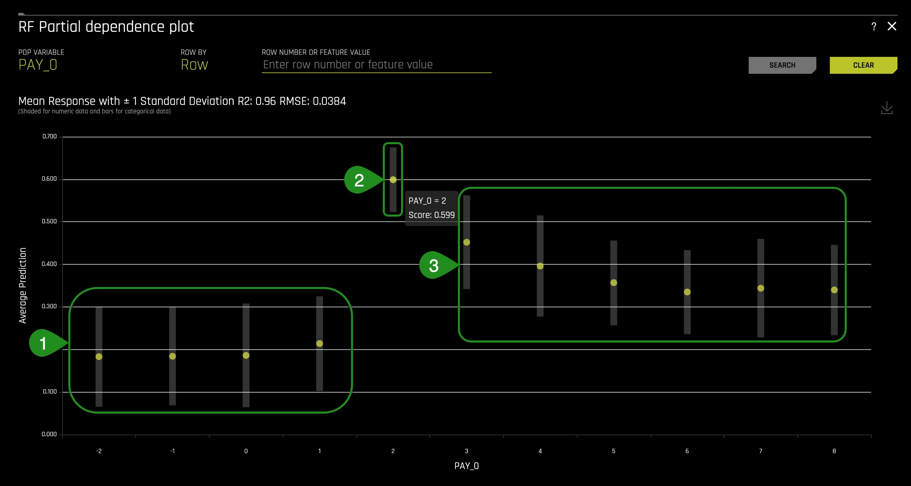

*Things to note:*

1. These values of PAY_0  represent the average predictions of all persons that paid on time or did not use their credit card
2. This value represents the average prediction of persons who were late one month for PAY_0
3. PAY_0 =2 has an average default probability of 0.599 approximately, then the default probability slowly drops all the way to month 8. Does this make sense to you?

The results indicate that overall, in the entire dataset, the worst thing for a person to be in regarding defaulting with respect to PAY_0 is to be two months late. This behavior insight needs to be judged by the user who can determine whether this model should be trusted.

5. A good question to ask here is, is it worse to be two months late than being eight months late on your credit card bill?

6. Explore the partial dependence for **Pay_2** by changing the **PDP Variable** at the upper-left side of the **Partial Dependence Plot** to **Pay_2** 

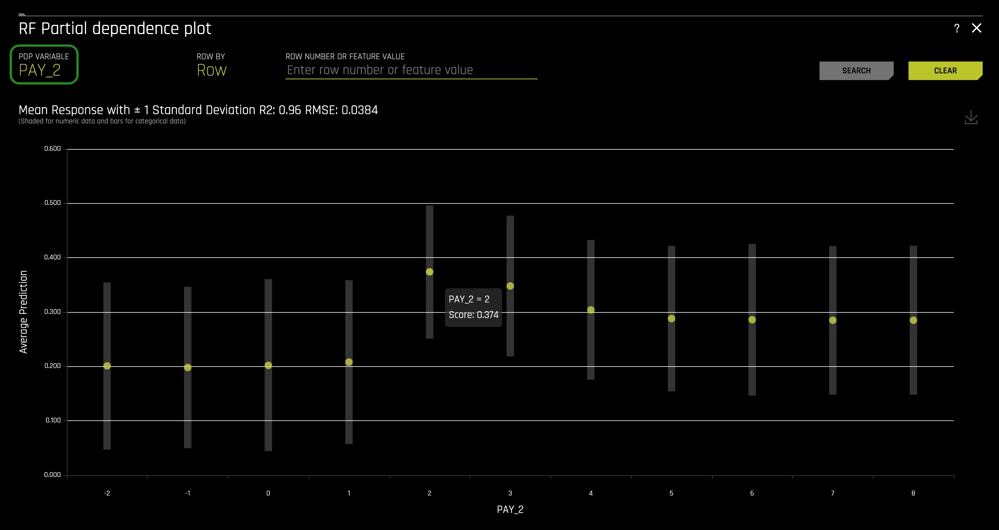

7.  What is the average predicted default probability for PAY_2 = 2?

8. Explore the partial dependence for **LIMIT_BAL** by changing the **PDP Variable** at the upper-left side of the **Partial Dependence Plot** to **LIMIT_BAL**, then hovering over the yellow circles.

The grey area is the standard deviation of the partial dependence. The wider the standard deviation, the less trustworthy the average behavior (yellow line) is. In this case, the standard deviation follows the average behavior and is narrow enough, therefore trustworthy.

9. What is the average default probability for the lowest credit limit? How about for the highest credit limit?

10. What seems to be the trend regarding credit limit and a person defaulting on their payments?

### Task 4 summary:

Examined how the model behaves with respect to its individual values

### Deeper Dive and Resources

- [H2O Partial Dependency Plot](https://www.h2o.ai/wp-content/uploads/2017/09/driverlessai/interpreting.html?highlight=feature%20importance#partial-dependence-and-individual-conditional-expectation-ice)

## Task 5: Decision Tree Surrogate

### Decision Tree Surrogate Concepts 

- Scope of Interpretability: (1) Generally, decision tree surrogates provide global interpretability. (2) The attributes of a decision tree are used to explain global attributes of a complex Driverless AI model such as important features, interactions, and decision processes.

- Appropriate Response Function Complexity: Decision tree surrogate models can create explanations for models of nearly any complexity.

- Understanding and Trust: (1) Decision tree surrogate models foster understanding and transparency because they provide insight into the internal mechanisms of complex models. (2) They enhance trust, accountability, and fairness when their important features, interactions, and decision paths are in line with human domain knowledge and reasonable expectations.

- Application Domain: Decision tree surrogate models are model agnostic

### Decision Tree 

Now we are going to gain some insights into interactions. There are two ways in Driverless AI to do this, one of them is the **Decision Tree**. A **Decision Tree** is another surrogate model.

1\. Select **Surrogate Models**,  then **Decision Tree**

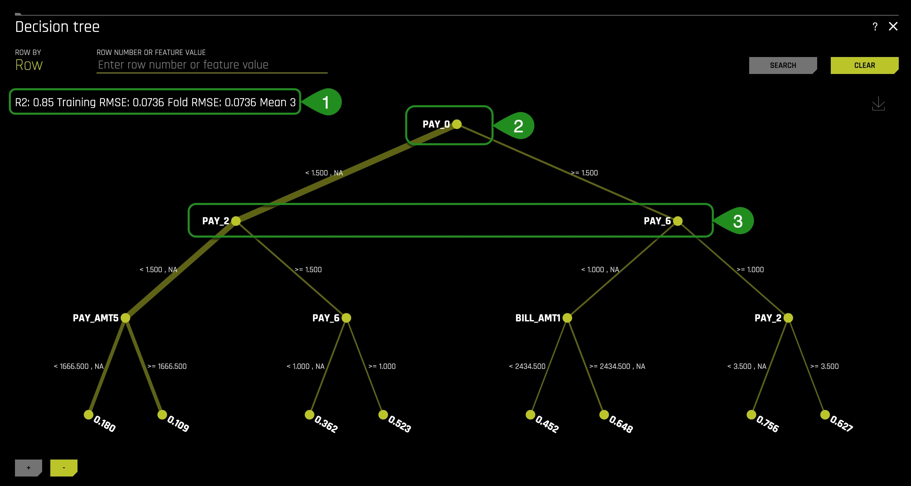

*Things to Note:*

1. The RMSE value is low and the R2 value is fairly high

2. The values at the top of the **Decision Tree** are those variables of higher importance. 

Variables below one-another in the surrogate decision tree may also have strong interactions in the Driverless AI model.

Based on the low RMSE and the fairly high R2, it can be concluded that this is a somewhat trustworthy surrogate model. This single decision tree provides an approximate overall flow chart of the complex model’s behavior.

3. What are the most important variables in the **Decision Tree**? How do those variables compare to the previous plots we have analyzed?

A potential interaction happens when a variable is below another variable in the decision tree. In the image below, a potential interaction is observed between variables PAY_0 and PAY_2. 

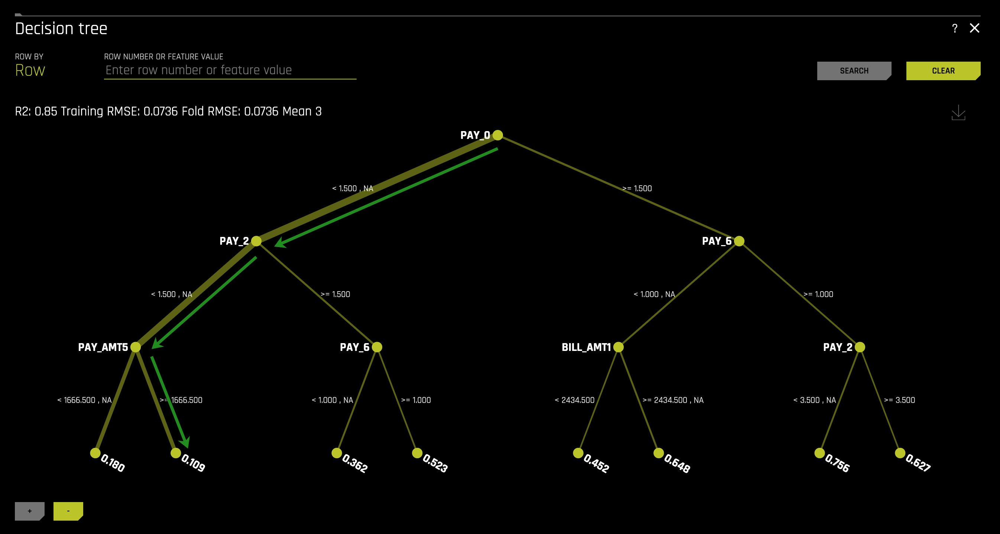

*Things to Note:*

1. Potential Interaction between PAY_0 and PAY_2. This observation can be strengthened by looking at the Shapley Plot and locating any PAY_0 and PAY_2 interactions.

2. The thickness of the yellow line indicates that this is the most common path through the decision tree. This path is the lowest probability of default leaf node. Does this make sense from a business perspective?

It can be observed from the **Decision Tree** that most people tend to pay their bills on time based on the thickness of the path highlighted with green arrows. The people in the highlighted path, are those with the lowest default probability. This low default probability path on the **Decision Tree** is an approximation to how the complex model would place people in a low default probability “bucket”. 

The path to a low default probability can be confirmed by looking at the **Partial Dependency** plots for both  PAY_0 and PAY_2 from earlier. Both plots confirm the low default probability before month two. 

It is important to note that what we are confirming is not whether the model's results are “correct” rather how the model is behaving. The model needs to be analyzed, and decisions need to be made about whether or not the model's behavior is correct.

Task 5 summary:

- Examined how the variables interacted through the **Decision Tree** 

- Observed the average behavior with respect to the model prediction by examining the partial dependence

### Deeper Dive and Resources

- [H2O Decision Tree Surrogate Model ](https://www.h2o.ai/wp-content/uploads/2017/09/driverlessai/interpreting.html?highlight=feature%20importance#decision-tree-surrogate-model)

## Task 6: K-LIME

### K-LIME Concepts

K-LIME is a variant of the LIME technique proposed by Ribeiro at al (2016). K-LIME generates global and local explanations that increase the transparency of the Driverless AI model, and allow model behavior to be validated and debugged by analyzing the provided plots, and comparing global and local explanations to one-another, to known standards, to domain knowledge, and to reasonable expectations.

- Scope of Interpretability: K-LIME provides several different scales of interpretability: (1) coefficients of the global GLM surrogate provide information about global, average trends, (2) coefficients of in-segment GLM surrogates display average trends in local regions, and (3) when evaluated for specific in-segment observations, K-LIME provides reason codes on a per-observation basis.

- Appropriate Response Function Complexity:(1) K-LIME can create explanations for machine learning models of high complexity. (2) K-LIME accuracy can decrease when the Driverless AI model becomes too nonlinear.

- Understanding and Trust: (1) K-LIME increases transparency by revealing important input features and their linear trends. (2) K-LIME enhances accountability by creating explanations for each observation in a dataset. (3) K-LIME bolsters trust and fairness when the important features and their linear trends around specific records conform to human domain knowledge and reasonable expectations.

- Application Domain. K-LIME is model agnostic

### K-LIME Plot

The recent tasks have focused on the model’s global behavior for the entire dataset, but how does the model behave for a single person? A great, but complex tool for this is K-Lime.

1\. Under **Surrogate Models** select **K-LIME**

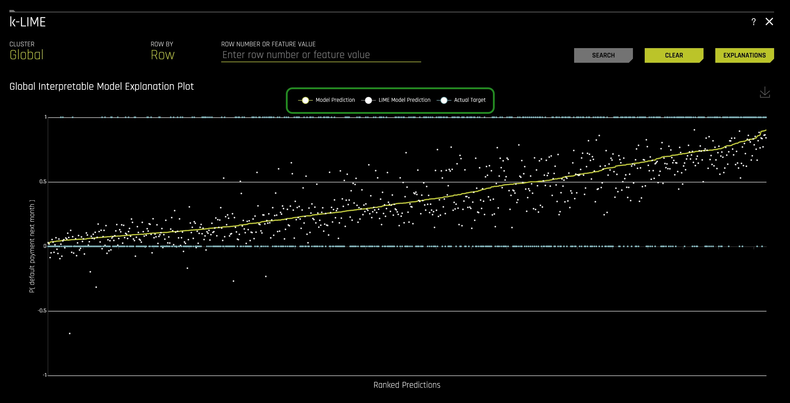

2\. On the green highlighted area of the K-LIME Plot click on **Model Prediction**, **LIME Model Prediction** then **Actual Target** . The K-LIME plot should look similar to the image below:

3\. Click on **Model Prediction** again, this time the plot will look similar to the one below:

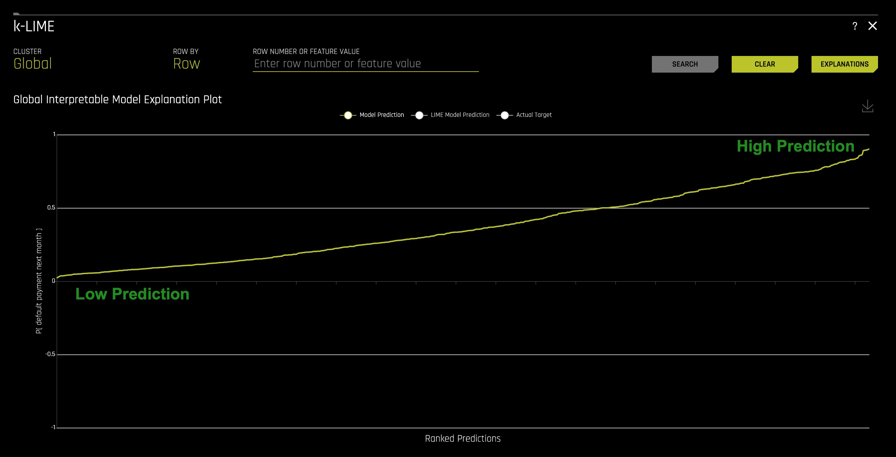

*Things to note*:

This plot is the predictions of the Driverless AI model from lowest to highest. 
The x-axis is the index of the rows that causes that ranking to occur from lowest to highest

4\. Add **Actual Target** by clicking on it, the plot should look similar to the one below:

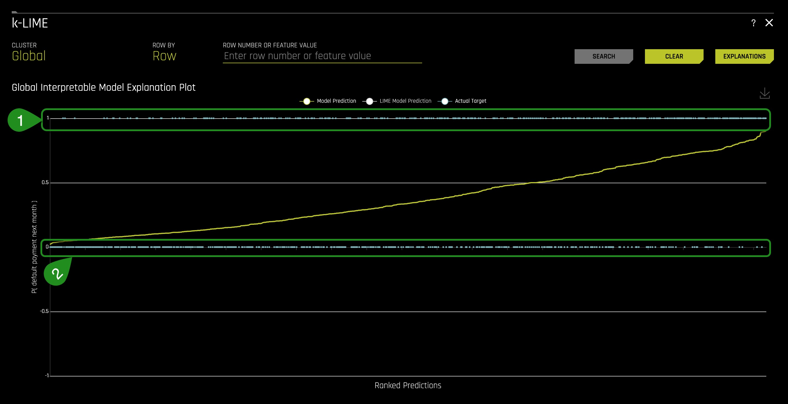

*Things to Note:*

1. People who did not pay their bills on time
2. People who paid their bills on time 

Adding the **Actual Target** to the plot allows us to check if the model is not entirely wrong. From the plot,  the density of  line (2) near the low ranked predictions show that many people made their payments on time while those in line (1) had missed payments since the line is scattered. Towards the high ranked predictions, the density of line (1) shows the high likelihood of missing payments while the sparseness of line (2) shows those who have stopped making payments. These observations are a good sanity check. 

5\. Now, click on **LIME Model Prediction**

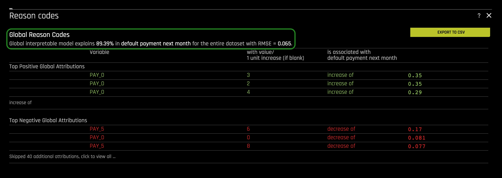

*Things to Note:*

1. Global interpretable model explains  89.39% in default payment next month for the entire dataset with RMSE = 0.065. 

This single linear model trained on the original inputs of the system to predict the predictions of the original Driverless AI model shows that the original model predictions are highly linear. The plot above is an implementation of LIME or “Local Interpretable Model Agnostic Explanations” wherein we aim to fit a simple linear model to a more complex machine learning model.

6\. Go to Task 7.

**K-LIME Advance Features**

7\. On the K-LIME plot, change the Cluster to Cluster 13.

8\. Select another high probability default person from this K-LIME cluster by clicking on one of the white points on the top-right section of the plot

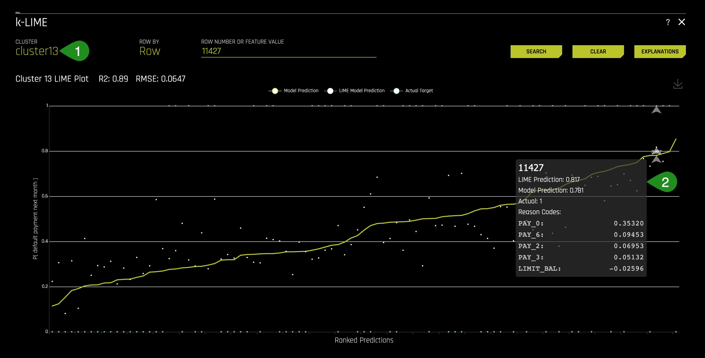

1. Change cluster to cluster 13 and note the R2 value is still very high
2. Pick a point on the top-right section of the plot and Examine Reason Codes

The local model predictions (white points) can be used to reason through the Driverless AI model (yellow) in some local region.

9\. Review **Explanations** on the **K-LIME** plot

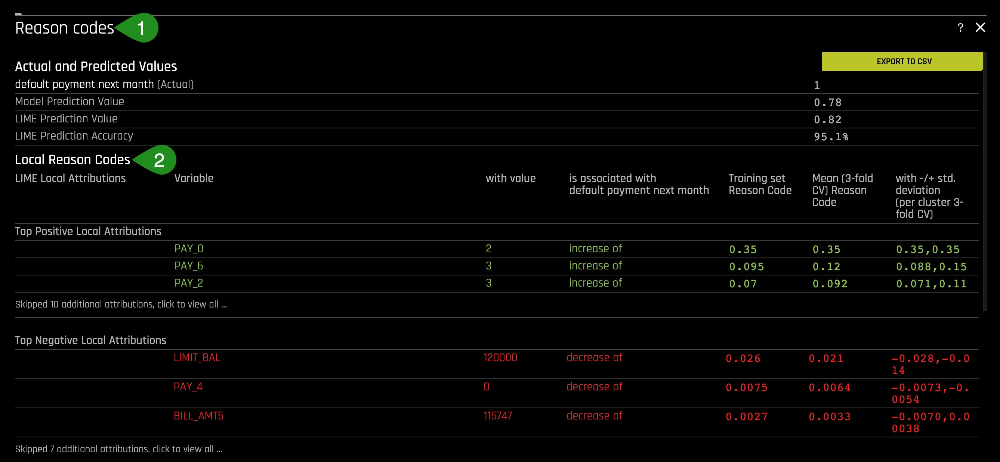

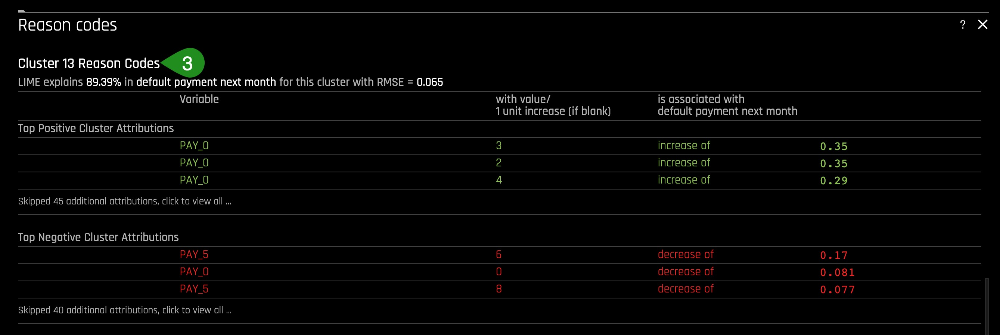

*Things to Note:*

1. The reason codes show that the Driverless model prediction gave this person .78 percent probability of defaulting. LIME gave them a .82 percent probability of defaulting and in this case we can say that LIME is 95.1% accurate. Based on this observation, it can be concluded that the local reason codes are fairly trustworthy. If **Lime Prediction Accuracy** drops below 75% then we can say that the numbers are probably untrustworthy and the Shapley plot or LOCO plot should be revisited since the Shapley values are always accurate, and LOCO accounts for nonlinearity and interactions.

2. PAY_0 = 2 months late is the top positive local attribute for this person and contributes .35 probability points to their prediction according to this linear model. 0.35 is the local linear model coefficient for level 3 of the categorical variable PAY_0.

3. Cluster 13 reason codes show the average linear trends in the data region around this person. 

4. Global reason codes show the average linear trends in the data set as a whole.

### Task 6 summary:

- LIME values are an approximate estimate of the trend of how the model is behaving in a local region for a specific point

- Reason codes help us describe why the model made the decision is made for this specific person. Reason codes are particularly important in highly regulated industries when often regulators will want to see in as simple as possible terms “how did the model come to the conclusion it did.”

### Deeper Dive and Resources

- [H2O K-LIME](https://www.h2o.ai/wp-content/uploads/2017/09/driverlessai/interpreting.html?highlight=feature%20importance#k-lime) 

- [H2O Viewing Explanations](https://www.h2o.ai/wp-content/uploads/2017/09/driverlessai/viewing-explanations.html) 

## Task 7: Local Shapley and LOCO
 
### Local Shapley Concepts

Shapley explanations are a technique with credible theoretical support that presents globally consistent global and locally accurate variable contributions. Local numeric Shapley values are calculated by repeatedly tracing single rows of data through a trained tree ensemble and aggregating the contribution of each input variable as the row of data moves through the trained ensemble.

Shapley values sum to the prediction of the Driverless AI model before applying the link function or any regression transforms. (Global Shapley values are the average of the local Shapley values over every row of a data set.)

### LOCO Concepts

Local feature importance describes how the combination of the learned model rules or parameters and an individual row’s attributes affect a model’s prediction for that row while taking nonlinearity and interactions into effect. Local feature importance values reported here are based on a variant of the leave-one-covariate-out (LOCO) method (Lei et al, 2017).

In the LOCO-variant method, each local feature importance is found by re-scoring the trained Driverless AI model for each feature in the row of interest, while removing the contribution to the model prediction of splitting rules that contain that feature throughout the ensemble. The original prediction is then subtracted from this modified prediction to find the raw, signed importance for the feature. All local feature importance values for the row can be scaled between 0 and 1 for direct comparison with global feature importance values

### Local Shapley Plot

Local Shapley Plot is able to generate variable contribution values for every single row that the model predicts on. This means that we can generate for every person in our dataset the exact numeric contribution of each of the variables for each prediction of the model. For the **Local Shapley** plots, the yellow bars stay the same since they are the global variable contribution, however the grey bars will change when a different row or person is selected from the dataset using the row selection dialog box or by clicking on an individual in the K-LIME plot.

The grey bars or local numeric contributions can be used to generate reason codes. The reason codes should be  suitable for regulated industries where modeling decisions need to be justified. For our dataset, we can select a person with a high default probability, select Shapley Local plot and pick out the largest grey bars as the biggest contributors for the decision of denying a future loan.  

1\. Select a high probability default person on the K-LIME plot by clicking on one of the white points in the top-right corner of the plot

2\. Then under the **Driverless AI Model** select **Shapley**

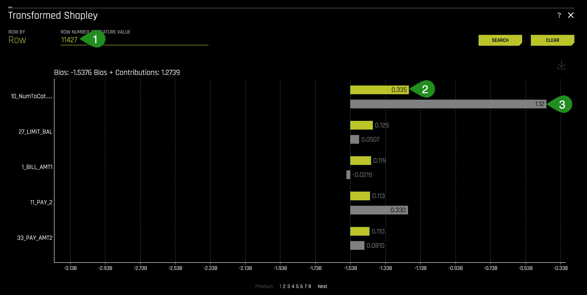

**Note:** The Shapley plot will depend on K-LIME point you selected.

*Things to Note:*

1. Row number being observed
2. Global Shapley value 
3. A sample of a Shapley Local  numeric contribution of a variable for the high probability person in row 11427

3\. Pick another high probability person on the **K-LIME** plot and return to the **Shapley** plot and determine what local Shapley values have influenced the person you selected from defaulting (look for the largest grey bars)?

4\. How do those Shapley local values compare to their perspective Shapley Global values? Are the local Shapley values leaning towards defaulting even though the Shapley global values are leaning towards not defaulting? How do the local Shapley values compare to the local K-LIME values?

### Task 7 summary:

Shapley local variables are locally accurate and globally consistent
If the dataset changes slightly the variable importance can be expected to not reshuffle
Shapley local values should be good enough to create reason codes
Shapley values operate on the trained model itself and are more exact compared to surrogate models which are more approximate

## Task 8: Putting it All Together and ICE
 
### The ICE Technique

Individual conditional expectation (ICE) plots, a newer and less well-known adaptation of partial dependence plots, can be used to create more localized explanations for a single individual using the same basic ideas as partial dependence plots. ICE Plots were described by Goldstein et al (2015). ICE values are simply disaggregated partial dependence, but ICE is also a type of nonlinear sensitivity analysis in which the model predictions for a single row are measured while a variable of interest is varied over its domain. ICE plots enable a user to determine whether the model’s treatment of an individual row of data is outside one standard deviation from the average model behavior, whether the treatment of a specific row is valid in comparison to average model behavior, known standards, domain knowledge, and reasonable expectations, and how a model will behave in hypothetical situations where one variable in a selected row is varied across its domain.

ICE is simply the prediction of the model for the person in question, in our case row 11427. The data for this row was fixed except for PAY_0 then it was cycled through different pay values. The plot above is the result of this cycling. If the ICE values (grey dots) diverge from the partial dependence (yellow dots). In other words, if ICE values are going up and partial dependence going down. This behavior can be indicative of an interaction. The reason for this is that the individual behavior (grey dots) is different since it is diverging from the average behavior.

### ICE Plots
1\. Select **Dashboard**

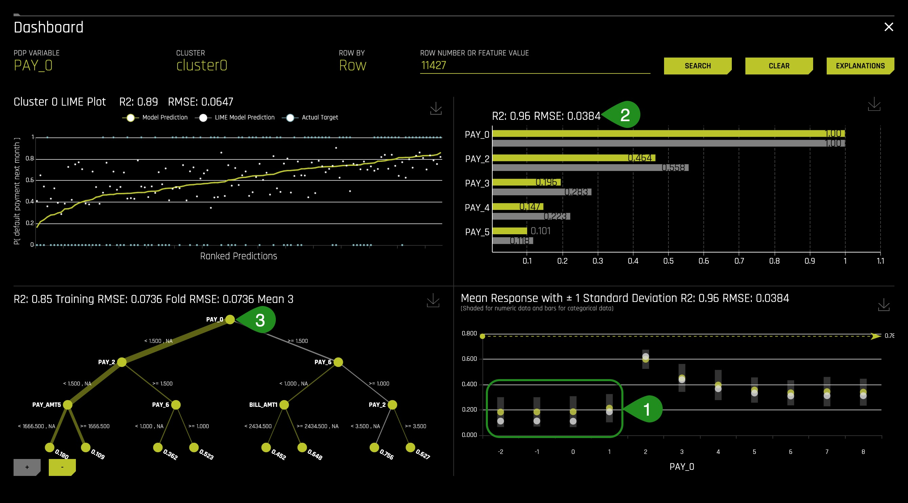

*Things to note:*

1. ICE (grey dots)

2. Partial Dependence (yellow dots) and LOCO feature Importance for the person in row 11427 (grey bars) in relation to global feature importance 

3. Decision Tree Path for the person in row 11427

We can observe divergence on the ICE plot and confirm possible interactions with the surrogate decision tree (the grey path). Note there seems to be interactions between PAY_0, PAY_6, and PAY_2.

2\. **Return to Task 6 question 7** to conclude K-LIME.

### Deeper Dive and Resources

- [On the Art and Science of Machine Learning Explanations](https://arxiv.org/abs/1810.02909)

- [H2O ICE](https://www.h2o.ai/wp-content/uploads/2017/09/driverlessai/interpreting.html?highlight=ice#partial-dependence-and-individual-conditional-expectation-ice) 

### Learning Outcome

Now you should be able to generate an MLI report, explain major features and key MLI techniques. 

Now, that you can use the techniques learned here, what can you find using the Dashboard view? 

### External URL to the data:

- [Default of credit card clients Data Set](https://archive.ics.uci.edu/ml/datasets/default+of+credit+card+clients)

- [Default of Credit Card Clients Dataset](https://www.kaggle.com/uciml/default-of-credit-card-clients-dataset)

- [Default Payments of Credit Card Clients in Taiwan from 2005](https://rstudio-pubs-static.s3.amazonaws.com/281390_8a4ea1f1d23043479814ec4a38dbbfd9.html) 

- [Classification for Credit Card Default](http://inseaddataanalytics.github.io/INSEADAnalytics/CourseSessions/ClassificationProcessCreditCardDefault.html) 

### Resources and Videos

- [H2O Driverless AI Machine Learning Interpretability walkthrough (Oct 18)](https://www.youtube.com/watch?v=5jSU3CUReXY) 

- [Practical Tips for Interpreting Machine Learning Models - Patrick Hall, H2O.ai  (June 18)](https://www.youtube.com/watch?v=vUqC8UPw9SU) 

- [Building Explainable Machine Learning Systems: The Good, the Bad, and the Ugly (May 18)](https://www.youtube.com/watch?v=Q8rTrmqUQsU)

- [Interpretable Machine Learning  (April, 17)](https://www.youtube.com/watch?v=3uLegw5HhYk)

- [Driverless AI Hands-On Focused on Machine Learning Interpretability - H2O.ai (Dec 17)](https://www.youtube.com/watch?v=axIqeaUhow0)

- [MLI Meetup before Strata NYC 2018](https://www.youtube.com/watch?v=RcUdUZf8_SU)

- [An Introduction to Machine Learning Interpretability](https://www.oreilly.com/library/view/an-introduction-to/9781492033158/) 

- [Testing machine learning explanation techniques](https://www.oreilly.com/ideas/testing-machine-learning-interpretability-technique)

- [Practical techniques for interpretable machine learning](https://conferences.oreilly.com/strata/strata-ca/public/schedule/detail/72421) 

- [Patrick Hall and H2O Github](https://github.com/jphall663/interpretable_machine_learning_with_python)

- [Awesome-Machine-Learning-Interpretability](https://github.com/jphall663/awesome-machine-learning-interpretability)

- [jsm_2018_slides](https://github.com/jphall663/jsm_2018_slides/blob/master/main.pdf)

- [mli-resources](https://github.com/h2oai/mli-resources/)

- [mli-resources](https://github.com/h2oai/mli-resources/blob/master/cheatsheet.png)

### On the Art and Science of Machine Learning Explanations

- [Towards A Rigorous Science of Interpretable Machine Learning](https://arxiv.org/abs/1810.02909 )

- [Principles for Accountable Algorithms and a Social Impact Statement for Algorithms](https://arxiv.org/pdf/1702.08608.pdf )

- [Explainable Artificial Intelligence (XAI)](http://www.fatml.org/resources/principles-for-accountable-algorithms)

- [Explainable Artificial Intelligence (XAI)](https://www.darpa.mil/program/explainable-artificial-intelligence)

- [Explainable Artificial Intelligence (XAI)](https://docs.google.com/viewer?url=https%3A%2F%2Fwww.darpa.mil%2Fattachments%2FXAIIndustryDay_Final.pptx) 

- [Broad Agency Announcement Explainable Artificial Intelligence (XAI)](https://www.darpa.mil/attachments/DARPA-BAA-16-53.pdf) 

- [Explainable Artificial Intelligence (XAI)](https://www.darpa.mil/attachments/XAIProgramUpdate.pdf)

## Next Steps

Check out the next tutorial: [Time Series Tutorial - Retail Sales Forecasting](https://training.h2o.ai/products/tutorial-2a-time-series-recipe-tutorial-retail-sales-forecasting) where you will learn more about:

- Time-series:

    - Time-series concepts
    - Forecasting
    - Experiment settings
    - Experiment results summary
    - Model interpretability
    - Analysis
