# Machine Learning Interpretability

## Outline
- [Objective](#objective)
- [Prerequisites](#prerequisites)
- [Task 1: Launch Experiment](#task-1-launch-experiment) 
- [Task 2: Industry Context and ML Explainability Concepts](#task-2-industry-context-and-ml-explainability-concepts)
- [Task 3: Global Shapley Values and Feature Importance](#task-3-global-shapley-values-and-feature-importance)
- [Task 4: Partial Dependence Plot](#task-4-partial-dependence-plot)
- [Task 5: Decision Tree Surrogate](#task-5-decision-tree-surrogate)
- [Task 6: K-LIME](#task-6-k-lime)
- [Task 7: Local Shapley and LOCO](#task-7-local-shapley-and-loco)
- [Task 8: Putting it All Together and ICE](#task-8-putting-it-all-together-and-ice) 
- [Next Steps](#next-steps)


## Objective 

As Machine Learning grows, more industries, from healthcare to banking, adopt machine learning models to generate predictions. These predictions are being used to justify the cost of healthcare and for loan approvals or denials. For regulated industries that are adopting machine learning, the **interpretability** of models is a requirement. In Machine Learning, **interpretability** can be defined as “the ability to explain or present in understandable terms to a human [being].”[1] 

A few of the motivations for interpretability are as follows:
- Better human understanding of impactful technologies
- Regulation compliance and General Data Protection Regulations (GDPRs) 
- Check and balance against accidental or intentional discrimination
- Hacking and adversarial attacks
- Alignment with US FTC and OMB guidance on transparency and explainability
- Prevent the building of excessive Technical Debt in Machine Learning
- More in-depth insight and understanding of your data 

This tutorial will build a machine learning model using the famous **Default of Credit Card Clients Dataset**. We will use the dataset to build a classification model that will predict the probability of clients defaulting on their next credit card payment. In contrast to previous tutorials, we will focus on the most leading methods and concepts for explaining and interpreting Machine Learning models. Therefore, we will not focus so much on the experiment itself. Instead, we would shift our attention to using the following metrics and graphs that Driverless AI generates to understand our built model: **results, graphs, scores, and reason code values**. In particular, we will explore the following graphs in Driverless AI: 

- Decision tree surrogate models 
- Individual conditional expectation (ICE) plots 
- K local interpretable model-agnostic explanations (K-LIME) 
- Leave-one-covariate-out (LOCO) local feature importance  
- Partial dependence plots 
- Random forest feature importance 


Before we explore these techniques in detail, we briefly introduce ourselves to fundamental concepts in machine learning interpretability (MLI). As well, we explore a global versus local analysis motif that will be crucial when interpretability models in Driverless AI. Furthermore, we will explore a general justification for MLI and a huge problem in the field: the multiplicity of good models. At lasts, we will explore each technique while explaining how they can be used to understand our use case: credit card defaulting. 

**Note:** We recommend that you go over the entire tutorial first to review all the concepts; that way, you will be more familiar with the content once you start the experiment.

### Deeper Diver and Resources 

**Learn more about Interpretability**:
 
- [Brief Perspective on Key Terms and Ideas in Responsible AI](https://www.h2o.ai/blog/brief-perspective-on-key-terms-and-ideas-in-responsible-ai-2/)
- [“Towards a rigorous science of interpretable machine learning”](https://arxiv.org/pdf/1702.08608.pdf)
- [FAT/ML](http://www.fatml.org/resources/principles-for-accountable-algorithms)
- [Explainable Artificial Intelligence (XAI)](https://www.darpa.mil/program/explainable-artificial-intelligence)
- [1] [“Towards a rigorous science of interpretable machine learning”](https://arxiv.org/pdf/1702.08608.pdf) 

## Prerequisites

You will need the following to be able to do this tutorial:

- Basic knowledge of Machine Learning and Statistics
- Basic knowledge of Driverless AI or doing the following tutorial: [Automatic Machine Learning Introduction with Driverless AI](https://training.h2o.ai/products/tutorial-1a-automatic-machine-learning-introduction-with-driverless-ai) 
- A **Two-Hour Test Drive session**: Test Drive is H2O.ai's Driverless AI on the AWS Cloud. No need to download software. Explore all the features and benefits of the H2O Automatic Learning Platform.
  - Need a **Two-Hour Test Drive** session? Follow the instructions on [this quick tutorial](https://training.h2o.ai/products/tutorial-0-getting-started-with-driverless-ai-test-drive) to get a Test Drive session started. 

**Note: Aquarium’s Driverless AI Test Drive lab has a license key built-in, so you don’t need to request one to use it. Each Driverless AI Test Drive instance will be available to you for two hours, after which it will terminate. No work will be saved. If you need more time to further explore Driverless AI, you can always launch another Test Drive instance or reach out to our sales team via the [contact us form](https://www.h2o.ai/company/contact/).**


##  Task 1: Launch Experiment

### About the Dataset

The dataset we will be using contains information about credit card clients in Taiwan from **April 2005** to **September 2005**. Features include demographic factors, repayment statuses, history of payment, bill statements, and default payments. The data set comes from the [UCI Machine Learning Repository: UCI_Credit_Card.csv](https://archive.ics.uci.edu/ml/datasets/default+of+credit+card+clients#) This dataset has a total of 25 Features(columns) and 30,000 Clients(rows).

### Download Dataset

When looking at the **UCI_Credit_Card.csv**, we can observe that column **PAY_0** was suppose to be named **PAY_1**. Accordingly, we will solve this problem using a data recipe that will change the column's name to **PAY_1**. The data recipe has already been written and can be found [here](https://s3.amazonaws.com/data.h2o.ai/DAI-Tutorials/MLI+Tutorials/uci_credit_card_recipe.py). Download the data recipe and name it ```uci_credit_card_recipe.py```. Make sure it's saved as a **.py** file. 
 
Now upload the data recipe to the Driverless AI dataset's page. In the **DATASETS** page click **+ ADD DATASET(OR DRAG & DROP)** and select **UPLOAD DATA RECIPE**: 

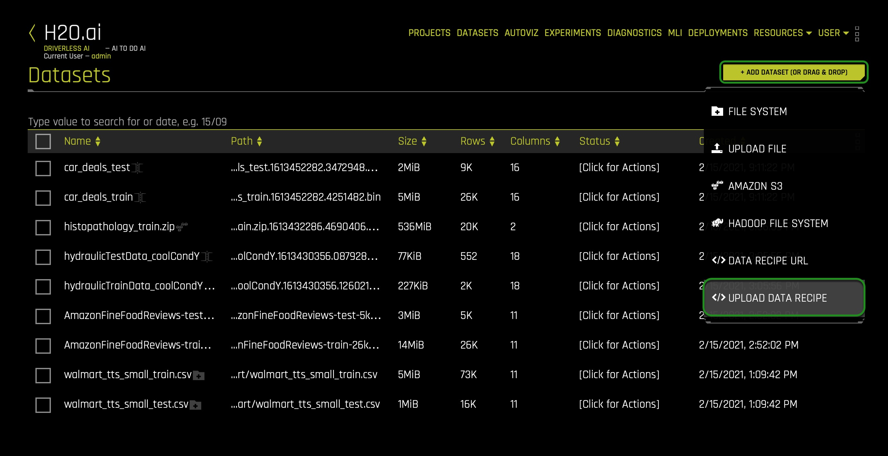

After it imports successfully, you will see the following CSV on the **DATASETS** page: **UCI_Credit_Card.csv**.


### Details and Launch Experiment 

Click on the **UCI_Credit_Card.csv** then select **Details**:

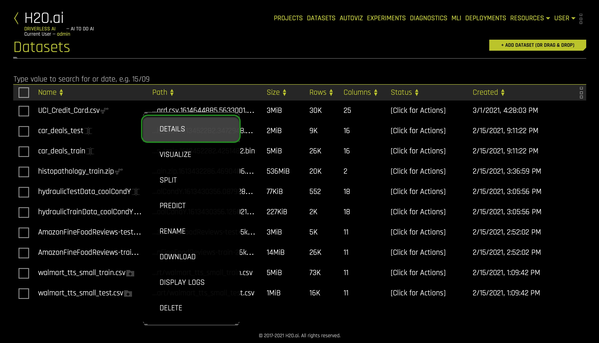
  
Before we run our experiment, let’s have a look at the dataset columns:

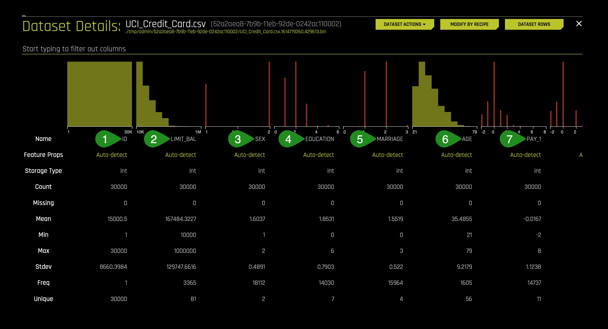

*Things to Note:*

1. **ID** - Row identifier (which will not be used for this experiment)
2. **LIMIT_BAL** - Amount of the given credit: it includes the individual consumer credit and family (supplementary) credit
3. **Sex** - Gender (1 =  male; 2 = female)
4. **EDUCATION**- Education (1 = graduate school; 2 = university; 3 = high school; 4 = others)
5. **MARRIAGE** - Marital status (1 = married; 2 = single; 3 = others)
6. **Age**
7. **PAY_1 - PAY_6**: History of past payment:
    - -2: Paid in full
    - -1: Paid with another line of credit
    - 0: No consumption
    - 1: 1 Month late
    - 2: 2 Months late
    - 3: 3 Months late
    - Up to 9 Months late
- Continue scrolling the current page to see more columns.
  -  **BILL_AMT1 - BILL_AMT6** - Amount of bill statement 
  -  **PAY_AMT1 -PAY_AMT6** - Amount of previous payment 
  -  **default.payment.next.month** - Default (1: Yes, 0: No)

Now, return to the **Datasets** page. Click on the **UCI_Credit_Card.csv**, then select **Predict**. Select **Not Now** on the "First-time Driverless AI" box, the following will appear:

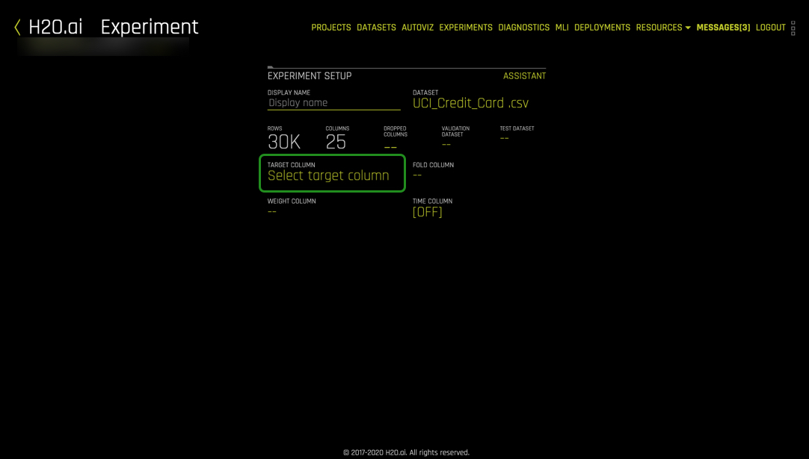

As you might have noticed in the dataset, we have a feature that can tell us whether a client defaulted on their next month's payment. In other words, **default.payment.next.month** tells us if PAY_7 defaulted(PAY_7 is not a column in our dataset). With that in mind, we are going to select as our **target column**:  **default.payment.next.month**. As mentioned in the **Objective** task, we will be creating a classification model to predict whether someone will be defaulting on their next payment, in this case, on PAY_7: 

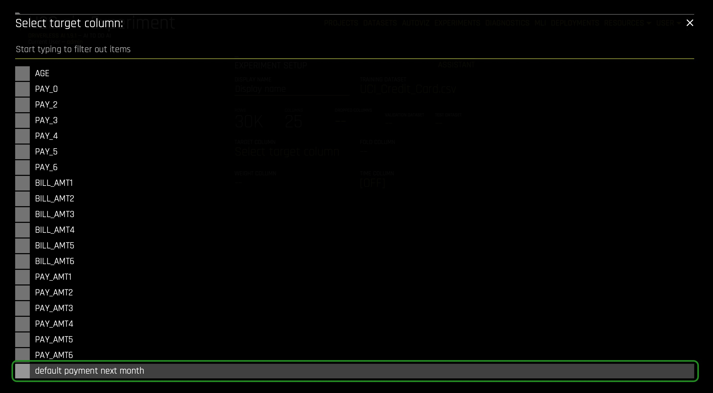

For our **Training Settings**, adjust the settings to:
- Accuracy: **6**
- Time: **4**
- Interpretability: **7**
- Scorer: **AUC**

After click on **Launch Experiment**:

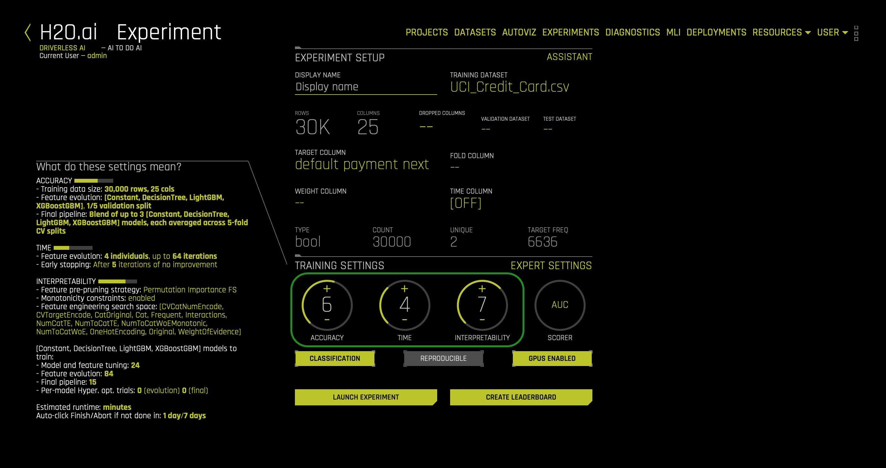

*Things to note:*

1. **Interpretability** -  The higher the interpretability, the simpler the features that Driverless AI will generate. If the interpretability is high enough, then Driverless AI will generate a monotonically constrained model. In other words, it will make the model more transparent and interpretable. In particular, it will make our metrics that we will generate easy to understand while eliminating perhaps features that will be a lot of work to understand from a perspective of interpretability. A monotonically constrained model can be enabled when **Interpretability >= 7.** 
2. **Variable Importance** - Here, we can see a variety of automatically generated engineered features. Features that we will use to understand our model and its decision-making process. 

While we wait for the experiment to finish, let's explore some crucial concepts that will help us achieve **interpretability** in our model.  

## Task 2: Industry Context and ML Explainability Concepts

### Overivew

For decades, common sense has deemed the complex, intricate formulas created by training machine learning algorithms to be uninterpretable. While it is un- likely that nonlinear, non-monotonic, and even non-continuous machine-learned response functions will ever be as directly interpretable as more traditional linear models, great advances have been made in recent years [1]. H2O Driverless AI incorporates a number of contemporary approaches to increase the transparency and accountability of complex models and to enable users to debug models for accuracy and fairness including:

- Decision tree surrogate models [2]
- Individual conditional expectation (ICE) plots [3]
- K local interpretable model-agnostic explanations (K-LIME) 
- Leave-one-covariate-out (LOCO) local feature importance [4] 
- Partial dependence plots [5]
- Random forest feature importance [5]

**Note**: we will cover the above approaches, and we will explore various concepts around its primary functions. 


### Machine Learning Interpretability Taxonomy


In the context of machine learning models and results, interpretability has been defined as the ability to explain or to present in understandable terms to a human [7]. Of course, interpretability and explanations are subjective and complicated subjects, and a previously defined taxonomy has proven useful for characterizing interpretability in greater detail for various explanatory techniques [1]. Following Ideas on Interpreting Machine Learning, presented approaches will be described in terms of response function complexity, scope, application domain, understanding, and trust.


### Response Function Complexity 

The more complex a function, the more difficult it is to explain. Simple functions can be used to explain more complex functions, and not all explanatory techniques are a good match for all types of models. Hence, it’s convenient to have a classification system for response function complexity.
- **Linear, monotonic functions**: Response functions created by linear regression algorithms are probably the most popular, accountable, and transparent class of machine learning models. These models will be referred to here as linear and monotonic. They are transparent because changing any given input feature (or sometimes a combination or function of an input feature) changes the response function output at a defined rate, in only one direction, and at a magnitude represented by a readily available coefficient. Monotonicity also enables accountability through intuitive, and even automatic, reasoning about predictions. For instance, if a lender rejects a credit card application, they can say exactly why because their probability of default model often assumes that credit scores, account balances, and the length of credit history are linearly and monotonically related to the ability to pay a credit card bill. When these explanations are created automatically and listed in plain English, they are typically called reason codes. In Driverless AI, linear and monotonic functions are fit to very complex machine learning models to generate reason codes using a technique known as K-LIME.
- **Nonlinear, monotonic functions**: Although most machine learned response functions are nonlinear, some can be constrained to be monotonic with respect to any given input feature. While there is no single coefficient that represents the change in the response function induced by a change in a single input feature, nonlinear and monotonic functions are fairly transparent because their output always changes in one direction as a single input feature changes.Nonlinear, monotonic response functions also enable accountability through the generation of both reason codes and feature importance measures. Moreover, nonlinear, monotonic response functions may even be suitable for use in regulated applications. In Driverless AI, users may soon be able to train nonlinear, monotonic models for additional interpretability.
- **Nonlinear, non-monotonic functions**: Most machine learning algorithms create nonlinear, non-monotonic response functions. This class of functions are typically the least transparent and accountable of the three classes of functions discussed here. Their output can change in a positive or negative direction and at a varying rate for any change in an input feature. Typically, the only standard transparency measure these functions provide are global feature importance measures. By default, Driverless AI trains nonlinear, non-monotonic functions.

### Scope 

Traditional linear models are globally interpretable because they exhibit the same functional behavior throughout their entire domain and range. Machine learning models learn local patterns in training data and represent these patterns through complex behavior in learned response functions. Therefore, machine-learned response functions may not be globally interpretable, or global interpretations of machine-learned functions may be approximate. In many cases, local expla- nations for complex functions may be more accurate or simply more desirable due to their ability to describe single predictions.

**Global Interpretability**: Some of the presented techniques above will facilitate global transparency in machine learning algorithms, their results, or the machine-learned relationship between the inputs and the target feature. Global interpretations help us understand the entire relationship modeled by the trained response function, but global interpretations can be approximate or based on averages.

**Local Interpretability**: Local interpretations promote understanding of small regions of the trained response function, such as clusters of input records and their corresponding predictions, deciles of predictions and their corresponding input observations, or even single predictions. Because small sections of the response function are more likely to be linear, monotonic, or otherwise well- behaved, local explanations can be more accurate than global explanations.

**Global Versus Local Analysis Motif**: Driverless AI provides both global and local explanations for complex, nonlinear, non-monotonic machine learning models. Reasoning about the accountability and trustworthiness of such complex functions can be difficult, but comparing global versus local behavior is often a productive starting point. A few examples of global versus local investigation include:

- For observations with globally extreme predictions, determine if their local explanations justify their extreme predictions or probabilities.
- For observations with local explanations that differ drastically from global explanations, determine if their local explanations are reasonable.
- For observations with globally median predictions or probabilities, analyze whether their local behavior is similar to the model’s global behavior.

### Application Domain 

Another important way to classify interpretability techniques is to determine whether they are model-agnostic or model-specific. 

- **Model-agnostic:** meaning they can be applied to different types of machine learning algorithms. 
- **Model-specific:** techniques that are only applicable for a single type of class of algorithms. 

In Driverless AI, decision tree surrogate, ICE, K-LIME, and partial dependence are all model- agnostic techniques, whereas LOCO and random forest feature importance are model-specific techniques.


### Understanding and Trust 

Machine learning algorithms and the functions they create during training are sophisticated, intricate, and opaque. Humans who would like to use these models have basic, emotional needs to understand and trust them because we rely on them for our livelihoods or because we need them to make important decisions for us. The techniques in Driverless AI enhance understanding and transparency by providing specific insights into the mechanisms and results of the generated model and its predictions. The techniques described here enhance trust, accountability, and fairness by enabling users to compare model mechanisms and results to domain expertise or reasonable expectations and by allowing users to observe or ensure the stability of the Driverless AI model.


### Why Machine Learning for Interpretability?

Why consider machine learning approaches over linear models for explanatory or inferential purposes? In general, linear models focus on understanding and predicting average behavior, whereas machine-learned response functions can often make accurate, but more difficult to explain, predictions for subtler aspects of modeled phenomenon. In a sense, linear models are approximate but create very exact explanations, whereas machine learning can train more exact models but enables only approximate explanations. As illustrated in figures 1 and 2, it is quite possible that an approximate explanation of an exact model may have as much or more value and meaning than an exact interpretation of an approximate model. In practice, this amounts to use cases such as more accurate financial risk assessments or better medical diagnoses that retain explainability while leveraging sophisticated machine learning approaches.


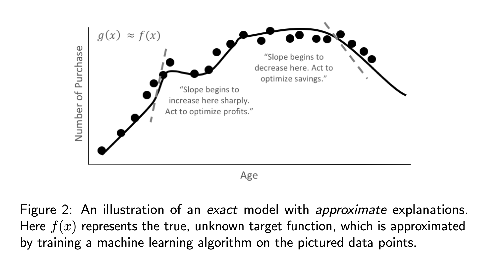


Moreover, the use of machine learning techniques for inferential or predictive purposes does not preclude using linear models for interpretation [8]. In fact, it is usually a heartening sign of stable and trustworthy results when two different predictive or inferential techniques produce similar results for the same problem.

### The Multiplicity of Good Models 

It is well understood that for the same set of input features and prediction targets, complex machine learning algorithms can produce multiple accurate models with very similar, but not the same, internal architectures [6]. This alone is an obstacle to interpretation, but when using these types of algorithms as interpretation tools or with interpretation tools, it is important to remember that details of explanations can change across multiple accurate models. This instability of explanations is a driving factor behind the presentation of multiple explanatory results in Driverless AI, enabling users to find explanatory information that is consistent across multiple modeling and interpretation techniques.

### From Explainable to Responsible AI

AI and Machine Learning are front and center in the news daily. The initial reaction to "explaining" or understanding a created model has been centered around the concept of **explainable AI**, which is the technology to understand and trust a model with advanced techniques such as Lime, Shapley, Disparate Impact Analysis, and more.  

H2O.ai has been innovating in the area of explainable AI for the last three years. However, it has become clear that **explainable AI** is not enough.  Companies, researchers, and regulators would agree that responsible AI encompasses not just the ability to understand and trust a model but includes the ability to address ethics in AI, regulation in AI, and the human side of how we move forward with AI; well, in a responsible way. 

### Responsibility in AI and Machine Learning

Explainability and interpretability in the machine learning space have grown tremendously since we first developed Driverless AI. With that in mind, it is important to frame the larger context in which our interpretability toolkit falls. It is worth noting that since H2O.ai developed this training, the push towards regulation, oversight, and ML model auditing has increased. As a result, **responsible AI** has become a critical requirement for firms looking to make artificial intelligence part of their operations. There have been many recent developments globally around responsible AI, and the following themes encompass such developments: fairness, transparency, explainability, interpretability, privacy, and security. As the field has evolved, many definitions and concepts have come into the mainstream; below, we outline H2O.ai's respective definitions and understanding around the factors that make up responsible AI:

<p align="center"> 
    </img>    
</p>

 - **Human-Centered ML**: user interactions with AI and ML systems.
 - **Compliance**: whether that’s with GDPR, CCPA, FCRA, ECOA, or other regulations, as an additional and crucial aspect of responsible AI.
 - **Ethical AI**: sociological fairness in machine learning predictions (i.e., whether one category of person is being weighted unequally).
 - **Secure AI**: debugging and deploying ML models with similar counter-measures against insider and cyber threats as seen in traditional software.
 - **Interpretable Machine Learning**: transparent model architectures and increasing how intuitive and understandable ML models can be.
 - **Explainable AI (XAI)**: the ability to explain a model to someone after it has been developed. 

By now, your experiment should be completed (if not, give it a bit more time). Let's look at how we can generate an MLI report after our experiment is complete. This report will give us access to global and local explanations for our machine learning models.


### References 

- [1] [Patrick Hall, Wen Phan, and Sri Satish Ambati. Ideas on interpreting machine learning. O’Reilly Ideas, 2017](https://www.oreilly.com/ideas/ideas-on-interpreting-machine-learning)
- [6] [Leo Breiman. Statistical modeling: The two cultures (with comments and a rejoinder by the author). Statistical Science, 16(3), 2001.](https://projecteuclid.org/euclid.ss/1009213726)
- [7] [Finale Doshi-Velez and Been Kim. Towards a rigorous science of interpretable machine learning. arXiV preprint, 2017](https://arxiv.org/abs/1702.08608)

### Deeper Dive and Resources

- [Hall, P., Gill, N., Kurka, M., Phan, W. (Jan 2019). Machine Learning Interpretability with H2O Driverless AI.](http://docs.h2o.ai/driverless-ai/latest-stable/docs/booklets/MLIBooklet.pdf)
- [On the Art and Science of Machine Learning Explanations](https://arxiv.org/abs/1810.02909)
- [An Introduction to Machine Learning Interpretability](https://www.oreilly.com/library/view/an-introduction-to/9781492033158/)
- [Testing machine learning explanation techniques](https://www.oreilly.com/ideas/testing-machine-learning-interpretability-techniques) 
- [Awesome Machine Learning Interpretability](https://github.com/jphall663/awesome-machine-learning-interpretability)
- [Concept References](https://www.h2o.ai/wp-content/uploads/2017/09/driverlessai/references.html)  
- [Using Artificial Intelligence and Algorithms](https://www.ftc.gov/news-events/blogs/business-blog/2020/04/using-artificial-intelligence-algorithms)
- [Artificial Intelligence (AI) in the Securities Industry1](https://www.finra.org/sites/default/files/2020-06/ai-report-061020.pdf)
- [MEMORANDUM FOR THE HEADS OF EXECUTIVE DEPARTMENTS AND AGENCIES:Guidance for Regulation of Artificial Intelligence Applications](https://www.whitehouse.gov/wp-content/uploads/2020/01/Draft-OMB-Memo-on-Regulation-of-AI-1-7-19.pdf)
- [MODEL ARTIFICIAL INTELLIGENCE GOVERNANCE FRAMEWORK SECOND EDITION](https://www.pdpc.gov.sg/-/media/files/pdpc/pdf-files/resource-for-organisation/ai/sgmodelaigovframework2.pdf)
- [General Data Protection Regulation GDPR](https://gdpr-info.eu)


## Task 3: Model Interpretations 

When your experiment finishes building, you should see the following dashboard:

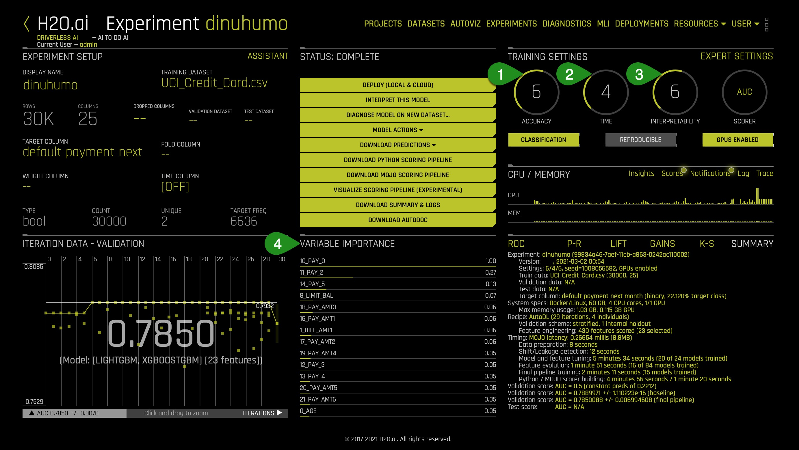

To generate the **MLI Report**, select the **Interpret this Model** option(in the complete status section):

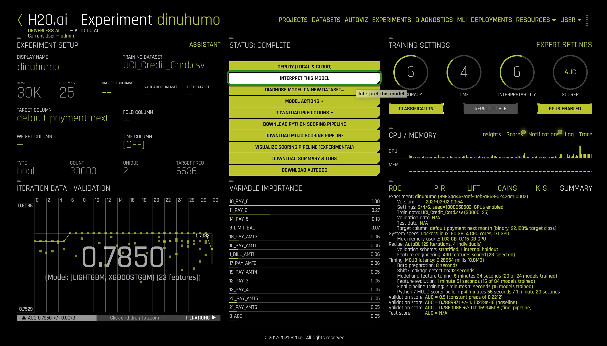

Once the **MLI report** is generated, the following will appear(you can know the report is ready when in the following button the value of **Running** and **Failed** equals 0: **x Running | x Failed | x Done**): 

- **Note**: The **MLI Report** section describes the various interpretations available from the Model Interpretation page (MLI) for non-time-series experiments.


With this task in mind, let's explore what techniques are available when understanding and interpreting your model. 

## Task 4: K-LIME

Let's begin our exploration by looking at the **Surrogate Models** tab. Click the **Surrogate Models** tab.

### Interpretations using Surrogate Models (Surrogate Model Tab)

A surrogate model is a data mining and engineering technique in which a generally simpler model is used to explain another, usually more complex, model or phenomenon. For example, the decision tree surrogate model is trained to predict the predictions of the more complex Driverless AI model using the original model inputs. The trained surrogate model enables a heuristic understanding (i.e., not a mathematically precise understanding) of the mechanisms of the highly complex and nonlinear Driverless AI model.

The Surrogate Model tab is organized into tiles for each interpretation method. To view a specific plot, click the tile for the plot that you want to view. For binary classification and regression experiments, this tab includes K-LIME/LIME-SUP and Decision Tree plots as well as Feature Importance, Partial Dependence, and LOCO plots for the Random Forest surrogate model.

The following is a list of the interpretation plots from Surrogate Models:

- K-LIME and LIME-SUP
- Random Forest Feature Importance
- Random Forest Partial Dependence and Individual Conditional 
- Expectation
- Random Forest LOCO
- Decision Tree
- NLP Surrogate

### K-LIME and LIME-SUP

The **Surrogate Model Tab**  includes a K-LIME (K local interpretable model-agnostic explanations) or LIME-SUP (Locally Interpretable Models and Effects based on Supervised Partitioning) graph. A K-LIME graph is available by default when you interpret a model from the experiment page. When you create a new interpretation, you can instead choose to use LIME-SUP as the LIME method. Note that these graphs are essentially the same, but the K-LIME/LIME-SUP distinction provides insight into the LIME method that was used during model interpretation. For our use case, we will use the K-LIME graph only but click [here](https://docs.h2o.ai/driverless-ai/latest-stable/docs/userguide/interpret-understanding.html#the-lime-sup-technique) to learn more about the **LIME-SUP Technique**. 

### The K-LIME Technique

This plot is available for binary classification and regression models.

K-LIME is a variant of the LIME technique proposed by Ribeiro at al (2016). K-LIME generates global and local explanations that increase the transparency of the Driverless AI model, and allow model behavior to be validated and debugged by analyzing the provided plots, and comparing global and local explanations to one-another, to known standards, to domain knowledge, and to reasonable expectations.

K-LIME creates one global surrogate generalized linear model (GLM) on the entire training data and also creates numerous local surrogate GLMs on samples formed from k-means clusters in the training data. The features used for k-means are selected from the Random Forest surrogate model’s variable importance. The number of features used for k-means is the minimum of the top 25% of variables from the Random Forest surrogate model’s variable importance and the max number of variables that can be used for k-means.(Note, if the number of features in the dataset are less than or equal to 6, then all features are used for k-means clustering.) All penalized GLM surrogates are trained to model the predictions of the Driverless AI model. The number of clusters for local explanations is chosen by a grid search in which the 𝑅^2
between the Driverless AI model predictions and all of the local K-LIME model predictions is maximized. The global and local linear model’s intercepts, coefficients, 𝑅^2 values, accuracy, and predictions can all be used to debug and develop explanations for the Driverless AI model’s behavior.

The parameters of the global K-LIME model give an indication of overall linear feature importance and the overall average direction in which an input variable influences the Driverless AI model predictions. The global model is also used to generate explanations for very small clusters (𝑁<20) where fitting a local linear model is inappropriate.

The in-cluster linear model parameters can be used to profile the local region, to give an average description of the important variables in the local region, and to understand the average direction in which an input variable affects the Driverless AI model predictions. For a point within a cluster, the sum of the local linear model intercept and the products of each coefficient with their respective input variable value are the K-LIME prediction. By disaggregating the K-LIME predictions into individual coefficient and input variable value products, the local linear impact of the variable can be determined. This product is sometimes referred to as a reason code and is used to create explanations for the Driverless AI model’s behavior.

In the following example, reason codes are created by evaluating and disaggregating a local linear model.

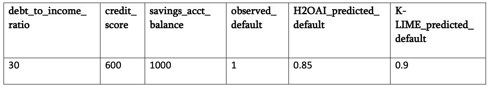

And the local linear model:

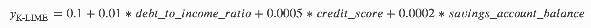

It can be seen that the local linear contributions for each variable are:

- debt_to_income_ratio: 0.01 * 30 = 0.3
- credit_score: 0.0005 * 600 = 0.3
- savings_acct_balance: 0.0002 * 1000 = 0.2


Each local contribution is positive and thus contributes positively to the Driverless AI model’s prediction of 0.85 for H2OAI_predicted_default. By taking into consideration the value of each contribution, reason codes for the Driverless AI decision can be derived. debt_to_income_ratio and credit_score would be the two largest negative reason codes, followed by savings_acct_balance.

The local linear model intercept and the products of each coefficient and corresponding value sum to the K-LIME prediction. Moreover it can be seen that these linear explanations are reasonably representative of the nonlinear model’s behavior for this individual because the K-LIME predictions are within 5.5% of the Driverless AI model prediction. This information is encoded into English language rules which can be viewed by clicking the Explanations button (we will explore in a bit how we can access this reason codes).

Like all LIME explanations based on linear models, the local explanations are linear in nature and are offsets from the baseline prediction, or intercept, which represents the average of the penalized linear model residuals. Of course, linear approximations to complex non-linear response functions will not always create suitable explanations and users are urged to check the K-LIME plot, the local model 𝑅^2, and the accuracy of the K-LIME prediction to understand the validity of the K-LIME local explanations. When K-LIME accuracy for a given point or set of points is quite low, this can be an indication of extremely nonlinear behavior or the presence of strong or high-degree interactions in this local region of the Driverless AI response function. In cases where K-LIME linear models are not fitting the Driverless AI model well, nonlinear LOCO feature importance values may be a better explanatory tool for local model behavior. As K-LIME local explanations rely on the creation of k-means clusters, extremely wide input data or strong correlation between input variables may also degrade the quality of K-LIME local explanations.


### The Global Interpretable Model Explanation Plot


To access the **Global Interpretable Model Explanation Plot** click the **K-LIME** tile, the following will appear: 

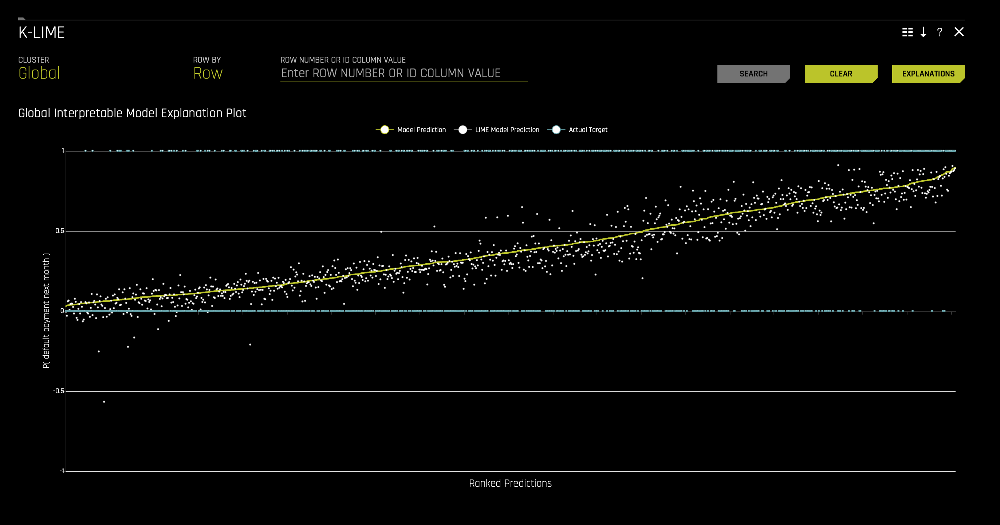

This plot shows Driverless AI model predictions and LIME model predictions in sorted order by the Driverless AI model predictions. This graph is interactive. Hover over the Model Prediction, LIME Model Prediction, or Actual Target radio buttons to magnify the selected predictions. Or click those radio buttons to disable the view in the graph. You can also hover over any point in the graph to view LIME reason codes for that value. By default, this plot shows information for the global LIME model, but you can change the plot view to show local results from a specific cluster. The LIME plot also provides a visual indication of the linearity of the Driverless AI model and the trustworthiness of the LIME explanations. The closer the local linear model approximates the Driverless AI model predictions, the more linear the Driverless AI model and the more accurate the explanation generated by the LIME local linear models. In a moment, we will use this plot for our use case. 


### MLI Taxonomy: K-LIME

- **Scope of Interpretability** - K-LIME provides several different scales of interpretability: (1) coefficients of the global GLM surrogate provide information about global, average trends, (2) coefficients of in-segment GLM surrogates display average trends in local regions, and (3) when evaluated for specific in-segment observations, K-LIME provides reason codes on a per-observation basis.
- **Appropriate Response Function Complexity** - (1) K-LIME can create explanations for machine learning models of high complexity. (2) K- LIME accuracy can decrease when the Driverless AI model becomes too nonlinear.
- **Understanding and Trust** - (1) K-LIME increases transparency by re-vealing important input features and their linear trends. (2) K-LIME enhances accountability by creating explanations for each observation in a dataset. (3) K-LIME bolsters trust and fairness when the important features and their linear trends around specific records conform to human domain knowledge and reasonable expectations.
- **Application Domain** - K-LIME is model agnostic.


### Use Case: Default 

The K-LIME plot above shows the Driverless AI model predictions as a continuous curve starting on the lower left and ending in the upper right(1). The K-LIME model predictions are the discontinuous points around the Driverless AI model predictions(2).  

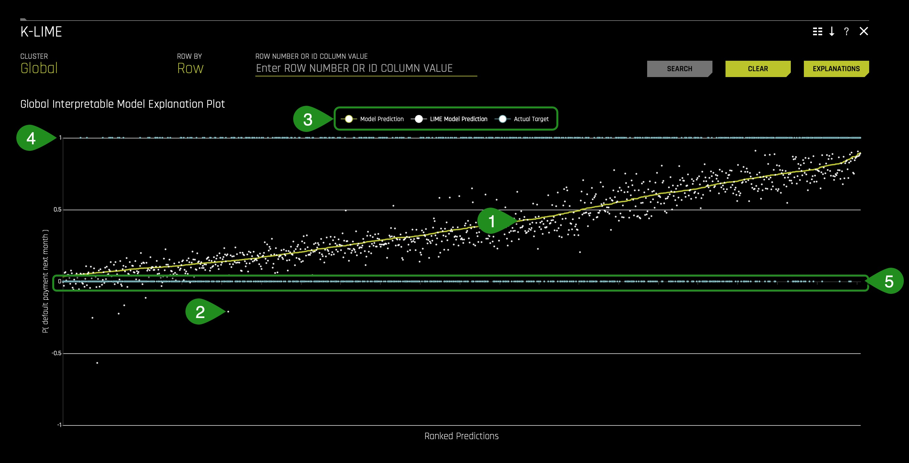

The radio buttons(3) on the top middle part of the plot allow you to enable or disable the **Model Prediction**, **LIME Model Prediction**, and **Actual Target**. For example, if you click the **Model Prediciton** radio button, it will remove the yellow curve line: **the Driverless AI model predictions**. 

Note that **Actual Target**(default.payment.next.month) refers to the two blue horizontal lines: (4) clients that defaulted on their next month payment(PAY_7): **1** and (5) clients that didn't default on their next month payment(PAY_7): **0**.

- **Note**: default.payment.next.month - Default (1: Yes, 0: No)

Considering the global explanations in the below image, we can also see that the K-LIME predictions generally follow the Driverless AI model’s predictions, and the global K-LIME model explains 93.37% of the variability in the Driverless AI model predictions, indicating that global explanations are approximate, but reasonably so. 

- **Note** the low **RMSE**(root-mean-square deviation); this value of **0.053**. Therefore, we can say that the data points are not that far from the regression line. The data points are well concentrated around the line of best fit. 

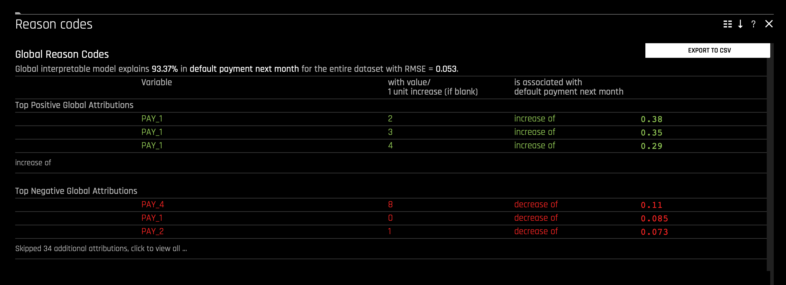

The below above presents global explanations for the Driverless AI mode. The explanations proved a linear understanding of input features and the outcome, *default.payment.next.month*, in plain English. According to the reason codes, **PAY_1** makes the largest global, linear contributions to the Driverless AI model. As well, **PAY_2** makes a large top negative global contribution. 

- When **PAY_1 = 2**, this is associated with **"default.payment.next.month"** K-LIME prediction's increase by **0.38**(38%)
- When **PAY_1 = 0**, this is associated with **"default.payment.next.month"** K-LIME prediction's decrease of **0.085**(8.5%)

Now let's see if the global explanations still hold at the local level. Let's observe a particular discontinuous point around the Driverless AI model predictions. In your plot, click any high probability default point (top left corner). In our case, we have selected point **11427** and we  can observe the following: 


We can see that the **LIME Prediction** is very similar to the **Model Prediction** while knowing that the **Actual Target** is 1. When looking at the reason codes, we can see that **PAY_1** was the leading feature for a high value among the LIME and Model prediction. Let's further understand these reasons codes; click on the explanations (top right corner of the tile). The following will appear: 


When observing the reason codes for the data point **11427**, we can see that the **LIME Prediction Accuracy** is 98.8%; in other words, we can conclude that this prediction is relatively trustworthy. As well, we are also able to see that **PAY_1** was around the top three features contributing to a high default prediction. In particular, **PAY_1** is the top feature contributing to a high prediction of 38%. In this case, the global reason codes are validated by this local observation. Therefore, so far, it seems that being late two months on **PAY_1** leads to a 38% increase in most likely to default on PAY_7(default.payment.next.month).


Using the global versus local analysis motif to reason about the example analysis results thus far, it could be seen as a sign of explanatory stability that several globally important features are also appearing as locally important.

Now let's focus our attention on using certain **Feature Importance** charts to understand this global and local analysis motif. 


## Task 5: Feature Importance 

### Global Feature Importance vs Local Feature Importance

Feature importance measures the effect that a feature has on the predictions of a model. Global feature importance measures the overall impact of an input feature on the Driverless AI model predictions while taking nonlinearity and interactions into consideration. Global feature importance values give an indication of the magnitude of a feature’s contribution to model predictions for all observations. Unlike regression parameters, they are often unsigned and typically not directly related to the numerical predictions of the model. Local feature importance describes how the combination of the learned model rules or parameters and an individual observation’s attributes affect a model’s prediction for that observation while taking nonlinearity and interactions into effect.


### Random Forest Feature Importance

You can access a **Random Forest(RF) Feature Importance** chart on the MLI report page. Click the **Surrogate Models** tab and click the tile with the following title: **RF Feature Importance**. When the chart appears, it will not have the grey bars(local features); it will only display the yellow bars (global features). To explain this chart effectively, enter the following number in the chart's search bar (top left of the tile): **11427**. This will allow for the grey bars to appear for a given observation(data point 11427). 


The chart can be explained as follows: 

Global feature importance (yellow) is a measure of the contribution of an input variable to the overall predictions of the Driverless AI model. Global feature importance is calculated by aggregating the improvement in splitting criterion caused by a single variable across all of the decision trees in the Driverless AI model.

Local feature importance (grey) is a measure of the contribution of an input variable to a single prediction of the Driverless AI model. Local feature importance is calculated by removing the contribution of a variable from every decision tree in the Driverless AI model and measuring the difference between the prediction with and without the variable.

Both global and local variable importance are scaled so that the largest contributor has a value of 1.


### LOCO Feature Importance 

You can access a **Random Forest(RF) leave-one-covariate-out**  chart on the MLI report page. Click the **Surrogate Models** tab and click the tile with the following title: **RF LOCO**. The following will appear:


This plot is available for binary and multinomial classification models as well as regression models.

Local feature importance describes how the combination of the learned model rules or parameters and an individual row’s attributes affect a model’s prediction for that row while taking nonlinearity and interactions into effect. Local feature importance values reported in this plot are based on a variant of the leave-one-covariate-out (LOCO) method (Lei et al, 2017).

The LOCO-variant method for binary and regression models calculates each local feature importance by re-scoring the trained Driverless AI model for each feature in the row of interest, while removing the contribution to the model prediction of splitting rules that contain that feature throughout the ensemble. The original prediction is then subtracted from this modified prediction to find the raw, signed importance for the feature. All local feature importance values for the row are then scaled between 0 and 1 for direct comparison with global feature importance values.

The LOCO-variant method for multinomial models differs slightly in that it calculates row-wise local feature importance values by re-scoring the trained supervised model and measuring the impact of setting each variable to missing. The sum of the absolute value of differences across classes is then calculated for each dropped or replaced column.

### MLI Taxonomy: Feature Importance

- **Scope of Interpretability** - (1) Random forest feature importance is a global interpretability measure. (2) LOCO feature importance is a local interpretability measure.
- **Appropriate Response Function Complexity** - Both random forest and LOCO feature importance can be used to explain tree-based response functions of nearly any complexity.
- **Understanding and Trust** - (1) Random forest feature importance in- creases transparency by reporting and ranking influential input features.(2) LOCO feature importance enhances accountability by creating ex- planations for each model prediction. (3) Both global and local feature importance enhance trust and fairness when reported values conform to human domain knowledge and reasonable expectations.
- **Application Domain** - (1) Random forest feature importance is a model- specific explanatory technique. (2) LOCO is a model-agnostic concept, but its implementation in Driverless AI is model specific.

### Use Case: Default 

On the **RF Feature Importance** chart, click on the **Clear** button located on the tile's top right corner. That will clear the chart and will only display the global features (yellow). You should see the following: 


The features with the greatest importance values in the Driverless AI model are **PAY_1**, **PAY_2**, and **PAY_3** as observed in the image above. Here, we can see **PAY_1** as the most influential predictor on whether someone will default. As we read down, we see that recent payments don't have a huge impact on prediction when compared to the first payment. If we consider that being late two months on your first payment is bad, we can conclude that this model's predictions solely in a matter of speaking depend heavily on this notion of being two months late on **PAY_0**. 

The rf feature importance chart matches hypotheses created during data exploration to a large extent. Feature importance, however, does not explain the relationship between a feature and the Driverless AI model's predictions. This is where we can examine partial dependence plots. 


## Task 6: Partial Dependence and Individual Conditional Expectation (ICE)

A Partial Dependence and ICE plot is available for both Driverless AI and surrogate models.

### Partial Dependece 

The Partial Dependence Technique:

Partial dependence is a measure of the average model prediction with respect to an input variable. Partial dependence plots display how machine-learned response functions change based on the values of an input variable of interest while taking nonlinearity into consideration and averaging out the effects of all other input variables. Partial dependence plots are described in the Elements of Statistical Learning (Hastie et al, 2001). Partial dependence plots enable increased transparency in Driverless AI models and the ability to validate and debug Driverless AI models by comparing a variable’s average predictions across its domain to known standards, domain knowledge, and reasonable expectations.


### Individual Conditional Expectation (ICE)

The ICE Technique:

This plot is available for binary classification and regression models.

A newer adaptation of partial dependence plots called Individual conditional expectation (ICE) plots can be used to create more localized explanations for a single individual by using the same basic ideas as partial dependence plots. ICE Plots were described by Goldstein et al (2015). ICE values are disaggregated partial dependence, but ICE is also a type of nonlinear sensitivity analysis in which the model predictions for a single row are measured while a variable of interest is varied over its domain. ICE plots enable a user to determine whether the model’s treatment of an individual row of data is outside one standard deviation from the average model behavior, whether the treatment of a specific row is valid in comparison to average model behavior, known standards, domain knowledge, and reasonable expectations, and how a model will behave in hypothetical situations where one variable in a selected row is varied across its domain.

**Note**: Large differences in partial dependence and ICE are an indication that strong variable interactions may be present.

### The Partial Dependence Plot

This plot is available for binary classification and regression models.

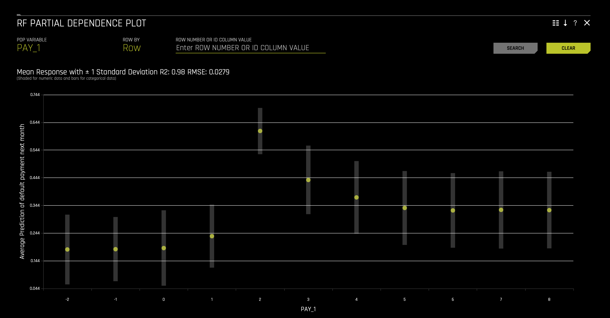

Overlaying ICE plots onto partial dependence plots allow the comparison of the Driverless AI model’s treatment of certain examples or individuals to the model’s average predictions over the domain of an input variable of interest.

This plot shows the partial dependence when a variable is selected and the ICE values when a specific row is selected. Users may select a point on the graph to see the specific value at that point. Partial dependence (yellow) portrays the average prediction behavior of the Driverless AI model across the domain of an input variable along with +/- 1 standard deviation bands. ICE (grey) displays the prediction behavior for an individual row of data when an input variable is toggled across its domain. Currently, partial dependence and ICE plots are only available for the top ten most important original input variables. Categorical variables with 20 or more unique values are never included in these plots.

### MLI Taxonomy: Partial Dependence and ICE

- **Scope of Interpretability**: (1) Partial dependence is a global interpretability measure. (2) ICE is a local interpretability measure. 
- **Appropriate Response Function Complexity** - Partial dependence and ICE can be used to explain response functions of nearly any complexity. 
- **Understanding and Trust** - (1) Partial dependence and ICE increase understanding and by describing the nonlinear behavior of complex response functions. (2) Partial dependence and ICE enhance trust, accountability, and fairness by enabling the comparison of described nonlinear behavior to human domain knowledge and reasonable expectations. (3) ICE, as a type of sensitivity analysis, can also engender trust when model behavior on simulated data is acceptable. 
- **Application Domain** - Partial dependence and ICE are model-agnostic. 


### Use Case: Default

In the **Surrogate Model** tab, click on the **RF Partial Dependence Plot** click the **Surrogate Model** tab. The following will appear: 

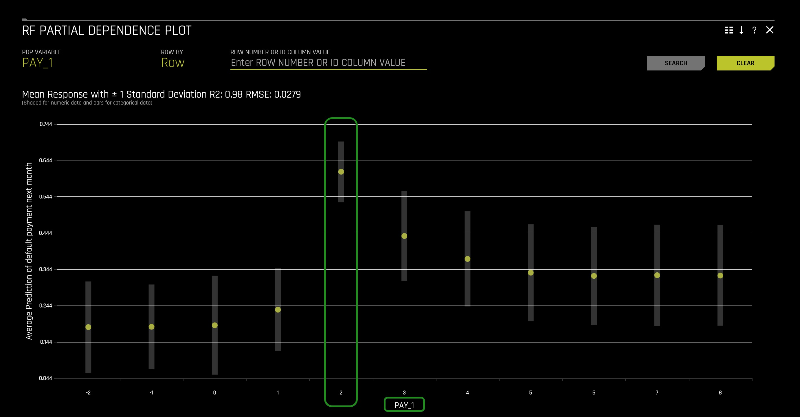

The partial dependence plots show how different feature values affect the average prediction of the Driverless AI model. The image above displays the partial dependence plot for **PAY_1** and indicates that predicted **default(default.payment.next.month)** increases dramatically for clients two months late on **PAY_1**.

------


The recent tasks have focused on the model’s global behavior for the entire dataset, but how does the model behave for a single person? A great but complex tool for this is K-Lime.

1\. Under **Surrogate Models** select **K-LIME**:


2\. On the green highlighted area of the K-LIME Plot, click on **Model Prediction**, **LIME Model Prediction**, then **Actual Target**. The K-LIME plot should look similar to the image below:


3\. On the green highlighted area of the K-LIME Plot, click on **Model Prediction**, **LIME Model Prediction**, then **Actual Target**. The K-LIME plot should look similar to the image below:

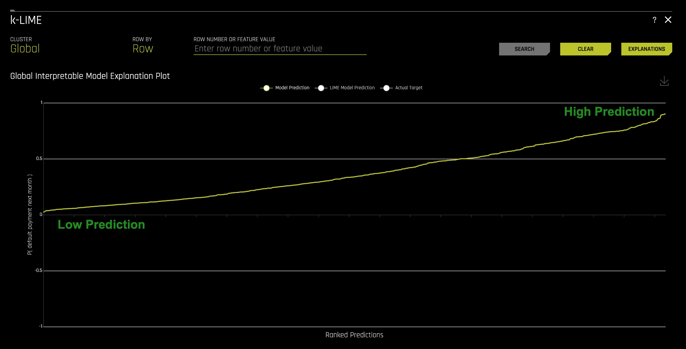

*Things to note*:

This plot is the predictions of the Driverless AI model from lowest to highest. The x-axis is the index of the rows that causes that ranking to occur from lowest to highest.

4\. Add **Actual Target** by clicking on it, and the plot should look similar to the one below:

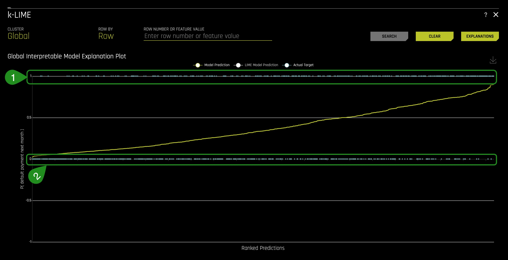

*Things to Note:*

1. People who did not pay their bills on time.
2. People who paid their bills on time.

Adding the **Actual Target** to the plot allows us to check if the model is not entirely wrong. The plot's density (2: bottom left) near the low ranked predictions show that many people made their payments on time while those in line (1: top left) had missed payments since the line is scattered. Towards the high ranked predictions, the density of line (1: top right) shows the high likelihood of missing payments while the sparseness of line (2: botto right) shows those who have stopped making payments. These observations are a good sanity check. 

5\. Now, click on **LIME Model Prediction**:


*Things to Note:*

1. The global interpretable model explains 89.39% in default payment next month for the entire dataset with RMSE = 0.065. 

This single linear model trained on the original input of the system to predict the original Driverless AI model's predictions shows that the original model predictions are highly linear. The plot above is an implementation of LIME or "Local Interpretable Model Agnostic Explanations," wherein we aim to fit a simple linear model to a more complex machine learning model.

**K-LIME Advance Features**

6\. On the K-LIME plot, change the Cluster to Cluster 13.

7\. Select another high probability default person from this K-LIME cluster by clicking on one of the white points on the plot's top-right section.

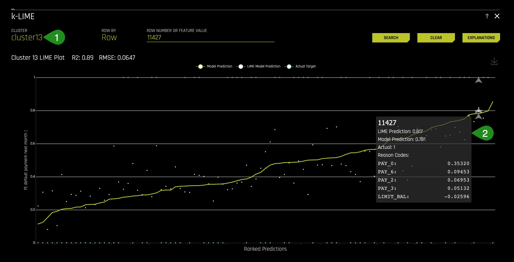

1. Change cluster to cluster 13 and note the R2 value is still very high.
2. Pick a point on the top-right section of the plot and Examine the Reason Codes.

The local model predictions (white points) can be used to reason through the Driverless AI model (yellow) in some local regions.

8\. Review **Explanations** on the **K-LIME** plot:


*Things to Note:*

1. The reason codes show that the Driverless model prediction gave this person a .78 percent probability of default. LIME gave them a .82 percent probability of default, and in this case, we can say that LIME is 95.1% accurate. Based on this observation, it can be concluded that the local reason codes are fairly trustworthy. Suppose **Lime Prediction Accuracy** drops below 75%. In that case, we can say that the numbers are probably untrustworthy, and the Shapley plot or LOCO plot should be revisited since the Shapley values are always accurate, and LOCO accounts for nonlinearity and interactions.

2. **PAY_0 = 2** months late is the top positive local attribute for this person and contributes .35 probability points to their prediction according to this linear model. 0.35 is the local linear model coefficient for level 3 of the categorical variable PAY_0.

3. **Cluster 13** reason codes show the average linear trends in the data region around this person. 

Note: Global reason codes show the average linear trends in the dataset as a whole.

In conclusion, LIME values are an approximate estimate of the trend of how the model is behaving in a local region for a specific point. Further, reason codes help us describe why the model made its decision for this specific person. Reason codes are essential in highly regulated industries when regulators will want to see in simple terms “how did the model come to the conclusion it did.”

### Deeper Dive and Resources

- [H2O K-LIME](https://www.h2o.ai/wp-content/uploads/2017/09/driverlessai/interpreting.html?highlight=feature%20importance#k-lime) 

- [H2O Viewing Explanations](https://www.h2o.ai/wp-content/uploads/2017/09/driverlessai/viewing-explanations.html) 


## Task 3: Global Shapley Values and Feature Importance

### Global Shapley Values and Feature Importance Concepts

Shapley values are one of the most powerful explainability metrics. Global Shapley values are the average of the local Shapley values over every row of a dataset. Feature importance measures the effect that a feature has on the predictions of a model. Global feature importance measures an input feature's overall impact on the Driverless AI model predictions while taking nonlinearity and interactions into consideration. 

Note: Shapley Values 

**Definition:** Shapley values are used to define the importance of a single variable to a specific model versus the importance of that variable at the global level. Note, this is available for original features and transformed features in DAI.

**Business Case:** In some models, we discover features are being overweighted versus their relative weighting at the global level.

### Shapley and Feature Importance Plots

1. In the center of the MLI landing page, select **Transformed Shapley**.

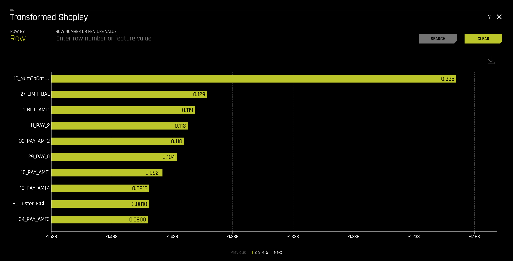

The plot above is a sample of a Shapley plot. Shapley is an “old,” very advanced tool, now being applied to machine learning. This plot shows the global importance value of the derived features. Notice the feature importance values are signed. The sign determines in which direction the values impact the model predictions on average. Shapley plots help by providing accurate and consistent variable importance even if data changes slightly.
 
Viewing the Global Shapley values plot is an excellent place to start because it provides a global view of feature importance, and we can see which features are driving the model from an overall perspective. 

Derived features can be challenging to understand. For that reason, it also helps to look at this complex system from the space of the original inputs, and surrogate models allow us to do this.

2. Click on **Surrogate Models:**, then click **Random Forest Feature Importance:**


The **Feature Importance** plot, ranks the original features. These features are the original drivers of the model in the original feature space. These values were calculated by building  a **Random Forest** between the original features and the predictions of the complex driverless AI model that was just trained. 

3. View the **Surrogate Model**, **Random Forest**:


This single **Random Forest** model of a complex Driverless AI model is very helpful because we can see that this is a trustworthy model between the original inputs to the system and the system's predictions. We assure the model's trustworthiness when we see the low mean squared error(0.0384) and high R2 (96%). 

4. Go back to the Shapley plot and find the feature importance of LIMIT_BAL. How important was LIMIT_BAL in the global feature importance space? Was LIMIT_BAL the main driver in this space?

5. Look for LIMIT_BAL in the **Feature Importance** under **Surrogate Models**. How important was LIMIT_BAL in the original feature importance space? Was LIMIT_BAL the main driver in this space?

### Deeper Dive and Resources

- [Global and Local Variable Importance](https://www.h2o.ai/wp-content/uploads/2017/09/driverlessai/interpreting.html#global-and-local-variable-importance)


## Task 4: Partial Dependence Plot

### Partial Dependence Concepts

Partial dependence is a measure of the average model prediction with respect to an input variable. In other words, the average prediction of the model with respect to the values of a given variable. Partial dependence plots display how machine-learned response functions change based on the values of an input variable of interest while considering nonlinearity and averaging out the effects of all other input variables. 

Partial dependence plots are well-known and described in the Elements of Statistical Learning (Hastie et al., 2001). Partial dependence plots enable increased transparency in Driverless AI models and the ability to validate and debug Driverless AI models by comparing a variable’s average predictions across its domain to known standards, domain knowledge, and reasonable expectations.

Note: Partial Dependence Plot 

**Definition:** Partial Dependence Plots are used to show how much impact on the prediction a single variable has on average.

**Business Case:**  Partial Dependence Plots can highlight on average how big of an impact a given variable has on the target column. For example, Partial Dependence Plots can help us see the average impact the Marital status variable has on the **default.payment.next.month** target column. 

### Partial Dependence Plot

Through the **Shapley Values** and **Feature Importance**, we got a global perspective of the model. We will now explore the global behavior of the features concerning the model; this is done by using the Partial Dependency Plot. 

1\. Select **Surrogate Models**, **Random Forest** then **Partial Dependecy Plot**

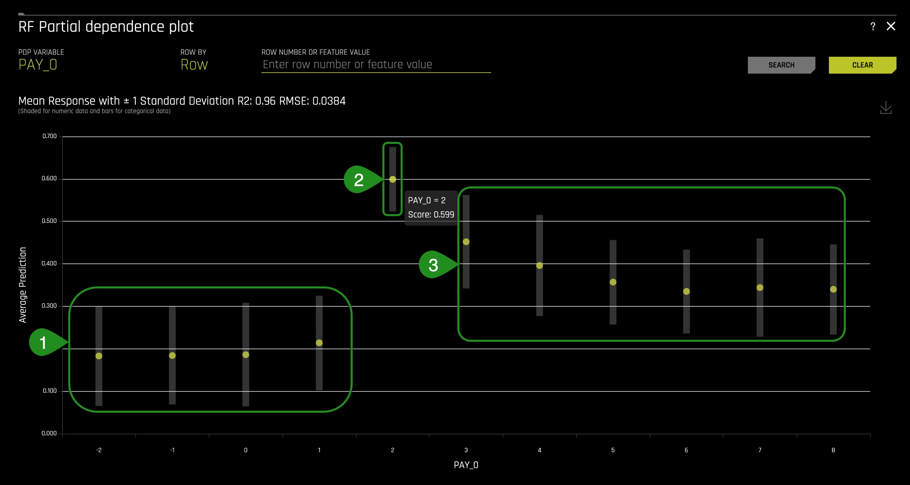

*Things to note:*

1. These values of **PAY_0** represent the average predictions of all persons that paid on time or did not use their credit card. 
2. This value represents the average prediction of persons who were late one month for **PAY_0**.
3. **PAY_0 = 2** has an average default probability of **0.599** approximately, and then the default probability slowly drops to month 8. 

The results indicate that overall, in the entire dataset, the worst thing for a person to be in regarding defaulting with respect to **PAY_0** is to be two months late. This behavior insight needs to be judged by the user, who can determine whether this model should be trusted.

5. an excellent question to ask here is, is it worse to be two months late than being eight months late on your credit card bill?

6. Explore the partial dependence for **Pay_2** by changing the **PDP Variable** at the upper-left side of the **Partial Dependence Plot** to **Pay_2**.

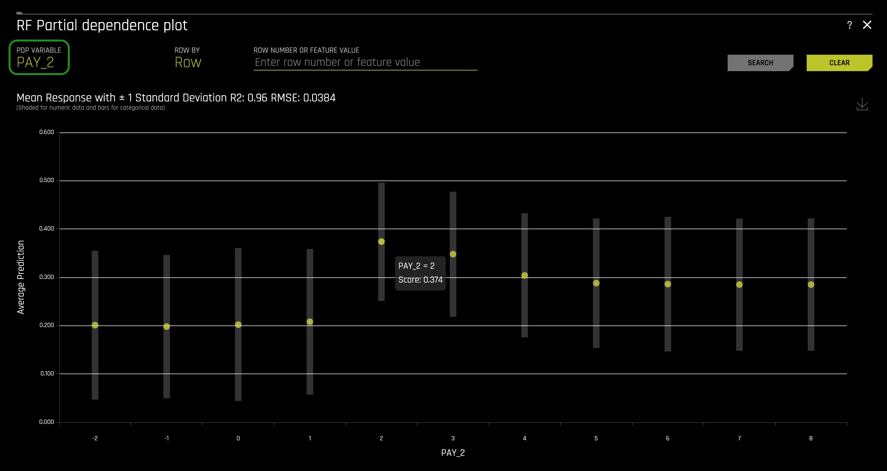

7.  What is the average predicted default probability for PAY_2 = 2?

8. Explore the partial dependence for **LIMIT_BAL** by changing the **PDP Variable** at the upper-left side of the **Partial Dependence Plot** to **LIMIT_BAL**, then hover over the yellow circles. 

The grey area is the standard deviation of the partial dependence. The wider the standard deviation, the less trustworthy the average behavior is. In this case, the standard deviation follows the average behavior and is narrow enough, therefore trustworthy.

9. What is the average default probability for the lowest credit limit? How about for the highest credit limit?

10. What seems to be the trend regarding credit limit and a person defaulting on their payments?


### Deeper Dive and Resources

- [H2O Partial Dependency Plot](https://www.h2o.ai/wp-content/uploads/2017/09/driverlessai/interpreting.html?highlight=feature%20importance#partial-dependence-and-individual-conditional-expectation-ice)


## Task 5: Decision Tree Surrogate

### Decision Tree Surrogate Concepts 

- **Scope of Interpretability:** Generally, decision tree surrogates provide global interpretability. A decision tree's attributes are used to explain global attributes of a complex Driverless AI model, such as important features, interactions, and decision processes.

- **Appropriate Response Function Complexity:** Decision tree surrogate models can create explanations for models of nearly any complexity.

- **Understanding and Trust:** Decision tree surrogate models foster understanding and transparency because they provide insight into complex models' internal mechanisms. They enhance trust, accountability, and fairness when their important features, interactions, and decision paths align with human domain knowledge and reasonable expectations.

- **Application Domain:** Decision tree surrogate models are model agnostic.

### Decision Tree 

Now we are going to gain some insights into interactions. There are two ways in Driverless AI to do this; one of them is by making use of the **Decision Tree**. A **Decision Tree** is another surrogate model.

1\. Select **Surrogate Models**,  then **Decision Tree**

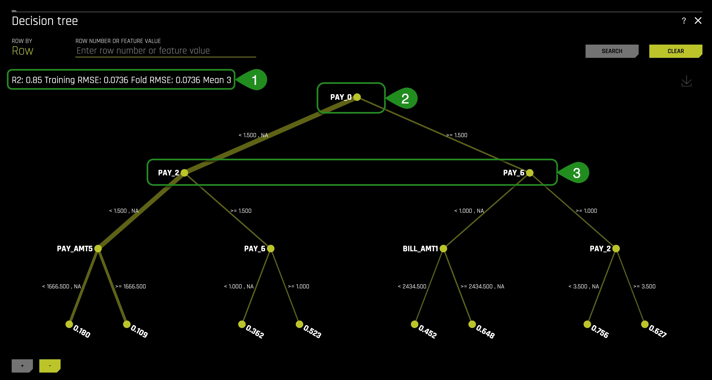


*Things to Note:*

1. The RMSE value is low, and the R2 value is fairly high

2. The values at the top of the **Decision Tree** are higher importance variables. 

Variables below one-another in the **Decision Tree Surrogate** may also have strong interactions in the Driverless AI model.

Based on the low RMSE and the fairly high R2, it can be concluded that this is a somewhat trustworthy surrogate model. This single decision tree provides an approximate overall flow chart of the complex model’s behavior.

3. What are the most important variables in the **Decision Tree**? How do those variables compare to the previous plots we have analyzed?

A potential interaction happens when a variable is below another variable in the decision tree. In the image below, a possible interaction is observed between variables **PAY_0** and **PAY_2**. 


*Things to Note:*

1. Potential interaction between **PAY_0** and **PAY_2**: this observation can be strengthened by looking at the Shapley Plot and locating any **PAY_0** and **PAY_2** interactions.

2. The thickness of the yellow line indicates that this is the most common path through the decision tree. This path is the lowest probability of default leaf node. 

3. Variables in a Decision Tree connected by a line might suggest a possible connection that impacts predictions.

It can be observed from the **Decision Tree** that most people tend to pay their bills on time based on the thickness of the path highlighted with green arrows. The people in the highlighted path are those with the lowest default probability. This low default probability path on the **Decision Tree** is an approximation to how the complex model would place people in a low default probability “bucket.” 

The path to a low default probability can be confirmed by looking at the **Partial Dependency** plots for both **PAY_0** and **PAY_2** from earlier. Both plots confirm the low default probability before month two. 


It is important to note that what we are confirming is not whether the model's results are "correct" rather how the model is behaving. The model needs to be analyzed, and decisions need to be made about whether or not the model's behavior is correct.

Task 5 summary:

- Examined how the variables interacted through the **Decision Tree**. 

- Observed the average behavior with respect to the model prediction by examining the partial dependence. 


### Deeper Dive and Resources

- [H2O Decision Tree Surrogate Model ](https://www.h2o.ai/wp-content/uploads/2017/09/driverlessai/interpreting.html?highlight=feature%20importance#decision-tree-surrogate-model)

## Task 6: K-LIME

### K-LIME Concepts


**Definition:** LIME is an explainability method that makes minor adjustments to the data sample to see how it impacts the predictions.

**Business Case:** LIME enables data scientists to understand how sensitive their model is to changes in the data set or sample.

K-LIME is a variant of the LIME technique. K-LIME generates global and local explanations that increase the Driverless AI model's transparency and allow model behavior to be validated and debugged by analyzing the provided plots. The generated explanations also allow for a comparison between global and local explanations to one another, to known standards, domain knowledge, and reasonable expectations.

- **Scope of Interpretability:** K-LIME provides several different scales of interpretability: 
	- (1) coefficients of the global GLM surrogate give information on 				
		global and average trends, 

  - (2) coefficients of in-segment GLM surrogates display average 		
		trends in local regions, and 

  - (3) when evaluated for specific in-segment observations, K-LIME 				provides reason codes on a pre-observation basis.

- **Appropriate Response Function Complexity:** 

	- (1) K-LIME can create explanations for machine learning models of high complexity. 

  - (2) K-LIME accuracy can decrease when the Driverless AI model becomes too nonlinear.

- **Understanding and Trust:** 

	- (1) K-LIME increases transparency by revealing important input features and their linear trends. 

	- (2) K-LIME enhances accountability by creating explanations for each observation in a dataset. 

	- (3) K-LIME bolsters trust and fairness when the important features and their linear trends around specific records conform to human domain knowledge and reasonable expectations.

- Application Domain: K-LIME is model agnostic.


## Task 7: Local Shapley and LOCO
 
### Local Shapley Concepts

Shapley explanations are a technique with credible theoretical support that presents consistent global and local variable contributions. Local numeric Shapley values are calculated by repeatedly tracing single rows of data through a trained tree ensemble and aggregating each input variable's contribution as the row of data moves through the trained ensemble.

Shapley values sum to the Driverless AI model's prediction before applying the link function, or any regression transforms. (Global Shapley values are the average of the local Shapley values over every row of a data set.)

### LOCO Concepts

Local feature importance describes how combining the learned model rules or parameters and an individual row's attributes affect a model's prediction for that row while taking nonlinearity and interactions into effect. Local feature importance values reported here are based on a variant of the leave-one-covariate-out (LOCO) method (Lei et al., 2017).

In the LOCO-variant method, each local feature importance is found by re-scoring the trained Driverless AI model for each feature in the row of interest while removing the contribution to splitting the model prediction rules that contain that feature throughout the ensemble. The original prediction is then subtracted from this modified prediction to find the raw, signed importance for the feature. All local feature importance values for the row can be scaled between 0 and 1 for direct comparison with global feature importance values.

### Local Shapley Plot

Local Shapley Plots can generate variable contribution values for every row that the model predicts. In other words, we can generate for every person in our dataset the exact numeric contribution of each of the variables for each prediction of the model. For the **Local Shapley** plots, the yellow bars stay the same since they contribute to the global variable. However, the grey bars will change when a different row or person is selected from the dataset using the **row selection dialog box** or by clicking on an individual in the K-LIME plot.

The grey bars or local numeric contributions can be used to generate reason codes. The reason codes should be suitable for regulated industries where modeling decisions need to be justified. For our dataset, we can select a person with a high default probability, select Shapley Local plot, and pick out the largest grey bars as the most significant contributors to defaulting.  

1\. Select a high probability default person on the K-LIME plot by clicking on one of the white points in the plot's top-right corner.

2\. Then under the **Driverless AI Model**, select **Shapley**.


**Note:** The Shapley plot will depend on the K-LIME point you selected.

*Things to Note:*

1. Row number being observed
2. Global Shapley value 
3. A sample of a Shapley Local numeric contribution of a variable for the high probability person in row 11427

3\. Pick another high probability person on the **K-LIME** plot and return to the **Shapley** plot and determine what local Shapley values have influenced the person you selected from defaulting (look for the largest grey bars)?

4\. How do those Shapley local values compare to their perspective Shapley Global values? Are the local Shapley values leaning towards defaulting even though the Shapley global values are leaning towards not defaulting? How do the local Shapley values compare to the local K-LIME values?

In conclusion, Shapley's local variables are locally accurate and globally consistent. If the dataset changes slightly, the variable importance can be expected to not reshuffle. Shapley local values should be good enough to create reason codes. Shapley values operate on the trained model itself and are more exact than surrogate models, which are more approximate. 

## Task 8: Putting it All Together and ICE
 
### The ICE Technique

Individual conditional expectation (ICE) plots, a newer and less well-known adaptation of partial dependence plots, can be used to create more localized explanations for a single individual using the same basic ideas as partial dependence plots. ICE Plots were described by Goldstein et al. (2015). ICE values are simply disaggregated partial dependence, but ICE is also a type of nonlinear sensitivity analysis in which the model predictions for a single row are measured. At the same time, a variable of interest is varied over its domain. ICE plots enable a user to determine whether the model’s treatment of an individual row of data is outside one standard deviation from the average model behavior. 

1\. Select **Dashboard**:

ICE is simply predicting the model for the person in question, in our case, row 11427. The data for this row was fixed except for PAY_0, and then it was cycled through different pay values. The plot above is the result of this cycling. Suppose the ICE values (grey dots) diverge from the partial dependence (yellow dots). In other words, if ICE values are going up and partial dependence is going down. This behavior can be indicative of an interaction. This is because the individual behavior (grey dots) is different since it is diverging from the average behavior.

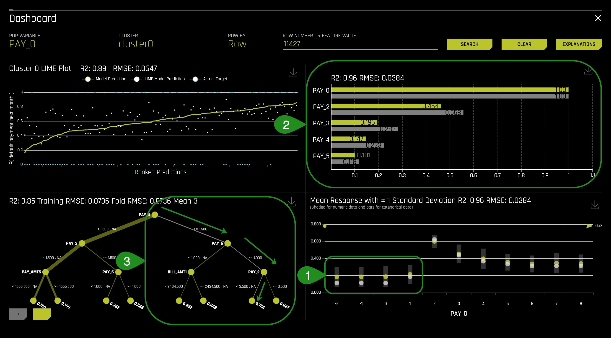

*Things to note:*

1. ICE (grey dots)

2. Partial Dependence (yellow dots) and LOCO feature Importance for the person in row 11427 (grey bars) in relation to global feature importance. 

3. Decision Tree Path for the person in row 11427.

We can observe divergence on the ICE plot and confirm possible interactions with the decision tree surrogate(the grey path). Note a possible interactions between PAY_0, PAY_6, and PAY_2.


### Deeper Dive and Resources

- [On the Art and Science of Machine Learning Explanations](https://arxiv.org/abs/1810.02909)

- [H2O ICE](https://www.h2o.ai/wp-content/uploads/2017/09/driverlessai/interpreting.html?highlight=ice#partial-dependence-and-individual-conditional-expectation-ice) 

### Learning Outcome

Now you should be able to generate an MLI report, explain significant features and key MLI techniques. 

Now that you can use the techniques learned here, what can you find using the Dashboard view? 

### External URL to the data:

- [Default of credit card clients Data Set](https://archive.ics.uci.edu/ml/datasets/default+of+credit+card+clients)

- [Default of Credit Card Clients Dataset](https://www.kaggle.com/uciml/default-of-credit-card-clients-dataset)

- [Default Payments of Credit Card Clients in Taiwan from 2005](https://rstudio-pubs-static.s3.amazonaws.com/281390_8a4ea1f1d23043479814ec4a38dbbfd9.html) 

- [Classification for Credit Card Default](http://inseaddataanalytics.github.io/INSEADAnalytics/CourseSessions/ClassificationProcessCreditCardDefault.html) 

### Resources and Videos

- [H2O Driverless AI Machine Learning Interpretability walkthrough (Oct 18)](https://www.youtube.com/watch?v=5jSU3CUReXY) 

- [Practical Tips for Interpreting Machine Learning Models - Patrick Hall, H2O.ai  (June 18)](https://www.youtube.com/watch?v=vUqC8UPw9SU) 

- [Building Explainable Machine Learning Systems: The Good, the Bad, and the Ugly (May 18)](https://www.youtube.com/watch?v=Q8rTrmqUQsU)

- [Interpretable Machine Learning  (April, 17)](https://www.youtube.com/watch?v=3uLegw5HhYk)

- [Driverless AI Hands-On Focused on Machine Learning Interpretability - H2O.ai (Dec 17)](https://www.youtube.com/watch?v=axIqeaUhow0)

- [MLI Meetup before Strata NYC 2018](https://www.youtube.com/watch?v=RcUdUZf8_SU)

- [An Introduction to Machine Learning Interpretability](https://www.oreilly.com/library/view/an-introduction-to/9781492033158/) 

- [Testing machine learning explanation techniques](https://www.oreilly.com/ideas/testing-machine-learning-interpretability-technique)

- [Practical techniques for interpretable machine learning](https://conferences.oreilly.com/strata/strata-ca/public/schedule/detail/72421) 

- [Patrick Hall and H2O Github](https://github.com/jphall663/interpretable_machine_learning_with_python)

- [Awesome-Machine-Learning-Interpretability](https://github.com/jphall663/awesome-machine-learning-interpretability)

- [jsm_2018_slides](https://github.com/jphall663/jsm_2018_slides/blob/master/main.pdf)

- [mli-resources](https://github.com/h2oai/mli-resources/)

- [mli-resources](https://github.com/h2oai/mli-resources/blob/master/cheatsheet.png)

### On the Art and Science of Machine Learning Explanations

- [Towards A Rigorous Science of Interpretable Machine Learning](https://arxiv.org/abs/1810.02909 )

- [Principles for Accountable Algorithms and a Social Impact Statement for Algorithms](https://arxiv.org/pdf/1702.08608.pdf )

- [Explainable Artificial Intelligence (XAI)](http://www.fatml.org/resources/principles-for-accountable-algorithms)

- [Explainable Artificial Intelligence (XAI)](https://www.darpa.mil/program/explainable-artificial-intelligence)

- [Explainable Artificial Intelligence (XAI)](https://docs.google.com/viewer?url=https%3A%2F%2Fwww.darpa.mil%2Fattachments%2FXAIIndustryDay_Final.pptx) 

- [Broad Agency Announcement Explainable Artificial Intelligence (XAI)](https://www.darpa.mil/attachments/DARPA-BAA-16-53.pdf) 

- [Explainable Artificial Intelligence (XAI)](https://www.darpa.mil/attachments/XAIProgramUpdate.pdf)


## Next Steps

Check out the next tutorial: [Time Series Tutorial - Retail Sales Forecasting](https://training.h2o.ai/products/tutorial-2a-time-series-recipe-tutorial-retail-sales-forecasting) where you will learn more about:

- Time-series:

    - Time-series concepts
    - Forecasting
    - Experiment settings
    - Experiment results summary
    - Model interpretability
    - Analysis


------------------


- **Note**: The Summary tab provides an overview of the interpretation, including the dataset and Driverless AI experiment name (if available) that were used for the interpretation along with the feature space (original or transformed), target column, problem type, and k-Lime information. If the interpretation was created from a Driverless AI model, then a table with the Driverless AI model summary is also included along with the top variables for the model.


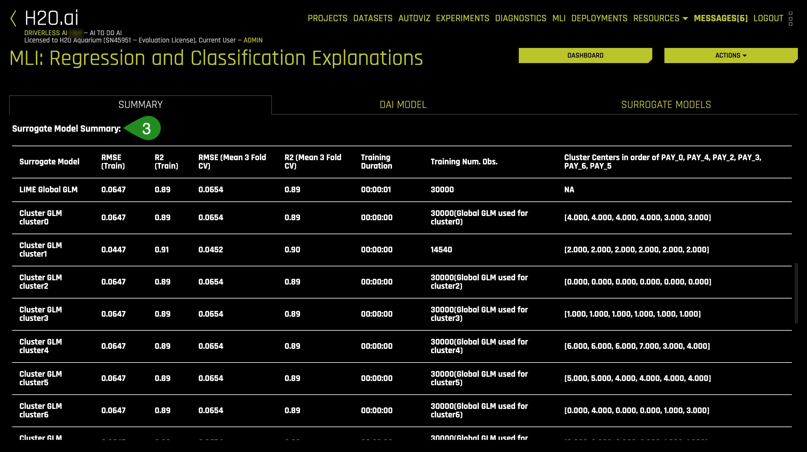

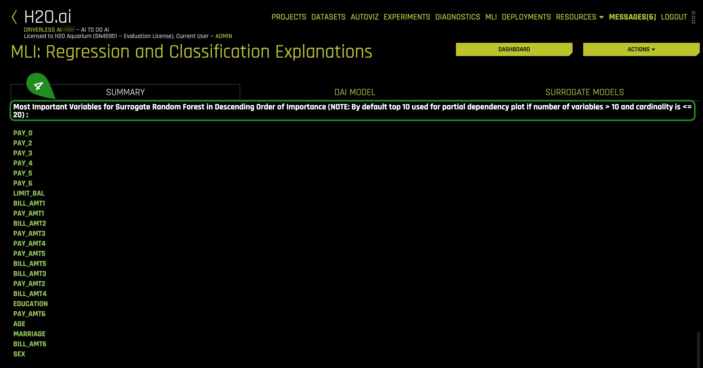

*Things to note:*

1. Summary of some basic facts about the model
2. Ranked variable importance in the space of the derived features (harder to understand)
3. Accuracy of surrogate models, or simple models of complex models 
4. Ranked variable importance in the space of the original features (easier to understand)

Notice that some of the highly ranked variables of the original features (4) show up also as highly ranked variables of the derived features (2). The ranked original variable importance (4) can be used to reason through the more complex features in (2).