# Natural Language Processing - Sentiment Analysis

## Outline

- [Objective](#objective)
- [Prerequisites](#prerequisites)
- [Task 1: Launch Sentiment Analysis Experiment](#task-1-launch-sentiment-analysis-experiment)
- [Task 2: Training Settings](#task-2-training-settings)
- [Task 3: Natural Language Processing Concepts](#task-3-natural-language-processing-concepts)
- [Task 4: Driverless AI NLP Recipe](#task-4-driverless-ai-nlp-recipe)
- [Task 5: Experiment Results Summary](#task-5-experiment-results-summary)
- [Task 6: Challenge](#task-6-challenge)
- [Appendix A: Add the Datasets](#appendix-a-add-the-datasets)
- [Appendix B: Custom Recipe to Improve Predictions](#appendix-b-custom-recipe-to-improve-predictions)
- [Next Steps](#next-steps)


## Objective

Sentiment analysis, also known as opinion mining, is a subfield of Natural Language Processing (NLP) that tries to identify and extract opinions from a given text. Sentiment analysis aims to gauge the attitudes, sentiments, and emotions of a speaker/writer based on the computational treatment of subjectivity in a text. This can be in the form of like/dislike binary rating or in the form of numerical ratings from 1 to 5.


<p align="center"> 
    </img>    
    <p align="center">Figure 1. Sentiment</p>
</p>


Sentiment Analysis is an important sub-field of NLP. It can help to create targeted brand messages and assist a company in understanding consumer’s preferences. These insights could be critical for a company to increase its reach and influence across a range of sectors.

Here are some of the uses of Sentiment Analysis from a business perspective:

- Provide audience insight 
- Support customer Service 
- Augments good PR practices 
- Drive proactive business solutions 
- Measure the ROI of the marketing campaign

In this self-paced course, we will learn some core NLP concepts that will enable us to build and understand an NLP model capable of classifying fine food reviews from Amazon customers. In other words, we will conduct a **Sensitivity Analysis** on the various customer reviews. 

**Note**: It is highly recommended that you go over the entire self-paced course before starting the experiment. 

### References 

- [Figure 1. Sentiment](https://www.kdnuggets.com/images/sentiment-fig-1-689.jpg)
 
## Prerequisites

You will need the following to be able to do this self-paced course:

- Basic knowledge of Machine Learning and Statistics  
- A hands on knowledge of the Driverless AI environment
- Basic knowledge of Driverless AI or completion of the following self-paced course: [Automatic Machine Learning Introduction with Drivereless AI](https://training.h2o.ai/products/self-paced-course-1a-automatic-machine-learning-introduction-with-driverless-ai) 
- A **Two-Hour Test Drive session** : Test Drive is H2O.ai's Driverless AI on the AWS Cloud. No need to download software. Explore all the features and benefits of the H2O Automatic Learning Platform.
  - Need a **Two-Hour Test Drive** session? Follow the instructions on [this quick self-paced course](https://training.h2o.ai/products/self-paced-course-0-getting-started-with-driverless-ai-test-drive) to get a Test Drive session started. 
  
**Note:  Aquarium’s Driverless AI Test Drive lab has a license key built-in, so you don’t need to request one to use it. Each Driverless AI Test Drive instance will be available to you for two hours, after which it will terminate. No work will be saved. If you need more time to further explore Driverless AI, you can always launch another Test Drive instance or reach out to our sales team via the [contact us form](https://www.h2o.ai/company/contact/).**

## Task 1: Launch Sentiment Analysis Experiment

### About the Dataset

The dataset consists of reviews of fine foods from [Amazon](https://www.amazon.com/). The data spans a period of more than 10 years, from Oct 1999 up to October 2012. Reviews include product and user information, ratings, and a plain text review. It also includes reviews from all other Amazon categories[1]. The data consists of 568,454 reviews, 256,059 users, 74,258 products and 260 users with > 50 reviews.

Our aim is to study these reviews and try and predict whether a review is positive or negative.

The data has been originally hosted by SNAP ([Stanford Large Network Dataset Collection](http://snap.stanford.edu/data/index.html)), a collection of more than 50 large network datasets. In includes social networks, web graphs, road networks, internet networks, citation networks, collaboration networks, and communication networks [2].


 
### Dataset Overview

In **Aquarium**, the **Driverless AI Test Drive** instance has the **Amazon fine food review** dataset already and has been split for this self-paced course's experiment. The split resulted in a train and test dataset. The datasets can be located on the Datasets overview page. However, you can also upload the datasets externally. To learn more about how to add the dataset please consult [Appendix A: Add the Dataset](#appendix-a-add-the-datasets).


1\. In the **Datasets** overview page, observe the two datasets we will use for this self-paced course:


2\. Click the following dataset and right after select the **Details** option: ```AmazonFineFoodReviews_train...```:


3\. Let’s take a quick look at the columns of the training dataset:

- The dataset consists of 11 columns which are as follows:</br>

**a**. **UserId** - unique identifier for the user</br>
**b**. **ProductId** - unique identifier for the product</br>
**c**. **Id** - review ID</br>
**d**. **Summary** - brief summary of the review</br>
**e**. **Score** - rating between 1 and 5</br>
**f**. **HelpfulnessDenominator** - number of users who indicated whether they found the review helpful or not</br>
**g**. **ProfileName** - profile name of the user</br>
     
- Continue scrolling to the right of the page to see more columns (image is not included):</br>

**h**. **HelpfulnessNumerator** - number of users who found the review helpful</br>
**i**. **Time** - timestamp for the review</br>
**j**. **Description** - text of the review</br>
**k**. **Positive Review** - whether the review is Positive or Negative

4\. Return to the Datasets page.

### Launch Experiment

The experiment has already been pre-built, given that it takes more than two hours for the experiment to complete. Below you will be guided on how to access the pre-built experiment right before we start our analysis on the built NLP model's effectiveness. For now, consider the intructions below if you were to build the experiment from scratch: 


1\. In the **Datasets** page, click on the following dataset, and right after select the **Predict** option: ```AmazonFineFoodReviews-train-26k.csv```:

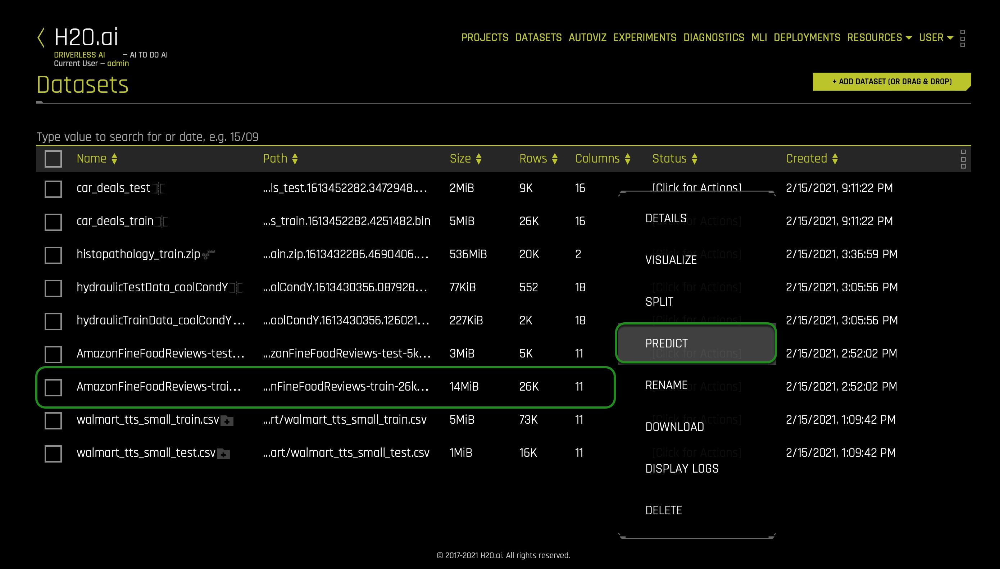

2\. As soon as you select the **Predict** option, you are asked if you want to take a tour of the Driverless AI environment. Skip it for now by clicking **Not Now**. The following will appear: 

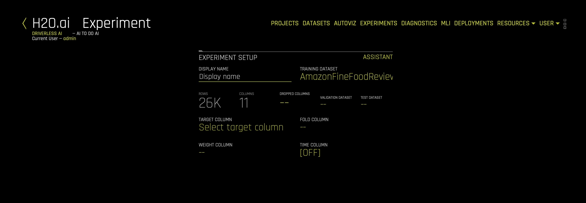

3\. Next, you will need to feed in the following information into Driverless AI:


- **Things to Note**:</br> 
**a**. **Display Name** - Let's name our current experiment ```Sentiment Analysis```.</br>
**b**. **Target Column** -  Select **PositiveReview** as the target column. The aim of the experiment is to try to predict whether a given review is positive or negative, hence the **PositiveReview** is selected as the target column. The column has only two values i.e Positive and Negative:</br>
     
 **c**. **Dropped Columns** - For this experiment, only text columns are selected, and therefore we shall only use the text columns, so we drop all columns that are not in a text format (**do not drop the *Description* column**):</br>
     
     - However, please note that if you decide to keep the non-text columns, the NLP algorithms will still work on the non-text columns.</br>
 **d**. **Test Dataset** -  The *Test dataset* is a dataset used to provide an unbiased evaluation of a _final_ model fit on the training dataset. It is not used during training of the model. Therefore, select the following dataset for the test dataset option: ```AmazonFineFoodReviews-test-26k.csv```:</br> 
     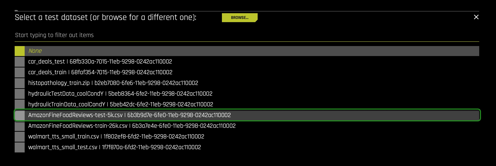


At this point, your experiment preview page will similarly look as follows: 


In **Task 2**, we will continue editing our experiment settings. 


### Acknowledgement

- [J. McAuley and J. Leskovec. From amateurs to connoisseurs: modeling the evolution of user expertise through online reviews. WWW, 2013.](http://i.stanford.edu/~julian/pdfs/www13.pdf)

### References

- [1] [Amazon Fine Food Reviews - Analyze ~500,000 food reviews from Amazon](https://www.kaggle.com/snap/amazon-fine-food-reviews)
- [2] [Stanford Network Analysis Project](https://www.kaggle.com/snap)

### Deeper Dive and Resources

- [NLP in Driverless AI documentation](http://docs.h2o.ai/driverless-ai/latest-stable/docs/userguide/nlp.html)


## Task 2: Training Settings

This task deals with settings that will enable us to run an effective NLP experiment. Let us now understand such settings and let's adjust them accurately: 


- **Things to Note**:</br>
     **a**. **Accuracy** - accuracy stands for relative accuracy, i.e., higher values should lead to higher confidence in model performance (accuracy): the accuracy setting impacts which algorithms are considered, level of assembling, and types of feature engineering.</br>
     - Therefore, set the **Accuracy** value to **5**

     **b**. **Time** - time is the relative time for completing the experiment. Higher values will lead to experiments taking longer.</br>
     - Therefore, set the **Time** value to **2**</br>

     **c**. **Interpretability** - interpretability is the degree to which a human can understand the cause of the decision. It controls the complexity of the models and features allowed within the experiments (e.g., higher interpretability will generally block complicated features, feature engineering, and models).</br>
     - Therefore, set the **Interpretability** value to **5**

     **d**. **Scorer** - the scorer is the metric used to evaluate the machine learning algorithm. The scorer used for this experiment is the LogLoss or logarithmic loss metric, which is used to evaluate the performance of a binomial or multinomial classifier. Unlike AUC, which looks at how well a model can classify a binary target, log loss evaluates how close a model’s predicted values (uncalibrated probability estimates) are to the actual target value. The lower the Logloss value, the better the model can predict the sentiment.</br>
     - Therefore, set the **scorer** to **LOGLOSS**

     **e**. **Expert Settings** - several configurable settings are available for NLP experiments in Driverless AI, which can be tuned according to the experiment type. To tune the NLP settings, click on the **Expert Settings**, and navigate to the NLP tab:

     

     - In the NLP tab, note the following particular settings that users  can use for any NLP experiment:  

     **a**. **Word-Based CNN TensorFlow Models for NLP**:</br>
     Specify whether to use Word-based CNN(Convolutional Neural Network) TensorFlow models for NLP. This option is ignored if TensorFlow is disabled. We recommend that you disable this option on systems that do not use GPUs.</br>
     - For this experiment set this setting **ON**  

     **b**. **Word-Based BiGRU TensorFlow Models for NLP**:</br>
     Specify whether to use Word-based BiGRU TensorFlow models for NLP. This option is ignored if TensorFlow is disabled. We recommend that you disable this option on systems that do not use GPUs.</br>

     - For this experiment set this setting **OFF**

     **c**. **Character-Based CNN TensorFlow Models for NLP**:</br>
     Specify whether to use Character-level CNN TensorFlow models for NLP. This option is ignored if TensorFlow is disabled. We recommend that you disable this option on systems that do not use GPUs.</br>
     - For this experiment set this setting **ON**

     **d**. **PyTorch Models for NLP (Experimental)**:</br>
     Specify whether to enable pre-trained PyTorch models and fine-tune them for NLP tasks. This is set to Auto by default. You need to set this to On if you want to use the PyTorch models like BERT for feature engineering or for modeling. We recommend that you use GPUs to speed up execution when this option is used.</br> 
     - For this experiment set this setting to **AUTO**

     **e**. **Select which pretrained PyTorch NLP Model(s) to use**:</br>
     This setting is to be used if you enable the Pytorch Models. When you click on the **Select which pretrained PyTorch NLP Model(s) to use** you can specify one or more pretrained PyTorch NLP models to use from the following list:</br>
     - bert-base-uncased
     - distillery-base-uncased
     - xlnet-base-cased
     - xlm-mlm-enfr-1024
     - roberta-base
     - Albert-base-v2
     - camembert-base
     - xlm-roberta-base</br>
          
     This setting requires an Internet connection. Using BERT-like models may result in a longer experiment completion time. We will change nothing from this setting. 

6. Additionally, there are three more buttons located beneath the experimental settings knob which stand for the following:

     -   **Classification or Regression**: Driverless AI automatically determines the problem type based on the response column. Though not recommended, you can override this setting by clicking this button. Our current problem is that of Classification.
          - Make sure this setting is set to **Classification** 
     -  **Reproducible**: This button allows you to build an experiment with a random seed and get reproducible results. If this is disabled (default), the results will vary between runs.
          - Don't enable this setting 
     -   **GPUS Enable**: Specify whether to enable GPUs. (Note that this option is ignored on CPU-only systems).
          - Make sure this setting is enable

We selected the above settings to generate a model with sufficient accuracy in the **H2O Driverless AI Test Drive environment**. At this point, your experiment pre-view page should similarly look as follows: 


The amount of time this experiment will take to complete will depend on 
on the memory, availability of GPU in a system, and the expert settings a user might select. If the system does not have a GPU, it might run for a longer time. You can Launch the Experiment and wait for it to finish, or you can access a pre-build version in the **Experiment** section. After discussing few NLP concepts in the upcoming two tasks, we will discuss how to access this pre-built experiment right before analyzing its performance. 

### Resources

- [1] [J. Friedman, B. Popescu. "Predictive Learning via Rule Ensembles". 2005](http://statweb.stanford.edu/~jhf/ftp/RuleFit.pdf)
- [2] [Ensemble Learning](https://en.wikipedia.org/wiki/Ensemble_learning)

### Deeper Dive

-   [To better understand the impact of setting the Accuracy, Time and Interpretability Knobs between 1 and 10 in H2O Driverless AI](http://docs.h2o.ai/driverless-ai/latest-stable/docs/userguide/experiment-settings.html?highlight=interpretability#accuracy-time-and-interpretability-knobs)
-   [Expert Settings for H2O Driverless AI](http://docs.h2o.ai/driverless-ai/latest-stable/docs/userguide/expert-settings.html?highlight=expert%20settings)


## Task 3: Natural Language Processing Concepts

### Natural Language Processing (NLP)

NLP is the field of study that focuses on the interactions between human language and computers. NLP sits at the intersection of computer science, artificial intelligence, and computational linguistics[1]. NLP is a way for computers to analyze, understand, and derive meaning from human language in a smart and useful way. By utilizing NLP, developers can organize and structure knowledge to perform tasks such as:

- Automatic tagging of incoming customer queries related to credit card, loans, etc
- Sentiment analysis of social media reviews
- Using free text variables along with numeric variables for credit risk and fraud models
- Emotion detection
- Profanity detection

The text data is highly unstructured, but the Machine learning algorithms usually work with numeric input features. So before we start with any NLP project, we need to pre-process and normalize the text to make it ideal for feeding into the commonly available Machine learning algorithms. This essentially means we need to build a pipeline of some sort that breaks down the problem into several pieces. We can then apply various methodologies to these pieces and plug the solution together in a pipeline.

### Building a Typical NLP Pipeline


The figure above shows how a typical pipeline looks. It is also important to note that there may be variations depending upon the problem at hand. Hence the pipeline will have to be adjusted to suit our needs. Driverless AI automates the above process. Let's try and understand some of the components of the pipeline in brief:

### Text preprocessing

Text pre-processing involves using various techniques to convert raw text into well-defined sequences of linguistic components with standard structure and notation. Some of those techniques are:

- **Sentence Segmentation:** involves identifying sentence boundaries between words in different sentences. Since most written languages have punctuation marks that occur at sentence boundaries, sentence segmentation is frequently referred to as sentence boundary detection, sentence boundary disambiguation, or sentence boundary recognition. All these terms refer to the same task: determining how a text should be divided into sentences for further processing.

- **Text Tokenization:** Tokenization involves splitting raw text corpus into sentences and then further splitting each sentence into words.

- **Text Standardisation:** Once the text has been tokenized, it is normalized by getting rid of the noise. Noise relates to anything that isn't in a standard format like punctuation marks, special characters, or unwanted tokens. If required, case conversions can also be done, i.e., converting all tokens into either lowercase or uppercase.

- **Removing Stopwords:** Stop words are words that appear very frequently in a text like "and", "the", and "a", but appear to be of little value in helping select documents. Therefore, such words are excluded from the vocabulary entirely.

- **Stemming:** Stemming is the process of reducing inflected (or sometimes derived) words to their stem, base, or root form — generally a written word form. For example: if we were to stem the following words: "Stems," "Stemming," "Stemmed," "and "Stemtization," the result would be a single token "stem."

- **Lemmatization:** a similar operation to Stemming is Lemmatization. However, the major difference between the two is that Stemming can often create non-existent words, whereas Lemmatization creates actual words. An example of Lemmatization: "run" is a base form for words like "running" or "ran," and the word "better" and "good" are in the same lemma, so they are considered the same.

It is important to note here that the above steps are not mandatory, and their usage depends upon the use case. For instance, in sentiment analysis, emoticons signify polarity, and stripping them off from the text may not be a good idea. The general goal of Normalization, Stemming, and Lemmatization techniques is to improve the model's generalization. Essentially we are mapping different variants of what we consider to be the same or very similar "word" to one token in our data.

### Feature Extraction

The Machine Learning Algorithms usually expect features in the form of numeric vectors. Hence, after the initial preprocessing phase, we need to transform the text into a meaningful vector (or array) of numbers. This process is called **feature extraction**. Let's see how some of the feature-extracting techniques work.

- **Bag of Words (BoW):** The bag-of-words represents text that describes the occurrence of words within a document. It involves two things:

  - A vocabulary of known words
  - A measure of the presence of known words

The intuition behind the Bag of Words is that documents are similar if they have identical content, and we can get an idea about the meaning of the document from its content alone. 

### Example implementation

The following models a text document using bag-of-words here are two simple text documents:

- John likes to watch movies. Mary likes movies too.
- John also likes to watch football games.
  
Based on these two text documents, a list is constructed as follows for each document:

- "John", "likes" ,"to" ,"watch" ,"movies" ,"Mary" ,"likes","movies" ,"too"
- "John" ,"also" ,"likes" ,"to" ,"watch" ,"football" ,"games"

Representing each bag-of-words as a JSON object and attributing to the respective JavaScript variable:

- BoW1 = {"John":1, "likes":2, "to":1, "watch":1 ,"movies":2 ,"Mary":1 ,"too":1};
- BoW2 = {"John":1, "also":1, "likes":1, "to":1, "watch":1, "football":1, "games":1};


It is important to note that **BoW** does not retain word order and is sensitive towards document length, i.e., token frequency counts could be higher for longer documents.

It is also possible to create **BoW** models with consecutive words, also known as **n-grams**:

- **TF-IDF Model:** A problem with the Bag of Words approach is that highly frequent words start to dominate in the document (e.g., larger score) but may not contain as much "informational content." Also, it will give more weight to longer documents than shorter ones. One approach is to rescale the frequency of words by how often they appear in all documents so that the scores for frequent words across all documents are penalized. This approach of scoring is called **Term Frequency-Inverse Document Frequency**, or TF-IDF [2] for short, where:

     - **Term Frequency** is a scoring of the frequency of the word in the current document. TF = (Number of times term t appears in a document)/(Number of terms in the document)
    - **Inverse Document Frequency**: is a scoring of how rare the word is across documents. IDF = 1+log(N/n), where **N** is the number of documents, and **n** is the number of documents a term **t** has appeared. TF-IDF weight is often used in information retrieval and text mining. This weight is a statistical measure used to evaluate how important a word is to a document in a collection or corpus:

     

The dimensions of the output vectors are high. This also gives importance to the rare terms that occur in the corpus, which might help our classification tasks:

- **Principal Component Analysis (PCA)**:

     Principal Component Analysis is a dimension reduction tool that can be used to reduce a large set of variables to a small set that still contains most of the information in the original set.

- **Truncated SVD**:
    
     SVD stands for Singular Value Decomposition[3], which is a way to decompose matrices. Truncated SVD is a common method to reduce the dimension for text-based frequency/vectors.

- **Advanced Word Vectorization Models**:
    
     TFIDF and frequency-based models represent counts and significant word information, but they lack semantics of the words in general. One of the popular representations of text to overcome this is **Word Embeddings**.

     Word embeddings is a feature engineering technique for text where words or phrases from the vocabulary are mapped to vectors of real numbers. There are ways to create more advanced word vectorization models for extracting features from text data like word2vec[2] model. The word2vec model was released in 2013 by Google; word2vec is a neural network-based implementation that learns distributed vector representations of words based on continuous **Bag of Words** and skip-gram–based architectures.

     

     Representations are made so that words that have similar meanings are placed close or equidistant to each other. For example, a word like **king** is closely associated with **queen** in this vector representation.

- **Convolution Neural Network (CNN) Models on Word Embeddings**:

     CNN's are generally used in computer vision; however, they've recently been applied on top of pre-trained word vectors for sentence-level classification tasks, and the results were promising[5].

     Word embeddings can be passed as inputs to CNN models, and cross-validated predictions are obtained from them. These predictions can then be used as a new set of features.

     

     <p align="center">
     Figure 1. Convolutional Neural Network (CNN) architecture for sentence classification
     </p>

- **Recurrent neural networks**

     RNNs like LSTM and GRU are state-of-the-art algorithms for NLP problems.  A Bi-directional GRU model is putting two independent RNN models in one.

     For example, in the sentence "John is walking on the golf court," a unidirectional model would represent states representing "golf" based on "John is walking" but not the "court."  In a bi-directional model, the representation would also account for the later representations giving the model more predictive power. This makes it a more natural approach when dealing with textual data since the text is naturally sequential[6].

     

     <p align="center">
     Figure 2. Standard Sequence to Sequence Model. 
     </p>

- **Transformer based language models** 

     Transformer-based language models like BERT are state-of-the-art NLP models that can be used for a wide variety of NLP tasks. These models capture the contextual relation between words by using an attention mechanism. Unlike directional models that read text sequentially, a Transformer-based model reads the entire sequence of text at once, allowing it to learn the word's context based on all of its surrounding words. The embeddings obtained by these models show improved results in comparison to earlier embedding approaches.

     <p align="center">
      
     <p align="center">Figure 3. BERT</p>
     </p>

### Building Text Classification Models

Once the features have been extracted, they can then be used for training a classifier.

With this task in mind, let's learn about **Driverless AI NLP Recipes**.

### References

- [1] [Natural language processing - WIkipedia](https://stackedit.io/%5Bhttps://en.wikipedia.org/wiki/Natural_language_processing%5D(https://en.wikipedia.org/wiki/Natural_language_processing))
- [2] [TF-IDF](https://en.wikipedia.org/wiki/Tf%E2%80%93idf)
- [3] [SVD](https://en.wikipedia.org/wiki/Singular_value_decomposition)
- [4] [Word2vec Model](https://code.google.com/archive/p/word2vec/)
- [5] [Understanding Convolutional Neural Networks for NLP](http://www.wildml.com/2015/11/understanding-convolutional-neural-networks-for-nlp/)
- [6] [Convolutional Neural Networks for Sentence Classification](https://arxiv.org/pdf/1408.5882.pdf)
- [7] [Text Classification, Part 2 - sentence-level Attentional RNN](https://richliao.github.io/supervised/classification/2016/12/26/textclassifier-RNN/)
- [8] [Attention Is All You Need](https://arxiv.org/abs/1706.03762)
- [9] [BERT: Pre-training of Deep Bidirectional Transformers for Language Understanding](https://arxiv.org/abs/1810.04805)
- [Figure 1. Convolutional Neural Network (CNN) architecture for sentence classification](http://www.wildml.com/2015/11/understanding-convolutional-neural-networks-for-nlp)
- [Figure 2. Standard Sequence to Sequence Model](https://richliao.github.io/supervised/classification/2016/12/26/textclassifier-RNN)
- [Figure 3. BERT](https://ai.googleblog.com/2018/11/open-sourcing-bert-state-of-art-pre.html)

### Deeper Dive and Resources

- [Jurafsky, Daniel and James Martin (2008) Speech and Language Processing (Second Edition). Prentice Hall](https://stackedit.io/%5Bhttps://web.stanford.edu/~jurafsky/slp3/ed3book.pdf%5D(https://web.stanford.edu/~jurafsky/slp3/ed3book.pdf))
- [Natural Language Processing with Python : Steven Bird, Ewan Klein, and Edward Loper](https://www.nltk.org/book/)

## Task 4: Driverless AI NLP Recipe

**Note**: *This section will discuss all current NLP model capabilities of Driverless AI. Keep in mind that not all settings discussed below have been enabled in the current sentiment analysis experiment.* 

Text data can contain critical information to inform better predictions. Driverless AI automatically converts text strings into features using powerful techniques like TFIDF, CNN, and GRU. Driverless AI now also includes state-of-the-art PyTorch BERT transformers. With advanced NLP techniques, Driverless AI can also process larger text blocks, build models using all available data, and solve business problems like sentiment analysis, document classification, and content tagging.

The Driverless AI platform can support both standalone text and text with other columns as predictive features. In particular, the following NLP recipes are available for a given text column:


### Key Capabilities of Driverless AI NLP Recipes

- **N-grams**:
     - An n-gram is a contiguous sequence of **n** items from a given text or speech sample.
- **TFIDF of n-grams**:
     - Frequency-based features can be multiplied with the inverse document frequency to get term frequency-inverse document frequency (TF-IDF) vectors. Doing so also gives importance to the rare terms in the corpus, which can help in specific classification tasks.
     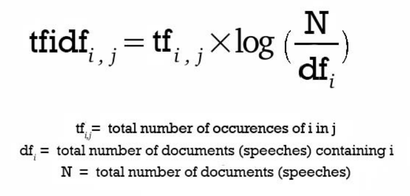
- **Frequency of n-grams**:
     - Frequency-based features represent the count of each word in the given text in the form of vectors. Frequency-based features are created for different n-gram values[2]. The dimensions of the output vectors are quite high. Words and n-grams that occur more times will get higher weightage than the ones that occur less frequently.
- **Truncated SVD Features**:
     - Both TFIDF and Frequency of n-grams result in a higher dimension. To tackle this, we use Truncated SVD to decompose the vector arrays in lower dimensions.
- **Linear models on TF/IDF vectors**:
     - Our NLP recipe also has linear models on top of n-gram TFIDF/ frequency vectors. This captures linear dependencies that are simple yet significant in achieving the best accuracies.
- **Word Embeddings**:
     - Driverless AI NLP recipe uses the power of word embeddings where words or phrases from the vocabulary are mapped to vectors of real numbers.
- **Bi-direction GRU models on Word Embeddings (TensorFlow)**:
     - A BI-directional GRU model is like putting independent RNN models in one. GRU gives higher speed and almost similar accuracy when compared to its counterpart LSTM. 
- **Convolution neural network models on:**
     - **Word embeddings followed by CNN model (TensorFlow)**:
          - In Driverless AI, we pass word embeddings as input to CNN models; we get cross-validated predictions from it and use them as a new set of features.
     - **Character embeddings followed by CNN model (TensorFlow)**:
          - Natural language processing is complex as the language is hard to understand given small data and different languages. Targeting languages like Japanese, Chinese where characters play a major role, we have character level embeddings in our recipe as well.
          - In character embeddings, each character gets represented in the form of vectors rather than words. Driverless AI uses character level embeddings as input to CNN models and later extracts class probabilities to feed as features for downstream models: this gives the ability to work in languages other than English. In languages like Japanese and Chinese, where there is no concept of words, character embeddings will be useful.
- **BERT/DistilBERT based embeddings for Feature Engineering (PyTorch):**
     - BERT and [DistilBERT](https://arxiv.org/abs/1910.01108) models can be used to generate embeddings for any text columns. These pre-trained models are used to get embeddings for the text, followed by Linear/Logistic Regression to generate features that Driverless AI  can then use for any downstream models in Driverless AI.
- **PyTorch Transformer Architecture Models (e.g., BERT) as Modeling Algorithms:**
     - With versions of  Driverless AI 1.9 and higher, the Transformer-based architectures shown in the diagram below are supported as models in Driverless AI:
     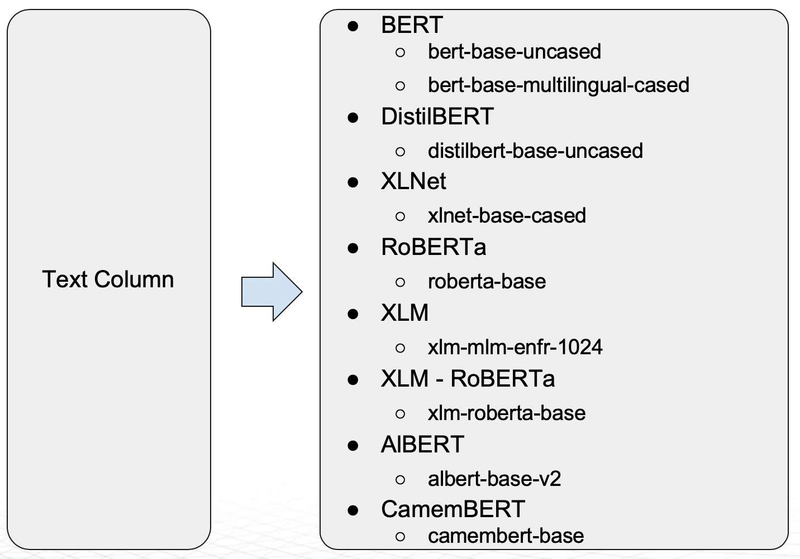
     - The BERT model supports multiple languages. [DistilBERT](https://arxiv.org/abs/1910.01108) is a distilled version of BERT that has fewer parameters compared to BERT (40% less), and it is faster (60% speedup) while retaining 95% of BERT level performance. The DistilBERT model can be helpful when training time and model size is important.
- **Domain Specific BERT Recipes**
     Driverless AI can also extend the DAI Base BERT model for domain-specific problems:
     - [FinBERT](https://github.com/ProsusAI/finBERT) (trained on financial text)
     - [SciBERT](https://github.com/allenai/scibert) (trained on scientific text)
     - [BioBERT](https://github.com/dmis-lab/biobert) (trained on bio-medical text)


### Deeper Dive and Resources

- [Text Classification with H2O Driverless AI - A Look Under the Hood](https://www.youtube.com/watch?v=8bumqmOfIYs&t=1488s)
- [State of The Art NLP Models in H2O Driverless AI 1.9](https://www.h2o.ai/webinars/?commid=428217)


### Industry Use Cases leveraging NLP

-   [ArmadaHealth: Understanding Sentiment to impact lives](https://www.youtube.com/watch?v=D0e-1gedK6g&feature=youtu.be)
-   [The AI Academy is accelerating NLP projects with Driverless AI](https://youtu.be/aXPE6IiKRmI)
-   [Martin Stein, G5 - Driving Marketing Performance with H2O Driverless AI](https://www.youtube.com/watch?v=f4b2Yoe9JEs&feature=youtu.be)


## Task 5: Experiment Results Summary

If you decided to run the experiment constructed in tasks one and two, it most likely is still running. In that case, whether your experiment is still finishing or you didn't launch the experiment, you can access the pre-built version in the **Experiments** section: 

1\. In the **Experiments** section select the experiment with the following name: ```Sentiment Analysis Tutorial```: 


2\. Let's review the experiment summary page, and let's determine the goodness and efficiency of our built model: 

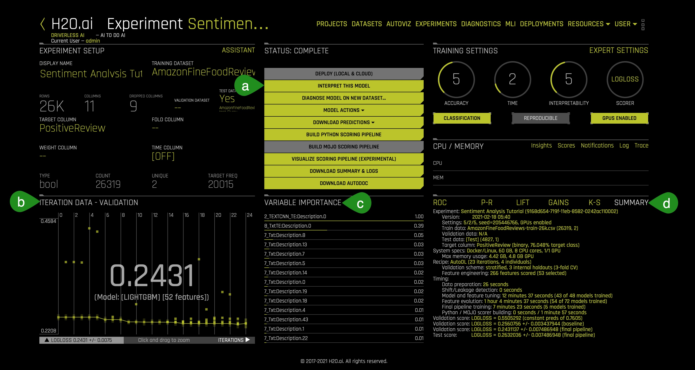

- **Things to Note:**</br>
     **a**. **Interpret this Model** -  this option allows you to understand your model through several Driverless AI and Surrogate Models. As well, this option provides reason codes for the trained model and its results. For example, when running NLP experiments, Driverless AI offers the following visuals through the **Interpret this Model** option: 
     - The following two plots can be located in the **NLP** tab on the **MLI Explanations** page (only visible for NLP models):
     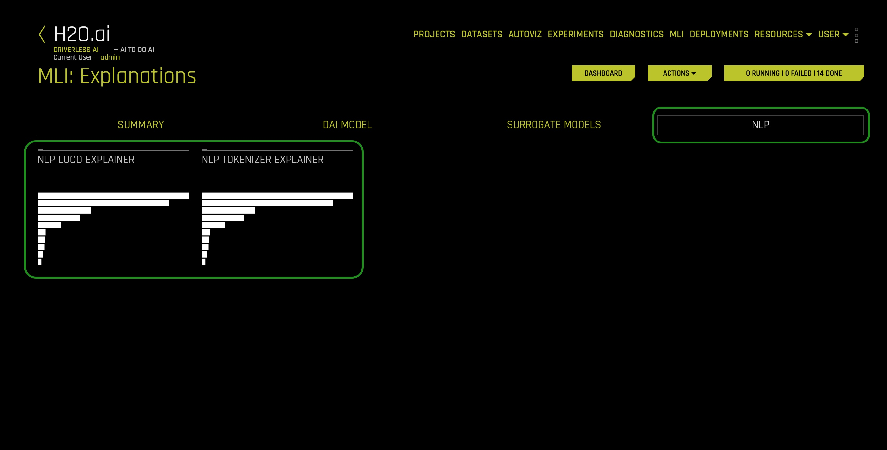
	     - **NLP Tokenizer Explainer** - this plot is available for NLP models. It shows both the global and local importance values of each token in a corpus (a large and structured set of texts). The corpus is automatically generated from Driverless AI models' text features prior to the process of tokenization:
          
          - **NLP LOCO Explainer** - this plot is available for NLP models. It applies a leave-one-covariate-out (LOCO) styled approach to NLP models by removing a specific token from all text features in a record and predicting local importance without that token. The difference between the resulting score and the original score (token included) is useful when determining how specific changes to text features alter the model's predictions:
          
        
     **b**. **Iteration Data - Validation**:</br>
     - The winning model's validation score and the algorithm used are as follows:
          - Validation Score: **0.2431**
          - Model Type: **LIGHTGBM**

     **c**. **Variable Importance** - Summary of top 20 Feature Engineered variables:</br>

     - Driverless AI performs feature Engineering on the training dataset to determine the optimal representation of the data. Various stages of the features appear throughout the iteration of the data. These can be viewed by hovering over points on the **Iteration Data - Validation Graph** while the **Variable Importance** section updates its variables accordingly. 

     
     <p align="center">
    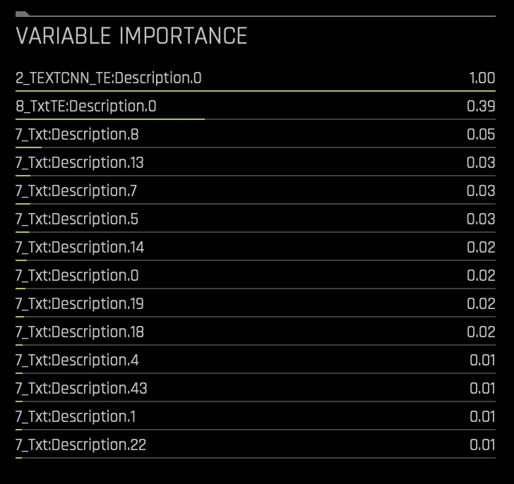 
     </p>

     - The complete list of features used in the final model is available in the **Experiment Summary** artifacts. The **Experiment Summary** also provides a list of the original features and their estimated feature importance. 
     - Looking at the **Variable Importance** section can highlight important variables in NLP experiments. 

     **d**. **Summary**:</br>
     - This option gives a brief summary of the entire experiment including:
          - The number of features tested and selected 
          - The models that Driverless AI trained for feature evolution 
     - There are also several plots adjacent to the summary tab that give insight into the experiment. If you are interested in learning more about each plot and the metrics derived from those plots, check out the following self-paced course: [Machine Learning Experiment Scoring and Analysis - Financial Focus](https://training.h2o.ai/products/self-paced-course-1b-machine-learning-experiment-scoring-and-analysis-financial-focus).

If you would like to explore how custom recipes can improve predictions; in other words, how custom recipes could decrease the value of LOGLOSS (in our current observe experiment), please refer to [Appendix B](#appendix-b-custom-recipe-to-improve-predictions). 

### Deeper Dive and Resources

-   [Learn more about running Experiments from H2O Driverless AI docs](http://docs.h2o.ai/driverless-ai/latest-stable/docs/userguide/running-experiment.html#)
-   [Explore Documentation on Completed Experiments](http://docs.h2o.ai/driverless-ai/latest-stable/docs/userguide/experiment-completed.html)
-   [Explore Documentation on Experiment Summary](http://docs.h2o.ai/driverless-ai/latest-stable/docs/userguide/experiment-summary.html)
-   [Review the Driverless AI Booklet to learn more about running experiments](http://docs.h2o.ai/driverless-ai/latest-stable/docs/booklets/DriverlessAIBooklet.pdf)
-   [Learn more about Driverless AI Transformations](http://docs.h2o.ai/driverless-ai/latest-stable/docs/userguide/transformations.html)
-   [Feature Engineering for ML by Dmitry Lark](https://www.youtube.com/playlist?list=PLrsf4weWJKynQBvh0i-YxDDVqCcIrF28o)


### Deeper Dive and Resources

- [Get Started with Open Source Custom Recipes](https://training.h2o.ai/products/self-paced-course-3a-get-started-with-open-source-custom-recipes)

##  Task 6: Challenge

It's time to test your skills!

The challenge is to analyze and perform Sentiment Analysis on the tweets using the US Airline Sentiment dataset. This dataset will help to gauge people's sentiments about each of the major U.S. airlines.

This data comes from [Crowdflower's Data for Everyone library](http://www.crowdflower.com/data-for-everyone) and constitutes Twitter reviews about how travelers in February 2015 expressed their feelings on Twitter about every major U.S. airline. The reviews have been classified as positive, negative, and neutral.

### Steps:

1\. Import the dataset from here:

-   [Airline-Sentiment-2-w-AA](https://data.world/crowdflower/airline-twitter-sentiment)

Here are some samples from the dataset:


2\. Split the dataset into a training set and a testing set in an **80:20** ratio.

3\. Run an experiment where the target column is **airline_sentiment** using only the default Transformers. You can exclude all other columns from the dataset except the 'text' column.

4\. Run another instance of the same experiment, but this time include the Tensorflow models and the built-in transformers.

5\. Next, repeat the experiment with a custom recipe from [here](https://github.com/h2oai/driverlessai-recipes).

6\. Using **Logloss** as the scorer, observe the following outcomes:

- Which experiment out of the three gives the minimum Logloss value and why?
- How variable importance change as you change the selected transformers? 

### Deeper Dive and Resources

- [Try running an experiment without the Driverless AI UI using the Python Client](https://github.com/h2oai/driverlessai-tutorials/blob/master/driverlessai_experiments/nlp/airline_sentiment_experiment/demo_nlp_airline_sentiment.ipynb)

## Appendix A: Add the Datasets

### Add the Datasets

Consider the following steps to import the training and test **Amazon Fine Food Reviews** datasets: 

1\. Select **+ Add Dataset (or Drag and Drop)** then click on the following option: **File System**:

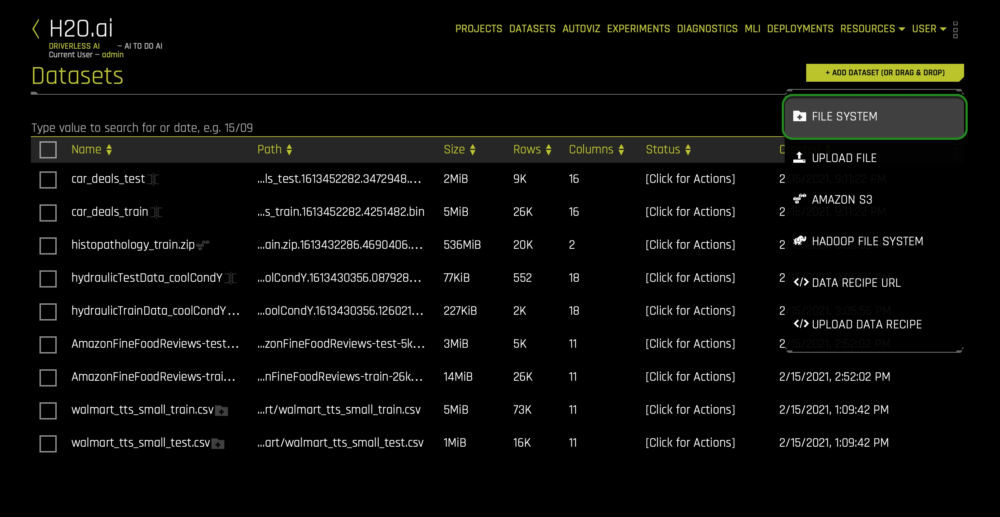

2\. Enter the following into the search bar: `data/Kaggle/AmazonFineFoodReviews/`.

3\. Select the follwing two datasets: 


4\. Right after, cick the following button: **Click to Import Selection**.

5\. If the file loaded successfully, then the two datasets will be display in the **Datasets** page: 


## Appendix B: Custom Recipe to Improve Predictions

The latest versions of Driverless AI implement a key feature called BYOR[1], which stands for Bring Your Own Recipes, and was introduced with Driverless AI (1.7.0). This feature has been designed to enable Data Scientists or domain experts to influence and customize the machine learning optimization used by Driverless AI as per their business needs. This additional feature engineering technique is aimed at improving the accuracy of the model.

Recipes are customizations and extensions to the Driverless AI platform. They are nothing but Python code snippets uploaded into Driverless AI at runtime, like plugins. Recipes can be either one or a combination of the following:

- Custom machine learning models
- Custom scorers (classification or regression)
- Custom transformers 


### Uploading a Custom Recipe

H2O has built and open-sourced several recipes[2], which can be used as templates. For this experiment, we could use the following recipe: [text_sentiment_transformer.py](https://github.com/h2oai/driverlessai-recipes/blob/master/transformers/nlp/text_sentiment_transformer.py) which extracts sentiment from text using pre-trained models from TextBlob[3].

**Please note that in this appendix, we will show you how to add the Sentiment transformer. However, we don't recommend that you run this on Aquarium, as Aquarium provides a small environment; the experiment might not finish on time or might not give you the expected results. If you are trying to see how recipes can help improve an NLP experiment, we recommend that you obtain a bigger machine with more resources to see improvements.** 

1\. In the **Experiments** section, click on the three dots next to the experimet: ```Sentiment Analysis```.  In it, select the following option: **New Experiment with Same Settings**. The following will appear: 

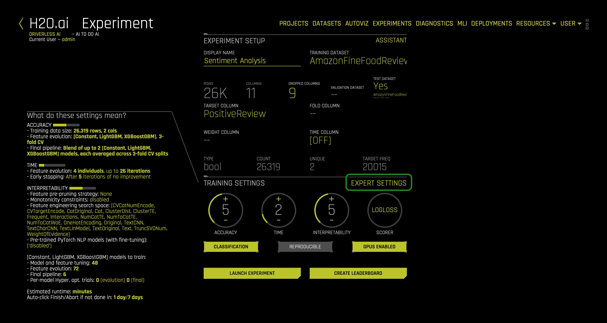

- Click on the **Expert Settings** option 

2\. A new window with Expert Experiment Settings will appear. Here you can either upload a custom recipe or load a custom recipe from a URL:


3\. The first way to upload a custom recipe is by clicking on the **+ UPLOAD CUSTOM RECIPE** button (a): this option allows you to upload custom recipes located on your computer. We will not use this option. 

4\. The second way to upload a custom recipe is by clicking on the **+ LOAD CUSTOM RECIPE FROM URL** button (b): this option allows you to upload a recipe located on Github. We will use this option. Click this (b) option and paste the following custom recipe:
    
```
https://raw.githubusercontent.com/h2oai/driverlessai-recipes/rel-1.9.1/transformers/nlp/text_sentiment_transformer.py
```

5\. While the recipe is uploading, the following will appear (Driverless AI automatically performs basic acceptance tests for all custom recipes (this can de enable/disable): 

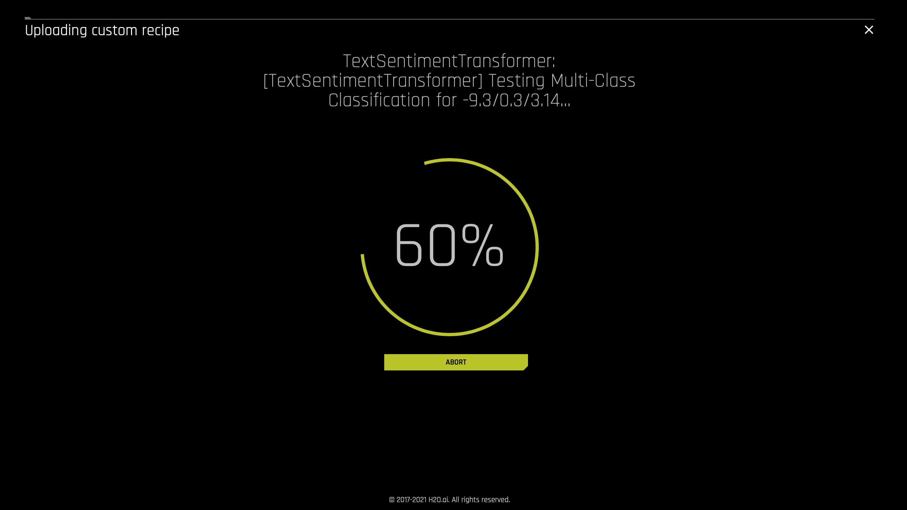


6\. Driverless AI offers several available recipes that can be accessed when clicking on the **OFFICIAL RECIPES (OPEN SOURCE)** button(c):


7\. Whenever you use a recipe, you have access to the following recipe settings located in the **Recipes** tab (e.g., transformers, models, scorers): 


- **Things to Note**:</br>
**a.** Include specific transformers</br> 
**b.** Include specific models</br>
**c.** Include specific data recipes during experiment</br>
**d.** Whether to skip failures of transformers</br>
**e.** Include specific scorers</br>
**f.** Scorer to optimize threshold to be used in other confusion-matrix based scorers (for binary classification)</br>
**g.** Enable if you want to skip failure of transformers (whether to skip failures of models)</br> 
**h.** Enable if you want to skip failure of models (include specific preprocessing transformers)
    
- We will not change nothing in the **Recipes** tab 
    
8\. Click **Save**. The selected transformer should now appear on the main Experiment screen as follows:

<p align="center">
     
    
</p>

9\. Now, you are ready to launch the Experiment with the Custom Recipe.

### References

- [1] [Custom Machine Learning Recipes: The ingredients for success](https://www.h2o.ai/blog/custom-machine-learning-recipes-the-ingredients-for-success/)
- [2] [Driverless AI Recipes](https://github.com/h2oai/driverlessai-recipes)
- [3] [TextBlob](https://textblob.readthedocs.io/en/dev/)

## Next Steps

- Check out the next self-paced course: **[Image Processing in Driverless AI](https://training.h2o.ai/products/self-paced-course-2c-image-processing-in-driverless-ai)**, where you will learn about: 
  - How to use images to predict true cases of metastatic cancer 
  - How to use images to predict the price of a car 
  - Pre-trained image transformers - transforming images into vectors 
  - Automatic image model 

- As well, you can watch the following webinar to learn more about Image Processing in Driverless AI: 
  - **Webinar**: [More Use Cases and More Value with Automated Computer Vision Modeling](https://www.h2o.ai/webinars/?commid=427103)
    - In this webinar, you will learn about: - Visual AI features in Driverless AI 1.9 - Image modeling use cases with images with other data types and with images stand-alone - The Visual AI roadmap for Driverless AI - How to deploy image models as low latency MOJOs 
    - Presenters: Dan Darnell, VP of Product Marketing at H2O.ai Yauhen Babakhin, Kaggle Competitions Grandmaster and Data Scientist at H2O.ai

- You can also read the following article discussing Automatic Image Recognition: [Exploring the Next Frontier of Automatic Machine Learning with H2O Driverless AI](https://www.h2o.ai/blog/exploring-the-next-frontier-of-automatic-machine-learning-with-h2o-driverless-ai/)


