# Natural Language Processing Tutorial - Sentiment Analysis

## Outline
- [Objective](#objective)
- [Prerequisites](#prerequisites)
- [Task 1: Launch Sentiment Analysis Experiment](#task-1-launch-sentiment-analysis-experiment)
- [Task 2: Sentiment Analysis Experiment Settings](#task-2-sentiment-analysis-experiment-settings)
- [Task 3: Natural Language Processing Concepts](#task-3-natural-language-processing-concepts)
- [Task 4: Driverless AI NLP Recipe](#task-4-driverless-ai-nlp-recipe)
- [Task 5: Experiment Results Summary](#task-5-experiment-results-summary)
- [Task 6: Custom Recipe to Improve Predictions](#task-6-custom-recipe-to-improve-predictions) 
- [Task 7: Challenge](#task-7-challenge)
- [Task 8: Appendix A: Add the Datasets](#task-8-appendix-a-add-the-datasets)
- [Next Steps](#next-steps)


## Objective

Sentiment analysis, also known as opinion mining is a subfield of Natural Language Processing (NLP) that tries to identify and extract opinions from a given text. The aim of sentiment analysis is to gauge the attitudes, sentiments, and emotions of a speaker/writer based on the computational treatment of subjectivity in a text. This can be in the form of like/dislike binary rating or in the form of numerical ratings from 1 to 5.


[Image source]( https://www.kdnuggets.com/images/sentiment-fig-1-689.jpg)

Sentiment Analysis is an important sub-field of NLP. It can help to create targeted brand messages and assist a company in understanding consumer’s preferences. These insights could be critical for a company to increase its reach and influence across a range of sectors.

Here are some of the uses of Sentiment analysis from a business perspective:

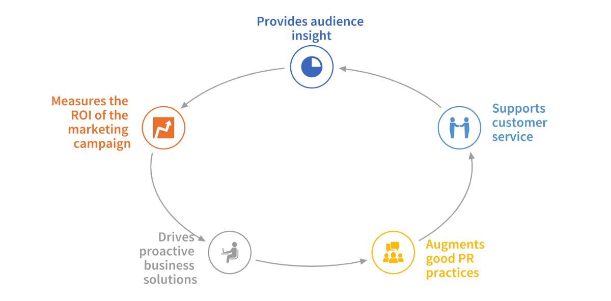


In this tutorial, you will learn how to apply automatic machine learning to build a model to classify customer reviews. You will learn some core NLP concepts and then load a dataset, explore it, run an experiment to build a model and explore the results.

**Note**: It is highly recommended that you go over the entire tutorial before starting the experiment. This would help you become more familiar with the content and aid you while you are performing the experiment..
 
## Prerequisites

You will need the following to be able to do this tutorial:

- Basic knowledge of Machine Learning and Statistics  
- A hands on knowledge of Driverless AI environment
- Basic knowledge of Driverless AI or doing the [Automatic Machine Learning Introduction with Drivereless AI](https://training.h2o.ai/products/tutorial-1a-automatic-machine-learning-introduction-with-driverless-ai) 
    
- A **Two-Hour Test Drive session** : Test Drive is H2O.ai's Driverless AI on the AWS Cloud. No need to download software. Explore all the features and benefits of the H2O Automatic Learning Platform.

  - Need a **Two-Hour Test Drive** session? Follow the instructions on [this quick tutorial](https://training.h2o.ai/products/tutorial-0-getting-started-with-driverless-ai-test-drive) to get a Test Drive session started. 
  
**Note:  Aquarium’s Driverless AI Test Drive lab has a license key built-in, so you don’t need to request one to use it. Each Driverless AI Test Drive instance will be available to you for two hours, after which it will terminate. No work will be saved. If you need more time to further explore Driverless AI, you can always launch another Test Drive instance or reach out to our sales team via the [contact us form](https://www.h2o.ai/company/contact/).**

## Task 1: Launch Sentiment Analysis Experiment

### About the Dataset

The dataset consists of reviews of fine foods from [Amazon](https://www.amazon.com/). The data spans a period of more than 10 years, from Oct 1999 up to October 2012. Reviews include product and user information, ratings, and a plain text review. It also includes reviews from all other Amazon categories[1]. The data consists of 568,454 reviews, 256,059 users, 74,258 products and 260 users with > 50 reviews.

Our aim is to study these reviews and try and predict whether a review is positive or negative.

The data has been originally hosted by SNAP ([Stanford Large Network Dataset Collection](http://snap.stanford.edu/data/index.html)), a collection of more than 50 large network datasets from tens of thousands of nodes and edges to tens of millions of nodes and edges. In includes social networks, web graphs, road networks, internet networks, citation networks, collaboration networks, and communication networks [2].

The dataset provided is a CSV file containing 568,454 rows and a total of 10 features (columns).
 
### Dataset Overview

If you are using **Aquarium** as the environment, then the lab **Driverless AI Test Drive** has the Amazon fine review dataset already pre-loaded with separate training and test datasets. The datasets can be located on the Datasets Overview page. However, you can also upload the datasets externally. To learn more about how to add the two datasets from the Driverless AI file system then see [Appendix A: Add the Datasets](#task-8-appendix-a-add-the-datasets).

On clicking the highlighted `Start lab` button , you will be taken  to a Driverless AI platform with several pre-loaded data sets and pre-run visualizations, models, interpretations, and deployments. Here  you will have access to both the training and testing set for Amazon fine food reviews.

1\. Verify that both datasets are on the Datasets Overview, your screen should look similar to the page below:

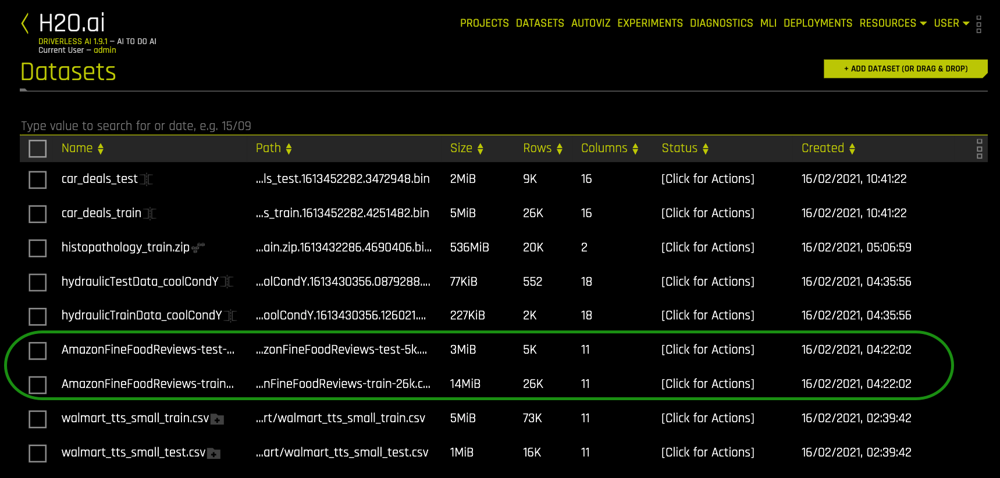

2\. Click on the `AmazonFineFood_train` file and then on Details.


3\. Let’s take a quick look at the columns of the training set:

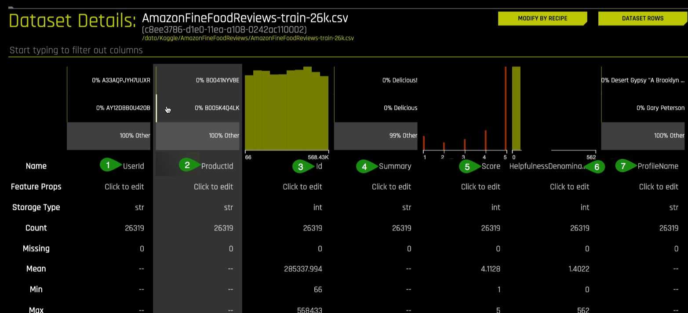

*Things to Note:*

The dataset consists of 10 columns which are as follows:

1.  **UserId** - Unique identifier for the user
2. **ProductId** - Unique identifier for the product
3.  **Id** - Row Id
4.  **Summary** - Brief summary of the review
5.  **Score** - Rating between 1 and 5
6.  **HelpfulnessDenominator** - Number of users who indicated whether they found the review helpful or not
7.  **ProfileName** - Profile name of the user          

4\. Continue scrolling the current page to see more columns (image is not included)

8.  **HelpfulnessNumerator** - Number of users who found the review helpful 
9.  **Time** - Timestamp for the review 
10. **Description** - Text of the review
11.  **Positive Review** - Whether the review is Positive or Negative

5\. Return to the **Datasets** Page

### Launch Experiment


1\. On the Datasets page click on the `AmazonFineFoodReviews-train-26k.csv` dataset and select Predict

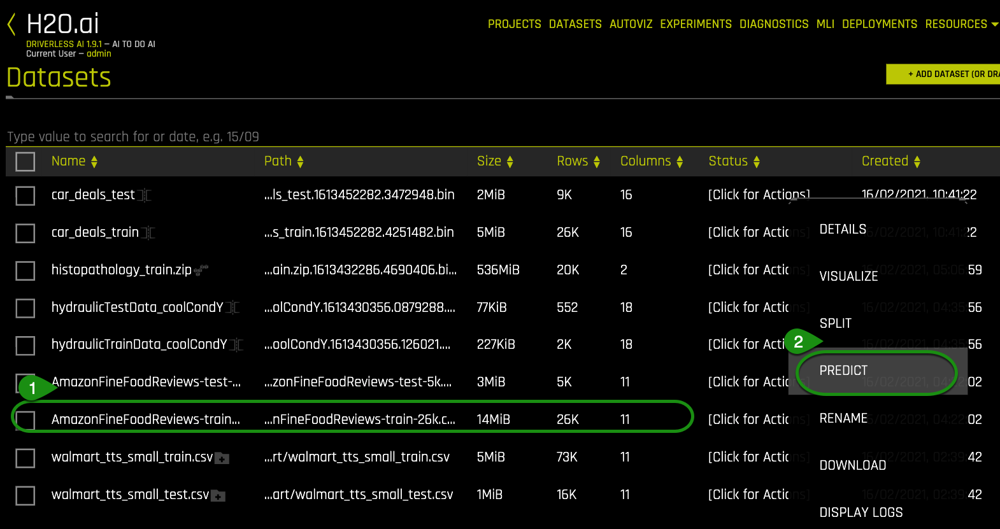

2\. As soon as you select the `Predict` option, you are asked for a tour of Driverless AI environment. Skip it for now by clicking `Not Now`. However, it is recommended to get the intuitive tour incase you are new to the environment. An image similar to the one below should appear. 


3\. Next, you will need to feed in the following information into Driverless AI :

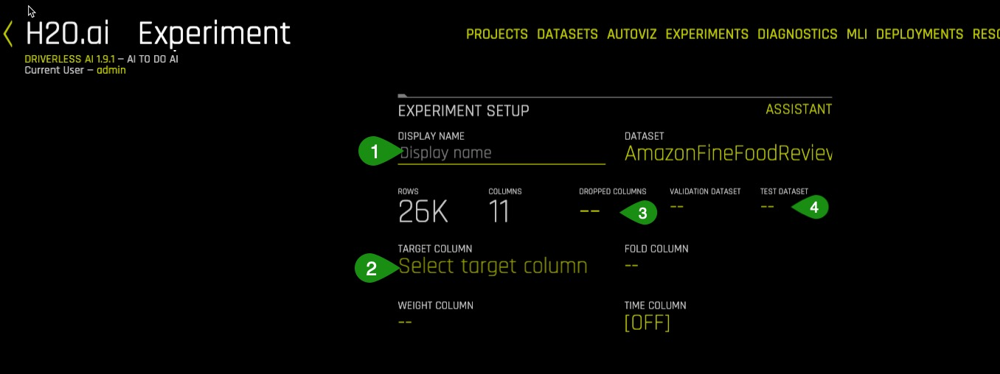

 1. **Display Name** - Give a name to your experiment. You can choose according to your choice but it is recommended to choose a name that highlights the purpose of the experiment. Let's name our current experiment as **Sentiment Analysis**.

 2. **Target Column** -  The *Target column* contains the value that we intend to predict through the experiment. Click on the `Select Target Column` tab and select **Positive Review** as the target column. The aim of the experiment is to try to predict whether a fiven review is positive or negative, hence the Positive Review is selected as the target column. The column has only two values i.e Positive and Negative.

     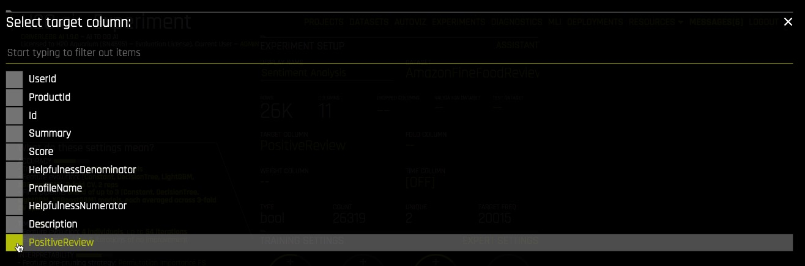

 3. **Dropped Columns** - The *Dropped Columns* feature enable us to  drop column(s) from your dataset that you don't want  to use in the experiment.For this experiment we shall only use the text columns so we shall drop all columns that are not in text format. 


     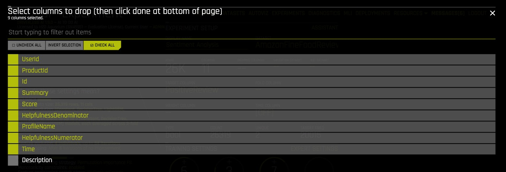
     
     However, please note that if you decide to keep the non-text columns, the NLP algorithms will still work on the non-text columns.

 4. **Test Dataset** -  The *Test dataset* is a dataset used to provide an unbiased evaluation of a _final_ model fit on the training dataset. It is not used during training of the model and results are available at the end of the experiment. Select the `AmazonFineFoodReviews-test-26k.csv` dataset as follows:

     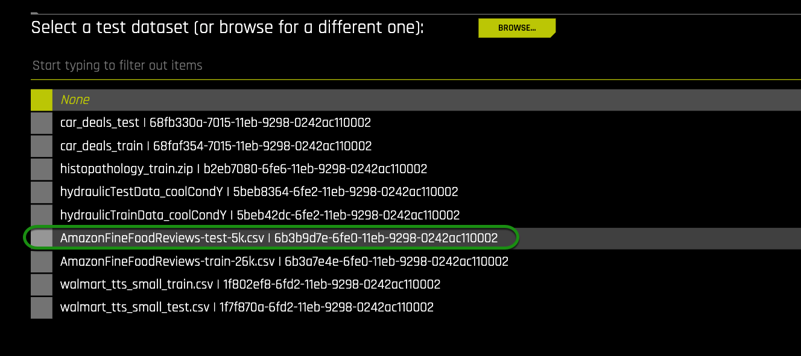

     The experiment screen will finally look like the image below:

     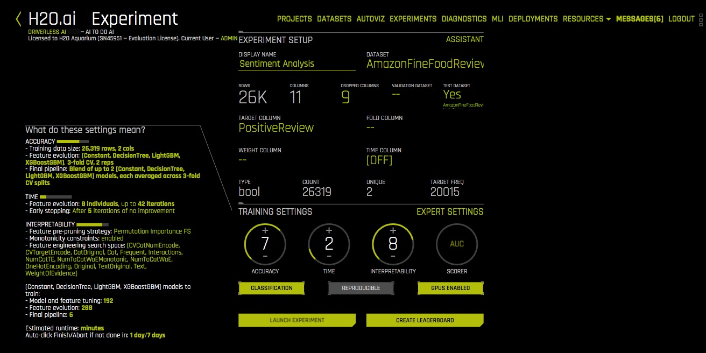

In **Task 2**, we shall explore and update the Experiment Settings.


### Acknowledgement

- [J. McAuley and J. Leskovec. From amateurs to connoisseurs: modeling the evolution of user expertise through online reviews. WWW, 2013.](http://i.stanford.edu/~julian/pdfs/www13.pdf)

### References

[1] [Amazon Fine Food Reviews - Analyze ~500,000 food reviews from Amazon](https://www.kaggle.com/snap/amazon-fine-food-reviews)

[2] [Stanford Network Analysis Project](https://www.kaggle.com/snap)

### Deeper Dive and Resources

- [NLP in Driverless AI documentation](http://docs.h2o.ai/driverless-ai/latest-stable/docs/userguide/nlp.html)


## Task 2: Sentiment Analysis Experiment Settings

Once the data has been imported into Driverless AI, there are certain experiment settings that need to be updated. This section deals with experiment settings with respect to NLP tasks. However, if you wish to learn more about the meaning and various experimental settings in general, It is recommended to go through the following tutorial:

-   [Machine Learning Experiment Scoring and Analysis Tutorial - Financial Focus](https://training.h2o.ai/products/tutorial-1b-machine-learning-experiment-scoring-and-analysis-tutorial-financial-focus)
    
Experiment Settings describe the Accuracy, Time and Interpretability of a specific experiment. The knobs on the experiment settings are adjustable. As values change, the meaning of the settings on the left-bottom page change.

Here are the following settings that need to be updated for a typical NLP experiment.

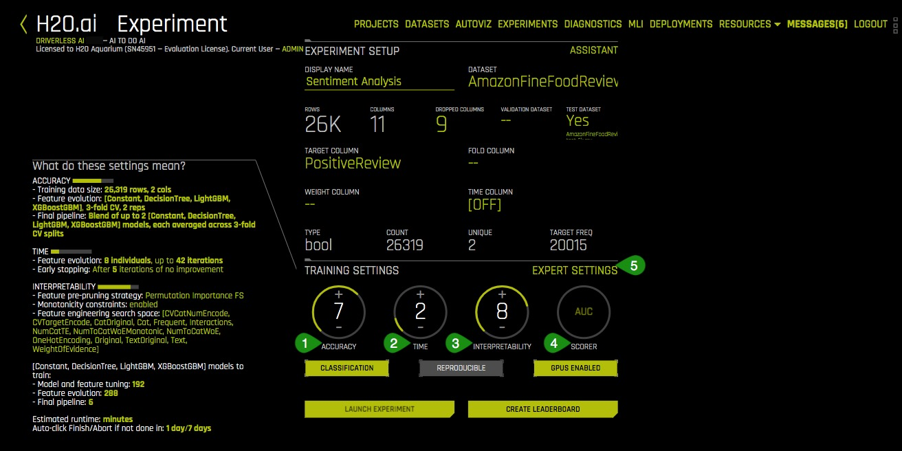

1. Accuracy

2. Time

3. Interpretability

4. Scorer

5. Expert Settings
    
### Accuracy

Accuracy stands for relative accuracy i.e higher values, should lead to higher confidence in model performance (accuracy). The accuracy setting impacts which algorithms are considered, level of assembling and types of feature engineering,

### Time

Time is the Relative time for completing the experiment. Higher values will take longer for the experiment to complete.

### Interpretability

Interpretability is the degree to which a human can understand the cause of the decision. It controls the complexity of the models and features allowed within the experiments (e.g. higher interpretability will generally block complicated features, feature engineering, and models).

### Scorer

Scorer is the metric used to Evaluate the machine learning algorithm. The scorer used for this experiment is the LogLoss or logarithmic loss metric which is used to used to evaluate the performance of a binomial or multinomial classifier. Unlike AUC which looks at how well a model can classify a binary target, logloss evaluates how close a model’s predicted values (uncalibrated probability estimates) are to the actual target value. The lower the Logloss value the better the better the model can predict the sentiment.

###  Expert Settings

Several configurable settings are available for NLP in Driverless AI, which can be tuned according to the experiment type. To tune the NLP settings, click on the Expert Settings, and navigate to the NLP option:

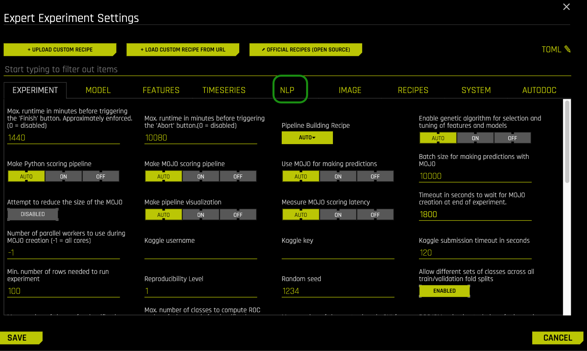

Click on the NLP tab to enable NLP specific settings as shown below. This option allows you to enable the following options for NLP experiments.

- **Word-Based CNN TensorFlow Models for NLP**

Specify whether to use Word-based CNN TensorFlow models for NLP. This option is ignored if TensorFlow is disabled. We recommend that you disable this option on systems that do not use GPUs.

- **Word-Based BiGRU TensorFlow Models for NLP**

Specify whether to use Word-based BiG-RU TensorFlow models for NLP. This option is ignored if TensorFlow is disabled.For this experiment,we shall disable this setting.

- **Character-Based CNN TensorFlow Models for NLP**

Specify whether to use Character-level CNN TensorFlow models for NLP. This option is ignored if TensorFlow is disabled. We recommend that you disable this option on systems that do not use GPUs.

- **PyTorch Models for NLP**

Specify whether to enable pre-trained PyTorch models and fine-tune them for NLP tasks. This is set to Auto by default. You need to set this to On if you want to use the PyTorch models like BERT for feature engineering or for modeling. We recommend that you use GPUs to speed up execution when this option is used. **Please note that for this lab, we are going to leave the setting in AUTO mode**.

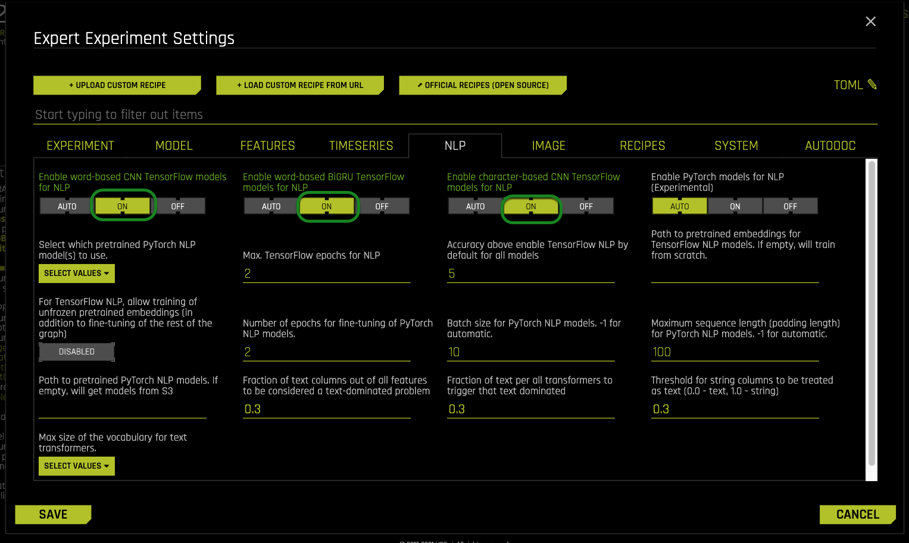

- **Select Which Pretrained PyTorch NLP Models to Use(Optional)**

This setting is to be used if you enable the Pytorch Models. Click on the `Select Which Pretrained PyTorch NLP Models to Use` and specify one or more pretrained PyTorch NLP models to use from the following list:

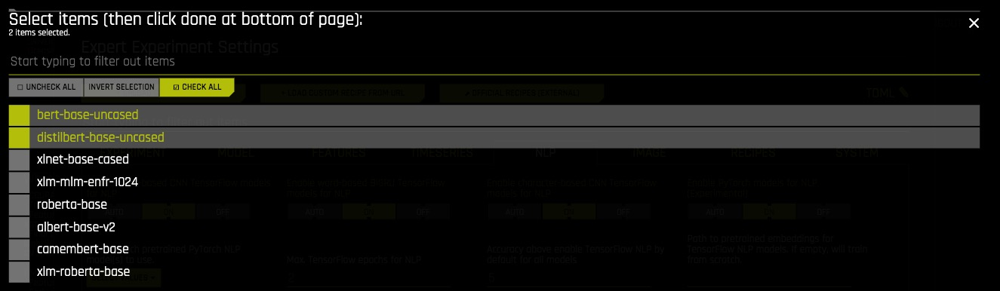

####  Notes:

* This setting requires an Internet connection.

* Using BERT-like models may result in a longer experiment completion time.


Additionally, there are three more buttons located beneath the experimental settings knob which stand for the following:

-   **Classification or Regression**: Driverless AI automatically determines the problem type based on the response column. Though not recommended, you can override this setting by clicking this button. Our current problem is that of Classification.
    
-   **Reproducible**: This button allows you to build an experiment with a random seed and get reproducible results. If this is disabled (default), the results will vary between runs.
    
-   **Enable GPUs**: Specify whether to enable GPUs. (Note that this option is ignored on CPU-only systems.)
    
Update the following experiment settings so that they match the image below, then select Launch Experiment. This configuration is selected to generate a model quickly with a sufficient level of accuracy in the H2O Driverless Test Drive environment.

-   **Accuracy**: 5
    
-   **Time**: 2
    
-   **Interpretability**: 5
    
-   **Scorer**: LogLoss

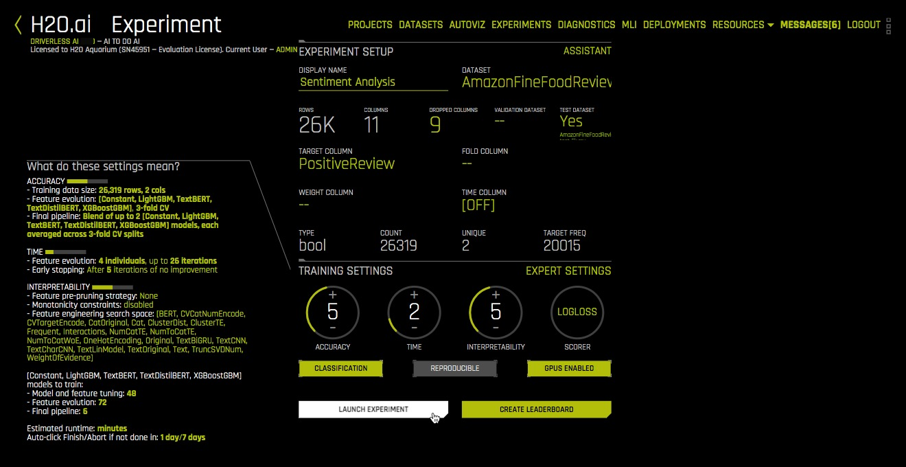

The time to run this experiment depends upon the memory, availability of GPU in a system and the expert settings which have been selected by the user. If the system does not have a GPU, it might run for a longer time.

### Resources

[1] [J. Friedman, B. Popescu. "Predictive Learning via Rule Ensembles". 2005](http://statweb.stanford.edu/~jhf/ftp/RuleFit.pdf)

[2] [Ensemble Learning](https://en.wikipedia.org/wiki/Ensemble_learning)

### Deeper Dive

-   [To better understand the impact of setting the Accuracy, Time and Interpretability Knobs between 1 and 10 in H2O Driverless AI](http://docs.h2o.ai/driverless-ai/latest-stable/docs/userguide/experiment-settings.html?highlight=interpretability#accuracy-time-and-interpretability-knobs)
    
-   [Expert Settings for H2O Driverless AI](http://docs.h2o.ai/driverless-ai/latest-stable/docs/userguide/expert-settings.html?highlight=expert%20settings)


## Task 3: Natural Language Processing Concepts

### Natural Language Processing(NLP)

NLP is the field of study that focuses on the interactions between human language and computers. NLP sits at the intersection of computer science, artificial intelligence, and computational linguistics[1]. NLP is a way for computers to analyze, understand, and derive meaning from human language in a smart and useful way. By utilizing NLP, developers can organize and structure knowledge to perform tasks such as :

-   Automatic tagging of incoming customer queries related to credit card, loans etc
-   Sentiment analysis of Social media reviews
-   Using free text variables along with numeric variables for credit risk, fraud models.
-   Emotion detection
-   Profanity detection

The text data is highly unstructured but the Machine learning algorithms usually work with input features that are numeric in nature. So before we start with any NLP project we need to pre-process and normalize the text to make it ideal for feeding into the commonly available Machine learning algorithms. This essentially means we need to build a pipeline of some sort that breaks down the problem into several pieces. We can then apply various methodologies on these pieces and plug the solution together in the form of a pipeline.

### Building a Typical NLP Pipeline


The figure above shows how a typical pipeline looks like. It is also important to note that there may be variations depending upon the problem at hand. Hence the pipeline will have to be adjusted to suit our needs. Driverless AI automates the above process. Let's try and understand some of the components of the pipeline in brief:

### Text preprocessing

Text pre-processing involves using a variety of techniques to convert raw text into well-defined sequences of linguistic components that have standard structure and notation. Some of those techniques are:

- **Sentence Segmentation:** involves identifying sentence boundaries between words in different sentences. Since most written languages have punctuation marks which occur at sentence boundaries, sentence segmentation is frequently referred to as sentence boundary detection, sentence boundary disambiguation, or sentence boundary recognition. All these terms refer to the same task: determining how a text should be divided into sentences for further processing.

- **Text Tokenization:** Tokenization involves splitting raw text corpus into sentences and then further splitting each sentence into words.

- **Text Standardisation:** Once the text has been tokenized, it is normalised by getting rid of the noise. Noise relates to anything that isn't in a standard format like punctuation marks, special characters or any unwanted tokens. If required, case conversions can also be done i.e converting all tokens into either lowercase or uppercase.

- **Removing Stopwords:** Stop words are words which appear very frequently in a text like "and", "the", and "a", but appear to be of little value in helping select documents. Such words are excluded from the vocabulary entirely.

- **Stemming:** Stemming is the process of reducing inflected (or sometimes derived) words to their stem, base or root form — generally a written word form. Example: if we were to stem the following words: “Stems”, “Stemming”, “Stemmed”, “and "Stemtization”, the result would be a single token “stem”.

- **Lemmatization:** a similar operation to stemming is lemmatization. However, the major difference between the two is that stemming can often create non-existent words, whereas lemmatization creates actual words. An example of lemmatization: “run” is a base form for words like “running” or “ran” and the word “better” and “good” are in the same lemma, so they are considered the same.

It is important to note here that the above steps are not mandatory and their usage depends upon the use case. For instance, in sentiment analysis emoticons signify polarity and stripping them off from the text may not be a good idea. The general goal of the Normalization, Stemming and Lemmatization techniques is to improve the generalization of the model. Essentially we are mapping different variants of what we consider to be the same or very similar "word" to one token in our data.

### Feature Extraction

The Machine Learning Algorithms usually expect features in the form of numeric vectors. Hence, after the initial preprocessing phase, we need to transform the text into a meaningful vector (or array) of numbers. This process is called **feature extraction**. Let's see how some of the feature-extracting techniques work.

- **Bag of Words:** The bag-of-words is a representation of text that describes the occurrence of words within a document. It involves two things:

  - A vocabulary of known words
  - A measure of the presence of known words

The intuition behind the Bag of Words is that documents are similar if they have identical content, and we can get an idea about the meaning of the document from its content alone. 

### [Example implementation](https://en.wikipedia.org/wiki/Bag-of-words_model)

The following models a text document using bag-of-words. Here are two simple text documents:

- John likes to watch movies. Mary likes movies too.
- John also likes to watch football games.
 
 
Based on these two text documents, a list is constructed as follows for each document:

- "John","likes","to","watch","movies","Mary","likes","movies","too"
- "John","also","likes","to","watch","football","games"

Representing each bag-of-words as a JSON object, and attributing to the respective JavaScript variable:

- BoW1 = {"John":1,"likes":2,"to":1,"watch":1,"movies":2,"Mary":1,"too":1};
- BoW2 = {"John":1,"also":1,"likes":1,"to":1,"watch":1,"football":1,"games":1};


It is important to note that BoW does not retain word order and is sensitive towards document length, i.e token frequency counts could be higher for longer documents.

It is also possible to create BoW models with combination of consecutive words, also known as n-grams.

- **TF-IDF Model:** A problem with the Bag of Words approach is that highly frequent words start to dominate in the document (e.g. larger score), but may not contain as much "informational content". Also, it will give more weight to longer documents than the shorter ones. One approach is to rescale the frequency of words by how often they appear in all documents so that the scores for frequent words across all documents are penalized. This approach of scoring is called  **Term Frequency-Inverse Document Frequency**, or TF-IDF [2] for short, where:

     - **Term Frequency**  is a scoring of the frequency of the word in the current document. TF = (Number of times term t appears in a document)/(Number of terms in the document)

    - **Inverse Document Frequency**: is a scoring of how rare the word is across documents.IDF = 1+log(N/n), where N is the number of documents and n is the number of documents a term t has appeared in. TF-IDF weight is often used in information retrieval and text mining. This weight is a statistical measure used to evaluate how important a word is to a document in a collection or corpus


The dimensions of the output vectors are high. This also gives importance to the rare terms that occur in the corpus which might be helpful in our classification tasks.

- **Principal Component Analysis (PCA)**

Principal Component Analysis s a dimension reduction tool that can be used to reduce a large set of variables to a small set that still contains most of the information in the original set

- **Truncated SVD**
    
SVD stands for Singular Value Decomposition[3] which is a way to decompose matrices. Truncated SVD is a common method to reduce the dimension for text-based frequency/vectors.

- **Advanced Word Vectorization Models**
    
TFIDF and frequency-based models represent counts and significant word information, but they lack semantics of the words in general. One of the popular representations of text to overcome this is Word Embeddings.

Word embeddings is a feature engineering technique for text where words or phrases from the vocabulary are mapped to vectors of real numbers. There are ways to create more advanced word vectorization models for extracting features from text data like word2vec[2] model. Released in 2013 by Google, word2vec is a neural network-based implementation that learns distributed vector representations of words based on continuous Bag of Words and skip-gram–based architectures 


Representations are made in such a way that words that have similar meanings are placed close or equidistant to each other. For example, words like ‘king’ is closely associated with “queen” in this vector representation.

- **Convolution neural network(CNN) models on word embeddings**

CNN's are generally used in computer vision, however, they've recently been applied on top of pre-trained word vectors for sentence-level classification tasks and the results were promising[5].

Word embeddings can be passed as inputs to CNN models, and cross-validated predictions are obtained from it. These predictions can then be used as new set of features.

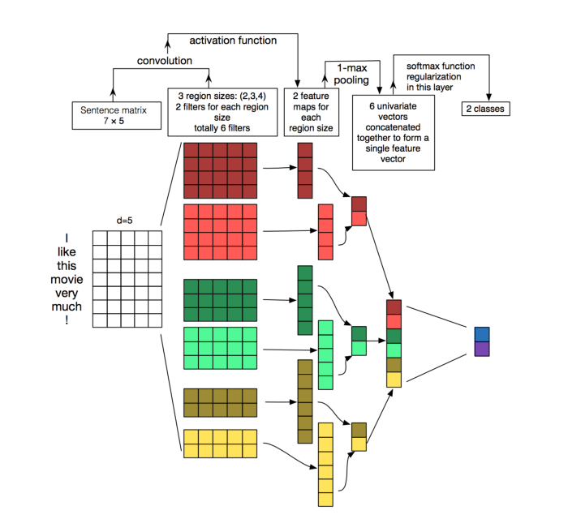

[Image Reference](http://www.wildml.com/2015/11/understanding-convolutional-neural-networks-for-nlp)

- **Recurrent neural networks**

RNNs like LSTM and GRU are state of the art algorithms for NLP problems. Simply, put a Bi-directional GRU model is putting two independent RNN models in one.

For example, in the sentence "John is walking on the golf court", a unidirectional model would represent states with representing "golf" based on "John is walking" but not the "court". However, by using a bi-directional model, the representation would also account for the later representations giving the model more predictive power.
 This makes it a more ‘natural' approach when dealing with textual data since the text is naturally sequential[6].

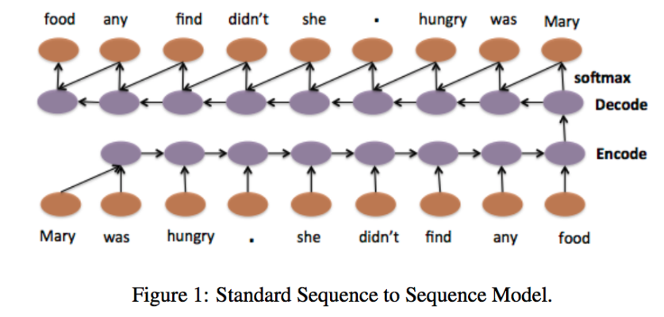

[Image Reference](https://richliao.github.io/supervised/classification/2016/12/26/textclassifier-RNN)

- **Transformer based language models** 

Transformer based language models like BERT are state-of-the-art NLP models that can be used for a wide variety of NLP tasks. These models capture the contextual relation between words by using an attention mechanism. Unlike directional models that read text sequentially, a Transformer-based model reads the entire sequence of text at once, allowing it to learn the context of the word based on all of its surrounding words. The embeddings obtained by these models show improved results in comparison to earlier embedding approaches.


[Image Reference](https://ai.googleblog.com/2018/11/open-sourcing-bert-state-of-art-pre.html)

### Building Text Classification Models

Once the features have been extracted, they can then be used for training a classifier.

### References

[1] [Natural language processing - WIkipedia](https://stackedit.io/%5Bhttps://en.wikipedia.org/wiki/Natural_language_processing%5D(https://en.wikipedia.org/wiki/Natural_language_processing))

[2] [TF-IDF](https://en.wikipedia.org/wiki/Tf%E2%80%93idf)

[3] [SVD](https://en.wikipedia.org/wiki/Singular_value_decomposition)

[4] [Word2vec Model](https://code.google.com/archive/p/word2vec/)

[5] [Understanding Convolutional Neural Networks for NLP](http://www.wildml.com/2015/11/understanding-convolutional-neural-networks-for-nlp/)

[6] [Convolutional Neural Networks for Sentence Classification](https://arxiv.org/pdf/1408.5882.pdf)

[7] [Text Classification, Part 2 - sentence-level Attentional RNN](https://richliao.github.io/supervised/classification/2016/12/26/textclassifier-RNN/)

[8] [Attention Is All You Need](https://arxiv.org/abs/1706.03762)

[9] [BERT: Pre-training of Deep Bidirectional Transformers for Language Understanding](https://arxiv.org/abs/1810.04805)

### Deeper Dive and Resources

-   [Jurafsky, Daniel and James Martin (2008) Speech and Language Processing (Second Edition). Prentice Hall](https://stackedit.io/%5Bhttps://web.stanford.edu/~jurafsky/slp3/ed3book.pdf%5D(https://web.stanford.edu/~jurafsky/slp3/ed3book.pdf))

-   [Natural Language Processing with Python : Steven Bird, Ewan Klein, and Edward Loper](https://www.nltk.org/book/)

## Task 4: Driverless AI NLP Recipe

*Note: This section included all the current capabilities of Driverless AI's NLP module. Not all the settings have been demonstrated in the current sentiment analysis experiment.*

Text data can contain critical information to inform better predictions. Driverless AI automatically converts text strings into features using powerful techniques like TFIDF, CNN, and GRU. Driverless AI now also includes state-of-the-art PyTorch BERT transformers that can be used for Feature Engineering or as Modeling Algorithms. With advanced NLP techniques, Driverless AI can process larger text blocks and build models using all available data and to solve business problems like sentiment analysis, document classification, and content tagging.

The Driverless AI platform has the ability to support both standalone text and text with other columns as predictive features. In particular, the following NLP recipes are available for a given text column:


### Key Capabilities of Driverless AI NLP Recipe
- **n-grams**

An n-gram is a continuous sequence of n items from a given sample of text or speech.

- **TFIDF of n-grams**

Frequency-based features can be multiplied with the inverse document frequency to get term frequency–inverse document frequency (TF-IDF) vectors. Doing so also gives importance to the rare terms that occur in the corpus, which may be helpful in certain classification tasks.

- **Frequency of n-grams**

Frequency-based features represent the count of each word from a given text in the form of vectors. These are created for different n-gram values. For example, a one-gram is equivalent to a single word, a two-gram is equivalent to two consecutive words paired together, and so on.

Words and n-grams that occur more often will receive a higher weightage. The ones that are rare will receive a lower weightage.

- **Truncated SVD Features**

Both TFIDF and Frequency of n-grams result in a higher dimension. To tackle this, we use Truncated SVD to decompose the vector arrays in lower dimensions.

- **Linear models on TF/IDF vectors**

In our NLP recipe, we also have linear models on top of n-gram TFIDF / frequency vectors. This capture linear dependencies that are simple yet significant in achieving the best accuracies.

- **Word Embeddings**

Driverless AI NLP recipe makes use of the power of word embeddings where words or phrases from the vocabulary are mapped to vectors of real numbers.

- **Bi-direction GRU models on Word Embeddings(TensorFlow)**

A Bi-directional GRU model is like putting two independent RNN models in one. Taking note of accuracy as well as speed in our experiments, we have decided to take advantage of high speed and almost similar accuracies of GRU architecture compared to its counterpart LSTM.

- **Convolution neural network models on:**

     - **Word embeddings followed by CNN model (TensorFlow)**

     In Driverless AI, we pass word embeddings as input to CNN models, get cross-validated predictions from it and use them as a new set of features.

     - **Character embeddings followed by CNN model (TensorFlow)**

     Natural language processing is complex as the language is hard to understand given small data and different languages. Targeting languages like Japanese, Chinese where characters play a major role, we have character level embeddings in our recipe as well.

     In character embeddings, each character gets represented in the form of vectors rather than words. Driverless AI uses character level embeddings as input to CNN models and later extracts class probabilities to feed as features for downstream models: this gives the ability to work in languages other than English. In languages like Japanese and Chinese, where there is no concept of words, character embeddings will be useful.

- **BERT/DistilBERT based embeddings for Feature Engineering (PyTorch):**

BERT and [DistilBERT](https://arxiv.org/abs/1910.01108) models can be used for generating embeddings for any text columns. These pre-trained models are used to get embeddings for the text followed by Linear/Logistic Regression to generate features that can then be used for any downstream models in Driverless AI.

- **PyTorch Transformer Architecture Models (eg. BERT) as Modeling Algorithms:**

Starting with Driverless AI 1.9 release, the Transformer-based architectures shown in the diagram below are supported as models in Driverless AI.


The BERT model supports multiple languages. [DistilBERT](https://arxiv.org/abs/1910.01108) is a distilled version of BERT that has fewer parameters compared to BERT (40% less) and it is faster (60% speedup) while retaining 95% of BERT level performance. The DistilBERT model can be useful when training time and model size is important

- **Domain Specific BERT Recipes**

DAI Base BERT model can also be extended for domain specific problems

- [FinBERT](https://github.com/ProsusAI/finBERT) (trained on financial text)
- [SciBERT](https://github.com/allenai/scibert) (trained on scientific text)
- [BioBERT](https://github.com/dmis-lab/biobert) (trained on bio-medical text)


### Deeper Dive and Resources

- [Text Classification with H2O Driverless AI - A Look Under the Hood](https://www.youtube.com/watch?v=8bumqmOfIYs&t=1488s)
- [State of The Art NLP Models in H2O Driverless AI 1.9](https://www.h2o.ai/webinars/?commid=428217)


### Industry Use Cases leveraging NLP

-   [ArmadaHealth: Understanding Sentiment to impact lives](https://www.youtube.com/watch?v=D0e-1gedK6g&feature=youtu.be)
-   [The AI Academy is accelerating NLP projects with Driverless AI](https://youtu.be/aXPE6IiKRmI)
-   [Martin Stein, G5 - Driving Marketing Performance with H2O Driverless AI](https://www.youtube.com/watch?v=f4b2Yoe9JEs&feature=youtu.be)


## Task 5: Experiment Results Summary

After an experiment status changes from `RUNNING` to `COMPLETE`, the UI provides you with several options:

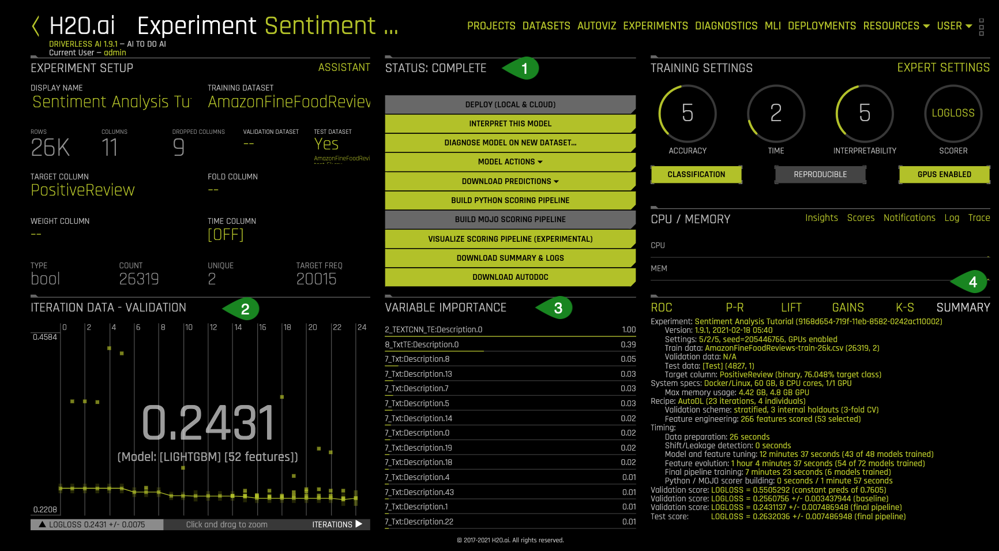

The Experiment Summary contains a lot of useful information which helps to understand what goes under the hood during the Sentiment Analysis Experiment. If you are interested in learning more about each plot and the metrics derived from those plots covered in this section, then check out this tutorial [Machine Learning Experiment Scoring and Analysis Tutorial - Financial Focus](https://training.h2o.ai/products/tutorial-1b-machine-learning-experiment-scoring-and-analysis-tutorial-financial-focus).

Please note that the lab also provides a pre-ran experiment. You can either wait for your experiments to finish or use the results of the pre-ran experiment. Click on the **Experiments** tab and select the Amazon Fine Food reviews experiment as follows:

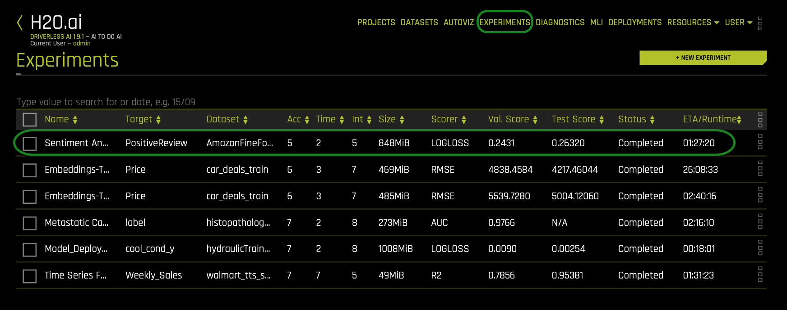

_Things to Note:_

1. Status Complete Options
    
     -  **Deploy:** Whether to deploy the Model to Cloud or keep it local.
     -  **Interpret this Model** - Refers to  Interpreting a machine learning model  in a human-readable format. 


          Click on `Intrepret this Model` button on the completed experiment page to interpret the  Driverless AI NLP model on original and transformed features. This launches the Model Interpretation for that experiment. This page provides several visual explanations and reason codes for the trained  model and its results. Here we shall only go through the explanation of the NLP specific models. For the rest,refer to the tutorial-[Machine Learning Experiment Scoring and Analysis Tutorial - Financial Focus](https://training.h2o.ai/products/tutorial-1b-machine-learning-experiment-scoring-and-analysis-tutorial-financial-focus).

           - **NLP TOKENS**

          This plot is available for natural language processing (NLP) models. It is located in the Dataset tab on the Model Interpretation page (only visible  for NLP models). It shows both the global and local importance values of each token in a corpus (a large and structured set of texts). The corpus is automatically generated from text features used by Driverless AI models prior to the process of tokenization.


           - **NLP LOCO**

           This plot is available for natural language processing (NLP) models. It applies a leave-one-covariate-out (LOCO) styled approach to NLP models by removing a specific token from all text features in a record and predicting local importance without that token. The difference between the resulting score and the original score (token included) is useful when trying to determine how specific changes to text features alter the predictions made by the model.
        
     - **Diagnose Model on New Dataset**  - Allows you to view model performance for multiple scorers based on existing model and a test dataset
     - **Score on another Dataset**  - After you generate a model, you can use that model to make predictions on another dataset.
     - **Transform Another Dataset** - One can specify to transform the new dataset after adding it to Driverless AI, and the same transformations that Driverless AI applied to the original dataset will be applied to these new rows.

     - **Download Predictions**
          - **Training (Holdout) Predictions** : In csv format, available if a validation set was NOT provided.
          - **Validation Set Predictions** : In csv format, available if a validation set was provided.
          - **Test Set Predictions** : In csv format, available if a test dataset is used.
     - **Build Python Scoring Pipeline**  - A standalone Python scoring pipeline for H2O Driverless AI
     - **Build MOJO Scoring Pipeline** - A standalone Model ObJect, Optimized scoring pipeline that can be easily embeddable in java environment'
     - **Visualize Scoring Pipeline(Experimental)** - Opens an experiment pipeline visualization page. Refer to [Visualizing the Scoring Pipeline](http://docs.h2o.ai/driverless-ai/latest-stable/docs/userguide/scoring_pipeline_visualize.html#visualize-scoring-pipeline).
     - **Download Summary and Logs**  - An experiment summary is available for each completed experiment as zip file.
     - **Download AutoReport** - A Word version of an auto-generated report for the experiment. This file is also available in the Experiment Summary zip file.

2. Iteration Data - Validation

      - The winning model's validation score and the algorithm used are as follows:
           - Validation Score - .2207
           - Model Type: TEXTBERT


3. Variable Importance: Summary of top 20 - Feature Engineered variables

     Driverless AI performs feature Engineering on the dataset to determine the optimal representation of the data. Various stages of the features appear throughout the iteration of the data. These can be viewed by hovering over points on the Iteration Data - Validation Graph and seeing the updates on the  **Variable Importance** section.

 
      


      The complete list of features used in the final model is available in the Experiment Summary artifacts. The Experiment Summary also provides a list of the original features and their estimated feature importance.

4. Summary

     This option gives a brief summary of the entire experiment including :

     -   How many features were tested and selected?
     -   How many models were trained for feature evolution?

There are also several plots adjacent to the summary tab that give insight into the experiment. If you are interested in learning more about each plot and the metrics derived from those plots covered in this section, then check out our next tutorial [Machine Learning Experiment Scoring and Analysis Tutorial - Financial Focus](https://training.h2o.ai/products/tutorial-1b-machine-learning-experiment-scoring-and-analysis-tutorial-financial-focus).

### Deeper Dive and Resources

-   [Learn more about running Experiments from H2O Driverless AI docs](http://docs.h2o.ai/driverless-ai/latest-stable/docs/userguide/running-experiment.html#)
-   [Explore Documentation on Completed Experiments](http://docs.h2o.ai/driverless-ai/latest-stable/docs/userguide/experiment-completed.html)
-   [Explore Documentation on Experiment Summary](http://docs.h2o.ai/driverless-ai/latest-stable/docs/userguide/experiment-summary.html)
-   [Review the Driverless AI Booklet to learn more about running experiments](http://docs.h2o.ai/driverless-ai/latest-stable/docs/booklets/DriverlessAIBooklet.pdf)
-   [Learn more about Driverless AI Transformations](http://docs.h2o.ai/driverless-ai/latest-stable/docs/userguide/transformations.html)
-   [Feature Engineering for ML by Dmitry Lark](https://www.youtube.com/playlist?list=PLrsf4weWJKynQBvh0i-YxDDVqCcIrF28o)


## Task 6: Custom Recipe to Improve Predictions

The latest version(1.9.0) of Driverless AI implements a key feature called BYOR[1], which stands for Bring Your Own Recipes and was introduced in with Driverless AI (1.7.0). This feature has been designed to enable Data Scientists or domain experts to influence and customize the machine learning optimization used by Driverless AI as per their business needs. This additional feature engineering technique is aimed towards improving the accuracy of the model.

Recipes are customizations and extensions to the Driverless AI platform. TThey are nothing but Python code snippets uploaded into Driverless AI at runtime, like plugins. Recipes can be either one or a combination of the following:

-   Custom machine learning models
-   Custom scorers (classification or regression)
-   Custom transformers  


### Uploading a Custom Recipe

H2O has built and open-sourced several recipes[2] which can be used as templates. For this experiment, we shall use the following recipe: [text_sentiment_transformer.py](https://github.com/h2oai/driverlessai-recipes/blob/master/transformers/nlp/text_sentiment_transformer.py) which extracts sentiment from text using pre-trained models from TextBlob[3].

1\. Start a new Driverless AI experiment as explained in Task 1 and Task 2 and click on the Expert Settings.

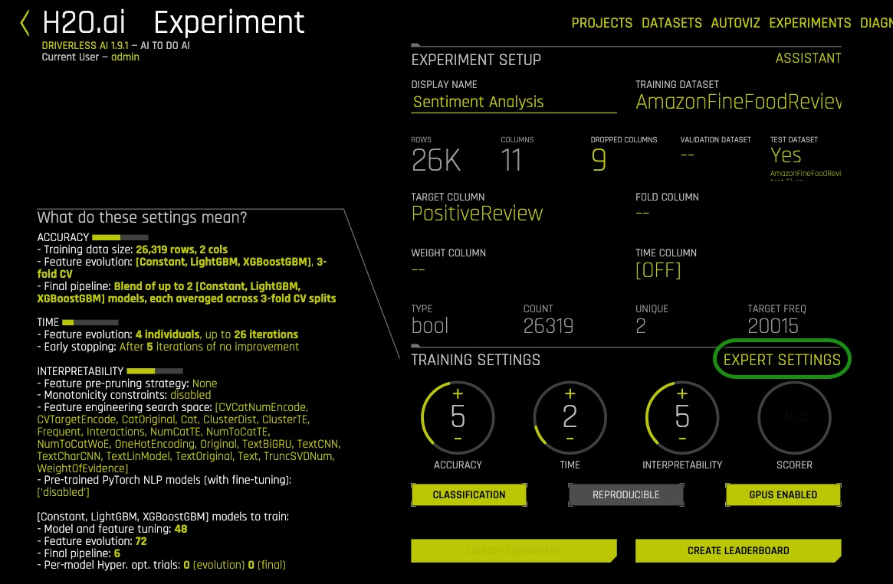

2\. A new window with Expert Experiment Settings pops up. Here you can either upload a custom recipe or load custom recipe from url.

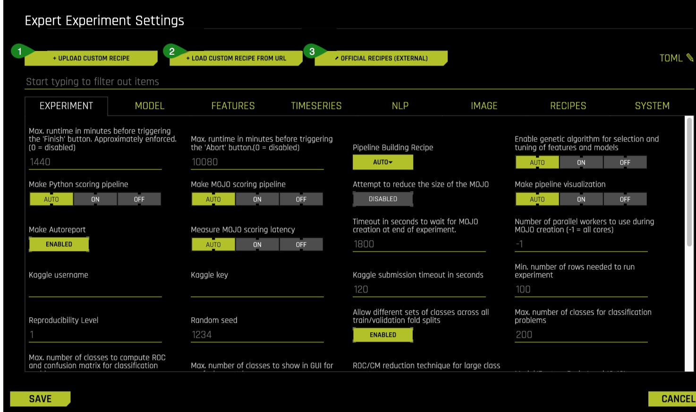

3\. To upload a custom recipe, Click on the UPLOAD CUSTOM RECIPE tab and select the desired recipe. Click save when done.


4\. Alternately, you can also upload a recipe via URL. Click on the LOAD CUSTOM RECIPE FROM URL tab and enter the raw Github URL of the recipe. Click save when done
    
```
https://raw.githubusercontent.com/h2oai/driverlessai-recipes/rel-1.9.1/transformers/nlp/text_sentiment_transformer.py
```
  


5\. You’re welcome to create your own recipes, or you can select from a number of available recipes.  The OFFICIAL RECIPES(EXTERNAL) tab will directly take you to the recipes compatible with the Driverless AI version that you are using.

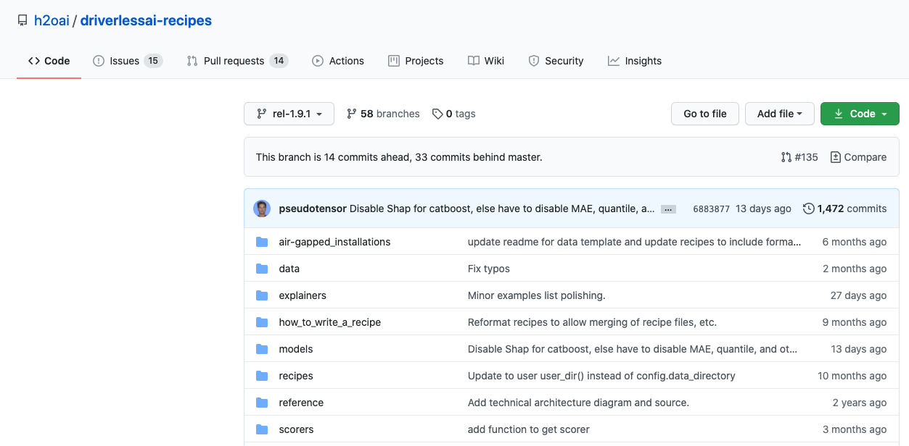

6\. Once the recipe is uploaded, the following screen will appear. Driverless AI automatically performs basic acceptance tests for all custom recipes unless disabled.


7\. Click on Recipe and select or deselect specific transformers, models and scorers.

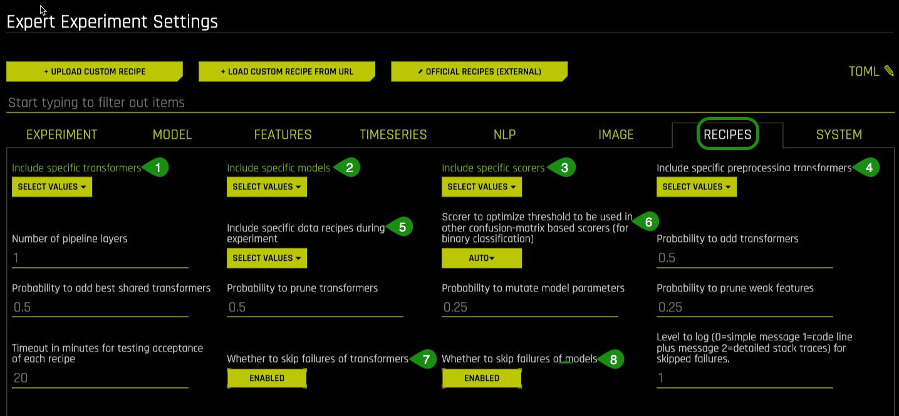

*Things to Note*

1. Select specific Transformers
    
2. Select specific Models
    
3. Select specific Scorers

4. Include specific preprocessing Transformers

5. Include specific data recipes during experiment

6. Scorer to optimize threshold
    
7. Enable if you want to skip failure of transformers
    
8. Enable if you want to skip failure of models
    
    
8\. Click Save to save the settings. The selected transformer should now appear on the main Experiment screen as follows.

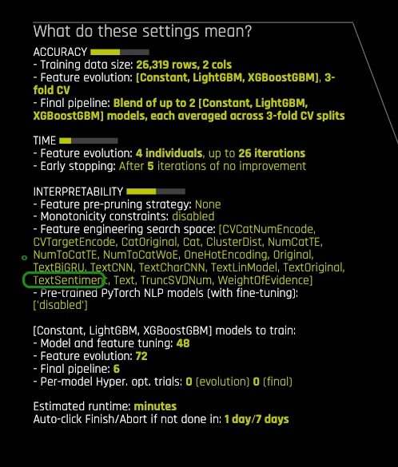

9\. Launch the Experiment with the Custom Recipe.

### References

[1] [Custom Machine Learning Recipes: The ingredients for success](https://www.h2o.ai/blog/custom-machine-learning-recipes-the-ingredients-for-success/)

[2] [Driverless AI Recipes](https://github.com/h2oai/driverlessai-recipes)

[3] [TextBlob](https://textblob.readthedocs.io/en/dev/)

### Deeper Dive and Resources

- [Get Started and Consume Existing Recipes](https://h2oai.github.io/tutorials/get-started-and-consume-existing-recipes)

##  Task 7: Challenge

It's time to test your skills!

The challenge is to analyze and perform Sentiment Analysis on the tweets using the US Airline Sentiment dataset. This will help to gauge people's sentiments about each of the major U.S. airline.

This data comes from  [Crowdflower's Data for Everyone library](http://www.crowdflower.com/data-for-everyone)  and constitutes twitter reviews about how travellers in February 2015 expressed their feelings on Twitter about every major U.S. airline. The reviews have been classified as positive, negative, and neutral.

### Steps:

1\. Import the dataset from here:

-   [Airline-Sentiment-2-w-AA](https://data.world/crowdflower/airline-twitter-sentiment)

Here are some samples from the dataset:


2\. Split the dataset into a training set and a testing set in an 80:20 ratio.

3\. Run an experiment where the target column is "**airline_sentiment**" using only the default Transformers. You can exclude all other columns from the dataset except the ‘text' column.

4\. Run another instance of the same experiment but this time also include Tensorflow models in addition to the built in transformers.

5\. Next, repeat the experiment with a custom recipe from [here](https://github.com/h2oai/driverlessai-recipes/blob/master/README.md#sample-recipes).

6\. Using Logloss as the scorer, observe the following outcomes:

- Which experiment out of the three gives the minimum Logloss value and why?
- How variable importance changes as you change the selected transformers.

### Deeper Dive and Resources

- [Try running an experiment without the Driverless AI UI using the Python Client](https://github.com/h2oai/driverlessai-tutorials/blob/master/driverlessai_experiments/nlp/airline_sentiment_experiment/demo_nlp_airline_sentiment.ipynb)

## Task 8: Appendix A: Add the Datasets

### Add the Datasets

Import Amazon Fine Food Reviews training and test datasets to the Datasets Overview Page.

1\. Select +Add Dataset(or Drag and Drop) then click on File System

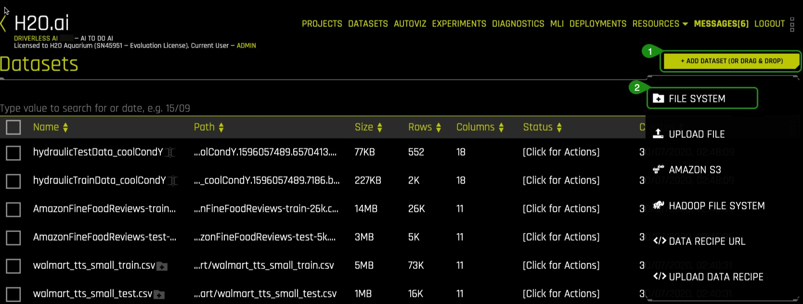

2\. Enter the following : `data/Kaggle/AmazonFineFoodReviews/` into the search bar

3\. Select AmazonFineFoodReviews’ training and test datasets.


4\. Click to Import Selection

5\. If the file loaded successfully then the following image should appear on the screen

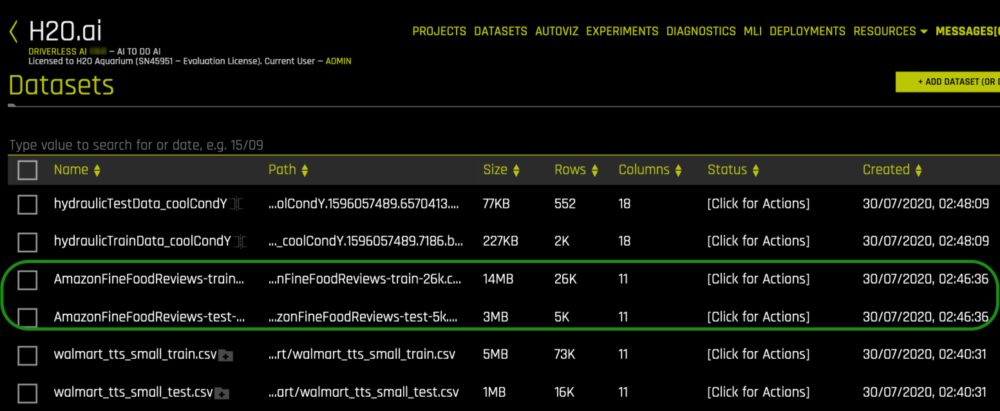

You can see that a new set of datasets now appear on the screen.

## Next Steps

Check out the [Get Started with Open Source Custom Recipes](https://training.h2o.ai/products/tutorial-3a-get-started-with-open-source-custom-recipes-tutorial) tutorial, where you will learn:

- What is Bring Your Own Recipe
- What is a recipe
- Types of Driverless AI open-source recipes available
- How to upload the recipes into Driverless AI as raw URL’s and .py files
- Compared the final models of the experiments that were run with custom recipes to Driverless AI’s default settings experiment
