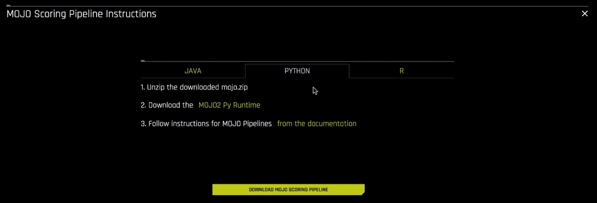
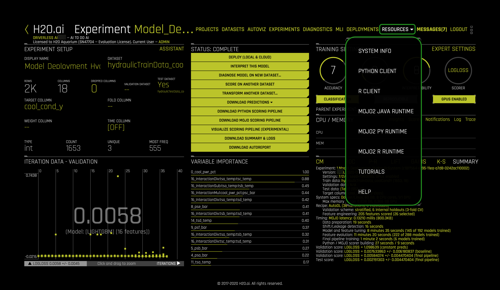
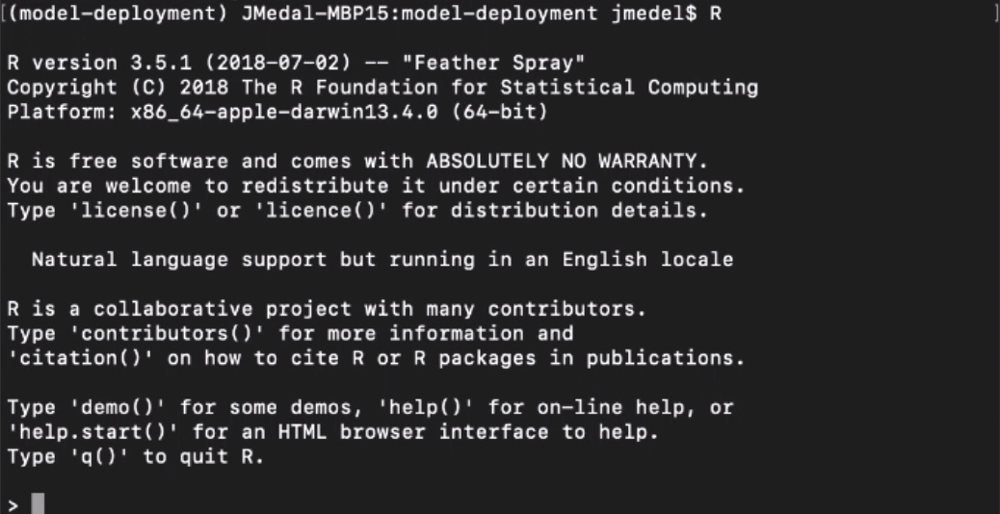
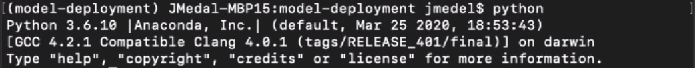
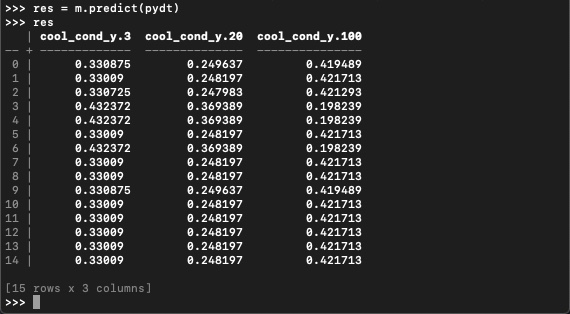

# Scoring Pipeline Deployment in C++ Runtime

## Outline

- [Objective](#objective)
- [Prerequisites](#prerequisites)
- [Task 1: Set Up Environment](#task-1-set-up-environment)
- [Task 2: Deploy Scoring Pipeline in C++ Runtime Concepts](#task-2-deploy-scoring-pipeline-in-c-runtime-concepts)
- [Task 3: Batch Scoring via Scoring Pipeline Execution](#task-3-batch-scoring-via-scoring-pipeline-execution)
- [Task 4: Challenge](#task-4-challenge)
- [Next Steps](#next-steps)
- [Appendix A: Glossary](#appendix-a-glossary)

## Objective

**Machine Learning Model Deployment** is the process of making your model available in production environments, so they can be used to make predictions for other software systems [1]. Before model deployment, **feature engineering** occurs in the form of preparing data that later on will be used to train a model [2]. Driverless AI **Automatic Machine Learning (AutoML)** combines the best feature engineering and one or more **machine learning models** into a scoring pipeline [3][4]. The **scoring pipeline** is used to score or predict data when given new test data [5]. The scoring pipeline comes in two flavors. The first scoring pipeline is a **Model Object, Optimized(MOJO) Scoring Pipeline**, which is a standalone, low-latency model object designed to be easily embeddable in production environments. The second scoring pipeline is a Python Scoring Pipeline, which has a heavy footprint that is all Python and uses the latest libraries of Driverless AI to allow for executing custom scoring recipes[6].

By the end of this tutorial, you will predict the **cooling condition** for a **Hydraulic System Test Rig** by deploying an **embeddable MOJO Scoring Pipeline** into C++ Runtime using **Python** and **R**. The Hydraulic System Test Rig data comes from [UCI Machine Learning Repository: Condition Monitoring of Hydraulic Systems Data Set](https://archive.ics.uci.edu/ml/datasets/Condition+monitoring+of+hydraulic+systems#). Hydraulic System Test Rigs are used to test components in Aircraft Equipment, Ministry of Defense, Automotive Applications, and more [7]. This Hydraulic Test Rig is capable of testing a range of flow rates that can achieve different pressures with the ability to heat and cool to simulate testing under different conditions [8]. Testing the pressure, volume flow and temperature is possible by Hydraulic Test Rig sensors and digital displays. The display panel alerts the user when certain testing criteria is met displaying either a green/red light [8]. A filter blockage panel indicator is integrated into the panel to ensure the Hydraulic Test Rig’s oil is maintained [8]. The cooling filtration solution is designed to minimize power consumption and expand the life of the Hydraulic Test Rig. We are predicting cooling conditions for Hydraulic System Predictive Maintenance. When the cooling condition is low, our prediction tells us that the cooling of the Hydraulic System is close to total failure and we may need to look into replacing the cooling filtration solution soon.


Figure: Hydraulic Test Rig General Cylinder Diagram

The Hydraulic Test Rig consists of a primary and secondary cooling filtration circuit with pumps that deliver flow and pressure to the oil tank. The oil tank box at the bottom. There is a pressure relief control valve for controlling the rising and falling flows. There is a pressure gauge for measuring the pressure. 


### Resources

[1] H2O.ai Community AI Glossary: [Machine Learning Model Deployment](https://www.h2o.ai/community/glossary/machine-learning-model-deployment-productionization-productionizing-machine-learning-models)

[2] H2O.ai Community AI Glossary: [Feature Engineering](https://www.h2o.ai/community/glossary/feature-engineering-data-transformation)

[3] H2O.ai Community AI Glossary: [Automatic Machine Learning (AutoML)](https://www.h2o.ai/community/glossary/automatic-machine-learning-automl)

[4] H2O.ai Community AI Glossary: [Machine Learning Model](https://www.h2o.ai/community/glossary/machine-learning-model)

[5] H2O.ai Community AI Glossary: [Scoring Pipeline](https://www.h2o.ai/community/glossary/scoring-pipeline)

[6] H2O.ai Community AI Glossary: [Model Object, Optimized (MOJO) Scoring Pipeline](https://www.h2o.ai/community/glossary/model-object-optimized-mojo)

[7] [SAVERY - HYDRAULIC TEST RIGS AND BENCHES](https://www.savery.co.uk/systems/test-benches)

[8] [HYDROTECHNIK - Flow and Temperature Testing Components](https://www.hydrotechnik.co.uk/flow-and-temperature-hydraulic-test-bed)


## Prerequisites

- Skilled in Python and/or R Programming
- Driverless AI Environment
- Driverless AI License
    - 21 day trial license
    - It is needed for using the MOJO2 C++ Runtime Python Wrapper API and R Wrapper API to execute the MOJO Scoring Pipeline for making predictions
    - If you need to purchase a Driverless AI license, reach out to our sales team via the [**contact us form**](https://www.h2o.ai/company/contact/).
- Linux OS (x86 or IBM Power PC) or Mac OS X (10.9 or newer)
- Anaconda or Miniconda
- Basic knowledge of Driverless AI or doing the following tutorials:
    - [Automatic Machine Learning Introduction with Driverless AI Test Drive Tutorial.](https://training.h2o.ai/products/tutorial-1a-automatic-machine-learning-introduction-with-driverless-ai)
    - [Tutorial 1: Scoring Pipeline Deployment Introduction](https://training.h2o.ai/products/tutorial-4a-scoring-pipeline-deployment-introduction#tab-product_tab_overview)
    - [Tutorial 2: Scoring Pipeline Deployment Templates](https://training.h2o.ai/products/tutorial-4b-scoring-pipeline-deployment-templates)

## Task 1: Set Up Environment

### Create Environment Directory Structure

```
# Create directory structure for DAI MOJO C++ Projects

# Create directory where the mojo-pipeline/ folder will be stored
mkdir $HOME/dai-mojo-cpp/

```

### Set Up Driverless AI MOJO Requirements

#### Download MOJO Scoring Pipeline

1. If you have not downloaded the MOJO Scoring Pipeline, go to [Tutorial 2: Scoring Pipeline Deployment](https://docs.google.com/document/d/1WKSdH-MNjNQOPWA7xthDpmQytcDc07p_Xua8Rsa_jVk/edit?usp=sharing) Templates, then go to Task 1: Set Up Environment, then **Download MOJO Scoring Pipeline** to download it. When finished, come back to this tutorial.
1. If you have not downloaded the MOJO Scoring Pipeline, go to [Tutorial 2: Scoring Pipeline Deployment Templates](https://training.h2o.ai/products/tutorial-4b-scoring-pipeline-deployment-templates) , then go to Task 1: Set Up Environment, then **Download MOJO Scoring Pipeline** to download it. When finished, come back to this tutorial.

2. Move the **mojo.zip** file to **dai-mojo-cpp**/ folder and then extract it:

```
cd $HOME/dai-mojo-cpp/
mv $HOME/Downloads/mojo.zip .
unzip mojo.zip
```

#### Download MOJO2 Python and R Runtime

We can download the **MOJO2 C++ Runtime Python Wrapper API and R Wrapper API** in Driverless AI. There are 2 places where we can download the MOJO2 Python and R runtime. 

1. The first place is by clicking on **Download MOJO Scoring Pipeline**, then click Python and click **Download the MOJO2 Py Runtime** hyperlink.



2. Similar for the MOJO2 R runtime, click R, then **Download the MOJO2 R Runtime** hyperlink.


3. The second place you can find these runtimes is under **Resources** dropdown.



4. Click **MOJO2 Py Runtime** and/or **MOJO2 R Runtime** to download the runtime.

5. Download and install Anaconda:

```
# Download Anaconda
wget https://repo.anaconda.com/archive/Anaconda3-2020.02-Linux-x86_64.sh

# Install Anaconda
bash Anaconda3-2020.02-Linux-x86_64.sh
```

6. Move the **MOJO2 Py Runtime** file to $HOME folder:

```
cd $HOME

# If you have Mac, Move the MOJO2 Py runtime for Mac OS X to $HOME folder
mv $HOME/Downloads/daimojo-2.2.0-cp36-cp36m-macosx_10_7_x86_64.whl .
 
# If you have Linux, Move the MOJO2 Py runtime for Linux x86 to $HOME folder
mv $HOME/Downloads/daimojo-2.2.0-cp36-cp36m-linux_x86_64.whl .
 
# If you have Linux PPC, Move the MOJO2 Py runtime for Linux PPC to $HOME folder
mv $HOME/Downloads/daimojo-2.2.0-cp36-cp36m-linux_ppc64le.whl .
```

7. Move the **MOJO2 R Runtime** file to $HOME folder:

```
cd $HOME
# If you have Mac, Move the MOJO2 R runtime for Mac OS X to $HOME folder
mv $HOME/Downloads/daimojo_2.2.0_x86_64-darwin.tar.gz .
 
# If you have Linux, Move the MOJO2 R runtime for Linux x86 to $HOME folder
mv $HOME/Downloads/daimojo_2.2.0_x86_64-linux.tar.gz .
 
# If you have Linux PPC, Move the MOJO2 R runtime for Linux PPC to $HOME folder
mv $HOME/Downloads/daimojo_2.2.0_ppc64le-linux.tar.gz .
```

### Install MOJO2 Python and R Runtime Dependencies

8. Create virtual environment and install Python and R packages in it

```
# Install Python 3.6.10
conda create -y -n model-deployment python=3.6
conda activate model-deployment
```

9. Install Python Packages

```
# Install Python Packages
# Install datable 0.10.1
pip install datatable
# Install pandas
pip install pandas
# Install scipy
pip install scipy
```

10. Depending on your OS, run one of the following commands to install **MOJO2 Py Runtime**:

```
# Install the MOJO2 Py runtime on Mac OS X
pip install $HOME/daimojo-2.2.0-cp36-cp36m-macosx_10_7_x86_64.whl
 
# Install the MOJO2 Py runtime on Linux x86
pip install $HOME/daimojo-2.2.0-cp36-cp36m-linux_x86_64.whl
 
# Install the MOJO2 Py runtime on Linux PPC
pip install $HOME/daimojo-2.2.0-cp36-cp36m-linux_ppc64le.whl
```

11. Install R packages

```
# Install R Packages
# Install R r-essentials 3.6.0
conda install -y -c r r-essentials

# Install R r-rcpp 1.0.3
conda install -y -c conda-forge r-rcpp=1.0.3

# Install R data.table
conda install -y -c r r-data.table
```

### Set Driverless AI License Key

12. Set the Driverless AI License Key as a temporary environment variable

```
# Set Driverless AI License Key
export DRIVERLESS_AI_LICENSE_KEY="{license-key}"
```

## Task 2: Deploy Scoring Pipeline in C++ Runtime Concepts

### MOJO Scoring Pipeline Files

After downloading the MOJO scoring pipeline, the **mojo-pipeline** folder comes with many files needed to execute the MOJO scoring pipeline, which include **pipeline.mojo** and **example.csv**. However, the **mojo-pipeline** folder does not come with the MOJO2 Py Runtime or MOJO2 R Runtime. These two MOJO2 APIs can be downloaded as separate assets from Driverless AI. The **pipeline.mojo** is the standalone scoring pipeline in MOJO format. This pipeline file contains the packaged feature engineering pipeline and the machine learning model. The **daimojo-2.2.0-cp36-cp36m-{OS: mac, linux. IBM Power}.whl** is the MOJO2 Python API. The **daimojo_2.2.0_{OS: mac, linux, IBM Power}.tar.gz** is the MOJO2 R API. The **example.csv** contains sample test data. 

### Embed the MOJO in the C++ Runtime via Python or R Wrappers

If you have gone through the earlier scoring pipeline deployment tutorials, you have seen the way we deploy the MOJO Scoring Pipeline is to a server or serverless instance and there is some client that interacts with the server to trigger it to execute the MOJO to make predictions. An alternative way to deploy the MOJO Scoring Pipeline is to embed it directly into the C++ Runtime where your application is running. The MOJO C++ Runtime comes with Python and R wrappers called MOJO2 Py Runtime and MOJO2 R Runtime. So if you are building a Python or R application using an Integrated Development Environment (IDE) or a text editor, you can import the MOJO2 Python API or MOJO2 R API, then use it to load the MOJO, put your test data into a MOJO frame, then perform predictions on the data and return the results.

## Task 3: Batch Scoring via Scoring Pipeline Execution

We will be executing the MOJO scoring pipeline using the Python and R wrapper. We will be doing batch scoring on the Hydraulic System example csv data to classify for the Hydraulic System cooling condition.

### Batch Scoring via Run R Wrapper Program

1. Start R to enter R interactive terminal:

```
R
```



2. Now that we are in the R interactive terminal, we will install the MOJO2 R Runtime:


```
# Install the R MOJO runtime using one of the methods below

homePath <- Sys.getenv("HOME")

# Install the R MOJO runtime on PPC Linux
install.packages(homePath + "/daimojo_2.2.0_ppc64le-linux.tar.gz")

# Install the R MOJO runtime on x86 Linux
install.packages(homePath + "/daimojo_2.2.0_x86_64-linux.tar.gz")

#Install the R MOJO runtime on Mac OS X
install.packages(homePath + "/daimojo_2.2.0_x86_64-darwin.tar.gz")
```

3. Next we will load the Driverless AI MOJO library and load the MOJO scoring pipeline:

```
# Load the MOJO
library(daimojo)
m <- load.mojo(homePath + "/dai-mojo-cpp/mojo-pipeline/pipeline.mojo")
```

4. We will then retrieve the creation time of the MOJO and the UUID of the experiment:

```
# retrieve the creation time of the MOJO
create.time(m)

# retrieve the UUID of the experiment
uuid(m)
```

5. We will then set feature data types and names in the column class header, which will be used to initialize the R datatable header and data types, and load Hydraulic System example csv data into the table:

```
# Load data and make predictions
col_class <- setNames(feature.types(m), feature.names(m))  # column names and types

library(data.table)
d <- fread(homePath + "/dai-mojo-cpp/mojo-pipeline/example.csv", colClasses=col_class, header=TRUE, sep=",")
```

6. Lastly, we will use our MOJO scoring pipeline to predict the Hydraulic System’s cooling condition for each row within the table:

```
predict(m, d)
```


This classification output is the batch scoring done for our Hydraulic System cooling condition. You should receive classification probabilities for cool_cond_y.3, cool_cond_y.20, cool_cond_y.100. The 3 means the Hydraulic cooler is close to operating at total failure, 20 means it is operating at reduced efficiency and 100 means it is operating at full efficiency.

7. We will quit the R interactive terminal:

```
quit()
```

R will ask you if you want to save the workspace image, feel free to save it if you want.

So that is how you execute the MOJO scoring pipeline to do batch scoring for the Hydraulic System cooling condition using the R wrapper in the C++ Runtime.

### Batch Scoring via Run Python Wrapper Program

1. Start python to enter Python interactive terminal:



2. Let’s import the Driverless AI MOJO model package and load the MOJO scoring pipeline:

```
# import the daimojo model package
import os.path
import daimojo.model

homePath = os.path.expanduser("~")
# specify the location of the MOJO
m = daimojo.model(homePath + "/dai-mojo-cpp/mojo-pipeline/pipeline.mojo")
```

3. We will then retrieve the creation time of the MOJO and the UUID of the experiment:

```
# retrieve the creation time of the MOJO
m.created_time

# retrieve the UUID of the experiment
m.uuid
```

4. We can also retrieve a list of missing values, feature names, feature types, output names and output types:

```
# retrieve a list of missing values
m.missing_values
# retrieve the feature names
m.feature_names
# retrieve the feature types
m.feature_types

# retrieve the output names
m.output_names
# retrieve the output types
m.output_types
```

5. Now will import the Python datatable package, load the Hydraulic System example csv data into the datatable, set the table to ignore strings that equal the missing values and display the table:

```
# import the datatable module
import datatable as dt

# parse the example.csv file
pydt = dt.fread(homePath + "/dai-mojo-cpp/mojo-pipeline/example.csv", na_strings=m.missing_values, header=True, separator=',')

pydt
```

6. We can also display the table column types:

```
# retrieve the column types
pydt.stypes
```

7. We will use our MOJO scoring pipeline to predict the Hydraulic System’s cooling condition for each row within the table:

```
# make predictions on the example.csv file
res = m.predict(pydt)

# retrieve the predictions
res
```



This classification output is the batch scoring done for our Hydraulic System cooling condition. You should receive classification probabilities for cool_cond_y.3, cool_cond_y.20, cool_cond_y.100. The 3 means the Hydraulic cooler is close to operating at total failure, 20 means it is operating at reduced efficiency and 100 means it is operating at full efficiency.

8. There is some more data we can retrieve from our res predictions, which include the prediction column names, column types:


```
# retrieve the prediction column names
res.names

# retrieve the prediction column types
res.stypes
```

9. We can also convert the datatable results to other data structures, such as pandas, numpy and list:

```
# need pandas
res.to_pandas()

# need numpy  
res.to_numpy()

res.to_list()
```

You just learned how to execute the MOJO scoring pipeline to do batch scoring for the Hydraulic System cooling condition using the Python wrapper in the C++ Runtime.

## Task 4: Challenge

### Execute Scoring Pipeline for a New Dataset

There are various challenges one could do, you could do something that helps you in your daily life or job. Maybe there is a dataset you are working with, you could reproduce the steps we did above, but for your dataset, build a new experiment and execute your MOJO scoring pipeline to do batch scoring or interactive scoring.

### Embed Scoring Pipeline into Existing Program

Another challenge could be to use the existing MOJO scoring pipeline we executed and instead of using the examples we shared above, integrate the scoring pipeline into an existing Python or R program.

## Next Steps 

- Tutorial 4C: Scoring Pipeline Deployment in Java Runtime
- Tutorial 4E: Scoring Pipeline Deployment in Python Runtime 

## Appendix A: Glossary

[Refer to H2O.ai AI/ML Glossary for relevant Model Deployment Terms](https://www.h2o.ai/community/top-links/ai-glossary-search?p=3)