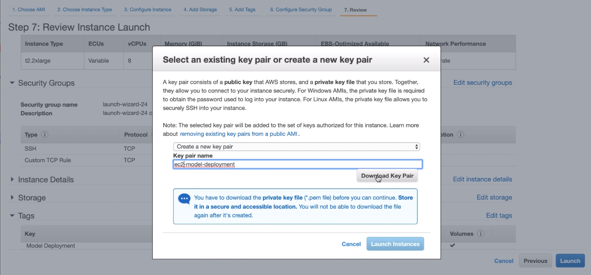
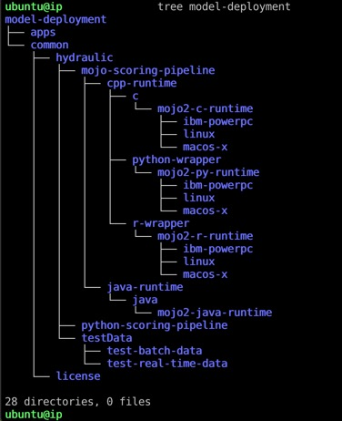
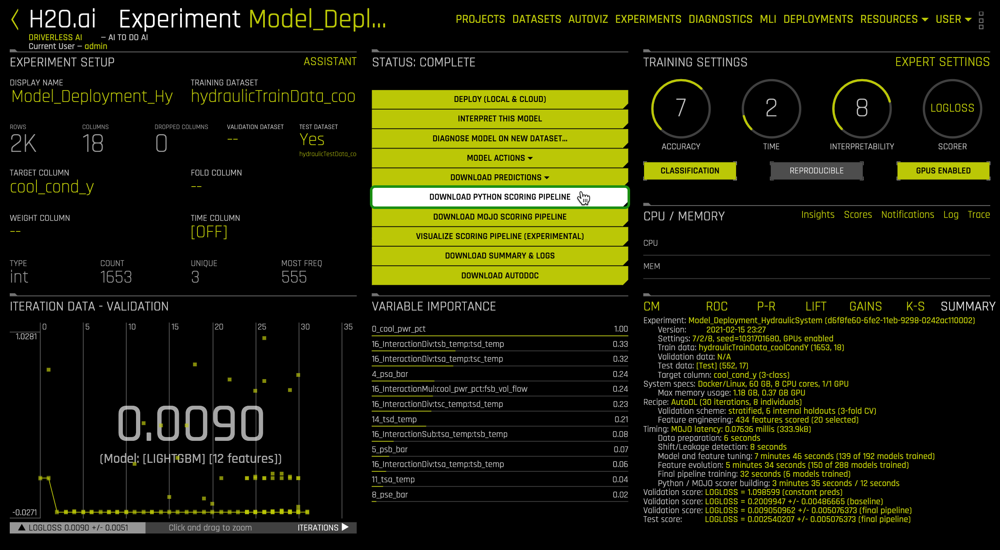
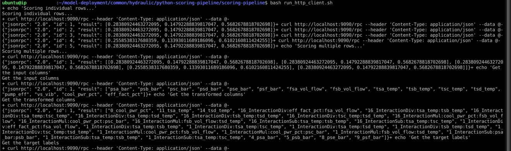
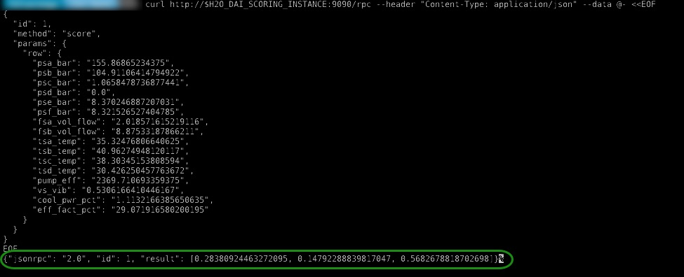
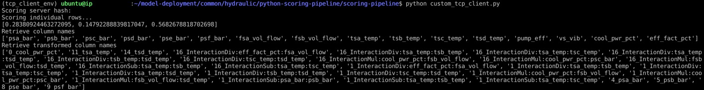

# Scoring Pipeline Deployment in Python Runtime

## Outline

- [Objective](#objective)
- [Prerequisites](#prerequisites)
- [Task 1: Set Up Environment](#task-1-set-up-environment)
- [Task 2: Scoring Pipeline Deployment in Python Runtime Concepts](#task-2-scoring-pipeline-deployment-in-python-runtime-concepts)
- [Task 3: Interactive and Batch Scoring via Embedded Deployment](#task-3-interactive-and-batch-scoring-via-embedded-deployment)
- [Task 4: Interactive and Batch Scoring via Server Deployment](#task-4-interactive-and-batch-scoring-via-server-deployment)
- [Task 5: Challenge](#task-5-challenge)
- [Next Steps](#next-steps)
- [Appendix A: Glossary](#appendix-a-glossary)

## Objective
**Machine Learning Model Deployment** is the process of making your models available in production environments, so they can be used to make predictions for other software systems [1]. Before model deployment, **feature engineering** occurs in preparing data that will later be used to train a model [2]. Driverless AI **Automatic Machine Learning (AutoML)** combines the best feature engineering and one or more **machine learning models** into a scoring pipeline [3][4]. The **scoring pipeline** is used to score or predict data when given new test data [5]. The scoring pipeline comes in two flavors. The first scoring pipeline is a **Model Object, Optimized(MOJO) Scoring Pipeline,** which is a standalone, low-latency model object designed to be easily embeddable in production environments. The second scoring pipeline is a Python Scoring Pipeline, which has a heavy footprint that is all Python and uses the latest libraries of Driverless AI to allow for executing custom scoring recipes[6].

For this tutorial, we will continue using the prebuilt experiment: **Model_deployment_HydraulicSystem.**  The Driverless AI  experiment is a classifier model that classifies whether the **cooling condition** of a **Hydraulic System Test Rig** is 3, 20, or 100. By looking at the **cooling condition,** we can predict whether the Hydraulic Cooler operates **close to total failure**, **reduced efficiency**, or **full efficiency**. 

| Hydraulic Cooling Condition | Description |
|:--:|:--:|
| 3 | operates at close to total failure |
| 20 | operates at reduced efficiency |
| 100 | operates at full efficiency |


The Hydraulic System Test Rig data for this tutorial comes from the **[UCI Machine Learning Repository: Condition Monitoring of Hydraulic Systems Data Set](https://archive.ics.uci.edu/ml/datasets/Condition+monitoring+of+hydraulic+systems#)**. The data set was experimentally obtained with a hydraulic test rig. This test rig consists of a primary working and a secondary cooling-filtration circuit connected via the oil tank [7]. The system cyclically repeats constant load cycles (duration 60 seconds) and measures process values such as pressures, volume flows, and temperatures. The condition of four hydraulic components (cooler, valve, pump, and accumulator) is quantitatively varied. The data set contains raw process sensor data (i.e., without feature extraction), structured as matrices (tab-delimited) with the rows representing the cycles and the columns the data points within a cycle.

Hydraulic System Test Rigs are used to test Aircraft Equipment components, Automotive Applications, and more [8]. A Hydraulic Test Rig can test a range of flow rates that can achieve different pressures with the ability to heat and cool while simulating testing under different conditions [9]. Testing the pressure, the volume flow, and the temperature is possible by Hydraulic Test Rig sensors and a digital display. The display panel alerts the user when certain testing criteria are met while displaying either a green or red light [9]. Further, a filter blockage panel indicator is integrated into the panel to ensure the Hydraulic Test Rig's oil is maintained [9]. In the case of predicting cooling conditions for a Hydraulic System, when the cooling condition is low, our prediction will tell us that the cooling of the Hydraulic System is close to total failure, and we may need to look into replacing the cooling filtration solution soon. 


**Figure 1:** Hydraulic System Cylinder Diagram

By the end of this tutorial, you will predict the Hydraulic System Test Rig's cooling condition by deploying an embeddable Python Scoring Pipeline into Python Runtime using Python.


### Resources

[1] H2O.ai Community AI Glossary: [Machine Learning Model Deployment](https://www.h2o.ai/community/glossary/machine-learning-model-deployment-productionization-productionizing-machine-learning-models)

[2] H2O.ai Community AI Glossary: [Feature Engineering](https://www.h2o.ai/community/glossary/feature-engineering-data-transformation)

[3] H2O.ai Community AI Glossary: [Automatic Machine Learning (AutoML)](https://www.h2o.ai/community/glossary/automatic-machine-learning-automl)

[4] H2O.ai Community AI Glossary: [Machine Learning Model](https://www.h2o.ai/community/glossary/machine-learning-model)

[5] H2O.ai Community AI Glossary: [Scoring Pipeline](https://www.h2o.ai/community/glossary/scoring-pipeline)

[6] H2O.ai Community AI Glossary: [Model Object, Optimized (MOJO) Scoring Pipeline](https://www.h2o.ai/community/glossary/model-object-optimized-mojo)

[7] [UCI Machine Learning Repository - Condition Monitoring of Hydraulic Systems Data Set](https://archive.ics.uci.edu/ml/datasets/Condition+monitoring+of+hydraulic+systems#)

[8] [SAVERY - HYDRAULIC TEST RIGS AND BENCHES](https://www.savery.co.uk/systems/test-benches)

[9] [HYDROTECHNIK - Flow and Temperature Testing Components](https://www.hydrotechnik.co.uk/flow-and-temperature-hydraulic-test-bed)

### Deeper Dive

- [Driverless AI Python Scoring Pipeline Quick Start](http://docs.h2o.ai/driverless-ai/latest-stable/docs/userguide/scoring-standalone-python.html#quick-start-recommended-method)


## Prerequisites

- Skilled in Python Programming
- Driverless AI Environment
- Driverless AI License
    - The license is needed to use the **Driverless AI Python Scoring Pipeline Runtime API** to execute the **Python Scoring Pipeline** for making predictions.
    - If you don't have a license, you can obtain one through our [21-day trial license](https://www.h2o.ai/try-driverless-ai/) option. Through the [21-day trial license](https://www.h2o.ai/try-driverless-ai/) option, you will be able to obtain a temporary **Driverless AI License Key** necessary for this tutorial. 
    - If you need to purchase a Driverless AI license, reach out to our sales team via the [contact us form](https://www.h2o.ai/company/contact/).
- AWS Account
- Linux (Ubuntu 16.10+, IBM Power PC)
- Basic knowledge of Driverless AI or completion of the following tutorials:
    - [Tutorial 1A: Automatic Machine Learning Introduction with Driverless AI](https://training.h2o.ai/products/tutorial-1a-automatic-machine-learning-introduction-with-driverless-ai#tab-product_tab_contents__15)
    - [Tutorial 4A: Scoring Pipeline Deployment Introduction](https://training.h2o.ai/products/tutorial-4a-scoring-pipeline-deployment-introduction#tab-product_tab_contents__12)
    - [Tutorial 4B: Scoring Pipeline Deployment Templates](https://training.h2o.ai/products/tutorial-4b-scoring-pipeline-deployment-templates#tab-product_tab_contents__11)

## Task 1: Set Up Environment

### Launch an AWS EC2 Instance

We will launch an Ubuntu 18.04 LTS AMI that is a t2.2xlarge instance with 256GB storage and open ports for ssh at 22 and custom TCP at 9090. When we are about to launch the system, we will create a key pair to access this system.

Login to your AWS Management Console using your AWS account root user credentials: https://console.aws.amazon.com/console/home

Search for EC2 service and click it in the dropdown:


On the page that appears in the left sidebar, click Instances. Then click **Launch Instance.**


Choose AMI: **Ubuntu 18.04 LTS (HVM), SSD Volume Type.** Click **Select.**


Choose **t2.2xlarge** instance. Then click **Next: Configure Instance Details.**


For **Configure Instance Details**, keep them default. Please ensure that **Use subnet setting (Enable)** for *Auto-assign Public IP* is selected. Then click **Next: Add Storage.**


Set the Storage to **256 GB** size or less for Root General Purpose SSD (gp2). Then click **Next: Add Tags.**


Set the **Key** as **Model Deployment** and **Value** as **Driverless AI Python Scoring Pipeline.** Then click **Next: Configure Security Group.**


Open ports for **ssh at 22** and **custom tcp at 9090.** Then click **Review and Launch.** 


When you are ready, click **Launch.** A window will appear asking you to select an existing key pair or create a new key pair. Choose **Create a new key pair.** Name it **ec2-model-deployment.** Then click **Download Key Pair.** 



The **Launch Instances** will be highlighted. Click it. You should see your **Launch Status:**


Click on the hyperlink instance that is located inside the green box. You should see your EC2 instance state go from pending to running.


Keep a copy of your **EC2 Public DNS** and remember the file path to your **Private Key File ec2-model-deployment.pem.** We will use this information to securely SSH into our EC2 instance.

### Connect to the EC2 Instance
On your local machine, move the **EC2 Private Key File** to the .ssh folder:

```bash
# Move Private Key to .ssh folder
mv $HOME/Downloads/ec2-model-deployment.pem $HOME/.ssh/

# Set Private Key permissions to 400 to avoid SSH permission denied
chmod 400 $HOME/.ssh/ec2-model-deployment.pem
```

Depending on your OS, run one of the following set of commands to **add a permanent environment variable** for your **EC2 Public DNS** and **EC2 Private Key:**

```bash
# Add permanent environment variables on Mac OS X
tee -a $HOME/.bash_profile << EOF
export H2O_DAI_SCORING_INSTANCE=<EC2 Public DNS>.compute.amazon.com
export H2O_DAI_SCORING_PEM=$HOME/.ssh/ec2-model-deployment.pem
EOF
source $HOME/.bash_profile

# Add permanent environment variables on Linux
tee -a $HOME/.profile << EOF
export H2O_DAI_SCORING_INSTANCE=<EC2 Public DNS>.compute.amazon.com
export H2O_DAI_SCORING_PEM=$HOME/.ssh/ec2-model-deployment.pem
EOF
source $HOME/.profile
```

Connect to your EC2 instance using SSH:

```bash
# Connect to EC2 instance using SSH
ssh -i $H2O_DAI_SCORING_PEM ubuntu@$H2O_DAI_SCORING_INSTANCE
```

After connecting to your EC2 instance, your terminal should look as follows:


### Set the Driverless AI License Key in EC2 Instance

While connected to the EC2 instance, set the Driverless AI License Key as a permanent environment variable so that you can use the Python scoring pipeline.


```bash
echo 'export DRIVERLESS_AI_LICENSE_KEY="<license-key>"' >> $HOME/.bashrc
source $HOME/.bashrc
```

### Install the Requirements in EC2 Instance
We will install the required packages on our EC2 instance:

```bash
# Install the Requirements
# Make all packages available on the EC2 instance
sudo apt-get -y update

# Install Python 3.6 and related packages
sudo apt-get -y install python3.6 python-virtualenv python3.6-dev python3-pip python3-dev python3-virtualenv

# Install OpenBLAS for linear algebra calculations
sudo apt-get -y install libopenblas-dev

# Install Unzip for access to individual files in the scoring pipeline folder
sudo apt-get -y install unzip

# Install Java to include open source H2O-3 algorithms
sudo apt-get -y install openjdk-8-jdk

# Install tree to display environment directory structures
sudo apt-get -y install tree

# Install the thrift-compiler
sudo apt-get install automake bison flex g++ git libevent-dev \
  libssl-dev libtool make pkg-config libboost-all-dev ant
wget https://github.com/apache/thrift/archive/0.10.0.tar.gz
tar -xvf 0.10.0.tar.gz
cd thrift-0.10.0
./bootstrap.sh
./configure
make
sudo make install

# Refresh runtime after installing thrift
sudo ldconfig /usr/local/lib
```
Once you are done, you can exit the `thrift-0.10.0` directory.

### Create Environment Directory Structure in EC2 Instance

Next, we recommend creating the following environment directory structure in your EC2 instance since it will make it easier to follow along with the rest of the deployment tutorials. If you already have it from the other tutorials, you can skip this step. To create the environment directory, run the following commands:

```bash
# Create directory structure for model deployment projects (covers MOJO and Python)
mkdir -p $HOME/model-deployment/common/license
mkdir -p $HOME/model-deployment/common/hydraulic/testData/{test-batch-data,test-real-time-data}
mkdir -p $HOME/model-deployment/common/hydraulic/{mojo-scoring-pipeline/{java-runtime/java/mojo2-java-runtime,cpp-runtime/{c/mojo2-c-runtime/{linux,macos-x,ibm-powerpc},r-wrapper/mojo2-r-runtime/{linux,macos-x,ibm-powerpc},python-wrapper/mojo2-py-runtime/{linux,macos-x,ibm-powerpc}}},python-scoring-pipeline}
mkdir -p $HOME/model-deployment/apps
tree model-deployment
```


Now we have the environment directory structure built. Next, we will connect to a Driverless AI EC2 instance to download a python scoring pipeline built for the Hydraulic sensor data.

### Download Python Scoring Pipeline to Local Machine

Download MOJO Scoring Pipeline

1\. If you have not downloaded the MOJO Scoring Pipeline, consider the following steps:

- Start a new Two-Hour Driverless AI Test Drive session in [Aquarium](https://aquarium.h2o.ai/login).

- In your Driverless AI instance, click on the **Experiments** section.

- In the **Experiments** section, click on the following experiment: **Model_deployment_HydraulicSystem**

- On the STATUS: COMPLETE section on the experiment page, click **DOWNLOAD PYTHON SCORING PIPELINE**



When finished, come back to this tutorial.

### Move Local Python Scoring Pipeline to EC2 Instance
The Python Scoring Pipeline scorer.zip was downloaded to the Downloads folder on the local machine. We need to move it to our EC2 instance. Open a new terminal on your local machine, then run the following command:

```bash
# Move Python Scoring Pipeline to EC2 instance
scp -i $H2O_DAI_SCORING_PEM $HOME/Downloads/scorer.zip ubuntu@$H2O_DAI_SCORING_INSTANCE:/home/ubuntu
```

It may take up to 14 minutes for the transfer to be completed.


Please keep in mind that you need to have the variables `H2O_DAI_SCORING_PEM` and `H2O_DAI_SCORING_INSTANCE` stored in your local machine for the above command to work. 

Go to the terminal in which you are already connected to your EC2 instance. Move the **scorer.zip** file to `python-scoring-pipeline/` folder and then extract it:

```bash
cd $HOME/model-deployment/common/hydraulic/python-scoring-pipeline/
mv $HOME/scorer.zip .
unzip scorer.zip
```

### Create Virtual Environments in EC2 Instance
In your EC2 instance, create two virtual environments: **env**, and **tcp_client_env.** Then install all of the required libraries. Any time we wish to run one of our python scripts (**example.py, custom_tcp_client.py**) we will activate the appropriate environment.

```bash
# Move to the scoring-pipeline folder, Create virtual environments in it
cd scoring-pipeline

# Create virtual environment example env and install required libraries
virtualenv -p python3.6 env
source env/bin/activate
# Install gitdb2 and gitdb into env
pip install --upgrade gitdb2==2.0.6 gitdb==0.6.4
# Install dependencies
pip install -r requirements.txt
deactivate

# Create virtual environment tcp_client_env and install required libraries
virtualenv -p python3.6 tcp_client_env
source tcp_client_env/bin/activate
# Install client dependencies
pip install -r client_requirements.txt -c full_constraints.txt
thrift --gen py scoring.thrift
deactivate
```

**Note:** You may see error messages related to h2o during the install process, this is normal, and the install will still be successful.

```bash
botocore 1.19.19 requires urllib3<1.27,>=1.25.4; python_version != "3.4", but you'll have urllib3 1.24.3 which is incompatible.
transformers 2.3.0 requires regex!=2019.12.17, but you'll have regex 2019.12.17 which is incompatible.
h2oaicore 1.9.0 requires psutil==5.6.7, but you'll have psutil 5.7.3 which is incompatible.
h2oaicore 1.9.0 requires six==1.12.0, but you'll have six 1.15.0 which is incompatible.
h2oaicore 1.9.0 requires tabulate==0.8.2, but you'll have tabulate 0.8.7 which is incompatible.
h2oaicore 1.9.0 requires urllib3==1.23, but you'll have urllib3 1.24.3 which is incompatible.
h2oaicore 1.9.0 requires wheel==0.33.4, but you'll have wheel 0.35.1 which is incompatible.
```

With the environment set up for the **Python Scoring Pipeline**, we are ready to classify the Hydraulic System cooling condition from the Hydraulic test data. Still, first, we will focus on learning the Python Scoring Pipeline concepts.

## Task 2: Scoring Pipeline Deployment in Python Runtime Concepts

### Python Scoring Pipeline Files

After downloading the Python Scoring Pipeline, the **scoring-pipeline** folder comes with many files. The wheel file that is needed to execute the Python Scoring Pipeline is the **scoring_h2oai_experiment_6a77d0a4_6a25_11ea_becf_0242ac110002-1.0.0-py3-none-any.whl**, which is a library that we use to import the **Scorer** from. The **Scorer** is a class we use to do interactive or batch scoring on data. There are Python scripts in the folder that help with executing the scoring pipeline directly in Python, on an HTTP server and a TCP server. They include **example.py,** **http_server.py,** and **tcp_server.py.** In the Python Scoring Pipeline, we have an HTTP scoring service and a TCP scoring service. These two scoring services are independent and mutually exclusive.

### Embedding Python Scoring Pipeline into Python Runtime

To run the Python **example.py** script, there is the helper shell script **run_example.sh.** When the Python **example.py** is executed, it executes the Python scoring pipeline directly in Python and does various types of scoring on the test data. The Python **example.py** does interactive scoring in which it uses the **scorer.score([...])** method to score one row at a time. Additionally, the Python **example.py** does batch scoring in which it uses **scorer.score_batch(dataframe** or **datatable)** to score a frame of data. You can think of a frame as a batch of rows. Batch scoring is faster than interactive scoring. The Python **example.py** does batch scoring on a Pandas dataframe and a Datatable. In the Datatable part of the Python **example.py,** Datatable saves the initial test data into a **test.csv** and the predictions into a **preds.csv.** To help in interpreting the model’s predictions for individual observations (rows) and batches of observations (frames), the Python **example.py** also obtains per-feature prediction contributions per row and per frame by setting the **pred_contribs** flag to **True** in the **scorer.score([...], pred_contribs=True).** The Python **example.py** also performs feature transformations without scoring to enrich the dataset by using **Scorer.fit_transform_batch()** to fit the feature engineering pipeline on the given training frame, validation frame, and optionally on the test frame.

### Deploy Python Scoring Pipeline to a Server via Scoring Service

#### Scoring Pipeline Deployment To an HTTP Server

The HTTP scoring service has two functions: start the HTTP scoring service and get prediction results back by giving it data. To start the HTTP scoring service, run the Python **http_server.py** by executing the helper shell script **run_http_server.sh.** To use the HTTP scoring service to send data and get predictions results back over **JSON-RPC 2.0 calls**, run the helper shell script **run_http_client.sh**. When the **http_server.py** is executed, it deploys the Python scoring pipeline on an HTTP server, making the scoring pipeline’s modules available to be called through remote procedure calls (RPC). Once the client makes the JSON-RPC 2.0 call powered by Tornado, data is sent to the HTTP server with a request for the Python scorer to make predictions on the data using **scorer.score()** method. Then the prediction results are returned to the client. Predictions can be made on individual rows (row-by-row) known as interactive scoring or on frames (multiple rows) known as batch scoring.

#### Scoring Pipeline Deployment To a TCP Server

The TCP scoring service has two functions: start the scoring TCP scoring service and get prediction results back by giving it data. The TCP scoring service provides high-performance RPC calls by way of Apache Thrift using a binary wire protocol. To start the TCP scoring service, run the Python **tcp_server.py** by executing the helper shell script **run_tcp_server.sh**. To use the TCP scoring service to send data and get prediction results over high-performance RPC calls, run the helper shell script **run_tcp_client.sh**. When the **tcp_server.py** is executed, it deploys the Python scoring pipeline on a TCP server, making the scoring pipeline’s modules available to be called through remote procedure calls (RPC). Once the client makes the RPC call powered by the thrift and h2oai_scoring libraries, data is sent to the TCP server with a request for the Python scorer to make predictions on the data using the **scorer.score()** method. Then, the prediction results are returned to the client. Predictions can be made on individual rows (row-by-row) known as interactive scoring or on frames (multiple rows) known as batch scoring.

## Task 3: Interactive and Batch Scoring via Embedded Deployment

You will execute the Python Scoring Pipeline using Python directly, HTTP scoring service, and TCP scoring service to do batch scoring and interactive scoring on data.

### Interactive and Batch Scoring via Run Python Example

You will run the **example.py** script that came with the scoring-pipeline folder. This script uses the Python scorer to do interactive scoring using `scorer.score(row)` and batch scoring using `scorer.score_batch(frame)` for the Hydraulic System cooling condition on the Hydraulic sensor data. Additionally, this script also transforms a dataset by fitting the feature engineering pipeline on the data and gets per-feature prediction contributions, also known as Shapley values.

Since we already set our Driverless AI license key as an environment variable in our EC2 instance, we can run **example.py**:

```bash
# Activate virtual environment env to run python example.py
source env/bin/activate
python example.py
```

The output should be similar to the following, but columns and predictions will match the data in your scoring pipeline:


As you can see in the output above, after running the **example.py** file, we could retrieve different types of predictions for our Hydraulic dataset. We can see scores per row, frame, feature prediction contribution for row, transformed frames, column names, and transformed column names. 

After reviewing these outputs, you can deactivate the virtual environment as we will move on to the next task.

```bash
deactivate
```

## Task 4: Interactive and Batch Scoring via Server Deployment

### Deploy Python Scoring Pipeline to EC2 HTTP Server

To deploy the Python Scoring Pipeline to the EC2 HTTP server, run the following command to start the HTTP server and execute the Python Scoring Pipeline on it:

```bash
# Activates the http_server_env, starts the HTTP server and executes the Python Scoring Pipeline
# and deactivates virtual environment when stopping the server.
bash run_http_server.sh
```

After running the command above, a virtual environment with all the requirements will be created. Once this is done, you will see the following:


### Get Predictions using Local HTTP Client

The HTTP scoring service is now listening on port 9090; we will use an HTTP client local to the HTTP server to get predictions. In the Python Scoring Pipeline folder, we will use **run_http_client.sh**, which executes multiple example json requests for interactive scoring (individual rows), batch scoring (multiple rows), getting input columns, transformed columns, and target labels. 
 
Open another terminal to connect to your EC2 instance; then navigate to the **scoring-pipeline** folder and then execute the script **run_http_client.sh**:
 
```bash
# Connect to EC2 instance using SSH
ssh -i $H2O_DAI_SCORING_PEM ubuntu@$H2O_DAI_SCORING_INSTANCE

# Change to scoring-pipeline folder
cd $HOME/model-deployment/common/hydraulic/python-scoring-pipeline/scoring-pipeline
bash run_http_client.sh
```

The output should be similar to the following, but the Hydraulic System cooling condition classification shown in the json responses will match the data in your scoring pipeline:



This classification output is the interactive and batch scoring done for our Hydraulic System cooling condition. You should receive classification probabilities for `cool_cond_y.3`, `cool_cond_y.20`, and `cool_cond_y.100`. The `3` means the Hydraulic cooler is close to operating at total failure, `20` means it is operating at reduced efficiency, and `100` means it is operating at full efficiency.

### Get Predictions using Remote HTTP Client
Alternatively, we will use a remote HTTP client to connect to the HTTP server on port 9090 to get a prediction, feature column names, and Shapley values from the Python Scoring Pipeline. 
 
Let’s use the remote HTTP client to do interactive scoring to get the classification for the Hydraulic System cooling condition for an individual row. Open another terminal from your local machine, run the following command:

```bash
curl http://$H2O_DAI_SCORING_INSTANCE:9090/rpc --header "Content-Type: application/json" --data @- <<EOF
{
  "id": 1,
  "method": "score",
  "params": {
    "row": {
      "psa_bar": "155.86865234375",
      "psb_bar": "104.91106414794922",
      "psc_bar": "1.0658478736877441",
      "psd_bar": "0.0",
      "pse_bar": "8.370246887207031",
      "psf_bar": "8.321526527404785",
      "fsa_vol_flow": "2.018571615219116",
      "fsb_vol_flow": "8.87533187866211",
      "tsa_temp": "35.32476806640625",
      "tsb_temp": "40.96274948120117",
      "tsc_temp": "38.30345153808594",
      "tsd_temp": "30.426250457763672",
      "pump_eff": "2369.710693359375",
      "vs_vib": "0.5306166410446167",
      "cool_pwr_pct": "1.1132166385650635",
      "eff_fact_pct": "29.071916580200195"
    }
  }
}
EOF
```
The output should show a score for the Hydraulic System cooling condition of an individual row.



By looking at the predictions, we can see that the highest probability belongs to cool_cond_y.100, which means that we are predicting that the hydraulic system is operating at full efficiency.
 
Next, we will use the remote HTTP client to get feature column names for an individual row, so when we retrieve the Shapley values, we know which value is which column. Run the following command from your local machine:

```bash
echo "Get the transformed columns"
curl http://$H2O_DAI_SCORING_INSTANCE:9090/rpc --header "Content-Type: application/json" --data @- <<EOF
{
 "id":1,
 "method":"get_transformed_column_names",
 "params":{}
}
EOF
```

The output should show the featured column names for an individual row.


We will use the remote HTTP client to get the Shapley values (also known as per-feature prediction contributions) from an individual row. This call is the same as we did for getting a prediction on an individual row, but this time we include the parameter `"pred_contribs": true`. Run the following command from your local machine:
 
```bash
curl http://$H2O_DAI_SCORING_INSTANCE:9090/rpc --header "Content-Type: application/json" --data @- <<EOF
{
 "id": 2,
 "method": "score",
 "params": {
   "row": {
      "psa_bar": "155.72216796875",
      "psb_bar": "104.91106414794922",
      "psc_bar": "1.0673456192016602",
      "psd_bar": "2.350000067963265e-05",
      "pse_bar": "8.367691993713379",
      "psf_bar": "8.322537422180176",
      "fsa_vol_flow": "2.0297765731811523",
      "fsb_vol_flow": "8.87533187866211",
      "tsa_temp": "35.319183349609375",
      "tsb_temp": "40.96274948120117",
      "tsc_temp": "38.24573516845703",
      "tsd_temp": "30.414283752441406",
      "pump_eff": "2366.353271484375",
      "vs_vib": "0.5243666768074036",
      "cool_pwr_pct": "1.2976833581924438",
      "eff_fact_pct": "29.12849998474121"
   },
   "pred_contribs": true
 }
}
EOF
```

The output should show a score for the Shapley values from an individual row.


You just learned how to perform interactive scoring and batch scoring using the HTTP scoring service. Next, we will deploy the Python Scoring Pipeline to a TCP server that will run on our EC2 instance. So, go to your terminal where your HTTP server is running on EC2, then press `control + C` to stop the HTTP server.

### Deploy Python Scoring Pipeline to EC2 TCP Server

To deploy the Python Scoring Pipeline to the EC2 TCP server, go to the terminal that was running the HTTP server on your EC2 instance, run the following command to generate the Thrift bindings once, start the TCP server and execute the Python Scoring Pipeline on it:

```bash
# Activates tcp_server_env, starts TCP server and executes Python Scoring
# Pipeline on it, deactivates virtual environment when stopping server
bash run_tcp_server.sh
```
Once again, the line above will create a new environment with all the requirements. Once this is done, you will see the following:


### Get Predictions using Local TCP Client

The TCP scoring service is now listening on port 9090; we will use a TCP client local to the TCP server to get predictions. In the Python Scoring Pipeline folder, we will create a **custom_tcp_client.py**, which uses **thrift** and **h2oai_scoring** libraries to enable the TCP client to use the Python **scorer** methods through the TCP scoring service. 
 
With the **TCP client** having access to the **scorer** methods, we will use the **client.score(row)** method to do interactive scoring, **client.get_column_names()** to get input columns, the **client.get_transformed_column_names()** to get feature column names, and **client.get_target_labels()** to get target labels. 

Go to the terminal where you ran your **local HTTP client** on your EC2 instance, run the following command to create the **custom_tcp_client.py** script:

```bash
cd $HOME/model-deployment/common/hydraulic/python-scoring-pipeline/scoring-pipeline
tee -a custom_tcp_client.py << EOF
import sys
sys.path.append('gen-py')
 
from numpy import nan
from thrift.transport import TSocket
from thrift.transport import TTransport
from thrift.protocol import TBinaryProtocol
 
from h2oai_scoring import ScoringService
from h2oai_scoring.ttypes import Row
 
socket = TSocket.TSocket('localhost', 9090)
transport = TTransport.TBufferedTransport(socket)
protocol = TBinaryProtocol.TBinaryProtocol(transport)
client = ScoringService.Client(protocol)
transport.open()
 
server_hash = client.get_hash()
print('Scoring server hash: '.format(server_hash))
 
print('Scoring individual rows...')
 
row1 = Row()
row1.psaBar = float('155.86865234375')  # psa_bar
row1.psbBar = float('104.91106414794922')  # psb_bar
row1.pscBar = float('1.0658478736877441')  # psc_bar
row1.psdBar = float('0.0')  # psd_bar
row1.pseBar = float('8.370246887207031')  # pse_bar
row1.psfBar = float('8.321526527404785')  # psf_bar
row1.fsaVolFlow = float('2.018571615219116')  # fsa_vol_flow
row1.fsbVolFlow = float('8.87533187866211')  # fsb_vol_flow
row1.tsaTemp = float('35.32476806640625')  # tsa_temp
row1.tsbTemp = float('40.96274948120117')  # tsb_temp
row1.tscTemp = float('38.30345153808594')  # tsc_temp
row1.tsdTemp = float('30.426250457763672')  # tsd_temp
row1.pumpEff = float('2369.710693359375')  # pump_eff
row1.vsVib = float('0.5306166410446167')  # vs_vib
row1.coolPwrPct = float('1.1132166385650635')  # cool_pwr_pct
row1.effFactPct = float('29.071916580200195')  # eff_fact_pct
score1 = client.score(row1, pred_contribs=False, output_margin=False)
print(score1)
 
print('Retrieve column names')
print(client.get_column_names())
 
print('Retrieve transformed column names')
print(client.get_transformed_column_names())
 
transport.close()
EOF
```

Execute the python script, so the TCP client local to the TCP server will get predictions for the Hydraulic System cooling condition:

```bash
# Activate virtual environment env to run python example.py
source tcp_client_env/bin/activate
python custom_tcp_client.py
```

The output should be similar to the following, but columns and predictions will match the data in your scoring pipeline:



Once you are done, you can deactivate your virtual environment.

```bash
deactivate
```

## Task 5: Challenge

### Execute Scoring Pipeline for a New Dataset

There are various challenges you could do. You could do something that helps you in your daily life or job. Maybe there is a dataset you are working with; you could reproduce the steps we did above, but for your dataset, build a new experiment and execute your Python scoring pipeline to do batch scoring or interactive scoring.

### Embed Scoring Pipeline into Existing Program

Another challenge could be to use the existing Python scoring pipeline we executed: instead of using the examples we shared above, integrate the scoring pipeline into an existing Java, Python, or C++ program using the TCP or HTTP scoring service.

## Next Steps

- [Tutorial 4C: Scoring Pipeline Execution in Java Runtime](https://training.h2o.ai/products/tutorial-4c-scoring-pipeline-execution-in-java-runtime)
- [Tutorial 4D: Scoring Pipeline Execution Runtime in C++](https://training.h2o.ai/products/tutorial-4d-scoring-pipeline-execution-runtime-in-c)
- (COMING SOON) Tutorial 4F: Scoring Pipeline Deployment to Apache NIFI

## Appendix A: Glossary
Refer to [H2O.ai AI/ML Glossary](https://www.h2o.ai/community/top-links/ai-glossary-search?p=1) for relevant Model Deployment Terms


