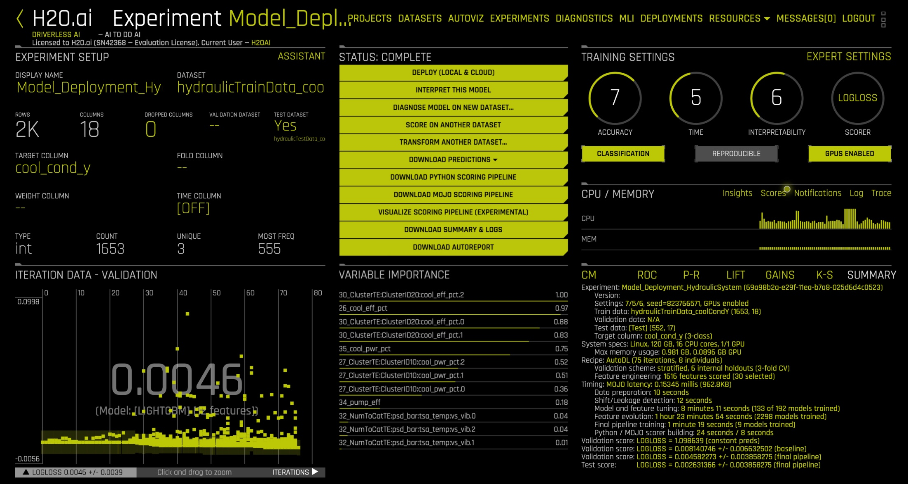
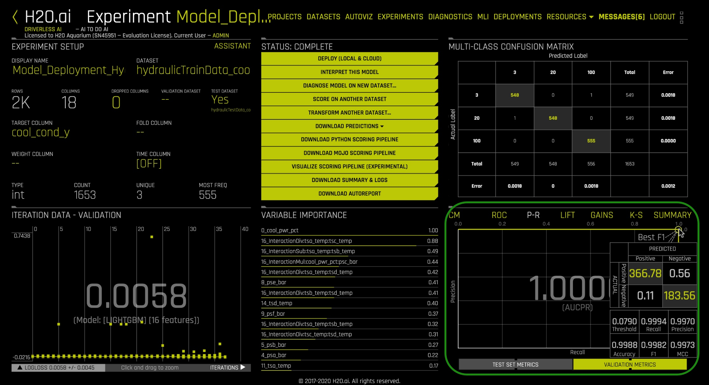
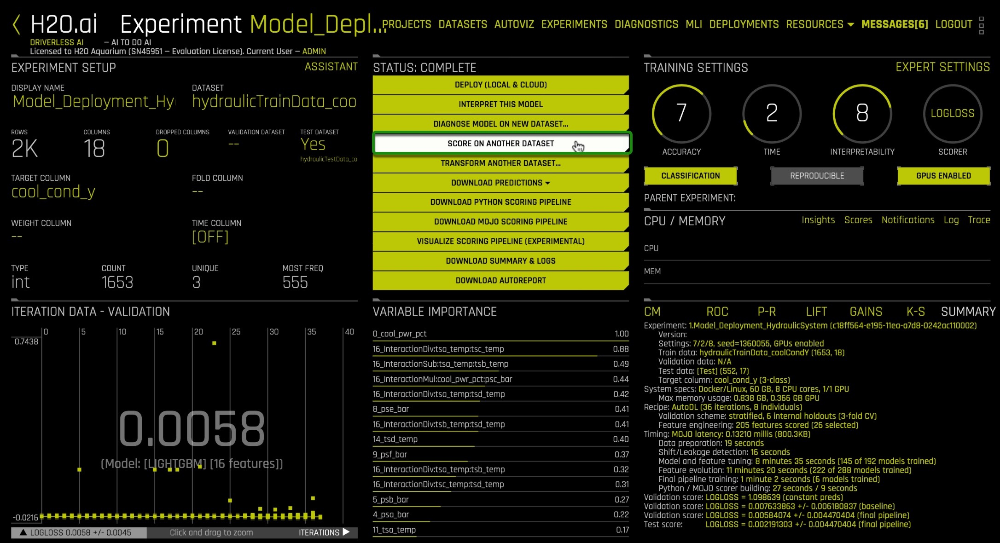
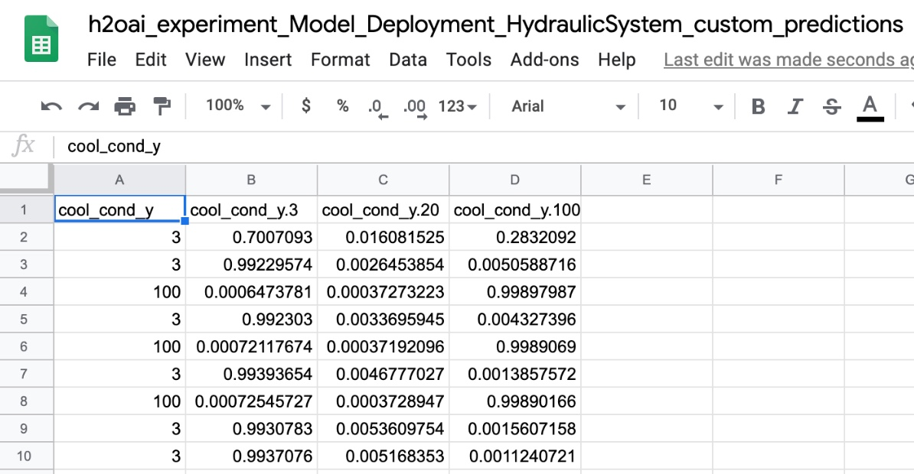
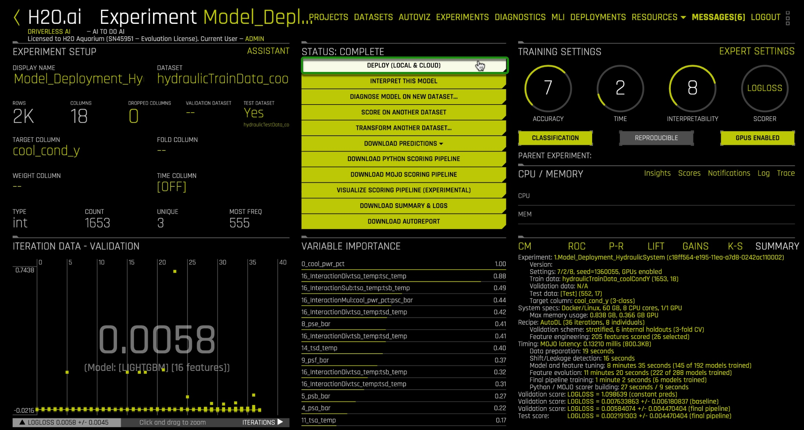
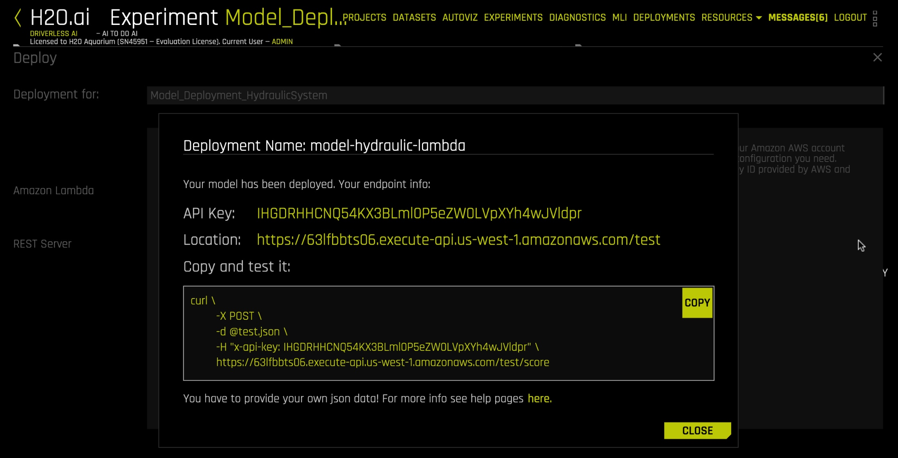
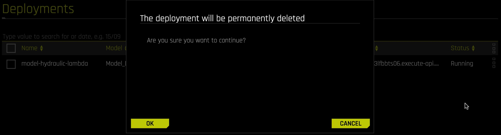
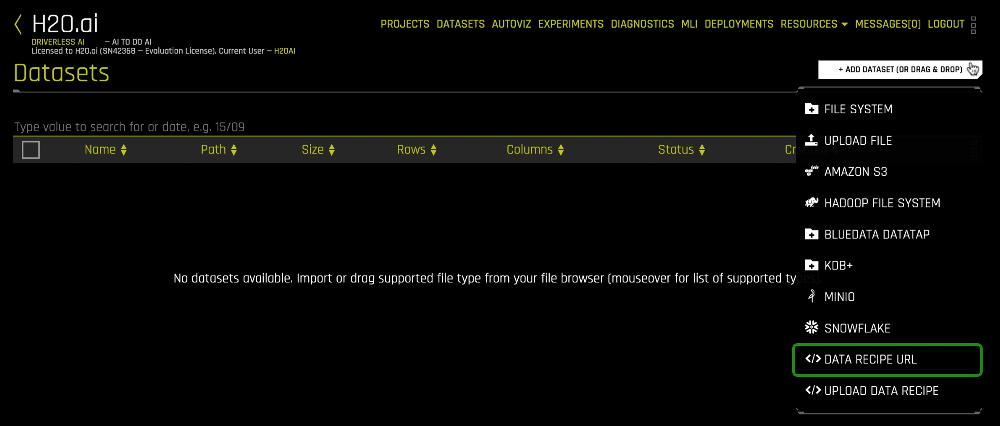
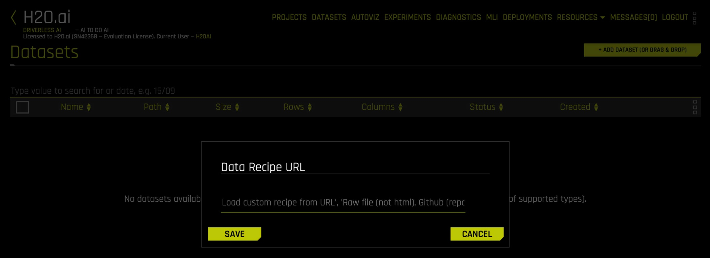

# Scoring Pipeline Deployment Introduction

## Outline
- [Objective](#objective)
- [Prerequisites](#prerequisites)
- [Task 1: Tour of Prebuilt Experiment](#task-1-tour-of-prebuilt-experiment)
- [Task 2: Scoring Pipeline Deployment Concepts](#task-2-scoring-pipeline-deployment-concepts)
- [Task 3: Batch Scoring via Score Another Dataset](#task-3-batch-scoring-via-score-another-dataset)
- [Task 4: Interactive Scoring(REST and AWS Lambda) via Deployment Templates](#task-4-interactive-scoringrest-and-aws-lambda-via-deployment-templates)
- [Task 5: Challenge](#task-5-challenge)
- [Next Steps](#next-steps)
- [Appendix A: Build Driverless AI Experiment](#appendix-a-build-driverless-ai-experiment)
- [Appendix B: AI Glossary](#appendix-b-ai-glossary)

## Objective

**Machine Learning Model Deployment** is the process of making your model available in production environments, so they can be used to make predictions for other software systems [1]. Prior to model deployment, **feature engineering** takes place to prepare the data for being used to train the model [2]. Driverless AI **Automatic Machine Learning (AutoML)** combines the best feature engineering and one or more **machine learning models** into a scoring pipeline [3][4]. The **scoring pipeline** is used to score or predict data when given new test data [5]. The scoring pipeline comes in two flavors: a **Model Object, Optimized (MOJO) Scoring Pipeline** and a Python Scoring Pipeline [6]. 

By the end of this tutorial, you will predict the **cooling condition** for a **Hydraulic System Test Rig** by deploying a **MOJO Scoring Pipeline** into production using **Driverless AI**. Hydraulic System Test Rigs are used to test components in Aircraft Equipment, Ministry of Defense, Automotive Applications, and more [7]. This Hydraulic Test Rig is capable of testing a range of flow rates that can achieve different pressures with the ability to heat and cool to simulate testing under different conditions [8]. Testing the pressure, volume flow and temperature is possible by Hydraulic Test Rig sensors and digital displays. The display panel alerts the user when certain testing criteria is met displaying either a green/red light [8]. A filter blockage panel indicator is integrated into the panel to ensure the Hydraulic Test Rig’s oil is maintained [8]. The cooling filtration solution is designed to minimize power consumption and expand the life of the Hydraulic Test Rig. We are predicting cooling conditions for Hydraulic System Predictive Maintenance. When the cooling condition is low, our prediction tells us that the cooling of the Hydraulic System is close to total failure and we may need to look into replacing the cooling filtration solution soon.

**Figure 1:** Hydraulic System Cylinder Diagram

The Hydraulic System consists of a primary and secondary cooling filtration circuit with pumps that deliver flow and pressure to the oil tank. The oil tank box at the bottom. There is a pressure relief control valve for controlling the rising and falling flows. There is a pressure gauge for measuring the pressure. 

### Deep Dive and Resources

[1] H2O.ai Community AI Glossary: [Machine Learning Model Deployment](https://www.h2o.ai/community/glossary/machine-learning-model-deployment-productionization-productionizing-machine-learning-models)

[2] H2O.ai Community AI Glossary: [Feature Engineering](https://www.h2o.ai/community/glossary/feature-engineering-data-transformation)

[3] H2O.ai Community AI Glossary: [Automatic Machine Learning (AutoML)](https://www.h2o.ai/community/glossary/automatic-machine-learning-automl)

[4] H2O.ai Community AI Glossary: [Machine Learning Model](https://www.h2o.ai/community/glossary/machine-learning-model)

[5] H2O.ai Community AI Glossary: [Scoring Pipeline](https://www.h2o.ai/community/glossary/scoring-pipeline)

[6] H2O.ai Community AI Glossary: [Model Object, Optimized (MOJO) Scoring Pipeline](https://www.h2o.ai/community/glossary/model-object-optimized-mojo)

[7] [SAVERY - HYDRAULIC TEST RIGS AND BENCHES](https://www.savery.co.uk/systems/test-benches)

[8] [HYDROTECHNIK - Flow and Temperature Testing Components](https://www.hydrotechnik.co.uk/flow-and-temperature-hydraulic-test-bed)

## Prerequisites

You will need the following to be able to do this tutorial:

- Driverless AI environment
- Needed for AWS Lambda Section
    - If you have an Amazon Admin, request access permissions for
        - Amazon AWS with IAM Full Access
        - Amazon AWS with AWS Lambda Full Access
        - Amazon AWS with Amazon API Gateway Administrator
        - Amazon AWS with Usage Plans Enabled
    - Create an Amazon AWS IAM Access Key and Secret Key
- Basic knowledge of Driverless AI or doing the [Automatic Machine Learning Introduction with Drivereless AI Test Drive Tutorial](https://training.h2o.ai/products/tutorial-1a-automatic-machine-learning-introduction-with-driverless-ai).
- A **Two-Hour Test Drive session**: Test Drive is H2O.ai's Driverless AI on the AWS Cloud. No need to download software. Explore all the features and benefits of the H2O Automatic Learning Platform.
    - Need a **Two-Hour Test Drive** session? Follow the instructions on [this quick tutorial](https://training.h2o.ai/products/tutorial-0-getting-started-with-driverless-ai-test-drive) to get a Test Drive session started.

**Note: Aquarium’s Driverless AI Test Drive lab has a license key built-in, so you don’t need to request one to use it. Each Driverless AI Test Drive instance will be available to you for two hours, after which it will terminate. No work will be saved. If you need more time to further explore Driverless AI, you can always launch another Test Drive instance or reach out to our sales team via the [contact us form](https://www.h2o.ai/company/contact/).**

Other installations:

- Cloud Installation
    - [H2O Driverless AI on AWS Marketplace](https://aws.amazon.com/marketplace/pp/B07JN71K8N?qid=1547700275918&sr=0-6&ref_=srh_res_product_title)
    - [H2O Driverless AI on Azure HDInsight](https://azuremarketplace.microsoft.com/en-gb/marketplace/apps/h2o-ai.h2o-driverles-ai?tab=Overview)
    - [H2O.ai Driverless AI (BYOL) on Google Cloud Platform](https://console.cloud.google.com/marketplace/details/h2o-public/h2oai-driverless-ai-byol?pli=1)
- [Local Installation](http://docs.h2o.ai/driverless-ai/latest-stable/docs/userguide/installing.html)
- [Server Installation](http://docs.h2o.ai/driverless-ai/latest-stable/docs/userguide/install/ibm-power.html)

## Task 1: Tour of Prebuilt Experiment

Let’s discuss the different Driverless AI experiments you could build with the Hydraulic System data and each particular label, which include cooler condition, valve condition, pump leakage, accumulator gas leakage and stable flag [1]. For each experiment we could build, Driverless AI would choose a classification scorer because each of the labels has 2 or more categories. 

**Experiment 1**: Build an Experiment for Hydraulic Cooling Condition Classification

If we build an experiment with the Hydraulic System data and the cooler condition label, Driverless AI will build a classification scorer that classifies for the probability the cooler condition is 3, 20, or 100 [1]. From the cooler condition classification, we can predict the Hydraulic Cooler is operating close to total failure, reduced efficiency, or full efficiency [1]. 

**Experiment 2**: Build an Experiment for Hydraulic Valve Condition Classification

If we were to build an experiment using the Hydraulic System data with the valve condition label, we would be able to predict the Hydraulic valve condition is 100, 90, 80, or 73 [1]. The valve condition classification can tell us the valve is operating at optimal switching behavior, with a small lag, severe lag, or close to total failure [1].

**Experiment 3**: Build an Experiment for Hydraulic Internal Pump Leakage Classification

If we build an experiment using the Hydraulic System data with the internal pump leakage label, we would be able to predict the Hydraulic internal pump leakage is 0, 1, or 2 [1]. The internal pump leakage classification can tell us the internal pump has no leakage, weak leakage or severe leakage [1].

**Experiment 4**: Build an Experiment for Hydraulic Accumulator Gas Leakage Classification

If we were to build an experiment with the Hydraulic System data with the Hydraulic accumulator label, we would be able to predict the accumulator is 130, 115, 100, or 90 [1]. This classification can tell us the Hydraulic accumulator functions at optimal pressure, slightly reduced pressure, severely reduced pressure or close to total failure [1].

**Experiment 5**: Build an Experiment for Hydraulic Stable Flag Classification

The final experiment we could build is with the Hydraulic System data and the stable flag label. We would be able to predict the Hydraulic stable flag is 0 or 1 [1]. So, our binomial classification can tell us the Hydraulic System conditions were stable or static conditions might not have been reached yet [1].

1\. View the **Experiment Dashboard** for Hydraulic Cooling Condition Classification

In [Appendix A: Build Driverless AI Experiment](#appendix-a-build-driverless-ai-experiment), there are steps that walk through how to build the experiment using the Hydraulic System data and the cooler condition label. What you will see is the dataset was split 75% for training and 25% for testing data. The scorer was trained using the training data with the cooling condition as the label. The testing data was used to evaluate the scorer. Once the experiment was built, the following Driverless AI experiment dashboard is available:

**Figure 2:** Experiment Dashboard for Hydraulic System Cooling Condition

2\. For Machine Learning Model Deployment, let’s examine the status menu options, summary, loss function result, and variable importance.

To deploy the model, we can use Driverless AI’s **Deploy (Local & Cloud)**, **Download Python Scoring Pipeline**, or **Download MOJO Scoring Pipeline** features. The Deploy (Local & Cloud) allows the user to auto-deploy their model to a REST server or an Amazon Lambda. The Download Python Scoring Pipeline or Download MOJO Scoring Pipeline is more hands-on and the user can choose to go with the embedded deployment approach or server deployment approach for the model. Since the Driverless AI MOJO Scoring Pipelines are small in size, they can be easily embedded on edge devices with a low memory footprint. However, for the Driverless AI Python Scoring Pipeline, they are bulkier in size, so they should be embedded on devices with a high memory footprint.

If you want to practice batch scoring data right away with Driverless AI, you should use the built-in **Score On Another Dataset** feature. When you click on this button, you choose your test data and the label you are predicting, then Driverless AI will execute the Python Scoring Pipeline behind the scenes to do batch scoring.

In the summary section, we can see our scorer’s max memory usage, feature engineering, MOJO latency, etc. These metrics are areas we should consider when deploying our scorers to certain environments. For instance, does the environment support the scorer’s memory usage? Does MOJO latency change much when we embed it on a low memory footprint device? 

After the experiment is built, the dashboard shows your model’s loss function result for the validation score and test score. We can also see LightGBM is the classification model. In the experiment dashboard, we can see Log Loss is the model’s loss function. The validation score’s loss is 0.0130. Likewise, the test score’s loss is 0.0106. The loss result tells us how good or bad the model makes predictions. Since our loss is very low near 0, our LightGBM model is very close to correctly assigning probabilities for each category it is classifying from the test data.

The variable importance tells us which features were considered important when the model was being trained. We can see the list is ordered from most to least important. At the top is cool_pwr_pct and this feature is expected to be high in importance because the Hydraulic cooling condition needs power in order to function at full efficiency. It looks like tsc_temp and tsb_temp are also important for the Hydraulic cooling condition and that makes sense because the temperature can have a major impact on the Hydraulic cooler’s efficiency. If the temperature is high, that could be a sign there is a problem with the Hydraulic cooler. The variable importance shows what variables are most crucial when the model is making the prediction for Hydraulic cooling conditions.

**Figure 3:** Experiment PR Metrics for Hydraulic System Cooling Condition

3\. In the Driverless AI dashboard, let’s change from the summary view to the P-R metrics view. 

These metrics are used to evaluate the quality of the multinomial classification model that was built. By clicking on the dot in the top right corner of the graph, we can see the best **F1**, **ACC** and **MCC** values for our scorer. We see the **recall** is 0.9982, **precision** is 0.9982, F1 is 0.9982 and MCC is 0.9973.

**Recall** is a measure of completeness or quantity of the results obtained by the model [2]. It is the ratio of the number of predictions divided by all the actual labels [2]. For example, let’s say the number of predictions for the hydraulic cooling condition operating at reduced efficiency occurs 30% of the time, but there are 40% actual labels, then the recall is ¾. In the Driverless AI dashboard, we see the recall is 99.82%, which means the quantity of the results obtained by the model is nearly complete.

**Precision** is a measure of exactness or quality of the results obtained by the model [2]. It is the ratio of the correct predictions divided by the total number of predictions. This ratio is measured from 0.0 to 1.0 with 0.0 being the worst and 1.0 being the best precision [2]. For example, let’s say the number of predictions for hydraulic cooling condition operating at full efficiency with the actual labels matching is 40% of the time and the total number of predictions for hydraulic cooling condition is operating at full efficiency without the actual labels matching is 50% of the time, then the precision is ⅘. In the Driverless AI dashboard, we see the precision is 99.82%, which means the exactness and quality of the results obtained by the model has the best precision.

**F1** represents the **Harmonic Average** of the recall and precision [2]. F1 is measured in the range of 0 to 1 with 0 meaning there are no true positives and 1 meaning there is neither false negatives nor false positives [2]. In the Driverless AI dashboard, the F1 is 99.82%, which means our model is near perfect on precision and recall.

**MCC** stands for **Matthew Correlation Coefficient** and is a measure of the quality of the classifications [2]. MCC is measured in the range between -1 and +1 with +1 being perfect prediction and 0 being no better than a random prediction and -1 being all incorrect predictions [2]. In the Driverless AI dashboard, MCC is 99.73% meaning our model performs nearly perfect predictions.

### Deep Dive and Resources

[1] [Condition monitoring of hydraulic systems Data Set](https://archive.ics.uci.edu/ml/datasets/Condition+monitoring+of+hydraulic+systems#)

[2] [Machine Learning Experiment Scoring and Analysis Tutorial: Task 3 Concepts](https://h2oai.github.io/tutorials/machine-learning-experiment-scoring-and-analysis-tutorial-financial-focus/#4)

## Task 2: Scoring Pipeline Deployment Concepts

### Machine Learning Workflow

**Figure 4:** Machine Learning Workflow

The **Machine Learning Model Deployment** workflow includes data preprocessing, model training, model deployment and model predicting. During data preprocessing, the training data is collected, explored and prepared for training the model. 

During **Model Training**, **Machine Learning Algorithms** are tuned via hyperparameters and features are used to train the Machine Learning Algorithm. A Machine Learning Algorithm is a programmed algorithm that receives and analyzes input data to predict output values within an acceptable range [1]. This trained Machine Learning Algorithm then gets saved as a **Machine Learning Model**. A Machine Learning Model is the output generated when you train your Machine Learning Algorithm with your training data [2]. Once the Model is saved, one typically evaluates their Model with a validation data set that comes from a small percentage of the training data. Model explanation and report explains why the Model Algorithm was chosen and provides some kind of error, such as **root mean squared error (RMSE)** to defend choosing the Model Algorithm for its high accuracy. A low RMSE means we have a good Model.

During **Model Deployment**, **Model Management & Monitoring** is used for **model reproducibility** and **model versioning**. When you notice the model does not perform the way you expect after monitoring it for some time, you will typically go back into the phase where we train the Machine Learning Algorithm and potentially even go back to the feature engineering. You will repeat this process: train the Machine Learning Algorithm and save the Machine Learning Model until you obtain the most accurate model. Model Engineering is the process we just described above. Now that we have engineered our model, we can deploy it into production on premise or in the cloud to make predictions on real world data.

During **Model Predicting**, the model is running and we can pass real world data to them to make predictions for one or more labels. Some examples of what these models can be used for include credit risk scoring to personalize credit decisions, anti-money laundering to stop crime, anomaly detection to find network anomalies, predicting ICU transfers to save lives by catching patients before they crash and condition monitoring for hydraulic systems to predict points of failure in the system [3].

### From Model Training to Production Deployment to Edge

**Figure 5:** Model Training to Model Deployment to Scoring

Productionizing a machine learning model involves **model training**, **model deployment** and **scoring**. During model training, data is loaded into the ML platform and then AutoML is executed to generate the winning machine learning model. In the case of H2O Driverless AI, AutoML generates a scoring pipeline, which consists of the feature engineering and winning machine learning model. During model deployment, the scoring pipeline is deployed on premise or in the cloud and machine learning management is executed to monitor the performance of the scoring pipeline. During scoring, the scoring pipeline’s functions can be accessed from the edge and IoT devices directly or through remote procedure calls to make predictions on one or more labels.

### Model Object, Optimized (MOJO)

**Figure 6:** Driverless AI MOJO Diagram

The **MOJO (stands for Model Object Optimized)** is small in size and very fast at computing real-time predictions as well as batch predictions. So, whether you are making predictions on the edge or all the way up in the cloud, the MOJO can run practically anywhere. When you build an experiment in Driverless AI, you have the option to download a MOJO scoring pipeline. The MOJO scoring pipeline is packaged with the winning feature engineering and machine learning model. This model could be XGBoost, LightGBM, GLM, Decision Tree, TensorFlow, FTRL and even other models. The Driverless AI MOJO can be executed in Java Runtime and C++ Runtime. In order to execute the Driverless AI MOJO scoring pipeline in either runtime, one must have a Driverless AI License Key.

### MOJO and Python Scoring Pipelines

Scoring in machine learning is also called prediction. Scoring is the process of generating values (or scores, predictions) using a trained machine learning model [5]. A scoring pipeline is a unique technology that deploys all feature engineering and the winning machine learning model in a highly optimized, low-latency, production-ready Java code that can be deployed anywhere [6]. In Driverless AI, it has this focus on feature engineering and not just building a model. Driverless AI builds a feature engineering pipeline to create better features for the model to find signals from in your data. Executing the scoring pipeline is the practice of scoring data. In Driverless AI, there are two types of scoring pipelines: MOJO scoring pipelines and a Python scoring pipeline [7].

The **MOJO Scoring Pipeline** is a lightweight and low-latency scoring engine that can be executed in any Java Runtime or C++ Runtime to score data in real time [8]. It is meant for real time use, you are able to give it one row at a time and make a prediction. It is very embeddable, you can wrap a service around it or you can embed it inside your application. For the Java runtime, Java, PySparkling and Sparkling Water are provided [8]. For the C++ runtime, both Python and R wrappers are provided [9].

The **Python Scoring Pipeline** is a heavy footprint that is all Python and uses the latest libraries of Driverless AI including the Python H2O4GPU module [12]. It is a scoring engine that is available for experiments and/or interpreted models to score data [7]. It is good for batch applications. It is used as a reference application for testing that the MOJOs are giving the right answers [12]. Usually the Python Scoring Pipeline will have new features of Driverless AI before the MOJO since the majority of the packages pulled into the feature engineering product part of Driverless AI are implemented in Python [12]. Then the MOJO will work to implement those same features into the MOJO for their real time scoring applications [12].

### How To Choose a Scoring Pipeline

| Questions for Organization | Java MOJO Scoring Pipeline | C++ MOJO Scoring Pipeline | Python Scoring Pipeline |
|:------------:|:------------:|:------------:|:------------:|
| Which Programming Language? | Java, Scala, Python | C++, Python, R | Python |
| Does your model require real-time scoring? | low latency real-time scoring | fast real-time scoring | slow real-time scoring |
| Does your model require batch scoring? | low latency batch scoring | fast batch scoring | slow batch scoring |
| Do you require embedded scoring? | Small embedded scoring pipeline | Small embedded scoring pipeline | Bulky embedded scoring pipeline |
| Do you require client/server scoring via HTTP or TCP? | Supports client/server scoring via HTTP or TCP protocols | Supports client/server scoring via HTTP or TCP protocols | Supports client/server scoring via HTTP or TCP protocols |
| Does your model have TensorFlow or NLP feature engineering? | | TensorFlow, NLP feature engineering | TensorFlow, NLP feature engineering |
| Does your model require GPUs? | | | support for GPUs |
| Does your model use RuleFit, FTRL or any custom recipes? | | | RuleFit, FTRL, custom recipes |

### Productionizing Scoring Pipelines

There are various options for deploying scoring pipelines into production. One can think of deployment as a method of executing the scoring pipeline. For the MOJO Scoring Pipeline in Java Runtime, there is the Driverless AI GUI Deploy feature and Driverless AI Deployment Templates, which are methods to execute the scoring pipeline. For the Python Scoring Pipeline, there is the scoring service, which is a method to execute the scoring pipeline [10]. For the MOJO Scoring Pipeline in C++ Runtime, one would leverage the existing Driverless AI Deployment Templates and create their own deployment templates.

The **MOJO scoring pipeline in Java Runtime** can be deployed into production using the Driverless AI GUI Deploy button or Driverless AI Deployment Templates. The GUI Deploy button makes it easy to execute the MOJO scoring pipeline onto a REST server powered by the Java SpringBoot framework and/or an Amazon Lambda function [11]. Alternatively, the Driverless AI Deployment Templates provides various templates for executing the MOJO scoring pipeline in different production environments including on a remote REST server powered by the Java SpringBoot framework, Amazon Lambda function, Google Cloud Run and SQL database [11]. The Driverless AI Deployment Templates local REST scorer and Amazon Lambda scorer are used as the basis for the deployment from Driverless AI. The actual practice of starting the scorer from Driverless AI is handled by Driverless AI as opposed to from the Driverless AI Deployment Templates where the user starts the scorer and has more control. Once the MOJO scoring pipeline is deployed, send a HTTP request to use the MOJO to score data.

The **Python Scoring Pipeline** can be deployed into production using the scoring service [10]. The scoring service is typically implemented as a client and server architecture. The scoring service hosts the Python scoring module as an HTTP or TCP service [10]. As a result, all the functions of the scoring module are exposed through remote procedure calls (RPC). This mechanism allows you to invoke scoring functions from languages other than Python on the same computer or from another computer on a shared network or on the internet. The scoring service can be started in two ways in HTTP mode and TCP mode [10]. In HTTP mode, the scoring service provides JSON-RPC 2.0 calls served by Tornado and in TCP mode, the scoring service provides high-performance RPC calls served by Apache Thrift using binary wire protocol [10]. The TCP mode allows you to use the scoring service from any language supported by Thrift including C, C++, C#, Cocoa, D, Dart, Delphi, Go, Haxe, Java, Scala, Node.js, Lua, perl, Python, Ruby and Smalltalk. The HTTP model is usually less performant compared to Thrift, but has the advantage of being usable from any HTTP client library in your language of choice without dependency on Thrift. Once the scoring service is started, your Python scoring pipeline is deployed, you can score data using Python directly, the HTTP web client or the TCP thrift client.

The **MOJO Scoring Pipeline in C++ Runtime** can be deployed into production using one’s own custom deployment templates. One could reference the existing local REST scorer Driverless AI Deployment Template to build their own local REST scorer template in Python or R. Similarly, one could also reference the Python scoring service to build their own version using the Python or R wrapper. Both of these approaches are typically implemented as a client and server architecture.

### Challenges of Productionizing Scoring Pipelines

At this stage, the organization has already built their model(s) that deliver high accuracy and does not overfit. However, they have not obtained any economic value from the scoring pipeline because it is not used in production making decisions. For many organizations deploying the scoring pipeline into production is challenging because there are many paths and questions that must be considered. So in effort to help the organization find their path to model deployment, we have “The Four Pillars of ML Model Deployment”. These pillars include points to think about as we move toward deploying our scoring pipeline into production.

**Figure 7:** The Four Pillars of ML Model Deployment

#### Data Sources and Their Format

This section will discuss the data sources and their format for the situation when the model is deployed into production.

**Figure 8:** Data Sources Diagram

In production after the model calculates the predictions, will the same data with the same structure (also known as schema) be available [13]? **No because the model will predict one or more labels from the real world data and return the predicted data.** Considering supervised learning, if we think back to the training data, the training data had data and one or more labels, which we used to train, validate and test the model to predict the label(s). When the model is deployed into production, now it deals with real world data in which it must predict one or more labels that are not included. As a result, the prediction will include only the predicted labels. For example, with monitoring the condition of Hydraulic Systems, we are interested in using a model to predict the label for the cooling condition. When the model model makes the prediction, it returns the cooling condition and not the original test data.

#### How to Measure Success

**Figure 9:** Measure Success Diagram

In order to measure model success, one must be able to translate to a business, do model testing, address model decay, do model staging, do model monitoring and monitor the resource usage. For the economic value the models bring to the business, one must be able to tell the non-technical consumer that the models were built in a formalized way using standard metrics to meet their expectations [13]. For model testing, it is critical to choose the appropriate models and data set splits based on the discussion with the business, the nature of the data set and other inputs [13]. Once the model is in production, a number of key performance indicators (KPIs) must be met. For instance, IoT and edge devices will most likely require models to be small in size and predictions to be computationally inexpensive due to limited memory and possibly battery life [13].

For addressing model decay, it is about being aware that our model will become obsolete and need to be replaced. So, there are questions to help us determine the answers, such as how fast do models decay and how much is the cost to retrain and redeploy the new model into production [13]? For model staging, it involves testing a model in a production like environment before being set live. So, we must test model quality in the testing phase as well as possible. Some of the tests in the staging area include passing automated user tests, integration tests, manual tests and acceptance user tests [13]. Then from the results of the testing, we can determine whether we have built a model efficient enough to replace the current one in production.

For model monitoring, we do it to ensure the model keeps performing well in production. When monitoring the model, we should ask ourselves common questions, such as if the data patterns and data values change that were used to train the model, how does that impact the results inferred by the model? If other KPIs fall outside the expected range, then keep a back-up older model to fall back to or keep some backup system. When monitoring the model’s resource usage, keep in mind it is extremely variable and use case specific [13]. Also if the model consumption increases, the operations team should be triggered to increase the resource pool. As a result, this increase in the resource pool prevents a performance drop due to the lack of resources.

#### Bringing The Model to Production

**Figure 10:** Model to Production Diagram

To bring the model into production, we must consider a multi-tenant environment, high availability, versioning and integration of the model. With a multi-tenant environment, enterprises serve multiple customers on a single software platform and infrastructure. While some customers may benefit from using a common scoring pipeline trained on a joined data set, others will obtain inaccurate results [13]. The scoring pipeline service needs to be available in a specified time. So, considering high availability of the scoring service with low latency is important. With high availability, there are a certain number of “9’s” of availability from our scoring service deployment. For instance, five nines or 99.999% means 5 minutes 15 seconds or less of downtime in the year while four nines or 99.99% means 52 minutes 36 seconds of downtime per year [14]. If we look at the four nines example, you can do your service level agreement (SLA) for 8.65 seconds in a day even during peak traffic hours [14]. 
Next we must look at model versioning, which is keeping old models archived and versioned. This process involves documenting underlying logic at any moment in the past, storing the plain model along with the metadata for the parameters and structure of the model with production metrics and rolling back to the last correct version of the model if there was a flaw [13]. Finally, we must consider integration of the scoring pipeline, which involves being able to integrate the scoring pipeline into different production environments. One should do proper planning of the integration to prevent the productionization of the scoring pipeline from taking a long time [13]. One must make sure their scoring pipeline is agile to carry out a number of deployment options. The scoring pipeline must be independent of a particular server-like architecture meaning it should be self-contained, so that it is able to be used in a variety of production environments [13]. The scoring pipeline should have the flexibility of being deployed in the cloud or being embedded on premise.

#### External Limitations and Restrictions

**Figure 11:** External Limits Restrictions Diagram

For external limitations and restrictions, we will look at how privileged access, hermetic environment and legal limitation impact our scoring pipeline deployment. An external limitation you may discover when running or setting up your scoring pipeline runtime is that privileged access is needed [13]. Potential problems that can occur include finding a solution takes too long or it is unsolvable. In the case we access sensitive data, it may require being in a closed hermetic environment without internet connection [13]. So, model deployment requiring an internet connection may not be available and deadlines may be missed trying to resolve the issue. Another problem that can come up is legal limitation. So, throughout the inception discussion, legal departments should be involved to mitigate risks of using ML methods that are not available due to regulatory reasons [13].

### Making Decisions Based on a Good Model

The purpose of the model scorer’s loss function is to calculate how good or bad the predicted probabilities are [15]. For bad predictions, the loss function returns high values [15]. For good predictions, the loss function returns low values [15]. In the tutorial, when you build the experiment using the Hydraulic System data with the cooling condition label, Driverless AI will most likely choose the log loss function for our scorer. The purpose of **log loss** is to measure the performance of a binomial or multinomial classification model [16] [17]. Log loss in H2O evaluates how close a model’s predicted values are to the actual target value [17]. The goal of our model is to minimize the log loss value, so our predicted probability stays as close to the actual label as possible. With H2O algorithms, they don’t just predict a category, they give a probability for the answer being each category [18]. In Driverless AI, after the experiment has launched, it displays the log loss value:

**Figure 12:** Log Loss for Hydraulic System Cooling Condition

From the Driverless AI experiment dashboard, we can see log loss associated with validation and test scores. The validation score’s log loss value for the final pipeline is **0.0130**, which means our LightGBM classification model is very close to correctly assigning probabilities for each category with the highest probability being the actual Hydraulic cooling condition label. The log loss value for the test score is slightly lower at **0.0106**, which tells us that our model performed better on the test data than the validation data for classifying the Hydraulic cooling condition. This is a great indicator that our model would do well with real world Hydraulic System data. Hydraulic cooling condition is just one of the many parameters to check in Hydraulic Predictive Maintenance.

If we look at the Hydraulic System data and the labels for Hydraulic System Predictive Maintenance more closely, we can use our classification model to predict cooler condition, valve condition, internal pump leakage, hydraulic accumulator bar and the stable flag. Our predictions can help us decide earlier when to do maintenance on the hydraulic cooler, valve, pump or accumulator. In the tutorial, you will be classifying the probability that the hydraulic cooler condition is 3, 20 or 100 using the Log Loss scorer. If our scorer classifies the Hydraulic cooling condition to be 3, then that means our cooler is close to total failure. If the scorer classification is 20, then our Hydraulic cooler is operating at reduced efficiency. If the scorer classification is 100, then our Hydraulic cooler is operating at full efficiency. For example, let’s say our actual Hydraulic Cooling Condition is 100, meaning our Hydraulic Cooler operates at full efficiency. Our scorer predicts the probability of our Hydraulic Cooling Condition being 3 is 0.0013, 20 is 0.0004 and 100 is 0.9982. Our Log Loss function being low for the test score at **0.0106** tells us that our scorer is nearly correct in assigning the probability of 99.82% for the Hydraulic Cooler to be 100.  Thus, our scorer’s classification results can reliably help us anticipate when we will need to do maintenance on the Hydraulic cooler.

### Deep Dive and Resources

[1] [A guide to machine learning algorithms and their applications](https://www.sas.com/en_gb/insights/articles/analytics/machine-learning-algorithms.html)

[2] [What is the difference between machine learning model and ML algorithm?](https://www.quora.com/What-is-the-difference-between-machine-learning-model-and-ML-algorithm)

[3] [H2O Use Cases: Using AI to Solve Today’s Challenges](https://www.h2o.ai/solutions/usecases/)

[4] [Productionizing H2O](http://docs.h2o.ai/h2o/latest-stable/h2o-docs/productionizing.html)

[5] [Machine Learning - Score](https://docs.microsoft.com/en-us/azure/machine-learning/studio-module-reference/machine-learning-score)

[6] [Driverless AI: Key Features](http://docs.h2o.ai/driverless-ai/1-8-lts/docs/userguide/key-features.html)

[7] [Driverless AI: Scoring Pipelines Overview](http://docs.h2o.ai/driverless-ai/1-8-lts/docs/userguide/python-mojo-pipelines.html)

[8] [Driverless AI MOJO Scoring Pipeline - Java Runtime](http://docs.h2o.ai/driverless-ai/1-8-lts/docs/userguide/scoring-mojo-scoring-pipeline.html)

[9] [Driverless AI MOJO Scoring Pipeline - C++ Runtime with Python and R Wrappers](http://docs.h2o.ai/driverless-ai/1-8-lts/docs/userguide/scoring-pipeline-cpp.html)

[10] [Driverless AI Standalone Python Scoring Pipeline](http://docs.h2o.ai/driverless-ai/1-8-lts/docs/userguide/scoring-standalone-python.html)

[11] [H2Oai GitHub: Driverless AI Deployment Templates](https://github.com/h2oai/dai-deployment-templates)

[12] [H2Oai YouTube: Lessons Learned from Driverless AI going to Production](https://www.youtube.com/watch?v=zBXXsA1-LOQ)

[13] [Deploying Models to Maximize the Impact of Machine Learning](https://www.h2o.ai/blog/deploying-models-to-maximise-the-impact-of-machine-learning-part-1/)

[14] [Four Nines of Availability](https://blog.hike.in/4-9s-b1fc497f3de2)

[15] [Understanding binary cross-entropy / log loss: a visual explanation](https://towardsdatascience.com/understanding-binary-cross-entropy-log-loss-a-visual-explanation-a3ac6025181a)

[16] [Log Loss](http://wiki.fast.ai/index.php/Log_Loss)

[17] [H2O-3: Performance and Prediction: Classification Log Loss](https://docs.h2o.ai/h2o/latest-stable/h2o-docs/performance-and-prediction.html#logloss)

[18] [Chapter 4. Common Model Parameters: Practical Machine Learning with H2O by Cook](https://learning.oreilly.com/library/view/practical-machine-learning/9781491964590/)

## Task 3: Batch Scoring via Score Another Dataset

1\. Click **Score On Another Dataset**.

**Figure 13:** Score On Another Dataset Button

2\. Select the dataset for scoring to be **hydraulicTestData_coolCondY**. Then select the test set column to include in the predictions frame to be **cool_cond_y**, then click Done.

**Figure 14:** Select Test Set Column **cool_cond_y** for Predictions

On the backend, the Python Scoring Pipeline is used to score the data. 

3\. Once the scoring has finished, the predictions are ready, so click **download predictions**.

**Figure 15:** Download Predictions Button

4\. Import the predictions csv into your favorite spreadsheet. In this tutorial, we will use Google sheets. Click File, Import, Upload and Select a file from your device.

5\. To make scoring type clear, rename the sheet to **Batch Scoring for Hydraulic Cooling Condition**.

**Figure 16:** Google Sheet with Classifications for Hydraulic Cooling Condition

In the sheet above, we have the batch scores for Hydraulic Cooling Condition. In the first row, we see the actual label followed by the predicted labels. The actual Hydraulic Cooling Condition label is 20. 20 tells us the Hydraulic Cooler is operating at reduced efficiency. Our Python Scoring Pipeline predicts the probability of our Hydraulic Cooling Condition being **3** is **0.0006**, **20** is **0.9987** and **100** is **0.0006**. Therefore, our prediction results tell us the classification model believes there is a 99.87% chance that the Hydraulic Cooling Condition is 20, which means we made to look into doing maintenance on it soon.

Now that you have practiced executing the Python Scoring Pipeline to score data, let’s look at various options for deploying scoring pipelines into production and challenges.

### Deep Dive and Resources

- [Driverless AI Standalone Python Scoring Pipeline](http://docs.h2o.ai/driverless-ai/1-8-lts/docs/userguide/scoring-standalone-python.html)
- [Driverless AI: Score on Another Dataset](http://docs.h2o.ai/driverless-ai/1-8-lts/docs/userguide/score-on-another-dataset.html)

## Task 4: Interactive Scoring(REST and AWS Lambda) via Deployment Templates

Now you have some background in scoring pipeline deployment. Let’s deploy our MOJO Scoring Pipeline to the REST server and then to the AWS Lambda.

### Deploy MOJO to REST Server

1\. Click **Deploy (Local & Cloud)**

**Figure 17:** Deploy (Local & Cloud) button

2\. Select the **REST server**.

**Figure 18:** Select Deploy Option

3\. Choose an open port number, so change the port number to **9090**.

4\. Click **Deploy**.

**Figure 19:** Set Rest Server Port & Deploy

**Note**: If you need to check which ports are open, you can ssh into your Driverless AI instance, then use netstat

5\. Your model will be deploying to the REST server.

**Figure 20:** Deploying  REST Server

**Note**: Behind the scenes, Driverless AI uses the deployment template **local-rest-scorer** to execute the MOJO Scoring Pipeline on the REST server. The local-rest-scorer is powered by **Java Spring Boot** framework. 

Your model has been deployed to the REST server! Driverless AI provides us with a curl command to score data via a JSON request.

6\. Copy the curl command.

**Figure 21:** Deployed Model to Rest Server

7\. Paste the curl command into your text editor and make some modifications. 

Since the MOJO Scoring Pipeline has been deployed to a REST server on the Driverless AI instance running in the cloud, copy your instance’s public domain name. For the machine used in this demo, the domain name was changed from http://localhost to http://ec2-54-161-76-135.compute-1.amazonaws.com/ as shown below:

~~~bash
# Request REST Server MOJO do interactive scoring for hydraulic cooling condition
curl \
   -X POST \
   -d '{"fields": ["psa_bar", "psb_bar", "psc_bar", "psd_bar", "pse_bar", "psf_bar", "fsa_vol_flow", "fsb_vol_flow", "tsa_temp", "tsb_temp", "tsc_temp", "tsd_temp", "pump_eff", "vs_vib", "cool_pwr_pct", "eff_fact_pct"], "rows": [["155.56646728515625", "104.93318176269531", "0.862698495388031", "0.00021100000594742596", "8.37287425994873", "8.321526527404785", "2.0819649696350098", "8.871089935302734", "35.355934143066406", "40.99454879760742", "38.31908416748047", "30.47344970703125", "2366.707275390625", "0.5243666768074036", "1.3755667209625244", "19.58085060119629"]]}' \
   http://ec2-54-161-76-135.compute-1.amazonaws.com:9090/model/score \
   -H "Content-Type: application/json"
~~~

8\. Copy and paste the modified curl command above to your command line prompt, then run it.

**Figure 22:** Result of Interactive Scoring for Hydraulic Cool Condition via Rest Server

You should receive classification scores for cool_cond_y.3, cool_cond_y.20, cool_cond_y.100. After providing one row of Hydraulic Sensor Test data in the curl command, the Driverless AI MOJO Scoring Pipeline on the REST server computes a classification for **cool_cond_y.3 = 0.3300**, **cool_cond_y.20 = 0.2482**, **cool_cond_y.100 = 0.4217**.

9\. Exit the REST server deployment. 

10\. Click the Close button. The experiment page appears.

### Deploy MOJO to Amazon Lambda

1\. Click **Deploy (Local & Cloud)**. 

2\. Select **Amazon Lambda**.

3\. Rename Deployment Name to be **model-hydraulic-lambda**.

4\. Add your **IAM Access Key ID**, **AWS Secret Access Key** and **Region**.

5\. Click **Deploy**.

**Figure 23:** Set AWS Lambda Model Deployment Fields

Driverless AI will create an s3 bucket called **model-hydraulic-lambda**, save the MOJO Scoring Pipeline file in the s3 bucket, create an AWS Lambda function called **h2oai-model-hydraulic-lambda** in the us-west-1 region.

**Note:** To get your IAM access key and secret key, login to your AWS IAM account, go to your Identity and Access Management (IAM) service, go to Users, search for your particular user, click it, select Security Credentials and then create access key.

**Figure 24:** AWS Create IAM Access Key

Your model will be deployed to the Amazon Lambda function.

**Figure 25:** Deploying Model to AWS Lambda

**Note:** Behind the scenes, Driverless AI uses the deployment template **aws-lambda-scorer** to execute the MOJO Scoring Pipeline on the Amazon Lambda function. The aws-lambda-scorer is powered by AWS API Gateway with Lambda proxy integration and Terraform recipe. 

Your model has been deployed to the serverless Amazon Lambda function! Driverless AI provides us with a curl command to score data via a JSON request. 

**Figure 26:** Deployed Model to AWS Lambda

Notice the curl command for the Amazon Lambda has a **test.json** file as an argument. We do not have that file, so we need to create it. 

6\. Let’s leverage our one row of Hydraulic Sensor Test data from earlier and store it into our new **test.json** file. Save it.

~~~json
{
   "fields": ["psa_bar", "psb_bar", "psc_bar", "psd_bar", "pse_bar", "psf_bar", "fsa_vol_flow", "fsb_vol_flow", "tsa_temp", "tsb_temp", "tsc_temp", "tsd_temp", "pump_eff", "vs_vib", "cool_pwr_pct", "eff_fact_pct"],
   "rows": [["155.56646728515625", "104.93318176269531", "0.862698495388031", "0.00021100000594742596", "8.37287425994873", "8.321526527404785", "2.0819649696350098", "8.871089935302734", "35.355934143066406", "40.99454879760742", "38.31908416748047", "30.47344970703125", "2366.707275390625", "0.5243666768074036", "1.3755667209625244", "19.58085060119629"]]
}
~~~

7\. Copy and paste the Amazon Lambda curl command to your command line prompt, then run it.

~~~bash
# Request AWS Lambda MOJO do interactive scoring for hydraulic cooling condition
curl \
   -X POST \
   -d @test.json \
   -H "x-api-key: m4U7PcaQ9n4wZZqo3xmz69nEJf5BLPFm5F2OrZdV" \
   https://s744lnfvzl.execute-api.us-west-1.amazonaws.com/test/score
~~~

**Figure 27:** Result of Interactive Scoring for Hydraulic Cool Condition via AWS Lambda

You should receive classification scores for cool_cond_y.3, cool_cond_y.20, cool_cond_y.100. After providing one row of Hydraulic Sensor Test data in the curl command, the Driverless AI MOJO scoring pipeline on Amazon Lambda computes a classification for **cool_cond_y.3 = 0.3300**, **cool_cond_y.20 = 0.2482**, **cool_cond_y.100 = 0.4217**.

### Delete Amazon Lambda MOJO Deployment

If you no longer need your MOJO deployed to Amazon Lambda and are concerned about cleaning up the remaining components on AWS, Driverless AI makes cleaning up very easy.

We delete our MOJO deployment to Amazon Lambda in Driverless AI Deployments and Driverless AI will clean up any remaining components on AWS related to our deployment for us.

1\. Click on the **Delete** button.

**Figure 28:** Open Menu to Delete AWS Lambda Model Deployment

2\. Driverless AI will ask you again if you want to permanently delete the Amazon Lambda deployment. Click **OK**.

**Figure 29:** Confirm AWS Lambda Model Deployment for Deletion

Driverless AI will quickly show the Amazon Lambda deployment being destroyed.

Now if you go back to your Amazon AWS account, you can check the components related to the Amazon Lambda MOJO deployment were deleted. The components that should be deleted include the Amazon Lambda function, IAM Policy, API Gateway and pipeline.mojo in the s3 bucket. The components that should remain are the s3 bucket, IAM access key and IAM secret access key.

### Deep Dive and Resources

- [Driverless AI: Deploying the MOJO Pipeline](http://docs.h2o.ai/driverless-ai/1-8-lts/docs/userguide/deployment.html)

## Task 5: Challenge

### Deploy Scoring Pipeline for a New Dataset

There are various challenges one could do, you could do something that helps you in your daily life or job. Maybe there is a dataset you are working with, you could reproduce the steps we did above, but for your dataset, build a new experiment and deploy your MOJO scoring pipeline to a local REST server or Amazon Lambda.

### Integrate Scoring Pipeline into Program

Another challenge could be to use the existing MOJO Scoring Pipeline we deployed and instead of using curl command to score data, integrate the scoring into a Java, Python, R, C++, etc program using an HTTP client.

### Deploy Scoring Pipeline using Java Deployment Templates

Alternatively, you could use the Driverless AI Java Deployment Templates to deploy the MOJO Scoring Pipeline to various production environments. Currently, there is support for MOJO deployment to a local REST server, Amazon Lambda, Amazon Sagemaker, Google Cloud Run, SQL database. Also if there is not a deployment template to the production environment that you need, you could create a new deployment template and contribute it back to the open source.

## Next Steps 

- Check out Driverless AI's next Scoring Pipeline Deployment tutorial where you will learn how to deploy MOJO Scoring Pipelines using Production Ready Deployment Templates:
  - Tutorial 2: Scoring Pipeline Deployment Intermediate (coming soon...)

- Check out these webinars that dive into how to productionize H2O Models:
  - H2O Webinar: [Introduction to Sparkling Water: Productionizing H2O Models with Apache Spark by Edgar Orendain](https://www.h2o.ai/webinars/)
  - H2O Webinar: [Productionizing H2O Driverless AI Models by Nicholas Png](https://www.h2o.ai/webinars/)

- Check out this article on deploying H2O Driverless AI Model to Alteryx
  - Alteryx Community: [Deploy H2O Driverless AI MOJO to Alteryx Promote by Timothy Lam](https://community.alteryx.com/t5/Data-Science-Blog/Deploy-H2O-Driverless-AI-MOJO-to-Alteryx-Promote/ba-p/489190)

- Check out this article on a Solution Architect & Business Data Scientist's perspective on using Driverless AI for Automatic Machine Learning:
  - Medium: [Data to AI/ML Production Pipeline code in a few clicks! By Karthik Guruswamy](https://medium.com/@kguruswamy_37814/blink-data-to-ai-ml-production-pipeline-code-in-a-few-clicks-99a1a45440a9)

## Appendix A: Build Driverless AI Experiment

1\. Upload the Hydraulic System Condition Monitoring Dataset by using **Data Recipe URL**

**Figure 30:** Open Add Dataset Menu for Selecting Data Recipe URL

2\. Copy and paste the following **Data Recipe URL**, then click **save**:

~~~bash
# Data Recipe URL:
https://raw.githubusercontent.com/james94/driverlessai-recipes/master/data/hydraulic-data.py
~~~

**Figure 31:** Insert Data Recipe URL

The **Data Recipe Python script** was called from the URL to preprocess the Hydraulic System Condition Monitoring data from the UCI source and import it into Driverless AI. You should see the **hydCondMonitorData.csv** available for use now.

**Figure 31:** Imported Hydraulic System Data via Data Recipe

3\. Split the data with **75%** for training called **hydraulicTrainData_coolCondY** and **25%** for testing called **hydraulicTestData_coolCondY**.

4\. Select target column **cool_cond_y**.

5\. Click **save**.

**Figure 32:** Dataset Splitter for Hydraulic System Data

The data set finished splitting into train and test data.

**Figure 33:** Split Hydraulic Data into Training and Testing Set

6\. Click on the **hydraulicTrainData_coolCondY**, select **Predict**. 

7\. Name the Experiment **Model_Deployment_HydraulicSystem**.

8\. Choose the target column **cool_cond_y** for scoring. 

9\. Choose the test data **hydraulicTestData_coolCondY**

**Figure 34:** Configure Experiment Before Launching

You’ll notice Driverless AI chose **Log Loss** to be the winning **scorer** based on our training data. This is because we are dealing with a classification of what the hydraulic cooling condition could be 3, 20 or 100. If our scorer classifies our hydraulic system test data as a cooling condition 3, then that means our cooler is close to total failure. If the scorer classification is 20, then our cooler is operating at reduced efficiency. If the scorer classification is 100, then our cooler is operating at full efficiency.

10\. Click **Launch Experiment**. It may take about **8 minutes** or longer to complete.

**Figure 35:** Launched Driverless AI Experiment

What happened as a result of launching the experiment related model deployment? The Scoring Pipelines for MOJO and Python were built. Before doing scoring pipeline deployment, we shall test our scoring pipeline by scoring on another dataset, our test data.

### Deep Dive and Resources

- [Driverless AI Docs: Experiment](http://docs.h2o.ai/driverless-ai/latest-stable/docs/userguide/running-experiment.html)
- [Driverless AI Docs: Project Workspace](http://docs.h2o.ai/driverless-ai/latest-stable/docs/userguide/projects.html)
- GitHub Repo: [Driverless AI Recipes](https://github.com/h2oai/driverlessai-recipes)

## Appendix B: AI Glossary

Refer to [H2O.ai Community AI Glossary](https://www.h2o.ai/community/browse/ai-glossary-search) for relevant Model Deployment Terms.
