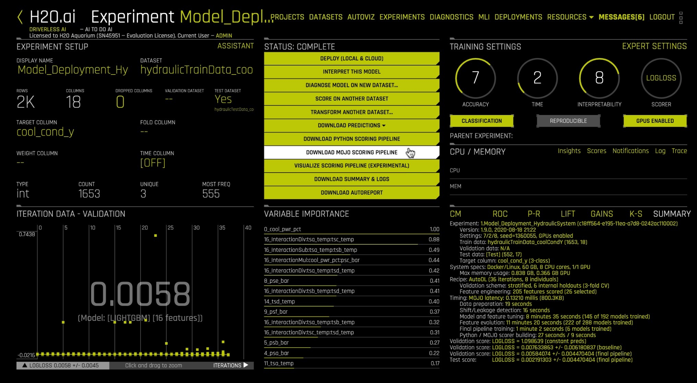
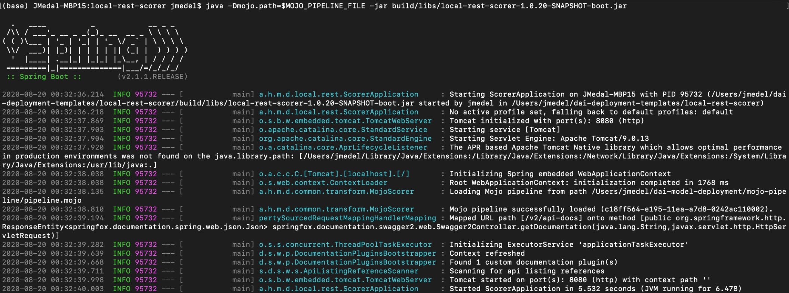
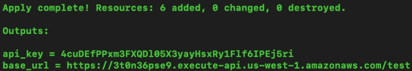

# Scoring Pipeline Deployment Templates

## Outline

- [Objective](#objective)
- [Prerequisites](#prerequisites)
- [Task 1: Set Up Environment](#task-1-set-up-environment)
- [Task 2: Scoring Pipeline Deployment Concepts](#task-2-scoring-pipeline-deployment-concepts)
- [Task 3: Interactive Scoring(REST and AWS Lambda) via Deployment Templates](#task-3-interactive-scoringrest-and-aws-lambda-via-deployment-templates)
- [Task 4: Challenge](#task-4-challenge)
- [Next Steps](#next-steps)
- [Appendix A: Troubleshooting Deployment](#appendix-a-troubleshooting-deployment)
- [Appendix B: AI Glossary](#appendix-b-ai-glossary)

## Objective

**Machine Learning Model Deployment** is the process of making your model available in production environments, so they can be used to make predictions for other software systems [1]. Before model deployment, **feature engineering** occurs in the form of preparing data that later on will be used to train a model [2]. Driverless AI **Automatic Machine Learning (AutoML)** combines the best feature engineering and one or more **machine learning models** into a scoring pipeline [3][4]. The **scoring pipeline** is used to score or predict data when given new test data [5]. The scoring pipeline comes in two flavors. The first scoring pipeline is a **Model Object, Optimized(MOJO) Scoring Pipeline**, which is a standalone, low-latency model object designed to be easily embeddable in production environments. The second scoring pipeline is a Python Scoring Pipeline, which has a heavy footprint that is all Python and uses the latest libraries of Driverless AI to allow for executing custom scoring recipes[6].

By the end of this tutorial, you will predict the **cooling condition** for a **Hydraulic System Test Rig** by deploying a **MOJO Scoring Pipeline** into production using **Driverless AI's Production Ready Deployment Templates**. The Hydraulic System Test Rig data comes from **[UCI Machine Learning Repository: Condition Monitoring of Hydraulic Systems Data Set](https://archive.ics.uci.edu/ml/datasets/Condition+monitoring+of+hydraulic+systems#)**. Hydraulic System Test Rigs are used to test components in Aircraft Equipment, Ministry of Defense, Automotive Applications, and more [7]. This Hydraulic Test Rig is capable of testing a range of flow rates that can achieve different pressures with the ability to heat and cool to simulate testing under different conditions [8]. Testing the pressure, volume flow and temperature is possible by Hydraulic Test Rig sensors and digital displays. The display panel alerts the user when certain testing criteria is met displaying either a green/red light [8]. A filter blockage panel indicator is integrated into the panel to ensure the Hydraulic Test Rig’s oil is maintained [8]. The cooling filtration solution is designed to minimize power consumption and expand the life of the Hydraulic Test Rig. We are predicting cooling conditions for Hydraulic System Predictive Maintenance. When the cooling condition is low, our prediction tells us that the cooling of the Hydraulic System is close to total failure and we may need to look into replacing the cooling filtration solution soon.

**Figure 1:** Hydraulic System Cylinder Diagram

The Hydraulic System consists of a primary and secondary cooling filtration circuit with pumps that deliver flow and pressure to the oil tank. The oil tank box at the bottom. There is a pressure relief control valve for controlling the rising and falling flows. There is a pressure gauge for measuring the pressure. 

### Deep Dive and Resources

[1] H2O.ai Community AI Glossary: [Machine Learning Model Deployment](https://www.h2o.ai/community/glossary/machine-learning-model-deployment-productionization-productionizing-machine-learning-models)

[2] H2O.ai Community AI Glossary: [Feature Engineering](https://www.h2o.ai/community/glossary/feature-engineering-data-transformation)

[3] H2O.ai Community AI Glossary: [Automatic Machine Learning (AutoML)](https://www.h2o.ai/community/glossary/automatic-machine-learning-automl)

[4] H2O.ai Community AI Glossary: [Machine Learning Model](https://www.h2o.ai/community/glossary/machine-learning-model)

[5] H2O.ai Community AI Glossary: [Scoring Pipeline](https://www.h2o.ai/community/glossary/scoring-pipeline)

[6] H2O.ai Community AI Glossary: [Model Object, Optimized (MOJO) Scoring Pipeline](https://www.h2o.ai/community/glossary/model-object-optimized-mojo)

[7] [SAVERY - HYDRAULIC TEST RIGS AND BENCHES](https://www.savery.co.uk/systems/test-benches)

[8] [HYDROTECHNIK - Flow and Temperature Testing Components](https://www.hydrotechnik.co.uk/flow-and-temperature-hydraulic-test-bed)

## Prerequisites

You will need the following to be able to do this tutorial:

- Skilled in Java Object Oriented Programming
- **Driverless AI Environment** on **Aquarium** with **Prebuilt Experiment** from Tutorial 4A: Scoring Pipeline Deployment Introduction
- Driverless AI License
    - It is needed for using the MOJO2 Java Runtime API to deploy the MOJO Scoring Pipeline to a REST Server or Amazon Lambda
    - **21-day trial license** or if you need to **purchase a Driverless AI license**, reach out to our sales team via the [contact us form](https://www.h2o.ai/company/contact/).
- Needed for AWS Lambda Deployment
    - If you have an Amazon Admin, request access permissions for
        - Amazon AWS with IAM Full Access
        - Amazon AWS with AWS Lambda Full Access
        - Amazon AWS with Amazon API Gateway Administrator
        - Amazon AWS with Usage Plans Enabled
    - Create an Amazon AWS IAM Access Key and Secret Key
- Basic knowledge of Driverless AI or doing the following tutorials:
    - [Tutorial 1A: Automatic Machine Learning Introduction with Driverless AI](https://training.h2o.ai/products/tutorial-1a-automatic-machine-learning-introduction-with-driverless-ai)
    - [Tutorial 4A: Scoring Pipeline Deployment Introduction](https://training.h2o.ai/products/tutorial-4a-scoring-pipeline-deployment-introduction#tab-product_tab_overview)

## Task 1: Set Up Environment

### Create Environment Directory Structure

~~~bash
# Create directory structure for Driverless AI Model Deployment Projects

# Create directory where the mojo-pipeline/ folder will be stored
mkdir $HOME/dai-model-deployment/
~~~

### Set Up Driverless AI MOJO Requirements

We will be using **Driverless AI version 1.9.0** to download the Driverless AI **MOJO Scoring Pipeline version 2.4.8**. Download the **Driverless AI autoreport** to see each component's version.

#### Download MOJO Scoring Pipeline

1\. If you have not built the experiment, go to **[Tutorial 4A: Scoring Pipeline Deployment Introduction](https://training.h2o.ai/products/tutorial-4a-scoring-pipeline-deployment-introduction#tab-product_tab_overview)**, then jump to "Appendix A: Build Experiment" to build it. When finished, come back to this tutorial.

2\. Now that the experiment has launched, we can download the MOJO Scoring Pipeline and/or the Python Scoring Pipeline. Click **Download MOJO Scoring Pipeline**.

**Figure 2**: Driverless AI Experiment Hover on Download MOJO Scoring Pipeline

3\. Select **Java** for Java Runtime. Click **Download MOJO Scoring Pipeline**.

**Figure 3**: Download Driverless AI Download MOJO Scoring Pipeline

4\. Let’s copy the **mojo.zip** file to the **dai-model-deployment/** folder and then extract the zip file:

~~~bash
cd $HOME/dai-model-deployment/
cp $HOME/Downloads/mojo.zip .
unzip mojo.zip
rm -rf mojo.zip
~~~

You will see a **mojo-pipeline** folder after the zip file is extracted.

#### Install MOJO REST Server & AWS Lambda Deployment Dependencies

5\. Download and install Anaconda

~~~bash
# Download Anaconda
wget https://repo.anaconda.com/archive/Anaconda3-2020.02-Linux-x86_64.sh

# Install Anaconda
bash Anaconda3-2020.02-Linux-x86_64.sh
~~~

Close your terminal and reopen it to activate conda.

6\. Create virtual environment and install required packages

~~~bash
conda create -y -n model-deployment python=3.6
conda activate model-deployment

conda install -y -c conda-forge openjdk=8.0.192
conda install -y -c conda-forge maven
conda install -c conda-forge terraform
~~~

### Specify Driverless AI License via Environment Variable

1\. Move your Driverless AI License file to **dai-model-deployment/** folder:

~~~bash
cp $HOME/path/to/license.sig $HOME/dai-model-deployment/
~~~

2\. Set the file path to the Driverless AI License file as a permanent environment variable by placing it inside `$HOME/.bash_profile` or `$HOME/.profile` file:

~~~bash
echo "export DRIVERLESS_AI_LICENSE_FILE='$HOME/dai-model-deployment/license.sig'" | tee -a $HOME/.bash_profile
~~~

> **Note**: If you purchased Driverless AI, it came with a license key and you will need it for this step.

### Deep Dive and Resources

- Driverless AI MOJO Scoring Pipeline - Java Runtime: http://docs.h2o.ai/driverless-ai/latest-stable/docs/userguide/scoring-mojo-scoring-pipeline.html

## Task 2: Scoring Pipeline Deployment Concepts

Driverless AI Deployment Templates are production ready deployment templates used by Driverless AI as a method to execute Scoring Pipelines in production environments. There are deployment templates for deploying MOJO scoring pipelines to local SpringBoot REST server, Amazon Lambda, Amazon Sagemaker, Google Cloud Run and SQL database [1]. If there is not a deployment template option for your needs, you can build your own template and contribute it back to the [Driverless AI Deployment Templates GitHub repository](https://github.com/h2oai/dai-deployment-templates). The repository’s build system is Gradle. So, you could use a build system that is compatible with Gradle.

### Gradle Build System

[Gradle](https://docs.gradle.org/current/userguide/getting_started.html) is the main build automation tool used for building the Driverless AI Deployment Templates. Driverless AI leverages the deployment templates from this GitHub repository to deploy scoring pipelines into production [1]. The current deployment templates are written in Java and built for deploying MOJO Scoring Pipelines into the Java Runtime Environment [1]. However, Gradle is capable of building anything [2]. So, for deploying the MOJO Scoring Pipeline into the C++ Runtime Environment, which has Python and R wrappers, one can write a deployment template in either language and use the [Python Gradle Plugin](https://github.com/linkedin/pygradle/blob/master/docs/getting-started.md) and/or [R Gradle Plugin](https://github.com/arekbee/gradle-R-plugin) to build their template [3][4]. Likewise, one can build a deployment template for the MOJO Scoring Pipeline in C++ Runtime calling functions from the MOJO C API. Similarly, one can build a deployment template in Python for the Python Scoring Pipeline. If you want to contribute your MOJO deployment template to H2O.ai, the recommendation would be to use Gradle or a build system that is compatible with the current Gradle build system, such as Apache Maven.

**Figure 4**: Gradle Logo. Image: https://github.com/gradle/gradle

### Jenkins

Jenkins is an open source automation server which we use with Gradle to reliably build, test and deploy the Driverless AI Deployment Templates [5]. The Jenkins pipeline is written in groovy to perform multiple stages that initialize, test, build and publish the production deployment templates as Docker Images to cloud production environments (includes S3, Harbor and DockerHub). [6]

**Figure 5**: Jenkins Logo. Image: https://github.com/jenkinsci/jenkins

### Java Spring Boot Framework

Java Spring Boot framework is used for creating microservices [7]. Many of the deployment templates leverage Java Spring Boot framework as a REST Server [1]. This server is where the MOJO Scoring Pipeline is executed and ready to make predictions on incoming data coming from a client. Currently, the Spring Boot Server and MOJO are used in the following templates: REST Scorer, Google Cloud Run, Amazon Sagemaker, and REST SQL Scorer [8] [10] [11] [12].

**Figure 6**: Spring Framework Logo. Image: https://github.com/spring-projects/spring-framework

### Terraform to Automate AWS Lambda MOJO Deployment

Terraform is the tool we use to build an Amazon Lambda function by providing AWS a Lambda template that includes our MOJO scoring pipeline [9]. We set Terraform variables using permanent or temporary environment variables to instruct Terraform on what to do in AWS. These tasks for Terraform include accessing our AWS IAM account using access key credentials, then choosing an existing s3 bucket in a certain region to store the MOJO [9]. After the non-optional Terraform variables are set, we tell Terraform to publish our Lambda template to Amazon Lambda [9].

**Figure 7**: Terraform Logo. Image: https://github.com/hashicorp/terraform

### REST Server and Client for Machine Learning Predictions

An approach to executing the MOJO Scoring Pipeline or Python Scoring Pipeline is to run it on a REST server. With many of the Driverless AI Deployment Templates, the MOJO Scoring Pipeline is executed on a Java Spring Boot REST server. When the MOJO is running, we can use it to score data. A client will make an HTTP request using the curl command to trigger the REST server’s MOJO to do scoring on his new input data. Once the MOJO has scored the new input data, the REST server will respond to the client’s request with the prediction result. If the user passes individual rows of new input data to the REST server, the MOJO will perform real-time scoring. If the user passes multiple rows of new input data to the REST server, the MOJO will perform batch scoring.

**Figure 8**: Server and Client Scoring Request Architecture. Images: https://freesvg.org/

### AWS Lambda for Machine Learning Predictions

Another approach to executing the MOJO Scoring Pipeline is to run it on an AWS Lambda function. An AWS Lambda is a serverless compute service that runs code in response to events and automatically manages the underlying compute resources for us [15]. With the AWS Lambda, we are able to upload our MOJO Scoring Pipeline execution code and the AWS Lambda takes care of everything required to run and scale our code with high availability [14]. With the AWS Lambda, we are not required to provision or manage servers [14]. The AWS Lambda will automatically scale our application by running code in response to each trigger [14]. With the AWS Lambda, we are only charged for the compute time we consume [14]. So, for every 100ms our code executes and the number of times our code is triggered, we are charged [14]. Thus, we are using the MOJO Scoring Pipeline to make predictions at a low operating cost. In this tutorial, we will be sending HTTP requests to the AWS Lambda function to trigger it to automatically execute our MOJO Scoring Pipeline to do real-time scoring and batch scoring.

### AWS Lambda vs EC2

#### Setup & Manage Environment

With an AWS Lambda Driverless AI MOJO scoring pipeline deployment, scaling is fully automated, meaning that you do not need to spin up or provision containers or make them available for your applications [18]. So, you do not need to do much work to set up one or more environments. We just need to apply a terraform from our local machine to deploy a Driverless AI MOJO scoring pipeline to a AWS Lambda. On the other hand with a Driverless AI MOJO scoring pipeline deployment to a REST server running on an AWS EC2 instance, setting up the environment includes logging into the instance via SSH, installing the dependencies for the REST server and MOJO, and doing a git clone on the Driverless AI deployment templates GitHub repository [18]. On the EC2, ideally for this set up process, you would have it done in a manner which is fully automated and reproducible.

#### Security

With AWS Lambda, it abstracts away the patching and OS manual work, but you need to consider how to secure communication happening inside and outside your application to avoid surface attacks [18]. Since the number of functions tends to increase, monitoring them becomes a challenge and can result in decaying functions [18]. Vulnerability breaches happening and malicious agents growing over time is likely not to happen due to the stateless characteristic of the functions [18].

With AWS EC2, you must consider the security layer at the instance level, which includes deciding and controlling the traffic allowed to communicate with each instance and dictating the allowed inbound traffic  through certain protocols [18]. With AWS EC2, some of these protocols include TCP, UDP, ICMP. Creating policies with correct permissions especially for a growing team is a work of trial and error and is tiresome [18]. Similarly, handling permissions for each business needs mean changing policies often and results in unwanted granularity [18]. However with AWS Lambda, creating policies, handling permissions, working on OS patches and system maintenance is entirely taken care of by AWS [18].

#### Performance

There are various performance factors that can be looked at when comparing AWS Lambda and EC2, which include timeout, dependencies, scalability, availability and latency. Let’s dive into the timeout performance. For AWS Lambda, long-running functions and complex tasks aren’t a good fit because the lambda has a timeout of 300 seconds [18]. With AWS Lambda, some timeouts don’t come from the 300 seconds limit, some happen due to bugs introduced to the program or when dealing with communication over external servers take too much time [18]. With AWS EC2, it has pretty flexible options, so you can work with long running tasks since instances are available for different types of requirements with different configurations [18]. However, the AWS EC2 option is not error free since it does suffer from connection timeout because of overlapping security group rules and unidentified user key by the server and potentially other timeout issues [18]. So, if your performance factor involves dealing with long running tasks performing complex processing, which could introduce timeouts, then you should go with AWS EC2 over AWS Lambda since Lambda lags [18].

#### Cost Comparison

Both AWS Lambda and EC2 offer free tier versions, so they are free. Let’s look at the cost comparison for 1 use case, which is a low/infrequent traffic on a website/app [18]. If we look at the following specifications for the use case in regards to the AWS Lambda, let’s say we receive 10,000 hits per day over 24 hours and 200ms per hit at 512 GB for execution time [18]. Then this result will be 432,000 requests per month with 2,160 GB-sec of compute per month and the total cost will be $0.31 per month for the AWS Lambda[18]. On the other hand, the smallest EC2 nano instance will cost 10 times more since it runs for 24 hours causing the cost to be multiplied by 24 [18].

### AWS Lambda Cold-Start in Real-Time Request Latency

If you decide to go with AWS Lambda for Driverless AI MOJO scoring pipeline deployment, there are a few factors you should consider with real-time scoring request latency. A low latency network connection results in small delay times while a high latency suffers from long delays. So, low latency for real-time scoring requests would be ideal because it is immediate. Cold starts equal higher latency [16, jarmod]. If you are using multiple layers in AWS for Lambda MOJO deployment like CloudFront, then API Gateway and Lambda, then real-time scoring requests will result in a higher latency [16, jarmod]. The programming language for your Lambda MOJO deployment could impact scoring requests latency, such as using Java will result in the highest cold-start latency whereas Go will result in the lowest cold-start latency [16, jarmod]. Your Lambda environment size impacts the scoring requests latency, such as an environment with more RAM and more CPU will result in faster response time [16, jarmod]. When going the route of AWS Lambda for MOJO deployment, cold-start will cause high latency for the scoring request, so applying a pre-warming strategy to your Lambda may be a potential solution to ensuring that your Lambda responds to a scoring request results in low latency [16, jarmod]. One issue that may cause the Lambdas to not stay warm is that they are not receiving enough requests per day [16, Quentin Hayot]. If you have a time critical application in which a user is on the phone and waiting for text-to-speech to answer, then it may suffer from the Lambda’s high latency response time. One approach to ensuring that the lambdas stay warm is to call them enough using NPM’s Serverless WarmUp Plugin, so that they don’t get cold[16, Quentin Hayot][17].

### Deep Dive and Resources

[1] [H2O.ai GitHub Repository: Driverless AI Deployment Templates](https://github.com/h2oai/dai-deployment-templates)

[2] [Gradle Build Tool](https://gradle.org/)

[3] [LinkedIn GitHub Repository: PyGradle](https://github.com/linkedin/pygradle)

[4] [arekbee GitHub Repository: Gradle R Plugin](https://github.com/arekbee/gradle-R-plugin)

[5] [Jenkins](https://jenkins.io/)

[6] [H2O.ai GitHub Repository: Driverless AI Deployment Templates - Jenkinsfile](https://github.com/h2oai/dai-deployment-templates/blob/master/Jenkinsfile)

[7] [Spring Boot - Introduction](https://www.tutorialspoint.com/spring_boot/spring_boot_introduction.htm)

[8] [Driverless AI Deployment Template for Local SpringBoot Scorer](https://github.com/h2oai/dai-deployment-templates/tree/master/local-rest-scorer)

[9] [Driverless AI Deployment Template for AWS Lambda](https://github.com/h2oai/dai-deployment-templates/tree/master/aws-lambda-scorer)

[10] [Driverless AI Deployment Template for Google Cloud Run](https://github.com/h2oai/dai-deployment-templates/tree/master/gcp-cloud-run)

[11] [Driverless AI Deployment Template for Sagemaker Hosted Scorer](https://github.com/h2oai/dai-deployment-templates/tree/master/aws-sagemaker-hosted-scorer)

[12] [Driverless AI Deployment Template for Local Rest SQL Scorer](https://github.com/h2oai/dai-deployment-templates/tree/master/sql-jdbc-scorer)

[13] [Introduction to Terraform](https://www.terraform.io/intro/index.html)

[14] [AWS Lambda Overview](https://aws.amazon.com/lambda/)

[15] [AWS Lambda Features](https://aws.amazon.com/lambda/features/)

[16] [Stackoverflow: Is AWS Lambda good for real-time API Rest?](https://stackoverflow.com/questions/52059561/is-aws-lambda-good-for-real-time-api-rest)

[17] [NPM: Serverless WarmUp Plugin](https://www.npmjs.com/package/serverless-plugin-warmup)

[18] [AWS Lambda vs EC2: Comparison of AWS Compute Resources](https://www.simform.com/aws-lambda-vs-ec2/#:~:text=AWS%20Lambda%20is%20an%20on,%2Da%2Dservice%20by%20AWS.&text=The%20main%20difference%20between%20AWS,cases%20to%20name%20a%20few.)

## Task 3: Interactive Scoring(REST and AWS Lambda) via Deployment Templates

Now you have some background in scoring pipeline deployment templates. Let’s download the Driverless AI Deployment Template GitHub repo, build the templates using gradle and deploy our MOJO scoring pipeline locally and to the cloud.

### Download Driverless AI Deployment Templates

1\. Go to GitHub repository hyperlink https://github.com/h2oai/dai-deployment-templates

**Figure 9**: Driverless AI Deployment Templates GitHub

2\. Download the **dai-deployment-templates** to your computer’s `$HOME` folder.

~~~bash
cd $HOME
git clone https://github.com/h2oai/dai-deployment-templates
cd dai-deployment-templates
~~~

3\. Build the templates using the Gradle build automation tool.

~~~bash
./gradlew distributionZip
~~~

You should receive a message that the build completed successfully. 

### Deep Dive and Resources

- [Driverless AI Deployment Templates](https://github.com/h2oai/dai-deployment-templates)

### Deploy Driverless AI MOJO Scoring Pipeline to REST Server

We just built the local REST scorer template. Now we can run the local scorer. Let’s use the direct executable jar approach. The documentation tells us that the local scorer run command needs the path to the pipeline.mojo file. This file resides in the mojo-pipeline folder. 

1\. Let’s provide the path to the **pipeline.mojo** using a permanent environment variable by adding the **export MOJO_PIPELINE_FILE** to the `$HOME/.bash_profile` or `$HOME/.profile` file.

~~~bash
export MOJO_PIPELINE_FILE="$HOME/dai-model-deployment/mojo-pipeline/pipeline.mojo”
~~~

2\. Then start the rest scorer.

~~~bash
cd local-rest-scorer
java -Dmojo.path=$MOJO_PIPELINE_FILE -jar build/libs/local-rest-scorer-{version}-SNAPSHOT-boot.jar
~~~

You should see the Java SpringBoot server application launching.

**Figure 10**: Launched SpringBoot Application and Loaded Driverless AI MOJO Scoring Pipeline

The Java SpringBoot server application finished launching. So, now our MOJO scoring pipeline has been loaded on the REST server. It is ready to be sent scoring requests.

3\. Create a **test.json** file with our scoring request payload.

~~~bash
tee -a test.json << EOF
{
   "fields": ["psa_bar", "psb_bar", "psc_bar", "psd_bar", "pse_bar", "psf_bar", "fsa_vol_flow", "fsb_vol_flow", "tsa_temp", "tsb_temp", "tsc_temp", "tsd_temp", "pump_eff", "vs_vib", "cool_pwr_pct", "eff_fact_pct"],
   "rows": [["155.56646728515625", "104.93318176269531", "0.862698495388031", "0.00021100000594742596", "8.37287425994873", "8.321526527404785", "2.0819649696350098", "8.871089935302734", "35.355934143066406", "40.99454879760742", "38.31908416748047", "30.47344970703125", "2366.707275390625", "0.5243666768074036", "1.3755667209625244", "19.58085060119629"]]
}
EOF
~~~

> Note: the data in the json scoring request payload comes from one row of Hydraulic System data in the `$HOME/dai-model-deployment/mojo-pipeline/example.csv`

4\. Copy and paste the curl command into your terminal, then run it to request that the REST server's MOJO scoring pipeline computes a prediction for hydraulic cooling condition:

~~~bash
# Request REST Server MOJO do interactive scoring for hydraulic cooling condition
curl \
   -X POST \
   -H "Content-Type: application/json" \
   -d @test.json http://localhost:8080/model/score
~~~

You should see the following prediction output for Hydraulic Cooling Condition:

**Figure 11**: Hydraulic Cooling Condition Classification Results

- **cool_cond_y.3 = operates at close to total failure**
- **cool_cond_y.20 = operates at reduced efficiency**
- **cool_cond_y.100 = operates at full efficiency** 

From looking at the classification probabilities in the image above, we can infer whether the Hydraulic Cooler is operating at **close to total failure**, **reduced efficiency** or **full efficiency**.

5\. Stop the local REST server by pressing **control + C**. 

**Figure 12**: Shutting Down SpringBoot Application

6\. Go back to the **dai-deployment-templates/** folder

~~~bash
cd $HOME/dai-deployment-templates/
~~~

### Deep Dive and Resources

- [Driverless AI Deployment Template for Local SpringBoot Scorer](https://github.com/h2oai/dai-deployment-templates/tree/master/local-rest-scorer)
- [Building an Application with Spring Boot](https://spring.io/guides/gs/spring-boot/)

### Deploy Driverless AI MOJO Scoring Pipeline to Amazon Lambda

We will use the Driverless AI Deployment Template **aws-lambda-scorer** to deploy the MOJO Scoring Pipeline to Amazon Lambda. This template is powered by AWS API Gateway with Lambda proxy integration and Terraform recipe.

1\. Create a new s3 bucket in AWS with default settings and name it `h2oai-model-hydraulic-lambda`, then click **Create**.

**Figure 13**: Create s3 Bucket for AWS Lambda Deployment

2\. Go to the aws-lambda-scorer/ folder.

~~~bash
cd aws-lambda-scorer
~~~

3\. Initialize terraform in the terraform-recipe folder to download all necessary Terraform plugins including the AWS one.

~~~bash
cd terraform-recipe
terraform init
~~~

**Figure 14**: Initialize Terraform

4\. In your terminal, set the terraform variables using temporary environment variables.

~~~bash
export TF_VAR_access_key={AWS IAM access key}
export TF_VAR_secret_key={AWS IAM secret access key}
export TF_VAR_region={AWS region; ex: us-west-1}
export TF_VAR_lambda_id=h2oai_model-hydraulic-lambda
export TF_VAR_mojo_path=$MOJO_PIPELINE_FILE
export TF_VAR_license_key={Driverless AI License Key}
export TF_VAR_bucket_name=h2oai-model-hydraulic-lambda
~~~

5\. Let's launch our Amazon Lambda function and also load our MOJO scoring pipeline on it. Terraform will ask you for confirmation, enter `yes`.

~~~bash
terraform apply
~~~

**Figure 15**: Apply Terraform to Launch AWS Lambda and Load MOJO Scoring Pipeline

Note: if you run into an error when executing terraform apply, check out [Appendix A: Troubleshooting Deployment](#appendix-a-troubleshooting-deployment)

Now that our Amazon Lambda function has been launched and our MOJO scoring pipeline has loaded on it, terraform provides us with the **api_key** and **base_url**, which we can use for sending score requests.

6\. Create a **test.json** file with our scoring request payload.

~~~bash
tee -a test.json << EOF
{
   "fields": ["psa_bar", "psb_bar", "psc_bar", "psd_bar", "pse_bar", "psf_bar", "fsa_vol_flow", "fsb_vol_flow", "tsa_temp", "tsb_temp", "tsc_temp", "tsd_temp", "pump_eff", "vs_vib", "cool_pwr_pct", "eff_fact_pct"],
   "rows": [["155.56646728515625", "104.93318176269531", "0.862698495388031", "0.00021100000594742596", "8.37287425994873", "8.321526527404785", "2.0819649696350098", "8.871089935302734", "35.355934143066406", "40.99454879760742", "38.31908416748047", "30.47344970703125", "2366.707275390625", "0.5243666768074036", "1.3755667209625244", "19.58085060119629"]]
}
EOF
~~~

7\. Copy and paste the curl command into your terminal, then run it to request that the Amazon Lambda's MOJO scoring pipeline computes a prediction for hydraulic cooling condition:

~~~bash
# Request AWS Lambda MOJO do interactive scoring for hydraulic cooling condition
curl \
   -X POST \
   -d @test.json \
   -H "x-api-key: {api-key-returned-by-terraform}" \
   {base-url-returned-by-terraform}/score
~~~

**Figure 16**: Hydraulic Cooling Condition Classification Results

- **cool_cond_y.3 = operates at close to total failure**
- **cool_cond_y.20 = operates at reduced efficiency**
- **cool_cond_y.100 = operates at full efficiency** 

From looking at the classification probabilities in the image above, we can infer whether the Hydraulic Cooler is operating at **close to total failure**, **reduced efficiency** or **full efficiency**.

### Deep Dive and Resources

- [Driverless AI Deployment Template for AWS Lambda](https://github.com/h2oai/dai-deployment-templates/tree/master/aws-lambda-scorer)
- [Build Your First Serverless Web Application with AWS Lambda](https://aws.amazon.com/serverless/build-a-web-app/)
- [Build a Serverless Web Application with AWS Lambda, Amazon API Gateway, AWS Amplify, Amazon DynamoDB, and Amazon Cognito](https://aws.amazon.com/getting-started/hands-on/build-serverless-web-app-lambda-apigateway-s3-dynamodb-cognito/)

### Delete Amazon Lambda MOJO Deployment

If you no longer need your Amazon Lambda Driverless AI MOJO Scoring Pipeline deployment, we will walk you through manually cleaning up the remaining components in AWS. 

1\. Login to your [AWS IAM account](https://signin.aws.amazon.com/signin?redirect_uri=https%3A%2F%2Faws.amazon.com%2Fmarketplace%2Fmanagement%2Fsignin%3Fstate%3DhashArgs%2523%26isauthcode%3Dtrue&client_id=arn%3Aaws%3Aiam%3A%3A015428540659%3Auser%2Faws-mp-seller-management-portal&forceMobileApp=0). Let’s go to the s3 bucket service.

2\. Go to s3 bucket **h2oai-model-hydraulic-lambda**, then click it. Click **Delete**.

**Figure 17**: Delete s3 Bucket from AWS Lambda Deployment

3\. Type the name of the bucket for **h2oai-model-hydraulic-lambda** to confirm deletion. Then click **Confirm**.

**Figure 18**: Confirm s3 Bucket Deletion 

4\. Next let’s go to the Amazon Lambda functions. Search for your Lambda function, **h2oai_h2oai_model-hydraulic-lambda**. Click on the **circle** to select it.

5\. Click on **Actions**. Click **Delete**.

**Figure 19**: Delete Amazon Lambda Function

6\. Next go to API Gateway service. Search for your Gateway API, **h2oai_h2oai_model-hydraulic-lambda**. Click on the **circle** to select it.

7\. Click **Actions**, then **Delete**.

**Figure 20**: Delete API Gateway

8\. Confirm you want to Delete API Gateway. Click **Delete**.

**Figure 21**: Confirm Delete API Gateway

9\. Go to IAM service and **delete** the IAM Policy related to our Amazon Lambda.

**Figure 22**: Delete IAM Policy

10\. Confirm you want to delete IAM Policy. Click Delete.

**Figure 23**: Confirm Delete IAM Policy

11\. Go to IAM Roles, search for the IAM Role **h2oai_h2oai_model-hydraulic-lambda**. Click the **checkbox**. Then click **Delete role**.

12\. Confirm you want to delete IAM Role. Click **Yes, delete**.

**Figure 24**: Delete IAM Role

In our Amazon AWS IAM account, we just deleted the components related to the Amazon Lambda MOJO deployment. The components that we deleted include the Amazon Lambda function, IAM Policy, IAM Role, API Gateway and s3 bucket. The components that should remain are the IAM access key and IAM secret access key.

### Deep Dive and Resources

- [Driverless AI: Deploying the MOJO Pipeline](http://docs.h2o.ai/driverless-ai/1-8-lts/docs/userguide/deployment.html)
- [Driverless AI Deployment Template for Local SpringBoot Scorer](https://github.com/h2oai/dai-deployment-templates/tree/master/local-rest-scorer)
- [Driverless AI Deployment Template for AWS Lambda](https://github.com/h2oai/dai-deployment-templates/tree/master/aws-lambda-scorer)
- [Spring Boot - Introduction](https://www.tutorialspoint.com/spring_boot/spring_boot_introduction.htm)
- [Introduction to Terraform](https://www.terraform.io/intro/index.html)

## Task 4: Challenge

### Deploy Scoring Pipeline for a New Dataset

There are various challenges one could do, you could do something that helps you in your daily life or job. Maybe there is a dataset you are working with, you could reproduce the steps we did above, but for your dataset, build a new experiment and deploy your MOJO scoring pipeline to a REST server or Amazon Lambda.

### Integrate Scoring Pipeline into Program

Another challenge could be to use the existing MOJO scoring pipeline we deployed and instead of using curl command to score data, integrate the scoring into a Java, Python, R, C++, etc program using an HTTP client.

### Create New Deployment Template to Deploy Scoring Pipeline

Alternatively, you could create a new Driverless AI Deployment Template to deploy the MOJO scoring pipeline to a production environment not yet supported. Currently, there is support for MOJO deployment to a local REST server, Amazon Lambda, Amazon Sagemaker, Google Cloud Run, SQL database. Once you’ve tested your deployment template, you can contribute it back to the open source. Or you could try one of the already existing deployment templates we did not cover and deploy the MOJO to that production environment. 

## Next Steps

- Check out Driverless AI's next tutorials on embeddable Scoring Pipeline Deployment where you will learn to deploy **MOJO Scoring Pipelines** into production in **Java Runtime** and **C++ Runtime** using **Mojo2 Runtime API**:
    - Tutorial: Scoring Pipeline Deployment in Java Runtime (coming soon...)
    - Tutorial: Scoring Pipeline Deployment in C++ Runtime (coming soon...)

- Check out Driverless AI's next tutorial on embedable Scoring Pipeline Deployment where you will learn to deploy **Python Scoring Pipelines** and **MLI Python Scoring Pipelines** into production in **Python Runtime** using **h2oai_scoring API**:
    - Tutorial: Scoring Pipeline Deployment in Python Runtime (coming soon...)
    - Tutorial: MLI Scoring Pipeline Deployment in Python Runtime (coming soon...)

- Check out these webinars that dive into how to productionize H2O Driverless AI Models:
    - H2O.ai Webinar: [Accelerate Your Enterprise AI on Snowflake with H2O.ai (by Yves Laurent, Eric Gudgion, Chris Pouliot, Isaac Kunen)](https://www.brighttalk.com/service/player/en-US/theme/default/channel/16463/webcast/415599/play?showChannelList=true)
    - H2O.ai Webinar: [Learn How to Easily Use AI Against Your Production Database by Eric G](https://www.brighttalk.com/service/player/en-US/theme/default/channel/16463/webcast/367565/play?showChannelList=true)

- Check out these articles on deploying H2O Driverless AI on VMware:
    - VMware Blog: [Deploying a Machine Learning Model into Production on VMware with H2O, Apache Spark and GPUs](https://blogs.vmware.com/apps/2019/03/deploying-a-machine-learning-model-into-production-on-vmware-with-h20-apache-spark-and-gpus.html)
    - VMware Blog: [Machine Learning on Vmware: Training a Model with H2O.ai Tools, Inference using a REST Server and Kubernetes by Justin Murray](https://blogs.vmware.com/apps/2019/06/machine-learning-on-vmware-training-a-model-with-h2o-ai-tools-inference-using-a-rest-server-and-kubernetes.html)

- Check out this article on deploying H2O Driverless AI to Oracle Cloud Infrastructure using Terraform templates:
    - Oracle Blog: [Machine Learning with H2O.ai and Oracle ERP by Ben Lackey](https://blogs.oracle.com/cloud-infrastructure/machine-learning-with-h2oai-and-oracle-erp)

## Appendix A: Troubleshooting Deployment

### Amazon Labmda

If you receive the following error related to the function call:

**Figure 25**: Terraform Error in **file** function call due to invalid UTF-8

With the recent update from Terraform 0.11 to 0.12, **file** does not accept any file that is not a valid **UTF-8**. This issue occurs because **pipeline.mojo** is not a valid **UTF-8**. 

Another error you may run into relates to the file hashing result not being the same for both files:

**Figure 26**: Terraform Error from hash result of both files being inconsistent

The reason this error occurs is after the hash result for both files is compared, they are different. 

So, refer to the file `/Users/jmedel/dai-deployment-templates/aws-lambda-scorer/terraform-recipe/main.tf` and on line 42, update it to 

~~~
etag = "${filemd5(var.mojo_path)}"
~~~

Similarly, on line 51, update it to

~~~
source_code_hash = "${filesha256(var.lambda_zip_path)}"
~~~

If line 42 and 51 have already been updated, then you can ignore the above suggestions.

With this update applied, terraform will obtain the file hashing results from both files without requiring UTF-8 to be valid. Also when the hashing result from both files is compared, they should both be equal.

### Resources

- [hashicorp/terraform GitHub: 0.12-rc1 file function fails due to UTF-8 error](https://github.com/hashicorp/terraform/issues/21260)

## Appendix B: AI Glossary

Refer to [H2O.ai Community AI Glossary](https://www.h2o.ai/community/top-links/ai-glossary-search) for relevant Model Deployment Terms