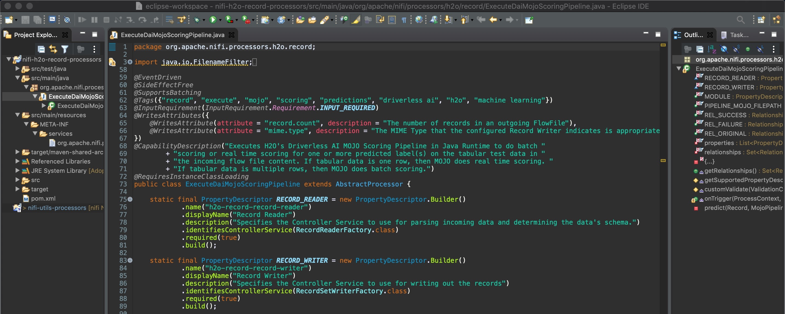
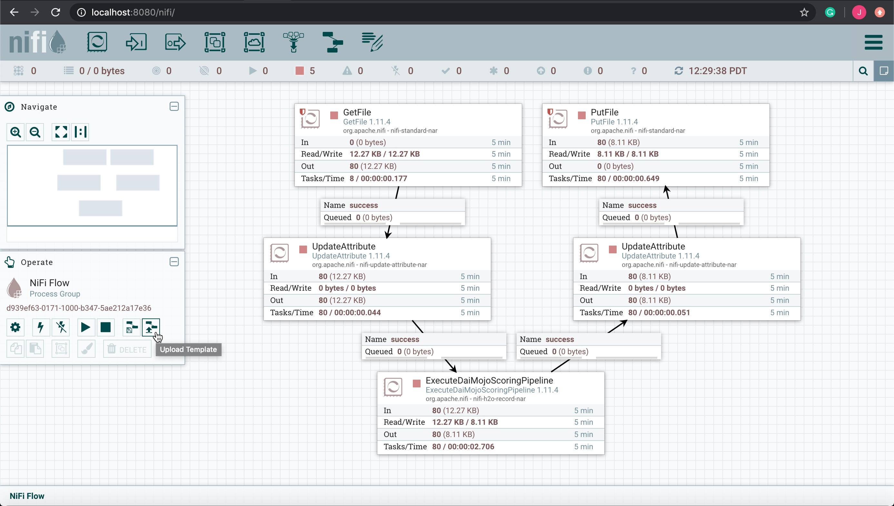
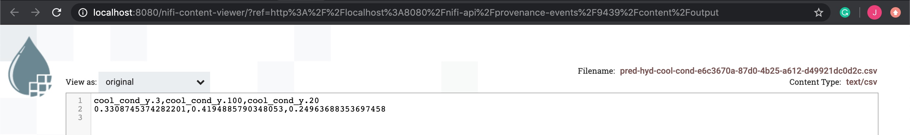

# Scoring Pipeline Deployment to Apache NiFi

## Outline

- [Objective](#objective)
- [Prerequisites](#prerequisites)
- [Task 1: Set Up Environment](#task-1-set-up-environment)
- [Task 2: NiFi and MOJO Scoring Pipeline Concepts](#task-2-nifi-and-mojo-scoring-pipeline-concepts)
- [Task 3: Batch Scoring](#task-3-batch-scoring)
- [Task 4: Real-Time Scoring](#task-4-real-time-scoring)
- [Task 5: Challenge](#task-5-challenge)
- [Next Steps](#next-steps)

## Objective

**Machine Learning Model Deployment** is the process of making your model available in production environments, so they can be used to make predictions for other software systems. Before model deployment, **feature engineering** occurs in the form of preparing data that later on will be used to train a model. Driverless AI **Automatic Machine Learning (AutoML)** combines the best feature engineering and one or more **machine learning models** into a scoring pipeline. The scoring pipeline is used to score or predict data when given new test data. The **scoring pipeline** comes in two flavors. The first scoring pipeline is a **Model Object, Optimized (MOJO) Scoring Pipeline**, which is a standalone, low-latency model object designed to be easily embeddable in production environments. The second scoring pipeline is a Python Scoring Pipeline, which has a heavy footprint that is all Python and uses the latest libraries of Driverless AI to allow for executing custom scoring recipes.

By the end of this tutorial, you will predict the **cooling condition** for a Hydraulic System Test Rig by deploying an **embeddable MOJO Scoring Pipeline** to **Apache NiFi**. The Hydraulic System Test Rig data comes from the [UCI Machine Learning Repository: Condition Monitoring of Hydraulic Systems Data Set](https://archive.ics.uci.edu/ml/datasets/Condition+monitoring+of+hydraulic+systems#). Hydraulic System Test Rigs are used to test components in Aircraft Equipment, Ministry of Defense, Automotive Applications, and more [1]. This Hydraulic Test Rig is capable of testing a range of flow rates that can achieve different pressures with the ability to heat and cool to simulate testing under different conditions [2]. Testing the pressure, volume flow, and the temperature is possible by Hydraulic Test Rig sensors and digital displays.. The display panel alerts the user when certain testing criteria is met displaying either a green/red light [2]. A filter blockage panel indicator is integrated into the panel to ensure the Hydraulic Test Rig’s oil is maintained [2]. The cooling filtration solution is designed to minimize power consumption and expand the life of the Hydraulic Test Rig. We are predicting cooling conditions for Hydraulic System Predictive Maintenance. When the cooling condition is low, our prediction tells us that the cooling of the Hydraulic System is close to total failure and we may need to look into replacing the cooling filtration solution soon.


Figure: Hydraulic Test Rig General Cylinder Diagram

The Hydraulic Test Rig consists of a primary and secondary cooling filtration circuit with pumps that deliver flow and pressure to the oil tank. The oil tank box at the bottom. There is a pressure relief control valve for controlling the rising and falling flows. There is a pressure gauge for measuring the pressure. 

### Resources

[1] [SAVERY - HYDRAULIC TEST RIGS AND BENCHES](https://www.savery.co.uk/systems/test-benches)</br>
[2] [HYDROTECHNIK - Flow and Temperature Testing Components](https://www.hydrotechnik.co.uk/flow-and-temperature-hydraulic-test-bed)

## Prerequisites

- Skilled in Java Object Oriented Programming
- Driverless AI Environment
- Driverless AI License
    - The license is needed to use the MOJO2 Java Runtime API to execute the MOJO Scoring Pipeline in Apache NiFi
    - [21 day trial license](https://www.h2o.ai/try-driverless-ai/)
    - If you need to purchase a Driverless AI license, reach out to our sales team via the [contact us form](https://www.h2o.ai/company/contact/).
- Basic knowledge of Driverless AI or completion of the following tutorials:
    - [Tutorial 1A: Automatic Machine Learning Introduction with Driverless AI Test Drive](https://h2oai.github.io/tutorials/automatic-ml-intro-with-driverless-ai)
    - [Tutorial 4A: Scoring Pipeline Deployment Introduction](https://h2oai.github.io/tutorials/scoring-pipeline-deployment-introduction)
    - [Tutorial 4B: Scoring Pipeline Deployment Templates](https://h2oai.github.io/tutorials/scoring-pipeline-deployment-templates)
    - [Tutorial 4C: Scoring Pipeline Deployment in Java Runtime](https://h2oai.github.io/tutorials/scoring-pipeline-deployment-in-java-runtime)
- Downloaded the Driverless AI Deployment Repo to your local machine since we will be using the NiFi Data Flow xml templates that come with mojo-nifi/ folder.

```bash
git clone -b mojo-nifi https://github.com/james94/dai-deployment-examples/
```

## Task 1: Set Up Environment

### Create an Environment Directory Structure

```bash
# Create directory structure for DAI MOJO NiFi Projects

# Create directory where the mojo-pipeline/ folder will be stored
mkdir $HOME/dai-mojo-nifi/

# Create input directory used for batch scoring or real-time scoring
mkdir -p $HOME/dai-mojo-nifi/testData/{test-batch-data,test-real-time-data}
```

### Set Up Driverless AI MOJO Requirements

#### Download MOJO Scoring Pipeline

1\. If you have not downloaded the MOJO Scoring Pipeline, go to [Tutorial 4B: Scoring Pipeline Deployment Templates](https://h2oai.github.io/tutorials/scoring-pipeline-deployment-templates), then go to **Task 1: Set Up Environment**, and then go to **Download MOJO Scoring Pipeline** to download it. When finished, come back to this tutorial.

2\. Move the **mojo.zip** file to `dai-mojo-nifi/` folder and then extract it:

```bash
cd $HOME/dai-mojo-nifi/
mv $HOME/Downloads/mojo.zip .
unzip mojo.zip
```

#### Install MOJO2 Java Runtime Dependencies

3\. Download and install Anaconda

```bash
# Download Anaconda
wget https://repo.anaconda.com/archive/Anaconda3-2020.02-Linux-x86_64.sh

# Install Anaconda
bash Anaconda3-2020.02-Linux-x86_64.sh
```

4\. Create virtual environment and install required packages

```bash
# Install Python 3.6.10
conda create -y -n model-deployment python=3.6
conda activate model-deployment
# Install Java
conda install -y -c conda-forge openjdk=8.0.192

# Install Maven
conda install -y -c conda-forge maven
```

#### Set Driverless AI License Key

5\. Set the Driverless AI License Key as a temporary environment variable

```bash
# Set Driverless AI License Key
export DRIVERLESS_AI_LICENSE_KEY="{license-key}"
```

### Prepare Hydraulic Test Data For Mojo NiFi Scoring

Make sure there is **input test data** in the NiFi input directory.

1\. For **batch scoring**, you should make sure there is one or more files with multiple rows of csv data in the following directory:

```bash
# go to mojo-pipeline/ directory with batch data example.csv
cd $HOME/dai-mojo-nifi/mojo-pipeline/

# copy this batch data to the input dir where NiFi pulls the batch data
cp example.csv $HOME/dai-mojo-nifi/testData/test-batch-data/
```

2\. For **real-time scoring**, you should make sure there are files with a single row of csv data in the following directory:

```bash
# go to real-time input dir where we will store real-time data
cd $HOME/dai-mojo-nifi/testData/test-real-time-data/

# copy example.csv to the input dir where NiFi pulls the real-time data
cp $HOME/dai-mojo-nifi/mojo-pipeline/example.csv .

# remove file's 1st line, the header
echo -e "$(sed '1d' example.csv)\n" > example.csv

# split example.csv into smaller real-time files each with 1 line
split -l 1 example.csv test_

# add .csv extension to all test_* files in folder
for f in test* ; do mv "$f" "${f}.csv"; done

# remove example.csv from real-time input dir
rm -rf example.csv
```

### Set Up NiFi Local Cluster
1\. Download **NiFi**

```bash
cd $HOME
# Download NiFi
wget https://downloads.apache.org/nifi/1.11.4/nifi-1.11.4-bin.tar.gz
# Extract NiFi tar.gz
tar -xvf nifi-1.11.4-bin.tar.gz
```

### Compile MOJO NiFi Processor
1\. Download **Driverless AI Deployment Examples** Repo for **NiFi** assets

```bash
cd $HOME
git clone -b mojo-nifi https://github.com/james94/dai-deployment-examples/
```

2\. Compile the Java code for **MOJO NiFi processor** into a **NAR package**:

```bash
cd $HOME/dai-deployment-examples/mojo-nifi/
cd model-deployment/apps/nifi/nifi-nar-bundles/nifi-h2o-record-bundle/
mvn clean install
```

### Add the MOJO NiFi Processor to the NiFi Product

1\. Copy over the NiFi NAR file `nifi-h2o-record-nar-1.11.4.nar`, which contains the Java MOJO NiFi processor to the NiFi lib/ folder:

```bash
# go into nifi lib/ folder
cd $HOME/nifi-1.11.4/lib/

# copy nifi h2o nar to current folder
cp $HOME/dai-deployment-examples/mojo-nifi/model-deployment/apps/nifi/nifi-nar-bundles/nifi-h2o-record-bundle/nifi-h2o-record-nar/target/nifi-h2o-record-nar-1.11.4.nar .
```

### Start the NiFi Server
1\. Start the NiFi server where we will access the NiFi UI to import NiFi data flows to do batch scoring or real-time scoring:

```bash
# go back to nifi base folder
cd ../

# start nifi
./bin/nifi.sh start

# stop nifi
# ./bin/nifi.sh stop
```

Access NiFi UI at http://localhost:8080/nifi/

**Note:** It may take a few minutes for the NiFi server to load the NiFi UI application.

### Import MOJO NiFi Flow Template into NiFi

1\. On the left side of the NiFi canvas there is an Operate Panel. Click on the **upload button** to upload a NiFi Data Flow Template from your local machine:


2\. Upload each of the following **NiFi Data Flow xml templates** from your local machine to NiFi:
```bash
# NiFi Data Flow Template executes MOJO for batch scoring
$HOME/dai-deployment-examples/mojo-nifi/model-deployment/apps/nifi/templates/predBatchesHydCoolCond.xml
 
# NiFi Data Flow Template executes MOJO for real-time scoring
$HOME/dai-deployment-examples/mojo-nifi/model-deployment/apps/nifi/templates/predRealTimeHydCoolCond.xml
```

After diving into some concepts on deploying the MOJO Scoring Pipeline to Apache NiFi, we will run these NiFi flow templates to execute MOJO to make predictions.

## Task 2: NiFi and MOJO Scoring Pipeline Concepts

### Embedding the MOJO into a Custom NiFi Processor

If you have gone through the earlier scoring pipeline deployment tutorials, you have seen one particular way we deploy the MOJO Scoring Pipeline is to a server or serverless instance and there is some client that interacts with the server to trigger it to execute the MOJO to make predictions. An alternative way to deploy the MOJO Scoring Pipeline is to embed it directly into the Java Runtime Environment where your Apache NiFi application is running. With NiFi, we would take advantage of NiFi’s custom processor extensibility and build a custom NiFi processor that uses the MOJO Java API to load the MOJO and perform predictions on the data passing through the processor and output the results to the remaining processors in the NiFi Data Flow. We will be going over the custom MOJO NiFi processor built for this tutorial.

### Open Custom NiFi Processor Code in Eclipse IDE
If you want to add or update the Java code for the NiFi processor, you can open your favorite IDE, then import the project. Let’s walk through the steps to open the project in Eclipse:

```bash
cd $HOME/dai-deployment-examples/mojo-nifi/model-deployment/apps/nifi/nifi-nar-bundles/nifi-h2o-record-bundle/

# Download the JAR package dependencies for the Eclipse project
mvn eclipse:eclipse -DdownloadSource=true
```

**Import the NiFi processor project** `$HOME/dai-deployment-examples/mojo-nifi/model-deployment/apps/nifi/nifi-nar-bundles/nifi-h2o-record-processors/` in Eclipse:




### Process For Developing the Custom NiFi Processor

For developing the custom NiFi processor, you can use Maven and Eclipse IDE. When using NiFi with Maven, there is the option to build a starter template for the custom processor you are going to build. To generate the starter template, you can use the following command: `mvn archetype:generate`. Next we are ready to work on the processor's code in an Integrated Development Environment (IDE). In this tutorial, we briefly look at the steps to open and compile the Java code in Eclipse. Ypu can run the command `mvn install` to compile the project. Then you can run `mvn eclipse:eclipse -DdownloadSource=true` to download the JARs needed for the project and so Eclipse would be aware of them. Then one opens Eclipse and imports the NiFi processor project folder [nifi-h2o-record-processors/](https://github.com/james94/dai-deployment-examples/blob/mojo-nifi/mojo-nifi/model-deployment/apps/nifi/nifi-nar-bundles/nifi-h2o-record-bundle/nifi-h2o-record-processors) into Eclipse.


While writing the code for the NiFi processor [ExecuteDaiMojoScoringPipeline.java](https://github.com/james94/dai-deployment-examples/blob/mojo-nifi/mojo-nifi/model-deployment/apps/nifi/nifi-nar-bundles/nifi-h2o-record-bundle/nifi-h2o-record-processors/src/main/java/org/apache/nifi/processors/h2o/record/ExecuteDaiMojoScoringPipeline.java), the following package dependencies for using NiFi's Record Reader, NiFi's Record Writer and H2O's MOJO2 Runtime were required. So the *nifi-h2o-record-processors/* folder's [pom.xml](https://github.com/james94/dai-deployment-examples/blob/mojo-nifi/mojo-nifi/model-deployment/apps/nifi/nifi-nar-bundles/nifi-h2o-record-bundle/nifi-h2o-record-processors/pom.xml) was updated to be able to use these dependencies. Once these new dependencies are added to the *pom.xml*, you must run the following command mvn `eclipse:eclipse -DdownloadSource=true` to download them for use in the Eclipse project. Once all the Java code was written for the processor, the code was compiled with command: `mvn install`. When the code compiled successfully, a Junit test was written in Java [TestExecuteDaiMojoScoringPipeline.java](https://github.com/james94/dai-deployment-examples/blob/mojo-nifi/mojo-nifi/model-deployment/apps/nifi/nifi-nar-bundles/nifi-h2o-record-bundle/nifi-h2o-record-processors/src/test/java/org/apache/nifi/processors/h2o/record/TestExecuteDaiMojoScoringPipeline.java) for testing multiple properties and test cases for the processor. The code was recompiled and a NiFi Archive (NAR) was generated. We will talk more about the NAR soon.

### Add Custom NiFi Processor to NiFi Product

Once you have compiled the NiFi custom processor, a NAR file will be generated. A NAR allows several components and their dependencies to be packaged together into a single package. The NAR package is provided ClassLoader isolation from other NAR packages, so when software from many different organizations is all hosted within the same environment, the Java ClassLoaders will not be an issue.

### Build a NiFi Flow to do Interactive or Batch Scoring
You could build a NiFi flow from scratch with the custom processor **ExecuteDaiMojoScoringPipeline** to do interactive scoring or batch scoring. You would need at least a processor to ingest the source of data, the MOJO processor to perform predictions on the data and another processor to send the predicted results to a destination.

To make it easier to see how to run the MOJO in the NiFi flow, we will use NiFi flow templates. A NiFi flow template is a flow that has already been built to ingest data, perform transformations on the data, and send the data somewhere. There are two NiFi flow templates that have been created: one that can do interactive (real-time) scoring and the other one that can do batch scoring. It just depends on the data you are ingesting into the flow. If you ingest tabular data that has only 1 row of data in each file, then the **ExecuteDaiMojoScoringPipeline** will do interactive scoring. If you ingest tabular data that has multiple rows of data in each file, then the **ExecuteDaiMojoScoringPipeline** will do batch scoring. However, behind the scenes, even if the tabular data contains multiple rows, the NiFi processor iterates over each individual row and performs the prediction on each row.

For reference, here is the path to the two NiFi flow templates:

```bash
# NiFi Flow Template for batch scoring
$HOME/dai-deployment-examples/mojo-nifi/model-deployment/apps/nifi/templates/predBatchesHydCoolCond.xml

# NiFi Flow Template for real-time scoring
$HOME/dai-deployment-examples/mojo-nifi/model-deployment/apps/nifi/templates/predRealTimeHydCoolCond.xml
```

## Task 3: Batch Scoring

Now that we have an idea of how to deploy the MOJO Scoring Pipeline to NiFi, let’s drag and drop the **predBatchesHydCoolCond.xml** NiFi template onto the NiFi canvas. 

1\. Drag and drop the NiFi template component onto the NiFi canvas.

 
2\. Select the NiFi **predBatchesHydCoolCond** template.

You should see the following NiFi Data Flow appear on the screen:


In the NiFi flow, we are:

- Pulling in Hydraulic System csv data with each file having multiple rows of data 
- Telling NiFi the schema to lookup for the input data
- Performing classifications for Hydraulic cooling condition on the batch of data 
- Writing the classification results in csv format
- Providing the classification results with a unique filename
- Storing the results to a csv file on the local file system

1\. Right click on the PutFile processor, choose Data Provenance.

2\. Choose the first event in the list and click on the **`i`** on the left corner of the first row.

3\. A provenance event window should appear, then in the **output** side of the window, click on **view** to see the batch scoring data.

Here we look at a provenance event from the PutFile processor for when NiFi executed the MOJO on some batch data (multiple rows of data) to do batch scoring.


## Task 4: Real-Time Scoring

Now that we have an idea of how to deploy the MOJO Scoring Pipeline to NiFi, let’s drag and drop the **predRealTimeHydCoolCond.xml** NiFi template onto the NiFi canvas.

1\. Drag and drop the **NiFi template component** onto the NiFi canvas.


2\. Select the NiFi **predRealTimeHydCoolCond** template.

You should see the following NiFi Data Flow appear on the screen:



In the NiFi flow, we are:

- Pulling in Hydraulic System csv data with each file having multiple rows of data 
- Telling NiFi the schema to lookup for the input data
- Performing classifications for Hydraulic cooling condition on the batch of data 
- Writing the classification results in csv format
- Providing the classification results with a unique filename
- Storing the results to a csv file on the local file system

1\. Right click on the PutFile processor, choose Data Provenance.

2\. Choose the first event in the list and click on the **`i`** on the left corner of the first row.

3\. A provenance event window should appear, then in the **output** side of the window, click on **view** to see the interactive scoring data.

Here we look at a provenance event from the PutFile processor for when NiFi executed the MOJO on some real-time data (one row of data) to do interactive scoring.



Congratulations on learning how to deploy the MOJO Scoring Pipeline to Apache NiFi to do batch scoring and interactive scoring!

## Task 5: Challenge

### Execute New MOJO Scoring Pipeline for a New Dataset in NiFi
There are various challenges one could do: you could do something that helps you in your daily life or job. Maybe there is a dataset you are working with, you could reproduce the steps we did above, but for your new dataset, build a new experiment and execute your MOJO scoring pipeline to do batch scoring or interactive scoring in NiFi.

### Embed Scoring Pipeline into Existing Program
Another challenge could be to use the existing MOJO scoring pipeline in another application, such as Apache Flink using the MOJO Java API to do batch scoring or real-time scoring.

## Next Steps 
Check out our other deployment tutorials, if you have not done so:

- [Tutorial 4D: Scoring Pipeline Execution Runtime in C++](https://h2oai.github.io/tutorials/scoring-pipeline-deployment-in-c++-runtime)

- [Tutorial 4E: Scoring Pipeline Deployment in Python Runtime](https://h2oai.github.io/tutorials/scoring-pipeline-deployment-in-python-runtime)


