# Automatic Machine Learning Introduction with Driverless AI

## Outline

- [Objective](#objective)
- [Prerequisites](#prerequisites)
- [Task 1: Product Tour](#task-1-product-tour)
- [Task 2: Automatic Machine Learning Concepts](#task-2-automatic-machine-learning-concepts)
- [Task 3: Load Data](#task-3-load-data)
- [Task 4: Explore Data Details and AutoViz](#task-4-explore-data-details-and-autoviz)
- [Task 5: Launch First Experiment](#task-5-launch-first-experiment)
- [Task 6: Explore Feature Engineering](#task-6-explore-feature-engineering)
- [Task 7: Explore Experiment Results](#task-7-explore-experiment-results)
- [Task 8: MLI Report](#task-8-mli-report)
- [Task 9: Experiment Summary](#task-9-autodocs)
- [Task 10: Challenge](#task-10-challenge)
- [Next Steps](#next-steps)

## Objective

The RMS Titanic was a British commercial passenger liner that sank after colliding with an iceberg in the North Atlantic Ocean on April 15, 1912. More than 1,500 people lost their lives from an estimated 2,224 passengers and crew members while on their way to New York City from Southampton. 

This sensational tragedy shocked the international community and led to better safety regulations for ships. One of the reasons that the shipwreck resulted in such loss of life was that there were not enough lifeboats for the passengers and crew. Although there was some element of luck involved in surviving the sinking, some groups of people were more likely to survive than others.

[RMS Titanic-Wikipedia](https://en.wikipedia.org/wiki/RMS_Titanic#/media/File:RMS_Titanic_3.jpg)

For this tutorial, we will approach the Titanic dataset from the perspective of a passenger life insurance company. What are the risk factors to consider when selling passenger insurance? What can we learn from the automatic predictive models generated by Driverless AI and the Titanic Dataset?

**Note**: This tutorial has been built on Aquarium, which is H2O's cloud environment that provides access to various tools for workshops, conferences, and training. The labs in Aquarium have datasets, experiments, projects, and other content preloaded. If you use your version of Driverless AI, you will not see the preloaded content.

## Prerequisites

A **Two Hour Test Drive session**: Test Drive is H2O's Driverless AI on the AWS Cloud. No need to download software. Explore all the features and benefits of the H2O Automatic Learning Platform. 

- Need a **Two Hour Test Drive** session? [Try it Now](https://www.h2o.ai/test-drive/). Follow the instructions [on this quick tutorial](https://h2oai.github.io/tutorials/test-drive/#0) to get a Test Drive session started. After the Driverless AI Test Drive session starts, continue reading the remaining prerequisites of this tutorial then start Task 1: Product Tour.

- Already have a **Two Hour Test Drive** session? Continue reading the remaining prerequisites of this tutorial then start Task 1: Product Tour. 

**Note: Each Test Drive instance will be available to you for two hours, after which it will terminate. No work will be saved. If you need more time to further explore Driverless AI, you can always launch another Test Drive instance or reach out to our sales team via the [contact us form](https://www.h2o.ai/company/contact/).**

- Basic knowledge of Machine Learning and Statistics

## Task 1: Product Tour

Welcome to the Driverless AI **Datasets** page! 

 

The Driverless UI is easy to navigate. The following features as well as two datasets are found on the **Datasets** page. We will explore these features as we launch an experiment in the next tasks.
1. **Projects**: Projects menu option

2. **Datasets**: View of current datasets. You can also upload or delete a dataset. 

3. **Autoviz**: Visualize a dataset with all available graphs.

4. **Experiments**: View of completed experiments. Experiments can be revised or deleted. 

5. **Diagnostics**: Diagnose a model and view model performance for multiple scorers based on existing model and dataset.

6. **MLI**: View a list of interpreted models or interpret a model.

7. **Deployments**: Deploy the MOJO scoring pipeline for you to test and/or to integrate into a final product.

8. **Resources**: The Resources dropdown menu provides you with links to view System Information and the Driverless AI User Guide. From this dropdown menu, you can also download the Python Client and the MOJO2 runtime. 

9. **Messages[ ]**: View news and upcoming Driverless AI events.

10. **Logout H2OAI**: Logs you out of your current session.

11. **<**: Go back to the previous page.

12. **H2OAI**: Takes you back to the H2OAI **Datasets** Page.

13. **Driverless AI 1.X.X**: Version of Driverless AI 

14. **Add a Dataset(or Drag and Drop)**: Upload or add a dataset.

2\. Select **Projects** , an image similar to the one below will appear:

*Things to Note:*

1. **Projects**: Projects menu option
2. Pre-created **Project** which includes:
	- **Name** : Project name (Time Series Tutorial)
	- **Description**: Optional (N/A)
	- **Train Datasets**: Number of train datasets (1)
	- **Valid Datasets**: Number of validation datasets (0)
	- **Test Datasets**: Number of test datasets (1)
	- **Experiments**: Number of experiments (1)
3. Additional options for the created project:
	- **Open**
	- **Rename**
	- **Delete**
4. **+New Project**: Option to create a new project 

3\. Open the **Time Series Tutorial**, an image similar to the one below will appear:
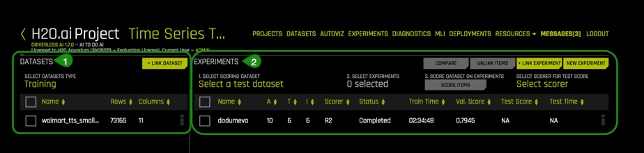

*Things to Note:*

1. **Datasets** 
	- **Selected Datasets Type**: Training, Testing or Validation
	- Additional information of the dataset that was selected: Name, Rows, Columns
		- Details
		- Download
		- Split
		- Visualize
		- Predict
		- Unlink
	- **+ Link Dataset** : Link an additional dataset (Training, Testing or Validation) to the existing project

2. **Experiments** 
	- **Select Scoring Dataset**: Select a test dataset to score using selected experiment
	- **Select Experiments**: Select any experiment for this project
	- **Select Scorer for Test Score**: Select a valid scorer for this experiment
	- **Score Dataset on Experiments**: Once you have selected the data for scoring, the scorer and the model or models, you can begging the scoring process by clicking **Score Items**
	- **Compare**: You can compare two or three experiments and view side-by-side detailed information about each.
	- **Unlink Items**: Unlink datasets and/or experiments
	- **+ Link Dataset**: Link an additional dataset to the experiment
	- **New Experiment**: Create a new experiment
	- Current linked experiment(s) info :
		- **Name**
		- **A**: Accuracy
		- **T** : Time
 		- **I**: Interpretability
		- **Scorer**: Scorer used 
		- **Status**: In progress, completed
		- **Train Time**: Total time to train experiment
		- **Val. Score** : Validation score for the experiment
		- **Test Score**: Test score for the experiment
		- **Test Time**: Total time to test experiment 
 
If you would like to learn more about projects in Driverless AI, please check out the [Project Workspace Documentation](http://docs.h2o.ai/driverless-ai/latest-stable/docs/userguide/projects.html?highlight=projects%20workspace)

### Deeper Dive and Resources

-  [Join the H2O community on Slack to Ask Questions](https://h2oai-community.slack.com/). Post your questions, discuss use cases, give feedback, stay informed about the latest H2O.ai updates, and more.

- Learn more are about H2O Driverless through the [H2O documentation](http://docs.h2o.ai/driverless-ai/latest-stable/docs/booklets/DriverlessAIBooklet.pdf).

- [Explore H2O Product Documentation](http://docs.h2o.ai/)

- [Learn more H2O Driverless by reviewing the FAQs](http://docs.h2o.ai/driverless-ai/latest-stable/docs/userguide/faq.html) 

## Task 2: Automatic Machine Learning Concepts

###  Artificial Intelligence and Machine Learning

The concepts found in this section are meant to provide a high-level overview of Machine Learning. At the end of this section, you can find links to resources that offer a more in-depth explanation of the concepts covered here.

 Machine learning is a subset of Artificial intelligence where the focus is to create machines that can simulate human intelligence. One critical distinction between artificial intelligence and machine learning is that machine learning models “learn” from the data they get exposed to. Arthur Samuel a machine learning pioneer back in 1959 defined machine learning as a” field of study that gives computers the ability to learn without being explicitly programmed”[1]. Machine learning algorithm trains on a dataset to make predictions. These predictions are sometimes used to optimize a system or assist with decision making.

### Machine Learning Training

The advances in technology have made it easier for data to be collected and made available.  The type of data that is available will determine the kind of training that the machine learning model can undergo. There are two types of machine learning  training, supervised and unsupervised learning. Supervised learning is when the dataset contains the output that you are trying to predict. For those cases where the predicting variable is not present it's called unsupervised learning. Both types of training define the relationship between input variables and output variables.

In machine learning the input variables are called **features** and the output variables **labels**. The labels, in this case, are what we are trying to predict. The goal is to take the inputs/ features and use them to come up with predictions on never-before-seen data. In linear regression, the features are the x-variables and the labels are the y-variables. 

A machine learning model defines the relationship between features and labels. When models are trained, you can train a model by feeding it examples. Examples are a particular instance of data.  You can have two types of examples: labeled and unlabeled.
Labeled examples are those where the x and y values (features, labels) are known. Unlabeled examples are those where we know the x value, but we don't know what the y value is (feature,?)[1]. Your dataset is like an example; the columns that will be used for training are the features; the rows are the instances of those features. The column that you want to predict is the label.
Supervised learning takes labeled examples and allows a model that is being trained to learn the relationship between features and labels. The trained model is then tested with unlabeled data and it's given the opportunity to predict the y value (label) for the unlabeled data. Testing a trained model with unlabeled data is called unsupervised training [1]. Note that H2O Driverless AI creates models with labeled examples.

### Data Preparation 

A machine learning model is as good as the data that is used to train it. If you use garbage data to train your model, you will get a garbage model. With this said, before uploading a dataset into tools that will assist you with building your machine learning model such as Driverless AI, ensure that the dataset has been cleaned and prepared for training. Data preparation includes the dataset being in the correct format for what you are trying to do. Duplicates have been removed, and missing data has been fixed or removed. Additionally, a reasonable sample size to train your model has been selected (training, test and validation sets) and proper transformations have been done on the dataset such as scaling, decomposition, and aggregation otherwise known as feature engineering [2].

### Data Transformation 

Data transformation or feature engineering is the process of creating new features from the existing ones. Some data transformations include looking at all the features and identifying which features can be combined to make new ones that will be more useful to the performance of the model. For categorical features, the recommendation is for classes that have few observations to be grouped to reduce the likelihood of the model overfitting. Additionally, dummy variables are introduced for categorical features to facilitate machine learning since many algorithms cannot handle categorical features directly.  Last but not least, remove features that are not used or are redundant [3]. These are only a few suggestions when approaching feature engineering. Feature engineering is very time consuming and do its repetitive nature; it can also be very expensive. The next step in creating a model is selecting an algorithm.

### Algorithm Selection

“Machine learning algorithms are described as learning a target function (f) that best maps input variables (x) to an output variable(y): Y= f(x)” [4]. In supervised learning, there are many algorithms to select from for training. The type of algorithm(s) will depend on the size of your data set, structure and the type of problem you are trying to solve.  Through trial and error, the best performing algorithms can be found for your dataset. Some of those algorithms include linear regression, classification, regression trees, random forests, naive Bayes and random forest, boosting to name a few [5]. 

### Model Training

One good practice when training a machine learning model is to split up your dataset into subsets: training, validation and testing sets. A good ratio for the entire dataset is 70-15-15, 70% of the entire dataset for training, 15% for validation and the remaining 15% for testing.The training set is the data that will be used to train the model, and it needs to be big enough to get significant results from it. The validation set is the data that has been held back from the training and will be used to evaluate and adjust the hyperparameters of the trained model and hence adjust the performance. Finally, the test set is data that has also been held back and will be used to confirm the results of the final model [1].

Another part of model training is fitting and tuning the models. To do this hyperparameters need to be tuned and cross-validation needs to take place using only the training data. Various hyperparameters values will need to be tested. Additionally, a cross-validation loop will be set to calculate the cross-validation score for each set of hyperparameters for each algorithm. Based on the cross-validation score and hyperparameter values you can select the model for each algorithm that has been tuned with training data and test is it using your test set.  The performance of your regression model can be evaluated by performance metrics such as the Mean Square Error (MSE), ROC Curve, Prec-Recall, LIFT and Gain to name a few.

### What are the challenges in AI Model Development?

One of the significant challenges faced in developing a single production-ready model is that it can take weeks or months to develop it. Developing a model involves feature engineering, model building, and model deployment. All tasks are very repetitive, time-consuming, require advanced knowledge of feature generation, algorithms, parameters, and model deployment. Finally, there needs to be in-depth knowledge and confidence in how the model was generated to explain and justify how the model made its decisions.

### What is Automated Machine Learning and why is it important?

AutoML or Automated Machine Learning is the process of automating algorithm selection, feature generation, hyperparameter tuning, iterative modeling, and model assessment. AutoML tools such as H2O Driverless AI makes it easy to train and evaluate machine learning models. Automating the repetitive tasks of Machine Learning Development allows people in industry to focus on the data and the business problems they are trying to solve. 

### Deeper Dive and Resources

- [Explore the replays from H2O World around the world](
http://h2oworld.h2o.ai/h2o-world-london/) 
- [Explore the webinar replays](
https://www.brighttalk.com/search/?q=driverless+ai) 
- [Explore the various H2O Driverless AI playlists on youtube](https://www.youtube.com/user/0xdata/playlists) 

[1][Google’s Machine Learning Crash Course](https://developers.google.com/machine-learning/crash-course/training-and-test-sets/splitting-data)

[2][About Train, Validation and Test Sets in Machine Learning](https://towardsdatascience.com/train-validation-and-test-sets-72cb40cba9e7)

[3][Data Science Primer - Data Cleaning](https://elitedatascience.com/data-cleaning)

[4][Feature Engineering](https://elitedatascience.com/feature-engineering) 

[5][Towards Data Science- Supervised vs Unsupervised Learning](https://towardsdatascience.com/supervised-vs-unsupervised-learning-14f68e32ea8d) 

[6][Selecting the best Machine Learning Algorithm for your regression problem](https://towardsdatascience.com/selecting-the-best-machine-learning-algorithm-for-your-regression-problem-20c330bad4ef)

## Task 3: Load Data

1\. Navigate back to the H2O Driverless **Datasets** page.

### About the Dataset

The dataset used for this experiment is the infamous Titanic Dataset. We will create a predictive model to determine what factors contributed to a passenger surviving. This dataset contains the list of estimated passengers aboard the RMS Titanic.

**Titanic dataset**:

1309 rows, one row per passenger, and 16 columns representing attributes of each passenger:

|Attribute|Definition|Key|
|---|---|---|
|passenger Id|Id randomly generated| - |
|pclass|Passenger Class| 1= 1st, 2 =2nd, 3=3rd|
|survived|Survival| 0=No, 1=Yes|
|name_with_salutations|Passenger name| - |
|name_without_salutations|Passenger name without salutations| - |
|sex|Sex|Female, Male|
|age|Age in years| - |
|sibsp|Number of siblings/Spouse aboard| - |
|parch|Number of Parents/Children aboard| - |
|ticket|Ticket number| - |
|fare|Passenger fare| - |
|cabin|Cabin number| - |
|embarked|Port of Embarkment|C = Cherbourg, Q = Queenstown, S = Southampton|
|boat|Boat number| - |
|body|Body number| - |
|home.des|Home Destination| - |

### Add the Data 

1\. Click on **Add a Dataset(or Drag and Drop)**  

2\. Select **FILE SYSTEM**

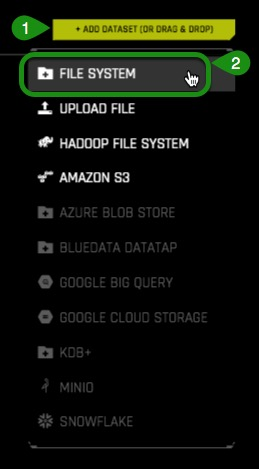

3\. Enter the following */data/TestDrive/titanic.csv* into the search bar. Select *titanic.csv* then **Click to Import Selection**. 

4\. If the file loaded successfully then you should see an  image similar to the one below:

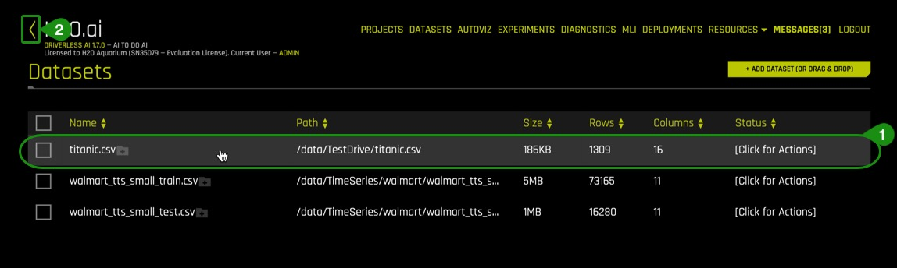

*Things to Note:*

1. You can view:

  - Dataset filename
  - File size
  - Number of rows/columns 
  - File status

2. Option to go back to the previous page  

### Deeper Dive and Resources

- [Learn more about the type of dataset file formats that can be uploaded](http://docs.h2o.ai/driverless-ai/latest-stable/docs/userguide/datasets.html#adding-datasets) 

- For more datasets, check out [Kaggle Datasets](https://www.kaggle.com/datasets)

## Task 4: Explore Data Details and AutoViz

### Details

We are now going to explore the titanic dataset that we just loaded. 

1\. Continuing on the **Dataset Overview page**, click on the titanic.csv dataset. The following options will appear:

 - Details - View a summary of the dataset or preview the dataset
 - Visualize - Visualize the dataset with available graphs
 - Split - Split the dataset
 - Predict - Run an experiment using Driverless AI
 - Download - Download the dataset
 - Delete - Delete the dataset 

**Note**: A dataset can only be deleted if it’s not being used in an experiment. Otherwise, you must delete the experiment first, then the dataset can be deleted.

2\. Confirm that the dataset uploaded correctly and that it has the correct number of rows and columns are present. 

3\. Click on **Details**. This will take you to the **Dataset Details Page**
 
 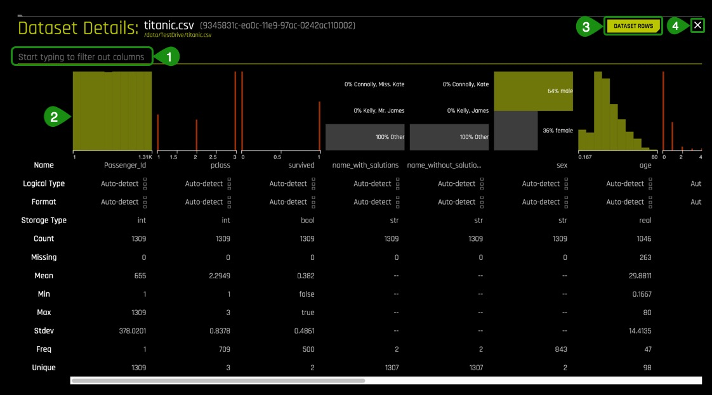

*Things to Note:*

1. The **Dataset Details Page** provides a summary of the dataset. This summary lists each column that is included in the dataset along with the logical type, format, storage type, the count, the mean, minimum, maximum, standard deviation, frequency, and the number of unique values.
Hover over the top of a column to view the first 20 rows of that column.

**Note**: Driverless AI recognizes the following column types: integer, string, real, and boolean. Date columns are given a string "str" type.

2. You can view information for a specific column by entering the name of the column in the field above the graph.

3. **Dataset Rows** allows you to preview the dataset

4. Option to exit and return to the H2O **Datasets** page

3\. Select  **Dataset Rows**	

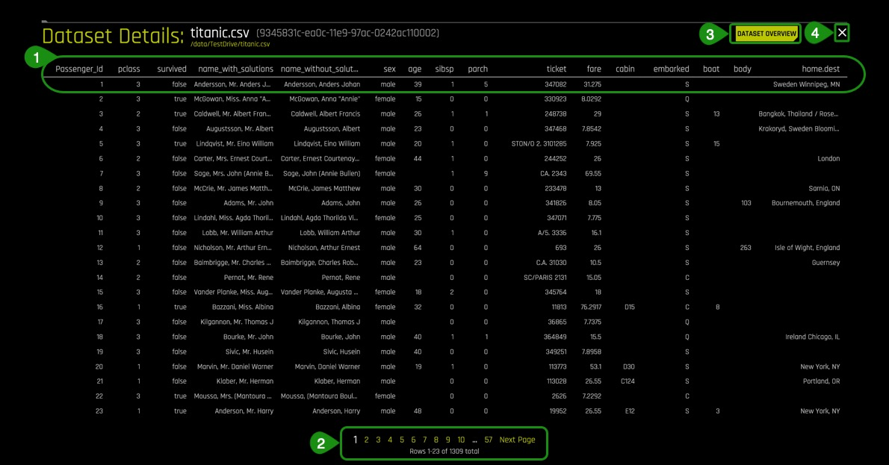

*Things to Note:*
 1. Preview the dataset 
 2. View the remaining rows
 3. Return to the **Dataset Overview** 
 4. Option to Exit and return to the H2O **Datasets** page

4\. Exit and return to **Datasets Overview** page.

### Split the Dataset

From the Titanic.csv dataset we are going to create two datasets, training and test. 75% of the data will be used for training the model and 25% to test the trained model.

1\. Click on the titanic.csv file and select **Split** 

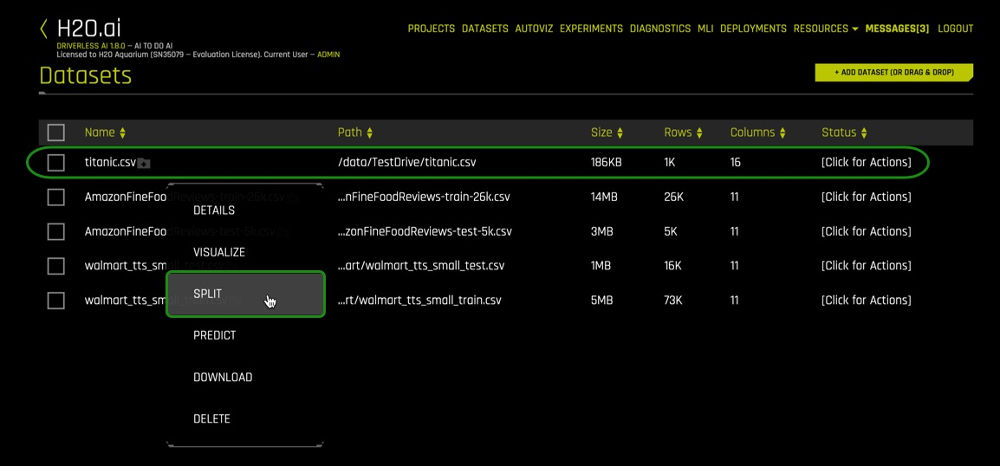

2\. Split the data into two sets: titanic_train and titanic_test. Use the image below as a guide: 

*Things to Note:*

1. Type 'titanic_train' for OUTPUT NAME 1, this will serve as the training set
2. Type 'titanic_test' for OUTPUT NAME 2, this will serve as the test set
3. You can change the Random Seed, this will generate the same split every time
4. Change the split value to .75 by adjusting the slider to 75% or entering .75 in the section that says *Train/Valid Split Ratio*

The ratio of .75 was selected for this particular dataset to not generalize the model given the total size of the set.

**The training set** contains 981 rows, each row representing a passenger, and 16 columns representing the attributes of each passenger.

**The Test set** contains 328 rows, each row representing a passenger, and 16 attribute columns representing attributes of each passenger. 

Verify that the three titanic datasets, titanic_test, titanic_train and titanic.csv are there:

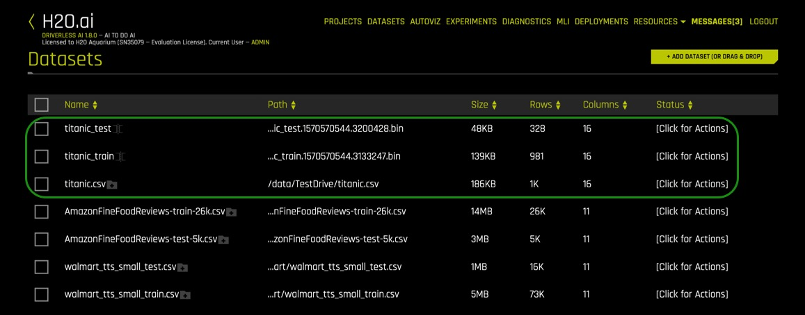

### Autoviz

Now that the titanic.csv dataset has been split, we will use the *titanic_train* set for the remaining of the tutorial.

There are two ways to visualize the training set:

- Clicking on the titanic_train file, select **Visualize**, then click on the visualization file generated.
- Clicking on  **Autoviz** located at the top of the UI page, where you will be asked for the dataset you want to visualize.

1\. Pick a method to visualize the titanic_train dataset. A similar image should appear:

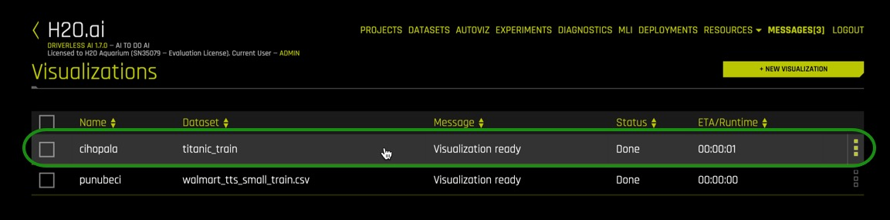

Click on the titanic_train visualization, and the following screen will appear

Is it possible to visualize how variables on the training set are correlated? Can we determine what other variables are strongly correlated to a passenger’s survival? One of the graphs that allows us to visualize the correlations between variables is the **Correlation Graph**.

Let’s explore the correlation between the ‘survived’ variable and other variables in the dataset.

2\. Select the **Correlation Graph** and then click on **Help** located at the lower-left corner of the graph. 

3\. Take a minute to read about the how the correlation graph was constructed and how variables are color coded to show their correlations. 

4\. Take the ‘survived’ variable and drag it slightly to have a better look at the other variables it has been found to be correlated to. What variables are strongly correlated with the ‘survived’ variable?

*Things to Note:*

 - The **Help** button provides an explanation of the **Correlation Graph**. This feature is available for all graphs.
 - **Download** allows for a full-scale image of the graph to be downloaded

5\. Exit out of the **Correlation Graph** view by clicking on the **X** at the top-right corner of the graph.

Driverless AI  shows the graphs that are “relevant” aspects of the data. The following are the type of graphs available:

- Correlated Scatterplots
- Spikey Histograms
- Skewed Histograms
- Varying Boxplots
- Heteroscedastic Boxplots
- Biplots
- Outliers
- Correlation Graph
- Parallel Coordinates Plot
- Radar Plot
- Data Heatmap
- Missing Values Heatmap
- Gaps Histogram

### Deeper Dive and Resources

- [Learn more about Automatic Visualization from the Driverless docs](http://docs.h2o.ai/driverless-ai/latest-stable/docs/userguide/datasets.html#visualizing-datasets)

- [Learn more about Automatic Visualization from the architect Leland Wilkinson, Chief Scientist, H2O.ai from session at H2O World 2017 Youtube Video](https://www.youtube.com/watch?v=bas3-Ue2qxc)

- [Automatic Visualization SlideShare](https://www.slideshare.net/0xdata/automatic-visualization)

## Task 5: Launch First Experiment

We are going to launch our first experiment. An experiment means that we are going to generate a prediction using a dataset of our choice.

1\. Return to  the **Dataset Overview page**

2\. Click on the **titanic_train** dataset then select **Predict**

If this is your first time launching an experiment, the following prompt will appear asking if you want to take a tour.  

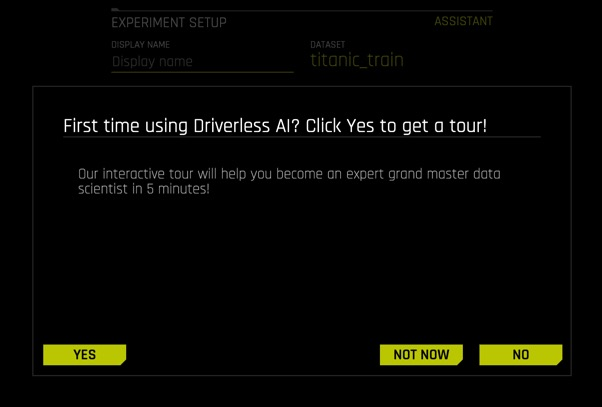

If you would like to take the quick tour, select **YES**.
The quick tour will cover the following items:

- Select the training dataset 
- Select the target column that you want Driverless AI to predict from all columns
- Select if it is a Time Series problem or not [Time Series ON or OFF]

3\. Select **Not Now** to come back and take the tour another time.

4\. The following  **Experiment** page will appear:

*Things to Note:*
1. Display Name - Type the name for your experiment 
2. Select Target Column - What do you want to predict?
3. Dropped Columns - Drop column(s) from your dataset that you don’t want to use in the experiment
4. Validation Dataset - Select the dataset you want to validate. This set will be used to validate parameters like models, features etc.
5. Test Dataset - The dataset that will be used to test the model generated from the training dataset. It is not used during training of the model and results are available at the end of the experiment.
6. Time Column - Provides a time order(time stamps for observations)

Name your experiment `Titanic Classification Tutorial.` 

Continuing on with our experiment:

5\. Click **Dropped Columns**, drop the the following columns: Passenger_Id, name_with_salutations, name_without_salutations, boat, body and homme.dest. Then select **Done**. 

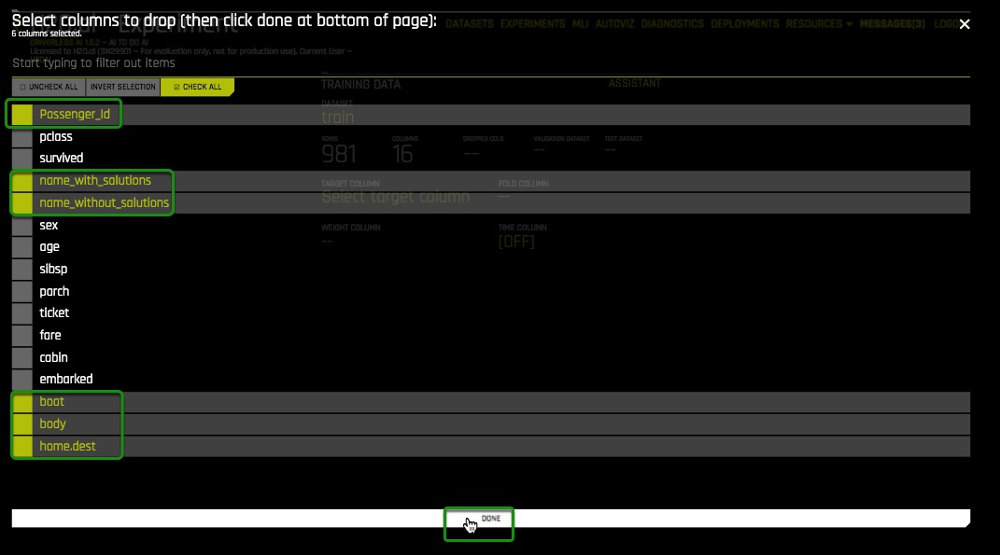

These attributes (columns) were removed to create a cleaner dataset. Attributes such as boat and body are excluded because they are clear indicators that a passenger survived and can lead to data leakage. For our experiment, the survived column will suffice to create a model. 

A clean dataset is essential for the creation of a good predictive model. The process of data cleansing needs to be done with all datasets to rid the set of any unwanted observations, structural errors, unwanted outliers or missing data. 

6\. Select **Test Dataset** and then click on **titanic_test**

7\. Now select the **Target Column**. In our case, the column will be ‘survived’.

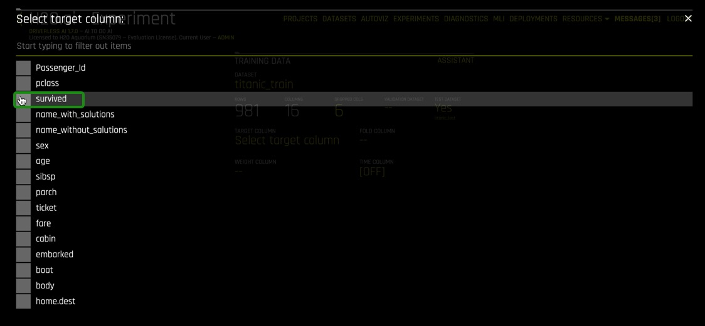

The survived attribute was selected because as an insurance company we want to know what other attributes can contribute to the survival of passengers aboard a ship and incorporate that into our insurance rates.

8\. Your experiment page should look similar to the one below, these are the system suggestions:

*Things to Note:*
1. Assistant - Highlights the different items that you can hover over and get additional information on
2. Sample of an Assistant Highlight
3. Experiment Settings - Describes the Accuracy, Time and Interpretability of your specific experiment.  The knobs on the experiment settings are adjustable. As values change the settings meaning on the left-bottom page change.
	- Accuracy - Relative accuracy – higher values, should lead to higher confidence in model performance (accuracy).
  	- Time - Relative time for completing the experiment. Higher values will take longer for the experiment to complete.
  	- Interpretability-  The degree to which a human can understand the cause of the decision.  

9\. Update the following experiment settings so that they match the image below, then select **Launch Experiment**.

- Accuracy : 4
- Time: 2
- Interpretability: 6
- Scorer: AUC

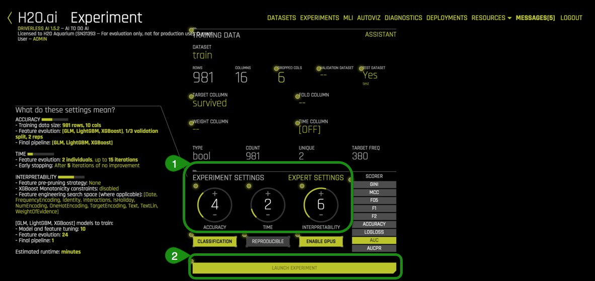

**Note**: To Launch an Experiment: The dataset and the target column are the minimum elements required to launch an experiment.

10\. The **Experiment** page will look similar to the one below after 39% complete:

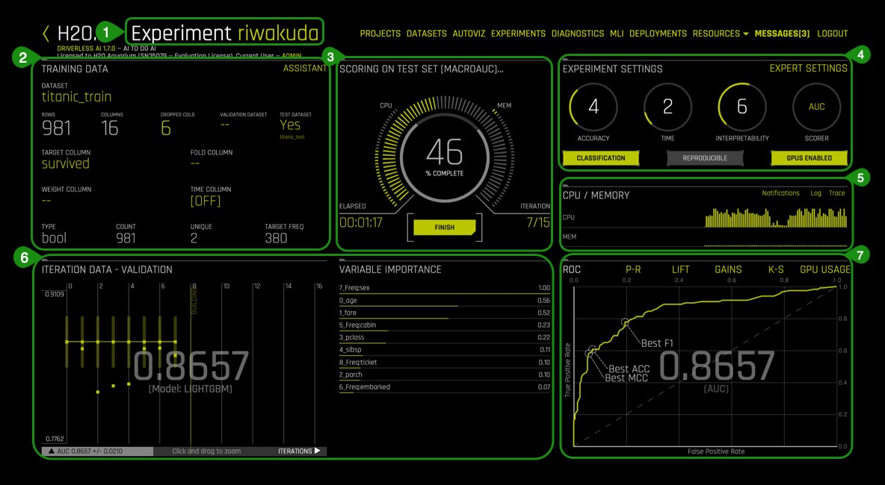

*Things to Note:*
1. Experiment Name - Name of your experiment. If you do not assign a name to it, a random name will be generated. Name can be changed at any time
2. Training Data - Dataset details 
3. Running Status Display - Status of parameter tuning followed by feature engineering and scoring pipeline. Experiments can be Stopped by clicking the Finish button.
4. Experiment Settings - Overview of experiment settings (unable to adjust the while experiment is running)
5. CPU/Memory information including Notifications, Logs and Trace info
6. Iteration Data and Variable Importance - Iteration Data is the internal validation for each cross-validation fold with the specified scorer value. You can hover over any of the iteration points in the Iteration Data graph, and the see the updated variable importance for that iteration on the **Variable Importance**
7. Classification Problem Graphs - Toggle between a ROC curve, Precision-Recall graph, Lift chart, Gains chart, and GPU Usage information (if GPUs are available)
											 				
Once the experiment is completed, an Experiment Summary will appear:

*Things to Note:*
1. Status Complete Options
 - Deploy (Local and Cloud)
 - Interpret This Model 
 - Diagnose Model On New Dataset 
 - Score on Another Dataset
 - Transform Another Dataset
 - Download Predictions
	- Training Predictions
    - Test Set Predictions
 - Download Python Scoring Pipeline - A standalone Python Scoring and pipeline for H2O Driverless
 - Build MOJO Scoring Pipeline 
 - Download Experiment Summary - A zip file containing the following:
 	- Summary of Experiment
 	- Experiment Features along with relevant importance
 	- Ensemble information
 	- Experiment preview 
 	- Word versions of an auto-generated report for the experiment
 	- Target transformations tuning leaderboard
 	- Leaderboard
 - Download Logs
 - Download Autoreports 

2. Iteration Data - Validation/Variable Importance - Summary of top 20 - Feature Engineered variables

3. Experiment Summary 

You will see a notification tab, but you can ignore it for now. We will address it in a later tutorial.

### Deeper Dive and Resources

- [Learn more about running Experiments from H2O Driverless AI docs](http://docs.h2o.ai/driverless-ai/latest-stable/docs/userguide/running-experiment.html#)

- [Explore Documentation on Completed Experiments](http://docs.h2o.ai/driverless-ai/latest-stable/docs/userguide/experiment-completed.html)

- [Explore Documentation on Experiment Summary](http://docs.h2o.ai/driverless-ai/latest-stable/docs/userguide/experiment-summary.html) 

- [Review the Driverless AI Booklet to learn more about running experiments](http://docs.h2o.ai/driverless-ai/latest-stable/docs/booklets/DriverlessAIBooklet.pdf) 

## Task 6: Explore Feature Engineering

Driverless AI performs feature Engineering on the dataset to determine the optimal representation of the data. Various stages of the features appear throughout the iteration of the data. These can be viewed by hovering over points on the Iteration Data - Validation Graph and seeing the updates on the **Variable Importance** section.

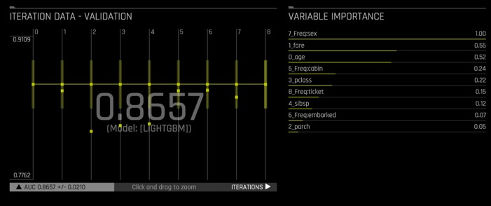

Transformations in Driverless AI are applied to columns in the data. The transformers create the engineered features in experiments. There are many types of transformers, below are just some of the transformers found in our dataset:

1\. Look at some of the variables in **Variable of Importance** , note that some of the variables start with ‘CVTE‘ followed by a column from the dataset. Some other variables might also start with ‘_NumCatTE’, ‘_CVCatNumEn’ or ‘_TXT’ depending on the experiment you run. These are the new, high-value features for our training dataset.

These transformations are created with the following transformers:

- Cross Validation Target Encoding Transformer: ‘_CVTargetEncode’
- Frequent Transformer: ‘Freq‘	
- Numeric to Categorical Target Encoding Transformer = ‘_NumCatTE’
- Categorical To Numeric Encoding= ‘_CVCatNumEn’
- Text Transformer = ‘_TXT’

The complete list of features used in the final model is available in the Experiment Summary artifacts. The Experiment Summary also provides a list of the original features and their estimated feature importance. 

### Deeper Dive and Resources

- [Learn more about Driverless AI Transformations](http://docs.h2o.ai/driverless-ai/latest-stable/docs/userguide/transformations.html) 

- [Feature Engineering for ML by Dmitry Larko](https://www.youtube.com/playlist?list=PLrsf4weWJKynQBvh0i-YxDDVqCcIrF28o) 

- [H2O World London 2018 Feature Engineering session replay](https://www.youtube.com/watch?v=d6UMEmeXB6o ) and [slides  by Dmitry](https://www.slideshare.net/0xdata/feature-engineering-in-h2o-driverless-ai-dmitry-larko-h2o-ai-world-london-2018 ) 

## Task 7: Explore Experiment Results

Let’s explore the results of the experiment. The results are found on the **Experiment Summary** at the left-bottom of Experiment page. The resulting plots are insights from the training and validation data. Each plot will be given an brief overview. 

If you are interested in learning more about each plot and the metrics derived from those plots covered in this section, then check out our next tutorial [Machine Learning Experiment Scoring and Analysis Tutorial - Financial Focus](https://h2oai.github.io/tutorials/machine-learning-experiment-scoring-and-analysis-tutorial-financial-focus/#0).

1\. Summary

- How many features were tested and selected?
- How many models were trained for feature evolution?

2\. ROC - Receiver Operating Characteristics

This type of graph is called a Receiver Operating Characteristic curve (or ROC curve.) It is a plot of the true positive rate against the false positive rate for the different possible cutpoints of a diagnostic test.

An ROC curve is a useful tool because it only focuses on how well the model was able to distinguish between classes. “AUC’s can help represent the probability that the classifier will rank a randomly selected positive observation higher than a randomly selected negative observation”[1].  However, for models where the prediction happens rarely a high AUC could provide a false sense that the model is correctly predicting the results.  This is where the notion of precision and recall become important.

The ROC curve below shows Receiver-Operator Characteristics curve stats on validation data along with the best Accuracy, FCC, and F1 values[2].

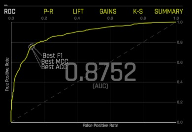

This ROC gives an Area Under the Curve or AUC of .8644. This tells us that the model is able to correctly classify the survivors 86.44% of the time.  

Learn more about the ROC Curve on [Machine Learning Experiment Scoring and Analysis Tutorial - Financial Focus: ROC](https://h2oai.github.io/tutorials/machine-learning-experiment-scoring-and-analysis-tutorial-financial-focus/#7).

3\. Prec-Recall - Precision-Recall graph

Prec-Recall is a complementary tool to ROC curves, especially when the dataset has a significant skew. The Prec-Recall curve plots the precision or positive predictive value (y-axis) versus sensitivity or true positive rate (x-axis) for every possible classification threshold. At a high level, we can think of precision as a measure of exactness or quality of the results while recall as a measure of completeness or quantity of the results obtained by the model. Prec-Recall measures the relevance of the results obtained by the model.

The Prec-Recall plot below shows the Precision-Recall curve on validation data along with the best Accuracy, FCC, and F1 values. The area under this curve is called AUCPR.

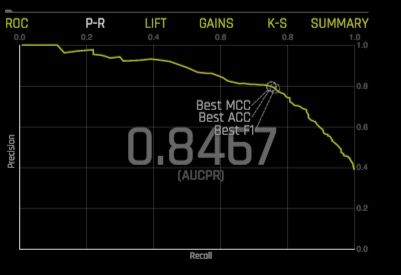

Similarly to the ROC curve, when we take a look at the area under the curve of the Prec-Recall Curve of AUCPR we get a value of .8234. This tells us that the model brings forth relevant results or those cases of the passengers that actually survived 81.69% of the time.

Learn more about the Prec-Curve Curve on [Machine Learning Experiment Scoring and Analysis Tutorial - Financial Focus: Prec-Recall](https://h2oai.github.io/tutorials/machine-learning-experiment-scoring-and-analysis-tutorial-financial-focus/#8).

4\. Cumulative Gains Chart

Gain and Lift charts measure the effectiveness of a classification model by looking at the ratio between the results obtained with a trained model versus a random model(or no model)[3]. The Gain and Lift charts help us evaluate the performance of the classifier as well as answer questions such as what percentage of the dataset captured has a positive response as a function of selected percentage of a sample. Additionally, we can explore how much better we can expect do with a model compared to a random model(or no model)[4].

For better visualization the percentage of positive responses compared to a selected percentage sample, we use Cumulative Gains and Quantile. 

In the Gains Chart below the x-axis shows the percentage of cases from the total number of cases in the test dataset, while the y-axis shows the percentage of positive outcomes or survivors in terms of quantiles.

The Cumulative Gains Chart below shows Gains stats on validation data. For example, “What fraction of all observations of the positive target class are in the top predicted 1%, 2%, 10%, etc. (cumulative)?” By definition, the Gains at 100% are 1.0.

The Gains chart above tells us that when looking at the 20% quantile the model is able to positively identify ~44% of the survivors compared to the a random model(or no model) which would be able to positively identify about ~20% of the survivors at the 20% quantile.

Learn more about the Cumulative Gains Chart on [Machine Learning Experiment Scoring and Analysis Tutorial - Financial Focus: Cumulative Gains](https://h2oai.github.io/tutorials/machine-learning-experiment-scoring-and-analysis-tutorial-financial-focus/#9).

5\. Cumulative Lift Chart 

Lift can help us answer the question of how much better one can expect to do with the predictive model compared to a random model(or no model). Lift is a measure of the effectiveness of a predictive model calculated as the ratio between the results obtained with a model and with a random model(or no model). In other words, the ratio of gain% to the random expectation % at a given quantile. The random expectation of the xth quantile is x%[4].

The Cumulative Lift chart shows lift stats on validation data. For example, “How many times more observations of the positive target class are in the top predicted 1%, 2%, 10%, etc. (cumulative) compared to selecting observations randomly?” By definition, the Lift at 100% is 1.0.

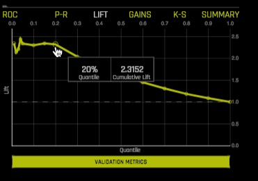

Learn more about the Cumulative Lift Chart on [Machine Learning Experiment Scoring and Analysis Tutorial - Financial Focus: Cumulative Lift](https://h2oai.github.io/tutorials/machine-learning-experiment-scoring-and-analysis-tutorial-financial-focus/#10).

6\. K-S

Kolmogorov-Smirnov or K-S measures the performance of classification models by measuring the degree of separation between positives and negatives for validation or test data[5]. “The K-S is 100 if the scores partition the population into two separate groups in which one group contains all the positives and the other all the negatives. On the other hand, If the model cannot differentiate between positives and negatives, then it is as if the model selects cases randomly from the population. The K-S would be 0. In most classification models the K-S will fall between 0 and 100, and that the higher the value, the better the model is at separating the positive from negative cases.”[6].

K-S or the Kolmogorov-Smirnov chart measures the degree of separation between positives and negatives for validation or test data.

Hover over a point in the chart to view the quantile percentage and Kolmogorov-Smirnov value for that point.

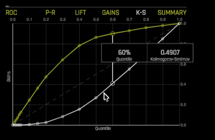

For the K-S chart above, if we look at the top 60% of the data, the at-chance model (the dotted diagonal line) tells us that only 60% of the data was successfully separate between positives and negatives (survived and did not survived). However, with the model it was able to do .499 or about 50% of the cases were successfully separated between positives and negatives.

Learn more about the Kolmogorov-Smirnov chart on [Machine Learning Experiment Scoring and Analysis Tutorial - Financial Focus: Kolmogorov-Smirnov chart](https://h2oai.github.io/tutorials/machine-learning-experiment-scoring-and-analysis-tutorial-financial-focus/#11).

### Resources
 
[1] [ROC Curves and Under the Curve (AUC) Explained](https://www.youtube.com/watch?v=OAl6eAyP-yo)

[2] [H2O DAi - Experiment Graphs](http://docs.h2o.ai/driverless-ai/latest-stable/docs/userguide/experiment-graphs.html?highlight=roc%20curve)

[3] [Model Evaluation Classification](https://www.saedsayad.com/model_evaluation_c.htm)

[4] [Lift Analysis Data Scientist Secret Weapon](https://www.kdnuggets.com/2016/03/lift-analysis-data-scientist-secret-weapon.html)

[5][H2O’s Kolmogorov-Smirnov](http://docs.h2o.ai/driverless-ai/latest-stable/docs/userguide/experiment-graphs.html?highlight=mcc)

[6][Model Evaluation- Classification](https://www.saedsayad.com/model_evaluation_c.htm)

### Deeper Dive and Resources

- [The Best Metric to Measure Accuracy of Classification Models](https://clevertap.com/blog/the-best-metric-to-measure-accuracy-of-classification-models/)

## Task 8: MLI Report

After the predictive model is finished, we can explore the interpretability of our model. In other words what are the results and how did those results come to be?

Questions to consider before viewing the MLI Report:

- Which attributes from our Titanic Training Set do you think are the most important in relation to surviving? Make a note of your top 2 attributes to compare it with the model’s results

There are two ways to generate the MLI Report, selecting the **MLI** link on the upper-right corner of the UI or clicking **Interpret this Model** button on the **Experiment** page. 

Generate the MLI report:

1\. **On the Status: Complete** Options, select **Interpret this Model**

2\. Once the MLI model is complete you should see an image similar to the one below:

3\. Once the **MLI Experiment is finished** pop up comes up, go to MLI page by clicking **Yes**.

4\. The MLI Interpretability Page has the explanations to the model results in a human-readable format.  

*Things to Note:*
1. Summary -  Summary of MLI experiment
2. DAI Model - Feature importance, Shapley plots for transformed features, and Disparate Impact Analysis
3. Surrogate Models - KLIME and Decision Tree plots
4. Dashboard - The Model Interpretation Page includes the following:
	- Global Interpretability model explanation plot
	- Variable Importance
	- Decision Tree Surrogate model
	- Partial Dependence and Individual conditional expectation plots
5. MLI Docs - Link to the “Machine Learning Interpretability with 
Driverless AI” booklet
6. Download MLI Logs 
7. Experiment - Link to return to the experiment that generated the current interpretation
8. Scoring Pipeline - Download the scoring pipeline for the current interpretation
9. Download Reason Codes - Download a CSV file of LIME and/ or Shapley reason codes

### MLI Dashboard

Select the MLI **Dashboard** and explore the different types of insights and explanations regarding the model and its results. All plots are interactive.

1\. Global Interpretability model explanation plot: 
This plot shows Driverless AI model and LIME model predictions in sorted order by the Driverless AI model predictions. In white, is the global linear model of Driverless AI predictions (middle green).
- Hover over any of the points of the plot and view the LIME reason codes for that value.
- Select a point where *Actual value* is 1 and note the reason codes for that prediction value

2\. Variable Importance
This graph shows the most important features that drive the model behavior.
- Which attribute/feature had the most importance?
- Was this the same attribute that you hypothesized?
- View the explanation of the **Variable Importance** plot by selecting **About this plot**

3\. Decision Tree Surrogate model
The decision Tree Surrogate model displays the model’s approximate flowchart of the complex Driverless AI model’s decision making.					
Higher and more frequent features are more important. Features above or below one-another can indicate an interaction. Finally, the thickest edges are the most common decision paths through the tree that lead to a predicted numerical outcome.

- What is the most common decision path for the Titanic Training set?

Solution:

4\. Partial Dependence and Individual conditional expectation plot. This plot represents the model prediction for different values of the original variables. It shows the average model behavior for important original variables.
The grey bar represent the standard deviation of predictions. The green dot represents the average predictions.

- Explore other average values for other variables and compare the results to your original observations. To change the variable select **PDP Variable:** located at the top of the Partial Dependence plot.
 
5\. Explanations 

Explanations provides a detailed easy-to-read **Reason Codes** for the top Global/Local Attributions.
- Click on Explanations

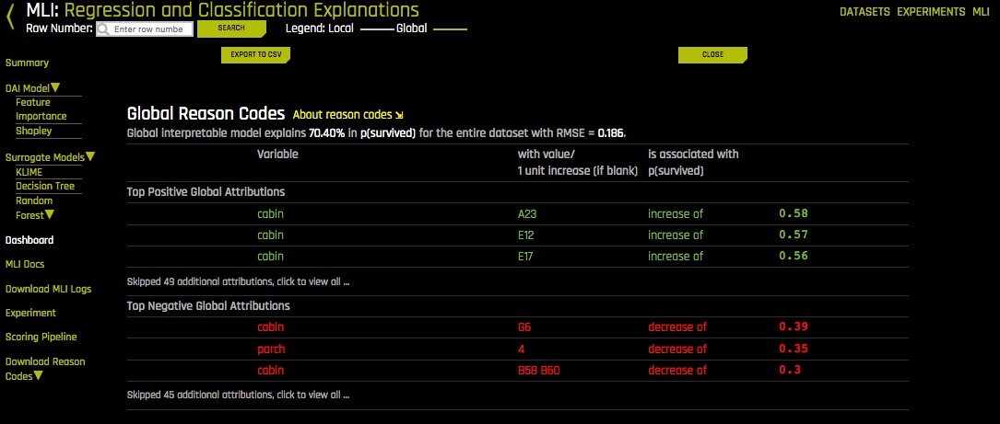

- Determine the top 2 global attributions associated with ‘survived’

6\. Driverless AI offers other plots located under DAI Model and Surrogate Models, take a few minutes to explore these plots, they are all interactive. **About this Plot** will provide an explanation of each plot.

DAI Model
- Feature Importance
- Shapley
- Partial Dependence Plot
- Disparate Impact Analysis

Surrogate Models
- KLime
- Random Forest
	- Feature Importance
	- Partial Dependency Plot
	- LOCO

7\. Click on the MLI link and learn more about “Machine Learning Interpretability with Driverless AI”

### Deeper Dive and Resources

- [H2O Driverless AI Machine Learning Interpretability walkthrough]( 
https://www.youtube.com/watch?v=5jSU3CUReXY)(Oct 18)

- [Practical Tips for Interpreting Machine Learning Models - Patrick Hall, H2O.ai Youtube Video](https://www.youtube.com/watch?v=vUqC8UPw9SU )(June 18)

- [Practical Tips for Interpreting Machine Learning Models - Patrick Hall, H2O.ai Slideshare](https://www.slideshare.net/0xdata/practical-tips-for-interpreting-machine-learning-models-patrick-hall-h2oai)

- [Building Explainable Machine Learning Systems: The Good, the Bad, and the Ugly](https://www.youtube.com/watch?v=Q8rTrmqUQsU)(May 18
 
- [An Introduction to Machine Learning Interpretability](https://www.oreilly.com/library/view/an-introduction-to/9781492033158/) 

- [Testing machine learning explanation techniques](https://www.oreilly.com/ideas/testing-machine-learning-interpretability-techniques)

- [Patrick Hall and H2O Github - Machine Learning with Python](https://github.com/jphall663/interpretable_machine_learning_with_python)

- [Patrick Hall and H2O Github - Machine Learning Interpretability](https://github.com/jphall663/awesome-machine-learning-interpretability) 

- [Download the Driverless Ai MLI Cheat Sheet](http://docs.h2o.ai/driverless-ai/latest-stable/docs/userguide/_downloads/5cb84bc81a49817d5f490dde39bf42ee/cheatsheet.png) 

## Task 9: AutoDocs

Driverless AI allows you to download auto-generated documents such as the Download Experiment Summary and the MLI Report, all at the click of a button. 

###  Experiment Summary

1\. Click on **Download Experiment Summary**

When you open the zip file the following files should be included:

- Summary of Experiment
- Experiment Features along with relevant importance
- Ensemble information
- Experiment preview 
- PDF and markdown versions of an auto-generated report for the experiment
- Target transformations tuning leaderboard
- Leaderboard

2\. Open the auto-generated .doc report and review the experiment results.

### Deeper Dive and Resources

- [Review this Webinar “Peek Under the Hood of H2O Driverless AI with Auto Doc”](https://www.brighttalk.com/webcast/16463/332693/peek-under-the-hood-of-h2o-driverless-ai-with-auto-doc) 

## Task 10: Challenge

Using the CreditCard dataset predict whether someone will default on their Credit Card Payment.  Based on a customer’s past behavior, can we predict if they will default on a credit card payment? Based on the information known at the start of a loan, can we predict if the loan will be fully paid off?

The dataset has the following information: information on default payments, demographic factors, credit data, history of payment, etc.

Here is the schema for the dataset:

Sample set of records:

1\. Import the CreditCard dataset from here:

- [CreditCard Train](https://s3.amazonaws.com/data.h2o.ai/DAI-Tutorials/credit-card-train.csv)
- [CreditCard Test](https://s3.amazonaws.com/data.h2o.ai/DAI-Tutorials/credit-card-test.csv)

2\. Run an experiment where the target column is “DEFAULT_PAYMENT_NEXT_MONTH”.

3\. **Interpret this model ** [Review the MLI Booklet which uses the CreditCard data set for its example and explanations](http://docs.h2o.ai/driverless-ai/latest-stable/docs/booklets/DriverlessAIBooklet.pdf)

4\. Read through MLI Report and determine:

- What variables increase the likelihood of defaulting on a credit card payment? 
- What decreases the likelihood of default?

### Deeper Dive and Resources

- [Try running an experiment without the Driverless AI UI using the Python Client](http://docs.h2o.ai/driverless-ai/latest-stable/docs/userguide/examples/h2oai_client_demo.html?highlight=experiment%20summary)

## Next Steps

Check out Driverss AI next tutorial [Machine Learning Experiment Scoring and Analysis Tutorial - Financial Focus](https://h2oai.github.io/tutorials/machine-learning-experiment-scoring-and-analysis-tutorial-financial-focus/#0)

Where you will learn how to:

- Evaluate a DAI model through tools like:
	- ROC
	- Prec-Recall
	- Gain and Lift Charts
	- K-S Chart
	- Metrics such as:
	  - AUC
	  - F-Scores
	  - GINI
	  - MCC
	  - Log Loss
- Request a [21-Day Free Trial: H2O Driverless AI license Key](https://www.h2o.ai/products/h2o-driverless-ai/)