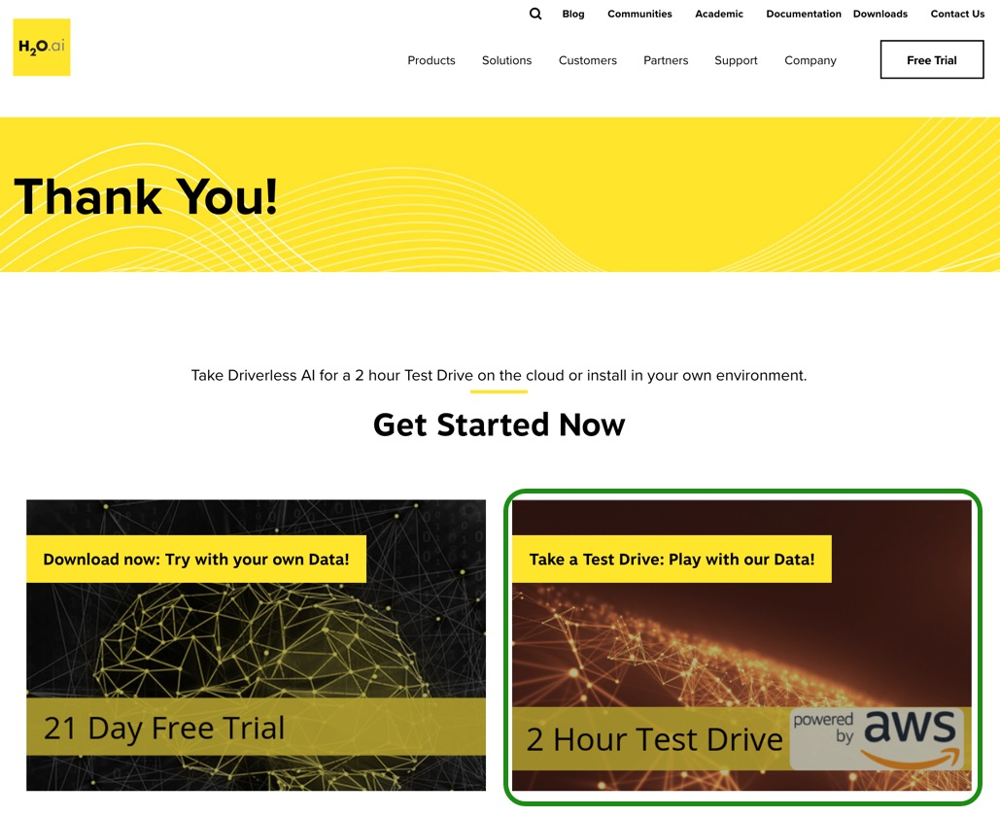
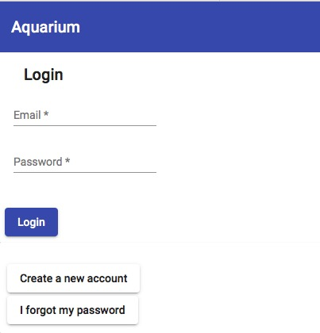
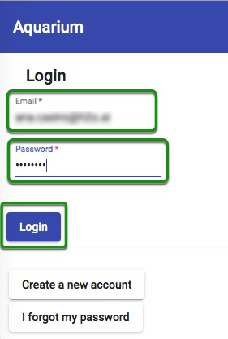
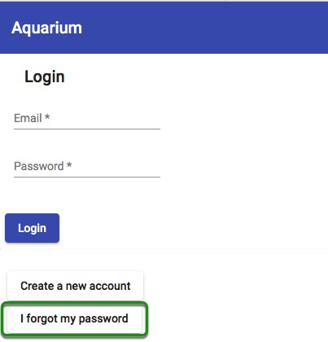
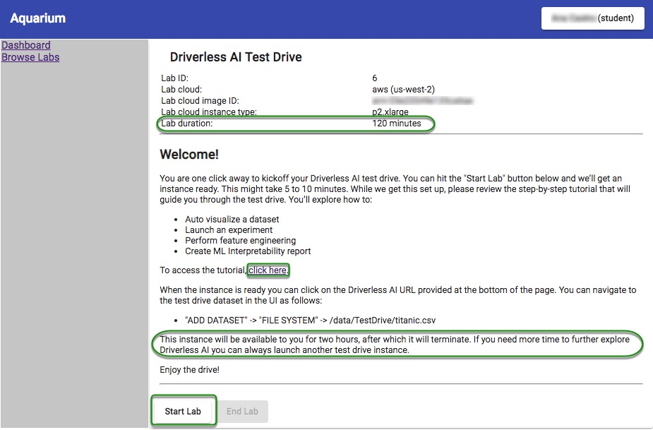
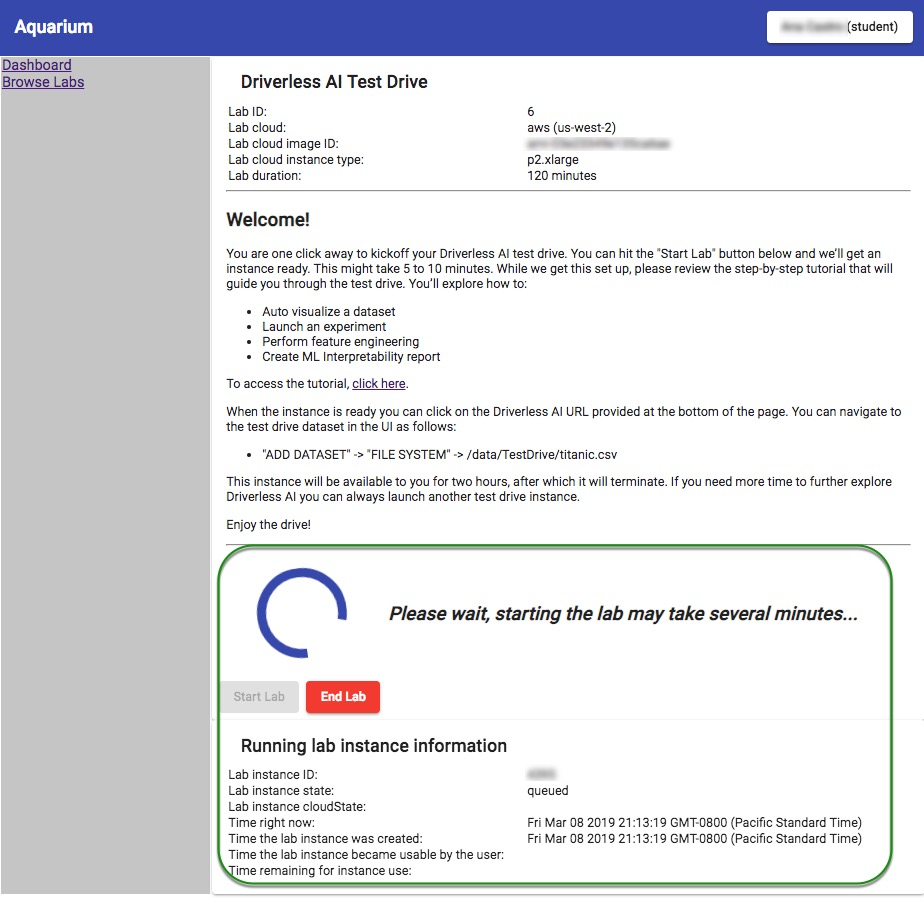
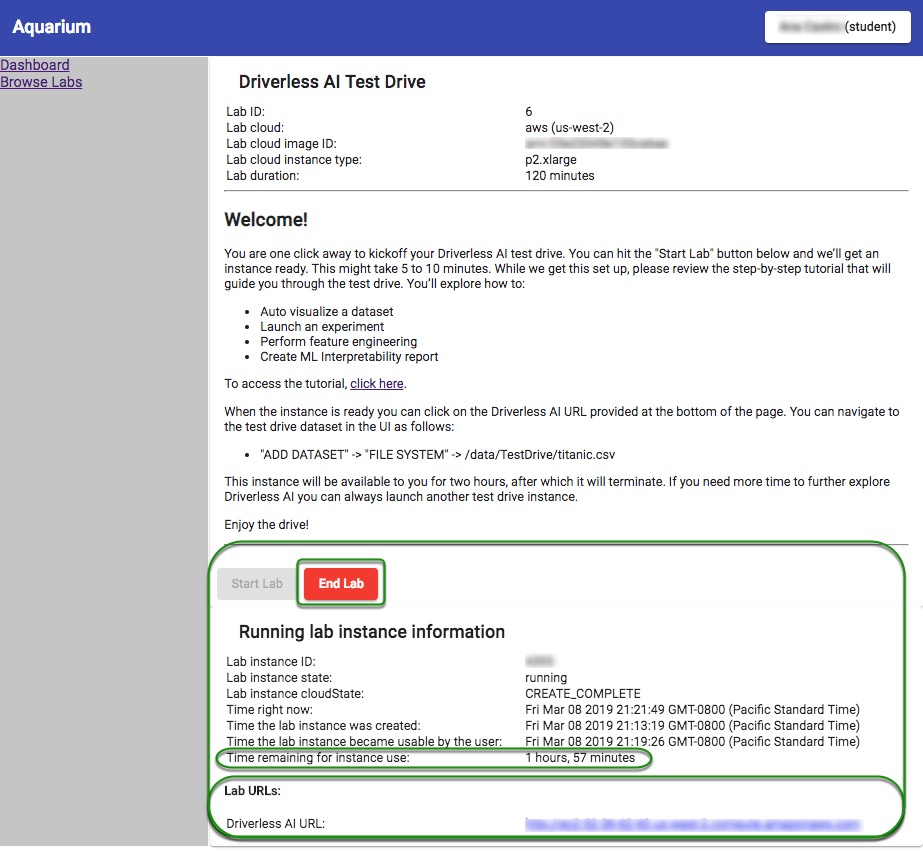
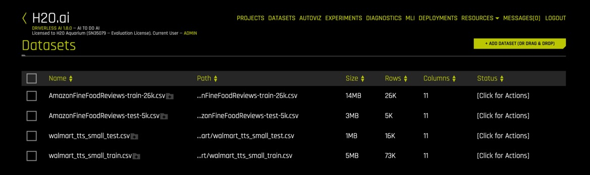
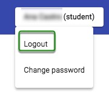

# Getting Started with Driverless AI Test Drive

- [Driverless AI Test Drive](#driverless-ai-test-drive)
- [How to Obtain a Two Hour Test Drive Session](#how-to-obtain-a-two-hour-test-drive-session)
- [How to Create an Aquarium Account](#how-to-create-an-aquarium-account)
- [How to Login](#how-to-login)
- [Reset Password ](#reset-password)
- [How to Start and End the Test Drive Lab Session](#how-to-start-and-end-the-test-drive-lab-session)
- [Logout](#logout)
- [Questions](#questions)

## Driverless AI Test Drive 

Test Drive is a two-hour lab session that exists in H2O's Aquarium. Aquarium is H2O's cloud environment that provides access to various tools for workshops, conferences, and training.

All labs have a specific **Lab Duration*** to complete the lab. All Test Drive Lab session's will terminate after two-hours. No work will be saved!

If you would like to continue exploring H2O's Driverless AI, request a [21-Day Free Trial: H2O Driverless AI license Key](https://www.h2o.ai/products/h2o-driverless-ai/).

## How to Obtain a Two Hour Test Drive Session

1\. Select **Free Trial** at the top-right corner of the [H2O.ai](https://www.h2o.ai/) home page or simply clik [here](https://www.h2o.ai/try-driverless-ai/).

2\. A similar form will appear, fill out the **Request a 21 day free trial** form then select **Send This Secure Message**:

3\. After submitting the form the following options will appear, select **2 Hour Test Drive**:

4\. This will take you to the Aquarium login page where you need to create and account.

## How to Create an Aquarium Account

1\. Welcome to the Aquarium Login page!

2\. Select **Create a new account**

3\. Enter:

 - First Name
 - Last Name
 - Email

4\. Click on **Create account and email temporary password** at the bottom of the page.

 > A password will be sent to your email within minutes.

5\. Check your email for the password.

## How to Login

1\. Enter the email you used to create the Aquarium password.

2\. Enter the password you received over email from Aquarium.

3\. Click on **Login**.

## Reset Password 

1\. If you forgot your password, select **I forgot my password**.

2\. Enter your email, and another password will be emailed to you.

## How to Start and End the Test Drive Lab Session

After a successful login the Driverless AI Test Drive Lab will appear:

> Note: 

- Lab duration is 120 minutes, after the session will terminate
- Selecting `click here` will take to you to the Driverless AI Automatic Machine Learning Tutorial
- **Start** button starts the lab session

1\. To start a Lab click on **Start Lab**. You will see an image similar to the one below:

2\. Aquarium will then start the Lab session for you (this will take a few minutes). After the lab session starts a similar image should appear:

> Note:

 - The time remaining for the instance use
 - Driverless AI URL
 - End Lab 

3\. Once the Lab has started, a Driverless AI URL will appear at the of the page. Click on that URL. This will take you to the H2O Driverless Welcome Page.

6\. If you need to pause and come back to your session, select **End Lab**.

## Logout

1\. To logout, click on the box on the top-right corner of the page and select logout.

 

## Questions

Have any questions about Aquarium? Sign up for H2O's Slack Community and post your questions under the #cloud channel. Members of the H2O community will respond as soon as they are available.

- [Join the H2O community on Slack to Ask Questions #cloud](https://h2oai-community.slack.com/)

