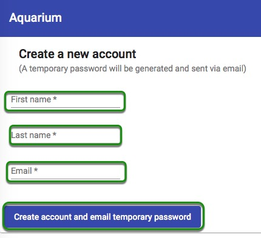
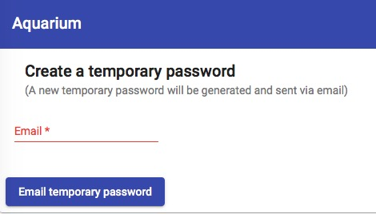
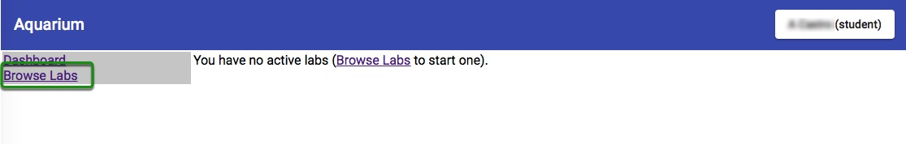
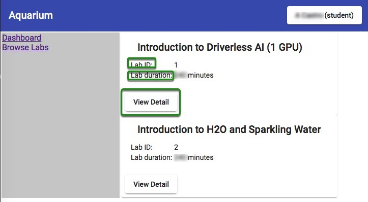
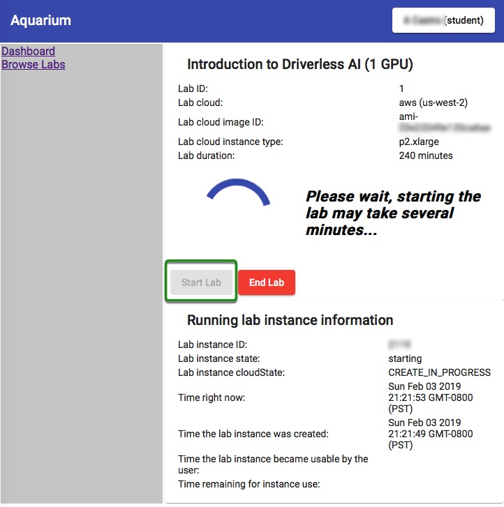
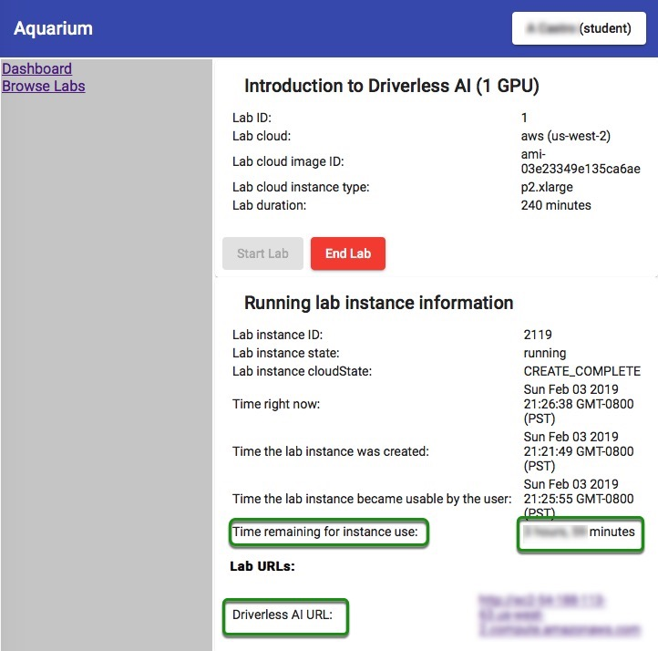
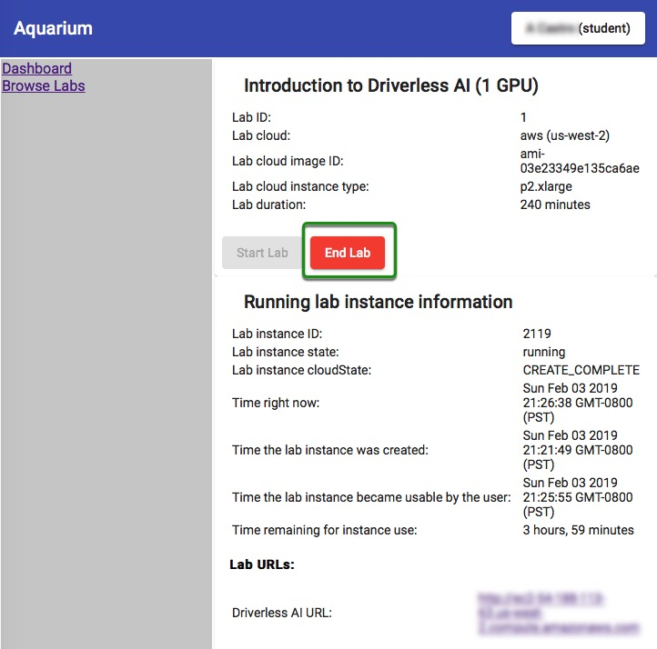
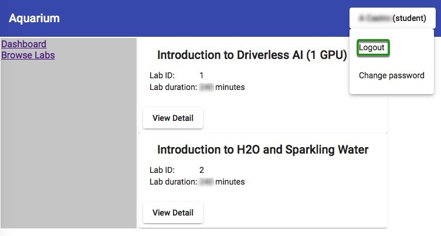

# Getting Started with Aquarium

- [Aquarium](#aquarium)
- [How to Create an Aquarium Account](#how-to-create-an-aquarium-account)
- [How to Login](#how-to-login)
- [Resetting the Password ](#resetting-the-password)
- [How to Start a Lab Session](#how-to-start-a-lab-session)
- [Logout](#logout)
- [Questions](#questions)

## Aquarium

H2O Aquarium is H2O's cloud environment that provides access to various tools for workshops, conferences, and training.

All labs have a specific **Lab Duration*** time to complete the lab. If you would like to continue exploring H2O's Driverless AI, request a [21-Day Free Trial: H2O Driverless AI license Key](https://www.h2o.ai/products/h2o-driverless-ai/) to use with [H2O Driverless AI Prerelease Environment](http://prerelease.h2o.ai/).

## How to Create an Aquarium Account

1\. Go to the [Aquarium page](http://aquarium.h2o.ai/login)

2\. Select **Create a new account**

3\. Enter:

 - First Name
 - Last Name
 - Email

4\. Click on **Create account and email temporary password** at the bottom of the page.

 > A password will be sent to your email within minutes.

5\. Check your email for the password.

## How to Login

1\. Enter the email you used to create the Aquarium password.

2\. Enter the password you received over email from Aquarium.

3\. Click on **Login**.

## Resetting the Password 

1\. If you forgot your password, select **I forgot my password**.

2\. Enter your email, and another password will be emailed to you.

## How to Start a Lab Session

Lab sessions will vary depending on the activity (conference, workshop, etc.)

1\. From Aquarium's welcome page, select **Browse Labs**.

2\. The available Lab will appear.

Note: 

 - **Lab ID**
 - **Lab Duration Time**
 - **View Details** about the Lab

3\. To start a Lab, select **View Details** on the Lab you want to work on, then click on **Start Lab**. You will see an image similar to the one below:

4\. Aquarium will then start the Lab session for you (this will take a few minutes). A similar image should appear:

> Note:

 - The time remaining for the instance use
 - Driverless AI URL
 - End Lab 

5\. Once the Lab has started, a Driverless AI URL will appear at the bottom-left corner of the page. Click on that URL. This will take you to the H2O Driverless License Agreement Form. 

6\. If you need to pause and come back to your session, select **End Lab**.

## Logout

1\. To log out, click on the box on the top-right corner of the page and select logout.

 

## Questions

Have any questions about Aquarium? Sign up for H2O's Slack Community and post your questions under the #cloud channel. Members of the H2O community will respond as soon as they are available.

- [Join the H2O community on Slack to Ask Questions #cloud](https://h2oai-community.slack.com/)

