## Automatic Machine Learning Introduction with Driverless AI

Outline:
- [Objective](#objective)
- [Prerequisites](#prerequisites)
- [Task 1: Get Environment & Product Tour](#taks-1-get-environment-&-product-tour)
- [Task 2: Automatic Machine Learning Concepts](#task-2-automatic-machine-learning-concepts)
- [Task 3: Load Data](#task-3-load-ata)
- [Task 4: Explore Data Details & AutoViz](#task-4-explore-data-details-&-autoviz)
- [Task 5: Launch first experiment](#task-5-launch-first-experiment)
- [Task 6: Explore Feature Engineering](#task-6-explore-feature-engineering)
- [Task 7: Explore Experiment Results](#task-7-explore-experiment-results)
- [Task 8: MLI Report](#task-8-mli-report)
- [Task 9: Experiment Summary](#task-9-experiment-summary)
- [Task 10: Challenge](#task-10-challenge)

## Objective

The RMS Titanic was a British commercial passenger liner that sank after colliding with an iceberg in the North Atlantic Ocean on April 15, 1912. More than 1,500 people lost their lives from an estimated 2,224 passengers and crew members while on their way to New York City from Southampton. 

This sensational tragedy shocked the international community and led to better safety regulations for ships. One of the reasons that the shipwreck resulted in such loss of life was that there were not enough lifeboats for the passengers and crew. Although there was some element of luck involved in surviving the sinking, some groups of people were more likely to survive than others.

[RMS Titanic-Wikipedia](https://en.wikipedia.org/wiki/RMS_Titanic#/media/File:RMS_Titanic_3.jpg)

For this tutorial we will approach the Titanic dataset from the perspective of a passenger line insurance company. What are the risk factors to consider when selling passenger insurance? What can we learn from the automatic predictive models generated by Driverless AI and the Titanic Dataset?

## Prerequisites
In order to successfully install H2O Driverless AI a license key is necessary. The license key can be obtained through the 21-Day Free Trial:

- [21-Day Free Trial: H2O Driverless AI license Key](https://www.h2o.ai/products/h2o-driverless-ai/)
Note: The processing time for the trial license key will take an estimated time of 5 minutes

Other prerequisites:
- Basic knowledge of Machine Learning and Statistics

## Task 1: Get Environment & Product Tour

### Get Environment

There are multiple ways to install the environment: cloud, local, server. The installation steps assume that you have a license key for Driverless AI

- Cloud Installation
  - [H2O Driverless AI on AWS Marketplace](https://aws.amazon.com/marketplace/pp/B07JN71K8N?qid=1547700275918&sr=0-6&ref_=srh_res_product_title)
  - [H2O Driverless AI on Azure HDInsight](https://azuremarketplace.microsoft.com/en-gb/marketplace/apps/h2o-ai.h2o-driverles-ai?tab=Overview) 
  - [H2O.ai Driverless AI (BYOL) on Google Cloud Platform](https://console.cloud.google.com/marketplace/details/h2o-public/h2oai-driverless-ai-byol?pli=1) 
- [Local Installation](http://docs.h2o.ai/driverless-ai/latest-stable/docs/userguide/installing.html) 
- [Server Installation](http://docs.h2o.ai/driverless-ai/latest-stable/docs/userguide/install/ibm-power.html) 

1\. Start Driverless AI and open your choice of browser. Driverless AI runs on port **:12345**. To open it, append the port number to the driverless host address.

For example:
~~~
<driverless-ai-host-machine>:12345
~~~

2\. Review and accept the Driverless AI Evaluation Agreement by clicking on **I agree to these terms**. Below is a preview of the Evaluation Agreement:

3\.  Log in by creating a unique **username/password**. Save your username and password so you can return to the experiments you have worked on. 

4\. After login in, you will need to enter your License Key.

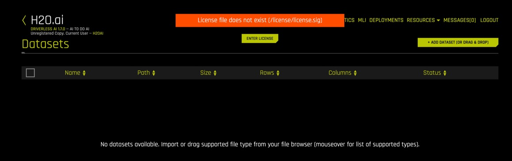

5\. Paste the License Key and then click on **Save**. 

>Note: If the correct license key was entered the **Status** box will show further details about the license.

### Quick Product Tour 

Welcome to the Driverless home page! 
 
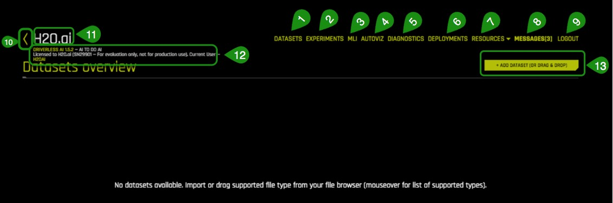

The Driverless UI is easy to navigate.The following features are found on the welcome page. We will explore these features as we launch an experiment in the next tasks.

1. **Datasets**: View of current datasets. You can also upload or delete a dataset. 
>Note: If this is your first time logging in the list will be empty.

2. **Experiments**: View of completed experiments. Experiments can be revised or deleted. 

3. **MLI**: View a list of interpreted models or interpret a model.
>Note: If no experiments have been run then the list will be empty.

4. **Autoviz**: Visualize a dataset with all available graphs.

5. **Help**: Redirects you to the Driverless User Guide Documentation.

6. **Py_Client**: Download the python client files that allow you to connect to the API directly from python through e.g., a jupyter notebook. 

7. **Mojo2-Runtime**: Download the mojo2-runtime.jar file to build a MOJO Scoring Pipeline that includes a standalone Model Object. 

>Note: The MOJO Scoring Pipeline is disabled by default. Instructions on how to enable the [MOJO Scoring Pipeline can be found on page 72 of the Driverless AI Booklet](http://docs.h2o.ai/driverless-ai/latest-stable/docs/booklets/DriverlessAIBooklet.pdf)

8. **Messages[ ]**: View news and upcoming Driverless AI events.

9. **Logout H2OAI**: Logs you out of your current session.

10. **<**: Go back to the previous page.

11. **H2OAI**: Takes you back to the H2OAI Welcome Page.

12. **Driverless AI 1.X.X**: Version of Driverless AI 

13. **Add a Dataset(or Drag and Drop)**: Upload or add a dataset.

### Explore:
-  [Join the H2O community on Slack to Ask Questions](https://tinyurl.com/h2o.com/h2o-community-slack) . Post your questions, discuss use cases, give feedback,  stay informed about the latest at H2O.ai updates and more.

- Learn more are about H2O Driverless through the [H2O documentation](http://docs.h2o.ai/driverless-ai/latest-stable/docs/booklets/DriverlessAIBooklet.pdf).

- [Explore H2O Product Documentation](http://docs.h2o.ai/)

- [Learn more H2O Driverless by reviewing the FAQs](http://docs.h2o.ai/driverless-ai/latest-stable/docs/userguide/faq.html) 

## Task 2: Automatic Machine Learning Concepts

#### What are the challenges in AI Model Development?

One of the major challenges faced in developing a single production-ready model is that it can take weeks or months to develop it. Developing a model involves feature engineering, model building and model deployment. All tasks are very repetitive, time consuming, require advanced knowledge of feature generation, algorithms, parameters and model deployment. Finally, there needs to be deep knowledge and confidence on how the model was generated in order to explain and justify how the model made its decisions .

#### What is Automated Machine Learning and why is it important?

AutoML or Automated Machine Learning is the process of automating algorithm selection, feature generation, hyperparameter tuning, iterative modeling, and model assessment. Auto ML makes it easy to train and evaluate machine learning models. Automating the repetitive tasks of Machine Learning Development allows data scientists to focus on the data and the business problems they are trying to solve.

#### Explaining AI to the Business Person
Explainable AI is in the news, and for good reason. Financial services companies have cited the ability to explain AI-based decisions as one of the critical roadblocks to further adoption of AI for their [industry](https://blogs.wsj.com/cio/2018/08/22/wall-street-finds-limits-with-current-ai-applications/?mod=djemCIO_h). Moreover, interpretability, fairness, and transparency of data-driven decision support systems based on AI and machine learning, or more traditional statistical or rule-based approaches, are serious regulatory mandates in banking, insurance, healthcare, and other industries. Some of the major regulatory statutes potential governing these industries’ use of AI include the Civil Rights Acts of 1964 and 1991, the Americans with Disabilities Act, the Genetic Information Nondiscrimination Act, the Health Insurance Portability and Accountability Act, the Equal Credit Opportunity Act, the Fair Credit Reporting Act, the Fair Housing Act, Federal Reserve SR 11-7, and European Union (EU) Greater Data Privacy Regulation (GDPR) Article 22. So, if you are a decision maker using or planning to use AI in your company then understanding how you create trust in AI is going to be crucial to your success. This post provides a high-level overview of the new field of interpretable machine learning and some of the most promising related techniques.

#### Gentle Introduction to Interpretable Machine Learning
As a business person who is using machine learning to make decisions, there are a few fundamental concepts that you need to understand to have intelligent discussions with executives and make smart choices when using machine learning models to make decisions.

First of all, let’s clarify the terms “AI” and “machine learning”. AI is the broader field which encompasses the study and practice of enabling computers to have human-level (or better) intelligence. Machine learning is probably currently the most practical and popular subfield of AI, where computer systems learn from past data how to make decisions about certain topics like: will someone pay their credit card bill or what diagnosis a medical patient should have. The fad today is to use “AI” and “machine learning” somewhat interchangeably, and that’s what we will do in the rest of this post.

Second, there is an entire field of research dedicated to the area of machine learning interpretability and “interpretability” itself is basically a loosely-defined (or over-defined) umbrella term that encompasses at least:
- Directly transparent “white-box” models
- Explanation of “black-box” models to enhance transparency
- Debugging models to increase trust
- Ensuring fairness in algorithmic decision-making
- Model documentation

Third, there is plenty of real work already happening in this field. There is an area known as [FAT, for Fairness, Accountability, and Transparency](http://www.fatml.org/), and [XAI for explainable AI](https://www.darpa.mil/program/explainable-artificial-intelligence), and numerous other outlets that are surfacing applicable technologies, such as the [2018 AI for Finance Services Workshop](https://sites.google.com/view/feap-ai4fin-2018/schedule?authuser=0) at the NeurlPS conference. Depending on your industry you will likely hear or see other terms, or conferences, workshops, or white papers on similar topics. Generally speaking, researchers and product vendors are already working on the problem of how to build understanding and trust in AI and machine learning systems. Bottom line: a lot of brilliant people are thinking about this today and some of their work is already usable! (If you are reasonably technical and interested in this topic in more depth, I suggest reading – An Introduction to Machine Learning Interpretability, An Applied Perspective on Fairness, Accountability, Transparency, and Explainable AI by Patrick Hall and Navdeep Gill, published by [O’Reilly Media](https://www.safaribooksonline.com/library/view/an-introduction-to/9781492033158/)).

#### Some Techniques

To actually get started with machine learning interpretability, I would begin by understanding the goal. You want to use AI and machine learning models because they will help you make more objective, data-driven, higher-value decisions that can help your business. You need to trust that these models are making the right choices because you, and people like you, are ultimately accountable for the decisions. Generally speaking, business people feel they can trust a machine learning model when they have an understanding of why that model is making a particular prediction and when it behaves as expected in realistic test or simulation scenarios. When a model deviates from our knowledge of our business, we also want to understand why. Below are some of the best-known techniques you can use to develop understanding and trust in AI so that you can scale your AI adoption.

### General Approaches

#### Exploratory Data Analysis (EDA, i.e. “Know Thy Data”) 

 The mantra of garbage in, garbage out still applies. The model learns from the data you put into it. The better you know what you are feeding your model, the more likely you are to understand and make sense of the outputs. You can use a host of visualization tools to gain a better understanding of your data. The best ones will highlight those areas of the data that could cause problems. These problem areas include incomplete data, distant outliers, missing values, strong correlations between variables, and other data quality issues.

#### Accurate and Interpretable Models 
In general, the more directly interpretable your machine learning model is to begin with, the less explanation, compliance, documentation, and potential regulation headaches you will have in the future. Some interpretable modeling techniques are oldie-goldies, like statistical regression models and decision trees. These can be great to get started with! For those looking for more cutting edge and accurate interpretable models, you might want to check out techniques with names like scalable Bayesian rule lists or monotonic gradient boosting machines.

#### Global Explanations
A complex machine learning model is like a multidimensional topographic map with highs and lows where different variables have different influence at various locations. Global explanatory techniques help you get a 30,000 ft. perspective on that landscape.

#### Variable Importance Chart 
This allows you to see what variables were the most important in all of the model’s predictions taken as a whole. You may be surprised by which variables had the most impact, but at least you can see what those are and compare them against your domain knowledge and how you would make the decision. If you find there are only a few variables that really matter, that could also help you build a simpler model with fewer inputs which is typically faster for production use cases and easier to understand.

#### Partial Dependence Chart
Once you know what variables are the main drivers of the business problem you’re modeling, partial dependence charts can show you how these variables behave inside the model. Partial dependence plots show the average prediction of the model for the values of an input variable. For instance, these charts would allow you to verify that as customers’ savings account balances increase their overall probability of paying their credit card bill also increases according to your model.

#### Surrogate Tree Models 
When you can’t understand the sophisticated version of a model, a simple version can help explain what is going on. Decision trees are particularly suitable for this as they show the splits and decision points in a way that is easy for people to understand, like a flowchart. For example, how does the model decide what drug dosage to provide? First, it looks at the person’s age, then their gender, and then at related conditions. This simple representation helps model stakeholders and users understand the fundamental decisions the model is making and this flowchart view can help you understand the interactions between important variables found by your machine learning model. (These interactions are important insights too and might be really hard for people to find on their own).

#### Local Explanations and Reason Codes
The next tool helps you zoom into a local area of your data and model and really get a handle on what the model is doing for an individual or a small group. Your goal is to understand why a model provided any single prediction. In particular, you want to understand the factors that influenced the decision.

Many new explanation techniques focus on understanding small areas of the data and their corresponding predictions. The methods you should look for have names like LIME and Shapley. The vital thing to know is that these techniques will help you, or your data team, explain what is going on in a small area of your input data and model outputs and will help generate the information you need for trustworthy real-time decision making. LIME, for example, allows you to zoom in on a small area of the model where it describes that area with a trend line, which is relatively easy to understand. This technique provides a simple view of which variables had the most significant influence on that area of the model. In practice, this information is often used to create reason codes.

#### Reason Codes 
When an AI system provides a predictive score based on the model, it should also offer individual reason codes. Reason codes are required in industries like financial services when providing credit decisions and can be very helpful to clinicians when using AI-driven diagnostic assistants. These automated data points show how the key variables influenced the model’s prediction for just a single individual. For example, when deciding to decline a new credit card for one specific consumer, the reason codes could show that missing a recent payment, short credit history, and low credit score were the critical factors in the decision.

Up until this point, we have covered an introduction to interpretable AI and machine learning as well as some of the best-known techniques you can use to explain AI systems. In part 2 of this blog series, we explore more techniques for enhancing trust in AI and machine learning models and systems.

### Deeper Dive and Resources

- [Explore the replays from H2O World around the world](
http://h2oworld.h2o.ai/h2o-world-london/) 
- [Explore the webinar replays](
https://www.brighttalk.com/search/?q=driverless+ai) 
- [Explore the various H2O Driverless AI playlists on youtube](https://www.youtube.com/user/0xdata/playlists) 

## Task 3: Load Data

### About the Dataset

The dataset that will be used for this experiment is the infamous Titanic Dataset. We will create a predictive model to determine what factors contributed to a passenger surviving. This dataset contains the list of estimated* passengers aboard the RMS Titanic. The Titanic dataset was divided into 2 sets: Training_0.75 and Test_0.25 in order to not generalize the model given the total size of the set.

**Titanic dataset**:
1309 rows:
- 1 row per passenger
16 columns representing attributes of the each passenger:

|Attribute|Definition|Key|
|---|---|---|
|passenger Id|Id randomly generated|  |
|pclass|Passenger Class| 1= 1st, 2 =2nd, 3=3rd|
|survived|Survival| 0=No, 1=Yes|
|name|Passenger name|  |
|name(without salutation)|Passenger name without salutations|  |
|sex|Sex|Female, Male|
|age|Age in years|  |
|sibsp|Number of siblings/Spouse aboard|  |
|parch|Number of Parents/Children aboard|  |
|ticket|Ticket number|  |
|fare|Passenger fare|  |
|cabin|Cabin number|  |
|embarked|Port of Embarkment|C = Cherbourg, Q = Queenstown, S = Southampton|
|boat|Boat number|  |
|body|Body number|  |
|home.des|Home Destination| |

**The Training set** contains 978 rows, each row representing a passenger and 13 columns representing the attributes of the each passenger:

**Note**: The 13 columns are the same attributes from the Titanic set minus boat, body and home.dest. These 3 attributes (columns) were removed, to create a cleaner dataset. Attributes boat and body were removed  since they are clear indicators that a passenger survived and can lead to data leakage. For our experiment, the survived column will suffice to create a model. 

A clean dataset is essential for the creation of a good predictive model. The process of data cleansing needs to be done with all datasets to rid the set of any unwanted observations, structural errors, unwanted outliers or missing data. 

**The Test set** contains 332 rows, each row representing a passenger and 15  attribute columns representing attributes of the each passenger. The attribute columns are the same as the Train set minus the ‘survived’ attribute. The Test dataset can be used to test the model you generate at the end of this tutorial.

### Download the Titanic Datasets

- [Training Set](https://s3.amazonaws.com/data.h2o.ai/DAI-Tutorials/Titanic_0.750.csv)

- [Test Set](https://s3.amazonaws.com/data.h2o.ai/DAI-Tutorials/Titanic_0.250.csv)

### Load the Data 

Navigate back to the H2O Driverless Welcome page.
1\. Click on **Add a Dataset(or Drag and Drop)**  
2\. Select **UPLOAD FILE** 

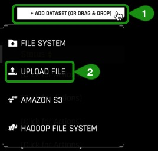

3\. In your local machine, navigate to the directory where the **train_0.75.csv** dataset was downloaded and select the file

4\. If the file was uploaded successfully then you should see an  image similar to the one below:

*Things to note*:

1\. You can view:
 - Dataset filename
 - File size
 - Number of rows/columns 
 - File status

 2\. Option to go back to the previous page  

### Deeper Dive and Resources

- [Learn more about the type of dataset file formats that can be uploaded on page 11](http://docs.h2o.ai/driverless-ai/latest-stable/docs/booklets/DriverlessAIBooklet.pdf) 

- For more datasets check out [Kaggle Datasets](https://www.kaggle.com/datasets)
## Task 4: Explore Data Details & AutoViz

### Details

We are now going to explore the training set that we just loaded. 

Continuing on the **Dataset Overview page**, click on the train_0.75.csv dataset. The following options will appear:

 - Details - View a summary the dataset or preview the daset
 - Visualize - Visualize the dataset with available graphs
 - Predict - Run an experiment using Driverless AI
 - Delete - Delete the dataset 
>Note: A dataset can only be deleted if it’s not being used in an experiment. You must delete the experiment first then the dataset can be deleted.

1\. Let’s confirm that our dataset was loaded correctly and we have the correct number of rows and columns. 

2\. Click on **Details**, this will take you to the **Dataset Details Page**
 
 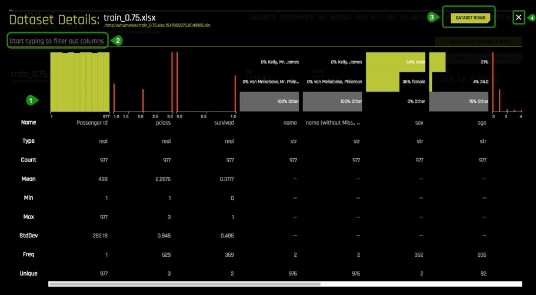

*Things to note:*
1. The **Dataset Details Page** provides a summary of the dataset of the first 20 rows. This summary lists each column that is included in the dataset along with the type, the count, the mean, minimum, maximum, standard deviation, frequency, and the number of unique values. 
>Note: Driverless AI recognizes the following column types: integer, string, real, and boolean. Date columns are given a str type.
2. You can view information for a specific column by entering the name of the column in the field above the graph.
3. **Dataset Rows** allows you to preview the dataset
4. Exit and return to the H2O Welcome page

3\. Select  **Dataset Rows**	

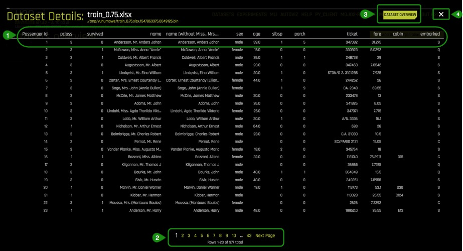

*Things to note:*
1. Preview the dataset 
2. View the remaining rows
3. Return to the **Dataset Overview** 
4. Exit and return to the H2O Welcome page

4\. Exit and return to **Datasets Overview** page.

### Autoviz

There are two ways to visualize the training set :
- Clicking on the train_0.75.xlsx dataset then selecting **Visualize** 
- Clicking on  **Autoviz** located at the top of the UI page, where you will be asked for the dataset you want to visualize.

1\. Pick a method to visualize the train_0.75.csv dataset. A similar image should appear:

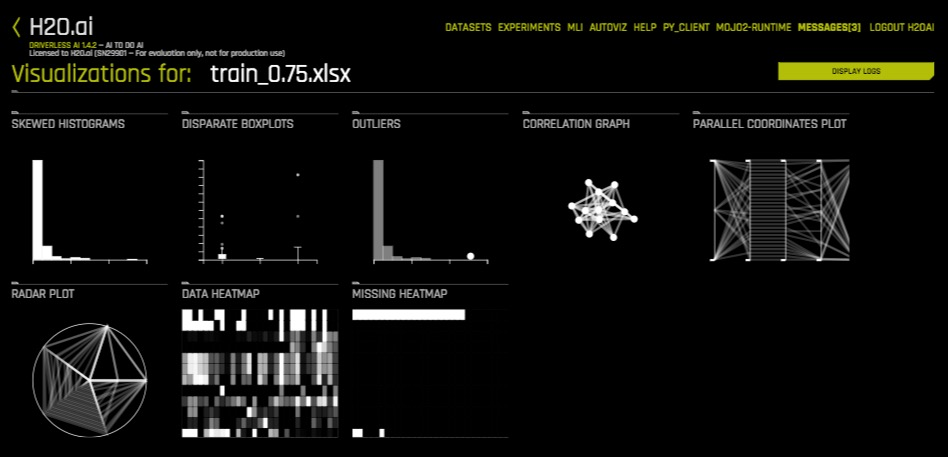

Is it possible to visualize how variables on the training set are correlated? Can we determine what other variables are strongly correlated to a passenger’s survival?  One of the graphs that allows us to visualize the correlations between variables is the **Correlation Graph**.

Let’s explore the correlation between the ‘survived’ variable and other variables on the dataset.

2\. Select the **Correlation Graph** and then click on **Help** located at the lower-left corner of the graph. 

3\. Take a minute to read about the how the correlation graph was constructed and how variables are color coded to show their correlations. 

4\. Take the ‘survived’ variable and drag it slightly to have a better look at the other variables it has been found to be correlated to. What variables are strongly correlated with the ‘survived’ variable?

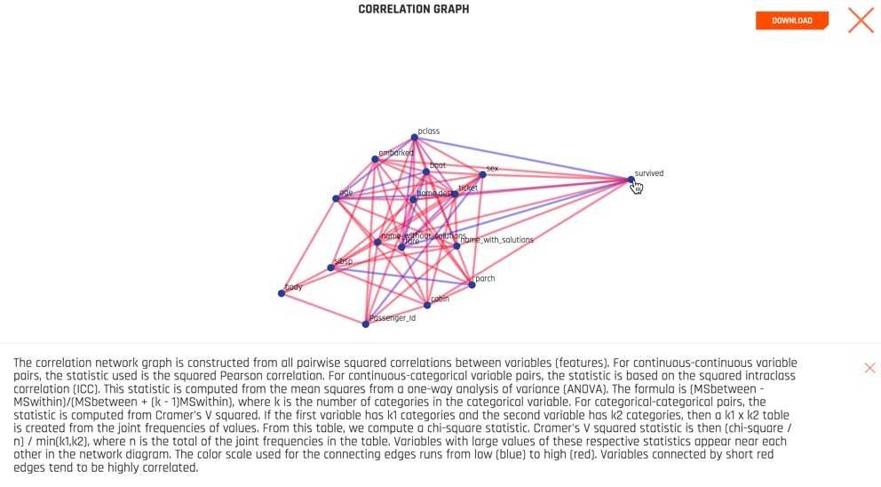

*Things to note:*
 - The **Help** button provides an explanation of the **Correlation Graph**. This feature is available for all graphs.
 - **Download** allows for a full-scale image of the graph to be downloaded

5\. Exit out of the **Correlation Graph** view by clicking on the **X** at the top-right corner of the graph.

Driverless AI  shows the graphs that are “relevant” aspects of the data. The following are the type of graphs available:
- Clumpy Scatterplots
- Correlated Scatterplots
- Unusual Scatterplots
- Spikey Histograms
- Skewed Histograms
- Varying Boxplots
- Heteroscedastic Boxplots
- Biplots
- Outliers
- Parallel Coordinates Plot
- Radar Plot
- Data Heatmap
- Missing Values Heatmap
- Gaps Histogram
- Missing Values Heatmap
- Gaps Histogram

### Deeper Dive and Resources

- [Learn more about Automatic Visualization from the Driverless docs](http://docs.h2o.ai/driverless-ai/latest-stable/docs/userguide/datasets.html#visualizing-datasets)

- [Learn more about Automatic Visualization from the architect Leland Wilkinson, Chief Scientist, H2O.ai from session at H2O World 2017 Youtube Video](https://www.youtube.com/watch?v=bas3-Ue2qxc)

- [Automatic Visualization SlideShare](https://www.slideshare.net/0xdata/automatic-visualization)

## Task 5: Launch first experiment

We are going to launch our first experiment. An experiment simply means that we are going to generate a prediction using a dataset of our choice.

Return to  the **Dataset Overview page**.

1\. Click on the train_0.75.csv dataset then select **Predict**

If this is your first time launching an experiment, the following prompt will appear asking if you want to take a tour.  

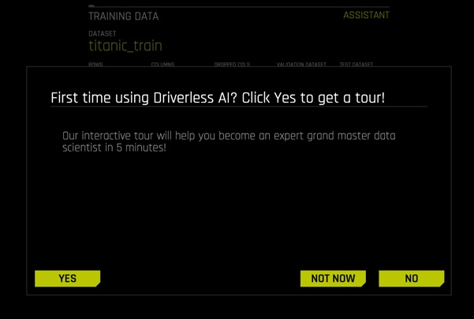

If you would like to take the quick tour select **YES**.
The quick tour will cover the following items:
- Select the training dataset 
- Select the target column that you want Driverless AI to predict from all columns
- Select if it is a Time Series problem or not [Time Series ON or OFF]

2\. Select **Not Now** to come back and take the tour another time.

3\. The following  **Experiment** page will appear:

*Things to note:*
1. Dropped Columns - Drop column(s) from your dataset that you don’t want to use in the experiment
2. Validation Dataset - Select the dataset you want to validate. This set will be used to validate parameters like models, features etc.
3. Test Dataset - The dataset that will be used to test the model generated from the training dataset. It is not used during training of the model and results are available at the end of the experiment.
4. Select Target Column - What do you want to predict?
5. Time Column - Provides a time order(time stamps for observations)
Hover over any of the yellow triangles for additional information 

Continuing on with our experiment:

4\. Click **Dropped Columns**, drop the *name(Miss., Mrs., and Mr.)* column, then select **Done**. 

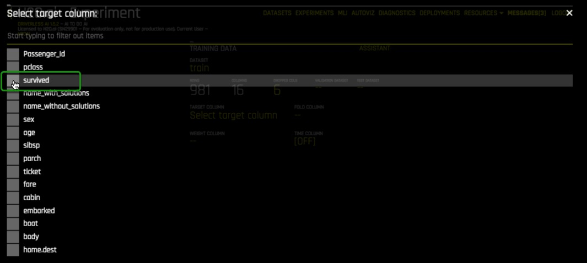

This column was dropped because we are going to use the original column ‘name’ which includes  the salutations and see if the final model generated uses those salutations as relevant factors to survival rates.

5\. Now select the **Target Column**, in our case the column will be ‘survived’

The survived attribute was selected because as an insurance company we want to know what  other attributes can contribute to the survival of passengers aboard a ship and incorporate that into our insurance rates.

6\. Your Experiment page should look like the one below:

*Things to note:*
1. Assistant - Highlights the different items that you can hover over and get additional information on
2. Sample of an Assistant Highlight
3. Experiment Settings - Describes the Accuracy, Time and Interpretability of your specific experiment.  The knobs on the experiment settings are adjustable. As values change the settings meaning on the left-bottom page change.
	- Accuracy - Relative accuracy – higher values, should lead to higher confidence in model performance (accuracy).
  	- Time - Relative time for completing the experiment. Higher values will take longer for the experiment to complete.
  	- Interpretability-  The degree to which a human can understand the cause of the decision.  
4. Launch Experiment: The dataset and the target column are the minimum elements required to launch an experiment.

7\. Select **Launch Experiment**

*Things to note:*
1. Experiment Name - Randomly generated experiment name. Name can be changed at anytime
2. Training Data - Dataset details 
3. Running Status Display - Status of parameter tuning followed, feature engineering and scoring pipeline. Experiments can be Stopped by clicking the Finish button.
4. Experiment Settings - Overview of experiment settings (unable to adjust then while experiment is running)
5. CPU/Memory information including Notifications, Logs and Trace info
6. Iteration Data and Variable Importance - Iteration Data is the internal validation for each cross validation fold with the specified scorer value. You can hover over any of the iteration points in the Iteration Data graph and the see the updated variable importance for that iteration on the **Variable Importance**
7. Classification Problem Graphs - Toggle between an ROC curve, Precision-Recall graph, Lift chart, Gains chart, and GPU Usage information (if GPUs are available)
											 				
Once the experiment is completed an Experiment Summary will appear:

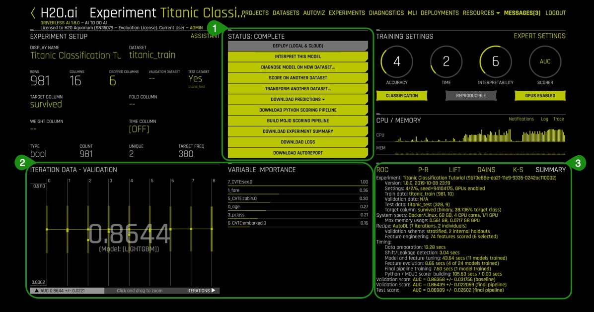

*Things to note:*
1. Status Complete Options
 - Interpret this model 
 - Score on Another Dataset
 - Transform Another Dataset
 - Download Validation Predictions
 - Download Python Scoring Pipeline - A standalone Python Scoring 
 - Pipeline for H2O Driverless
 - Download Experiment Summary - A zip file containing the following:
 	- Summary of Experiment
 	- Experiment Features along with relevant importance
 	- Ensemble information
 	- Experiment preview 
 	- PDF and markdown versions of an auto-generated report for the experiment
 	- Target transformations tuning leaderboard
 	- Leaderboard
 - Download Logs 

2. Iteration Data - Validation/Variable Importance - Summary of top 20 - Feature Engineered variables

3. Experiment Summary 

### Deeper Dive and Resources

- [Learn more about running Experiments from H2O Driverless AI docs](http://docs.h2o.ai/driverless-ai/latest-stable/docs/userguide/running-experiment.html#)

- [Explore Documentation on Completed Experiments](http://docs.h2o.ai/driverless-ai/latest-stable/docs/userguide/experiment-completed.html?highlight=experiment%20summary)

- [Explore Documentation on Experiment Summary](http://docs.h2o.ai/driverless-ai/latest-stable/docs/userguide/experiment-summary.html?highlight=experiment%20summary) 

- [Review the Driverless AI Booklet to learn more about running experiments](http://docs.h2o.ai/driverless-ai/latest-stable/docs/booklets/DriverlessAIBooklet.pdf) 

### Task 6: Explore Feature Engineering
Driverless AI performs feature Engineering on the dataset to determine the optimal representation of the data. Various stages of the features appear throughout the iteration of the data. These can be viewed by hovering over points on the Iteration Data - Validation Graph and seeing the updates on the **Variable Importance** section.

Transformations in Driverless AI are applied to columns in the data. The transformers create the engineered features in experiments. There are many types of transformers, below are just some of the transformers found in our dataset:

1\. Look at some of the variables in **Variable of Importance** , note that some of the variables start with ‘_NumCatTE’, ‘_CVCatNumEn’ or ‘_TXT’ and have multiple columns in between. These are the new, high value features for our training dataset.

These transformation created with the following transformers:
	
- Numeric to Categorical Target Encoding Transformer = ‘_NumCatTE’
- Cross Validation Target Encoding = ‘_CVCatNumEn’
- Text Transformer = ‘_TXT’

The complete list of features used in the final model is available in the Experiment Summary artifacts. The Experiment Summary also provides a list of the original features and their estimated feature importance.  

### Deeper Dive and Resources

- [Learn more about Driverless AI Transformations](http://docs.h2o.ai/driverless-ai/latest-stable/docs/userguide/transformations.html) 

- [Feature Engineering for ML by Dmitry Larko](https://www.youtube.com/playlist?list=PLrsf4weWJKynQBvh0i-YxDDVqCcIrF28o) 

- [H2O World London 2018 Feature Engineering session replay](https://www.youtube.com/watch?v=d6UMEmeXB6o ) and [slides  by Dmitry](https://www.slideshare.net/0xdata/feature-engineering-in-h2o-driverless-ai-dmitry-larko-h2o-ai-world-london-2018 ) 

## Task 7: Explore Experiment Results

Let’s explore the results of the experiment to determine how good the generated model is. The results are found on the **Experiment Summary** at the left-bottom of Experiment page.

1\. Summary

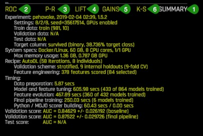

- How many features were tested and selected?
- How many models were trained for feature evolution?

2\. ROC - Receiver Operating Characteristics

This type of graph is called a Receiver Operating Characteristic curve (or ROC curve.) It is a plot of the true positive rate against the false positive rate for the different possible cutpoints of a diagnostic test.

An ROC curve demonstrates several things:

- It shows the tradeoff between sensitivity (True Positive Rate or TPR) and specificity (1-FPR or False Positive Rate). Any increase in sensitivity will be accompanied by a decrease in specificity.
- The closer the curve follows the left-hand border and then the top border of the ROC space, the more accurate the model.
- The closer the curve comes to the 45-degree diagonal of the ROC space, the less accurate the model.
- The slope of the tangent line at a cutpoint gives the likelihood ratio (LR) for that value of the test. You can check this out on the graph above. Recall that the LR for T4 < 5 is 52. This corresponds to the far left, steep portion of the curve. The LR for T4 > 9 is 0.2. This corresponds to the far right, nearly horizontal portion of the curve.
- The area under the curve is a measure of model accuracy. 

3\. Prec-Recall - Precision- Recall graph

The precision-recall plot uses recall on the x-axis and precision on the y-axis. Recall is identical with sensitivity, and precision is identical with positive predictive value.

- ROC curves should be used when there are roughly equal numbers of observations for each class.
- Precision-Recall curves should be used when there is a moderate to large class imbalance.
- Similar to ROC, the AUCPR (Area under the curve of Precision-recall curve) is a measure of model accuracy and higher the better. 
- In both the ROC and Prec-recall curve, DAI will indicate points that are the best thresholds for Accuracy (ACC), F1 or MCC (Matthews correlation coefficient).

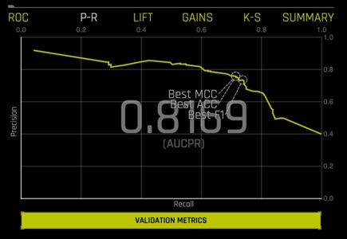

4\. Lift Chart & Gains

- Cumulative gains and lift charts are visual aids for measuring model performance
- Both charts consist of a lift curve and a baseline
- The greater the area between the lift curve and the baseline, the better the model

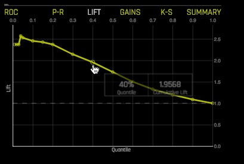

- Lift is a measure of the effectiveness of a predictive model calculated as the ratio between the results obtained with and without the predictive model.
- The lift chart shows how much more likely we are to receive respondents than if we contact a random sample of customers.
- It is calculated by determining the ratio between the result predicted by our model and the result using no model.
- Example: For contacting 10% of customers, using no model we should get 10% of responders and using the given model we should get 30% of responders. The y-value of the lift curve at 10% is 30 / 10 = 3

5\. Gains Chart

The y-axis shows the percentage of positive responses. This is a percentage of the total possible positive responses 
The x-axis shows the percentage of customers contacted, which is a fraction of the total customers.
Baseline (overall response rate): If we contact X% of customers then we will receive X% of the total positive responses.

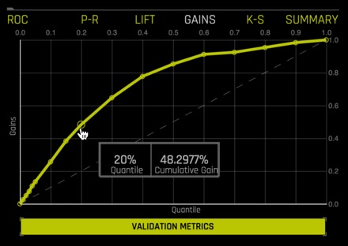

### Deeper Dive and Resources

- [The Best Metric to Measure Accuracy of Classification Models](https://clevertap.com/blog/the-best-metric-to-measure-accuracy-of-classification-models/)

## Task 8: MLI Report

After the predictive model is finished we can explore the interpretability of our model. In other words what are the results and how did those results come to be?

Questions to consider before viewing the MLI Report:
- Which attributes from our Titanic Training Set do you think are the most important in relation to surviving? Make a note of your top 2 attributes to compare it with the model’s results

There are two ways to generate the MLI Report, selecting the **MLI** link on the upper-right corner of the UI or clicking **Interpret this Model** button on the **Experiment**page. 

Generate the MLI report:

1\.**On the Status: Complete** Options, select **Interpret this Model**

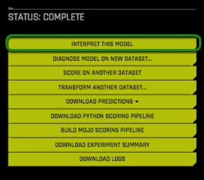

2\. The MLI Interpretability Page has the explanations to the model results in a human-readable format.  

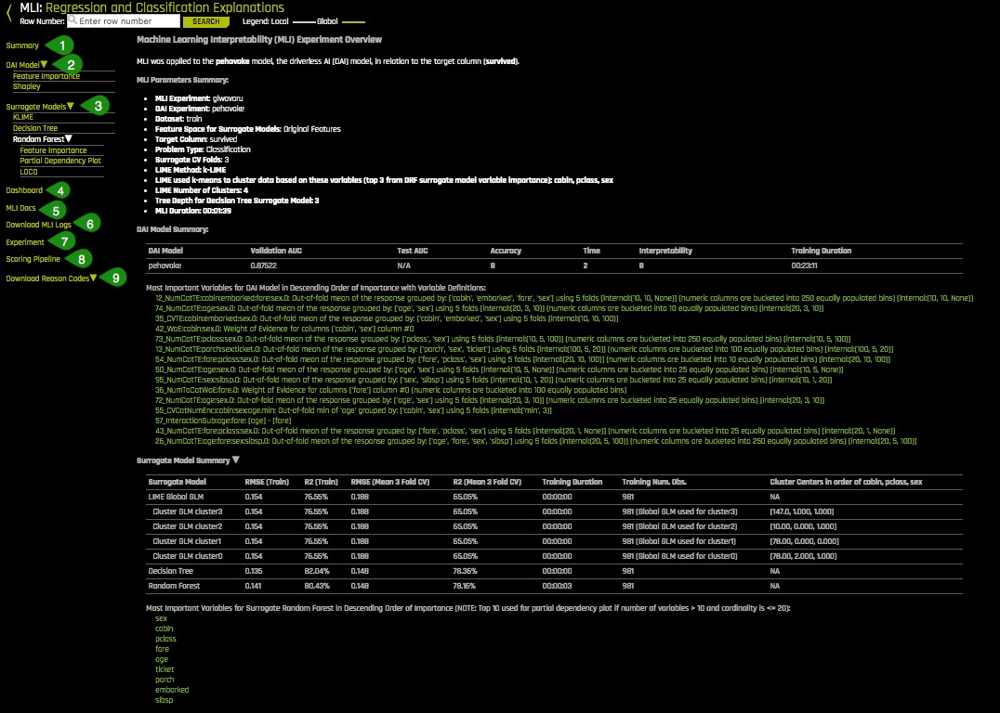

*Things to note:*
1. Summary -  Summary of MLI experiment
2. DAI Model - Feature importance and Shapley plots for transformed features
3. Surrogate Models - KLIME and Decision Tree plots
4. Dashboard - The Model Interpretation Page includes the following:
	- Global Interpretability model explanation plot
	- Variable Importance
	- Decision Tree Surrogate model
	- Partial Dependence and Individual conditional expectation plots
5. MLI Docs - Link to the “Machine Learning Interpretability with 
Driverless AI” booklet
6. Download MLI Logs 
7. Experiment - Link to return to the experiment that generated the current interpretation
8. Scoring Pipeline - Download the scoring pipeline for the current interpretation
9. Download Reason Codes - Download a CSV file of LIME and/ or Shapley reason codes

### MLI Dashboard

Select the MLI **Dashboard** and explore the different types of insights and explanations regarding the model and its results. All plots are interactive.

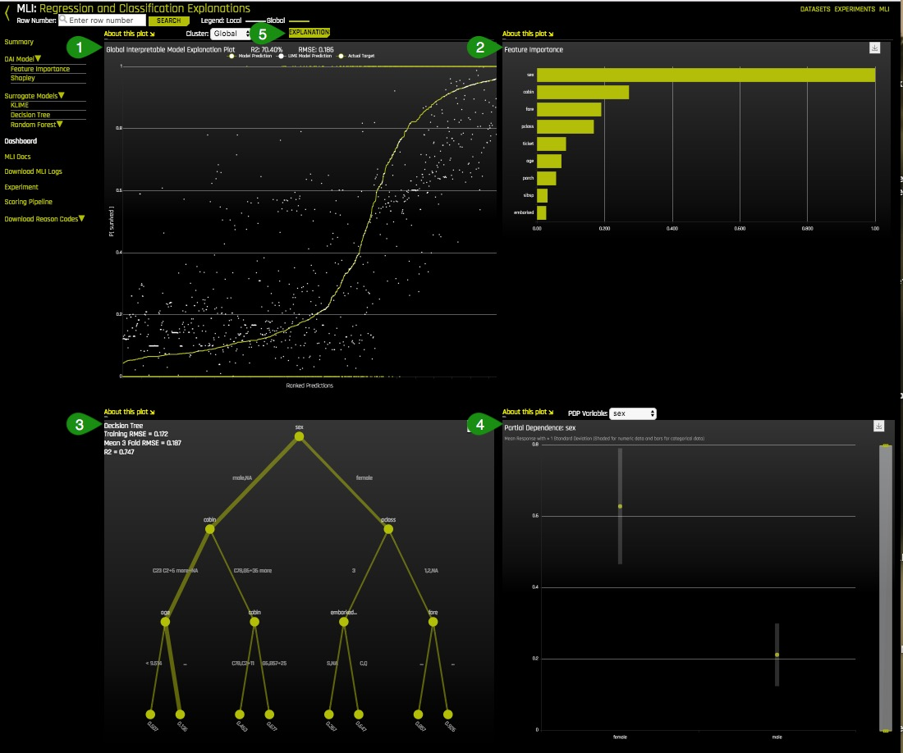

1\. Global Interpretability model explanation plot: 
This plot shows Driverless AI model and LIME model predictions in sorted order by the Driverless AI model predictions. In white, is the global linear model of Driverless AI predictions (middle, green, in
- Hover over any of the points of the plot and view the LIME reason codes for that value.
- Select a point where *Actual value* is 1 and note the reason codes for that prediction value

2\. Variable Importance
This graph shows the most important features that drive the model behavior.
- Which attribute/feature had the most importance?
- Was this the same attribute that you hypothesized?
- View the explanation of the **Variable Importance** plot by selecting **About this plot

3\. Decision Tree Surrogate model
The decision Tree Surrogate model displays the model’s approximate flowchart of the complex Driverless AI model’s decision making.					
Higher and more frequent features are more important. Features above or below one-another can indicate an interaction. Finally, the thickest edges are the most common decision paths through the tree that lead to a predicted numerical outcome.

- What is the most common decision path for the Titanic Training set?

4\. Partial Dependence and Individual conditional expectation plots
This plot represents the model prediction for different values of the original variables. It shows the average model behavior for important original variables.
The grey bar represent the standard deviation of predictions. The green dot represents the average predictions.

- Explore other average values for other variables and compare the results to your original observations. To change the variable select **PDP Variable:** located at the top of the Partial Dependence plot.
 
5\. Explanations 
Explanations provides a detailed easy-to-read **Reason Codes** for the top Global/Local Attributions.
- Click on Explanations

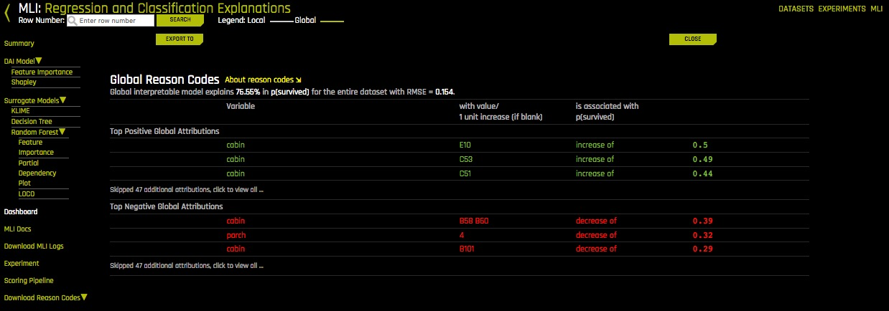

- Determine the top 2 global attributions associated with ‘survived’

6\. Driverless AI offers other plots located under DAI Model and Surrogate Models, take a few minutes to explore these plots, they are all interactive. **About this Plot** will provide an explanation of each plot.
- Feature Importance Shapley
- KLime
- Random Forest

7\. Click on the MLI link and learn more about about “Machine Learning Interpretability with Driverless AI”

### Deeper Dive and Resources

- [H2O Driverless AI Machine Learning Interpretability walkthrough]( 
https://www.youtube.com/watch?v=5jSU3CUReXY)(Oct 18)

- [Practical Tips for Interpreting Machine Learning Models - Patrick Hall, H2O.ai Youtube Video](https://www.youtube.com/watch?v=vUqC8UPw9SU )(June 18)

- [Practical Tips for Interpreting Machine Learning Models - Patrick Hall, H2O.ai Slideshare](https://www.slideshare.net/0xdata/practical-tips-for-interpreting-machine-learning-models-patrick-hall-h2oai)

- [Building Explainable Machine Learning Systems: The Good, the Bad, and the Ugly](https://www.youtube.com/watch?v=Q8rTrmqUQsU)(May 18
 
- [An Introduction to Machine Learning Interpretability](https://www.oreilly.com/library/view/an-introduction-to/9781492033158/) 

- [Testing machine learning explanation techniques](https://www.oreilly.com/ideas/testing-machine-learning-interpretability-techniques)

- [Patrick Hall and H2O Github - Machine Learning with Python](https://github.com/jphall663/interpretable_machine_learning_with_python)

- [Patrick Hall and H2O Github - Machine Learning Interpretability](https://github.com/jphall663/awesome-machine-learning-interpretability) 

- [Download the Driverless Ai MLI Cheat Sheet](http://docs.h2o.ai/driverless-ai/latest-stable/docs/userguide/_downloads/5cb84bc81a49817d5f490dde39bf42ee/cheatsheet.png) 

## Task 9: AutoDocs

Driverless AI allows you to download auto generated documents such as the Download Experiment Summary and the MLI Report, all at the click of a button. 

###  Experiment Summary

1\. Click on **Download Experiment Summary**

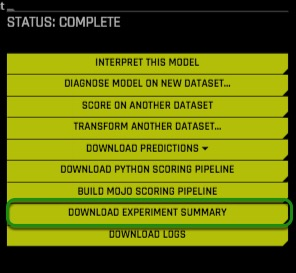

When you open the zip file the following files should be included:
- Summary of Experiment
- Experiment Features along with relevant importance
- Ensemble information
- Experiment preview 
- PDF and markdown versions of an auto-generated report for the experiment
- Target transformations tuning leaderboard
- Leaderboard

2\. Open the auto-generated pdf report and review the experiment results.

### Deeper Dive and Resources

- [Review this Webinar “Peek Under the Hood of H2O Driverless AI with Auto Doc”](https://www.brighttalk.com/webcast/16463/332693/peek-under-the-hood-of-h2o-driverless-ai-with-auto-doc) 

## Task 10: Challenge

Using the CreditCard dataset identify predict whether someone will default  on their Credit Card Payment.  Based on a customer’s past behavior, can we predict if they will default on a credit card payment?   Based on the information known at the start of a loan, can we predict if the loan will be fully paid off?

The dataset has the following information: information on default payments, demographic factors, credit data, history of payment etc.

Here is the schema for the dataset:

Sample set of records:

1\. Import the CreditCard dataset from here:

- [CreditCard Train](https://s3.amazonaws.com/data.h2o.ai/DAI-Tutorials/credit-card-train.csv)
- [CreditCard Test](https://s3.amazonaws.com/data.h2o.ai/DAI-Tutorials/credit-card-test.csv)

2\. Run an experiment where the target column is “DEFAULT_PAYMENT_NEXT_MONTH”

3\. **Interpret this model ** [Review the MLI Booklet which uses the CreditCard data set for its example and explanations] (http://docs.h2o.ai/driverless-ai/latest-stable/docs/booklets/DriverlessAIBooklet.pdf)

4\. Read through MLI Report and determine:

- What variables increase the likelihood of defaulting on a credit card payment? 
- What decreases the likelihood of default?

### Deeper Dive and Resources

- [Try running an experiment without the Driverless AI UI using the Python Client](http://docs.h2o.ai/driverless-ai/latest-stable/docs/userguide/examples/h2oai_client_demo.html?highlight=experiment%20summary)
