# Get Started and Consume Existing Recipes 

## Outline

- [Objective](#objective)
- [Prerequisites](#prerequisites) 
- [Task 1: Introduction to Driverless AI ML Optimization Extensions Recipe](#task-1-introduction-to-driverless-ai-ml-optimization-extensions-recipe)
- [Task 2: Launch an Experiment and Consume a Recipe](#task-2-launch-an-experiment-and-consume-a-recipe) 
- [Task 3: Recipe: Transformer](#task-3-recipe-transformer)
- [Task 4: Recipe: Scorer](#task-4-recipe-scorer)
- [Task 5: Recipe:  Model](#task-5-recipe-model)
- [Task 6: Comparing Final Model Results](#task-6-comparing-final-model-results) 
- [Task 7: Appendix A: How to Access DAI Custom Recipes](#task-7-appendix-a-how-to-access-dai-custom-recipes)
- [Task 8: Next Steps](#task-8-next-steps)

## Objective

We believe that every company can and should be an AI company. This is a fundamental concept for the future of every business and organization today. As you embark on this AI journey to make your own AI, we want you to explore the key considerations as well as the technology that will make your own AI a possibility.

To make your own AI, with an automatic machine learning platform, it needs to be open and extensible. This allows data scientists to influence the automatic machine learning optimization process and for it to consider additional feature engineering, custom scorers, and other algorithms. Data scientists can add their insights, customizations, and build the most accurate models for their use cases. Driverless AI uses the concept of recipes to optimize the machine learning process, and with Driverless AI 1.7 user can add custom recipes and develop new recipes.

In this tutorial, we will cover what a recipe is, the different types of recipes available, and how to upload existing recipes to DAI through the URL option. The three types of custom recipes that will be covered are transformer, scorer, and model.

## Prerequisites

You will need the following to be able to do this tutorial:
- Basic knowledge of Machine Learning and Statistics

- A Driverless AI environment
- Basic knowledge of Driverless AI or doing the Automatic Machine Learning Intro tutorial

You can get more information about getting a Driverless AI environment or trial from the following:
- [A Two Hour Test Drive Session](https://github.com/h2oai/tutorials/blob/master/DriverlessAI/Test-Drive/test-drive.md)  
- [H2O Driverless AI License Key](https://github.com/h2oai/tutorials/blob/master/DriverlessAI/automatic-ml-intro-tutorial/automatic-ml-intro-tutorial.md#prerequisites) 
- [H2O Driverless AI Environment and Product Tour](https://github.com/h2oai/tutorials/blob/master/DriverlessAI/automatic-ml-intro-tutorial/automatic-ml-intro-tutorial.md#task-1-get-environment-and-product-tour) 

If you are not familiar with Driverless AI please review and do this tutorial:

- [Automatic Machine Learning Intro Tutorial](https://github.com/h2oai/tutorials/blob/master/DriverlessAI/automatic-ml-intro-tutorial/automatic-ml-intro-tutorial.md) 

## Task 1: Introduction to Driverless AI ML Optimization Extensions Recipe

H2O Driverless AI is an artificial intelligence (AI) platform for automatic machine learning. Driverless AI automates some of the most difficult and tedious data science and machine learning tasks such as feature engineering, algorithm selection, model validation, model tuning, model selection, model explanation, model documentation and model deployment. It aims to achieve the highest predictive accuracy, comparable to expert data scientists, but in a much shorter time thanks to end-to-end automation. Currently, Driverless AI does not allow for data manipulation or augmentation once data has been loaded to DAI.  Data preparation needs to be done before loading the data.
	
In Driverless AI, a pipeline (which we call an experiment) is made up of building blocks, or recipes, that produce a model. These recipes are Python code snippets. Recipes have the following types: ML algorithms, feature engineering (transformers), scorers, and configuration.  In Driverless AI 1.7, we’ve added support for BYOR (Bring Your Own Recipe). With BYOR, you can use your own recipes in combination with or instead of all built-in code recipes. This allows you to influence the DAI Automatic ML pipeline and gives you control over the optimization choices that Driverless AI makes.

Recipes can be uploaded into DAI at runtime without having to restart DAI, just like a plugin. There are over 78 open-source recipes that have been created by H2O and curated in the recipe library by data science experts that can be used as-is or as templates and expand upon.

Existing recipes include templates for:

- **Transformers**
- **Scorers**
- **Models**

The various types of templates and how to use them will be described in the remaining tasks of the tutorial. 

### How do recipes work in DAI? 

During the training of a supervised machine learning modeling pipeline, Driverless AI can use the recipes or code snippets as building blocks, independent or in combination with all built-in code pieces. The recipes act the same way as if it was written by H2O. It’s the same python code and backend, so there is no performance penalty.

Below is a diagram of how recipes work in DAI and how the Automatic Model Optimization process is extended:

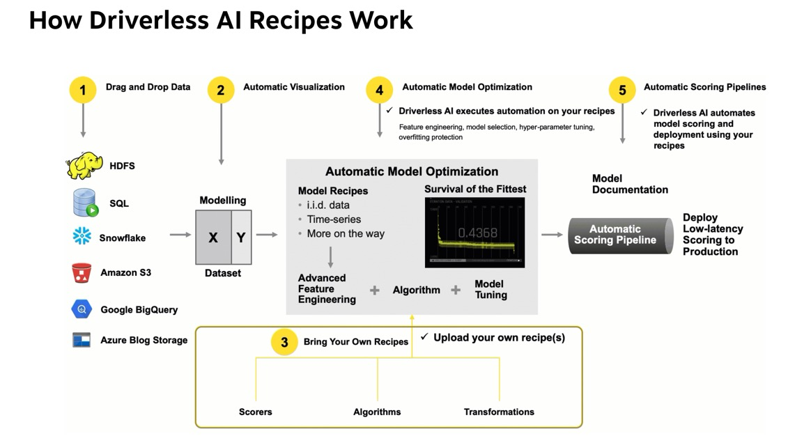


The image below is a deeper dive into the **BYOR** architecture for a multi-class problem:


The diagram above focuses on the parts of Driverless AI that are relevant to the **BYOR** architecture. Automatic Visualization and Machine Learning Interpretability are not covered in this diagram. The diagram is the architecture representing a multi-class problem, but binary classification and regression problems are also supported. 

### What is the role of recipes in ML?

**BYOR** allows data Scientists to bring their own recipes or leverage the existing open-source recipes to manipulate, augment, and optimize their data. In this way, the expertise of those creating and using the recipes is leveraged to focus on domain-specific functions to build customizations. 

### Where can you find the H2O open-source recipes?

The curated open-source recipes currently reside on the following GitHub repository:

[H2O Curated Recipes GitHub Repo ](https://github.com/h2oai/driverlessai-recipes?source=post_page---------------------------#sample-recipes)

### Deeper Dive and Resources

Explore the recipe Library and recipe recommendations 

Best Practices for Recipes:

- [Security](https://github.com/h2oai/driverlessai-recipes?source=post_page---------------------------#security) 
- [Safety](https://github.com/h2oai/driverlessai-recipes?source=post_page---------------------------#safety) 
- [Performance](https://github.com/h2oai/driverlessai-recipes?source=post_page---------------------------#performance)
- [Frequently Asked Questions](https://github.com/h2oai/driverlessai-recipes/blob/master/FAQ.md#faq) 


## Task 2: Launch an Experiment and Consume a Recipe

### About the Dataset

This tutorial will use the customer churn Telco dataset from [Kaggle](https://www.kaggle.com/becksddf/churn-in-telecoms-dataset). The dataset has information about customers of a Telecommunications company. Some of the features included are customer demographic location, length of the account, and customer call history. We will be predicting customer churn.

[1] [Churn in Telcom’s dataset](https://www.kaggle.com/becksddf/churn-in-telecoms-dataset)  

This dataset set has 3333 customers(rows) and 21 columns representing attributes of each customer’s telephone plan. 

### Add the Data

1\. Click on **+ Add a Dataset(or Drag and Drop)**
 
2\. Select **FILE SYSTEM**


3\. Enter the following ```/data/Spunk/Churn``` into the search bar.

4\. Select ```church.csv``` 

5\. **Click to Import Selection**

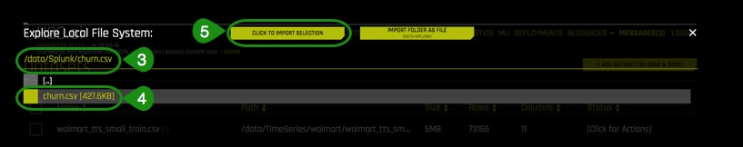

6\.  If the file loaded successfully then you should see an image similar to the one below:


7\. Let’s take a quick look at the columns of the churn dataset:

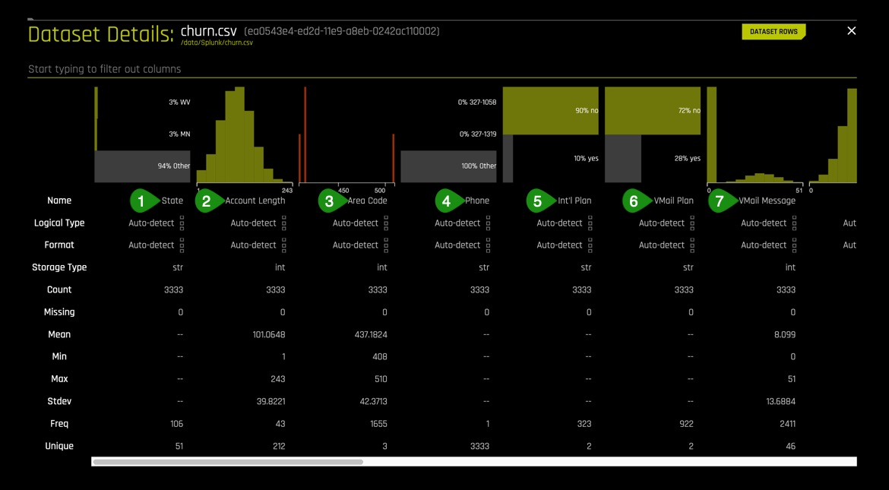

*Things to Note:*
1. **State**
2. **Account Length** - in days 
3. **Area Code**
4. **Phone** - Phone Number
5. **Int’l Plan** - International Plan 
6. **VMail Plan** - Voicemail Plan 
7. **VMail Messages** - Number of voicemail Messages

8\. Continue scrolling the current page to see more columns (image is not included)

8. **Day Mins**  - Total Day Minutes
9. **Day Calls** - Total Day Calls
10. **Day Charge** - Total Day Charge
11. **Eve Mins** - Total Evening Minutes
12. **Eve Calls** - Total Evening Call
13. **Eve Charge** - Total Evening Charge
14. **Night Mins** - Total Night Minutes  
15. **Night Calls** - Total Night Calls 
16. **Night Charge** - Total Night Charge 
17. **Intl Mins** - Total International Minutes
18. **Intl Calls** - Total International Calls
19. **Intl Charge** - Total International Charge  
20. **CustServ Call** - Total Customer Service Calls 
21. **Churn** - Did customer churn? True: customer churned, False: customer did not churn 

9\.  Return to the **Datasets** Page
 
### Launch Experiment

1\. On the **Datasets** page click on the ```churn.csv``` dataset and select **Predict**

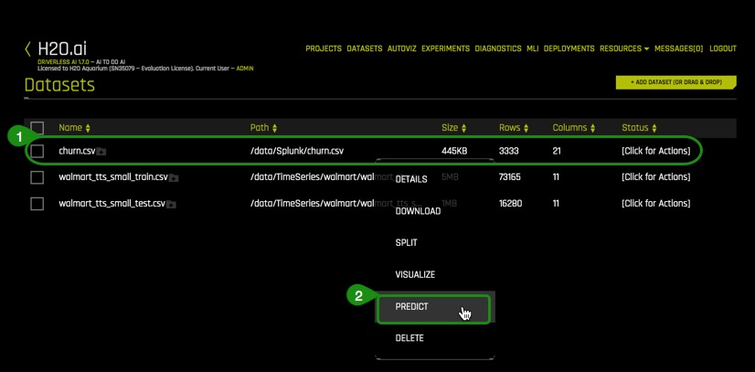

2\.  Select **Not Now** on the **First time Driverless AI, Click Yes to get a tour!**. A similar image should appear:

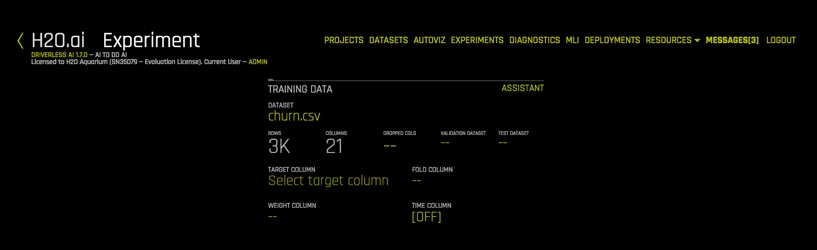

3\. Select **Target Column**, then select **Churn?**

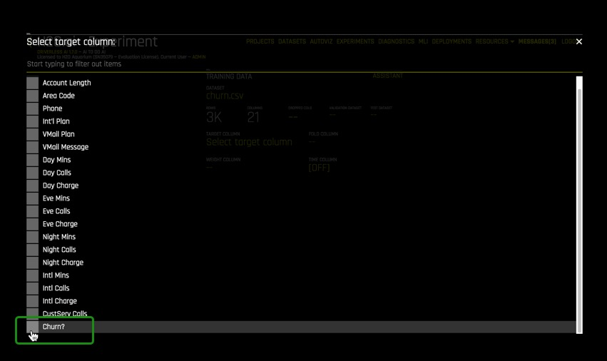

4\. Verify that the experiment looks similar to the one below, then select **Launch Experiment**:


5\. Once the experiment is completed, a similar page will appear with experiment results:

**Experiment 1 Results:**!


**Experiment 1 - ROC Accuracy**

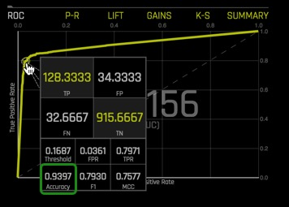

*Things to Note:*

- **Under summary**: The validation score is .91557 with an accuracy of .9397 (click on ROC then hover over Best ACC)

- **Variable Importance**: The top variables that led to a customer churning according to this model was the total amount a customer was being charged for their "day calls." The other variable of most importance was the number of times the customer had to call customer service; intuitively this makes sense because if a customer is overpaying for calls in the morning when they might the most active and they had to call customer service many times, it could have led a dissatisfied customer.

6/. Hover over the experiment name, a pencil will appear, click on it: 


7\. Change the experiment name to ```Exp 1 - Baseline``` then click **Enter**, the name of your experiment should look similar to the one below:


### Deeper Dive and Resources

- [Kaggle’s Churn in Telcom’s Dataset](https://www.kaggle.com/becksddf/churn-in-telecoms-dataset)

## Task 3: Recipe: Transformer

On task 2, we ran an experiment to build a model that would predict customer churn. The Driverless AI model that was generated with the default settings gave us the results below:

**Summary of results**:

| - | Experiment 1(Base)|
|---| ---|
| Experiment Settings | 7-2-8 | 
| Scorer | AUC |
| Model | LightGBM |
| Feature Importance | Day Charge|
| AUC Score | .9156|
| Accuracy | .9397 |

When a dataset is selected for an experiment, Driverless AI optimizes its settings by selecting the best Scorer, Model(s) and Transformers for the dataset. However, this does not mean we cannot import other scorer’s, models or transformers to see if we can further optimize our model. In this task, we will be importing a transformer recipe, to see how the features in the feature engineering change.

Now we are going to import a recipe to add related numeric features such as day minutes, evening minutes, and night minutes. DAI doesn’t add 3 or more columns so we will add a recipe that will do this for us. We will see if DAI is able to use this new transformation in determining variable importance.

### Import a Transformer Recipe

The goal of importing the new transformer recipe is to see if we can further optimize our baseline model. To do this, we are going to take our baseline experiment and import the [sum.py transformer](https://github.com/h2oai/driverlessai-recipes/blob/master/transformers/numeric/sum.py) 

1\. Select **Experiments** located at the top of the **Experiment** page:

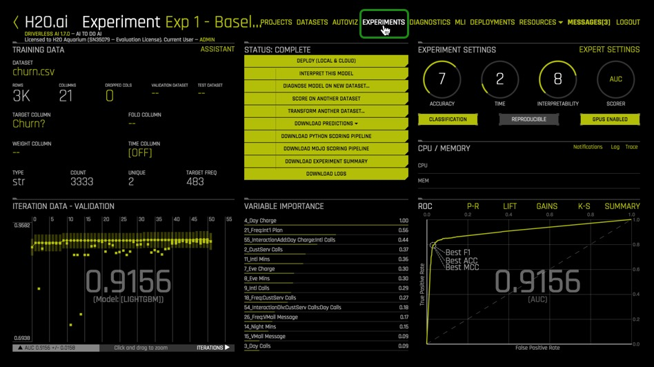

2\. Hover over **Exp 1 - Baseline**, then click on the three stacked small boxes located on the right side of **Exp 1 - Baseline** and select **New Model with Same Params**, this will create a new experiment with the same parameters that you used for **Exp 1 - Baseline**:

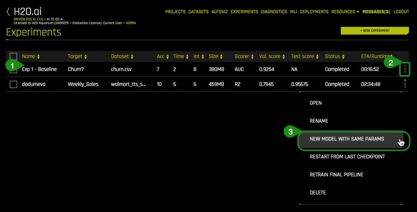

3\. Select **No** on the **First Time Using Driverless AI Tour**

4\. Select **Expert Settings**

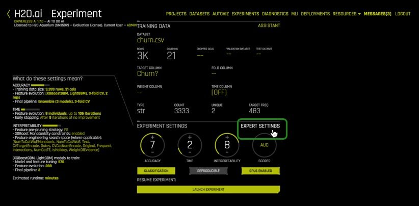

5\. Click on **+Load Custom Recipe From URL**


6\. Copy and paste  the following “Raw” URL for the SumTransformer into the **Load Custom Recipe** box then click on **Save**

```html
https://raw.githubusercontent.com/h2oai/driverlessai-recipes/master/transformers/numeric/sum.py 
```

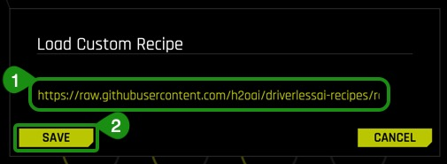

7\. There will be a message updating you on the status of loading of the recipe, then Expert Experiment Settings page will re-appear

8\. On the **Expert Experiment Settings** find **Recipes** and click on it

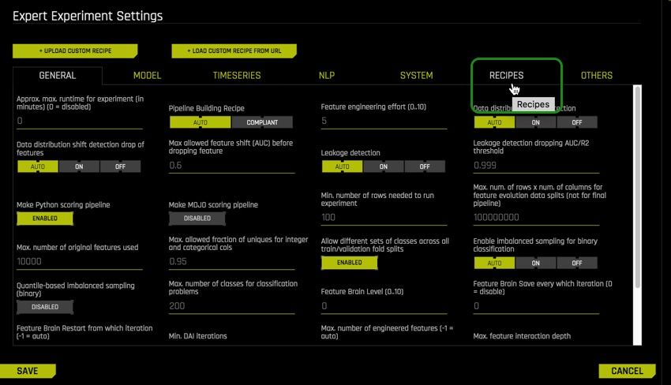

9\. Click on **Select Value** under **Include Specific Transformer**, we are going to verify that the transformer we loaded did indeed load.

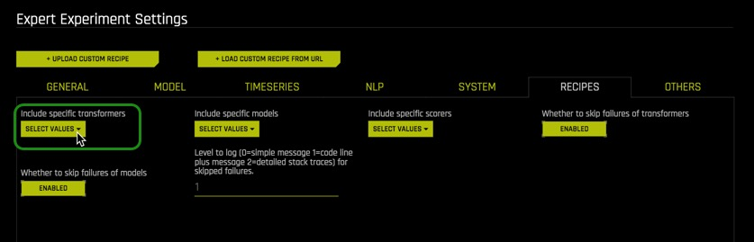

10\. Type ```SumTransformer``` on the search bar, if the Transformer loaded correctly, then it will appear as shown below, highlighted meaning that it will be used by DAI:


11\. Select **Save** on the **Expert Experiment Settings** page

12\. You can verify that the transformer was included in the experiment on the Experiments page by looking under “What do these settings mean?” > “Interpretability” as **Sum**


13\. Select **Launch Experiment**

14\. At the end of the experiments, you will see an experiment summary similar to the one below, make sure to change the experiment name to  ```Exp 2  - Transformer```


The results of the experiment will be discussed at the end of task 6.

### Deeper Dive and Resources

- [H2O’s Driverless AI Recipes - Sum Transformer](https://github.com/h2oai/driverlessai-recipes/blob/master/transformers/numeric/sum.py)

## Task 4: Recipe: Scorer

In this task, we will be importing a Scorer recipe to see if this scorer will help improve the performance of the model. 

### Import a Scorer Recipe

The model recipe that will be used for this experiment is the Brier Loss Scorer, to learn more about the Brier Loss model see the **Deeper Dive and Resources** at the end of this task.

1\.Select **Experiments** located at the top of the **Experiment** page

2\. Hover over **Exp 1 - Baseline**, then click on the three stacked small boxes located on the right side of **Exp 1 - Baseline** and select **New Model with Same Params**, this will create a new experiment with the same parameters that you used for **Exp 1 - Baseline**:


3\. Select **Expert Settings**


4\. Click on **+Load Custom Recipe From URL**

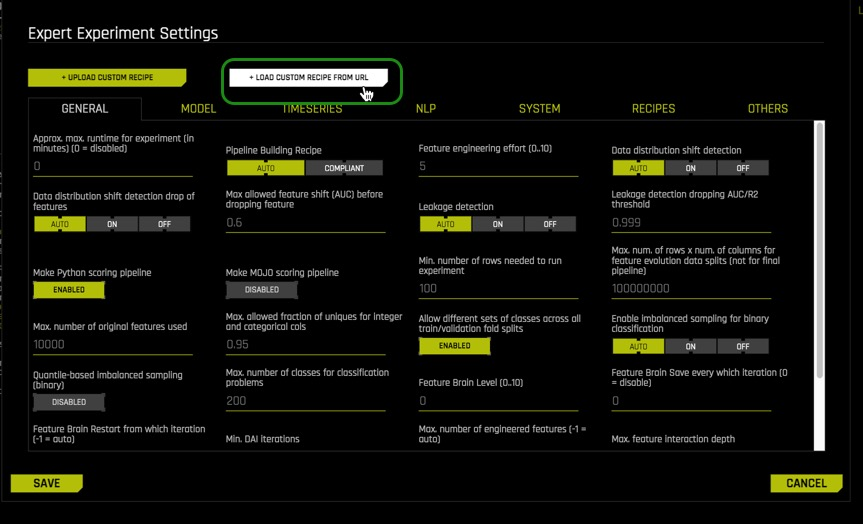

5\. Copy and paste  the following “Raw” URL for the Custom Brier Loss recipe into the **Load Custom Recipe** box then click on **Save**

~~~html
https://raw.githubusercontent.com/h2oai/driverlessai-recipes/rel-1.7.0/scorers/classification/binary/brier_loss.py 
~~~


6\. There will be a message updating you on the status of loading of the recipe, then Expert Experiment Settings page will re-appear

7\. On the **Expert Experiment Settings** find **Recipes** and click on it

8\. Click on **Select Value** under **Include Specific Scorers**, we are going to verify that the scorer we loaded did indeed load.


9\. On the list of Scores that comes up look for ```BRIER```, if the Scorer loaded correctly, then it will appear as shown below, highlighted meaning that it will be used by DAI:

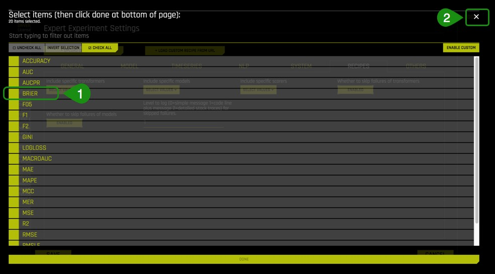

10\. Select **Save** on the **Expert Experiment Settings** page

11\.Once back on the **Experiment** page, click on the Scorer setting which has **AUC** as seen on the image below:

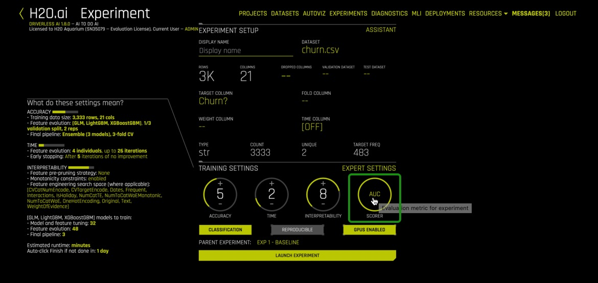
 
12\. Select the **Brier** Scorer by clicking on it:


13\. Your experiment page should look similar to the one below with **Brier** as your new scorer. Since we selected to create a new experiment from the baseline experiment this experiment does not have the transformer we loaded on task 2.

 

14\. Select Launch Experiment 

15\. At the end of the experiment, you will see an experiment summary similar to the one below, make sure to change the experiment name to  ```Exp 3  - Scorer```

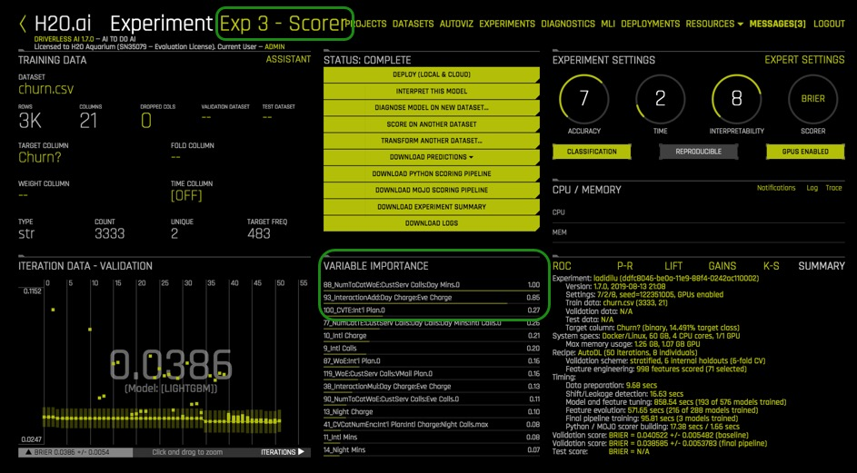

**Experiment 3 - ROC Accuracy**

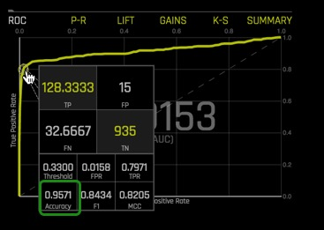

### Deeper Dive and Resources

- [Wikipedia Brier Score](https://en.wikipedia.org/wiki/Brier_score)
- [H2O’s Driverless AI Recipes  - Brier Loss](https://github.com/h2oai/driverlessai-recipes/blob/rel-1.7.0/scorers/classification/binary/brier_loss.py) 

## Task 5: Recipe: Model

In this task, we will be importing a model recipe, with the goal of seeing if this new custom model recipe will help improve our churn model. 

### Import a Model Recipe

The model recipe that will be used for this experiment is an **ExtraTrees** which is an extremely randomized tree (ExtraTrees) from sklearn, to learn more about the **Extra Trees** model see the **Deeper Dive and Resources** at the end of this task.

1\.Select **Experiments** located at the top of the **Experiment** page

2\. Hover over **Exp 1 - Baseline**, then click on the three stacked small boxes located on the right side of **Exp 1 - Baseline** and select **New Model with Same Params**, this will create a new experiment with the same parameters that you used for **Exp 1 - Baseline**:

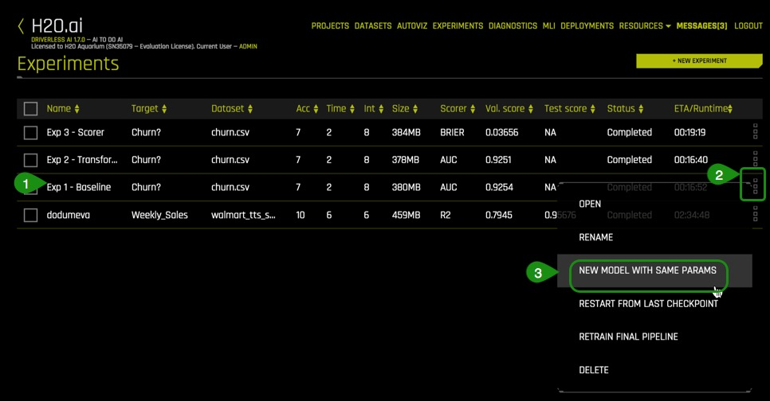

3\. Select **Expert Settings**

4\. Click on **+Load Custom Recipe From URL**

5\. Copy and paste  the following “Raw” URL into the **Load Custom Recipe** box then click on **Save**

6\. Copy and paste  the following “Raw” URL into the **Load Custom Recipe** box then click on **Save**

~~~html
https://raw.githubusercontent.com/h2oai/driverlessai-recipes/rel-1.7.0/models/algorithms/extra_trees.py 
~~~


7\. There will be a message updating you on the status of loading of the recipe, then the **Expert Experiment Settings** page will re-appear

8\. On the **Expert Experiment Settings** find **Recipes** and click on it

9\. Click on **Select Value** under **Include Specific Model**, we are going to verify that the custom model we loaded did indeed load then we will only select the **ExtraTress** model to run on our new experiment:


10\. Click on **Unselect all**, then select the **ExtraTress** model and click **Done**

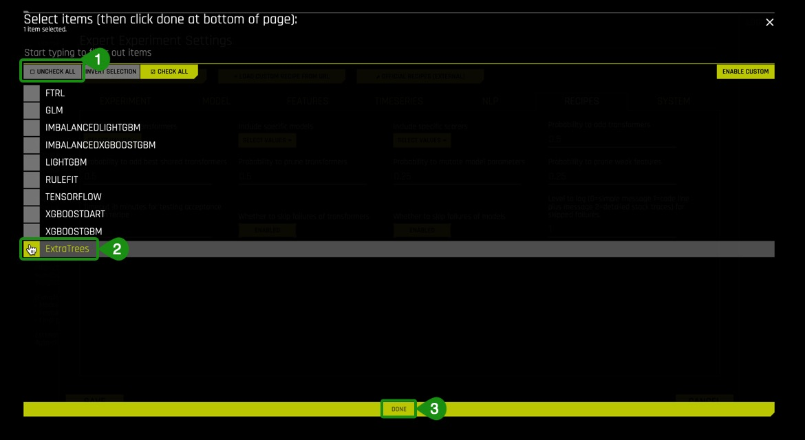

11\. Select **Save** on the **Expert Experiment Settings** page

12\. You can verify that the custom model was included on the experiment on the **Experiments** page by looking under “What do these settings mean?”, the settings have been updated to reflect the new ExtraTrees custom model:


13\. Select Launch Experiment 

14\. At the end of the experiment, you will see an experiment summary similar to the one below, make sure to change the experiment name to  ```Exp 4  - Model```

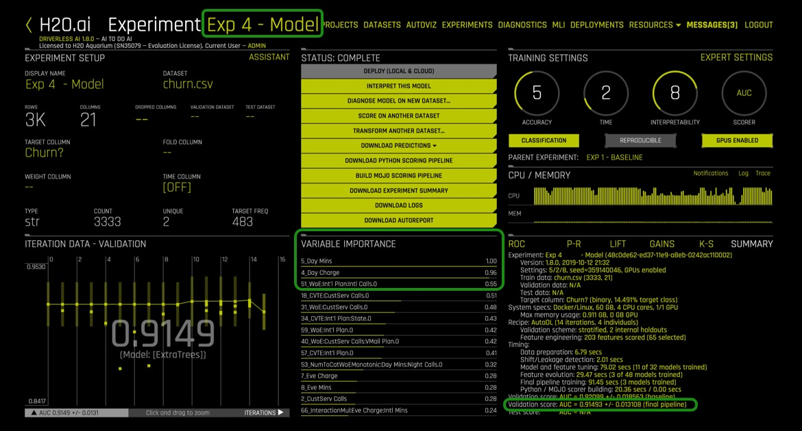

### Deeper Dive and Resources

- [H2O’s Driverless AI Recipes - ExtraTrees Model ](https://github.com/h2oai/driverlessai-recipes/blob/rel-1.7.0/models/algorithms/extra_trees.py) 

## Task 6: Comparing Final Model Results 

So far we ran four experiments, a baseline, and the baseline with three different types of recipes:

- DAI default settings
- Transformer
- Scorer
- Model

Now we are going to compare the results of all the experiments through the **Projects** feature which allows us to compare the final models for each experiment:

1\. Click on **Projects** 

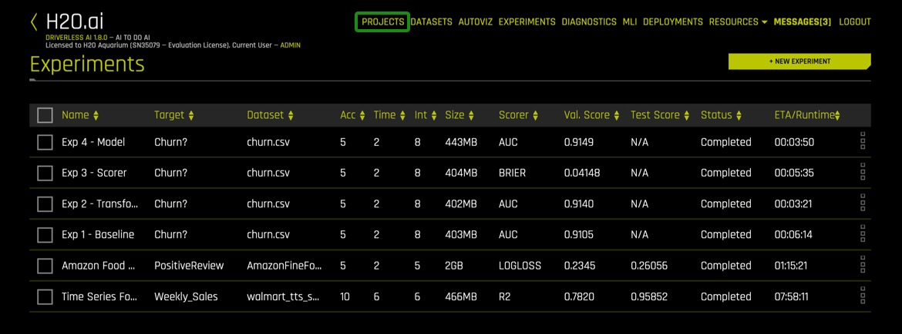

2\. Select **+New Project**

3\. Enter the following under:

**Name** 
~~~text
Customer Churn Recipe Comparison
~~~

**Description**
~~~text
Comparison of customer churn experiments using various recipes.
~~~

4\. Select **Create Project**

5\. Click on **+Link Experiment** 


6\. Select **Exp 1 - Baseline** by clicking on the Model 

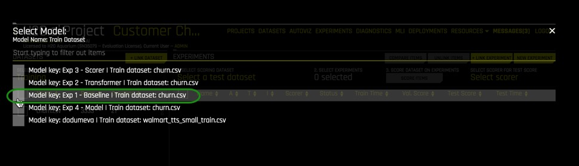

7\. Repeat step 6 for the remaining models (2,3, and 4), the **Project** page should look similar to the one below:

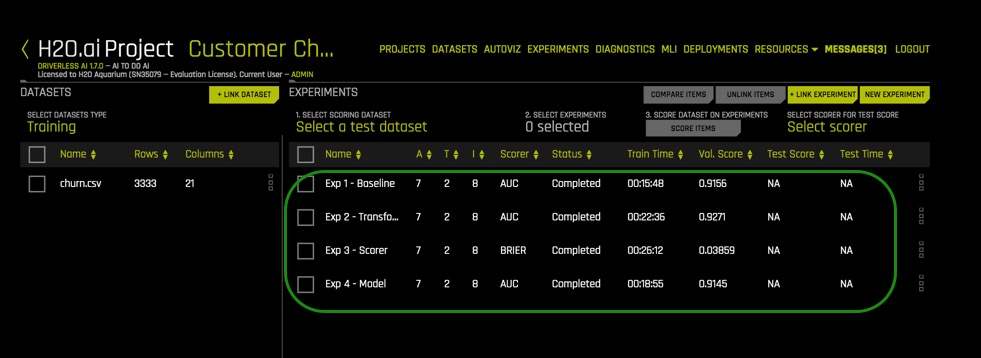

8\. Select Exp 1, 2 and 3 to compare by clicking on the select box to the left of each model then on **Compare 3 Items**:

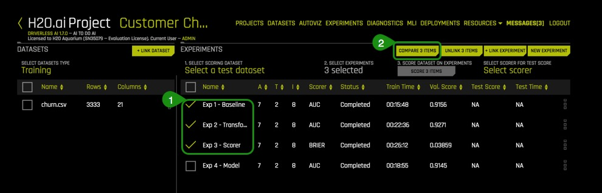

9\. A similar page will appear with the three model results:


ROC Curves for each model selected:

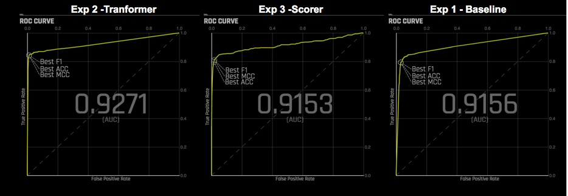

We can see that when we used the Transformer recipe, the model had better AUC with an accuracy of .9670 compared to Exp 1 - Baseline, which had an accuracy of .9424. Even with Exp 3 - Scorer, although the AUC did not significantly improve, there was an improvement in the accuracy with .9575. Also, when looking at the variables of importance, we see a slight variation on the variables that were selected to have the largest contribution to customers churning. In Exp 1 - Baseline the variable with most importance when it came to customers churning was "Day Charge." Exp 2, where we used the Transformer to sum columns with similar numerical data, we have the most important variable being the "sum of: Day Charge, Eve Charge, and Night Charge." 

### Deeper Dive and Resources

- [H2O’s Project Workspace](http://docs.h2o.ai/driverless-ai/latest-stable/docs/userguide/projects.html?highlight=project) 


## Task 7: Appendix A: How to Access DAI Custom Recipes

H2O custom recipes reside in the H2O Driverless AI Recipes GitHub repo. **There are multiple branches of DAI recipes so make sure that you are using the same branch as the DAI version you have.**

For this tutorial, we are using **DAI 1.7.0**, therefore, we will be working off the DAI 1.7.0 branch.

1\. Open the link below on a separate tab. Make sure the branch is **rel-1.7.0**

- [H2O Driverless AI Recipes GitHub Repo](https://github.com/h2oai/driverlessai-recipes/tree/rel-1.7.0)

The rel-1.7.0 branch will similar to the page below:

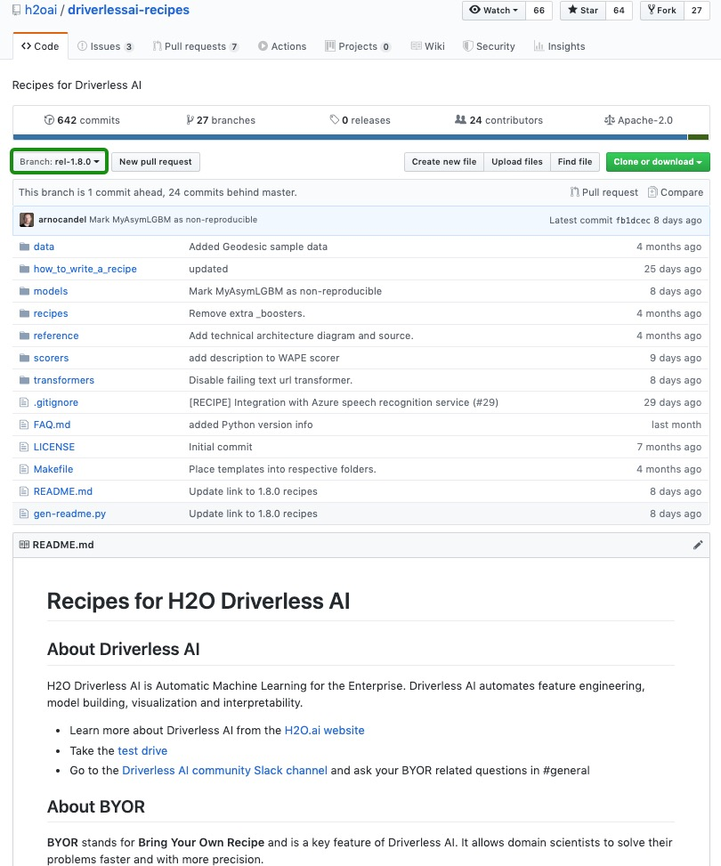

2\. Recipes can be uploaded to DAI by copying and pasting the raw URL as shown on this tutorial or you can also upload the .py file from your local machine. 

### Uploading Recipes via the Raw URL

We are going to get the raw URL for **Brier Loss** Scorer we used in Task 4 and upload it to DAI.

1\. Select the folder titled **scorer**

!dai-scorers-folder](assets/dai-scorers-folder.jpg)

2\. Select the folder titled **classification** then the folder titled **binary**

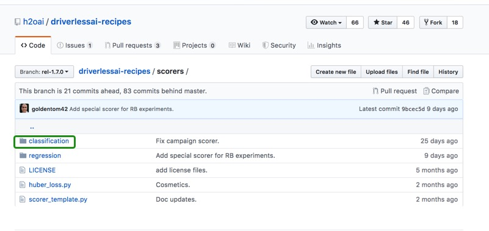

3\. Click on the **brier_loss.py** file


4\. Select **Raw**


5\. Copy the URL located at the top of the page

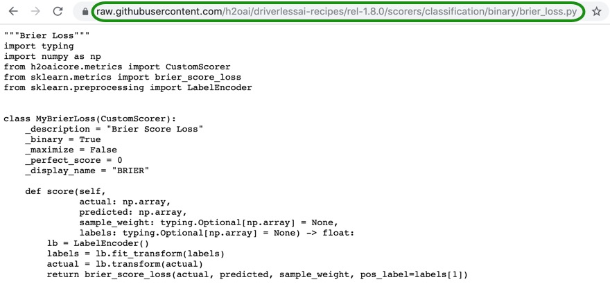

6\. The raw URL for this version of the recipe should be the one below. This URL is then pasted into DAI.

~~~html
https://raw.githubusercontent.com/h2oai/driverlessai-recipes/rel-1.7.0/scorers/classification/binary/brier_loss.py
~~~

7\. See task 4 of this tutorial to follow the process of uploading a recipe via the raw URL

### Uploading Recipes from Local Machine 

For this tutorial, we are using DAI 1.7.0, therefore, we will be working off the DAI 1.7.0 branch.

1\. Open the link below on a separate tab. Make sure the branch is **rel-1.7.0**

- [H2O Driverless AI Recipes GitHub Repo](https://github.com/h2oai/driverlessai-recipes/tree/rel-1.7.0)

2\. Make sure it is Branch rel-1-7-0, then click on **Clone or Download**, then on **Download ZIP**. This will download the entire rel1-7.0 repo to your desktop. If you prefer not to download the entire repo then use the URL method. 

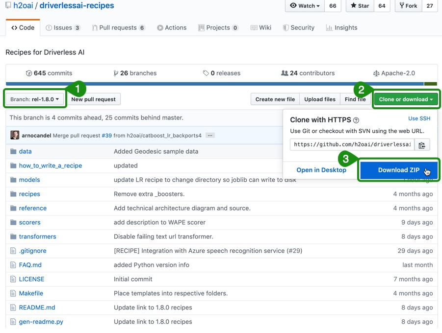

3\. Unzip the driverless-recipes-rel-1.7.0 file and save it on your local machine your directory of choice.

4\. On DAI, start an Experiment, then select Expert Settings. Now instead of selecting **+Load Custom Recipe From URL**, you will select **+Upload Custom Recipe**

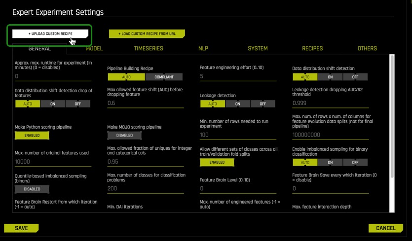

5\. After you click on **Upload Custom Recipe**, go to the directory where you saved the **driverlessai-recipes-rel-1-7-0** folder

6\. Select the **scorer** folder

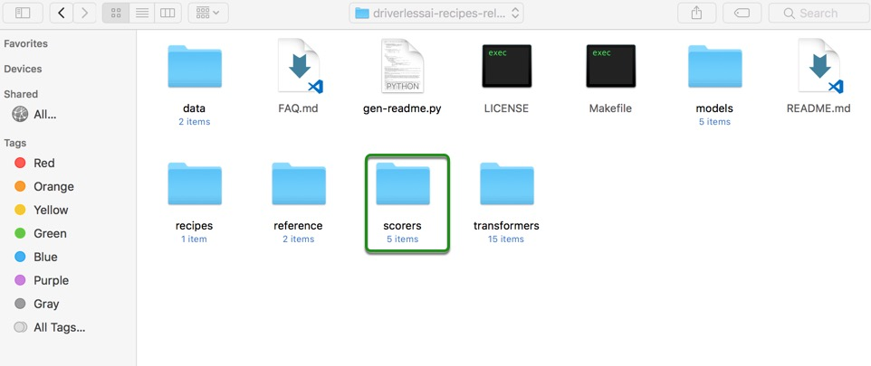

7\. Select the **classification** folder, then the **binary** folder 

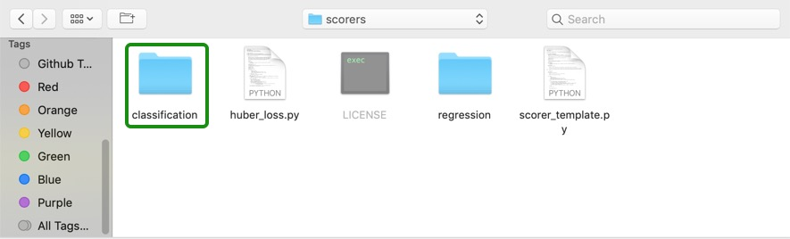

8\. After, select the **brier_loss.py** file and then **Open**

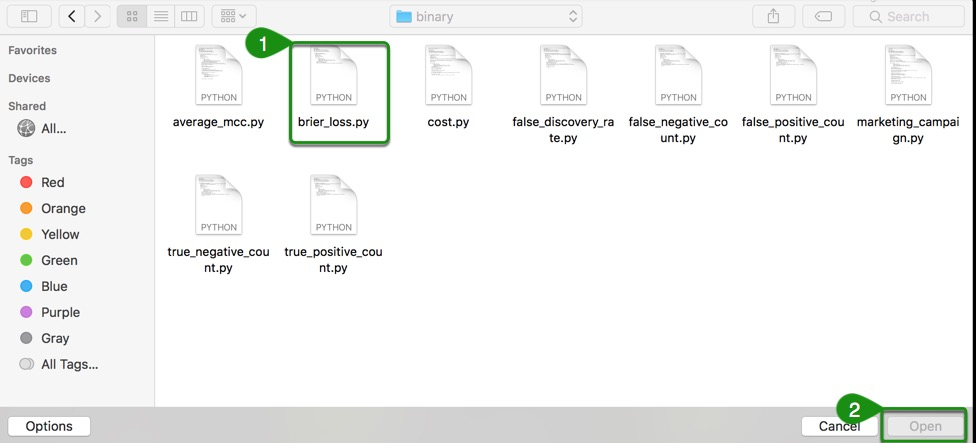

9\. After doing this last step then you can continue with the rest of the steps on task 4 of this tutorial

## Task 8: Next Steps

- Develop Your Own Custom Recipe Tutorial - Coming Soon!

- Webinar: [Extending the H2O Driverless AI Platform with Your Recipes by H2O's Arno Candel](https://www.brighttalk.com/webcast/16463/360533) 

- Blog: [Custom Machine Learning Recipes: The ingredients for success by H2O's Parul Pandey](https://www.h2o.ai/blog/custom-machine-learning-recipes-the-ingredients-for-success/)
