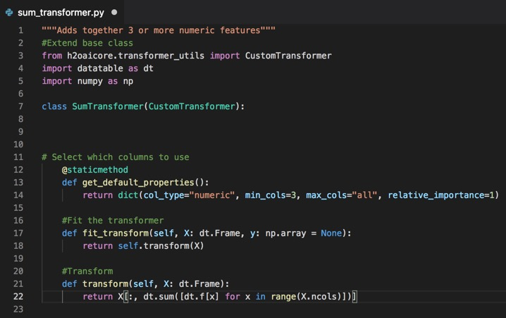

# DRAFT - Develop Your Own Custom Recipe 

## Outline

- [Objective](#objective)
- [Prerequisites](#prerequisites) 
- [Task 1: DAI Bring Your Own Recipes](#task-1-dai-bring-your-own-recipes)
- [Task 2: Build a Recipe: Transformer](#task-2-build-a-recipe-transformer)
- [Task 3: Build a Recipe: Scorer](#task-3-build-a-recipe-scorer)
- [Task 4: Build a Recipe: Model](#task-4-build-a-recipe-model)
- [Task 5: Troubleshooting](#task-5-troubleshooting)
- [Task 6: Challenge: Write Your Own Recipe](#task-6-challenge-write-your-own-recipe)
- [Task 7: Next Steps](#task-7-next-steps)

## Objective

In this tutorial we will take a deeper dive into the process of custom recipe building to enhance Driverless AI. We will build three recipes: a transformer, a model and a scorer using Visual Studio Code text editor. Each recipe will then be uploaded and  tested using Driverless AI.  

## Prerequisites
- Basic knowledge of Machine Learning and Statistics
- Ability to write Python Code
- A Driverless AI environment (release 1.7.0)
- Basic knowledge of Driverless AI or doing the Automatic Machine Learning Intro tutorial
- [Get Started and Consume Existing Recipes Tutorial](https://h2oai.github.io/tutorials/get-started-and-consume-existing-recipes/#0) 
 - [Cloned the Driverless AI 1.7.0 Recipe GitHub Repo](https://github.com/h2oai/driverlessai-recipes/tree/rel-1.7.0) 
- A text editor or developer environment to create .py  text files containing source code (Examples: PyCharm, Jupyter, Spider or a Text Editor like Atom or Visual Studio Code)

**Note**: For this tutorial we will use Visual Studio Code Community for MacOS
[Visual Studio Code Community](https://code.visualstudio.com/Download)

You can get more information about getting a Driverless AI environment or trial from the following:
- [A Two Hour Test Drive Session](https://github.com/h2oai/tutorials/blob/master/DriverlessAI/Test-Drive/test-drive.md)  
- [H2O Driverless AI License Key](https://github.com/h2oai/tutorials/blob/master/DriverlessAI/automatic-ml-intro-tutorial/automatic-ml-intro-tutorial.md#prerequisites) 
- [H2O Driverless AI Environment and Product Tour](https://github.com/h2oai/tutorials/blob/master/DriverlessAI/automatic-ml-intro-tutorial/automatic-ml-intro-tutorial.md#task-1-get-environment-and-product-tour) 

If you are not familiar with Driverless AI please review and do this tutorial:

- [Automatic Machine Learning Intro Tutorial](https://github.com/h2oai/tutorials/blob/master/DriverlessAI/automatic-ml-intro-tutorial/automatic-ml-intro-tutorial.md) 

## Task 1: DAI Bring Your Own Recipes

In the **Get Started and Consume Existing Recipes** Tutorial we covered the following:
Bring Your Own Recipe (BYOR) for DAI 1.7.0
What is a recipe
Types of DAI open source recipes available (Transformers, Scorers and Models)
How to upload the recipes into DAI as raw URL’s and .py files
Compared the final models of the experiments that were run with custom recipes to DAI’s default settings experiment. 

**Note:** If you have not done so, complete the [Get Started and Consume Existing Recipes Tutorial](https://h2oai.github.io/tutorials/get-started-and-consume-existing-recipes/#0), the material covered will be needed for the successful completion of this tutorial.

Just to recap, H2O Driverless AI is an artificial intelligence (AI) platform for automatic machine learning. Driverless AI automates some of the most difficult and tedious data science and machine learning tasks such as feature engineering, algorithm selection, model validation, model tuning, model selection, model explanation, model documentation and model deployment. It aims to achieve the highest predictive accuracy, comparable to expert data scientists, but in a much shorter time thanks to end-to-end automation.

Driverless AI 1.7.0 allows Domain Scientist to combine their subject matter expertise with the broadness of Driverless by giving Data Scientist the option to upload their own transformers, scorers, and custom datasets. Driverless AI’s Bring Your Own Recipe (BYOR) lets you apply your domain expertise and optimize your specific DAI model(s) with just a few clicks. Driverless AI treats customer recipes as first-class citizens in the automatic machine learning workflow. 

### DAI’s Automatic Machine Learning Workflow

Driverless AI’s Automatic Machine Learning workflow is represented on the image below:


The workflow is as follows, first we start with tabular data in the format of  X and Y, where X are the predictors and Y the value we want to predict. The data can be brought in from various connectors such as: 

- **HDFS**
- **SQL**
- **Snowflake**
- **Amazon S3**
- **GoogleBigQuery**
- **Google Cloud Storage**
- **Azure Blog Storage**
- **BlueData DataTap**
- **kdp+**
- **Minio**

See **Deeper Dive and Resources** at the of this task for more information about Enabling Data Connectors.

Once the data has been loaded to DAI, DAI performs Automatic Visualizations of the data and outputs the available graphs for the dataset that is being used. This allows you to have a better understanding of your data. 

The data is then sent through DAI’s Automatic Model Optimization. The Automatic Model Optimization is a generic algorithm that learns over time what is working and what is not to make the best model for your data. This includes model recipes, advanced feature engineering, algorithms(Xgboost,TensorFlow, LightGBM) and model tuning. 

After the model has been finalized, DAI then auto-generates model documentation that provides an explanation of everything that happened in the experiment and how the model generated makes decisions. Additionally, there is Machine Learning Interpretability of the models generated to explain modeling results in a human-readable format. Once experiments have been completed DAI automatically generates both Python and Java scoring pipelines so that the model is ready to go for production.

### BYOR

**Bring Your Own Recipe** (BYOR) is part of the Automatic Model Optimization process. It is here, that Data Scientist through their subject matter expertise and domain knowledge that they get to augment the Automatic Model Optimization by creating and uploading their own transformations, scorers and algorithms. DAI allows the uploaded scorer, algorithm and transformations to compete with the existing DAI recipes and allows the best recipe to be used.


### Recipes

Custom recipes are Python code snippets that can be uploaded into Driverless AI at runtime, like plugins. No need to restart Driverless AI. Custom recipes can be provided for transformers, models and scorers. During training of a supervised machine learning modeling pipeline (aka experiment), Driverless AI can then use these code snippets as building blocks, in combination with all built-in code pieces (or instead of). By providing your own custom recipes, you can gain control over the optimization choices that Driverless AI makes to best solve your machine learning problems.

### Python API 

Driverless AI custom recipes allow for full customization of the entire ML pipeline through the scikit learn Python API.The Python API allows for custom feature engineering, custom loss functions and custom ML Algorithms. These API is based off on how scikit learn works.

When building our custom recipes:

 For custom feature engineering or a transformer, you will have 2 main parts:
Fit_transform - takes the X and Y data and changes the X variables(pulls out the year from a date, does arithmetic in multiple columns, target encoding). It can also add new data such as the zip code with the zip code package and bring in population or cities.
Custom statistical Transformation
 Embeddings for numbers, categories, text, date/time, time-series, image audio, zip, latitude/longitude, ICD

Transform - the transform gets called when you run the model and get predictions. The transform will be inside the scoring pipeline. When used in production the transform will be present and be used in the validation and test sets. The transform does not have access to Y and it alters the data based on what happened on the fit_transform.

For custom optimization functions or scorers you can bring ing loss or gain functions. We can look further into precision and recall of a model through variations of the F metric. Driverless AI comes with F1 , F2 and F0.5 scorers, where F1 is the harmonic mean of precision and recall and F2 score gives more weight to recall than precision. If you wanted to give precision higher weight  you can incorporate and F4 or F6 function as recipes for scorers.   

Other things that can be done using scorers:
- f(id, actual, predicted, weight)
Ranking 
Pricing 
Yield Scoring
Cost/Reward
Any Business Metric


For custom ML Algorithms there are two functions that are needed:

```fit``` - fits the model, this function will give you access to the ML ecosystem: H2O-3 sklearn, Keras, PyTorch, CatBoost, etc. 

Predict - makes predictions

### Best Practices for Recipes

Recipes are meant to be built by people you trust and each recipe should be code-reviewed before going to production. If you decide to make your custom recipes you can keep them internal or shared them with the Driverless AI team by making a pull request to the Open Source Driverless AI Recipes GitHub Repo. This repo was built and maintained by  H2O Kaggle Grand Masters. All custom recipes will be put through various acceptance tests that include missing values, various examples for  binary and  regression to see if your recipe can handle all different types. 

**Take a few minutes to review the recommended best practices for building recipes in terms of:**

- [Security](https://github.com/h2oai/driverlessai-recipes?source=post_page---------------------------#security) 
- [Safety](https://github.com/h2oai/driverlessai-recipes?source=post_page---------------------------#safety) 
- [Performance](https://github.com/h2oai/driverlessai-recipes?source=post_page---------------------------#performance)

**The Writing Recipes Proces**

1. First write and test your idea on sample data before wrapping as a recipe
2. Download the Driverless AI Recipes Repository for easy access to examples
3. Use the Recipe Templates to ensure you have all the required components. 


In the next three tasks we will be building three simple recipes, a transformer, scorer, and a model. It is assumed that you have downloaded the [Driverless AI Recipes Repository rel 1.7.0](https://github.com/h2oai/driverlessai-recipes/tree/rel-1.7.0) and that you have access to the examples and recipe templates.

### Deeper Dive and Resources

- [H2O’s Enabling Data Connectors ](http://docs.h2o.ai/driverless-ai/latest-stable/docs/userguide/connectors.html?highlight=connectors) 
- [H2O’s The Driverless AI Scoring Pipelines](http://docs.h2o.ai/driverless-ai/latest-stable/docs/userguide/python-mojo-pipelines.html#scoring-pipeline) 

## Task 2: Build a Recipe: Transformer

A transformer (or feature) recipe is a collection of programmatic steps, the same steps that a data scientist would write as code to build a column transformation. The recipe makes it possible to engineer the transformer in training and in production. The transformer recipe, and recipes in general, provides a data scientist the power to enhance the strengths of DriverlessAI with custom recipes. These custom recipes would bring in nuanced knowledge about certain domains - i.e. financial crimes, cybersecurity, anomaly detection. etc. It also provides the ability to extend DriverlessAI to solve custom solutions for time-series[1].

### Where can Driverless AI transformers be used? 

- A retailer could forecast annual sales based on seasonality, weather and Ramadan holidays for its stores in Saudi Arabia. 

- A network analytics company can improve its anti-IP-spoofing functionality by parsing IP addresses and checking if any of the properties looks like a spam or a DoD attack.

- A financial services company could calculate the historical volatility of markets in a configurable rolling time-window on time-series financial data.

- Suppose you have a string column that has values like "A:B:10:5", "A:C:4:10", .... It might make sense to split these values by ":" and create four output columns, potentially all numeric, such as [0,1,10,5], [0,2,4,10], ... to encode the information more clearly for the algorithm to learn better from.
 
- PyTorch deep learning model for text similarity analysis, computes a similarity score for any given two text input columns.
 
- ARIMA model for time-series forecasting
 
- Data augmentation, such as replacing a zip code with demographic information, or replacing a date column with a National holiday flag.
 
**Driverless AI has recipes for the following categories:**

- Augmentation 
- DateTime
- Generic
- Geospatial
- Image
- NLP
- Numeric
- Outliers
- String
- TargetCoding
- TimeSeries

See the **Deeper Dive and Resources** at the end of this task to learn more about the Driverless AI Transformers GitHub Repo and more.

### Custom Transformer Recipe

The transformer that we will build is the **Summation of multiple Columns**. Driverless AI comes with mathematical interactions between two columns. Mathematical interactions such as addition, subtraction, multiplication and division. What if you wanted to do a mathematical interaction of 3 or more columns?

This transformer recipe will add 3 or more numeric columns and give the sum. For instance, it would take the values of X1, X2 and X3 add them and give the Sum which might be predictive in our model.

| ID | X1| X2| X3| SUM|
| --- | --- | --- | --- | --- |
| 1 | 10 | 4 | 3 | 18 |
| 2 | 1 | 2 | 3 | 6 |
| 3 | 0 | 9 | 0 | 9 |
| 4 | 1.3 | 7 | 2 |10.3 |

### Essentials to building a Transformer

These are the main steps in building our transformer:

1. Extending the Base Class
2. Decide which columns can be used
3. How to transform the training data
4. How to transform testing data
5. When to use the transformer

### Extending the Base Class

There are two types of Base Classes for a transformer the genetic custom transformer and the more specialized custom TimeSeries Transformer.

In the generic **CustomTransformer** function the base class is used for most data transformations including augmentation like special holidays. The **CustomTransformer** function is the transformer that will be used the majority of the time. 

The **CustomTimeSeriesTransformer** function extends the CustomTransformer and allows for updating of historical values. This function is very specific to Time Series such as Facebook Prophet or ARIMA.


For our custom Summation of Multiple Columns Transformer we will use the ```CustomTransformer``` along with the following three packages:
Numpy
Datatable
CustomTransformer Class - which is part of Driverless AI


The python code for **Extending the Base Class** is as follows:

~~~python
#Adds together 3 or more numeric features
#Extend base class				
from h2oaicore.transformer_utils import CustomTransformer 
import datatable as dt
import numpy as np

class SumTransformer(CustomTransformer):
~~~

1\. Open your text editor and create a new file
2\. Save  the new file as sum_transformer.py
3\. Copy and paste the code above into your .py file, your text editor should look similar to the page below:


**Note:** 
The name of the file and the extension .py ```sum_transformer.py```

### Select which Columns to Use 

Next, we will let Driverless AI know which columns can be used with this transformer. 

The python code for **Selecting which Columns to Use** is as follows:

~~~python

@staticmethod
def get_default_properties():
	return dict(col_type="numeric", min_cols=3
		, max_cols="all", relative_importance=1)

~~~


To do this we will use the ```get_default_properties``` method which returns a dictionary of column types allowed from where we will pick one type, ```numeric```.

The list below are the col_types that can be used:


After selecting the column type we will select the minimum and maximum number of columns. Since DAI comes with a transformer that is able to sum 2 columns, we will set the minimum number of columns to 3 and the maximum number of columns to all for our transformer. This means that when DAI runs our transformer it will always choose  between  3 and all columns. 

The relative importance will be set to 1 for the most part, however, if you want your custom transformer to have higher importance you can always increase the value of importance which will let DAI know that your custom transformer should have higher priority in the generic algorithm through ```relative_importance```.


4\. Copy and paste the code for **Selecting which Columns to Use** right  below the ```#Extend base class``` section of code of your .py file, your text editor should look similar to the page below:


### Transforming Training Data

Now we are going to fit the transformer. 

The python code for ```Fit the Transformer``` is as follows:

~~~python
def fit_transform(self, X: dt.Frame, y: np.array = None):
	return self.transform(X)					
~~~

For this particular case our fit transformer will bring a dataTable Data Frame of the x values to the predictors as well as give you the y value which if you were doing target encoding these y values would be of importance. You can return a datatable, a Pandas DataFrame or a Numpy Array, Driverless AI can automatically manage any of those. We recommend using datatable since it is really fast, however, if you feel more comfortable using Pandas, feel free to use Pandas and return there.

The ```return``` function tells us the following in Data Table syntax, for the range of columns that have been brought, add up the values of the numeric columns and return a single column with the sum of all the numeric columns that were given for every row.

**Note:** 
The ```fit_transform()``` method always comes before the ```transform()``` method is called. The output can be different based on whether the ```fit_transform()``` method is called on the entire frame or on a subset of rows. The oupt must be in the same order as the input data. 

5\. Copy and paste the code for ```Fit  the Transformer``` right  below the ```#Select which columns to use``` section of  code of your .py file, your text editor should look similar to the page below:


### Transforming Testing Data

The next lines of code that will be added are for  the ```transform``` method which will be used for the testing data. ```The transform()``` can be used for testing, validation or brand new data. 

The python code for ```Transform``` method is as follows:

~~~python										
def transform(self, X: dt.Frame):
	return X[:, dt.sum([dt.f[x] for x in range(X.ncols)])]
~~~

For this ```transform``` method we will bring a DataTable Data Frame of the x values to the predictors. You can return a DataTable, a Pandas DataFrame or a Numpy Array. 

Note: In a lot of cases the fit_transform and transform function will be doing the exact same thing, they will not be using the y-value. If the y is needed then the code for both functions might differ (ie. time series).

In this task, we are summing whether we are training or testing; therefore, the fit_transform function was explicitly rewritten to call the transform method. Doing this would allow us to change the transform method, without having to update it twice.

The``` return``` method here acts the same way with new predictive data where it will add every value in a row and give the sum.

You can return a datatable, a Pandas DataFrame or a Numpy Array, Driverless AI can automatically manage any of those. We recommend using datatable since it is really fast, however, if you feel more comfortable using Pandas, feel free to use Pandas and return there.

6\. Copy and paste the code for the```Transform``` method  right  below the ```#Fit the transformer``` section of  code of your .py file, your text editor should look similar to the page below:




### When to Use the Transformer

The last part of the code that will be added is the section that will determine when this transformer should be used. 

The python code for **when to use the transformer** is as follows:

~~~python
										
_regression = True
_binary = True
_multiclass = True
_numeric_output = True
_is_reproducible = True _included_model_classes = None # List[str]
 _excluded_model_classes = None # List[str]
					
~~~

When writing transformers we need to ask ourselves the following types of questions:

- What types of ML problems are allowed for my custom transformer? There will be situations where it will not be appropriate to use this transformer so we need to specify what types of ML problems are allowed for this transformer. For our Sum Transformer the ML cases below are always applicable therefore we set the following variable values to True. 
	- ```_regression = true```
	- ```_binary = true```
	- ```_multiclass = true```

- Does the transformer return a number? There are some models that can’t take strings as values for example GLM so we need to be explicit about whether or not the output will be numeric or not. In our case the output is always numeric therefore we set **Numeric Output** variable value to True.
	- ```_numeric_output = true```

- Is this function reproducible, DAI has the ability to recreate models which you can run on the same hardware and get the exact same features, scores etc. If the transformer is not reproducible then we need to let DAI know that the transformer is not reproducible so that users know not to expect that for this particular transformer is used in a model. In our case this transformer is a reproducible and we set the **is_reproducible** variable to true.
	- ```is_reproducible= true```

- Are there are models that need to be included or excluded? Maybe the transformer will not be able to work with TensorFlow or it only works with TensorFlow. If there are models that are to be included or excluded then we write the list as strings.
In our case there are no models that we need to exclude so we set value to None to the two variables below:
	- ```_included_model_classes = None```
	- ```_excluded _model_classes = None```

7\. Copy and paste the code for the **When to use the transformer** right  below the ```class SumTransformer(CustomTransformer):``` section of  code of your .py file, your text editor should look similar to the page below:


### Testing the new custom Transformer Recipe 

There are various ways to test the new custom transformer recipe:

Upload to Driverless AI to Automatically test on sample data
Use the DAI Python or R client to automate this process
Test locally using a dummy version of the Recipe Transformer class we will be extending

This tutorial will only focus on the first option of testing, to upload the custom recipe to Driverless AI  and Automatically test on sample data. If you have questions on how to do this visit the [“Get Started and Consume Existing Recipes Tutorial - Task 3: Recipe : Transformer”](https://h2oai.github.io/tutorials/get-started-and-consume-existing-recipes/#4).

We will be using the Iris Dataset to test our new transformer custom recipe.” The data set contains 3 classes of 50 instances each, where each class refers to a type of iris plant. One class is linearly separable from the other 2; the latter are NOT linearly separable from each other.”[2]


1\. On Driverless AI, add the following datasets by clicking on **+Add Dataset(or Drag and Drop)**, **File System**. Enter the following path ```/data/iris/```.

2\. Select the ```irist_train.csv```

3\. On the ***Dataset** page click on the ```iris_train.csv`` dataset and select **Predict**

4\. Click on NO to the message **First time using Driverless AI? Click Yes to get a Tour?**

5\. Select **Target Column** and click on **Species**

6\. Select **Expert Settings**

7\. Click on **+Upload Custom Recipe** and select your ```sum_transformer.py``` file

8\. The custom recipe should upload with no errors. If you get any errors go return to the top of this task and double check that all your code is correct and that the code has the correct indentations. 

9\. Once the recipe has loaded correctly, you see as part of the experiments page under  **What do these settings mean?** > **Feature Engineering search Space**.

10\. Launch Experiment 

### References

- [1] [How to write a Transformer Recipe for Driverless AI by Ashrith Barthur](https://github.com/h2oai/driverlessai-recipes/blob/master/how_to_write_a_recipe/how_to_write_a_recipe.md) 
- [2] [Iris Data Set](https://archive.ics.uci.edu/ml/datasets/iris)

### Deeper Dive and Resources

- [Driverless AI Transformers Repo](https://github.com/h2oai/driverlessai-recipes/tree/rel-1.7.0/transformers) 

- [BYOR Transformer Template](https://github.com/h2oai/driverlessai-recipes/blob/master/transformers/transformer_template.py) 
- [How to Debug a Transformer](https://github.com/h2oai/driverlessai-recipes/blob/master/transformers/how_to_debug_transformer.py)

- [How to Test a Transformer from the PyClient](https://github.com/h2oai/driverlessai-recipes/blob/master/transformers/how_to_test_from_py_client.py) 


## Task 3: Build a Recipe: Scorer

A scorer recipe is a recipe that helps evaluate the performance of your model. There are many methods of evaluating performance and Driverless AI has many scorers available by default however, if you want to test a different scorer for your particular model then **BYOR** is an excellent way of testing a particular scorer and then compare the model results through Driverless AI’s [**Project Workspace**](http://docs.h2o.ai/driverless-ai/latest-stable/docs/userguide/projects.html?highlight=projects) feature.

**Note**: Driverless AI will compare the scorer you uploaded with the existing scorers and will select the best scorer fit for your dataset. If your scorer was not selected default scorer by Driverless AI in your experiment and you still would like to see how your dataset would perform with your scorer recipe you can manually select your scorer in the **Experiments Page** under **Scorers**.

Where can scorers be used? 

- **An oil and gas company** could predict oil-well output by developing a time-series regression model and use the Mean Absolute Scaled Error recipe to measure the accuracy of the forecasted output.

- **A transportation and logistics company** could use the precision-recall classification recipe to accurately predict the on-time delivery of perishable products by tweaking the threshold depending upon weather conditions.

- **A marketing and lead-gen company** could improve the effectiveness of its products by accurately predicting its ROI for its customers, using the marketing campaign scorer recipe.

- Maybe you want to optimize your predictions for the top decile for a regression problem..
 
- Maybe you care about the false discovery rate for a binary classification problem.

Driverless AI has Scorer recipes for the following categories:
- Classification
- Regression 


### Deeper Dive and Resources

- [Driverless AI Scorers Repo](https://github.com/h2oai/driverlessai-recipes/tree/master/scorers)  
- [BYOR Scorer Template](https://github.com/h2oai/driverlessai-recipes/tree/master/scorers) 
- [Driverless AI Project Workspace](http://docs.h2o.ai/driverless-ai/latest-stable/docs/userguide/projects.html?highlight=projects)


## Task 4: Build a Recipe: Model 

A model recipe is a recipe for a machine learning technique that can be used to build prediction models. Driverless AI has an extensive list of models by default, however, a new model can be loaded and be used to compare the Driverless AI models. Current Driverless models can be enhanced or slightly modified. Just like with the scorers recipes, you can compare the results of the model recipe you created with the model that  Driverless AI selected for your dataset through  Driverless AI’s [**Project Workspace**](http://docs.h2o.ai/driverless-ai/latest-stable/docs/userguide/projects.html?highlight=projects) feature.

**Note**: Driverless AI will compare the model you uploaded with the existing models and will select the best model fit for your dataset. If the model was not selected as the top model by Driverless AI and you still would like to see how your dataset would perform with your model recipe you can turn off all default models in Driverless AI and only select your model. 


Where can models be used? 

- **An insurance provider** could recommend the right insurance product to its customers by building a gradient boost model based on the CatBoost algorithm recipe.

- **A media television company** could use the historic mean time-series recipe to smooth out the distribution graph of the # of viewers throughout a busy sports tournament by breaking the entire season in discrete time windows.

- **A sports and entertainment event broadcast company** could do NLP for specific Twitter handles and hashtags, and classify sentiments of every event using the Intel DAAL models, enabling them to be smart about targeting demographics.

- All H2O-3 Algorithms including H2O AutoML
 
- Yandex CatBoost gradient boosting
 
- A custom loss function for LightGBM or XGBoost


Driverless AI has Model recipes for the following categories:

- Algorithms
- Custom Loss
- NLP
- Time Series

### Deeper Dive and Resources

- [Driverless AI Models Repo](https://github.com/h2oai/driverlessai-recipes/tree/master/models) 

- [BYOR Model Template](https://github.com/h2oai/driverlessai-recipes/blob/master/models/model_template.py)  

## Task 5: Troubleshooting

When uploading a new recipe to Driverless AI, there are multiple things that can happen:

- The recipe did not make the cut (recipe was not loaded into Driverless AI )
- The recipe made the cut but Driverless did not end up using it for the experiment

###  Recipe Did Not Make the Cut 

One of the biggest advantages when loading a recipe to Driverless AI is that Driverless AI will subject your recipe to its acceptance tests. If your recipe did not pass the acceptance Driverless AI will  let you know right away if your recipe made the cut. If your recipe did not make the cut you then you will receive feedback from Driverless AI on how to improve it. 

Other tips:

- Read the entire error message, it most likely contains the stack trace and helpful information on how to fix the problem.
- If you can't figure out how to fix the recipe, we suggest you post your questions in the [Driverless AI community Slack channel](https://www.h2o.ai/community/driverless-ai-community/#chat) 
- You can also send us your experiment logs zip file, which will contain the recipe source files.

How can I debug my recipe?

- The easiest way (for now) is to keep uploading it to the expert settings in Driverless AI until the recipe is accepted.
- Another way is to do minimal changes as shown in [this debugging example](https://github.com/h2oai/driverlessai-recipes/blob/rel-1.7.0/transformers/how_to_debug_transformer.py) and use PyCharm or a similar Python debugger.


### Recipe Made the Cut but Driverless and was not Used in the Experiment

You were able to successfully load your recipe to Driverless AI however your recipe was not used by Driverless AI, now what? Driverless AI takes best fit recipes for your dataset so if you don’t see your recipe being used you can manually select your recipe when setting up your Experiment. 

Other tips:

- Don't give up. You learned something.
- Check the logs for failures if unsure whether the recipe worked at all or not.
Driverless AI will ignore recipe failures unless this robustness feature is specifically disabled. Under Expert Settings, disable skip_transformer_failures and skip_model_failures if you want to fail the experiment on any unexpected errors due to custom recipes.
- Inside the experiment logs zip file, there's a folder called details and if it contains .stack files with stacktraces referring to your custom code, then you know it bombed.

### The transformer recipe didn’t lead to the highest variable importance for the experiment

That's nothing to worry about. It's unlikely that your features have the strongest signal of all features. Even 'magic' Kaggle grandmaster features don't usually make a massive difference, but they still beat most of the competition.


### Deeper Dive and Resources

- [How do I collect DAI logs?](https://support.h2o.ai/support/solutions/articles/17000090847-how-do-i-collect-logs-)  
- [Driverless AI community Slack channel](https://www.h2o.ai/community/driverless-ai-community/#chat) 
- [ Driverless AI Recipe Debugging Example](https://github.com/h2oai/driverlessai-recipes/blob/rel-1.7.0/transformers/how_to_debug_transformer.py) 
 

## Task 6: Challenge: Write Your Own Recipe

Try to build your own recipe. Driverless AI has many dataset that you can use to test you new custom recipe. 

## Task 7: Next Steps

- Webinar : [How to Make a Recipe with H2O Driverless AI](https://www.h2o.ai/webinars/?commid=364997&utm_campaign=communication_reminder_starting_now_registrants&utm_medium=email&utm_source=brighttalk-transact&utm_content=button) 
