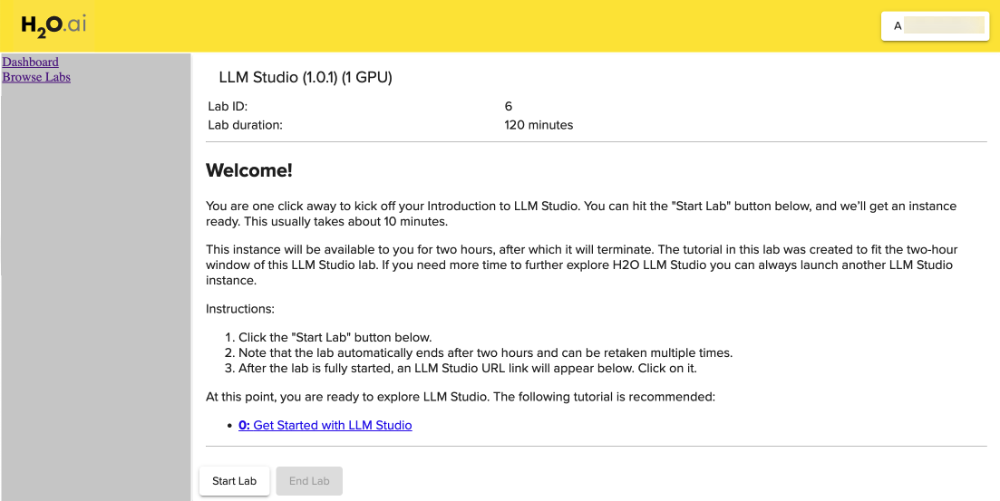

# Get Started with Aquarium

## Outline

- [H2O Aquarium](#h2o-aquarium)
- [How to Get to the Aquarium Site ](#how-to-get-to-the-aquarium-site)
- [How to Create an Aquarium Account](#how-to-create-an-aquarium-account)
- [How to Login](#how-to-login)
- [Reset Password ](#reset-password)
- [How to Start and End an Aquarium Lab Session](#how-to-start-and-end-an-aquarium-lab-session)
- [Logout](#logout)
- [Questions](#questions)

## H2O Aquarium

**Aquarium** is the H2O.ai cloud environment providing software access for workshops, conferences, and training.

If you are new to  Aquarium, we highly recommend finishing this tutorial to set up your **Aquarium account**

**All Aquarium Lab sessions will terminate after two-hours. No work will be saved!**. However, you can retake the lab multiple times.

**Note**: **Aquarium labs have a license key built-in, so you don't need to request one to use it**.


## How to get to the Aquarium Site

1\. Go to the Aquarium site by pasting the URL below to your chosen browser or click on [Aquarium](http://aquarium.h2o.ai/login).

```http://aquarium.h2o.ai/login```

2\. The URL will take you to the Aquarium login page, where you need to create an account.

## How to Create an Aquarium Account

1\. Welcome to the Aquarium Login page!


2\. Select **Create a new account**


3\. Enter:

 - First Name
 - Last Name
 - Organization
 - Country
 - Email

4\. Through the reCAPTCHA test, verify that you are not a robot by checking the "I'm not a robot" box.

**Note**: A password will be sent to your email within minutes.

5\. Click on **Create account and email temporary password** at the bottom of the page.

**If you are having issues receiving a temporary password, try the following:**

- Force-reload on the Aquarium page

- Try a different browser

- Check corporate settings in your machine

If the three steps above don’t work, please send us an email at support@h2o.ai and include the email you used to create the Aquarium account, type of browser you are using, country, and if you can see the reCAPTCHA test on the Aquarium Login page. 


6\. Check your email for the password.

## How to Login

1\. Enter the email you used to create the Aquarium password.

2\. Enter the password you received over email from Aquarium.

3\. Verify that you are not a robot by checking the "I'm not a robot" box.

4\. Click on **Login**.
 
Note: If you are having issues logging in, click the **send us an email** hyperlink.


## Reset Password 

1\. If you forgot your password, select **I forgot my password**.


2\. Enter your email, verify that you are not a robot by checking the "I'm not a robot" box, then click on **Email temporary password**. Another password will be emailed to you.


## How to Start and End an Aquarium Lab Session

After a successful login, select "Browse Labs" located on the top-left corner of the page, then select Lab 6 - LLM Studio (1.0.1)(1GPU).


After H2O LLM Studio Lab will appear:




**Note**: 
1. Lab duration is 120 minutes; after that, the session will terminate

2. Note that the lab automatically ends after two hours and can be taken multiple times

3. **Start** button starts the lab session

1\. To start a Lab, click on **Start Lab**. You will see an image similar to the one below:


2\. Aquarium will then start the Lab session for you (this will take a few minutes). After the lab session starts, a similar image should appear:


**Note**:

 - The time remaining for the instance
 - LLM Studio URL
 - End Lab 

3\. Once the Lab has started, an LLM Studio URL will appear at the bottom of the page. Click on that URL; this will take you to the H2O.ai Driverless AI Datasets Page.


## Logout

1\. To logout, click on the box on the top-right corner of the page and select logout.


## Questions

Have any questions about Aquarium? Sign up for H2O.ai's Slack Community and post your questions under the **#cloud** channel. Members of the H2O.ai community will respond as soon as they are available.

- [Chat and ask questions with H2O.ai makers and data scientist users in the H2O.ai Slack workspace](https://www.h2o.ai/h2ousers/)


