# Get Started with LLM Studio

## Outline

- [Objective](#objective)
- [Prerequisites](#prerequisites)
- [Task 1: Load and Configure Dataset](#task-1-load-and-configure-dataset)
- [Task 2: Setup LLM Finetuning Experiment ](#task-2-setup-llm-finetuning-experiment)
- [Task 3: Explore Finished Experiment](#task-3-explore-finished-experiment)
- [Task 4: Download LLM Model](#task-4-download-llm-model)
- 

## Objective

For this tutorial, we will walk through how to get started with [H2O LLM Studio](https:https://h2o.ai/platform/ai-cloud/make/llm-studio/) using historical LinkedIn posts from influencers on the platform. 

In this overview of LLM Studio, you will become familiar with the concepts and configurations in LLM Studio using a small data set and model as a motivation example. 

You will learn how to set up import data, configure the prompt column, answer column, view the dataset, create an experiment, and fine-tune a large language model. 

## Prerequisites

- Basic knowledge of Machine Learning 

- An **LLM Studio Lab in Aquarium**. LLM Studio in the Cloud. No need to download software. Explore all the features and benefits of LLM Studio. 

    - Need an **LLM Studio Lab** session? Follow the instructions [on this quick tutorial](https://github.com/h2oai/tutorials/tree/master/H2O%20LLM%20Studio/get-started-with-aquarium) to get an LLM Studio Lab session started. After the LLM Studio session starts, continue reading the remaining prerequisites of this tutorial, then start Task 1.

  - Already have an **LLM Studio Lab** session? Continue reading the remaining prerequisites of this tutorial, then start Task 1.

**Note:  Aquarium’s LLM Studio lab has a license key built-in, so you don’t need to request one to use it. Each LLM Studio instance will be available to you for two hours, after which it will terminate. No work will be saved. If you need more time to explore LLM Studio further, you can always launch another LLM Studio instance or reach out to our sales team via the [contact us form](https://h2o.ai/platform/ai-cloud/make/llm-studio/).**


## Task 1: Load and Configure Dataset

Welcome to the LLM Studio **Home** page! This aquarium lab leverages an instance in AWS with a Tesla T4 and 15GB of RAM. In reality, this is an extremely low amount of computing resources to undertake fine-tuning of large language models. The idea is to become familiar with the concepts and configurations using a small toy data set and model as a motivational example. Let’s begin.

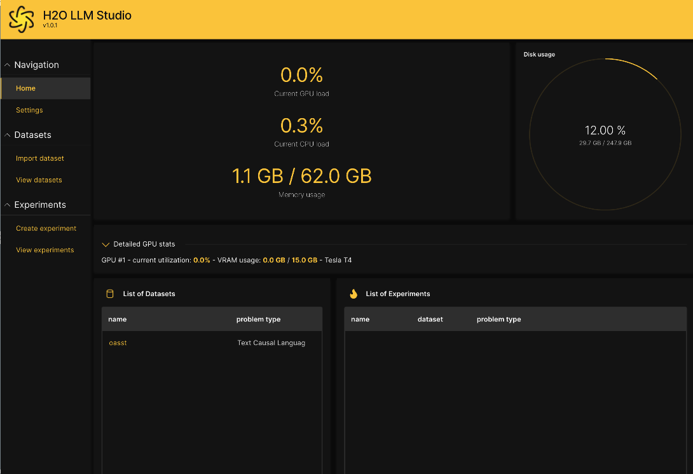

### About the Dataset

The dataset we will use for this lab is historical LinkedIn posts from influencers on the platform. Click on the import data set to begin importing the data.

### What is the LLM Studio Workflow?

The typical LLM Studio workflow is to:

1. Import the dataset
2. View the dataset
3. Create an experiment
4. View the Experiment
5. Tune the Experiment
6. Deploy the Finetuned Model  (Optional)

### Import the Data 

We will import the influencer data directly from a public bucket on AWS S3. 
 
Start by selecting **Import Datasets**


1. Click on **Browse**
2. Select **S3**

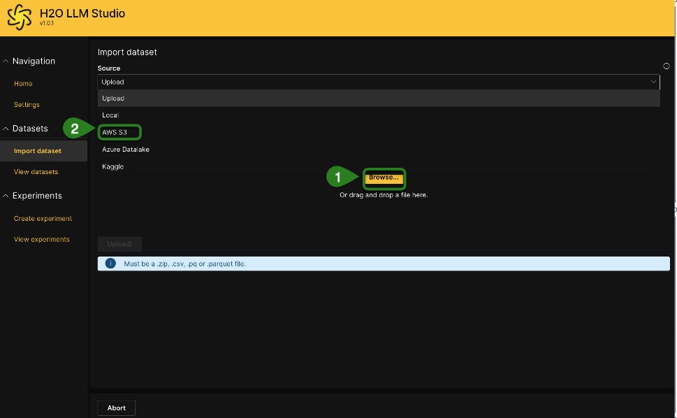


3. Under the **S3 bucket name** field: Replace ```bucket_name``` with the following bucket information:  

```s3://h2o-world-genai-training/influencer-data/```

4. Copy and paste the following file name under the **File name** field

```influencers_data_prepared.csv```

Note: For this lab, we will ignore **AWS access key** and **AWS secret key**

5. Select **Continue** 

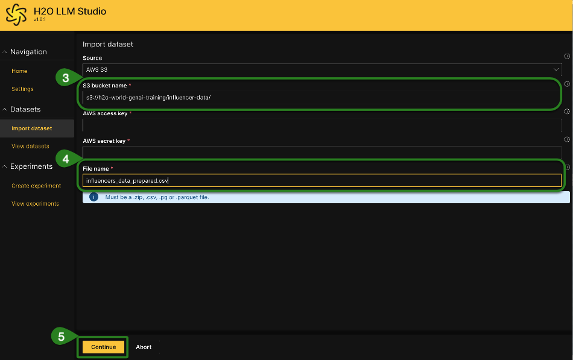

### Configuring the Dataset

In this section, we will update two sections, the **Prompt Column** and **Answer Column**.

Under **Prompt Column**:

6. Select ```title```


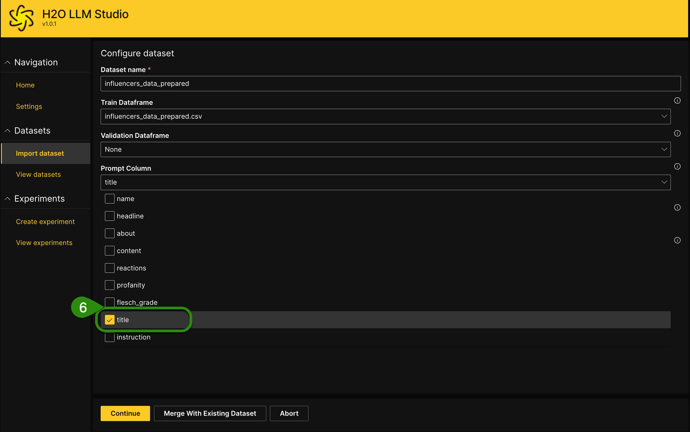

Under **Answer Column**:

7. Select ```content```
8. Click **Continue** 

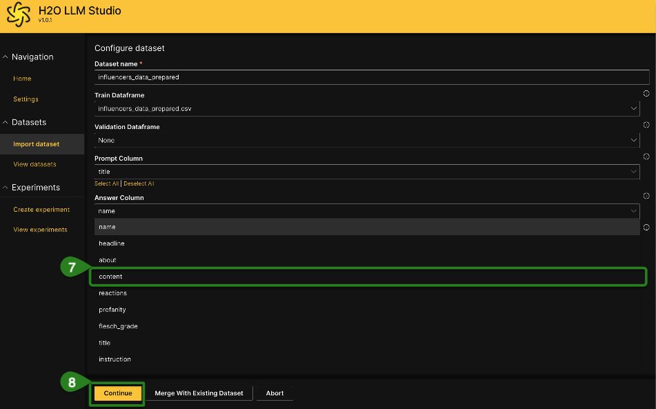

If the import was successful, you should see some example data points to visualize and sanity check.

9. Select **Continue**

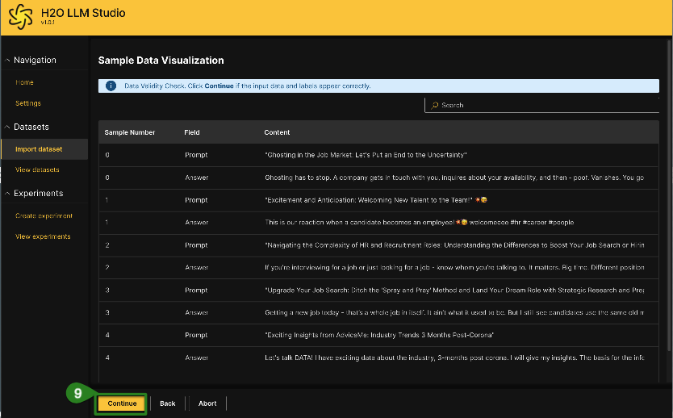


### View the Dataset

Once imported, the data set will appear in the **View datasets** tab.

10. Select **View datasets**
11. Click on the name of the data set ```influencers_data_prepared```

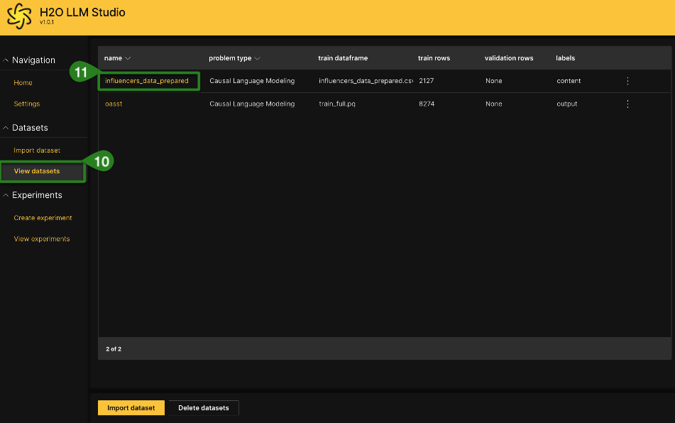

12. Review the data set

13. Click on **Create experiment** at the bottom of the screen to begin fine-tuning a large language model on this dataset

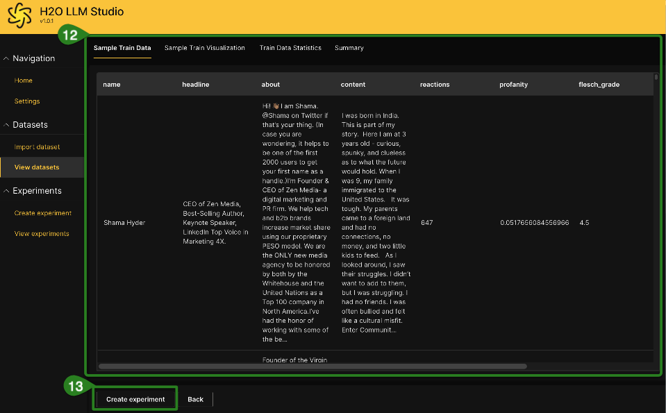

## Task 2: Setup LLM Finetuning Experiment

On the experiment page, various experiment settings are available. For now, we will simply adjust the LLM backbone.

For this lab, we will use the smallest available model, ```facebook/opt-125m```, as this will enable the experiment to finish the quickest.

Under the **Experiments** Section: 

1. Go to **LLM Backbone**
2. Click on the dropdown 
3. Select ```facebook/opt-125m```
4. Click on **Run experiment** 

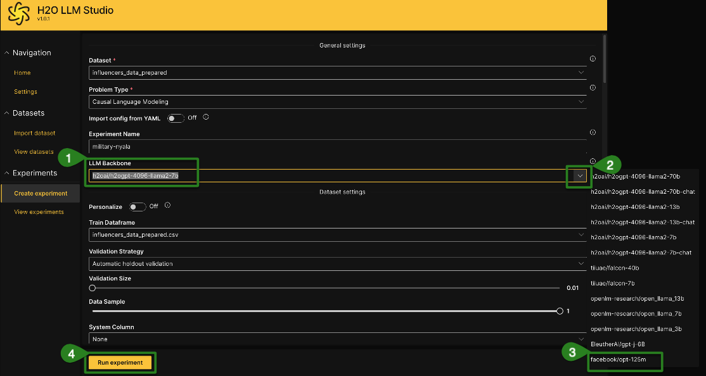

Once launched, the experiment will run until completion, routinely updating an estimated time to completion. You should see an image similar to the one below:

Note: This will take less than 5 minutes. You can click on **Refresh** to get a progress update 

5. Click on **Refresh** to get the progress of the experiment 

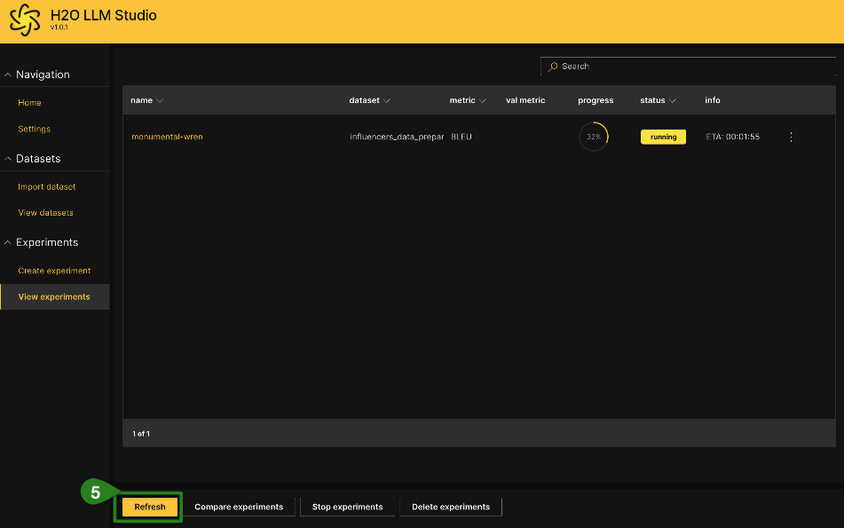

Once the experiment is complete, the status will turn green and change to “finished”.

## Task 3: Explore Finished Experiment  
 
Now, we will explore the results of the finished experiment.

**Under View experiments**:
Note: Make sure the experiment has the ```finished``` status in green 

1. Click on the experiment **name** to see the results 

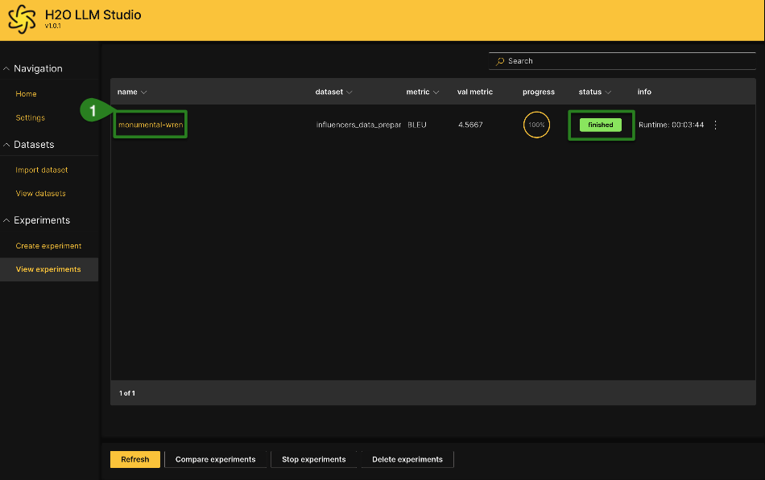

You should see something similar to the image below:

a\. Depicts how the learning rate changed over the duration of the training steps

b\. Showshows train batch loss

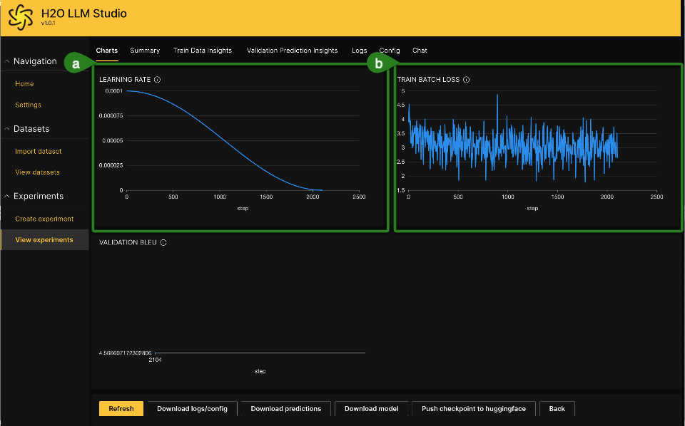

2. To get some additional information: Under **LEARNING RATE**, hover over the ```i``` 

3. To get some additional information: Under **TRAINING BATCH LOSS**, hover over the ```i``` 

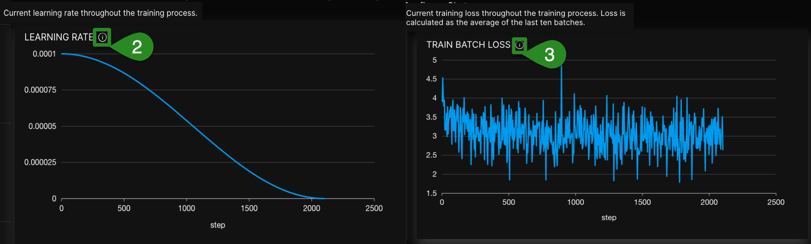

Review the predictions from the model and compare them to the target text in the data set.

4. Click on **Validation Prediction Insights** 

**Note** that next to these results is the available evaluation metric. The default is BLEU score. 

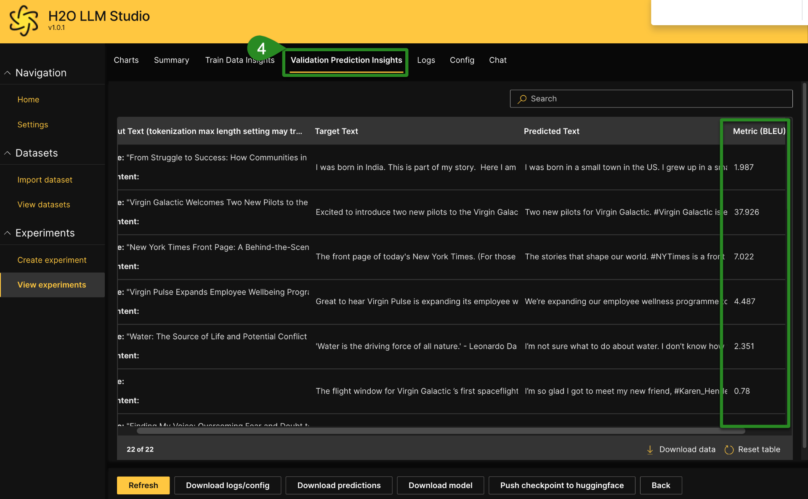


### Begin Chatting with your Fine-tuned Model

Take a few minutes to chat with your fine-tuned model directly in the experiment interface. Various settings are available to generate responses, such as Max Length Inference, Temperature, Sampling and more.

**Under View experiments**:

5. Click on **Chat**
6. Type your message and then click enter


## Task 4: Download LLM Model

You can download the fine-tuned model weights by clicking ```Download model```, as well as optionally push to [Hugging Face](https://huggingface.co/login) for other deployment patterns. 

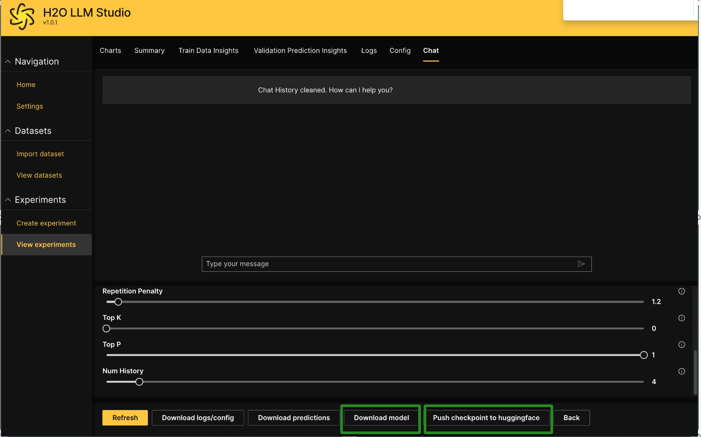

For pushing the LLM Model into Hugging Face:

1. Click on ```Push checkpoint to huggingface```
2. Enter your account name
3. API Key
4. Select **Export**

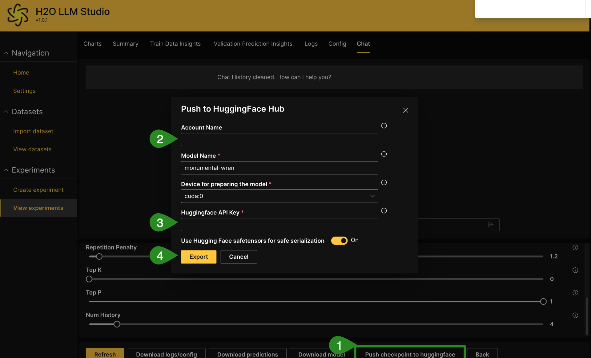


If you choose to download the Model, H2O LLM Studio will automatically create model documentation (e.g., model card) that describes how to use this model further. 


