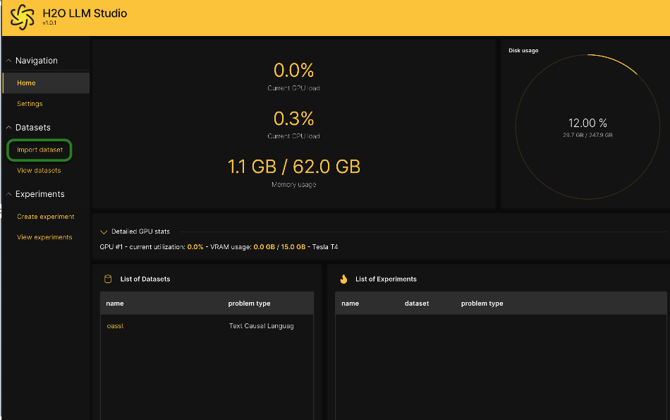

# Automatic Machine Learning Introduction with LLM Studio

## Outline

- [Objective](#objective)
- [Prerequisites](#prerequisites)
- [Task 1: Product Tour](#task-1-product-tour)
- [Task 2: Automatic Machine Learning Concepts](#task-2-automatic-machine-learning-concepts)
- [Task 3: Load Data](#task-3-load-data)
- [Task 4: Explore Data Details and AutoViz](#task-4-explore-data-details-and-autoviz)
- 

## Objective

For this tutorial, we will walk through how to get started with [H2O LLM Studio](https:https://h2o.ai/platform/ai-cloud/make/llm-studio/) using historical Linkedn posts from influencers on the platform. 

In this overview of LLM Studio, you will become familiar with the concepts and configurations in LLM Studio using a small data set and model as a motivation example. 

You will learn how to set up import data, configure the prompt column, answer column, view dataset, create an experiment and fine tune a large language model. 

## Prerequisites

- Basic knowledge of Machine Learning 

- An **LLM Studio Lab in Aquarium**. LLM Studio in the Cloud. No need to download software. Explore all the features and benefits of LLM Studio. 

    - Need an **LLM Studio Lab** session? Follow the instructions [on this quick tutorial](https://github.com/h2oai/tutorials/tree/master/H2O%20LLM%20Studio/get-started-with-aquarium) to get an LLM Studio Lab session started. After the LLM Studio session starts, continue reading the remaining prerequisites of this tutorial, then start Task 1.

  - Already have an **LLM Studio Lab** session? Continue reading the remaining prerequisites of this tutorial, then start Task 1.

**Note:  Aquarium’s LLM Studio lab has a license key built-in, so you don’t need to request one to use it. Each LLM Studio instance will be available to you for two hours, after which it will terminate. No work will be saved. If you need more time to further explore LLM Studio, you can always launch another LLM Studio instance or reach out to our sales team via the [contact us form](https://h2o.ai/platform/ai-cloud/make/llm-studio/).**


## Task 1: Load and Configure Dataset

Welcome to the LLM Studio **Home** page! This aquarium lab leverages an instance in AWS with a Tesla T4 and 15GB of RAM. In reality, this is an extremely low amount of computing resources to undertake fine tuning of large language models. The idea is to become familiar with the concepts and configurations using a small toy data set and model as a motivational example. Let’s begin.


### About the Dataset

The dataset we will use for this lab is historical LinkedIn posts from influencers on the platform. Click on the import data set to begin importing the data.

### What is the LLM Studio Workflow?

The typical LLM Studio workflow is to:

1. Import the dataset
2. View the dataset
3. Create an experiment
4. View the Experiment
5. Tune the Experiment
6. Deploy the Finetuned Model  (Optional)

### Import the Data 

We will import the influencer data directly from a public bucket on AWS S3. 
 
Start by selecting **Import Datasets**



1. Click on **Browse**
2. Select **S3**


3. Under the **S3 bucket name** field: Replace ```bucket_name``` with the following bucket information:  

```s3://h2o-world-genai-training/influencer-data/```

4. Copy and paste the following file name under the **File name** field

```influencers_data_prepared.csv```

Note: For this lab we will ignore **AWS acess key** and **AWS secret key**

5. Select **Continue** 


### Configuring the Dataset

In this section we will update two sections, the **Prompt Column** and **Answer Column**.

Under **Prompt Column**:

6. Select ```title```


Under **Answer Column**:

7. Select ```content```
8. Click **Continue** 


If the import was successful, you should see some example data points to visualize and sanity check.

9. Select **Continue**


### View the Dataset

Once imported, the data set will show up it the **View datasets** tab.

10. Select **View datasets**
11. Click on the name of the data set ```influencers_data_prepared```


12. Review the data set

13. Click on **Create experiment** at the bottom of the screen to begin fine tuning a large language model on this dataset


## Task 2: Setup LLM Finetuning Experiment

On the experiment page, various experiment settings are available. For now, we will simply adjust the LLM backbone.

For this lab, we will use the smallest available model, ```facebook/opt-125m```, as this will enable the experiment to finish quickest.

Under the **Experiments** Section: 

1. Go to **LLM Backbone**
2. Click on the dropdwn 
3. Select ```facebook/opt-125m```
4. Click on **Run experiment** 


Once launched, the experiment will run until completion, routinely updating an estimated time to completion. You should see an image similar to the one below:

Note: This will take less than 5 minutes. You can click on **Refresh** to get a progress udpate 


Once the experiment is complete the status will turn green and change to “finished”.

5. Click on **Refresh** to get the progress of the experiment 


## Task 3: Epxlore Finished Experiment  
 
Now we will explore the results of the finished experiment.

**Under View experiments**:

1. Click on the experiment **name** to see the results 