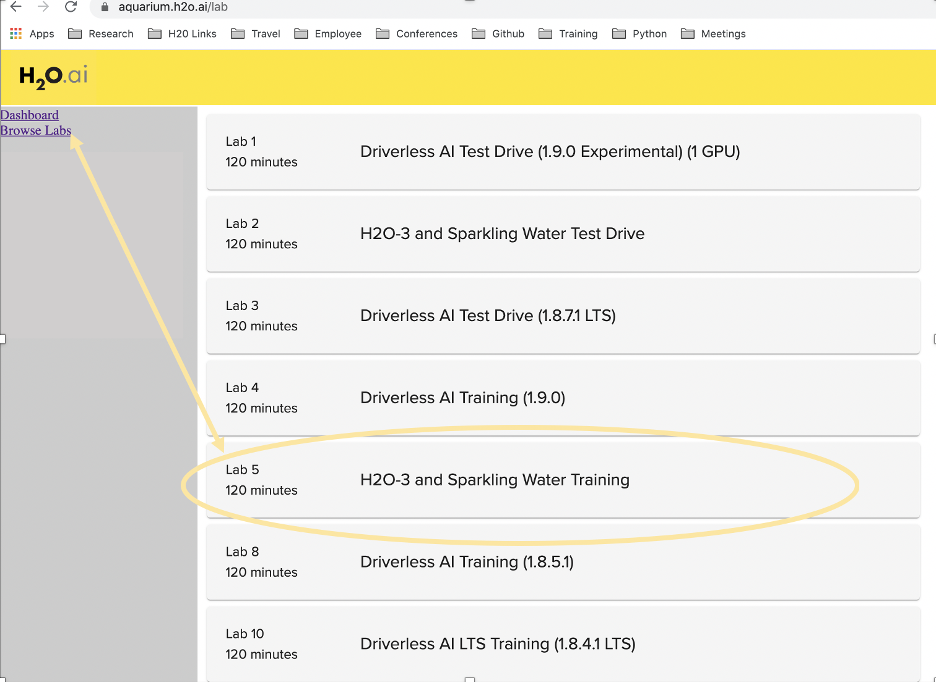
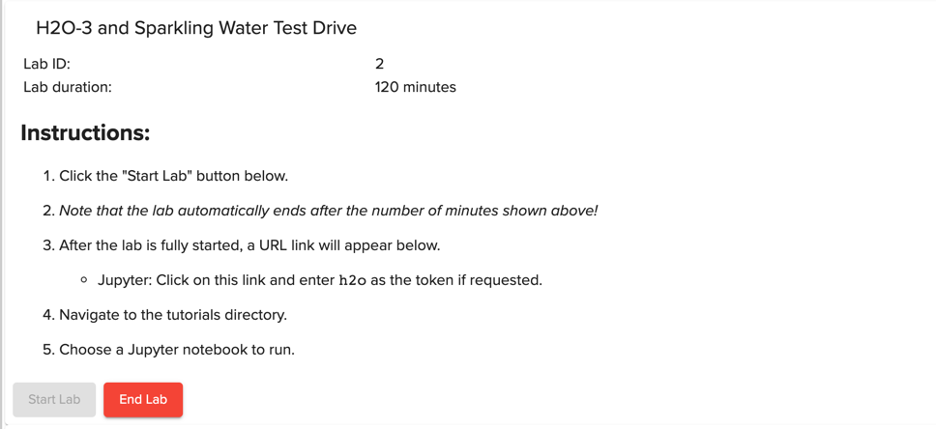

# ML Foundations: Module 2 Session 2: Getting Started With Feature Engineering Hands-On Assignment in H2O-3 (Part 1)

## Objective

This is Part 1 of a 2-part exercise examining feature engineering using two different [H2O.ai's](https://www.h2o.ai/) products: the open source machine learning platform, [H2O-3](https://www.h2o.ai/products/h2o/) and the Enterprise automated machine learning platform, [Driverless AI](https://www.h2o.ai/products/h2o-driverless-ai/).

## Part 1 Target Encoding in H2O-3

For Part 1 of this assignment, you will create some new predictors/features for the Titanic dataset using target encoding with open-source platform, [H2O-3](https://www.h2o.ai/products/h2o/). You will explore possible risk factors derived from this dataset that could have been considered when selling passenger insurance during this time. More specifically, we will use a baseline predictive model to determine if new predictive features increased the performance of our predictive model for whether a passenger survived. 

In this overview of H2O-3, you will learn how to load data, define encoding parameters, train a target econding model, train a tree-based model with target encoding and a baseline model, and compare the results.

**Note: This tutorial has been built on Aquarium, which is H2O.ai's cloud environment providing software access for workshops, conferences, and training. The labs in Aquarium have datasets, experiments, projects, and other content preloaded. If you use your version of H2O-3 or Driverless AI, you will not see preloaded content.**


## Prerequisites

- Basic knowledge of Machine Learning and Statistics
- An [Aquarium](https://aquarium.h2o.ai/) Account to access H2O.ai’s software on the AWS Cloud. 
   - Need an Aquarium account? Follow the instructions in the next section **Task 1 Create An Account & Log Into Aquarium** to create an account
  - Already have an [Aquarium](https://aquarium.h2o.ai/) account? Log in and continue to **Task 2 Launch the H2O-3 & Sparkling Water Lab** to begin your exercise!

OR

- H2O-3 installed in your computer
  - If you need to install H2O-3 on your machine, we recommend creating an Anaconda Cloud environment, as shown in the installation guide, [Install on Anaconda Cloud](http://docs.h2o.ai/h2o/latest-stable/h2o-docs/downloading.html#install-on-anaconda-cloud), this would help you make sure that you have everything that you need to do this tutorial.
  - If you prefer not to create an Anaconda environment, please refer to the [H2O Download Page](http://h2o-release.s3.amazonaws.com/h2o/rel-zeno/2/index.html) for more information on how to download H2O-3.


**Note: Aquarium's Driverless AI lab has a license key built-in, so you don't need to request one to use it. Each Driverless AI lab instance will be available to you for two hours, after which it will terminate. No work will be saved. If you need more time to further explore Driverless AI, you can always launch another lab instance or reach out to our sales team via the contact us form.**

## Task 1: Create An Account & Log Into Aquarium

Navigate to the following site: https://aquarium.h2o.ai/login and do the following: 

1.  create a new account (if you don’t have one) 
2.  log into the site with your credentials


## Task 2: Launch the H2O-3 & Sparkling Water Lab

Once you’ve created your account on Aquarium and/or logged into the site, click on **Browse Labs** and navigate to **Lab 5: H2O-3 and Sparkling Water Training**
 


Click “Start Lab”.  
**Note: This step may take a few minutes for the AWS instance to be created and ready to access.**



Once the lab has been created, use the **Jupyter URL** link to launch the Jupyter environment.
Welcome to the Juypter environment where we will create a new Python notebook for H2O-3.

## Task 3: Open a New Jupyter Notebook

Open a new Jupyter Python3 Notebook by clicking **New** and selecting **Python 3**


 
In this notebook, you will: 
1. Startup an H2O Cluster
2. Import necessary packages
3. Import the Titanic dataset
4. Perform some basic data preparation
5. Create your target encoded model
6. Create a baseline model
7. Compare your results

### Deeper Dive and Resources:
- [Jupyter Notebook Tutorial](https://www.dataquest.io/blog/jupyter-notebook-tutorial/)

## Task 4: Initialize the H2O-3 Cluster

In this section, you will use the ```h2o.init()``` method to initialize H2O. In the first cell of your notebook, you will:
 
1. Import the h2o python library 
2. Initialize the H2O cluster.  
3. Import the Target Encoding and GBM Models

You can enter the following in the first cell:

~~~python
import h2o
h2o.init()
from h2o.estimators import H2OTargetEncoderEstimator
from h2o.estimators.gbm import H2OGradientBoostingEstimator
~~~

Your notebook should look like this:


Then Run the cell to get started


### Deeper Dive and Resources:

- [Starting H2O from Python](http://docs.h2o.ai/h2o/latest-stable/h2o-docs/starting-h2o.html#from-python)

## Task 5: Import the Titanic Dataset and Select The Target Column

Now that your H2O cluster has started, you can import your data.  We will import the Titanic dataset from a public AWS S3 bucket using the h2o.import_file() function.

1. Enter the following in the next available cell and run it to bring in the Titanic data:

~~~python
#Import the titanic dataset
titanic = h2o.import_file("https://s3.amazonaws.com/h2o-public-test-data/smalldata/gbm_test/titanic.csv")
~~~

Note: The line with the # is a code comment.  These can be useful to describe what you are doing in a given section of code.

2. Next we will set our target/response variable so that H2O-3 recognizes the problem as a classification problem. H2O algorithms will treat a problem as a classification problem if the column type is factor and a regression problem if the column type is numeric. You can force H2O to use either classification or regression by changing the column type.

We will select **survived** as our target and ensure we are doing classification by using .asfactor().
 
Enter the following code in a new cell and run it to create the appropriate target in a new cell:

~~~python
# Set response column as a factor
titanic['survived'] = titanic['survived'].asfactor()
response='survived'
~~~

3. Now you will split your data into a training and testing dataset that will be used in the modeling process. In this example, you will direct H2O to split the data by allotting 80% of the records to the training dataset and 20% of the records to the test dataset.

Enter the following in the next cell to and run it to create your train and test datasets.

~~~python
# Split the dataset into train and test
train, test = titanic.split_frame(ratios = [.8], seed = 1234)
~~~

### Deeper Dive and Resources:

- [Importing Data in H2O-3](http://docs.h2o.ai/h2o/latest-stable/h2o-docs/data-munging/importing-data.html)
- [Changing the Column Type in H2O-3](http://docs.h2o.ai/h2o/latest-stable/h2o-docs/data-munging/change-column-type.html)
- [Splitting Dataset Into Train/Test/Validation](http://docs.h2o.ai/h2o/latest-stable/h2o-docs/data-munging/splitting-datasets.html)

## Task 6: Define Encoding Parameters

Now you will begin to define your parameters needed for encoding. 

In this example, we will be trying to predict ```survived``` using the popular Titanic dataset: One of the predictors is ```cabin```, a categorical column with a number of unique values. To perform target encoding on ```cabin```, we will calculate the average of ```home.dest``` and ```embarked``` per cabin. So instead of using ```cabin``` as a predictor in our model, we could use the target encoding of ```cabin```.

1. First, you will select which columns you want to encode. Enter the following code in a new cell and run it:

~~~python 
# Choose which columns to encode
encoded_columns = ["home.dest", "cabin", "embarked"]
~~~

2. Set the encoding parameters to use in the target encoding model.  Enter the following code in a new line and run it:

~~~python
# Set target encoding parameters
blended_avg= True
inflection_point = 3
smoothing = 10
# In general, the less data you have the more regularization you need
noise = 0.15
~~~

The **blended_avg** & **noise** parameters are useful to help prevent overfitting.  The inflection_point & smoothing parameters are necessary when **blended_average** is set to True and these values are by default set to 20 and 0.01 times the range of 𝑦 of random noise, respectively. In this example, you will set those parameters to different values.

3. Next, you are going to define your data leakage handling strategy (also helps prevent overfitting) that will be used in your target encoding map.  The following are a list of options you have to select from:

```data_leakage_handling```: To control data leakage, specify one of the following data leakage handling strategies:

- ```none``` (Python)/```None``` (R): Do not holdout anything. Using whole frame for training
- ```k_fold``` (Python)/```KFold``` (R): Encodings for a fold are generated based on out-of-fold data.
- ```leave_one_out```(Python)/```LeaveOneOut``` (R): The current row’s response value is subtracted from the pre-calculated per-level frequencies.

When using the k-fold strategy you need to provide a fold column.  To create a fold_column in your data you can use the **kfold_column()** function.  In the below example you will use n_folds=5.

Enter the following code in the next cell and run the code.

~~~ python
# For k_fold strategy we need to provide fold column
data_leakage_handling = "k_fold"
fold_column = "kfold_column"
train[fold_column] = train.kfold_column(n_folds=5, seed=3456)
~~~

### Deeper Dive and Resources:
- [Using N-fold Cross Validation](http://docs.h2o.ai/h2o/latest-stable/h2o-docs/data-science/algo-params/fold_column.html?highlight=kfold_column)
- [Target Encoding in H2O-3](http://docs.h2o.ai/h2o/latest-stable/h2o-docs/data-munging/target-encoding.html)

## Task 7: Train the Target Encoded Model

Now you are ready to train the target encoding model using the **H2OTargetEncoderEstimator**. You will define a new model **titanic_te** and use the encoding settings you defined in an earlier step.

Then you will train the model on the encoded columns you created earlier.

Enter the following code in a new cell and run it to train your target encoding model.

~~~~python
# Train a TE model
titanic_te = H2OTargetEncoderEstimator(fold_column=fold_column,
                                       data_leakage_handling=data_leakage_handling,
                                       blending=blended_avg,
                                       k=inflection_point,
                                       f=smoothing)
 
titanic_te.train(x=encoded_columns,
                 y=response,
                 training_frame=train)
~~~~
 
### Deeper Dive and Resources:
- [Target Encoding in H2O-3](http://docs.h2o.ai/h2o/latest-stable/h2o-docs/data-munging/target-encoding.html)

## Task 8: Apply the Target Encodings on the Datasets and Train a Gradient Boosting Machine Model With Target Encoding

At this point, you are ready to apply the trained target encodings using **.transform()** to your test and training datasets. This will add those new encoded columns for ```["home.dest", "cabin", "embarked"]``` to your datasets.

1. Enter the following code in the next available cell and run it:
 
~~~python
# New target encoded train and test sets
train_te = titanic_te.transform(frame=train, data_leakage_handling="k_fold", seed=1234, noise=noise)
test_te = titanic_te.transform(frame=test, noise=0.0)
~~~

2. Next, you are going to define a Gradient Boosting Machine Model with Target Encoding.  In this example, we are going to use some default settings.  For more information on GBMs, click [here](http://docs.h2o.ai/h2o/latest-stable/h2o-docs/data-science/gbm.html).
 

Enter the following code in the next available cell and run it:

~~~python
gbm_with_te=H2OGradientBoostingEstimator(max_depth=6,
                                         min_rows=1,
                                         fold_column=fold_column,
                                         score_tree_interval=5,
                                         ntrees=10000,
                                         sample_rate=0.8,
                                         col_sample_rate=0.8,
                                         seed=1234,
                                         stopping_rounds=5,
                                         stopping_metric="auto",
                                         stopping_tolerance=0.001,
                                         model_id="gbm_with_te")
~~~~


3. Next, you are going to train the GBM with target encoded features.

Enter the following code in a new cell and run it:

~~~python 
# Training is based on training data with early stopping based on xval performance
x_with_te = ["pclass", "sex", "age", "sibsp", "parch", "fare", "cabin_te", "embarked_te", "home.dest_te"]
gbm_with_te.train(x=x_with_te, y=response, training_frame=train_te)
~~~

4. Then, you are going to retrieve your model’s performance metric on data that it was not exposed to during training, the **test_te** dataset which will help prevent overly optimistic results. 

	In this instance, you are going to retrieve the model’s AUC using the **auc_with_te** variable.
Enter the following code in a new cell and run it:

~~~python
# To prevent overly optimistic results ( overfitting to xval metrics ) metric is computed on yet unseen test split
my_gbm_metrics = gbm_with_te.model_performance(test_te)
auc_with_te = my_gbm_metrics.auc()
~~~
 
5. To view the AUC on your test data enter the following in a new cell and run it:

~~~python
auc_with_te
~~~

### Deeper Dive and Resources:
- [Target Encoding in H2O-3](http://docs.h2o.ai/h2o/latest-stable/h2o-docs/data-munging/target-encoding.html)
- [Performance and Metrics for H20-3 Classification Algorithms](http://docs.h2o.ai/h2o/latest-stable/h2o-docs/performance-and-prediction.html#metric-best-practices-classification)

## Task 9: Create a Baseline Gradient Boosting Machine Model

Now that you have trained a simple GBM with target encoded features, you can compare that model’s AUC to that of a GBM trained with no target encoding.
 
1. Train a GBM with some default parameters.  Enter the below code in a new cell and run it:

~~~python
# Train a GBM estimator
gbm_baseline=H2OGradientBoostingEstimator(max_depth=6,
                                          min_rows=1,
                                          fold_column=fold_column,
                                          score_tree_interval=5,
                                          ntrees=10000,
                                          sample_rate=0.8,
                                          col_sample_rate=0.8,
                                          seed=1234,
                                          stopping_rounds=5,
                                          stopping_metric="auto",
                                          stopping_tolerance=0.001,
                                          model_id="gbm_baseline")
 
x_baseline = ["pclass", "sex", "age", "sibsp", "parch", "fare", "cabin", "embarked", "home.dest"]
gbm_baseline.train(x=x_baseline, y=response, training_frame=train)
~~~
 
2. Obtain the performance of this baseline GBM using the unseen test dataset. Enter the following code in a new cell and run it:

~~~python
# Measuring performance on a test split
gbm_baseline_metrics = gbm_baseline.model_performance(test)
auc_baseline = gbm_baseline_metrics.auc()
~~~

3. To view the AUC on your test data enter the following code in a new cell and run it:

~~~python 
auc_baseline
~~~

## Task 10: Compare the AUC of GBM with Target Encoding & the Baseline GBM

Review the AUC for your Target Encoded and Baseline GBMs.  The AUC for the target encoded model should be higher than the baseline model.  What this means is that your target encoded features were helpful in improving the model’s performance.
 
[Feature engineering](https://www.h2o.ai/community/glossary/feature-engineering-data-transformation) is a very time-consuming procedure due to its repetitive nature. [H2O Driverless AI](https://www.h2o.ai/products/h2o-driverless-ai/) employs a library of algorithms and feature transformations to automatically engineer new, more predictive features for a given dataset . Feature Engineering in Driverless AI is fully aware of missing values, and missing values are treated as information - either as a special categorical level or as a special number. Driverless AI performs feature engineering on the dataset to determine the optimal representation of the data. The top features used in the final model can be seen in the GUI. The complete list of features used in the final model is available in the Experiment Summary artifacts. The Experiment Summary also provides a list of the original features and their estimated feature importance. For example, given the features in the final Driverless AI model, we can estimate the feature importance of the original features.

## Next Steps

In Part 2 of your assignment, you will leverage Driverless AI to explore the automated feature engineering techniques available.

**Note: Before you end your session, you may want to download your notebook for future reference.**


 
