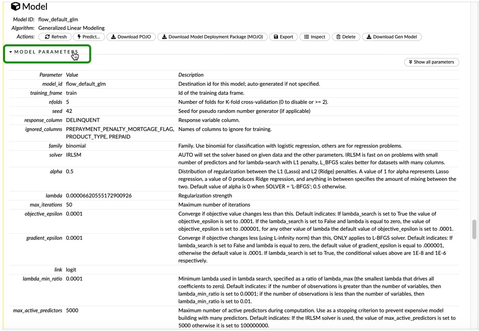
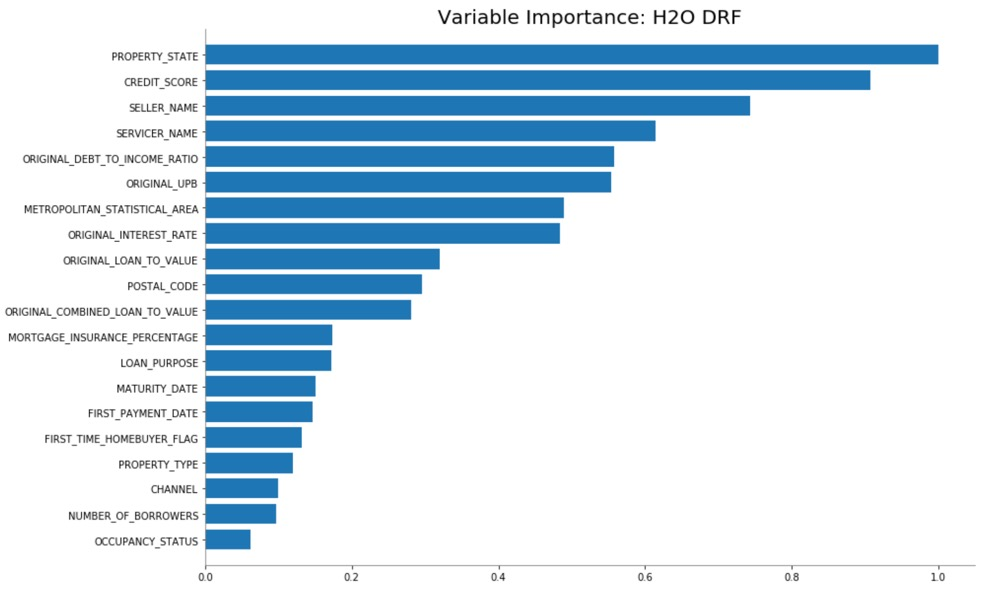
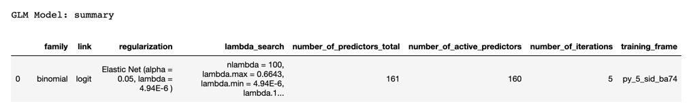
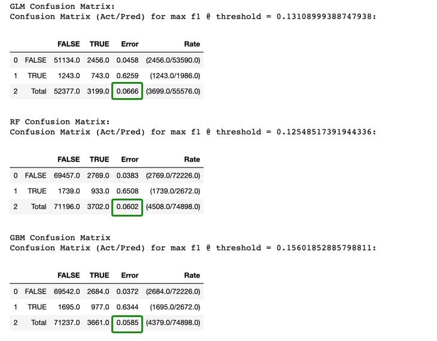
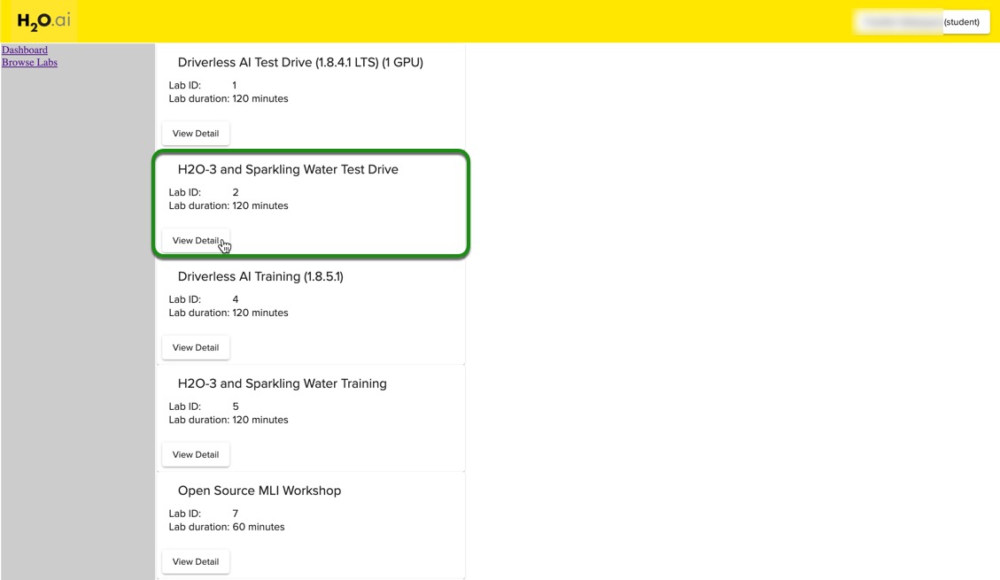
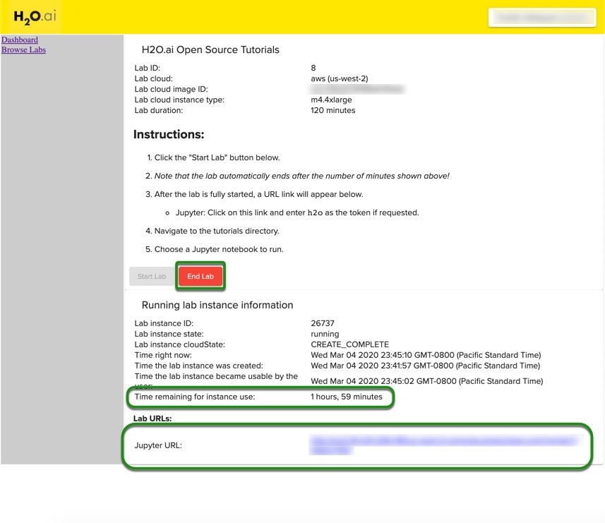

# Introduction to Machine Learning with H2O-3 - Part 1

## Outline

- [Objective](#objective)
- [Prerequisites](#prerequisites) 
- [Task 1: Initial Setup](#task-1-initial-setup)
- [Task 2: Machine Learning Concepts](#task-2-machine-learning-concepts)
- [Task 3: Start Experiment](#task-3-start-experiment)
- [Task 4: Build a GLM](#task-4-build-a-glm)
- [Task 5: Build a Random Forest](#task-5-build-a-random-forest)
- [Task 6: Build a GBM](#task-6-build-a-gbm)
- [Task 7: Tune the GLM with H2O GridSearch](#task-7-tune-the-glm-with-h2o-gridsearch)
- [Task 8: Tune the RF model with H2O GridSearch](#task-8-tune-the-rf-model-with-h2o-gridsearch)
- [Task 9: Tune the GBM model with H2O-GridSearch](#task-9-tune-the-gbm-model-with-h2o-gridsearch)
- [Task 10: Test Set Performance](#task-10-test-set-performance)
- [Task 11: Challenge](#task-11-challenge)
- [Appendix A: Getting Started with Aquarium](#appendix-a-getting-started-with-aquarium)
- [Next Steps](#next-steps)

## Objective

We will be using a subset of the Freddie Mac Single-Family dataset to try to predict whether or not a mortgage loan will be delinquent using H2O’s GLM, Random Forest, and GBM models. We will go over how to use these models for classification problems, and we will demonstrate how to use H2O’s grid search to tune the hyper-parameters of each model. This tutorial, as well as the next tutorials, will be done in Python; however, an R version of these tutorials will be avialable soon. 

## Prerequisites 

- Some basic knowledge of machine learning. 
- Familiarity with Python. 
- An Aquarium account to follow along. To help you get started with Aquarium, please see **Appendix A** in this tutorial.

**Note:** We have completed this tutorial in our cloud environment and is intended to take about two hours, or less, to be completed. Therefore, if you decide to do this tutorial on your machine, you might not get the same results, or it might take you longer to complete the tutorial than the intended time.

If you decide to install H2O-3 on your machine, we recommend creating an Anaconda Cloud environment, as shown in the installation guide, [Install on Anaconda Cloud,](http://docs.h2o.ai/h2o/latest-stable/h2o-docs/downloading.html#install-on-anaconda-cloud) this would help you make sure that you have everything that you need to do this tutorial.


## Task 1: Initial Setup

### Overview
The data set we’re using comes from Freddie Mac and contains 20 years of mortgage history for each loan and contains information about "loan-level credit performance data on a portion of fully amortizing fixed-rate mortgages that Freddie Mac bought between 1999 to 2017. Features include demographic factors, monthly loan performance, credit performance including property disposition, voluntary prepayments, MI Recoveries, non-MI recoveries, expenses, current deferred UPB and due date of last paid installment."[1] 

We’re going to use machine learning with H2O to predict whether or not a loan holder will default. To do this, we are going to build three classification models: a Linear model, Random Forest, and a Gradient Boosting Machine model, to predict whether or not a loan will be delinquent. Complete this tutorial to see how we achieved those results.

We will start by importing H2O, the estimators for the algorithms that we will use, and also the function to perform Grid Search on those algorithms. 

``` python
#Import H2O and other libraries that will be used in this tutorial 
import h2o
import matplotlib as plt
%matplotlib inline

#Import the Estimators
from h2o.estimators.glm import H2OGeneralizedLinearEstimator
from h2o.estimators import H2ORandomForestEstimator
from h2o.estimators.gbm import H2OGradientBoostingEstimator

#Import h2o grid search 
import h2o.grid 
from h2o.grid.grid_search import H2OGridSearch
```
We now have to initialize an H2O cluster or instance in this case, and we will use the `h2o.init()` command. Please note that we have some extra lines of code to check if you are running the experiment on Aquarium, or if you are running it on your local machine. If you are working on Aquarium, it will connect to the instance running in your lab. If you are working on your local machine, then it will create a new H2O-3 instance.

When you work on your local machine, you can specify how much maximum memory you want your cluster to have. This will only guarantee that the cluster will not use more than the limit you assign from your machine memory. Typically we recommend an H2O Cluster with at least 3-4 times the amount of memory as the dataset size. When you run this on Aquarium, you do not need to worry about the memory because the instance provided has almost 14Gb of memory. 

 ``` python
import os
import h2o

startup  = '/home/h2o/bin/aquarium_startup'
shutdown = '/home/h2o/bin/aquarium_stop'

if os.path.exists(startup):
    os.system(startup)
    local_url = 'http://localhost:54321/h2o'
    aquarium = True
else:
    local_url = 'http://localhost:54321'
    aquarium = False
```

``` python
h2o.init(url=local_url)
```


After initializing the H2O cluster, you will see the information shown above. We have an H2O cluster with just one node. Clicking on the Flow URL from the Aquarium Lab will take you to your **Flow instance,** where you can see your models, data frames, plots, and much more. Click on the link, and it will take you to a window similar to the one below. Keep it open in a separate tab, as we will come back to it later on.


Next, we will import the dataset. If you are working on your machine, you can download H2O's subset of the Freddie Mac Single-Family Loan-Level dataset, [Loan_Level_500k.csv](https://s3.amazonaws.com/data.h2o.ai/DAI-Tutorials/loan_level_500k.csv), to your local drive and save it at as csv file. 
Make sure that the dataset is in the same directory as your Jupyter Notebook. For example, if your Jupyter file is in your **Documents,** save the csv file there. Or you can just specify the path of where the file is located; in our case, the file is in an S3 bucket. That’s why we’ll just do the following: 

``` python
#Import the dataset 
loan_level = h2o.import_file("https://s3.amazonaws.com/data.h2o.ai/DAI-Tutorials/loan_level_500k.csv")
```

Now that we have our dataset, we will explore some concepts and then do some exploration of the data and prepare it for modeling.

Please note that we use the name H2O-3 to refer to our software, but when we usually use the simplified name, H2O, when we refer to specific functions or algorithms. 

### References

[1] Our dataset is a subset of the [Freddie Mac Single-Family Loan-Level Dataset.](http://www.freddiemac.com/research/datasets/sf_loanlevel_dataset.html) It contains about 500,000 rows and is about 80 MB.

## Task 2: Machine Learning Concepts 

### H2O
H2O is an open-source, in-memory, distributed, fast, and scalable machine learning and predictive analytics platform that allows you to build machine learning models on big data and provides easy productionalization of those models in an enterprise environment.

H2O's core code is written in Java. Inside H2O, a Distributed Key/Value store is used to access and reference data, models, objects, etc. across all nodes and machines. The algorithms are implemented on top of H2O's distributed Map/Reduce framework and utilize the Java Fork/Join framework for multi-threading. The data is read in parallel and is distributed across the cluster and stored in memory in a columnar format in a compressed way. H2O.ai's data parser has built-in intelligence to guess the schema of the incoming dataset and supports data ingest from multiple sources in various formats.

The speed, quality, ease-of-use, and model-deployment for the various cutting edge Supervised, and Unsupervised algorithms like Deep Learning, Tree Ensembles, and GLRM make H2O a highly sought after API for big data data science.

### Flow

H2O Flow is an open-source user interface for H2O. It is a web-based interactive environment that allows you to combine code execution, text, mathematics, plots, and rich media in a single document.

With H2O Flow, you can capture, rerun, annotate, present, and share your workflow. H2O Flow allows you to use H2O interactively to import files, build models, and iteratively improve them. Based on your models, you can make predictions and add rich text to create vignettes of your work - all within Flow’s browser-based environment.

Flow’s hybrid user interface seamlessly blends command-line computing with a modern graphical user interface. However, rather than displaying output as plain text, Flow provides a point-and-click user interface for every H2O operation. It allows you to access any H2O object in the form of well-organized tabular data.

H2O Flow sends commands to H2O as a sequence of executable cells. The cells can be modified, rearranged, or saved to a library. Each cell contains an input field that allows you to enter commands, define functions, call other functions, and access other cells or objects on the page. When you execute the cell, the output is a graphical object, which can be inspected to view additional details.

### Supervised Learning 
Supervised learning is when the dataset contains the output that you are trying to predict. Then, you use an algorithm to try to predict a function between your input and output, such as y=f(X). With supervised learning, you train your algorithms to try to approximate a function that will allow you to predict the variable y.

### Binary Classifier
A binary classification model predicts in what two categories(classes) the elements of a given set belong to. In the case of our example, the two categories(classes) are defaulting on your home loan and not defaulting. 

Binary classifications produce four outcomes:

**Predicticted as Positive:**
True Positive = TP = Actual Positive labels predicted as positives
False Positive = FP = Actual Negative labels predicted as positives
 
**Predicted as Negative:**
True Negative = TN = Actual Negative labels predicted as negatives
False Negative = FN = Actual Positive labels predicted as negatives


### Confusion Matrix
The confusion matrix is also known as the error matrix since it makes it easy to visualize the classification rate of the model, including the error rate. With the confusion matrix, you can see the frequency with which a machine learning model confuses one label with another, and thus the name “confusion matrix.”

### ROC
An essential tool for classification problems is the ROC Curve or Receiver Operating Characteristics Curve. The ROC Curve visually shows the performance of a binary classifier; in other words, it "tells how much a model is capable of distinguishing between classes" [1] and the corresponding threshold. 
The ROC curve plots the sensitivity or true positive rate (y-axis) versus the Specificity or false positive rate (x-axis) for every possible classification threshold. A classification threshold or decision threshold is the probability value that the model will use to determine where a class belongs. The threshold acts as a boundary between classes to determine one class from another. Since we are dealing with probabilities of values between 0 and 1, an example of a threshold can be 0.5. This tells the model that anything below 0.5 is part of one class, and anything above 0.5 belongs to a different class.
A ROC Curve is also able to tell you how well your model did by quantifying its performance. The scoring is determined by the percent of the area that is under the ROC curve, otherwise known as **Area Under the Curve or AUC.** The closer the ROC curve is to the left (the bigger the AUC percentage), the better the model is at separating between classes.

The ROC curve is a useful tool because it only focuses on how well the model was able to distinguish between classes. "AUC's can help represent the probability that the classifier will rank a randomly selected positive observation higher than a randomly selected negative observation" [2]. However, on rare occurrences, a high AUC could provide a false sense that the model is correctly predicting the results.

### Precision and Recall
**Precision** is the ratio of correct positive predictions divided by the total number of positive predictions. This ratio is also known as positive predictive value and is measured from 0.0 to 1.0, where 0.0 is the worst, and 1.0 is the best precision.

**Recall** is the true positive rate, which is the ratio of the number of true positive predictions divided by all true positive predictions. Recall is a metric of the actual positive predictions. It tells us how many correct positive results occurred from all the positive samples available during the test of the model.

### F1 Score
The F1 Score is another measurement of classification accuracy. It represents the harmonic average of precision and recall. F1 is measured in the range of 0 to 1, where 0 means that there are no true positives, and 1 when there is neither false negatives or false positives or perfect precision and recall[3].


### Accuracy
Accuracy or ACC (not to be confused with AUC or area under the curve) is a single metric in binary classification problems. ACC is the ratio of the number of correct predictions divided by the total number of predictions. In other words, it describes how well the model can correctly identify both the true positives and true negatives. Accuracy is measured in the range of 0 to 1, where 1 is perfect accuracy or perfect classification, and 0 is poor accuracy or poor classification[4].
Using the confusion matrix table, ACC can be calculated in the following manner:
Accuracy = (TP + TN) / (TP + TN + FP + FN)

### Log loss
The logarithmic loss metric can be used to evaluate the performance of a binomial or multinomial classifier. Unlike AUC, which looks at how well a model can classify a binary target, logloss evaluates how close a model’s predicted values (uncalibrated probability estimates) are to the actual target value. For example, does a model tend to assign a high predicted value like .80 for the positive class, or does it show a poor ability to recognize the positive class and assign a lower predicted value like .50? A model with a log loss of 0 would be the perfect classifier. When the model is unable to make correct predictions, the log loss increases, making the model a poor model[5].

### Cross-Validation
cross-validation is a model validation technique in which you can check how well a statistical analysis or model, will perform on an independent dataset. We use cross-validation to see how our model will predict on unseen data. We will explore two cross-validation approaches. The first one is to take the training data and split it into training and validation set, which is similar to a test set. This approach is called **validation set cross-validation.** Also, there is **K-Fold** cross-validation, in which you do not need to split the data, but use the entire dataset. Depending on the number of *folds* that you choose during training, the data is divided into k groups; k-1 groups are trained, and then, the last group serves to evaluate. After every group has been used to evaluate the model, the average of all the scores is obtained; and thus, we obtain a validation score[6].

### References

[1] [Towards Data Science - Understanding AUC- ROC Curve](https://towardsdatascience.com/understanding-auc-roc-curve-68b2303cc9c5)
 
[2] [ROC Curves and Under the Curve (AUC) Explained](https://www.youtube.com/watch?v=OAl6eAyP-yo)
 
[3] [Wiki F1 Score](https://en.wikipedia.org/wiki/F1_score)
 
[4] [Wiki Accuracy](https://en.wikipedia.org/wiki/Accuracy_and_precision)
 
[5] [Wiki Log Loss](http://wiki.fast.ai/index.php/Log_Loss)
 
[6] [Towards Data Science - Cross-Validation](https://towardsdatascience.com/cross-validation-70289113a072)

## Task 3: Start Experiment

To ensure the dataset was properly imported use the `.head()` function to check the first ten rows of your dataset

```
loan_level.head()
```


Your results should look like the table above. If you scroll to the right, you will be able to see all the features in our dataset. 
We can also take a look at a quick statistical summary of our dataset with the `.describe()` command as shown below

``` python
loan_level.describe()
```


The total number of rows in our dataset is 500,137, and the total number of features or columns is  27. Additionally, you will get a sense of the spread of each of your columns, the column type, as well as the number of missing and zero values in your dataset.

Let's take a quick look at the response column by checking the distribution.

``` python
loan_level["DELINQUENT"].table()
```


As you can see, we have a very imbalanced dataset, as only 3.6% of the samples are TRUE labels, meaning that only 3.6% of the samples in the dataset have been labeled as `DELINQUENT.`

You can also do the same thing with H2O Flow, by clicking ‘import’ and then viewing the actual table once it’s imported. Go to your Flow instance and add a new cell.


Copy and paste the following line of code in the new cell and run it. Then, click on **Parse these files** 

```
importFiles ["https://s3.amazonaws.com/data.h2o.ai/DAI-Tutorials/loan_level_500k.csv"]
```


After clicking on **Parse these files,** you will see a parse set-up similar to the image below:


H2O will try to parse the file and assign appropriate column types. But you can change column types if they’re not imported correctly. After you have inspected the parse set-up, click on parse. 

Once finished, you will see the following message, confirming that the parsing was completed. 


**Please note that the main goal of this tutorial is to show the usage of some models for classification problems, as well as to tune some of the hyper-parameters of the models. For that reason, we will be skipping any data visualization and manipulation, as well as feature engineering. The aforementioned stages in machine learning are very important, and should always be done; however, they will be covered in later tutorials.**

Since we have a large enough dataset, we will split our dataset into three sets, and we will call them **train, valid,** and **test.** We will treat the test set as if it were some unseen data in which we want to make predictions, and we will use the valid set for validation purposes and to tune all our models. We will not use the test set until the end of the tutorial to check the final scores of our models. 

Return to your Jupyter Notebook to split our dataset into three sets. We will use the `.split_frame()` function. Note that we can do this in one line of code. Inside the split function, we declare the ratio of the data that we want in our first set, in this case, the **train** set. We will assign 70% to the training set, and 15% for the validation, as well as for the test set. The random seed is set to 42 just for reproducibility purposes. You can choose any random seed that you want, but if you want to see consistent results, you will have to use the same random seed anytime you re-run your code. 

``` python
train, valid, test = loan_level.split_frame([0.7, 0.15], seed=42)
```
We can check the distribution of the data split by checking the number of rows in each set.

```python
print("train:%d valid:%d test:%d" % (train.nrows, valid.nrows, test.nrows))
``` 

**Output:**
```python
train:350268 valid:74971 test:74898
```

Now we will split the dataset in our Flow instance. Click on **View,** then **Split** and use the default ratios of 0.75 for **train,** and 0.25 for **test** and change the names accordingly. Also, change the **seed** to 42 and click **Create** 


Next, we need to choose our **predictors**, or **x variable**, and our **response** or **y variable**. For the H2O-3 estimators, we do not use the actual data frame; instead, we use strings containing the name of the columns in our dataset.

Return to your Jupyter Notebook. For our y variable, we will choose `DELINQUENT` because we want to predict whether or not a loan will default. For the x variable, we will choose all but four features. One is the feature that we will predict, and then `PREPAID` and `PREPAYMENT_PENALTY_MORTGAGE_FLAG` because they are clear indicators if a loan is or is not delinquent and we will not have the information at the time deciding whether to give a loan or not. In machine learning terms, introducing these types of features is called leakage. And lastly, `PRODUCT_TYPE` because that’s a constant value for every row, meaning all samples have the same value; therefore, this feature will not have any predictive value.

There are several ways to choose your predictors, but for this tutorial, we will subtract the list in the variable `ignore` from all the names in our training set. 

``` python
y = "DELINQUENT"

ignore = ["DELINQUENT", "PREPAID", "PREPAYMENT_PENALTY_MORTGAGE_FLAG", "PRODUCT_TYPE"] 

x = list(set(train.names) - set(ignore))
```

If you want to see the list of the features that are in your x variable, just print x.

``` python
print(x)
```
**Output:**
``` python
['PROPERTY_TYPE', 'NUMBER_OF_UNITS', 'POSTAL_CODE', 'CREDIT_SCORE', 'NUMBER_OF_BORROWERS', 'ORIGINAL_INTEREST_RATE', 'ORIGINAL_LOAN_TERM', 'ORIGINAL_DEBT_TO_INCOME_RATIO', 'ORIGINAL_UPB', 'FIRST_TIME_HOMEBUYER_FLAG', 'SELLER_NAME', 'LOAN_SEQUENCE_NUMBER', 'PROPERTY_STATE', 'MATURITY_DATE', 'ORIGINAL_LOAN_TO_VALUE', 'ORIGINAL_COMBINED_LOAN_TO_VALUE', 'MORTGAGE_INSURANCE_PERCENTAGE', 'METROPOLITAN_STATISTICAL_AREA', 'OCCUPANCY_STATUS', 'CHANNEL', 'FIRST_PAYMENT_DATE', 'SERVICER_NAME', 'LOAN_PURPOSE']
``` 
## Task 4: Build a GLM

Now that we have our train, valid, and test sets, as well as our x and y variables defined, we can start building models! We will start with an H2O Generalized Linear Model (GLM). A GLM fits a generalized linear model, specified by a response variable, a set of predictors, and a description of the error distribution. Since we have a binomial classification problem, we have to specify the family, in this case, it will be `binomial.` 

Since we already imported the H2O GLM estimator, we will just instantiate our model. For simplicity, the name of our model will be `glm`. To build a GLM, you just need to define the family, and you are ready to go. However, we will set a random seed for reproducibility purposes, and also a model id to be able to retrieve the model later on if we need to access it. You can instantiate your GLM, as shown below. 

``` python
glm = H2OGeneralizedLinearEstimator(family = "binomial", seed=42, model_id = 'default_glm')
```
Now we will train our GLM model. To do so, we just use the `.train()` function. In the train function, we need to specify the predictors (x), the response (y), the training set (train), and a validation frame, if you have one. In our case, we have our valid set, which we will use. 

``` python
%time glm.train(x = x, y = y, training_frame = train, validation_frame = valid)
```
**Note:** The `%time` in front of our train command is used to display the time it takes to train the model, and it’s a feature from Jupyter Notebook; it does not work on a command line or outside of Jupyter Notebook. 

You can do the same thing in Flow with the **Build Model** dialog. Click on your train set, and click on **Build Model,** then scroll down to the “Build a Model” cell, and select **Generalized Linear Modeling** for the algorithm. For model id, you can use `flow_default_glm.` Instead of doing cross-validation with a validation set, we are going to use Flow’s K-fold cross-validation; therefore, type **5** for *nfolds,* and set the random seed to 42. Again, choose `DELINQUENT` for your *response_column,* and for the *ignored columns*, choose  `PREPAYMENT_PENALTY_MORTGAGE_FLAG`, `PRODUCT_TYPE`, `PREPAID`. Lastly, choose **binomial** for *family.*


You have now built and trained a GLM! If you type the name of your model in a new cell and run it, H2O will give you a complete summary of your model. You will see your model’s metrics on the training and validation set. From the model details, you will see a short summary with the parameters of your model, the metrics of your model, the confusion matrix, maximum matrices at different thresholds, a Gains/Lift table, and the scoring history. (Gains/Lift and scoring history are not shown below)


From the summary results, we can see the GLM performance. We will focus on the Area Under the Curve (AUC), and since we have a very imbalanced dataset, we will be looking at the F1 score. Additionally, we will also take a quick look at the misclassification error and logloss. 

From the report, we can look at the metrics on the training and validation data, and we see that the training AUC was **0.8502** while the validation AUC was **0.8450**


From the report, we can also see the max F1 score as well as all the metrics for our model with their respective thresholds. For the default GLM, we obtained a training F1 score of **0.2881** and a validation F1 score of **0.2827.** 

**Training maximum metrics**


**Validation maximum metrics**


We can plot the Scoring history for any of our models, as shown below:

``` python
glm.plot(metric='negative_log_likelihood')
```


We can see from the plot above that after four iterations, the score no longer improves; therefore, if we needed to set a number of iterations as a future parameter, we can choose 4, as the scores don’t really improve after that point. We can also use the default number of iterations and use early stopping; that way, the model will stop training when it is no longer improving. We will use early stopping when we start tuning our models.

We can also generate a variable importance plot to see how each of our features contribute to the linear model. 

```
glm.varimp_plot()
```


From the variable importance plot, we can see that the most significant feature is `SERVICER_NAME.` In the most important feature, we have different banks or “servicers,” and in our linear model, each one makes a difference; for that reason, we see that the first four variables in the plot above are 4 of the servicers in the dataset. These services are the most influential to our model in making predictions of whether someone will default or not. Please keep in mind that it does not necessarily mean that if someone gets a loan from Wells Fargo, they have a high probability of default.

We will take a look at the first ten predictions of our model with the following command:
``` python
glm.predict(valid).head(10)
``` 
 


**Note:** if you want to see more predictions use the `.head()` function, as shown in the line of code above; it should allow you to view all the predictions on the validation set that you want.

The model used by H2O for this classification problem is a Logistic Regression model, and the predictions are based on the threshold for each probability[1]. For a binary classifier, H2O predicts the labels based on the maximum F1 threshold. From the report, the threshold for max F1 is  **0.1224.** So, any time the probability for TRUE is greater than the 0.1224, the predicted label will be TRUE, as is in the case of the sixth prediction. To learn more about predictions, you can visit the [Prediction Section](http://docs.h2o.ai/h2o/latest-stable/h2o-docs/performance-and-prediction.html?highlight=predict#prediction) from the H2O documentation.

Lastly, save the default performance of the model, as we will use this for comparison purposes later on.
```python
default_glm_perf=glm.model_performance(valid)
```
Once you save the model performance on a different data set, you can print individual metrics, such as the AUC as shown below.

```python
print(default_glm_perf.auc())
```
**Output:**
```python
0.8449582112507165
```
The AUC score is the same as the one from the model summary that we printed before.

Go back to the Flow instance, go to the model you created earlier on and click on “View,”


Expand the Model parameters tab, and you will see a description of the parameters for your model. 




If you scroll down, you will see some plots derived from the training data. The first one is the scoring history plot. 


We can see that the scoring history from Flow shows us that after four iterations, the score does not improve. Even though we are doing different cross-validation, validation set approach in the python script, and k-fold cross-validation in Flow, we obtained the same results, indicating that four iterations are enough. 

If you continue scrolling down, you will see:
ROC Curve  Training Metrics
ROC Curve  Cross-validation Metrics
Standardized Coefficients Magnitudes 
Training Metrics - Gains/Lift Table
Cross-Validation Metrics - Gains/Lift Table
And then all types of outputs 
When all the tabs are collapsed, you will see the following list of details from your model:


You can also take a look at the details of the model you built in your Jupyter Notebook. Scroll up to the **Assist** Cell and click on **getModels**


Then select **default_glm**


You can inspect all the plots and outputs from your model in Flow. The plots that we generated in the Jupyter Notebook are automatically created in Flow, so if you prefer, you can just create your model in Jupyter and then analyze the results in Flow. 

### References

[1] [H2O-3 GLM Logistic Regression](http://docs.h2o.ai/h2o/latest-stable/h2o-docs/data-science/glm.html#logistic-regression-binomial-family)

## Task 5: Build a Random Forest

We will build a default Distributed Random Forest (DRF) model and see how it performs on our validation set. DRF generates a forest of classification or regression trees, rather than a single classification or regression tree. Each of these trees is a weak learner built on a subset of rows and columns. More trees will reduce the variance. Both classification and regression take the average prediction over all of their trees to make a final prediction, whether predicting for a class or numeric value. 

To build and train our Random Forest or RF(as we will be referring to from this point on) model, simply run the following two lines of code:
``` python
rf = H2ORandomForestEstimator (seed=42, model_id='default_rf')
%time rf.train(x=x, y=y, training_frame=train, validation_frame=valid)
```
Note that we defined the random seed and the model id. You do not need to do this; the model can be built without defining these parameters. The reason for choosing the random seed is for reproducibility purposes, and the model id is to recognize the model in Flow easily.

Again, print the summary of your model as we did with the GLM model. You will see the summary of the model with the default settings, and the metrics score on the training and validation data. 

Below you will see some of the details from the model we just built. 

The AUC and F1 Score reported on the training data are **0.8033** and  **0.2620,** respectively, and you can see them in the image below.


**Results from validation data**

The AUC and F1 Score reported on the validation data are **0.8265** and  **0.2830,** respectively.


Let’s build an RF model in Flow. Scroll up again to the **Assist** cell, and click on **buildModel** 


In the *select algorithm* option, choose **Distributed Random Forest,** then change the model id to `flow_default_rf.` Click on the *training_frame* option and select **train.** Change *nfolds* so that it is 5. Choose "DELINQUENT" for your *response_column,* and for the *ignored columns*, choose "PREPAYMENT_PENALTY_MORTGAGE_FLAG," "PRODUCT_TYPE," "PREPAID."


If you would like, you can view the outputs of your RF model in Flow. However, we can also generate the plots in our Jupyter Notebook.

``` python
rf.plot(metric='auc')
```
You will see a plot similar to the one below


In this case, we see that the RF model is far from overfitting because the training error is still lower than the validation error, and that means that we can probably do some tuning to improve our model. 

We can also generate the variable importance plot,
```python
rf.varimp_plot(20)
```



It is interesting to see that for our RF model, `PROPERTY_STATE` Is the most important variable, implying that the prediction of whether a loan could be delinquent or not depends on the state where someone is trying to buy that property. The second most important is a more intuitive one, which is the `CREDIT_SCORE`, as one could expect someone with really good credit to pay their loans fully. 

If you want to check the options of what you can print from your model, just type the name of your model along with a dot (`.`) and press tab. You should see a drop-down menu like the one shown in the image below. 


Keep in mind that for some of them, you will need to open and close parentheses at the end in order to display what you want. If we wanted to print the training accuracy of our model, you could select accuracy, but you need to add parentheses in order to get just the accuracy; otherwise, you will get the entire report again.


The first parameter shown in the list above is the threshold, and the second value is the accuracy. 

To print the F1 Score, you simply need to type the following line of code,

```python
rf.F1()
```
You will see the output in a list format. First, you will see the threshold, and then the actual value, the same as in the accuracy. You could also specify the threshold inside the parenthesis, that way you use the threshold that you want.

Let’s take a look at the first ten predictions in our validation set, and compare it to our first model. 

``` python
rf.predict(valid)
```


Both models, GLM and RF, made the same predictions in the first ten predictions. For e.g., the TRUE prediction for the sixth row is the same; there is a different probability, but the prediction is the same. 

Again, save the model performance on the validation data
```python
default_rf_per = rf.model_performance(valid)
```
## Task 6: Build a GBM

Gradient Boosting Machine (for Regression and Classification) is a forward learning ensemble method. H2O’s GBM sequentially builds classification trees on all the features of the dataset in a fully distributed way - each tree is built in parallel. H2O’s GBM fits consecutive trees where each solves for the net loss of the prior trees. 
Sometimes GBMs tend to be the best possible models because they are robust and directly optimize the cost function. On the other hand, they tend to overfit, so you need to find the proper stopping point; they are sensitive to noise, and they have several hyper-parameters.

Defining a GBM model is as simple as the other models we have been working with. 
``` python
gbm= H2OGradientBoostingEstimator(seed=42, model_id='default_gbm')
%time gbm.train(x=x, y=y, training_frame=train, validation_frame = valid)
``` 
Print the model summary

**Training metrics:**


**Validation metrics:**


Now, we will explore this model in Flow. Go to your Flow instance, click on **getModels** and click on “default_glm”


Now scroll down to the scoring history, and you should see a plot like the one below:


From the scoring history, we can see that we can still increase the number of trees, a little bit more, because the validation score is still improving. We will get into more details during the GBM tuning section. 
Scroll down to the variable importance plot, and take a look at it. Notice how the most important variable is `CREDIT_SCORE` for the GBM. If you recall, for RF, `CREDIT_SCORE` was the second most important variable. And the most important variable for RF is the third most important for the GBM. 


You can continue exploring the results of your GBM model, or go back to the Jupyter Notebook where we will continue. 

The default GBM model had a slightly better performance than the default RF. 
We will make the predictions with the GBM model as well.

``` python
gbm.predict(valid)
``` 


All three models made the same ten predictions, and this gives us an indication of why all three scores are close to each other. Although the sixth prediction is TRUE for all three models, the probability is not exactly the same, but since the thresholds for all three models were low, the predictions were still TRUE. 
As we did with the other two models, save the model performance.

``` python
default_gbm_per = gbm.model_performance(valid)
```
Next, we will tune our models and see if we can achieve better performance. 

## Task 7: Tune the GLM with H2O GridSearch 
H2O supports two types of grid search – traditional (or “cartesian”) grid search and random grid search. In a cartesian grid search, you specify a set of values for each hyperparameter that you want to search over, and H2O will train a model for every combination of the hyperparameter values. This means that if you have three hyperparameters and you specify 5, 10, and 2 values for each, your grid will contain a total of 5*10*2 = 100 models.

In a random grid search, you specify the hyperparameter space in the exact same way, except H2O will sample uniformly from the set of all possible hyperparameter value combinations. In the random grid search, you also specify a stopping criterion, which controls when the random grid search is completed. You can tell the random grid search to stop by specifying a maximum number of models or the maximum number of seconds allowed for the search. You can also specify a performance-metric-based stopping criterion, which will stop the random grid search when the performance stops improving by a specified amount.
Once the grid search is complete, you can query the grid object and sort the models by a particular performance metric (for example, “AUC”). All models are stored in the H2O cluster and are accessible by model id. 

To save some time, we will do a random grid search for our GLM model instead of the cartesian search. The H2OGridSearch has **4 parameters,** and in order to use it, you need **at least three** of them. The first parameter for the grid search is the **model** that you want to tune. Next are your **hyperparameters,** which needs to be a string of parameters, and a list of values to be explored by grid search. The third one is optional, which is the **grid id,** and if you do not specify one, an id will automatically be generated. Lastly, the fourth parameter is the **search criteria,** where you can specify if you want to do a cartesian or random search.  

We will explore two ways of defining your grid search, and you can use the way you prefer. One way is to define all at once in the grid search (as we will do it for the GLM). The second way is to define every parameter separately. For example, define your model, your hyper-parameters, and your search criteria, and just add that to your grid search once you are ready.

For our GLM, we will tune `alpha,` `lambda,` and `missing_values_handling.` The other parameters that you could change, such as `solver,` `max_active_predictors,` and `nlambdas,` to mention a few, are not supported by H2OGridSearch. 

1\. **`alpha`** is the distribution of regularization between the L1 (Lasso) and L2 (Ridge) penalties. A value of 1 for alpha represents Lasso regression, a value of 0 produces Ridge regression, and anything in between specifies the amount of mixing between the two. 

2\. **`lambda`,** on the other hand, is the regularization strength. For alpha, we can explore the range from 0 to 1 in steps of 0.01. For lambda, you could start just doing your own random searches, but that might take a lot of time. Instead, we can base our value for lambda on the original value of lambda, which was 6.626e-5. We can choose our starting point to be 1e-6 and go from there. 

3\. **`missing_values_handling`** This parameter allows us to specify how we want to specify any missing data (Options are skip and MeanImputation)

The grid search is shown below:

``` python
glm_grid = h2o.grid.H2OGridSearch (
    H2OGeneralizedLinearEstimator( 
        family = "binomial",
        lambda_search = True),
    
    hyper_params = {
        "alpha": [x*0.01 for x in range(0, 100)],
        "lambda": [x*1e-8 for x in range(0, 10000)],
        "missing_values_handling" : ["Skip", "MeanImputation"]
        },

    grid_id = "glm_random_grid",
    
    search_criteria = {
        "strategy":"RandomDiscrete",
        "max_models":200,
        "max_runtime_secs":300,
        "seed":42
        }
)

%time glm_grid.train(x=x, y=y, training_frame=train, validation_frame = valid)
```
You can easily see all **four parameters** of our grid search in the code sample above. We defined our GLM model the same way we did before. Then, we take care of the hyper-parameters and notice that we have used a for loop for the ranges of both alpha and lambda in order to cover more possible values. Because the number of possible models in our search criteria is very, we specify that we want a maximum number of 200 models, or that the grid search runs for only 300 seconds.
 
Print the models in descending order, sorted by the **AUC**. By default, the grid search will return the best models based on the **logloss**. Therefore, in order to get the best model based on the AUC, we will specify that we want to sort the models by AUC. You can change this to other metrics, depending on what you are looking for.

``` python
sorted_glm_grid = glm_grid.get_grid(sort_by='auc',decreasing=True)
sorted_glm_grid.sorted_metric_table()
```


With the code sample above, you will get the models that were created with their respective parameters, model id, and AUC. As you can see, the grid search did not take that long to complete, and it trained a total of 200 models, which was our second constraint. The AUC did improve, and we will compare it to the AUC from our default model.

Next, we will do the same in Flow. Using a grid search in Flow is as easy as just clicking some boxes and adding some numbers. Go to the **Assist** cell again and click on **buildModel,** and select **Generalized Linear Modeling** for the algorithm. Repeat the same process as before, when you built the default GLM model. For model id, just use `glm.` type *5* for *nfolds,* and set the random seed to 42. Again, choose `DELINQUENT` for your *response_column,* and for the *ignored columns,* choose  `PREPAYMENT_PENALTY_MORTGAGE_FLAG`, `PRODUCT_TYPE`, `PREPAID`. Lastly, choose **binomial** for *family.* But this time, don’t click on **Build Model** yet.

Now, every time you build a model, you are given the option to select the grid option, as shown in the image below. For the parameters shown in the image below, just leave them how they are. 


Scroll down to the *alpha* and *lambda* parameters and check the boxes next to them and add the list of numbers shown in the image below. Also, check the *lambda_search* and *standardize* boxes. 

 

Lastly, for the **Grid Settings,** make sure your settings look similar to the ones in the image below. You will need to change the ***Grid ID, Strategy, Max Models, Max Runtime, and Stopping Metric.***


Once you have updated the settings, click on **Build Model.** When the model is done, click on **View,** and you will see the list of your models. The top model will be the model with the best AUC score. Click on it and explore the results. Our best model yielded to a validation AUC score of 0.8548, and our ROC curve is shown below. 


After looking at the grid search from Flow, let's explore the best model obtained from our grid search in our Jupyter Notebook. Save the best model and print the model summary with the following code:

``` python
tuned_glm = glm_grid.models[0] 
tuned_glm.summary()
``` 


With the first line of code, we are retrieving the best model from the grid search, and the second line of code will print the parameters used for the best model found by the grid search. We will make a quick comparison between the performance of the default glm model and the best model from the grid search. 

First, evaluate the model performance on the validation set.

```python
tuned_glm_perf = tuned_glm.model_performance(valid)
``` 
Now, print the AUC for the default, and the tuned model.

``` python
print("Default GLM AUC: %.4f \nTuned GLM AUC:%.4f" % (default_glm_perf.auc(), tuned_glm_perf.auc()))
```
Output:
``` 
Default GLM AUC: 0.8450 
Tuned GLM AUC:0.8534
```

The AUC slightly improved. We did not expect the GLM model to perform great, or to have a great improvement with the grid search, as it is just a linear model, and in order to perform well, we would need a linear distribution of our data and response variable; however, we were able to improve the default score. 

We can also print the F1 Score to see if it improved or not,
``` python
print ("Default GLM F1 Score:", default_glm_perf.F1())
print ("Tuned GLM F1 Score", tuned_glm_perf.F1())
```

Output:
``` python
Default GLM F1 Score: [[0.1223956407234934, 0.28271823505379273]]
Tuned GLM F1 Score [[0.1257504779910935, 0.28335522612122355]]
```

The max F1 Score did not have a significant improvement. Although the threshold slightly increased, it did not improve the overall F1 Score by much. Let’s take a look at the confusion matrix to see if the values changed.  


``` python
print ("Default GLM: ", default_glm_perf.confusion_matrix())
print ("Tuned GLM: ",  tuned_glm_perf.confusion_matrix())
``` 


Notice how the overall error slightly decreased, as well as the error for the FALSE class. While the error for the TRUE class had minimal improvement, meaning the model is classifying a few more samples that are actually TRUE correctly. We see that our model has a hard time classifying the TRUE labels, and this is due to the highly imbalanced dataset that we are working on. 

We will do the test evaluation after we tune our other two models.

## Task 8: Tune the RF model with H2O GridSearch 

We will do the grid search a bit differently this time. We are going to define each parameter of the grid search separately, and then pass the variables to the grid search function.

We will first find one of the most important parameters for an RF, which is the maximum depth.

**`max_depth`** defines the number of nodes along the longest path from the start of the tree to the farthest leaf node. Higher values will make the model more complex and can lead to overfitting. Setting this value to 0 specifies no limit. This value defaults to 20. We will first look for the best value for the **max_depth;** this would save us some computational time when we tune the other parameters. As we mentioned before, we will use a slightly different approach for the grid search. We are going to instantiate each parameter for the grid search, and then pass each one into it.

``` python
hyper_parameters = {'max_depth':[1,3,5,6,7,8,9,10,12,13,15,20,25,35]}

rf = H2ORandomForestEstimator(
    seed=42,
    stopping_rounds=5, 
    stopping_tolerance=1e-4, 
    stopping_metric="auc",
    model_id = 'rf'
    )

grid_id = 'depth_grid'

search_criteria = {'strategy': "Cartesian"}

#Grid Search
rf_grid = H2OGridSearch(model=rf, 
                        hyper_params=hyper_parameters, 
                        grid_id=grid_id, 
                        search_criteria=search_criteria)

%time rf_grid.train(x=x, y=y, training_frame=train, validation_frame = valid)
```
We are doing a random search of values for `max_depth` to see if the default value is good, or if we need to adjust the value. After it is done training, print the models sorted by AUC.

``` python
sorted_rf_depth = rf_grid.get_grid(sort_by='auc',decreasing=True)
sorted_rf_depth.sorted_metric_table()
```


Now that we have the proper depth for our RF, we will do a random grid search to try to find the next four parameters, `categorical_encoding,` `histogram_type,` `mtries,` and `nbins.`

1\. **`categorical_encoding:`** Specify one of the following encoding schemes for handling categorical features:

 - `auto` or `AUTO`: Allow the algorithm to decide (default). In DRF, the algorithm will automatically perform enum encoding.
 - `enum` or `Enum`: 1 column per categorical feature
 - `one_hot_explicit` or `OneHotExplicit`: N+1 new columns for categorical features with N levels
 - `binary` or `Binary`: No more than 32 columns per categorical feature
 - `label_encoder` or `LabelEncoder`: Convert every enum into the integer of its index (for example, level 0 -> 0, level 1 -> 1, etc.)
 - `enum_limited` or `EnumLimited`: Automatically reduce categorical levels to the most prevalent ones during training and only keep the T (1024) most frequent levels.
 - `sort_by_response` or `SortByResponse`: Reorders the levels by the mean response (for example, the level with lowest response -> 0, the level with second-lowest response -> 1, etc.).

2\. **`histogram_type`:** By default (AUTO) DRF bins from min…max in steps of (max-min)/N. Random split points or quantile-based split points can be selected as well. RoundRobin can be specified to cycle through all histogram types (one per tree).

3\. **`mtries`:** Specify the columns to select at each level randomly. If the default value of -1 is used, the number of variables is the square root of the number of columns for classification and p/3 for regression (where p is the number of predictors). 

4\. **`nbins`:** (Numerical/real/int only) Specify the number of bins for the histogram to build, then split at the best point.

The grid search for the aforementioned parameters is as follow:

```python
hyper_parameters = {"categorical_encoding" : ["auto", "enum", 
                                              "one_hot_explicit", "binary", 
                                              "label_encoder", "sort_by_response", 
                                              "enum_limited"],
                    "histogram_type" : ["uniform_adaptive", "random", 
                                        "quantiles_global", "round_robin"],
                    "mtries" : [4, 5, 6, 7, 8], #Default = sqrt(p)
                    "nbins" : [10, 12, 15, 18, 20, 25, 30, 40, 50] #Default = 20
                   }

rf = H2ORandomForestEstimator(max_depth=10,
                              ntrees=50,
                              seed=42,
                              stopping_rounds=5, 
                              stopping_tolerance=1e-5, 
                              stopping_metric="auc",
                              model_id='rf'
    )

grid_id = 'rf_random_grid_'

search_criteria = { "strategy":"RandomDiscrete",
                    "max_models":100,
                    "max_runtime_secs":900,
                    "seed":42
        }

rf_grid = H2OGridSearch(model=rf, 
                        hyper_params=hyper_parameters, 
                        grid_id=grid_id, 
                        search_criteria=search_criteria)

%time rf_grid.train(x=x, y=y, training_frame=train, validation_frame = valid)
```
Print the grid results as follow

```python
sorted_rf = rf_grid.get_grid(sort_by='auc',decreasing=True)
sorted_rf.sorted_metric_table()
```


The AUC improved using `max_depth=10` and doing a random grid search for the parameters mentioned above. 

Another important parameter that we can tune is the number of trees (`ntrees`). 

**`ntrees`** specifies the number of trees that you want your RF to have. When tuning the number of trees, you need to be careful because when you have too many trees, your model will tend to overfit. That’s why it’s always advised to use cross-validation, and never tune models based on training scores. Again, you can also use early stopping; that way, your model stops training once the validation score is no longer improving. 

We won't do a grid search for a maximum number of trees. We are going to update the parameters of our model with the values we found in the previous two grid searches that we did.  We will use 500 trees while using early stopping; that way, if the model doesn't improve, it will automatically stop.


``` python
tuned_rf = H2ORandomForestEstimator (max_depth=10,
                               seed=42, 
                               model_id='tuned_rf',
                               categorical_encoding= 'auto',
                               histogram_type= 'uniform_adaptive',
                               mtries = 4,
                               nbins = 12,
                               ntrees=500,
                               
                               stopping_rounds=3, 
                               stopping_tolerance=1e-5, 
                               stopping_metric="auc"
                               )

%time tuned_rf.train(x=x, y=y, training_frame=train, validation_frame=valid)
```
Let us take a look at the scoring history to make sure that the model is not overfitting. 

```python
tuned_rf.plot(metric='auc')
```


By looking at the plot above, we can see that if we were to use less than 500 trees, we would get a similar score. Even if you use more than 500 trees, the training AUC might keep increasing, but the validation AUC will remain the same. For that reason, one way to find a good number of trees is just to build a model with a large number of trees, and from the scoring plot, identify a good cut-off or just use more aggressive early stopping settings. Please keep in mind that you need to be doing cross-validation.

From the scoring history plot, we can see that the Validation AUC starts plateauing around 200 trees, but keeps slightly increasing. H2O models are, by default, optimized to give a good performance; therefore, sometimes, there is not much tuning to be done. We will see that with the GBM model as well.

To do the grid search for the RF model in Flow, start by building another default RF model the same way we did in Task 5. But this time, check the *Grid* checkbox next to `max_depth` and `ntrees` and add the list of the hyper-parameters that you want. 
For example, for **ntrees,** you can use the following list: `10; 50; 70; 100; 300; 400;`
And for **max_depth** you can do `1;5;10;12;15;20;50;` 
After you click on **build**, your grid search for your RF will start. You can even use values closest to the one we obtained in the Jupyter Notebook to see if you can get an even better score! Explore the results on your own, and see if the results make sense. 

Go back to the Jupyter Notebook, and check some of the outputs that we obtained from our tuned model. 


Print the validation AUC 
```python
tuned_rf_per = tuned_rf.model_performance(valid)
tuned_rf_per.auc()
```

**Output:**

```python
0.851702802059898
```
And the F1 Score

```python
tuned_rf_per.F1()
```

**Output:**
```python
[[0.13509843025963614, 0.2992776057791538]]
```
The AUC from the validation data was **0.8517,** and the F1 Score was **0.2993**

We will compare the tuned model with the default model. 
``` python
print("Default RF AUC: %.4f \nTuned RF AUC:%.4f" % (default_rf_per.auc(), tuned_rf_per.auc()))
```
**Output:**
```python
Default RF AUC: 0.8265 
Tuned RF AUC:0.8517
```
The AUC value for our RF model had a decent improvement by changing the `max_depth,` doing a quick random search for the parameters `categorical_encoding,` `histogram_type,` `mtries,` and `nbins.` Also by increasing the number of trees. Let’s see if the F1 Score improved,

```python
print("Default RF F1 Score:", default_rf_per.F1())
print("Tuned RF F1 Score:", tuned_rf_per.F1())
```

```python
Default RF F1 Score: [[0.18697332295716976, 0.2830355563417654]]
Tuned RF F1 Score: [[0.13509843025963614, 0.2992776057791538]]
```
The F1 score also improved. Although the F1 score is still low, we will look at the confusion matrix, and let’s see how this improvement reflects on the confusion matrix

``` python
print ("Default RF: ", default_rf_per.confusion_matrix())
print ("Tuned RF: ",  tuned_rf_per.confusion_matrix())
```


The AUC for our tuned model actually improved, as well as the F1 Score. However, the misclassification error slightly increased. The new model is predicting fewer FALSE labels that are actually FALSE; this means the model is classifying more FALSE labels incorrectly. On the bright side, the model is predicting more TRUE labels correctly, and thus, we have a smaller misclassification error for the TRUE label. It is good to see that the model now predicts more TRUE labels as TRUE because we saw that the default model, as well as the GLM, were also having a hard time making those predictions. 

Now, we will see if we can improve our GBM model.

## Task 9: Tune the GBM model with H2O GridSearch 

We will take a similar approach to the tuning of the RF model. We could do the grid search for a list of a number of trees, but since the scoring history will show us the validation score based on the number of trees, we will obtain that number from the plot. We will be using 50 trees, which is the default. For a GBM model, conceptually speaking, the **max_depth** and **ntrees** is the same as the RF model. However, we will see that the values are smaller than the ones used for the RF.

``` python
hyper_params = {'max_depth' : [3,4,5,6,7,8,9,10,12,13,15],
               }

gbm = H2OGradientBoostingEstimator(model_id='grid_gbm', ntrees=50,
    seed=42
    )

gbm_grid = H2OGridSearch(gbm, hyper_params,
                         grid_id = 'depth_gbm_grid',
                         search_criteria = {
                             "strategy":"Cartesian"})

%time gbm_grid.train(x=x, y=y, training_frame=train, validation_frame = valid)
```
Print the models

``` python
sorted_gbm_depth = gbm_grid.get_grid(sort_by='auc',decreasing=True)
sorted_gbm_depth.sorted_metric_table()
```


Based on the grid search that we just did, the best `max_depth` is 6. 
We will do a random grid search with a few parameters to see if we can get a better model. We will use 50 trees, and after we find some values from the random grid search, we will increase the number of trees. 

**Note:** You don’t have to run the following line of code unless you want to see it for yourself. The search criteria will only allow the grid search to run for 15 minutes, if you would like to see the results of running it for longer, just increase the `max_runtime_secs` to a higher value and wait for the results. 

Here is the list of parameters that we are going to try to tune

1\. **`sample_rate`:** Specify the row sampling rate (x-axis). (Note that this method is sample without replacement.) The range is 0.0 to 1.0, and this value defaults to 1. Higher values may improve training accuracy. Test accuracy improves when either columns or rows are sampled.

2\. **`col_sample_rate`:** Specify the column sampling rate (y-axis). (Note that this method is sampling without replacement.) The range is 0.0 to 1.0. 

3\. **`col_sample_rate_per_tree`:** Specify the column sample rate per tree. This can be a value from 0.0 to 1.0 and defaults to 1. Note that it is multiplicative with col_sample_rate, so setting both parameters to 0.8, for example, results in 64% of columns being considered at any given node to split.

4\. **`col_sample_rate_change_per_level`:** This option specifies to change the column sampling rate as a function of the depth in the tree.

5\. **`learn_rate`:** Specify the learning rate. The range is 0.0 to 1.0.

**`nbins`:** Specify the number of bins for the histogram to build, then split at the best point.

6\. **`nbins_cats`:** Specify the maximum number of bins for the histogram to build, then split at the best point. Higher values can lead to more overfitting.

7\. **`min_split_improvement`:** The value of this option specifies the minimum relative improvement in squared error reduction in order for a split to happen.

8\. **`histogram_type`:** Random split points or quantile-based split points can be selected as well. RoundRobin can be specified to cycle through all histogram types (one per tree). Use this option to specify the type of histogram to use for finding optimal split points.

Find more parameters and more information about them at the [Documentation - GBM Section](http://docs.h2o.ai/h2o/latest-stable/h2o-docs/data-science/gbm.html#gradient-boosting-machine-gbm) and also the [Python Module](https://h2o-release.s3.amazonaws.com/h2o/rel-wheeler/4/docs-website/h2o-py/docs/modeling.html#h2ogradientboostingestimator)

``` python
gbm = H2OGradientBoostingEstimator(
    max_depth=6,
    ntrees=50,
    seed=42,
    model_id='grid_gbm'
    )

hyper_params_tune = {
                'sample_rate': [x/100. for x in range(20,101)],
                'col_sample_rate' : [x/100. for x in range(20,101)],
                'col_sample_rate_per_tree': [x/100. for x in range(20,101)],
                'col_sample_rate_change_per_level': [x/100. for x in range(90,111)],
                'learn_rate' : [.5, .25, 0.1, 0.07, 0.05, 0.01, 0.001],
                'nbins': [2**x for x in range(4,11)],
                'nbins_cats': [2**x for x in range(4,13)],
                'min_split_improvement': [0,1e-8,1e-6,1e-4],
                'histogram_type': ["UniformAdaptive","QuantilesGlobal","RoundRobin"]}

search_criteria_tune = {'strategy': "RandomDiscrete",
                   'max_runtime_secs': 900,  
                   'max_models': 100,  ## build no more than 100 models
                   'seed' : 42 }

random_grid = H2OGridSearch(model=gbm, hyper_params=hyper_params_tune,
                         grid_id = 'random_grid',
                         search_criteria =search_criteria_tune)

%time random_grid.train(x=x, y=y, training_frame=train, validation_frame = valid)
``` 
Print the results
```python
sorted_random_search = random_grid.get_grid(sort_by='auc',decreasing=True)
sorted_random_search.sorted_metric_table()
```
Please note that since the table has many parameters, we show the table in two parts, the second part of the table shows the AUC score for each model.


The random grid search slightly improved the results. Note that since the combination of possible models is so large, we will need to run the grid search for much longer to see if there are models that further improve the AUC. For now, we can leave it at that, or you can try it on your own to see if you get better results! The random search yielded an AUC of **0.8576.**  

We are going to build another GBM model, but we will update the parameters we found, and we are going to increase `ntrees` to 200 and see if we can further improve our model. 

```python
tuned_gbm= H2OGradientBoostingEstimator(max_depth=6,
                                        ntrees=200,
                                        sample_rate=0.7,
                                        col_sample_rate=0.68,
                                        col_sample_rate_per_tree=0.59,
                                        col_sample_rate_change_per_level=0.92,
                                        learn_rate=0.1,
                                        nbins=16,
                                        nbins_cats=128,
                                        min_split_improvement=1e-6,
                                        histogram_type='UniformAdaptive',
    
                                        seed=42, model_id='tuned_gbm',                               
                                        stopping_rounds=3, 
                                        stopping_tolerance=1e-5, 
                                        stopping_metric="auc"
                               )

%time tuned_gbm.train(x=x, y=y, training_frame=train, validation_frame=valid)
```

Print the AUC and F1 scores to see how the model performed

```python
tuned_gbm_per = tuned_gbm.model_performance(valid)
print(tuned_gbm_per.auc())
print(tuned_gbm_per.F1())
```

**Output:**
```
0.8606380202142936
[[0.18148866108674827, 0.31625914688559703]]
```
We were able to get the highest validation AUC among the three models with our GBM. The model reached a **0.8606** AUC, while also improving the F1 to **0.3163.**

Let's take a look at the confusion matrix and see how are the misclassification errors from this model:

```python
tuned_gbm_per.confusion_matrix()
```


Even though the misclassification error for the TRUE class improved, the error for the FALSE class and the overall error did not improve by much. However, with the tuning that we did, our GBM model was able to make more correct predictions for the TRUE class, which is good since we are dealing with a highly imbalanced dataset. 

Here is how you can compare the AUC from the default model with the tuned model:

```python
print("Default GBM AUC: %.4f \nTuned GBM AUC:%.4f" % (default_gbm_per.auc(), tuned_gbm_per.auc()))
```

If you go to your Flow instance, you can check your best model. See the results for yourself and compare it to the results that we obtained from the default model. You can also look at the Variable importance plot. The variable importance plot seems very similar to the one we obtained for the default GBM model, except for the 5th predictor, which has changed. You can also look at the confusion matrix on both training and validation data. 

We will do the final test performance next.

## Task 10: Test Set Performance
We are going to obtain the test performance of each of the best models. If you named your models the same as in this tutorial, then you should be able to just run the following code. Notice that we are just taking the best models and checking the model performance with the test set. 

``` python
glm_test_per = tuned_glm.model_performance(test)
rf_test_per = tuned_rf.model_performance(test)
gbm_test_per = tuned_gbm.model_performance(test)
```
You can now print any performance metric that you would like. Right now, we will just focus on the AUC, F1 Score, and the misclassification error from the confusion matrix. 

Print the test AUC of each model. 

``` python
print("GLM Test AUC: %.4f \nRF Test AUC: %.4f \nGBM Test AUC: %.4f " % 
      (glm_test_per.auc(), rf_test_per.auc(), gbm_test_per.auc()))
```

**Output:**

``` python
GLM Test AUC: 0.8548 
RF Test AUC: 0.8552 
GBM Test AUC: 0.8642 
```
We were able to improve the AUC of all three models with the quick grid search that we did for all three models. We saw the greatest improvement with the RF model, as the default parameters were a little off from what we found to be good. All three AUC test scores are slightly higher than the validation scores but close enough to trust the validation score to tune all our models. And as it could be expected, the GBM had the best AUC, followed by the RF and, lastly, the GLM. 

Now print the F1 Score for each model,

```python
print ("GLM Test F1 Score: ", glm_test_per.F1())
print ("RF Test F1 Score: ",  rf_test_per.F1())
print ("GBM Test F1 Score: ",  gbm_test_per.F1())
```
**Output:**

```python
GLM Test F1 Score:  [[0.13108999388747938, 0.28659594985535203]]
RF Test F1 Score:  [[0.12548517391944336, 0.29275180420458113]]
GBM Test F1 Score:  [[0.15601852885798811, 0.308542554871309]]
```
The F1 Score for the RF and GBM slightly increased compared to the default value; however, the GLM F1 Score slightly decreased compared to both the default and the validation results. Even though the AUC for the GLM improved, the F1 did not, and we will see shortly how that is reflected in the misclassification error. On the other hand, by tuning some parameters, we were able to get better AUC and better F1 scores for both the RF and the GBM models. 

Lastly, we will take a look at the confusion matrix for each model:

``` python
print ("GLM Confusion Matrix: ", glm_test_per.confusion_matrix())
print ("RF Confusion Matrix: ",  rf_test_per.confusion_matrix())
print ("GBM Confusion Matrix ",  gbm_test_per.confusion_matrix())
```



Again, all three scores are very close to each other, but the best one is the GBM, second the RF, and lastly, our GLM. For the misclassification error, we see the opposite pattern to the F1 Score, the test misclassification error for both RF and GBM increased, and it slightly decreased for the GLM. However, it is important to note that for both RF and GBM, the error for the TRUE predicted label decreased, and for the GLM increased. The high misclassification error for the TRUE class, along with a relatively low F1 Score, is due to the highly imbalanced dataset. 

For this dataset, we obtained a good AUC for all three models. We obtained an okay F1 Score, given that our dataset is highly imbalanced, and we also obtained a good overall misclassification error, although due to the given imbalanced data, the error for the TRUE label was not so low. Overall, The best model trained on our dataset was the GBM, followed by the RF, and lastly, the GLM.

### Shut down Cluster
Once you are done with the tutorial, remember to shut down the cluster, unless you want to try the challenge after this task, in which case you can shut it down after you are done with the challenge. 

``` python
h2o.cluster().shutdown()
```

## Task 11: Challenge

After building three models, you are now familiar with the syntax of H2O-3 models. Now, try to build a Naive Bayes Classifier! We will help you by showing you how to import the model. The rest is up to you. You can do a 5 minutes grid search for `laplace,` `min_prob,` and `eps_prob.` Try it and see what’s the best training, validation, and test AUC that you can get with the Naive Bayes Classifier and compare it to the models that we built in this tutorial. Please keep in mind that the results might not improve by much, so do not spend too much time with this model. We just want you to feel more comfortable initializing models and doing grid searches. A possible solution is shown in the Jupyter Notebook on Aquarium.

``` python
from h2o.estimators import H2ONaiveBayesEstimator
```
Remember to shut down the cluster if you have not done so, or end the lab if you are done with the tutorial.

## Appendix A: Getting Started with Aquarium

### How to Obtain a Two Hour Test Drive Session
Driverless AI Test Drive is a two-hour lab session that exists in H2O's Aquarium. Aquarium is the H2O cloud environment providing software access for workshops, conferences, and training. All Aquarium labs have a specific Lab Duration* to complete the lab.

1\. Go to the Aquarium site by copying and pasting the URL below to a browser of your choice or simply click on [Aquarium](http://aquarium.h2o.ai/login).

```html
http://aquarium.h2o.ai/login
```

2\. This will take you to the Aquarium login page where you need to create an account.


### How to Create an Aquarium Account

1\. Welcome to the Aquarium Login page!


2\. Select **Create a new account**


3\. Enter:

 - First Name
 - Last Name
 - Organization (Could be your School)
 - Country
 - Email

4\. Click on **Create account and email temporary password** at the bottom of the page.

**Note:** A password will be sent to your email within minutes.

5\. Check your email for the password.

### How to Login

1\. Enter the email you used to create the Aquarium password.

2\. Enter the password you received over email from Aquarium.

3\. Click on **Login**.


### Reset Password 


1\. If you forgot your password, select **I forgot my password**.


2\. Enter your email, and another password will be emailed to you.

### How to Start and End your Lab Session

1\. After a successful login, click on **Browse Labs,** and you should see a list like the one shown below. Look for the lab `H2O-3 and Sparkling Water Test Drive,` **`Lab ID:2`** 



2\. Click on **Start Lab** and wait for your instance to be ready. 


3\. Once your instance is ready, you will see the following screen



**Note:**
- End Lab
- The time remaining for the instance
- Lab URLs

4\. Once the lab has started, you will see a link to a Jupyter Notebook. Click on the **Jupyter URL,** and that will take you to the following screen.


Next, click on the tutorials folder. In this folder, you will find all the tutorials from our learning path. For this tutorial, click on `Introduction to Machine Learning with H2O - Part 1` and follow along. If you are working on a different tutorial, just find the specific tutorial and click on it. The Jupyter Notebooks have the same name as the tutorials; that way, it can be easier to find them.  

If you want to access your Flow instance, go back to your Aquarium Lab, and click on the **Flow URL.** 

Once you are done, you can download your Notebook with your results. Remember that after the two hours, all your progress will be lost.

5\. If you need end your lab, just click on **End Lab.** Please keep in mind that this will terminate your instance, and any work that you have previously done, will be deleted.

### Logout

1\. To logout, click on the box on the top-right corner of the page and select logout.

 

### Questions

Have any questions about Aquarium? Sign up for H2O's Slack Community and post your questions under the #cloud channel. Members of the H2O community will respond as soon as they are available.

Feel free to post any questions you may have in the Discussion tab.

If you do not have H2O-3, you can follow the installation guide on the [H2O Documentation page](http://docs.h2o.ai/h2o/latest-stable/h2o-docs/downloading.html)

## Next Steps

Please make sure you check our Regression tutorial - [Introduction to Machine Learning with H2O-3 - Part 2](https://training.h2o.ai/products/introduction-to-machine-learning-with-h2o-part-2). 
