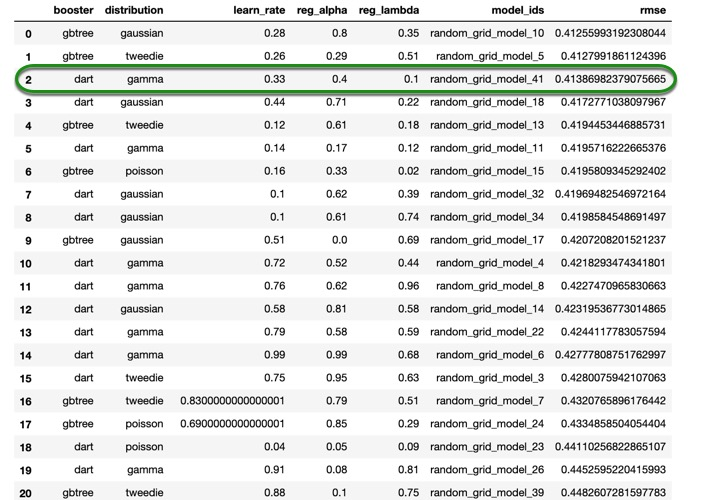

# Introduction to Machine Learning Part 2

## Outline

- [Objective](#objective)
- [Prerequisites](#prerequisites)
- [Task 1: Initial Setup](#task-1-initial-setup)
- [Task 2: Regression Concepts](#task-2-regression-concepts)
- [Task 3: Start Experiment](#task-3-start-experiment)
- [Task 4: Build an XGBoost Model](#task-4-build-an-xgboost-model)
- [Task 5: Build a Deep Learning Model](#task-5-build-a-deep-learning-model)
- [Task 6: Tune the XGBoost Model with H2O GridSearch](#task-6-tune-the-xgboost-model-with-h2o-gridsearch)
- [Task 7: Tune the Deep Learning Model with H2O GridSearch](#task-7-tune-the-deep-learning-model-with-h2o-gridsearch)
- [Task 8: Test Set Performance](#task-8-test-set-performance)
- [Task 9: Challenge](#task-9-challenge)
- [Next Steps](#next-steps)

## Objective
In this tutorial, we will continue using the subset of the Freddie Mac Single-Family dataset to try to predict the interest rate for a loan using H2O’s XGBoost and Deep Learning models. We will explore how to use these models for a regression problem, and we will also demonstrate how to use H2O’s grid search to tune the hyper-parameters of both models. 

## Prerequisites 
- Completion of [Introduction to Machine Learning Part 1](https://h2oai.github.io/tutorials/introduction-to-machine-learning-with-h2o-part-1/#0) tutorial. 
- Some basic knowledge of machine learning. 
- Familiarity with Python. 
- An Aquarium account. If you do not have an Aquarium account, please refer to [Appendix A of Introduction to Machine Learning with H2O - Part 1](https://h2oai.github.io/tutorials/introduction-to-machine-learning-with-h2o-part-1/#13)
- Or Jupyter Notebook installed on your local machine with H2O-3 installed.
    - If you do not have H2O-3, you can follow the installation guide on the [H2O Documentation page](http://docs.h2o.ai/h2o/latest-stable/h2o-docs/downloading.html)
    - Creating an Anaconda Cloud environment, as shown in the installation guide, [Install on Anaconda Cloud](http://docs.h2o.ai/h2o/latest-stable/h2o-docs/downloading.html#install-on-anaconda-cloud) usually is the easiest way to install H2O. This would guarantee that you will have everything that you need to use H2O.

**Note:** We recommend that you follow along on Aquarium, our cloud instance, to get similar results to the ones shown in this tutorial. We also recommend that you go over the concepts section in Task 2 before starting your lab; that way, your instance is not running while you are going over the concepts. 

## Task 1: Initial Setup
The data set we’re using comes from Freddie Mac and contains 20 years of mortgage history for each loan and contains information about "loan-level credit performance data on a portion of fully amortizing fixed-rate mortgages that Freddie Mac bought between 1999 to 2017. Features include demographic factors, monthly loan performance, credit performance including property disposition, voluntary prepayments, MI Recoveries, non-MI recoveries, expenses, current deferred UPB and due date of last paid installment."[1] 

We’re going to use machine learning with H2O to predict the interest rate for each loan. To do this, we will build two regression models: an XGBoost model and a Deep Learning model that will help us find the interest rate that a loan should be assigned. Complete this tutorial to see how we achieved those results.

We will start by importing H2O, the estimators for the algorithms that we will use, and also the function to perform grid search on those algorithms. 

``` python
#Import H2O and other libraries that will be used in this tutorial 
import h2o
import matplotlib as plt
%matplotlib inline

#Import the Estimators
from h2o.estimators.deeplearning import H2ODeepLearningEstimator
from h2o.estimators import H2OXGBoostEstimator

#Import h2o grid search 
import h2o.grid 
from h2o.grid.grid_search import H2OGridSearch
```
We now have to initialize our instance. If you are on Aquarium, it will connect to a local instance; if you are on your own machine, it will launch an instance connected to your machine. 

``` python
import os
import h2o

startup  = '/home/h2o/bin/aquarium_startup'
shutdown = '/home/h2o/bin/aquarium_stop'

if os.path.exists(startup):
    os.system(startup)
    local_url = 'http://localhost:54321/h2o'
    aquarium = True
else:
    local_url = 'http://localhost:54321'
    aquarium = False
```
```
h2o.init(url=local_url)
```


After initializing the H2O cluster, you will see the information shown above. We have an H2O cluster with just one node. If you are working on your machine, click on the link above the cluster information, and it will take you to your **Flow instance** where you can see your models, data frames, plots, and much more. If you are working on Aquarium, go to your lab and click on the **Flow URL,** and it will take you to a window similar to the one below. Keep it open on a separate tab, as we will come back to it later on. 


Next, we will import the dataset. Since we are working with an S3 file,  just specify the path of where the file is located, as shown below:

``` python
#Import the dataset 
loan_level = h2o.import_file("https://s3.amazonaws.com/data.h2o.ai/DAI-Tutorials/loan_level_500k.csv")
```

Now that we have our dataset, we will explore some concepts and then do some exploration of the data and prepare it for modeling.

### References
[1] Our dataset is a subset of the [Freddie Mac Single-Family Loan-Level Dataset.](http://www.freddiemac.com/research/datasets/sf_loanlevel_dataset.html) It contains about 500,000 rows and is about 80 MB.

## Task 2: Regression Concepts

### Regression Analysis/Regressor Model
Regression tries to predict a continuous number (as different from classification, which only categorizes). With a regressor model, you try to predict the exact number from your response column. In our case, we will try to predict the interest rate. You will see later on that some samples might have a 7.5% interest rate, and our regression model will try to predict that number.

There are different types of regression analysis; for example, there is a linear regression, where you fit a straight line to your response based on your predictors, and you try to predict your output with it. Linear regressions are only advised for datasets with a linear distribution. There are also non-linear regressions, which are more useful when you do not have a linear distribution of your response variable.

For regression use cases, H2O supports the following metrics:

- R Squared (R2)
- Mean Squared Error (MSE)
- Root Mean Squared Error (RMSE)
- Root Mean Squared Logarithmic Error (RMSLE)
- Mean Absolute Error (MAE)

In this tutorial, we’ll just focus on the **RMSE** and **MAE.**

**MSE**

The MSE metric measures the average of the squares of the errors or deviations. MSE takes the distances from the points to the regression line (these distances are the “errors”) and squaring them to remove any negative signs. MSE incorporates both the variance and the bias of the predictor.
MSE also gives more weight to larger differences. The bigger the error, the more it is penalized. For example, if your correct answers are 2,3,4 and the algorithm guesses 1,4,3, then the absolute error on each one is exactly 1, so squared error is also 1, and the MSE is 1. But if the algorithm guesses 2,3,6, then the errors are 0,0,2, the squared errors are 0,0,4, and the MSE is a higher 1.333.

**RMSE**

The RMSE metric evaluates how well a model can predict a continuous value. The RMSE units are the same as the predicted target, which is useful for understanding if the size of the error is of concern or not. The smaller the RMSE, the better the model’s performance. RMSE is sensitive to outliers, meaning that when the error is larger, the more it is penalized. 

**MAE**

The MAE is an average of the absolute errors. The MAE units are the same as the predicted target as well as the RMSW, which is also useful for understanding whether the size of the error is of concern or not. The smaller the MAE, the better the model’s performance. MAE is robust to outliers, meaning all errors are penalized equally. 

For a detailed description of the other metrics, please check out the [H2O-3 Documentation - Evaluation Model Metrics Section](http://docs.h2o.ai/h2o/latest-stable/h2o-docs/performance-and-prediction.html#evaluation-model-metrics)


### Based-Tree Algorithms
Before we can talk about XGBoost, we first need to talk about Decision Trees and Trees Ensemble.

#### Decision Trees
Decision trees separate the data into a series of questions, and as the name suggests, it uses a tree-like model of decisions to make a prediction. Decision trees subdivide the dataset and move event outcomes left and right to build the tree model and fit all the data. The series of questions are generated automatically to optimize the separation of the data points depending on what you are trying to find whether you are doing a regression or classification tree. 

Below is a simple example of a classification tree of looking through three different types of animals. We read the decision trees from top to bottom, and in this case, we can see that the first question is to decide whether the animal is a Fish or not. If the animal is not, then we see another question, which is *Does the animal have feathers* and depending on the answer to that question, then a decision is made. If the answer is **Yes,** then the decision tree says the animal is a *Bird,* but if the animal does not have feathers, then the decision tree says it is a *Mammal.* Please note that the tree could continue growing if we were trying to find a specific bird or mammal. 


Decisions trees have many strengths, such as being non-linear, this is very helpful because many times the datasets are not linear. They are robust to correlated features, meaning correlated features don’t really affect their performance. They are also robust to missing values, so if you don’t have some values, the trees are okay with that. Decision trees are also easy to understand, and also fast to train and score. However, they do have some weaknesses, and one of them is that when you do have a linear dataset, they are very inefficient when fitting a linear relationship. Also, they are not very accurate when compared to regularized linear models, or deep learning models, and one of the reasons for that is they tend to overfit. For that reason, we need to study tree ensembles, which is one of the solutions to the accuracy issue of decision trees.   

#### Tree Ensembles 
Trees Ensembles combine several decision trees in order to solve the same problem and make better predictions. One example of tree ensembles is Random Forest, which uses **bagging** or bootstrap aggregation, meaning we fit many different trees on different samples of the data. This is done by shuffling the data and growing a tree to obtain a result from it, then the data is shuffled one more time, and then we grow a new tree and combine the results of each of the trees to improve the overall performance. Another example is Gradient Boosting Machines (GBMs), which use **boosting**. In boosting, the trees are dependent on each other because GBMs fit consecutive trees, each tree solving the net error of the prior tree[1]. So, with GBMs, each tree is fixing up the net error of the entire system. Another example of tree ensembles is eXtreme Gradient Boosting or XGBoost 

#### XGBoost 
XGBoost is another decision-tree-based ensemble that uses boosting to yield accurate models. Similarly to the GBMs, XGBoost builds models sequentially, with each new model trying to solve the net error from the previous model. XGBoost provides parallel tree boosting (also known as GBDT, GBM) that solves many data science problems in a fast and accurate manner. For many problems, XGBoost is one of the best GBM frameworks today. 

##### So why H2O’s XGBoost?
H2O’s XGboost is the same as the regular XGBoost, but using it under H2O, gives you the advantage to use all the features provided by H2O, such as the light data preparation. XGBoost only works with numbers; for that reason, H2O will automatically transform the data into a form that is useful for XGBoost, such as one-hot encode categorical features. H2O will also automatically choose sparse/dense data representation. Since XGBoost, as well as H2O, does in-memory computation, H2O takes advantage of that, and by formatting the data in an acceptable format for XGBoost, as well as doing some optimization, it achieves a fast in-memory computation. Other advantages of H2O’s XGBoost is the ease to use, the ability to use H2O GridSearch to tune it, and also easy deployment. On top of that, you can also use Flow to explore your XGBoost model, and it is also one of the models included in H2O’s AutoML. If you would like to know more about H2O XGBoost implementation, make sure to check out the Documentation section on [XGBoost](http://docs.h2o.ai/h2o/latest-stable/h2o-docs/data-science/xgboost.html#xgboost)

### Deep Learning 
Deep learning is a subset of machine learning that uses neural networks to solve complex problems that other machine learning algorithms have difficulties with, such as image classification, speech recognition, etc. Deep Learning models have an advantage over standard machine learning because they are very effective at learning non-linear derived features from the input features. Neural networks are algorithms based on how the human brain works because they are composed of nodes or commonly known as “neurons,” and thus the name of neural networks. One of the simplest neural network architecture is a single layer perceptron. A perceptron takes binary inputs, as shown in the picture below, and produces a single binary output[2]. 


In the figure above, we see a perceptron with three inputs; these inputs are fed into the neuron, which will then decide if the output should be a zero or one. Simply said, a neuron is a function that takes multiple numeric inputs and yields a numeric output. Below is a representation of a more complex neural network


In the image above, you can see a neural network with two hidden layers, and with an input and output layer. We can say that the input layer has six neurons, the first hidden layer has four neurons, while the second hidden layer has 3, and lastly, the output layer has one neuron. A neural network can have as many hidden layers as the user may find suitable. 
Although deep learning models can solve almost any problem, they tend to be slow and can be hard to use and tune. Nowadays, none of the most popular deep learning frameworks is TensorFlow, as it is an open-source AI library that allows users to create different types of neural networks with many layers. Tensorflow allows you to build Deep Neural Networks(DNNs), which are feedforward multilayer neural networks, among other types of models. TensorFlow also provides DNNs models for classification and for regression use cases as different models. 

#### So why H2O’s Deep Learning?

H2O’s implementation of Deep Learning is based on a multi-layer feedforward artificial neural network that is trained with stochastic gradient descent using back-propagation. The network can contain a large number of hidden layers consisting of neurons with tanh, rectifier, and maxout activation functions. Advanced features such as adaptive learning rate, rate annealing, momentum training, dropout, L1 or L2 regularization, checkpointing, and grid search enable high predictive accuracy. Although DNNs can be very good at finding different patterns on data, they are not very helpful for image classification.
One advantage of H2O implementations is that it is designed to run in parallel across a cluster on very large data. This makes H2O implementation faster than other libraries performing a similar task. Another advantage is that it is fairly easy to use, as the model is instantiated in the same manner as the other H2O estimators. On top of that, you also get the ability to use all the features from H2O with your DNN model. For more information about H2O Deep Learning, make sure you check out the [Documentation Section on Deep Learning](http://docs.h2o.ai/h2o/latest-stable/h2o-docs/data-science/deep-learning.html#deep-learning-neural-networks)

### Resources

[1] [Trevor Hastie - Boosting](https://web.stanford.edu/~hastie/TALKS/boost.pdf)

[2] [Michael A. Nielsen, “Neural Networks and Deep Learning”](http://neuralnetworksanddeeplearning.com/chap1.html)

### Deeper Dive
[Additive Logistic Regression: A statistical view of Boosting](https://projecteuclid.org/download/pdf_1/euclid.aos/1016218223)

## Task 3: Start Experiment

First, let’s take a look at the first ten rows of the dataset in our Jupyter Notebook

```python
loan_level.head()
```


If you scroll to the right, you will see all the columns in the dataset that we are using for this tutorial. 

Now, since we are going to try to predict the interest rate, let’s see some information about the `ORIGINAL_INTEREST_RATE` column.

``` python
loan_level["ORIGINAL_INTEREST_RATE"].describe()
```


From the description above, we can see that the maximum interest rate value is 11.5%, and the minimum is 4.625%, while the average or mean is 7.183%. Our models will have to predict a numerical value from 4.625 to 11.5 based on the predictors that we choose. Let’s take a look at a more graphical representation of our data with a histogram

```python
loan_level["ORIGINAL_INTEREST_RATE"].hist()
``` 


The histogram verifies that the interest rate around 7 and 7.5 is the most frequent one. Now that we have an idea of what our data and our response variable looks like, we can split the dataset.

**Please note that the main goal of this tutorial is to show the usage of some models for regression problems, as well as to tune some of the hyper-parameters of the models. For that reason, we will be skipping any data visualization and manipulation, as well as feature engineering. The aforementioned stages in machine learning are very important, and should always be done; however, they will be covered in later tutorials.**

We will split the dataset into three sets, training, validation, and test set. The reason for having validation and test sets is because we will use the validation set to tune our models, and we will treat the test set as some unseen data in which we will see how our models perform. We will assign 70% of our data to the training set, and 15% to both the validation and test sets. 
Split the dataset and print the distribution of each set

```python
train, valid, test = loan_level.split_frame([0.70, 0.15], seed=42)
print("train:%d valid:%d test:%d" % (train.nrows, valid.nrows, test.nrows))
```

**Output:**
```python
train:350268 valid:74971 test:74898
```

Choose your **y** variable or **response** and the **x** variable, or **predictors**

```python
y = "ORIGINAL_INTEREST_RATE"

ignore = ["ORIGINAL_INTEREST_RATE", 
          "FIRST_PAYMENT_DATE", 
          "MATURITY_DATE", 
          "MORTGAGE_INSURANCE_PERCENTAGE", 
          "PREPAYMENT_PENALTY_MORTGAGE_FLAG", 
          "LOAN_SEQUENCE_NUMBER", 
          "PREPAID", 
          "DELINQUENT", 
          "PRODUCT_TYPE"] 

x = list(set(train.names) - set(ignore))
```

The reason we are ignoring all those columns is that at the time someone would have to decide the interest rate for a loan, they will not have access to that information. For that reason, it would not make sense to train the model with data that will not be available when trying to make predictions. Now we are ready to build our first regression model. 

## Task 4: Build an XGBoost Model
To use the XGBoost estimator, in this tutorial we can just define a random seed (for reproducibility purposes) and the model ID, in case we wanted to save the model and then retrieve it, or to easily access it in Flow. As we mentioned before, we will be tuning our models with the validation set; however, we could also get a validation score using k-fold cross validation from H2O. We will show you how you would use the k-fold cross-validation, but we are going to use the validation set approach because when training the models, and doing the grid search, it will be much faster than using the k-fold cross-validation approach. 

To build your default XGBoost model and to train it, just run the following two lines of code:

```python
xgb = H2OXGBoostEstimator(seed=42, model_id='XGBoost', nfolds=0, keep_cross_validation_predictions = False,)

%time xgb.train(x=x, y=y, training_frame=train, validation_frame=valid)
```
**Note:** You do not need to specify the cross-validation parameters, but we want to show the parameters that you would have to change in order to enable H2O internal cross-validation. If you wanted to use the H2O cross-validation, you would have to set `keep_cross_validation_predictions` to **True** and change `nfolds` to 3, 5, or 10, depending on the number of folds that you want; by doing cross-validation, you no longer need a validation frame. 

After the XGBoost model is done training, you can print the model summary just by typing the name of your model in a new cell and running it as shown below:


When printing the model summary, you will see a complete summary with some of the parameters in your model (in this case, we only see the number of trees). You will see some scoring metrics on your training data, as well as on your validation data, as shown in the image above. From the report, we can see that the MAE, in fact, is lower than the RMSE, this might be due to having some of the interest rates at the far end of our range (such as interest rates as high as 10 and 11, when our mean is 7.2). The training and validation RMSE are **0.4212** and **0.4244**, respectively. This means that according to the RMSE, on average, the predictions are 0.42 percent off from the actual values. While the training and validation MAE are **0.3071** and **0.3108** respectively, which tells us that the predictions are about 0.31 percent off from the actual values, according to the MAE. Since we have a target interest rate range between 4 to 12 percent, we will try to reduce the RMSE when tuning our models as it will penalize larger errors or outliers.

In the model summary, you will also see two tables; the first table is the scoring history, and the second one is the variable importance table (not shown here). Besides looking at the table, we can also take a look at both graphing representations of the scoring history and the variable importance. 

Let’s first plot the scoring history.

```python
xgb.plot()
```


In the plot above, it seems as if only one score is plotted, but that is so because both scores are so close to each other, and you can confirm this by looking at the scoring history table from the model summary. 

We can also print the variable importance plot as follow,

```python
xgb.varimp_plot()
```
You should see an image similar to the one below


We will now do the same in Flow. In the first tutorial, we showed how to load a dataset into Flow and how to split it. However, the data frames that we have in our Jupyter Notebook are also stored in Flow, and we will use it to build our XGBoost model in Flow. 
In your Flow instance, go to the **Assistance** menu, and click on **getFrames** as shown below:


Now, you should see a list of data frames, with all your data frames from the Jupyter Notebook. Look for the data frame with about 350,000 rows and 27 columns, which is our *train* frame. You have three options for each frame, **Build Model,** which lets you build a model using that data frame. **Predict,** which lets you make predictions if you already have a model and **Inspect,** which lets you take a quick look at your data frame. Click on **Build Model** 


You should see an image like the one below, 


From the dropdown menu, choose **XGBoost,** then change the *model_id* to `flow_xgb.` Leave the *training* and *validation frame* as they are. For our Flow model, we will use H2O cross-validation, just so that we can see both types of cross-validation. For the *response_column* choose `ORIGINAL_INTEREST_RATE.` Next, for the *ignored_columns* make sure that the following 8 columns are selected:
- `FIRST_PAYMENT_DATE`
- `MATURITY_DATE` 
- `MORTGAGE_INSURANCE_PERCENTAGE,`
- `PREPAYMENT_PENALTY_MORTGAGE_FLAG,`
- `PRODUCT_TYPE.`
- `LOAN_SEQUENCE_NUMBER, `
- `PREPAID,` 
- `DELINQUENT`


You can change the *seed* to 42 as well. Leave everything else as-is, and scroll all the way down and click on **Build Model.** Once your model is done click on **View**


You should be able to see the model parameters, the scoring history, the variable importance plot, and all the outputs regarding your model. Explore some of the outputs, and when you’re done, return to your Jupyter Notebook. 

We will make some predictions on our validation set. To compare the predictions to the actual value, we are going to bind the two data frames, the predictions and the validation set, as follow:

```python
xgb_def_pred = xgb.predict(valid)
xgb_def_pred.cbind(valid['ORIGINAL_INTEREST_RATE'])
```
You will see a table like the one below


In the first ten predictions, we can see that they are somewhat close to the actual value, except for the first sample, which is more than 1.5% off. We can see that samples such as this one, might make the RMSE higher than the MAE. 

We can also check the model performance with a test, or in this case, with a validation set, and print some of the scores for our model. For now, we will just save the model performance, as we will use later on. 

```python
default_xgb_per = xgb.model_performance(valid)
```
We will now build our next model. 

## Task 5: Build a Deep Learning Model
As mentioned before, the deep learning estimator is fairly easy to use. For our default Deep Learning model, we do not need to define any parameters, but we will define the seed, model id, and we will also make sure that cross-validation is disabled, as we are using a validation frame. 

```python
dl = H2ODeepLearningEstimator(seed=42, model_id='DL',
                              nfolds= 0,
                              keep_cross_validation_predictions = False
                              )
%time dl.train(x=x, y=y, training_frame=train, validation_frame=valid)
```
Print the summary of the model, and notice how the RMSE and MAE are higher than those of the default XGBoost model. 


For our deep learning model, we see that our validation scores are higher than the training scores, but not by much. The training and validation RMSE are **0.4395** and **0.4480,** respectively. And the training and validation MAE are **0.3240** and **0.3298,** respectively. You can also see the scoring history and variable importance table. You can plot both the scoring history and variable importance plot. 

```python
dl.plot()
```


If you wanted to look at the exact number of epochs, you can do so as shown below:

```python
print("epochs = ", dl.params['epochs'])
```
**Output:**
```python
epochs =  {'default': 10.0, 'actual': 10.0}
```

The default number of epochs for a Deep Learning model is 10. We will try to find a number of epochs that will give us a better score when we tune our model.

Let’s take a quick look at the variable importance plot to see how it compares to the variable importance plot from our  XGBoost model.
```python
dl.varimp_plot()
```


As we can see in the image above, the variable importance plot changes a lot compared to the XGBoost. For our Deep Learning model, we see most of the `SELLER_NAME` variables, and the most important variable for our Deep Learning model “Other sellers” is not even included in the top ten for the XGBoost. Also, the top 10 most important variables for the Deep Learning model have almost the same significance, as opposed to the other model.

Save the model performance on the validation set, as we will use it later on for comparison purposes.
```python
default_dl_per = dl.model_performance(valid)
```

To build a Deep Learning model in Flow, you can follow the same instructions as for the XGBoost. Find the training set (you could use the entire dataset since we are using H2O cross-validation, but it would not be a fair comparison, as the model in Flow would be training on more data) click on Build Model, then select **Deep Learning** for the “Select an algorithm” section. Then, change the *model_id,* change *nfolds* from 0 to 5. Select `ORIGINAL_INTEREST_RATE` as the *response_column* and check the following 8 columns for the *ingored_columns* section 
- `FIRST_PAYMENT_DATE,`
- `MATURITY_DATE,`
- `MORTGAGE_INSURANCE_PERCENTAGE,`
- `PREPAYMENT_PENALTY_MORTGAGE_FLAG,` 
- `PRODUCT_TYPE,`
- `LOAN_SEQUENCE_NUMBER,`
- `PREPAID,`
- `DELINQUENT.`

You can leave everything else as-is, and click on **Build Model.** Wait for it to be done, and explore the outputs. How do they compare to the results we obtained from the Jupyter Notebook? Are the validation scores similar? 

Once you’re done exploring your model, you can go back to your Jupyter Notebook, as we will try to tune our models. 

## Task 6: Tune the XGBoost Model with H2O GridSearch
We will use H2O GridSearch to find the best parameters for our XGBoost.

**Note:** If you are not sure what H2O GridSearch is, or how it works, please refer to [Task 7 of H2O-3 Classification Tutorial](https://h2oai.github.io/tutorials/introduction-to-machine-learning-with-h2o-part-1/#8), or go to [Grid Search Section](http://docs.h2o.ai/h2o/latest-stable/h2o-docs/grid-search.html#grid-hyperparameter-search) of the H2O documentation.

We will first try to find the `max_depth` for our XGBoost, as this is one of the most important parameters for an XGBoost model. 

**`max_depth`** defines the number of nodes along the longest path from the start of the tree to the farthest leaf node. By default, the value is 6. We could do a random search along with the other parameters, but when max_depth is large, the model takes longer to train; therefore, in order to do a more efficient random search with the other parameters, we will first find the best value `max_depth`, and we will use 100 trees with early stopping to tune our hyper-parameters.

```python
xgb = H2OXGBoostEstimator(model_id='xgb', ntrees=100,
                          stopping_rounds=5, #default
                          stopping_tolerance=1e-4, #default
                          stopping_metric = "rmse", #default
                          seed=42
    )

hyper_params = {'max_depth' : [5,7,9,10,12,13,15,20]
               }

grid_id = 'depth_grid'

search_criteria = { "strategy":"Cartesian"}

xgb_grid = H2OGridSearch(model=xgb, 
                         hyper_params=hyper_params,
                         grid_id=grid_id,
                         search_criteria=search_criteria
                         )

%time xgb_grid.train(x=x, y=y, training_frame=train, validation_frame = valid)
```
We can get the models trained by the GridSearch with the `.get_grid()` function, and print it in a nice table format with `.sorted_metric_table()` function. 

```python
sorted_xgb = xgb_grid.get_grid(sort_by='rmse',decreasing=False)
sorted_xgb.sorted_metric_table()
```


We will use `max_depth` equal to 9 to try to tune the next parameters. We will keep the same number of trees, at `ntrees=100`. We will start by searching over five parameters, and see if we get any improvement. Here is the list of the five parameters that we will tune.

1\. **`reg_alpha`:** Specify a value for L1 regularization. L1 regularization encourages sparsity, meaning it will make the weights at the leaves become 0. This value defaults to 0.

2\. **`reg_lambda`:** Specify a value for L2 regularization. L2 Regularization makes some of the weights at the leaves to be small, but not zero. This defaults to 1.

3\. **`learn_rate` (alias: `eta`):** Specify the learning rate by which to shrink the feature weights. Shrinking feature weights after each boosting step makes the boosting process more conservative and prevents overfitting. The range is 0.0 to 1.0. This value defaults to 0.3.

4\. **`distribution`:** Specify the distribution (i.e., the loss function). The options are AUTO, Bernoulli, multinomial, gaussian, poisson, gamma, or tweedie. Since our response is numeric, we will just include poisson, Tweedie, Gaussian, and gamma.

5\. **`booster`:** Specify the booster type. This can be one of the following: “gbtree,” “gblinear,” or “dart.” Note that “gbtree” and “dart” use a tree-based model while “gblinear” uses a linear function. This value defaults to “gbtree.”  

Since we have several parameters, we will be doing a random search; we will be using early stopping, and for our stopping criteria, we will set a limit of 100 models or 15 minutes. You can change these settings in the “search_criteria_tune” parameter for the grid search. 

In this grid search, we will use a new parameter introduced in H2O version `3.28.0.1,` which is parallelism. This allows our grid search to train several models at the same time, instead of training one model at the time. When using this feature, it is recommended to set `parallelism` to two times the number of cores in your cluster. In our case, our cluster has 16 cores, meaning we can use `parallelism=32.` To learn more about this feature in H2O, please make you check the blog [Parallel Grid Search in H2O](https://www.pavel.cool/h2o-3/h2o-parallel-grid-search/) by Pavel Pscheidl. 

```python
xgb = H2OXGBoostEstimator(model_id='xgb_grid', max_depth=9, ntrees=100, 
                          stopping_rounds=5, #default
                          stopping_tolerance=1e-4, #default
                          stopping_metric = "rmse", #default
                          seed=42
                          )

hyper_params = {'reg_alpha' : [x*0.01 for x in range(0, 101)],
                'reg_lambda' : [x*0.01 for x in range(0, 101)],
                'learn_rate' : [x*0.01 for x in range(1, 101)],
                'distribution' : ['poisson', 'tweedie', 'gaussian','gamma'],
                'booster' : ['gbtree','gblinear','dart']
               }

search_criteria_tune = {'strategy': "RandomDiscrete",
                   'max_runtime_secs': 900, #15 min  
                   'max_models': 100,  ## build no more than 100 models
                   'seed' : 42 }

xgb_grid = H2OGridSearch(xgb, hyper_params,
                         grid_id = 'random_grid',
                         search_criteria=search_criteria_tune,
                         parallelism=32
                         )

%time xgb_grid.train(x=x, y=y, training_frame=train, validation_frame = valid)
```

The parameters for the best model in the grid search are shown in the image below:

```python
sorted_xgb = xgb_grid.get_grid(sort_by='rmse',decreasing=False)
sorted_xgb.sorted_metric_table()
```

Please note that the results might not be exactly the same.



With the grid search that we just did, setting `parallelism=32` allowed us to train a total of 90 models (not all the models are shown). As you can see, the top model has a gbtree booster with a gaussian distribution, and the second-best model also has a gbtree booster with a tweedie distribution. We can also see that the next two models with the dart booster yield good scores. Since the dart booster configuration yields good results, we will try to tune some extra parameters for the third model, which uses the `dart` booster. Dart booster is a “method to add dropout techniques from the deep neural net community to boosted trees” [1]. We could further tune the best model from the above grid search, and to do so, we could try tuning the `sample_rate,` `col_sample_rate,` `col_sample_rate_per_tree,`  `min_rows` and `gamma` among others. However, we want to show you the Dart functionality of XGBoost. 

These are five extra parameters that we can tune when using Dart boosting, and we will try to see if we can get any improvement by changing some of those parameters

1\. **`normalize_type`:** specify whether the normalization method. This can be one of the following:

- **tree (default):** New trees have the same weight as each of the dropped trees 1 / (k + learning_rate).

- **forest:** New trees have the same weight as the sum of the dropped trees (1 / (1 + learning_rate).

2\. **`one_drop`:** specify whether to enable one drop, which causes at least one tree to always drop during the dropout. This value defaults to FALSE.

3\. **`rate_drop`:** specify a float value from 0 to 1 for the rate at which to drop previous trees during dropout. This value defaults to 0.0.

4\. **`sample_type`:** specify whether the sampling type should be one of the following:
- **uniform** (default): Dropped trees are selected uniformly.
- **weighted**: Dropped trees are selected in proportion to weight.

5\. **`skip_drop`:** specify a float value from 0 to 1 for the skip drop. This determines the probability of skipping the dropout procedure during a boosting iteration. If a dropout is skipped, new trees are added in the same manner as “gbtree.” Note that non-zero `skip_drop` has a higher priority than `rate_drop` or `one_drop`. This value defaults to 0.0.

We will update the parameters that we found in our previous grid search, and to save some time, we will set `normalize_type='forest',` `one_drop=False,` and `sample_type='uniform'.` We will do a quick search for `rate_drop` and `skip_drop.` Based on results from previous experiments, combinations of **low** `rate_drop` with **high** `skip_drop` yielded slightly better results, so we will do that for this grid search. Because this is the third grid search you can skip this step, and use the values that we find. 

``` python
xgb = H2OXGBoostEstimator(model_id='xgb', 
                          max_depth=9, 
                          ntrees=100, 
                          distribution='gamma',
                          reg_alpha= 0.4,
                          reg_lambda= 0.1,
                          learn_rate= 0.33,
                          stopping_rounds=5, #default
                          stopping_tolerance=1e-4, #default
                          stopping_metric = "rmse", #default
                          seed=42,
                          booster = 'dart',
                          normalize_type='forest',
                          one_drop=False,
                          sample_type='uniform'
                          )

hyper_params = { 'rate_drop' : [x*0.025 for x in range(0, 21)], #start from 0 to 0.5 in increments of 0.025
                 'skip_drop' : [x*0.025 for x in range(20, 41)] #start from 0.5 to 1 in increments of 0.025
               }

search_criteria_tune = {'strategy': "RandomDiscrete",
                   'max_runtime_secs': 600, #10 min  
                   'max_models': 100,  # build no more than 100 models
                   'seed' : 42
                       }

xgb_grid = H2OGridSearch(xgb, hyper_params,
                         grid_id = 'dart_booster_grid',
                         search_criteria=search_criteria_tune,
                         parallelism=1
                         )

%time xgb_grid.train(x=x, y=y, training_frame=train, validation_frame = valid)
```

Now let’s retrieve the models from the grid search. 

```python
sorted_xgb = xgb_grid.get_grid(sort_by='rmse',decreasing=False)
sorted_xgb.sorted_metric_table()
```


The score slightly improved from what we obtained in the first random grid search; keep in mind that we are just exploring a small set of models; if we were trying to find the best model, we would have to add a wider range for each parameter and run the grid search for a longer period of time. We could also do a local search with the values we found and see if we could get better results. Let’s do a quick random grid search for our XGBoost in Flow.

Start by building an XGBoost model the same way we did in Task 4. Find the training set (the frame with 350k rows and 27 columns), assign a model id such `flow-xgb-grid` so that it is easy to find the models later on; for now, you can set 
*nfolds* to 3. Choose `ORIGINAL_INTEREST_RATE` for the *response_column,* select the same eight columns as before to be ignored.

- `FIRST_PAYMENT_DATE,`
- `MATURITY_DATE,` 
- `MORTGAGE_INSURANCE_PERCENTAGE,` 
- `PREPAYMENT_PENALTY_MORTGAGE_FLAG,` 
- `PRODUCT_TYPE,`
- `LOAN_SEQUENCE_NUMBER,` 
- `PREPAID,`
- `DELINQUENT`

Change the *seed* to 42, set *ntrees* to 100, and *max_depth* to 9. Since we already did a grid search in our Jupyter Notebook, we will use some of the best values that we found, that way we can save some time. 
First, check the “Grid?” box next to the explanation of *learn_rate.* Then, add the following list of values into the aforementioned parameters `0.24; 0.26; 0.28; 0.30; 0.33; 0.36;` 


Scroll down to the early stopping section, and make sure your settings look similar to ours. 


Keep scrolling down to *distribution* and check the box next to it, again. Now you should be able to select the distributions that you want. Select “gaussian,” “gamma,” and “tweedie”


Scroll down to the **Expert** settings, and check the “Grid?” box for *booster type* and select all three. Lastly, click the “Grid?” box for *reg_lambda* and *reg_alpha*  and add the following list `0.3;0.4;0.5;0.6;0.7;0.8;0.9;` and `0.1;0.2;0.35;0.5;0.6;` respectively. 


Before clicking **“Build Model”** update the “GRID SETTINGS” to the settings shown below:


When you are done, click on **Build Model** and wait for it to finish. We are just letting this grid run for 10 minutes; however, since we are using values that we already know are good for our model, we would expect to get one or two models with good performance. Once it is done, click on **View**, and you should be able to see the following models:


Go ahead and click on the first model. Inspect the results on your own, look for the parameters that were used for the best model, compare the results from flow cross-validation to the results we obtained in the last grid search that we did in the Jupyter Notebook. How do the results compare? How are they different? Did you get the results you were expecting? 

Once you are done, return to the Jupyter Notebook, as we will continue there. 
Let’s retrieve the best model from the grid search and then compare the results from the default model to the tuned model. In order to do so, we also need to save the performance of the best model on the validation set. 

Retrieve the best model from the grid search
```python
best_xgb_model = xgb_grid.models[0] 
best_xgb_model
```
Please note that you can also retrieve any of your models by changing the number inside the brackets. Now save the model performance on the validation set.

```python
tuned_xgb_per = best_xgb_model.model_performance(valid)
```
Print both RMSE and MAE

```python
print("Default XGB RMSE: %.4f \nTuned XGB RMSE:%.4f" % (default_xgb_per.rmse(), tuned_xgb_per.rmse()))
```
**Output:**
```
Default XGB RMSE: 0.4244 
Tuned XGB RMSE:0.4149
```
Our RMSE slightly improved with the tuning that we did. As we mentioned before, we only let each random search run for 15 minutes. To see if we can obtain a much better model, we would have to let it run for much longer. 

We will check the MAE now,
```python
print("Default XGB MAE: %.4f \nTuned XGB MAE:%.4f" % (default_xgb_per.mae(), tuned_xgb_per.mae()))
```
**Output:**
```python
Default XGB MAE: 0.3108 
Tuned XGB MAE:0.2996
```
The MAE also improved, which is a good indication. Our model did improve with the grid search that we did. One more thing that we could do is build an XGBoost model with all the parameters that we found, and increase the number of trees, similar to what we did in the first tutorial. 

Maybe for an interest rate decision, an MAE of 0.30 is good enough as it tells us that, on average, the model would predict a very close interest rate to what someone with “x” characteristics would get. However, for some companies that MAE might be too high, so it all depends on the application to decide whether or not our MAE results are satisfactory. We will see if the Deep Learning model can yield a lower RMSE and MAE.

### Resources
[1] [Dart Boosting](https://xgboost.readthedocs.io/en/latest/tutorials/dart.html)

## Task 7: Tune the Deep Learning model with H2O GridSearch
We will try to tune our Deep Learning model and see if we can improve the scores from the default model. 

Two of the most important parameters of a Deep Learning model are the number of neurons in the hidden layers and the number of epochs. The parameter for both hidden neurons and layers is **“hidden”**, and we can specify the hidden layer sizes. For example, to define a two-hidden-layer model, with 200 neurons in each layer, we would define it as [200,200]. If you wanted to have three hidden layers with 300 neurons in the first layer, 200 in the second one, and 100 in the third one, we would do it as follows [300,200,100]. The **epochs** allows us to specify the number of times to iterate (stream) the dataset, and this value can be a fraction. We will try to find a good size for our hidden layer, and we will take care of the number of epochs with early stopping. 

Since there are so many combinations for the size of hidden layers, the easiest thing to do is to just do a random search and use one of the models that you find. In this tutorial, we will try to find a good size for the hidden layer taking into consideration the time it takes to train, and then we will try to tune that model. We will explore models with up to three hidden layers for you to see, but for the purpose of this tutorial, we will not try to tune a complex model. 

With the code shown below, you can do a random search to explore several sizes of hidden layers. The way we chose the number of neurons is selecting multiples of 165, which is the size of our input layer (although we do not have 165 predictors, we have predictors that have multiple categories, and they all add up to 165, and thus the number of neurons) and we also added two random sizes, 100 and 200, just to see how they perform. 

```python
dl = H2ODeepLearningEstimator(seed=42, model_id='DL',
                              nfolds= 0,
                              keep_cross_validation_predictions = False,
                              stopping_metric='RMSE',
                              epochs=10
                              )

hyper_params = {'hidden' : [[165], [330], [495], [100], [200], 
                            [165, 33], [165, 165], [200, 165], [330, 330], 
                            [165, 330, 165]]             
               }

search_criteria_tune = {'strategy': "Cartesian",
                       }

dl_grid = H2OGridSearch(model=dl, 
                        hyper_params=hyper_params,
                         grid_id = 'hidden_layer_grid',
                         search_criteria=search_criteria_tune
                         )

%time dl_grid.train(x=x, y=y, training_frame=train, validation_frame = valid)
```

Print the results from the grid search:

```python
hidden_per = dl_grid.get_grid(sort_by='rmse', decreasing=False)
hidden_per.sorted_metric_table()
```


**Note:** your grid search results from the Deep Learning model **WILL** be different to ours, that is because the deep learning models are hard to reproduce. Although, if you use the values that we find, you should get similar results at the end. That being said, you can use the values that we provide in the tutorial, or you could use the values that you get from your own grid search and compare the results at the end. 

We ran this grid search several times, and it kept changing, but the model with 165 neurons was one of the most consistent ones, so we chose one hidden layer with 165 neurons to tune the other parameters. 
For deep learning models, the more complex the model, the longer it will take to train. For that reason, in this tutorial, we explore a fairly simple model, with only one hidden layer with 165 neurons. 

For the activation function, we could use the `rectifier` activation function, as it is one of the best amongst the three activation functions in H2O. We could try the `maxout` activation function, but the model usually takes much longer to build. H2O gives us the option to add dropout ratios to our activation functions, and for that reason, we will use the `rectifier_with_dropout` activation function. Therefore, we need to find a good dropout rate for our hidden layer.

**`hidden_dropout_ratios`** improves generalization, which could help our model perform better. The range is >= 0 to <1, and the default is 0.5.

```python
dl = H2ODeepLearningEstimator(
    epochs=10,
    hidden=[165],
    seed=42,
    model_id='DL',
    activation='rectifier_with_dropout'
    )

hyper_params = {'hidden_dropout_ratios' : [[0], [0.01], [0.1], [0.15], [0.25], [0.3], [0.2],
                                           [0.35],[0.5], [0.6], [0.8]]
                                            
    }

search_criteria_tune = {'strategy': "Cartesian"
                }

dl_grid = H2OGridSearch(model=dl, 
                         hyper_params=hyper_params,
                         grid_id = 'dropout_grid',
                         search_criteria=search_criteria_tune,
                         )

%time dl_grid.train(x=x, y=y, training_frame=train, validation_frame = valid)
``` 
Print the models trained 

```python
dropout = dl_grid.get_grid(sort_by='rmse', decreasing=False)
dropout.sorted_metric_table()
```


Based on our grid search, the best value for the `hidden_dropout_ratios` is **0.3,** so for the next grid searches, we will use that value. 

Another parameter that is important in deep learning models is the learning rate. H2O offers a parameter called adaptive_rate(ADADELTA) and is enabled by default. Enabling the adaptive learning rate is roughly equivalent to turning on momentum training (as each model coefficient keeps track of its history), it is only slightly more computationally expensive (it uses an approximate square-root function that only costs a few clock cycles). Also, different hyper-parameters for adaptive learning rate can affect the training speed (at least for Rectifier activation functions, where back-propagation depends on the activation values).

For cases where fastest model training is required (possibly at the expense of highest achievable accuracy), manual learning rates without momentum can be a good option, but in general, adaptive learning rate simplifies the usage of H2O Deep Learning and makes this tool highly usable by non-experts. However, let’s try to disable the adaptive rate for now, and let’s try to find a good learning rate for our model. For the learning rate, higher values result in a less stable model, while lower values lead to slower convergence. In order to specify the learning rate, we must disable `adaptive_rate,` as well as specify a value for the L2 regularization, which will add stability to our model. A suggested value for L2 is **1e-5**. Please keep in mind that we could just use the adaptive learning rate feature, but we would like to show you the option to tune the parameters related to the learning rate. 

We will first start by finding a good learning rate for our model.

```python
dl = H2ODeepLearningEstimator(
    epochs=10,
    hidden=[165],
    seed=42,
    model_id='DL',
    activation = 'rectifier_with_dropout',
    hidden_dropout_ratios=[0.3],
    distribution='auto',
    adaptive_rate=False
    )

hyper_params = { 'rate' : [0.0001, 0.0005, 0.0008, 0.001, 0.0015, 0.0020, 0.003, 0.004, 0.007, 0.009]
                
    }

search_criteria_tune = {'strategy': "Cartesian",
                       }

dl_grid = H2OGridSearch(model=dl, hyper_params=hyper_params,
                         grid_id = 'rate_grid',
                         search_criteria=search_criteria_tune,
                         parallelism=1
                         )

%time dl_grid.train(x=x, y=y, training_frame=train, validation_frame = valid)
```
Print the results

```python
learn_per = dl_grid.get_grid(sort_by='rmse', decreasing=False)
learn_per.sorted_metric_table()
```


The best learning rate according to our results is **0.0015.** Now that we found a good learning rate, we need to tune some parameters that are related to the learning rate. We will try to tune five more parameters, and to do so, we will do a random search with them and see if our model is improved. Below is a short description of the parameters we are going to tune.

1\. **`rate_annealing`:** Learning rate annealing reduces the learning rate to "freeze" into local minima in the optimization landscape.  The annealing rate is the inverse of the number of training samples it takes to cut the learning rate in half.

2\. **`rate_decay`:** The learning rate decay parameter controls the change of learning rate across layers. Meaning that depending on your learning rate and the rate_decay, the learning rate for the weights connecting the input and first hidden layer will be different to the learning rate for the weights connecting the first and the second hidden layer, as for the second layer it will be a smaller value. 

3\. **`momentum_ramp`:** The momentum_ramp parameter controls the amount of learning for which momentum increases (assuming momentum_stable is larger than momentum_start). The ramp is measured in the number of training samples.

4\. **`momentum_stable`:** The momentum_stable parameter controls the final momentum value reached after momentum_ramp training samples. The momentum used for training will remain the same for training beyond reaching that point.

5\. **`momentum_start`:** The momentum_start parameter controls the amount of momentum at the beginning of training

We will run the grid search for 10 minutes and see the results of our last grid search.

``` python
dl = H2ODeepLearningEstimator(
    epochs=10,
    hidden=[165],
    seed=42,
    model_id='DL',
    activation = 'rectifier_with_dropout',
    hidden_dropout_ratios=[0.3],
    distribution='auto',
    adaptive_rate=False,
    l2=1e-5,
    rate=0.0015
    )

hyper_params = { 'rate_annealing' : [1e-6, 1e-7, 1e-8, 1e-5],
                'rate_decay': [1, 0.8, 0.9, 1.1, 1.2],
                'momentum_ramp' : [10000, 15000, 5000, 20000, 50000, 100000],
                'momentum_stable' : [0.9, 0.95, 0.99, 0.999],
                'momentum_start' : [0.9, 0.4, 0.5, 0.7, 0.8]
    }

search_criteria_tune = {'strategy': "RandomDiscrete",
                   'max_runtime_secs': 600, #10 min  
                   'max_models': 100,  ## build no more than 100 models
                   'seed' : 42 
                       }

dl_grid = H2OGridSearch(model=dl, 
                        hyper_params=hyper_params,
                        grid_id = 'rate_random_grid',
                        search_criteria=search_criteria_tune,
                        parallelism=1
                         )

%time dl_grid.train(x=x, y=y, training_frame=train, validation_frame = valid)
```
After it is done, you can print the models from the grid search

```python
learn_per = dl_grid.get_grid(sort_by='rmse', decreasing=False)
learn_per.sorted_metric_table()
```


From the list above, you can retrieve the parameters from the best model. In our case, the best model was the 17th model that was built, or `model_id = rate_random_grid_model_17.` We can see that the RMSE value slightly improved with the grid search that we just did. If you recall, at the beginning of the tutorial, we mentioned that H2O’s DNN model allows you to do checkpointing. The checkpoint option allows you to specify a model key associated with a previously trained model. This will build a new model as a continuation of a previously generated model. Since we were training our model with only 10 epochs, let’s now train the same model with 200 epochs while using early stopping to see if we get better results. Also, set `reproducible=True,` this model will take longer to train, but it will yield similar results when you run it. 

To be able to use checkpointing, we need to retrieve the model from the grid search that we did, and then use the model id to continue training the same model. There are several parameters that can not be changed, and for that reason, we need to specify them one more time; however, this guarantees us that we are training the same model from the grid search, and is not a new model. To learn more about checkpointing, please check the Documentation on [Checkpoint](http://docs.h2o.ai/h2o/latest-stable/h2o-docs/data-science/algo-params/checkpoint.html#checkpoint)

**Note:** that the following model will only be generated if your best model from the previous grid has the same parameters as ours. If you obtained different parameters, make sure you update them before running the following line of code.

```python
best_dl_model = dl_grid.models[0]

dl_checkpoint = H2ODeepLearningEstimator(checkpoint=best_dl_model.model_id,
    epochs=200,
    hidden=[165],
    seed=42,
    model_id='DL_checkpoint',
    activation = 'rectifier_with_dropout',
    hidden_dropout_ratios=[0.3],
    distribution='auto',
    adaptive_rate=False,
    l2=1e-5,
    rate=0.0015,
    momentum_ramp=50000.0,
    momentum_stable=0.999,
    momentum_start=0.7,
    rate_annealing=1.0e-6,
    rate_decay=1.0,
    reproducible=True,                                     
                                         
    stopping_metric='RMSE',
    stopping_tolerance=0.0005,
    stopping_rounds=5
    )

%time dl_checkpoint.train(x=x, y=y, training_frame=train, validation_frame=valid)
```

Please note that we need to specify the parameters that we tuned, because if we don’t, H2O assigns the default values, and most of the parameters that we tuned can not be changed when we do a checkpoint. Print the model summary by typing the name of your model in a new cell and running it, as shown in the image below.


As you can see in the image above, the RMSE and MAE slightly decreased, meaning that by increasing the number of epochs, we were able to improve the performance of our model.

You can also tune a Deep Learning model in Flow, and you would do it in the same way we did with the XGBoost. Give it a try on your own, using the parameters that we found, do a local search with them. For example, since we found the `rate` to be **0.0015,** you could do a grid search where you use the values `0.0010; 0.0012; 0.0017; 0.0019;` 
Try to do the same with some of the other parameters that we found and see if you can get better results. Once you are done with Flow, go back to your Jupyter Notebook. 

Let’s see how our default model performance compares to the tuned one. 

```python
tuned_dl_per = dl_checkpoint.model_performance(valid)
print("Default DL Model RMSE: %.4f \nTuned DL Model RMSE:%.4f" % (default_dl_per.rmse(), tuned_dl_per.rmse()))
```
**Output:**

```python
Default DL Model RMSE: 0.4481 
Tuned DL Model RMSE:0.4168
```
Now print the MAE of both models

```python
print("Default DL Model MAE: %.4f \nTuned DL Model MAE:%.4f" % (default_dl_per.mae(), tuned_dl_per.mae()))
```
**Output:**
```python
Default DL Model MAE: 0.3298 
Tuned DL Model MAE:0.3035
```
As we can see, both scores improved with the grid searches that we did. In fact, our deep learning model had the greatest improvement out of the two models we tuned; however, the XGBoost still performed slightly better than the Deep Learning model. 

We will now see how our models perform on the test set.

### Deep Dive
[Tuning Guide for H2O Deep Learning](https://www.h2o.ai/blog/deep-learning-performance/)

## Task 8:  Test Set Performance
Now that we have done some tuning for our models, we will see how the models would perform on unseen data. Let’s first print the final RMSE for both models. To do so, we need to evaluate the performance of our models on the test set.

```python
dl_test_per = dl_checkpoint.model_performance(test)
xgb_test_per = best_xgb_model.model_performance(test)
```
Print the RMSE for both models:

```python
print("XGBoost Test RMSE: %.4f  \nDeep Learning Model Test RMSE: %.4f " % 
      (xgb_test_per.rmse(), dl_test_per.rmse()))
```
**Output:**
```python
XGBoost Test RMSE: 0.4146  
Deep Learning Model Test RMSE: 0.4194
```

The test RMSE for both models is very close to the validation results, which means that our validation set cross-validation approach worked well. As we mentioned before, the RMSE score adds more penalty to larger errors. Based on the RMSE, on average, the tuned models’ predictions on the test set are about 0.41 off. 

Now, let’s look at the MAE score:

```python
print("XGBoost Test MAE: %.4f  \nDeep Learning model Test MAE: %.4f " % 
      (xgb_test_per.mae(), dl_test_per.mae()))
```
**Output:**
```python 
XGBoost Test MAE: 0.2997  
Deep Learning model Test MAE: 0.3042
```

If we do not take into consideration the penalty that the RMSE adds, and focus on the MAE to evaluate our models, we see that the predictions of the interest rate are 0.3 off from the actual values, which is a good indication that the model is making good predictions for the interest rate. Let’s see some of the predictions for both models.

We will take a look at the first ten predictions of both models, compared to the actual interest value.

```python
xgb_tuned_pred = best_xgb_model.predict(test) #get predictions from xgboost
test_rate_pred=test['ORIGINAL_INTEREST_RATE'].cbind(xgb_tuned_pred)#combined xgb predictions with actual interest rate
dl_tuned_pred = dl_checkpoint.predict(test)#get predictions from Deep Learning Model
test_rate_pred.cbind(dl_tuned_pred)
```


Please note that the `predict` column has the predictions for the XGBoost model, and the `predict0` column has the predictions for the Deep Learning model. As we can see in the image above, both predictions are close to the actual values. Although there might be some predictions that might be very off, the RMSE and MAE proved to us that both models make good predictions. 

**Note:** You will **not** get the exact same results for the Deep Learning model. The values shown in this tutorial for that model are the final values that we obtained, and they should only be a reference for you. You should expect values similar to ours, but not the same.

If you do not want to attempt the challenge in the next task, feel free to shut down your cluster, or you can shut it down after you attempt the challenge.

```
h2o.cluster().shutdown()
```

## Task 9:  Challenge
We tuned the Deep Learning model with only one layer with 165 neurons. Try to tune a Deep Learning model on your own with two layers, or more, and with the number of neurons that you want. You can follow the same procedures as before, but instead of using `[165]` for hidden units, you will have to use something like `[165,165],` and for some parameters such as the dropout ratios, you will need to also have two values, such as `[0.01, 0.01]`, and so on. If you attempt the challenge, you can download your Jupyter Notebook and restart the lab; that way, you have at least 2 hours to tune the new model. You can find our grid search for a neural network with two layers and 165 neurons in each layer on Aquarium. Once you’re done with the tutorial, shut down your cluster, or end the lab.

## Next steps
Please make sure you check our AutoML tutorial - [Introduction to Machine Learning with H2O - Part 3](https://github.com/h2oai/tutorials/blob/master/H2O/introduction-to-machine-learning-with-h2o-part-3/introduction-to-machine-learning-with-h2o-part-3.md#introduction-to-machine-learning-with-h2o---part-3)
