# Intro to ML Model Deployment and Management

## Outline

- [Objective](#objective)
- [Prerequisites](#prerequisites)
- [Task 1: Explore H2O.ai Platform Studio](#task-1-explore-h2oai-platform-studio)
- [Task 2: Shared Driverless AI Project to MLOps](#task-2-shared-driverless-ai-project-to-mlops)
- [Task 3: Machine Learning Operations Concepts](#task-3-machine-learning-operations-concepts)
- [Task 4: Tour of MLOps UI](#task-4-tour-of-mlops-ui)
- [Task 5: Interactive and Batch Scoring via MLOps Model Deployment](#task-5-interactive-and-batch-scoring-via-mlops-model-deployment)
- [Task 6: Challenge](#task-6-challenge)
- [Next Steps](#next-steps)
- [Appendix A: AI Glossary](#appendix-a-ai-glossary)

## Objective

**Machine Learning Operations** is responsible for putting Machine Learning models into production environments. Prior to having these technologies that make it easier to deploy these models into production, operation teams had to manually go through the process of production deployment, which required talent, time and trust. To help make this effort easier for operations teams, H2O.ai developed **MLOps**, which makes sure you can successfully deploy and manage models in production. MLOps has the following capabilities: production model deployment, production model monitoring, production lifecycle management and production model governance, which enable operation teams to scale their model deployments to 50, 500, 1,000 and more models being deployed to production environments in a timely manner. 

By the end of this tutorial, you will predict the **cooling condition** for a **Hydraulic System Test Rig** by deploying a **Driverless AI MOJO Scoring Pipeline** into test development environment similar to production using **MLOps**. The Hydraulic System Test Rig data comes from **[UCI Machine Learning Repository: Condition Monitoring of Hydraulic Systems Data Set](https://archive.ics.uci.edu/ml/datasets/Condition+monitoring+of+hydraulic+systems#)**. Hydraulic System Test Rigs are used to test components in Aircraft Equipment, Ministry of Defense, Automotive Applications, and more [1]. This Hydraulic Test Rig is capable of testing a range of flow rates that can achieve different pressures with the ability to heat and cool to simulate testing under different conditions [2]. Testing the pressure, volume flow and temperature is possible by Hydraulic Test Rig sensors and digital displays. The display panel alerts the user when certain testing criteria is met displaying either a green/red light [2]. A filter blockage panel indicator is integrated into the panel to ensure the Hydraulic Test Rig’s oil is maintained [2]. The cooling filtration solution is designed to minimize power consumption and expand the life of the Hydraulic Test Rig. We are predicting cooling conditions for Hydraulic System Predictive Maintenance. When the cooling condition is low, our prediction tells us that the cooling of the Hydraulic System is close to total failure and we may need to look into replacing the cooling filtration solution soon.

**Figure 1:** Hydraulic System Cylinder Diagram

The Hydraulic System consists of a primary and secondary cooling filtration circuit with pumps that deliver flow and pressure to the oil tank. The oil tank box at the bottom. There is a pressure relief control valve for controlling the rising and falling flows. There is a pressure gauge for measuring the pressure.

### Deep Dive and Resources

[1] [SAVERY - HYDRAULIC TEST RIGS AND BENCHES](https://www.savery.co.uk/systems/test-benches)

[2] [HYDROTECHNIK - Flow and Temperature Testing Components](https://www.hydrotechnik.co.uk/flow-and-temperature-hydraulic-test-bed)

## Prerequisites

- A **Two-Hour MLOps Test Drive**: Test Drive is H2O.ai's Driverless AI and MLOps on the AWS Cloud. No need to download software. Explore all the features and benefits of the H2O Automatic Learning Platform and MLOps.
    - Need a **Two-Hour MLOps Test Drive**? Follow the instructions on [Getting Started with MLOps Test Drive](https://training.h2o.ai/products/tutorial-0-getting-started-with-mlops-test-drive) tutorial.

**Note: Aquarium’s MLOps Test Drive lab has a license key built-in, so you don’t need to request one to use it. Each Driverless AI Test Drive instance will be available to you for two hours, after which it will terminate. No work will be saved. If you need more time to further explore Driverless AI, you can always launch another Test Drive instance or reach out to our sales team via the [contact us form](https://www.h2o.ai/company/contact/).**

## Task 1: Explore H2O.ai Platform Studio

**Driverless AI version 1.9.0** and **MLOps version 0.22.0** can be launched from H2O.ai Platform Studio.

You can **launch Driverless AI** and a new tab will open.

- Click **Login with OpenID**
- For Log In, you can enter `ds1/ds1` or `ds2/ds2`

You can also **launch** MLOps and another new tab will open.

- Click **Login with OpenID Connect**
- For Log In, you can enter `ds1/ds1` or `ds2/ds2`

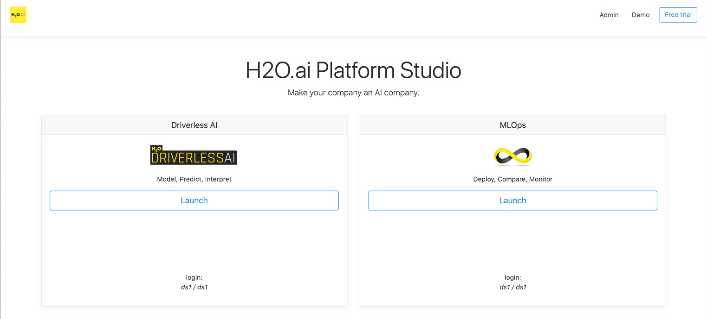

**Figure 2:** H2O.ai Platform Studio Splash Page for Launching Driverless AI and/or MLOps

## Task 2: Shared Driverless AI Project to MLOps

### Open MLOps to See Project

<!-- open-mlops-see-project GIF runs at 6 seconds -->

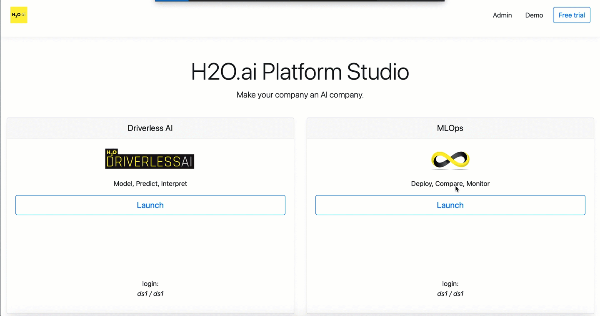

**Figure 10:** Open MLOps to See Driverless AI Project

Note: the MLOps dashboard already has the Driverless AI hydraulic system project for this tutorial; the project was prebuilt in Driverless AI. 

If you want to access the project, you need to access Driverless AI from the H2O.ai Platform Studio Splash Page. Note: the prebuilt project was built under the following credentials: ds1/ds1. Accordingly, you will need to access Driverless AI with such credentials to see the project. 

If you have not launched MLOps from the H2O.ai Platform Studio Splash page, proceed to the following instructions:

1\. Click **Launch** MLOps for another new tab to open.

2\. Click **Login with OpenID Connect**

3\. For Log In, enter `ds1/ds1`. Note: if you already logged into Driverless AI, then you won't have to enter login credentials for MLOps.

### Login to MLOps as ds2 user from separate Browser

<!-- open-mlops-as-ds2-user GIF runs at 9 seconds -->

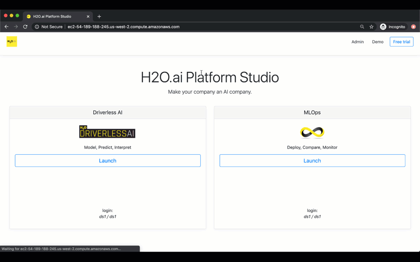

**Figure 11:** Open MLOps as ds2 user

As you can see in the gif above, in the MLOps dashboard for ds2 user, no Driverless AI projects have been shared with that user yet.

If you need help following along with the gif above, follow the instructions below to login to MLOps as **ds2** from a separate browser.

1\. If earlier you launched MLOps in google chrome, then open a new chrome incognito window or a different browser like firefox.

2\. Go to the H2O.ai Platform Studio Splash Page tab for Launching Driverless AI and/or MLOps.

3\. Click **Launch** MLOps for another new tab to open.

4\. Click **Login with OpenID Connect**.

5\. For Log In, enter `ds2/ds2`

Later we will explore the MLOps UI, share a project from ds1 user to ds2 user, deploy the hydraulic model and monitor the model. Before that, let’s become familiar with Machine Learning Operations concepts.

## Task 3: Machine Learning Operations Concepts

If you look through various analyst firms and research organizations, you will find varying percentages of companies that have deployed AI into production. However, depending on the type of organization and where they are in their AI journey, you will find universally that most companies have not broadly deployed AI & Machine Learning in their companies. 70 enterprise leading firms took a survey and only 15% have some kind of AI deployed in production and that is because there are various challenges that come into play when productionizing Machine Learning models [2]. “Perhaps not surprisingly, only 15% have deployed AI broadly into production - because that is where people and process issues come into play.” - NVP Survey of 70 industry leading firms you would recognize [2]

### AI Lifecycle with H2O.ai Products

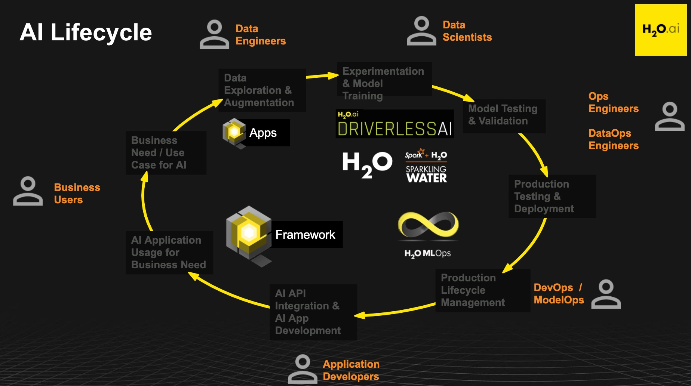

**Figure 12:** AI Lifecycle with H2O.ai Products

In this AI lifecycle process diagram above, business users typically have use cases that they need to solve where they need to improve productivity or customer experiences, etc. Business users will engage teams of data engineers and data scientists to build models. The data engineers can use Q for data exploration while the data scientistis can use Driverless AI or H2O for model training. Once the data scientists feel they have a high quality model based on their experimentation and exploration, those models are typically validated by a data science team. Some of the data scientists can use Driverless AI for model testing and validation. Once you have a model where it looks like it performs well and it does what you expect, it is going to be handed over to a production team. That is what you see on the lower right hand side of the diagram. That production team is going to be responsible for deploying that model onto a production environment and making sure that model is serving the needs of business applications. DevOps Engineers and ModelOps Engineers can use MLOps for Driverless AI model production testing, deployment and lifecycle management.  From there, once you have a model that works, you will typically integrate that model into those business applications. Application Developers can use Q SDK to integrate the MLOps deployed model into the AI application for bringing the predictions to the end user. So, there is sort of a down stream service that you are providing support to that you have to make sure you can meet the service level agreement with. [1]

### Barriers for AI Adoption at Scale

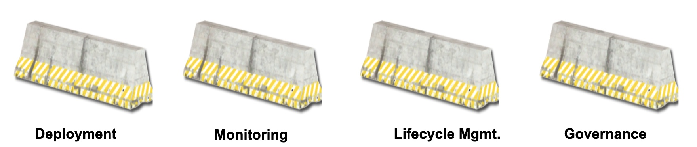

**Figure 13:** Barriers for AI Adoption at Scale

**The Challenge of Model Deployment**

With Machine Learning Operations, it is about getting that initial Machine Learning model into a production environment. That might seem easy if you think that the model that came from Data Science is ready for production use. However, often times what you will find as the model comes from the Data Science team, it kind of gets thrown over the wall to the production team. Then the production team looks at this model object, which is written in Python or R and the production team says we do not know what to do with this thing. Also they do not have the tools on the IT side of the house to deal with Python or R object. The IT team is use to dealing with things like Java or C, etc. [3]

There is often a mismatch between the types of tools and languages that the Data Science team and the IT team use that will cause a huge disconnect, preventing the model from being deployed. Not only that, these two teams are very different in their approach. The Data Science team says there was a business challenge, we were asked to build a model that could predict the outcome and we have done that. Then, the Data Science team says their model does that prediction very well and it is very accurate. Next, the Data Science team hands the model over to the IT team and the IT team has a completely different set of criteria to evaluate that model. The IT team is looking for things like does it perform? Is it fast? Can we scale this model out into production, so that it will be responsive? Can we put it onto a system like Kubernetes, so that it will be resilient? Furthermore, the IT team just has a different set of criteria they are looking for compared to the Data Science team, so that mismatch can just cause a lot of models to never be deployed into production. [3]

**The Challenge of Model Monitoring**

Once you have a model up and running, a lot of times people will realize that they need a partially different kind of model monitoring in order to make sure that the model is healthy in production. So, they have existing software tools that allow them to monitor things like the service and whether the service is up and running and responding to requests. But what they do not have is specific Machine Learning monitoring tools that would allow them to see if the model is still accurate. In some cases, not having monitoring can make some people very uncomfortable because they do not know how the model is behaving. They may not be willing to deploy that model into production because they are really unsure about how it is going to behave. So, they may not be willing to take that risk. [4]

**The Challenge of Model Lifecycle Management**

For Machine Learning models to maintain their accuracy in production, they will sometimes need frequent updates. Those updates need to be done seemlessly, so we do not disrupt the services to those downstream applications. A lot of times, companies will find that they do not have a plan for how they are going to update the model and how they are going to retrain it. Additionally, they do not have a way to seemlessly roll this model out into production. So, they can not even deploy it out in the first place because they do not have a plan for how they are going to manage it. [5]

**The Challenge of Model Governance**

For regulated industries, you will find that if they do not have a plan for how they are going to govern their deployed models, they might not be able to deploy the models in the first place. Governance means you have a plan for how you are going to control access and you have a plan for how to capture information about the models being deployed into production, which you can use for legal and regulatory compliance. So, you will find if you do not have a plan for these things especially if you are in a regulated industry, you might not be able to deploy the model in the first place. [6]

### What "Success" Looks Like Today

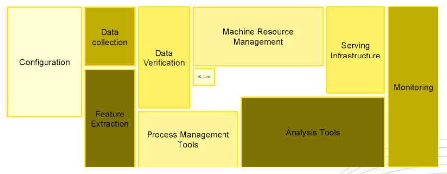

**Figure: 14** A small fraction of real-world ML system is of ML code [8]

As you can imagine, those challenges we discussed earlier create some signficant barriers, but people are still successfully running and deploying models in production today. This diagram above is pulled from the **Hidden Technical Debt in Machine Learning Systems publication**, which was written by folks at Google. This publication talks about how deploying Machine Learning in production, specifically the model itself is a relatively small part of the overall codebase when you are deploying into in production. You can see this small dot in the middle of the diagram, which is the Machine Learning code. All of these other large boxes are the other things you need to do to make sure that machine learning model is running properly. In the publication, they point out how much glue code needs to be written to get that Machine Learning code running in production. [7]

**What does success look like today with companies trying to deploy Machine Learning models in a very manual way or by themselves?** 

Each time we want to deploy a new model into production, there is just an intense and manual effort by the teams including Data Scientists and production teams. They have to get the model up and running, which means writing a lot of custom code, wrapping that model in the code, deploying it out to production. That code tends to be brittle because it is all custom written and when it breaks there is a mad scramble to fix things. It turns out that a lot of people really do not have a plan for what they are going to do for when something breaks or when the model stops working well. So, when something stops working properly it is all hands on deck. The Data Science team has to stop what they are working on, the IT team mobilizes their resources and all of a sudden you have this tiger team trying to figure out what is wrong with this model. Meanwhile, that service you set up, we talked about earlier in AI Lifecycle, supplying results to a downstream application is offline because there was not really a plan for what not to do with this service should there be a problem. [7]

In a lot of cases, models are deployed into production but there is really no monitoring for the Machine Learning part of the code, which means that service could be up and running. That service could be responding to the request, but it may not be accurate anymore. You can imagine that even the ongoing management of such a system with a lot of custom code requires a team of people. So one of the biggest symptons here is that leaders in these organizations will say their Data Scientists are kind of embroiled in these projects. They are spending 60% to 80% of time just managing these production projects and they are not doing new Data Science projects. We have heard it over and over that people will say they just want their Data Scientists to be doing Data Science, not production. However, once you get a few Machine Learning projects up and running in production with the effort of a team of people contantly keeping these projects up and running, business leaders want more than just 1 or 2 projects. Business leaders want more of these projects running because they typically see increased efficiency by say 10% and they see a generated incremental $2 million dollars in revenue. Therefore, now business leaders want to deploy those technologies across a variety of use cases in the business. So once you have a little success even with manual means, your business is going to want to scale from not just 2 to 4, but 2 to 20 or 2 to 50 Machine Learning models in production. So that is what success looks like today for a lot of organizations, which is a very challenging situation. [7]

### What is MLOps?

MLOps is known as Model Operations or ML Ops. In MLOps, we talk about how do we put Machine Learning models into production environments. This is a new set of technologies and practices, which you need to have in your organization in order to make sure that you can successfully deploy and manage models in production. In this system, you hopefully have the right people doing the right things. So your Data Scientists are doing Data Science and they can hand over their models to a production team. The production team can successfully deploy and manage those models on the production environment and these two teams can collaborate together. So if there is ever an issue, the production team can go back to the Data Science team and share the right information with them and they can work together to fix a problem or rebuild a model, etc. In the end, MLOps allows you to scale your adoption of Machine Learning. If you do not have this technology in place, you can imagine you are stuck in that manual model and there is really no way you can scale to 20, 50 or 100 models, much less 10,000 models in production, which is where a lot of us are heading. [9]

### What are the Key Components of MLOps?

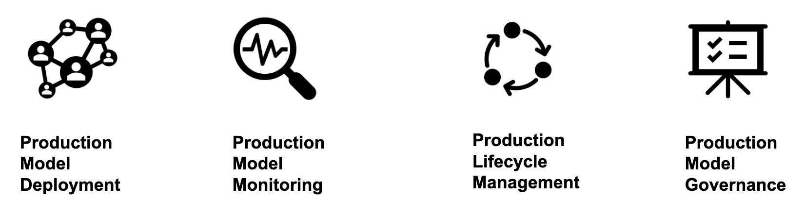

**Figure 15:** MLOps Key Capabilities

The key areas of MLOps are production model deployment, production model monitoring, production lifecycle management and production model governance. 

With MLOps, we want to automate as much of the process of deploying model artifacts onto production and facilitating that collaboration between teams to get the artifacts over into production and get them up and running. [10]

A lot of systems are not designed with Machine Learning in mind. So, for MLOps, we want to have monitoring for things like not just service levels, but also things like data drift. Is the data we trained on similar to the data we are seeing in production? We also want to have monitoring for things like accuracy where we can see if the model is continuing to provide reliable and accurate results [10]

For production lifecycle management, we want to provide the ability to troubleshoot, test and seamlessly upgrade models in production and even rollback models. We want to have other options if we have a problem in production. [10]

For production model governance, we want to ensure that models are safe and compliant with our legal and regulatory standards with things like access control, audit trails and model lineage [10]

### Model Deployment

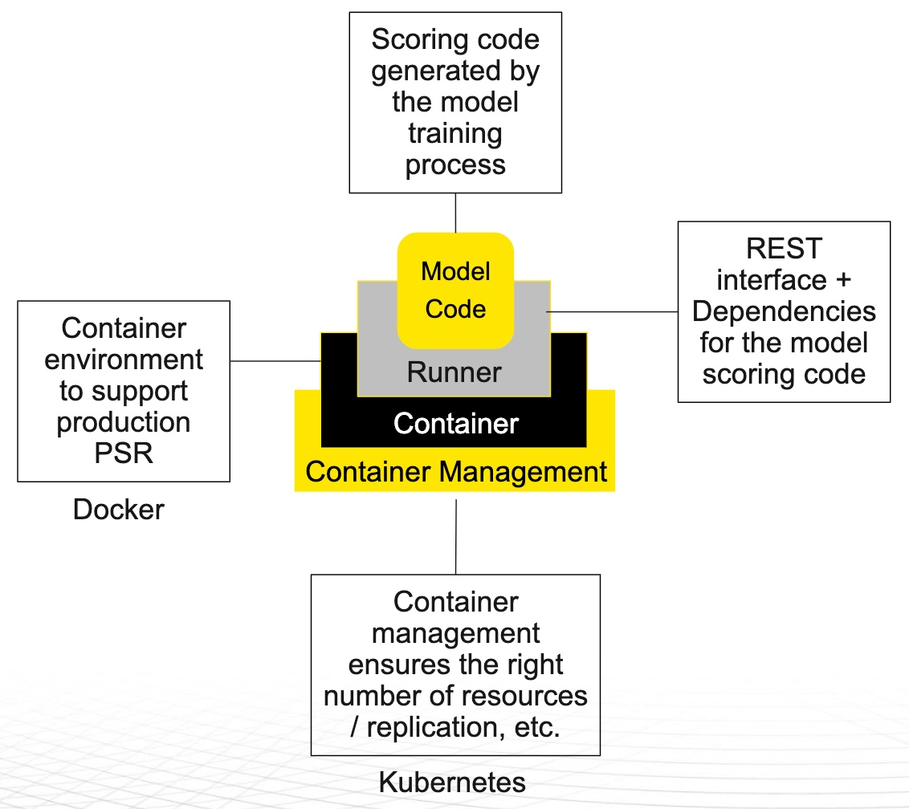

**Figure 16:** Model Code, Runner, Container, Container Management

Earlier in our AI Lifecycle flow diagram, we saw that we built a model and now we are outputting that model from our Data Science system. So, we end up with some code that in the right environment can receive a request with certain data on the request and can respond with a prediction. If you are running this model within a vendor infrastructure, what you will find is that you can deploy this model out to a given vendor's infrastructure. This deployment will allow you to do things like make a rest request to that model and get a response. That is because the vendor has done a lot of work behind the scenes in order to deploy that model into production. [11]

So, what steps must one go through to make rest request and get a scored response? The **first step** requires having a runner to deploy this code. This runner code itself can't respond to your request, it is just a bunch of code. The **second step** requires having something with all the information for the rest interface and dependencies or libraries for that specific model type, so it is able to respond to a request. So if it is a Python model, you will probably need the libraries to run that Python model. There is a bunch of code that you will need to make this model accessible and be able to do scoring. The **third piece** requires having a container. So, what you are doing is wrapping this model with all of its dependencies and everything you need to do scoring. Then you are dropping this wrapped model into a container, which allows you to put this model into a container management system. This container management system will allow you to replicate this model for scaling and supporting high performance environments and more. Kubernetes is the most well known container management system. Similarly, Docker is the most common container environment. So, typically you will Dockerize your model and put it into a Docker container. Then you will deploy one or more containers out onto Kubernetes. [11]

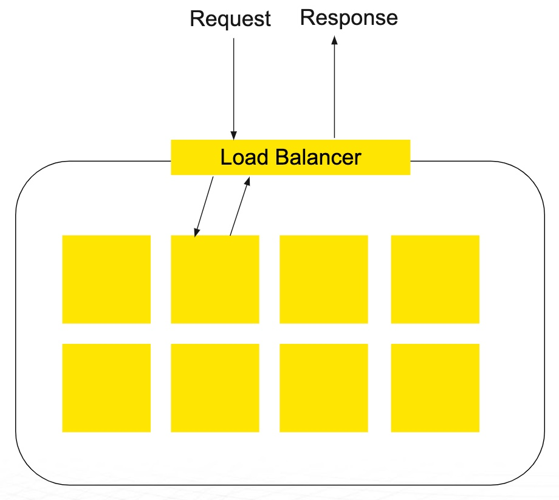

**Figure 17:** Load Balancer, Request, Response

The diagram above shows Kubernetes container management system is going to deploy these model containers behind a load balancer. Depending on how many replicas you tell Kubernetes to set up, it will replicate your model code, it will replicate your scoring code and it will manage the load balancing across those different nodes. So the beauty of Kubernetes is it will automatically replicate your model code, it will manage the request/response and if one of those pods stop responding, it will route the request to another pod and it will spin up additional pods. So, you can see why Kubernetes has become very popular for this type of deployment. [11]

This is a rudimentary look at deployment, but it gives you an idea of the kind of tasks that your production team needs to handle. If you are trying to do it manually, then it gives you a look at the kind of code that you are going to have to write to support each model deployment. [11]

### Monitoring for Machine Learning Models

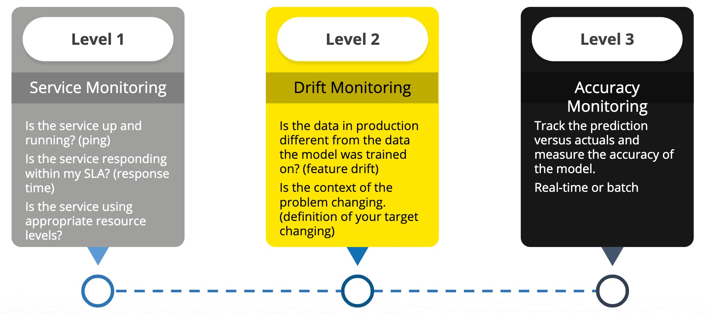

**Figure 18:** Levels of Monitoring for Machine Learning Models

In MLOps, there are different levels of monitoring. **Level 1 is service monitoring**. You can get service monitoring from a variety of software monitoring tools, but you may be surprised how many people still do not have this. They do not even know if a specific model is responding in a timely fashion in their production environment. So that is the first thing you want to make sure you have is some kind of service level monitoring. Is our service up and running? Is it responding within a reasonable timeframe that will meet our service level agreement (SLA) with our downstream application? Another thing you want to monitor is whether the service is using appropriate resource levels because if your model service starts to consume resources and go out of bounds that could not only affect this model, but other models that are potentially sharing resources with that model. Service level monitoring is really important so that you have a level of comfort knowing that the service is responding and that you are delivering results to the downstream application that you are supporting with that model. [12]

**Level 2 is drift monitoring**. Drift monitoring is probably the most important monitoring element within Machine Learning operations. In drift monitoring, what you are looking at is the data in production and whether it is similar enough to the data that was used to train the model. So, we can answer if our model is still accurate. Also, we look at if the significant features of our model start to have significant drift in production. It is a pretty good assumption that the model may not be responding in a way that it did in training. Another area of drift is the general context of the problem. We actually saw this a lot with COVID-19 where models would be trained and not only was the data changing, but the definition of the problem we were trying to predict may have completely changed. So, we want to have monitoring in place that will allow us to not only understand if the data and the features of the model are changing, but is the distribution of the target variable changing? If both of those conditions are true, then there is a pretty good chance that your model is not doing a good job making predictions in production. [12]

**Level 3 is accuracy monitoring**. We want to track the predicted values that the model had and compare them with the actual values from our applications. This could be in real-time or batch. You may be thinking, why one would not do accuracy monitoring first? The truth is accuracy monitoring is notoriously difficult to do in production. That is because you may have the actuals for sometime. So if you are making a loan prediction to determine if someone is likely to repay a loan, then you will not know if they default on that loan until months or years into the future. So you can not track back the accuracy of that prediction for many of those predictions until years later. Also, the accuracy and the actuals are being tracked in some other system. So, you can imagine even if you were doing this in ecommerce and this was about clicks on your website, you still need to get that click data from your website back to your monitoring system. So, there is an IT project that needs to happen just to get that actual data back into a system and compare it with the predictions. There are a handful of other issues related to accuracy monitoring and as you can see, accuracy monitoring may not be as easy as one might think or some executives might think it would be to set up. It may not actually work in a production situation, which leaves you with the first two levels of monitoring tools, especially level two as a set of pretty good monitoring tools. If you have those two levels of monitoring tools, you can be reasonably certain that your model is up and running and performing in production. [12]

### Typical Model Lifecycle Flow for Production Lifecycle Management

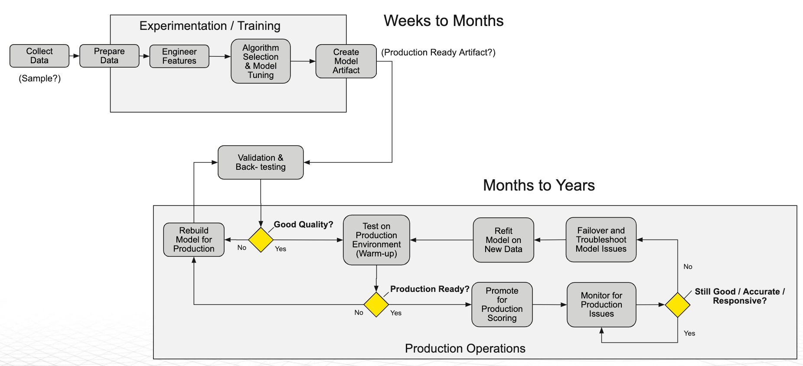

**Figure 19:** Typical Model Lifecycle Flow

We discussed monitoring, now we focus on lifecycle management. **This is a deeper dive into the AI Lifecycle flow we looked at earlier, but with more detail.** [13]

**In the experimentation process, we collect the data, prepare the data, engineer our features, pick the right algorithm, tune our model and end up creating that model artifact.** Now the first question, is that a production ready artifact? You should be very suspicious of any artifact that comes out of a hand built process. You want to make sure that the model is robust and a lot of people will take a model that the Data Science team says is a good model and they will try to deploy it into production and it will break. So, that is why that model artifact typically needs to go through a validation & back-testing process. That testing process should be done by a team other than the team that built that model artifact. So, if you are in a Data Science organization, you should have other folks in the Data Science team. If you are in a regulated industry, you are going to have a validation team that is going to take this model and run it through its paces and they are going to see that the model actually does what the Data Scientist says it does by running it through some tests. But, that testing is focused on the accuracy of the model under a variety of conditions. [13]

**So then what happens next is we ask is that model a good quality model or not?** If the model is good quality, we can push that model over to the production team and that team can set that model up on a test environment where they can do what is called **warm-up**. The production team can see how that model performs when running on the production environment. What if it is not good, what do you do? You need to rebuild that model for production. So, maybe what happens is you have a model that predicts well, but it is not really architected in a way that would be efficient to run in production. So, now what you need to do is take that model and rebuild it in a way that will work in production. We would caution here, you should do this task hand in hand with the Data Science team because ultimately you will have to rebuild that model again and again in production and you want to make sure that you can do that. You do not want to take a model that was built in Python, recode it in Java, assuming that it is going to run for 2 years in production. It maybe a week from now that you need a new version of that model and you do not want to be recoding it every time. So, you want to make sure that this rebuilding process is also scalable. Also, if you rebuild that model, it is going to have to go back through validation to make sure that it is fully tested and works. Once you have a model that is good and works well, you can start to warm it up on a production environment. That means you are going to package this up with Docker, deploy it out to Kubernetes, it is going to be in a test environment and it may not be the actual production environment, but you are going to run it through its paces. You are going to put a load on it and see how it responds. The test system you are running it on now is similar if not exactly the same as the one you are going to run it on in production. [13]

**Then the question we ask, is this model production ready?** If yes, now we can promote that model up to a scoring status. So now we can put that model up as a service and we can say this model is good and it performs well. We are going to promote it to production. So we have gone from development to test to production and we have a model in production that is exposed as a service and can be integrated into our downstream applications. So, now as a production team, we are supporting that model and we are supporting that service as part of our IT infrastructure. However, what if the model does not work in production? What if we tested the model on this production environment and we found that it does not perform as well as it needs to meet the SLA of our downstream apps. Well we must rebuild the model. Now we need to take that information and go back and say this model is not performing fast enough or say it is not doing what we need it to in production and we are going to have to make those changes. The other thing you may find is the model is not resilient enough. We may have to put it under a load and maybe it crashes or does other things. The other things we may find is it did not deal with certain edge conditions that we have in production that we did not see in training and so now we have to fix that. We maybe need to add some additional code to the model so that it can better respond to those conditions that we are seeing in production. In any case, the model is going to go back to the process again, anytime we rebuild the model, we need to make sure it is going to work, we need to warm it up and make sure that works. If it is production ready, we can promote it for scoring. Once we have a service that is ready for scoring, now we have to monitor that service. [13]

**So once we deploy our model, we are going to set up our monitoring around it and try to determine, is that model still good, accurate and responsive?** So we are going to run our monitoring suite on that model now and see if that model works or not and if it is still working well, then keep monitoring it. What happens if the model is not working well? Well you are going to trigger an alert and that alert is going to let the people on the operations team and potentially even the Data Scientists depending on the type of alert know that there is a problem. So, they can do something. So if the model is not working well, then we are going to failover the model since our model is not working as expected. So what do we do next? Ideally we will not just leave that model which is failing up and running, we have some process that says we have some other model we can go to or we know how this system should respond for the next 24 hours while we fix the model. So, there is some process, you will go through, so you can troubleshoot the model and understand what is happening and replace it in production. The most logical thing you can do is retrain that model on new data, which some hear as refitting. The reason we say refit is because we do not mean to completely re-tune the model, we mean refit on a new window of data, maybe more current data is a common fix and then we will need to test that refitted model and make sure that it is working properly. The reason we did not route that arrow from **refit model on new data** up to **validation & back-testing** is because even in banks if you are just refitting, you are not rebuilding. You often times will not have to go back through validation. So you can simply refit on a new window of data, make sure you did not introduce some production issue into the model and you should be ready to go and replace that model in production with a new version. [13]

**So, hopefully this overview workflow gives you an idea of what is going on in lifecycle management and you can see that it is a pretty complex area.** This box in the bottom part in the workflow diagram is production operations. Production operations is really a lot of what the production operations team has to deal with. The operations team does have to deal with rebuilding models whether they do that or whether they are making requests out to the Data Science team to do that work. The operations team does need to have a way to schedule that, so they can plan for that and to get that work done. They need to be able to warm up models in production. They need to be able to have environments for things like development, test and production. So, they can run warm-up testing. So, they can create model services. They need to have all the monitoring suite that they can use. They need to have the ability to manage when things do not go well, to alert the right people, to fix the models and get the models back up and running. So, it is really important to understand that while this experimentation and training phase may take weeks or months to build that initial model, once we come down to the operations phase, that model that you built in Data Science could be running or various versions of that model could be running for months to even years in production. So, taking this production operations phase seriously is really important for your business versus just we built a cool model. Now that cool model actually becomes part of your business and becomes mission critical to your business. That model gets embedded in your business and you need a robust process for managing that model and making sure it is continuing to function properly. [13]

### Production Model Governance

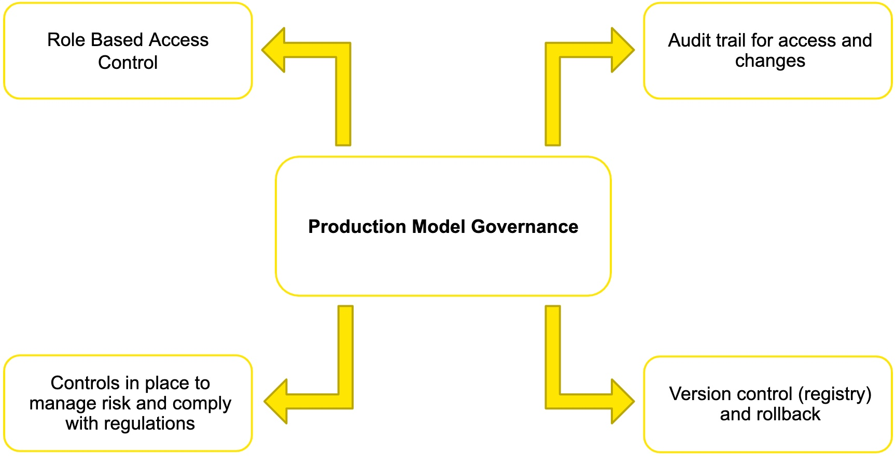

**Figure 20:** Production Model Governance

Production Model Governance must be taken seriously for a variety of reasons. When we put code into production, we need to make sure that code is safe and that it is going to do what we expect as a business. So, production model governance is about ensuring that the right people have access to that code, not the wrong people and that we can prove that. Additionally, production model governance is about ensuring that the service is doing what we expect and that we can prove that. [14]

**So, a lot of what we are doing in governance is tracking what is going on and we are controlling access to make sure our service is being used by the right people and doing what we expect.** So, the first thing you want to look for is do we have access control? So, if we build a system by hand, maybe everybody who has access to our git repo, then has access to our model and anybody who has access to that model could deploy a service and get it up and running. That is probably not how you want to run your production operations. For running your production operations, if you want to have any code that is going to be moved to production, then you should have regulated access and control to that code, so that someone can not accidently break the code or worse someone can not manipulate that code. You should also make sure you have control over the code itself and you have control over the production environments where you are running that code. IT will probably have tight control over those production environments, but make sure that the right people have access to the code and the right people have access to production environments. [14]

**You also want to make sure you have access to an audit trail. So within your production systems, you need to make sure you are tracking what is going on.** So if you replace a model in production or you make changes to that model, you want to make sure you know when that happened, who did it and ideally you want to have some annotations there. These annotations would be notes to tell you why that change was made. So that later on as you are auditing either for legal needs or regulatory needs or even just troubleshooting, you can see what was going on. [14]

**Next up for production governance is version control and rollback.** Earlier we discussed rollback, but from a regulatory requirements perspective, you could think of it this way. You may have a lawsuit 6 months after the prediction was made that alleges that the prediction was biased. What are you going to do about it? You are going to need to go back in time and need to find the version of the model. You can do that through audit trail. You may even have to reproduce that result from 6 months ago. So, you are going to need a full version history of the models ideally and all of the data that was used and even the training data that was used to generate those models that were deployed in production. [14]

**Finally for production governance you will need controls in place to manage risk and comply with regulations for your industry.** So if you are in the banking sector, earlier we talked about the audit trails. You are probably going to have compliance reports that you will need to build and make sure that your controls are in place, so you can do everything that is needed for compliance. So, there may be regulations that say you will need to be able to write out a report on a particular model's performance and/or its bias, etc. You need to make sure you have the right controls and systems in place to meet any requirements for your industry. [14]

### MLOps Impact

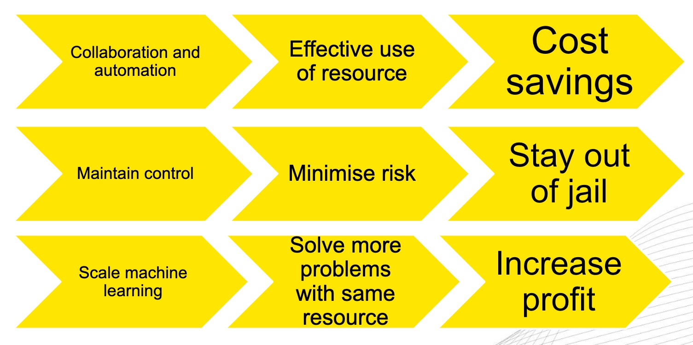

**Figure 21:** MLOps Impact: Cost Savings, Stay out of jail, Increase profit

**What happens when we use technology for Machine Learning operations versus doing this in a manual way? What would you expect to happen?**

The first thing that can happen is we save money as long as we have people effectively collaborating and working together. That means our Data Scientists are doing Data Science, our IT operations team is doing operations and both teams are working together when appropriate for model deployment and management. We do not have a bunch of people wasting time. We are not handcoding a bunch of things that are brittle and potentially going to go to waste. So, if you use a system like MLOps, you can hopefully yield cost savings and efficiency for your business. [15]

The second thing with MLOps is we need to maintain control of these systems. We need to manage the risk of deploying these models into production and having a process that is repeatable, controlled, managed and governed to ultimately help us stay out of jail. So, maintaining control is a really important impact of Machine Learning operations. [15]

Finally, Machine Learning operations allows us to scale Machine Learning in production. So, we will be able to solve more problems for our business with the same resources. We do not need to hire many people because now we have technology in place and processes in place that will allow us to scale up our use of Machine Learning, deploy more models out and build more model services. Thus having this technology allows us to increase revenues, profits, etc. So, the impact of MLOps is varied. We can save money, control the risk to our business, control the risk to ourselves and we can increase revenues and profits by scaling up Machine Learning across our business. [15]

### MLOps Architecture

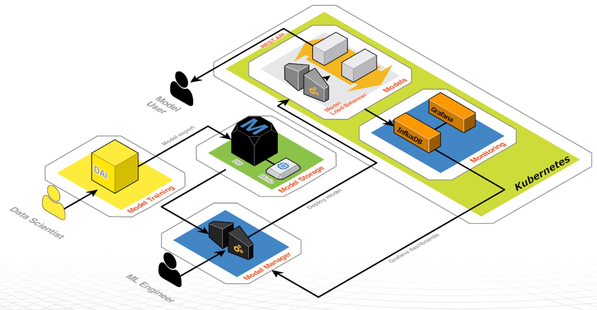

**Figure 22:** MLOps Architecture

**In the MLOps Architecture diagram above, there are two personas, which are the Data Scientists working with Driverless AI and the Machine Learning (ML) Engineers working with MLOps (a Model Manager).**

The Data Scientists will build Driverless AI experiments, which use AutoML behind the scenes to do model training and come up with the Driverless AI model. A Driverless AI model is a scoring pipeline. Driverless AI has two scoring pipelines: a Python scoring pipeline and a MOJO scoring pipeline. Once they have their model built in a Driverless AI experiment, the Data Scientist will link one or more experiments to a Driverless AI project. That Driverless AI project is then saved in the model storage. 

From model storage, the ML Engineer uses MLOps, a Model Manager, to access a Driverless AI project saved in model storage. Then from there, they will either deploy the model to a development environment that simulates the conditions of the production environment or deploy the model to a production environment. MLOps deploys Driverless AI's MOJO scoring pipeline. As the model is deployed into a development or production environment, it is deployed on Kubernetes. The end user is able to make scoring requests to the model REST service, so the model performs predictions and returns the scoring results back to them. As the predictions are being made, that predicted data is being saved in influx DB and also used by grafana dashboard to generate visualizations. We can see the grafana dashboard in Model Manager for monitoring the model's activity as it makes predictions.

### Deep Dive and Resources

- [1] [1:22 - 3:07 | AI Foundations Course, Module 7: Machine Learning Operations, Session 1: MLOps Overview, AI Lifecycle, Speaker: Dan Darnell](https://training.h2o.ai/products/module-7-machine-learning-operations)

- [2] [3:06 - 4:03 | AI Foundations Course, Module 7: Machine Learning Operations, Session 1: MLOps Overview, NVP Survey Quote, Speaker: Dan Darnell](https://training.h2o.ai/products/module-7-machine-learning-operations)

- [3] [4:04 - 6:20 | AI Foundations Course, Module 7: Machine Learning Operations, Session 1: MLOps Overview, Barriers for AI Adoption at Scale, Deployment, Speaker: Dan Darnell](https://training.h2o.ai/products/module-7-machine-learning-operations)

- [4] [6:21 - 7:18 | AI Foundations Course, Module 7: Machine Learning Operations, Session 1: MLOps Overview, Barriers for AI Adoption at Scale, Monitoring, Speaker: Dan Darnell](https://training.h2o.ai/products/module-7-machine-learning-operations)

- [5] [7:19 - 8:09 | AI Foundations Course, Module 7: Machine Learning Operations, Session 1: MLOps Overview, Barriers for AI Adoption at Scale, Lifecycle Management, Speaker: Dan Darnell](https://training.h2o.ai/products/module-7-machine-learning-operations)

- [6] [8:10 - 8:47 | AI Foundations Course, Module 7: Machine Learning Operations, Session 1: MLOps Overview, Barriers for AI Adoption at Scale, Governance, Speaker: Dan Darnell](https://training.h2o.ai/products/module-7-machine-learning-operations)

- [7] [8:48 - 14:09 | AI Foundations Course, Module 7: Machine Learning Operations, Session 1: MLOps Overview, What "Success" Looks Like Today, Speaker: Dan Darnell](https://training.h2o.ai/products/module-7-machine-learning-operations)

- [8] [Hidden Technical Debt in Machine Learning Systems](https://papers.nips.cc/paper/5656-hidden-technical-debt-in-machine-learning-systems.pdf)

- [9] [14:10 - 15:51 | AI Foundations Course, Module 7: Machine Learning Operations, Session 1: MLOps Overview, The Solution MLOps, Speaker: Dan Darnell](https://training.h2o.ai/products/module-7-machine-learning-operations)

- [10] [15:52 - 17:39 | AI Foundations Course, Module 7: Machine Learning Operations, Session 1: MLOps Overview, MLOps Key Capabilities, Speaker: Dan Darnell](https://training.h2o.ai/products/module-7-machine-learning-operations)

- [11] [17:40 - 22:05 | AI Foundations Course, Module 7: Machine Learning Operations, Session 1: MLOps Overview, Model Deployment, Speaker: Dan Darnell](https://training.h2o.ai/products/module-7-machine-learning-operations)

- [12] [22:06 - 27:20 | AI Foundations Course, Module 7: Machine Learning Operations, Session 1: MLOps Overview, Monitoring for Machine Learning Models, Speaker: Dan Darnell](https://training.h2o.ai/products/module-7-machine-learning-operations)

- [13] [29:00 - 38:52 | AI Foundations Course, Module 7: Machine Learning Operations, Session 1: MLOps Overview, Typical Model Lifecycle Flow, Speaker: Dan Darnell](https://training.h2o.ai/products/module-7-machine-learning-operations)

- [14] [41:40 - 45:32 | AI Foundations Course, Module 7: Machine Learning Operations, Session 1: MLOps Overview, Production Model Governance, Speaker: Dan Darnell](https://training.h2o.ai/products/module-7-machine-learning-operations)

- [15] [45:33 - 48:12 | AI Foundations Course, Module 7: Machine Learning Operations, Session 1: MLOps Overview, MLOps Impact, Speaker: Dan Darnell](https://training.h2o.ai/products/module-7-machine-learning-operations)

- [Diagram: What is a MOJO?](https://www.h2o.ai/community/glossary/model-object-optimized-mojo)

- [Diagram: What is a Scoring Pipeline?](https://www.h2o.ai/community/glossary/scoring-pipeline)

## Task 4: Tour of MLOps UI

### Projects Dashboard Tour

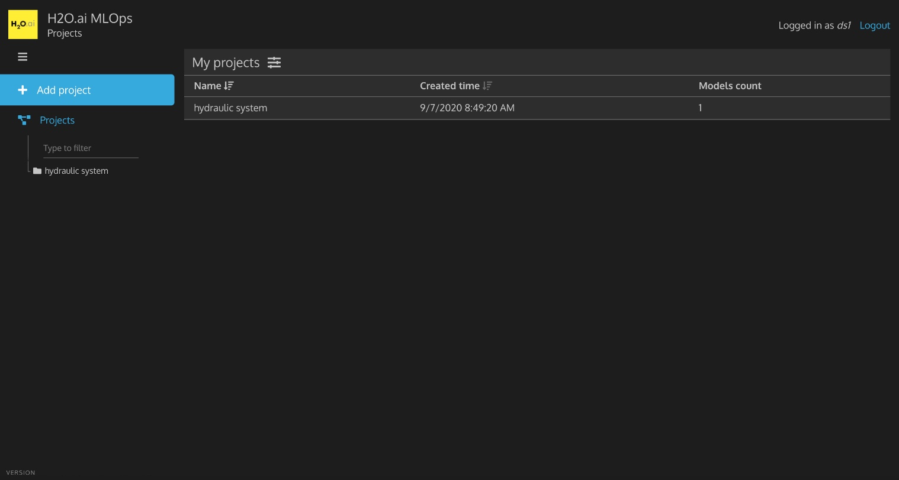

**Figure 23:** MLOps **Projects** Dashboard

- Projects: MLOps projects page shows Driverless AI projects shared with MLOps

- Logged in as ds1

- Logout: logs one out of MLOps

- 3 Bar Menu: by default it has the left sidebar open to see **+Add project**, **Projects**. If you click it **3 bar menu**, it will close left sidebar.

- **+ Add project**

- Projects: list of Driverless AI projects shared with MLOps
    - Type to filter: type keywords to filter for certain content from projects
    - hydraulic system: specific Driverless AI project shared with MLOps

- My projects: table of rows that contain the projects shared with MLOps
    - Name: Driverless AI project name
    - Created time: date and time of the Driverless AI project creation
    - Models count: number of models associated with that Driverless AI project

- Version: the version of MLOps

Click on **hydraulic system** in my projects table.

### Hydraulic System Project Dashboard Tour

**Figure 24:** MLOps **Hydraulic System** Project

- hydraulic system: is the current project

- Projects > hydraulic system

- 3 Bar Menu: by default it has the left sidebar open to see **+Add project**, **Projects**. If you click it **3 bar menu**, it will close left sidebar.

- **+ Add project**
- Projects
- hydraulic system: current open project
    - Alerts: show information about the current state of a deployed model and provide alerts for drift, anomalies, and residuals in the data.
    - Deployments: shows all deployments for a hydraulic system project
    - Models: shows all models that have been exported from Driverless AI into hydraulic system project.
    - Events: provides a list of all events that have occurred in the project, such as the project creation and tagging/untagging of deployments.

- Summary
    - Name: name of this project
    - Project ID: ID of this project
    - Created on: date and time this project was created on
    - Models: number of models in this project
    - Deployments: number of models deployed in this project
    - Alerts: provides alerts for drift, anomalies and residuals in the data as red, orange or green alerts
    - Owner: username of person who created this project

- Share Project: with a different user, such as ds2 user

- Deployments: current models deployed in this project
    - No deployments available.

- Models
    - Model name: name of a model in this project
    - Model ID: ID of a model in this project
    - Created on: date and time a model was created on in this project
    - Scorer: scorer metric used by a model in this project
    - Score: validation score from a model in this project
    - Owner: username of person who created a model in this project
    - Environment: status of what type of environment a model was deployed into for this project
    - Tag: tag name and value to associate with a model in this project
    - Actions: actions that can be performed on this model: deploy it to dev/prod, create a challenger, download an autoreport, etc

- A/B Test: allows you to compare the performance of two or more models

Open a different browser or incognito window and login to MLOps.

A\. To see how to **Share project** with another user in MLOps, refer to section [A: Share Project from ds1 user with ds2 user](#a-share-project-from-ds1-user-with-ds2-user)

B\. To see **More experiments** in this project, refer to section [B: Hydraulic System Models Dashboard](#b-hydraulic-system-models-dashboard)

C\. To see a tour of the **actions** that can be performed on this model **hydraulic_model_1**, refer to section [C: Hydraulic System Projects Models Actions Tour](#c-hydraulic-system-projects-models-actions-tour)

D\. To see the **events** in this project, refer to section [D: Hydraulic System Events Tour](#d-hydraulic-system-events-tour)

For the next task, we are going to deploy the **hydraulic_model_1 model** to a **DEV environment**.

### A: Share Project from ds1 user with ds2 user

<!-- share-ds1-project-with-ds2 GIF runs at 12 seconds -->

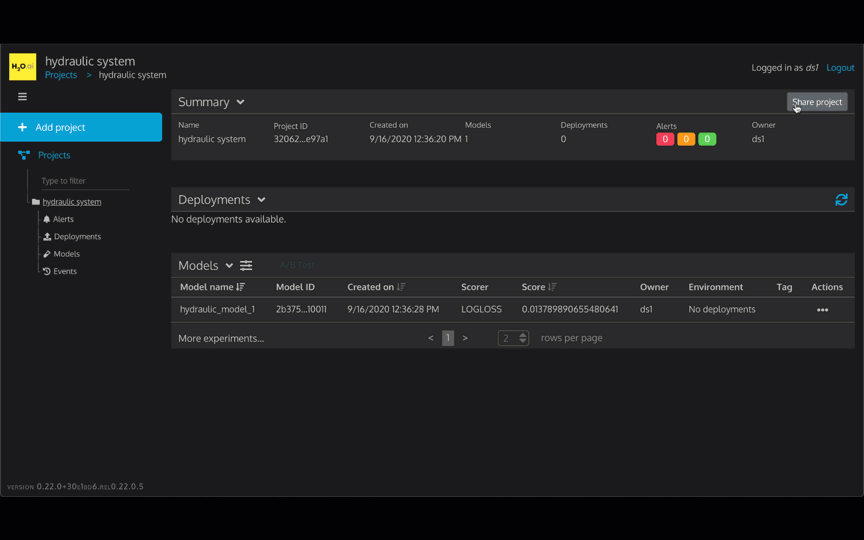

**Figure 25:** Share ds1 user project with ds2 user in MLOps

1\. Type in for **Enter username** field, **ds2**

2\. Click **Share with ds2**

3\.Click the **Close** button at the bottom of the **Share project** modal.

4\. Go back to browser window where you logged into MLOps as **ds2** user and this user now has access to ds1 user's project

So now multiple people in the ML Operations team can collaborate on the same ML project.

### B: Hydraulic System Models Dashboard

<!-- see-more-experiment-models GIF runs at 4 seconds -->

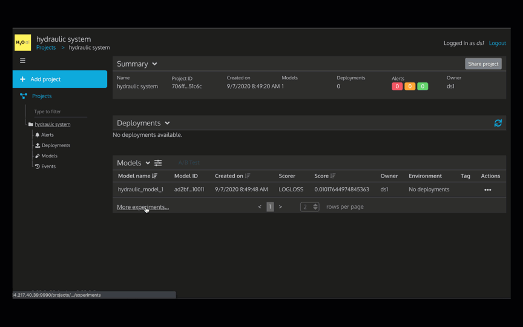

**Figure 26:** See More Experiment Models

1\. Click on **More experiments...**

2\. In the top left, click on Projects > **hydraulic system** to return back to hydraulic system project dashboard.

### C: Hydraulic System Projects Models Actions Tour

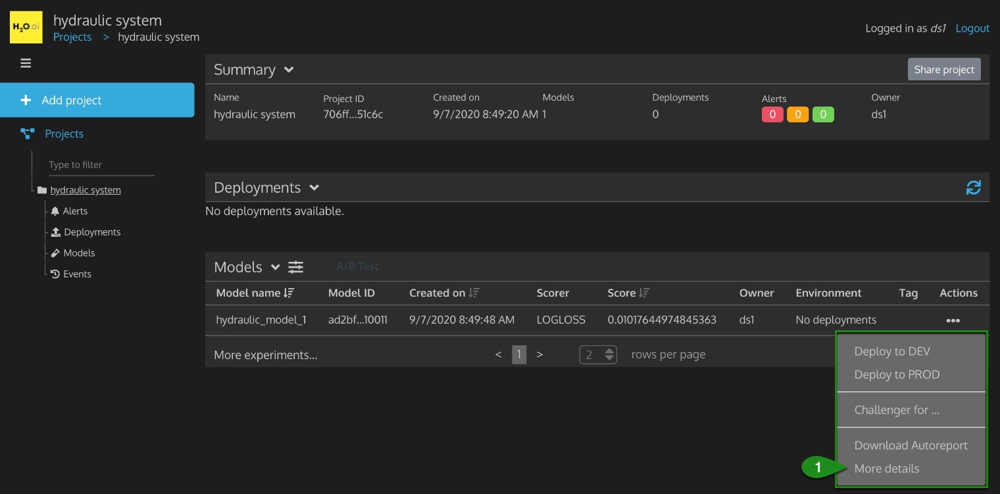

**Figure 27:** project **hydraulic system model actions dropdown menu**

- Deploy to DEV: deploy this model to a development environment, which is a test production environment that simulates the conditions of a production environment

- Deploy to PROD: deploy this model to a production environment

- Challenger for ...: allows you to continuously compare your chosen best model (Champion) to a Challenger model

- Download Autoreport: downloads the same autoreport from Driverless AI

- More details: in depth details on this model

1\. Click on **More details**.

### Hydraulic Model More Details Tour

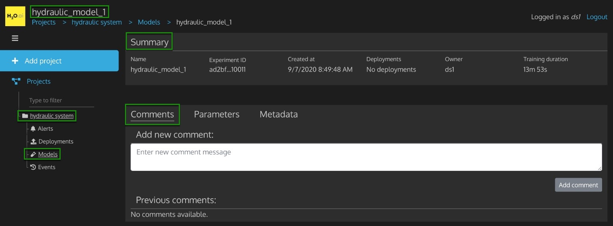

**Figure 28:** project **hydraulic system model comments**

- hydraulic_model_1: the particular model being looked at

- Projects > hydraulic system > Models > hydraulic_model_1

- **+ Add project**
- Projects
- hydraulic system
    - Alerts
    - Deployments
    - **Models**: we were just at the models page and now we are looking at a particular model in this project
    - Events

- Summary
    - Name: name of this model
    - Experiment ID: ID of experiment in which this model was built
    - Created at: date and time this model was created at
    - Deployments: indicates if this model has been deployed and to which environment dev or prod
    - Owner: user who created this model for this project
    - Training duration: time that it took for this model to be trained

- Comments
    - Add new comment: text body for adding a new comment message. This can be helpful for the current user and other users who are working in this project to see an important message about this model
        - Add comment: button for adding a new comment to this model
    - Previous comments: history of comments from users who are working on this model for this project

- Parameters

- Metadata

1\. Proceed to the next section to learn how to **add a comment**.

### Add Comment as ds1 User for Hydraulic Model

<!-- add-comment-hydraulic-model GIF runs at 4 seconds -->

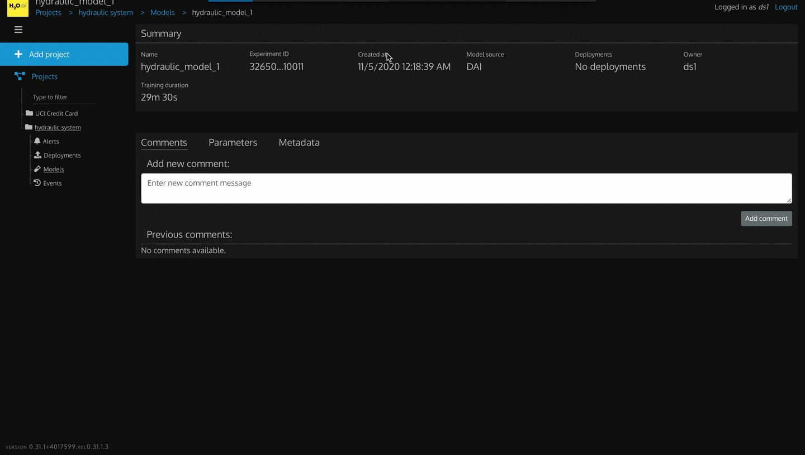

**Figure 29:** Add Comment to Hydraulic Model

1\. Enter the following text `This is a good model for predicting hydraulic cooling condition` in the **Add new comment** body.

2\. Click **Add comment**.

3\. Proceed to the next section to see the **Parameters** tab.

### Hydraulic Model More Details - Parameters Tour

<!-- see-parameters-of-hydraulic-model GIF runs at 3 seconds -->

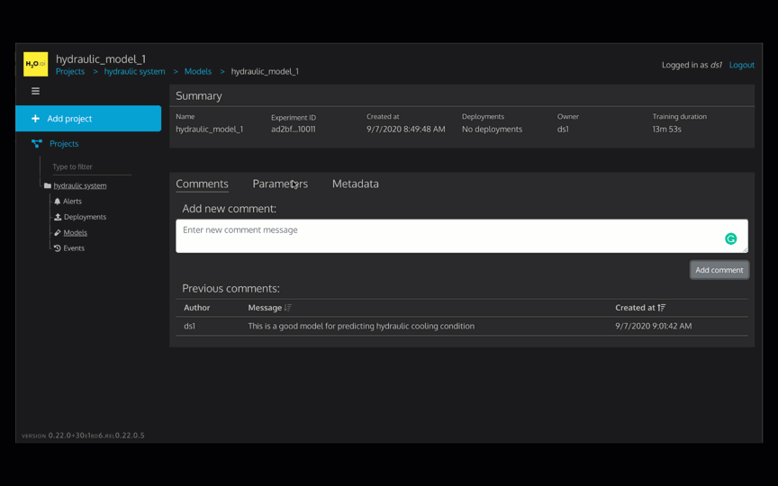

**Figure 30:** See Parameters of Hydraulic Model

- Parameters
    - Parameter: target column is the column we are trying to predict using this model
    - Value: cool_cond_y is the value we are trying to predict using this model

1\. Click on **Parameters** tab.

2\. Proceed to the next section to see **Metadata** tab.

### Hydraulic Model More Details - Metadata Tour

<!-- see-metadata-of-hydraulic-model GIF runs at 15 seconds -->

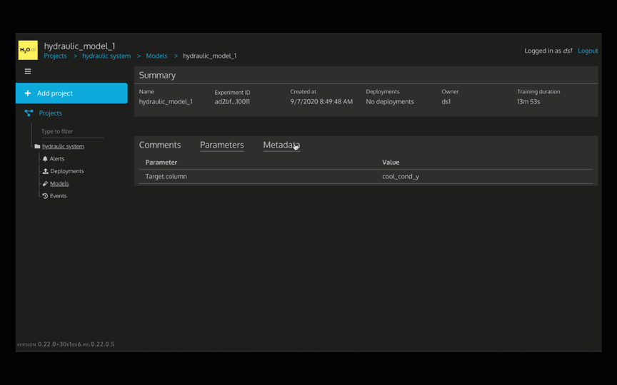

**Figure 31:** See Metadata of Hydraulic Model

1\. Click on **Metadata** tab.

2\. As you scroll down the page, you will see **dai/labels**, **dai/score, dai/scorer, dai/summary** and more metadata.

3\. Click on Projects > **hydraulic system** to return back to hydraulic system project dashboard.

### D: Hydraulic System Events Tour

Events shows us what has happened in this project:

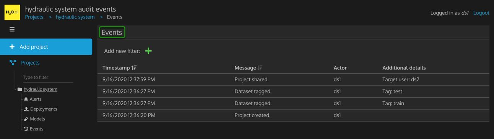

**Figure 32:** project **hydraulic system events**

From the list of events, we can see a **hydraulic_model_1** Experiment deployed by ds1 at a particular date and time.

What else does the list of events tell you has happened in this **hydraulic system** project?

Does your list of events look different than the image above? If yes, that is expected since different events may have happened in your version of the **hydraulic system** project.

1\. Click on Projects > **hydraulic system** to return back to hydraulic system project dashboard. Then next we will deploy the ML model to a dev environment.

## Task 5: Interactive and Batch Scoring via MLOps Model Deployment

1\. In the **Models** table, click on **Actions 3 dot** for **hydraulic_model_1 model**, then click **Deploy to DEV**.

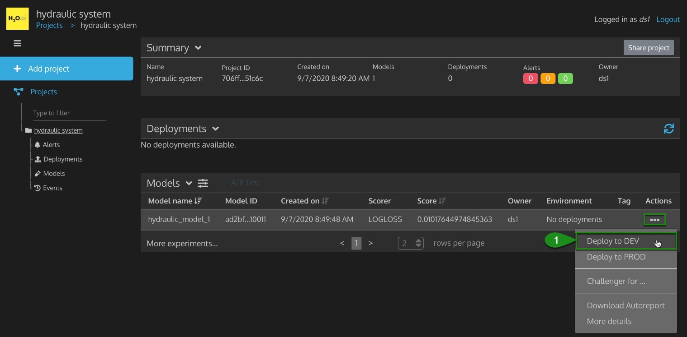

**Figure 33:** Project **Deploy Hydraulic System Model to Dev Environment**

2\. A **Please confirm** modal will appear, click on **Confirm**.

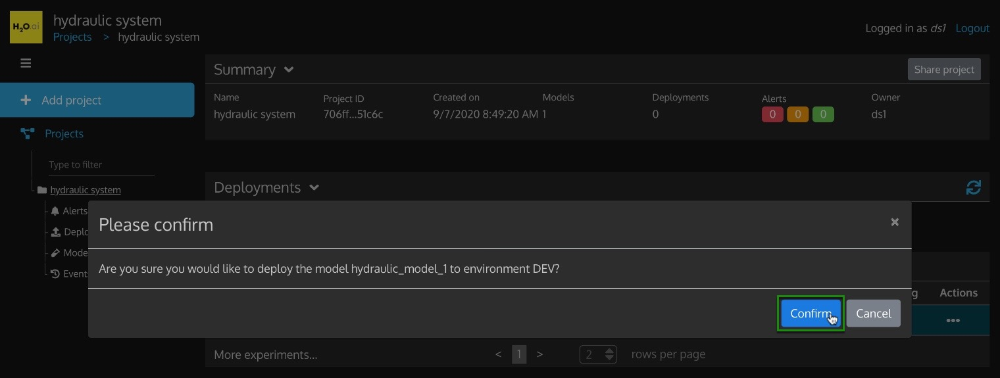

**Figure 34:** Confirm you would like Model Deployed to Dev Environment 

You should see the **Environment** for **hydraulic_model_1** deployed to the **DEV environment**. The **Deployments** table will also update with this model deployed to **DEV** environment. The model's deployment **state** will go from "Deployment data not found, Preparing, Launching to Healthy." As you may have read in the concepts section, deploying the ML model to a development environment, especially a production environment is very difficult to do for many people and organizations. You just did it in about 3 clicks! Congratulations!

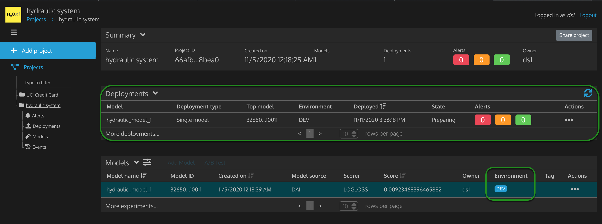

**Figure 35:** Project **Deployed Hydraulic Model to Dev Environment**

- Deployments: is a table of deployed models for this project
    - Model: name of a model that is deployed
    - Deployment type: type of deployment
    - Top model
    - Environment: the environment the model was deployed to either dev or prod
    - Deployed: the date and time that this model was deployed at
    - State: the condition of this model
    - Alerts: info, warning, errors or other alerts associated with this model deployment
    - Actions: the supported actions that can be performed on this model deployment

3\. In the **Deployments** table, click on **Actions 3 dot** for **hydraulic_model_1 model**, then click on **More details**.

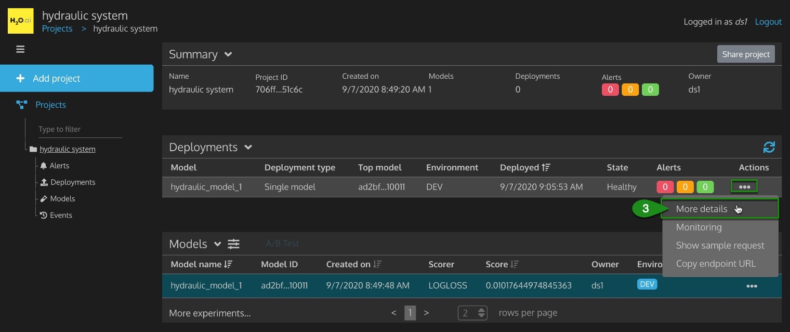

**Figure 36:** Project **Hydraulic System Model Deployment Actions**

- Actions
    - More details: in depth details on this deployed model 
    - Monitoring: visualizations to represent the predictions the model is performing on new data
    - Show sample request: curl sample scoring request to have the model perform a prediction on sample data
    - Copy endpoint URL: the url that this model is running on and that you would send a score request to, so this model makes predictions

You should see more details for **summary** and **model selections** on your model deployment for **hydraulic_model_1**.

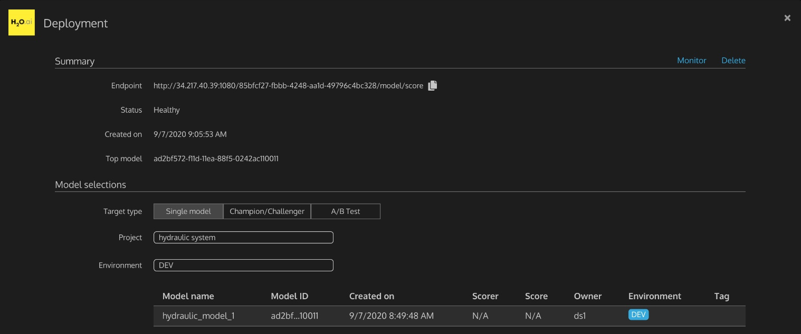

**Figure 37:** Project **Hydraulic System Model Deployment More Details**

- Deployment
- Summary
    - Endpoint: the url that this model is running on and that you would send a score request to, so this model makes predictions
    - Status: the condition of this model
    - Created on: date and time this model deployment was performed
    - Top model: UUID of this model deployment
- Monitor: redirect to grafana dashboard for monitoring this deployed model
- Delete: remove this model deployment
- Model selections
    - Target type: single model, champion/challenger and A/B test
    - Project: name of project this model deployment is associated with
    - Environment: type of environment the model was deployed to either dev or prod
    - Model name: name of model that was deployed
    - Model ID: ID of model that was deployed
    - Created on: date and time this model was created
    - Scorer: scorer metric used for this model
    - Score: validation score using this model
    - Owner: user who deployed this model
    - Environment: current environment this model is deployed to
    - Tag: tag name and value associated with this model deployment
- Save and deploy

4\. Press the **X** button in the top right corner to exit that **Deployment** page for **hydraulic_model_1**.

### Interactive Scoring via Dev Deployment Environment

1\. Click on **Actions 3 dot** for **hydraulic_model_1 model deployments**, then click **Show sample request**.

2\. Click **Copy request** button.

3\. Click **Close** button.

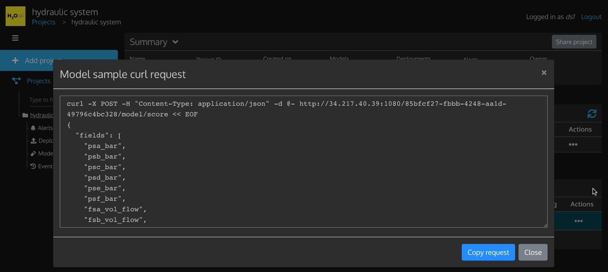

**Figure 38:** Project **Hydraulic System Model Deployment Copy Sample Request**

Paste **Sample Request** into your terminal and press enter:

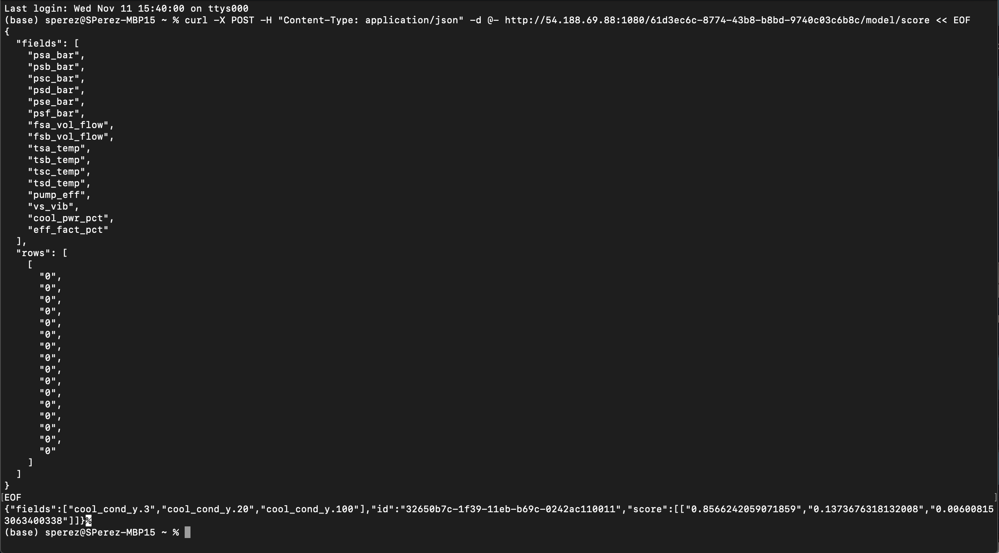

**Figure 39:** Result after **Executing Hydraulic System Model Sample Request**

You can see the result is a classification for hydraulic cooling condition 3, 20, and 100.

### Deep Dive and Resources 

- [Diagram: What is Scoring?](https://www.h2o.ai/community/glossary/scoring-making-predictions-inferencing)

## Task 6: Challenge

### Deploy New Driverless AI Model using MLOps

You just learned how to deploy a Driverless AI model that predicts hydraulic cooling condition. You may have some other problems you are working on solving. Try deploying a new Driverless AI model from a different Diverless AI project using MLOps.

### Perform Predictions via Programmatic Score Requests

So far we have covered making score requests in the command line with curl and through a live code data recipe in Python, but maybe you have an application you want to perform the predictions in? If there is an application that you have built, you could build a Driverless AI model using the dataset, then make score requests using the programming language your application was written in: Java, Python, C++, etc.

## Next Steps

- Check out these webinars that dive into how to productionize Driverless AI models using MLOps:
    - H2O Webinar: [Getting the Most Out of Your Machine Learning with Model Ops](https://www.brighttalk.com/service/player/en-US/theme/default/channel/16463/webcast/418711/play?showChannelList=true)

- Check out these tutorials on Driverless AI model deployment:
    - [Tutorial 4A: Scoring Pipeline Deployment Introduction](https://training.h2o.ai/products/tutorial-4a-scoring-pipeline-deployment-introduction)
    - [Tutorial 4B: Scoring Pipeline Deployment Templates](https://training.h2o.ai/products/tutorial-4b-scoring-pipeline-deployment-templates)

## Appendix A: AI Glossary

Refer to [H2O.ai AI/ML Glossary](https://www.h2o.ai/community/top-links/ai-glossary-search) for relevant MLOps Terms

