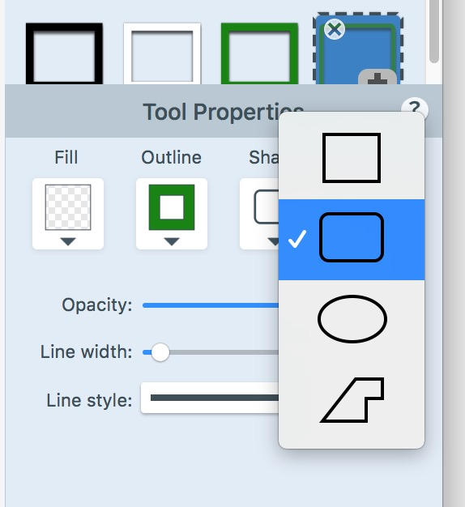
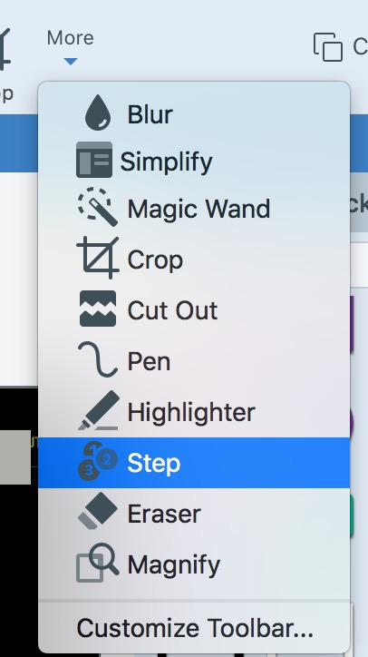

# Sample Tutorial (Tutorial Title)

## Outline
- [Objective](#objective)
- [Prerequisites](#prerequisites)
- [Task 1: Launch Experiment](#task-1-launch-experiment)
- [Task 2: Concepts](#task-2-concepts)
- [Task 3: Title 3](#task-3-title-3) 
- [Task 4: Next Steps](#task-4-next-steps) 
- [Task 5: Appendix A: Title of Appendix](#task-5-appendix-a-tittle-of-appendix)

## Objective

This is the introductory paragraph for the tutorial. This section will typically introduce the topic and the overall goals and objectives of the tutorial. One paragraph that introduces what technologies the user will learn to use in the tutorial to solve the problem for some use case.


## Prerequisites

You will need the following to be able to do this tutorial:

- Basic knowledge of Machine Learning and Statistics
- A Driverless AI environment
- Basic knowledge of Driverless AI or doing the Automatic Machine Learning Intro tutorial.

You can get more information about getting a Driverless AI environ or trial from the following:
- [A Two Hour Test Drive Session](https://github.com/h2oai/tutorials/blob/master/DriverlessAI/Test-Drive/test-drive.md)  
- [H2O Driverless AI License Key](https://github.com/h2oai/tutorials/blob/master/DriverlessAI/automatic-ml-intro-tutorial/automatic-ml-intro-tutorial.md#prerequisites) 
- [H2O Driverless AI Environment and Product Tour](https://github.com/h2oai/tutorials/blob/master/DriverlessAI/automatic-ml-intro-tutorial/automatic-ml-intro-tutorial.md#task-1-get-environment-and-product-tour) 

If you are not familiar with Driverless AI please review and do this tutorial:

- [Automatic Machine Learning Intro Tutorial](https://github.com/h2oai/tutorials/blob/master/DriverlessAI/automatic-ml-intro-tutorial/automatic-ml-intro-tutorial.md) 

## Task 1: Launch Experiment

In this section the goal is to assist readers by providing all necessary steps to launch an experiment, this includes information about the dataset, how to import the dataset into DAI and how to set up the experiment settings to launch the experiment. For each task number, each step of the process. Each new task will start with step ``1\.``. 

Each step of the process should have ``\.`` before the number, press enter after each item so that they can be spaced out correctly, this will help with the HTML layout. 

1\. Start...

2\. Click on ...

3\. Continue with ...

For sub-list use a single space after the ``.`` , no tabs.
  1. Star ...
  2. Click on ...
  3. Continue with ...

To wrapt text in a code fiels use:

- Sinle line 

```wrapping single line with three grave accents```

- Multiple lines

~~~html 
You can also wrap multi-line
text in a code block by using
three tildes along with the name of the language contained in the code block, this will make the code cleaner and
provide the right color of text highlighting on our website.
~~~

## Task 2: Concepts 

For many readers, this might be the first time they are coming across the content. Provide a high-level introduction to concepts that will help readers understand and navigate the tutorial.
The section can be used as a reference for terminology brought up throughout the tutorial.

Save the images with names that are meaningful and reference the action you are tyring to highligh. Also, save the images as with a jpg format and at 75% quality. Try to provide images highlighting significant steps. We try to highlight the steps within the image with tools like Snagit.

In Snagit, we use the color green **(R: 26, G:142, B:18)** and use the shape seen on the image below to highlight items.



To number the steps on an image we use the Snagit **Step** shape below:




If there are items that you want to point further out, make a note after the image, and you can use that space to highlight items on that image as such:

**Note** : Bold any word or DAI tool Keyword using asterisks ** **.

1. **Item 1** : 
2. **Item 2** : Bold the item name so that it can be differentiated from the explanation


## Task 3: Title 3 

The focus of breaking the tutorial into tasks is to allow readers to digest very dense material. For each task have questions for readers along with a high-level analysis.

At the end of every task include any references an additional resources that you think would be useful for readers:

### References

[1] [Reference 1](URL to the reference)

[2] [Reference 2](URL to the reference)

### Deeper Dive and Resources

[1] [Resource 1](URL to resource 1)

[2] [Resource 2](URL to resource 2)

## Task 4: Next Steps 

In the section of **Next Steps**, share with readers other tutorials that would be good for them to work on that can build off from the tutorial they just completed.

- Check out Driverless AI next tutorial ``<Name of next Tutorial>`` where you will learn how to:
  - Evaluate ...
  - Visualize ...
  

## Task 5: Appendix A: Title of Appendix

The appendix can include:

- Additional feature highlights 
- Advanced experimets that build from the featured tutorial
